mm5354
================

``` r
library(broom)
library(dplyr)
```

    ## 
    ## Attaching package: 'dplyr'

    ## The following objects are masked from 'package:stats':
    ## 
    ##     filter, lag

    ## The following objects are masked from 'package:base':
    ## 
    ##     intersect, setdiff, setequal, union

``` r
library(tidyverse)
```

    ## ─ Attaching packages ───────────────────────────────────── tidyverse 1.2.1 ─

    ## ✔ ggplot2 3.1.0     ✔ readr   1.1.1
    ## ✔ tibble  1.4.2     ✔ purrr   0.2.5
    ## ✔ tidyr   0.8.2     ✔ stringr 1.3.1
    ## ✔ ggplot2 3.1.0     ✔ forcats 0.3.0

    ## ─ Conflicts ────────────────────────────────────── tidyverse_conflicts() ─
    ## ✖ dplyr::filter() masks stats::filter()
    ## ✖ dplyr::lag()    masks stats::lag()

``` r
library(patchwork)
library("leaps")
library(faraway)
library(caret)
```

    ## Loading required package: lattice

    ## 
    ## Attaching package: 'lattice'

    ## The following object is masked from 'package:faraway':
    ## 
    ##     melanoma

    ## 
    ## Attaching package: 'caret'

    ## The following object is masked from 'package:purrr':
    ## 
    ##     lift

``` r
library(boot)
```

    ## 
    ## Attaching package: 'boot'

    ## The following object is masked from 'package:lattice':
    ## 
    ##     melanoma

    ## The following objects are masked from 'package:faraway':
    ## 
    ##     logit, melanoma

``` r
library(MPV) 
```

    ## 
    ## Attaching package: 'MPV'

    ## The following object is masked from 'package:boot':
    ## 
    ##     motor

``` r
raw_data <- read_csv("./Data/Cancer_Registry.csv")
```

    ## Parsed with column specification:
    ## cols(
    ##   .default = col_double(),
    ##   avgDeathsPerYear = col_integer(),
    ##   medIncome = col_integer(),
    ##   popEst2015 = col_integer(),
    ##   binnedInc = col_character(),
    ##   Geography = col_character()
    ## )

    ## See spec(...) for full column specifications.

``` r
raw_data = janitor::clean_names(raw_data)
raw_data1 = raw_data %>% 
  select(-binned_inc) %>% 
  separate(geography, c("county", "state"), sep = ",") %>% 
  mutate(county = as.factor(county), 
         state = as.factor(state),
         avg_ann_count = avg_ann_count / pop_est2015*100000) %>% 
  select(target_death_rate, avg_ann_count, everything())

res <- cor(raw_data1 %>% select(-county, -state))
round(res, 3)
```

    ##                            target_death_rate avg_ann_count
    ## target_death_rate                      1.000        -0.058
    ## avg_ann_count                         -0.058         1.000
    ## avg_deaths_per_year                   -0.091        -0.059
    ## incidence_rate                         0.449         0.022
    ## med_income                            -0.429         0.029
    ## pop_est2015                           -0.120        -0.052
    ## poverty_percent                        0.429        -0.123
    ## study_per_cap                         -0.022        -0.005
    ## median_age                             0.004         0.037
    ## median_age_male                       -0.022         0.121
    ## median_age_female                      0.012         0.121
    ## avg_household_size                    -0.037        -0.077
    ## percent_married                       -0.267         0.162
    ## pct_no_hs18_24                         0.088         0.010
    ## pct_hs18_24                            0.262        -0.055
    ## pct_some_col18_24                         NA            NA
    ## pct_bach_deg18_24                     -0.288         0.080
    ## pct_hs25_over                          0.405        -0.016
    ## pct_bach_deg25_over                   -0.485         0.041
    ## pct_employed16_over                       NA            NA
    ## pct_unemployed16_over                  0.378        -0.163
    ## pct_private_coverage                  -0.386         0.128
    ## pct_private_coverage_alone                NA            NA
    ## pct_emp_priv_coverage                 -0.267         0.022
    ## pct_public_coverage                    0.405        -0.055
    ## pct_public_coverage_alone              0.449        -0.134
    ## pct_white                             -0.177         0.099
    ## pct_black                              0.257        -0.098
    ## pct_asian                             -0.186        -0.052
    ## pct_other_race                        -0.190         0.012
    ## pct_married_households                -0.293         0.073
    ## birth_rate                            -0.087         0.095
    ##                            avg_deaths_per_year incidence_rate med_income
    ## target_death_rate                       -0.091          0.449     -0.429
    ## avg_ann_count                           -0.059          0.022      0.029
    ## avg_deaths_per_year                      1.000          0.063      0.223
    ## incidence_rate                           0.063          1.000     -0.001
    ## med_income                               0.223         -0.001      1.000
    ## pop_est2015                              0.978          0.027      0.236
    ## poverty_percent                         -0.067          0.009     -0.789
    ## study_per_cap                            0.063          0.077      0.044
    ## median_age                              -0.025          0.018     -0.013
    ## median_age_male                         -0.148         -0.015     -0.092
    ## median_age_female                       -0.144         -0.009     -0.153
    ## avg_household_size                       0.086         -0.118      0.112
    ## percent_married                         -0.181         -0.120      0.355
    ## pct_no_hs18_24                          -0.137         -0.171     -0.289
    ## pct_hs18_24                             -0.151          0.023     -0.190
    ## pct_some_col18_24                           NA             NA         NA
    ## pct_bach_deg18_24                        0.260          0.047      0.493
    ## pct_hs25_over                           -0.296          0.122     -0.471
    ## pct_bach_deg25_over                      0.293         -0.038      0.705
    ## pct_employed16_over                         NA             NA         NA
    ## pct_unemployed16_over                    0.070          0.100     -0.453
    ## pct_private_coverage                     0.056          0.105      0.724
    ## pct_private_coverage_alone                  NA             NA         NA
    ## pct_emp_priv_coverage                    0.160          0.150      0.747
    ## pct_public_coverage                     -0.132          0.046     -0.755
    ## pct_public_coverage_alone               -0.027          0.041     -0.720
    ## pct_white                               -0.187         -0.015      0.167
    ## pct_black                                0.085          0.113     -0.270
    ## pct_asian                                0.443         -0.008      0.426
    ## pct_other_race                           0.215         -0.209      0.084
    ## pct_married_households                  -0.160         -0.152      0.446
    ## birth_rate                              -0.074         -0.118     -0.010
    ##                            pop_est2015 poverty_percent study_per_cap
    ## target_death_rate               -0.120           0.429        -0.022
    ## avg_ann_count                   -0.052          -0.123        -0.005
    ## avg_deaths_per_year              0.978          -0.067         0.063
    ## incidence_rate                   0.027           0.009         0.077
    ## med_income                       0.236          -0.789         0.044
    ## pop_est2015                      1.000          -0.065         0.056
    ## poverty_percent                 -0.065           1.000        -0.056
    ## study_per_cap                    0.056          -0.056         1.000
    ## median_age                      -0.025          -0.029        -0.026
    ## median_age_male                 -0.177          -0.214        -0.037
    ## median_age_female               -0.178          -0.148        -0.031
    ## avg_household_size               0.110           0.074        -0.004
    ## percent_married                 -0.160          -0.643        -0.038
    ## pct_no_hs18_24                  -0.127           0.288        -0.090
    ## pct_hs18_24                     -0.152           0.094        -0.057
    ## pct_some_col18_24                   NA              NA            NA
    ## pct_bach_deg18_24                0.248          -0.387         0.064
    ## pct_hs25_over                   -0.312           0.194        -0.085
    ## pct_bach_deg25_over              0.297          -0.532         0.109
    ## pct_employed16_over                 NA              NA            NA
    ## pct_unemployed16_over            0.051           0.655        -0.032
    ## pct_private_coverage             0.053          -0.823         0.093
    ## pct_private_coverage_alone          NA              NA            NA
    ## pct_emp_priv_coverage            0.159          -0.683         0.100
    ## pct_public_coverage             -0.160           0.651        -0.051
    ## pct_public_coverage_alone       -0.041           0.799        -0.056
    ## pct_white                       -0.190          -0.509         0.023
    ## pct_black                        0.073           0.512        -0.020
    ## pct_asian                        0.464          -0.157         0.063
    ## pct_other_race                   0.241           0.047        -0.015
    ## pct_married_households          -0.128          -0.605        -0.052
    ## birth_rate                      -0.058          -0.012         0.011
    ##                            median_age median_age_male median_age_female
    ## target_death_rate               0.004          -0.022             0.012
    ## avg_ann_count                   0.037           0.121             0.121
    ## avg_deaths_per_year            -0.025          -0.148            -0.144
    ## incidence_rate                  0.018          -0.015            -0.009
    ## med_income                     -0.013          -0.092            -0.153
    ## pop_est2015                    -0.025          -0.177            -0.178
    ## poverty_percent                -0.029          -0.214            -0.148
    ## study_per_cap                  -0.026          -0.037            -0.031
    ## median_age                      1.000           0.129             0.125
    ## median_age_male                 0.129           1.000             0.934
    ## median_age_female               0.125           0.934             1.000
    ## avg_household_size             -0.032          -0.343            -0.368
    ## percent_married                 0.046           0.450             0.375
    ## pct_no_hs18_24                  0.006           0.100             0.136
    ## pct_hs18_24                     0.051           0.241             0.243
    ## pct_some_col18_24                  NA              NA                NA
    ## pct_bach_deg18_24              -0.017          -0.034            -0.071
    ## pct_hs25_over                   0.037           0.318             0.345
    ## pct_bach_deg25_over            -0.020          -0.132            -0.181
    ## pct_employed16_over                NA              NA                NA
    ## pct_unemployed16_over           0.019          -0.143            -0.111
    ## pct_private_coverage            0.005           0.082             0.047
    ## pct_private_coverage_alone         NA              NA                NA
    ## pct_emp_priv_coverage          -0.037          -0.209            -0.252
    ## pct_public_coverage             0.049           0.399             0.455
    ## pct_public_coverage_alone      -0.003           0.002             0.048
    ## pct_white                       0.035           0.398             0.340
    ## pct_black                      -0.017          -0.243            -0.157
    ## pct_asian                      -0.038          -0.238            -0.259
    ## pct_other_race                 -0.030          -0.267            -0.274
    ## pct_married_households          0.015           0.222             0.162
    ## birth_rate                     -0.008          -0.104            -0.099
    ##                            avg_household_size percent_married
    ## target_death_rate                      -0.037          -0.267
    ## avg_ann_count                          -0.077           0.162
    ## avg_deaths_per_year                     0.086          -0.181
    ## incidence_rate                         -0.118          -0.120
    ## med_income                              0.112           0.355
    ## pop_est2015                             0.110          -0.160
    ## poverty_percent                         0.074          -0.643
    ## study_per_cap                          -0.004          -0.038
    ## median_age                             -0.032           0.046
    ## median_age_male                        -0.343           0.450
    ## median_age_female                      -0.368           0.375
    ## avg_household_size                      1.000          -0.101
    ## percent_married                        -0.101           1.000
    ## pct_no_hs18_24                          0.065          -0.012
    ## pct_hs18_24                             0.027           0.133
    ## pct_some_col18_24                          NA              NA
    ## pct_bach_deg18_24                      -0.061           0.053
    ## pct_hs25_over                          -0.139           0.102
    ## pct_bach_deg25_over                     0.014           0.104
    ## pct_employed16_over                        NA              NA
    ## pct_unemployed16_over                   0.132          -0.551
    ## pct_private_coverage                   -0.144           0.449
    ## pct_private_coverage_alone                 NA              NA
    ## pct_emp_priv_coverage                   0.011           0.233
    ## pct_public_coverage                    -0.135          -0.247
    ## pct_public_coverage_alone               0.061          -0.460
    ## pct_white                              -0.188           0.677
    ## pct_black                               0.030          -0.622
    ## pct_asian                               0.132          -0.149
    ## pct_other_race                          0.229          -0.105
    ## pct_married_households                  0.091           0.870
    ## birth_rate                              0.076           0.141
    ##                            pct_no_hs18_24 pct_hs18_24 pct_some_col18_24
    ## target_death_rate                   0.088       0.262                NA
    ## avg_ann_count                       0.010      -0.055                NA
    ## avg_deaths_per_year                -0.137      -0.151                NA
    ## incidence_rate                     -0.171       0.023                NA
    ## med_income                         -0.289      -0.190                NA
    ## pop_est2015                        -0.127      -0.152                NA
    ## poverty_percent                     0.288       0.094                NA
    ## study_per_cap                      -0.090      -0.057                NA
    ## median_age                          0.006       0.051                NA
    ## median_age_male                     0.100       0.241                NA
    ## median_age_female                   0.136       0.243                NA
    ## avg_household_size                  0.065       0.027                NA
    ## percent_married                    -0.012       0.133                NA
    ## pct_no_hs18_24                      1.000       0.085                NA
    ## pct_hs18_24                         0.085       1.000                NA
    ## pct_some_col18_24                      NA          NA                 1
    ## pct_bach_deg18_24                  -0.381      -0.389                NA
    ## pct_hs25_over                       0.217       0.439                NA
    ## pct_bach_deg25_over                -0.397      -0.405                NA
    ## pct_employed16_over                    NA          NA                NA
    ## pct_unemployed16_over               0.181       0.131                NA
    ## pct_private_coverage               -0.455      -0.254                NA
    ## pct_private_coverage_alone             NA          NA                NA
    ## pct_emp_priv_coverage              -0.430      -0.244                NA
    ## pct_public_coverage                 0.319       0.278                NA
    ## pct_public_coverage_alone           0.327       0.234                NA
    ## pct_white                          -0.157       0.045                NA
    ## pct_black                           0.117      -0.025                NA
    ## pct_asian                          -0.218      -0.200                NA
    ## pct_other_race                      0.126      -0.060                NA
    ## pct_married_households              0.005       0.120                NA
    ## birth_rate                          0.126       0.058                NA
    ##                            pct_bach_deg18_24 pct_hs25_over
    ## target_death_rate                     -0.288         0.405
    ## avg_ann_count                          0.080        -0.016
    ## avg_deaths_per_year                    0.260        -0.296
    ## incidence_rate                         0.047         0.122
    ## med_income                             0.493        -0.471
    ## pop_est2015                            0.248        -0.312
    ## poverty_percent                       -0.387         0.194
    ## study_per_cap                          0.064        -0.085
    ## median_age                            -0.017         0.037
    ## median_age_male                       -0.034         0.318
    ## median_age_female                     -0.071         0.345
    ## avg_household_size                    -0.061        -0.139
    ## percent_married                        0.053         0.102
    ## pct_no_hs18_24                        -0.381         0.217
    ## pct_hs18_24                           -0.389         0.439
    ## pct_some_col18_24                         NA            NA
    ## pct_bach_deg18_24                      1.000        -0.384
    ## pct_hs25_over                         -0.384         1.000
    ## pct_bach_deg25_over                    0.600        -0.741
    ## pct_employed16_over                       NA            NA
    ## pct_unemployed16_over                 -0.309         0.082
    ## pct_private_coverage                   0.488        -0.222
    ## pct_private_coverage_alone                NA            NA
    ## pct_emp_priv_coverage                  0.451        -0.223
    ## pct_public_coverage                   -0.422         0.428
    ## pct_public_coverage_alone             -0.422         0.297
    ## pct_white                              0.069         0.188
    ## pct_black                             -0.094        -0.024
    ## pct_asian                              0.346        -0.437
    ## pct_other_race                         0.007        -0.286
    ## pct_married_households                 0.000         0.062
    ## birth_rate                            -0.125         0.017
    ##                            pct_bach_deg25_over pct_employed16_over
    ## target_death_rate                       -0.485                  NA
    ## avg_ann_count                            0.041                  NA
    ## avg_deaths_per_year                      0.293                  NA
    ## incidence_rate                          -0.038                  NA
    ## med_income                               0.705                  NA
    ## pop_est2015                              0.297                  NA
    ## poverty_percent                         -0.532                  NA
    ## study_per_cap                            0.109                  NA
    ## median_age                              -0.020                  NA
    ## median_age_male                         -0.132                  NA
    ## median_age_female                       -0.181                  NA
    ## avg_household_size                       0.014                  NA
    ## percent_married                          0.104                  NA
    ## pct_no_hs18_24                          -0.397                  NA
    ## pct_hs18_24                             -0.405                  NA
    ## pct_some_col18_24                           NA                  NA
    ## pct_bach_deg18_24                        0.600                  NA
    ## pct_hs25_over                           -0.741                  NA
    ## pct_bach_deg25_over                      1.000                  NA
    ## pct_employed16_over                         NA                   1
    ## pct_unemployed16_over                   -0.373                  NA
    ## pct_private_coverage                     0.603                  NA
    ## pct_private_coverage_alone                  NA                  NA
    ## pct_emp_priv_coverage                    0.539                  NA
    ## pct_public_coverage                     -0.636                  NA
    ## pct_public_coverage_alone               -0.606                  NA
    ## pct_white                                0.049                  NA
    ## pct_black                               -0.146                  NA
    ## pct_asian                                0.438                  NA
    ## pct_other_race                           0.039                  NA
    ## pct_married_households                   0.098                  NA
    ## birth_rate                              -0.088                  NA
    ##                            pct_unemployed16_over pct_private_coverage
    ## target_death_rate                          0.378               -0.386
    ## avg_ann_count                             -0.163                0.128
    ## avg_deaths_per_year                        0.070                0.056
    ## incidence_rate                             0.100                0.105
    ## med_income                                -0.453                0.724
    ## pop_est2015                                0.051                0.053
    ## poverty_percent                            0.655               -0.823
    ## study_per_cap                             -0.032                0.093
    ## median_age                                 0.019                0.005
    ## median_age_male                           -0.143                0.082
    ## median_age_female                         -0.111                0.047
    ## avg_household_size                         0.132               -0.144
    ## percent_married                           -0.551                0.449
    ## pct_no_hs18_24                             0.181               -0.455
    ## pct_hs18_24                                0.131               -0.254
    ## pct_some_col18_24                             NA                   NA
    ## pct_bach_deg18_24                         -0.309                0.488
    ## pct_hs25_over                              0.082               -0.222
    ## pct_bach_deg25_over                       -0.373                0.603
    ## pct_employed16_over                           NA                   NA
    ## pct_unemployed16_over                      1.000               -0.634
    ## pct_private_coverage                      -0.634                1.000
    ## pct_private_coverage_alone                    NA                   NA
    ## pct_emp_priv_coverage                     -0.475                0.827
    ## pct_public_coverage                        0.530               -0.720
    ## pct_public_coverage_alone                  0.655               -0.886
    ## pct_white                                 -0.502                0.429
    ## pct_black                                  0.469               -0.345
    ## pct_asian                                 -0.022                0.189
    ## pct_other_race                             0.028               -0.176
    ## pct_married_households                    -0.470                0.435
    ## birth_rate                                -0.068               -0.040
    ##                            pct_private_coverage_alone
    ## target_death_rate                                  NA
    ## avg_ann_count                                      NA
    ## avg_deaths_per_year                                NA
    ## incidence_rate                                     NA
    ## med_income                                         NA
    ## pop_est2015                                        NA
    ## poverty_percent                                    NA
    ## study_per_cap                                      NA
    ## median_age                                         NA
    ## median_age_male                                    NA
    ## median_age_female                                  NA
    ## avg_household_size                                 NA
    ## percent_married                                    NA
    ## pct_no_hs18_24                                     NA
    ## pct_hs18_24                                        NA
    ## pct_some_col18_24                                  NA
    ## pct_bach_deg18_24                                  NA
    ## pct_hs25_over                                      NA
    ## pct_bach_deg25_over                                NA
    ## pct_employed16_over                                NA
    ## pct_unemployed16_over                              NA
    ## pct_private_coverage                               NA
    ## pct_private_coverage_alone                          1
    ## pct_emp_priv_coverage                              NA
    ## pct_public_coverage                                NA
    ## pct_public_coverage_alone                          NA
    ## pct_white                                          NA
    ## pct_black                                          NA
    ## pct_asian                                          NA
    ## pct_other_race                                     NA
    ## pct_married_households                             NA
    ## birth_rate                                         NA
    ##                            pct_emp_priv_coverage pct_public_coverage
    ## target_death_rate                         -0.267               0.405
    ## avg_ann_count                              0.022              -0.055
    ## avg_deaths_per_year                        0.160              -0.132
    ## incidence_rate                             0.150               0.046
    ## med_income                                 0.747              -0.755
    ## pop_est2015                                0.159              -0.160
    ## poverty_percent                           -0.683               0.651
    ## study_per_cap                              0.100              -0.051
    ## median_age                                -0.037               0.049
    ## median_age_male                           -0.209               0.399
    ## median_age_female                         -0.252               0.455
    ## avg_household_size                         0.011              -0.135
    ## percent_married                            0.233              -0.247
    ## pct_no_hs18_24                            -0.430               0.319
    ## pct_hs18_24                               -0.244               0.278
    ## pct_some_col18_24                             NA                  NA
    ## pct_bach_deg18_24                          0.451              -0.422
    ## pct_hs25_over                             -0.223               0.428
    ## pct_bach_deg25_over                        0.539              -0.636
    ## pct_employed16_over                           NA                  NA
    ## pct_unemployed16_over                     -0.475               0.530
    ## pct_private_coverage                       0.827              -0.720
    ## pct_private_coverage_alone                    NA                  NA
    ## pct_emp_priv_coverage                      1.000              -0.778
    ## pct_public_coverage                       -0.778               1.000
    ## pct_public_coverage_alone                 -0.729               0.866
    ## pct_white                                  0.270              -0.134
    ## pct_black                                 -0.237               0.196
    ## pct_asian                                  0.282              -0.306
    ## pct_other_race                            -0.064              -0.079
    ## pct_married_households                     0.323              -0.362
    ## birth_rate                                -0.094              -0.031
    ##                            pct_public_coverage_alone pct_white pct_black
    ## target_death_rate                              0.449    -0.177     0.257
    ## avg_ann_count                                 -0.134     0.099    -0.098
    ## avg_deaths_per_year                           -0.027    -0.187     0.085
    ## incidence_rate                                 0.041    -0.015     0.113
    ## med_income                                    -0.720     0.167    -0.270
    ## pop_est2015                                   -0.041    -0.190     0.073
    ## poverty_percent                                0.799    -0.509     0.512
    ## study_per_cap                                 -0.056     0.023    -0.020
    ## median_age                                    -0.003     0.035    -0.017
    ## median_age_male                                0.002     0.398    -0.243
    ## median_age_female                              0.048     0.340    -0.157
    ## avg_household_size                             0.061    -0.188     0.030
    ## percent_married                               -0.460     0.677    -0.622
    ## pct_no_hs18_24                                 0.327    -0.157     0.117
    ## pct_hs18_24                                    0.234     0.045    -0.025
    ## pct_some_col18_24                                 NA        NA        NA
    ## pct_bach_deg18_24                             -0.422     0.069    -0.094
    ## pct_hs25_over                                  0.297     0.188    -0.024
    ## pct_bach_deg25_over                           -0.606     0.049    -0.146
    ## pct_employed16_over                               NA        NA        NA
    ## pct_unemployed16_over                          0.655    -0.502     0.469
    ## pct_private_coverage                          -0.886     0.429    -0.345
    ## pct_private_coverage_alone                        NA        NA        NA
    ## pct_emp_priv_coverage                         -0.729     0.270    -0.237
    ## pct_public_coverage                            0.866    -0.134     0.196
    ## pct_public_coverage_alone                      1.000    -0.361     0.330
    ## pct_white                                     -0.361     1.000    -0.828
    ## pct_black                                      0.330    -0.828     1.000
    ## pct_asian                                     -0.181    -0.266     0.017
    ## pct_other_race                                 0.084    -0.234    -0.023
    ## pct_married_households                        -0.474     0.597    -0.574
    ## birth_rate                                    -0.005    -0.009    -0.068
    ##                            pct_asian pct_other_race pct_married_households
    ## target_death_rate             -0.186         -0.190                 -0.293
    ## avg_ann_count                 -0.052          0.012                  0.073
    ## avg_deaths_per_year            0.443          0.215                 -0.160
    ## incidence_rate                -0.008         -0.209                 -0.152
    ## med_income                     0.426          0.084                  0.446
    ## pop_est2015                    0.464          0.241                 -0.128
    ## poverty_percent               -0.157          0.047                 -0.605
    ## study_per_cap                  0.063         -0.015                 -0.052
    ## median_age                    -0.038         -0.030                  0.015
    ## median_age_male               -0.238         -0.267                  0.222
    ## median_age_female             -0.259         -0.274                  0.162
    ## avg_household_size             0.132          0.229                  0.091
    ## percent_married               -0.149         -0.105                  0.870
    ## pct_no_hs18_24                -0.218          0.126                  0.005
    ## pct_hs18_24                   -0.200         -0.060                  0.120
    ## pct_some_col18_24                 NA             NA                     NA
    ## pct_bach_deg18_24              0.346          0.007                  0.000
    ## pct_hs25_over                 -0.437         -0.286                  0.062
    ## pct_bach_deg25_over            0.438          0.039                  0.098
    ## pct_employed16_over               NA             NA                     NA
    ## pct_unemployed16_over         -0.022          0.028                 -0.470
    ## pct_private_coverage           0.189         -0.176                  0.435
    ## pct_private_coverage_alone        NA             NA                     NA
    ## pct_emp_priv_coverage          0.282         -0.064                  0.323
    ## pct_public_coverage           -0.306         -0.079                 -0.362
    ## pct_public_coverage_alone     -0.181          0.084                 -0.474
    ## pct_white                     -0.266         -0.234                  0.597
    ## pct_black                      0.017         -0.023                 -0.574
    ## pct_asian                      1.000          0.201                 -0.087
    ## pct_other_race                 0.201          1.000                 -0.027
    ## pct_married_households        -0.087         -0.027                  1.000
    ## birth_rate                    -0.062          0.060                  0.102
    ##                            birth_rate
    ## target_death_rate              -0.087
    ## avg_ann_count                   0.095
    ## avg_deaths_per_year            -0.074
    ## incidence_rate                 -0.118
    ## med_income                     -0.010
    ## pop_est2015                    -0.058
    ## poverty_percent                -0.012
    ## study_per_cap                   0.011
    ## median_age                     -0.008
    ## median_age_male                -0.104
    ## median_age_female              -0.099
    ## avg_household_size              0.076
    ## percent_married                 0.141
    ## pct_no_hs18_24                  0.126
    ## pct_hs18_24                     0.058
    ## pct_some_col18_24                  NA
    ## pct_bach_deg18_24              -0.125
    ## pct_hs25_over                   0.017
    ## pct_bach_deg25_over            -0.088
    ## pct_employed16_over                NA
    ## pct_unemployed16_over          -0.068
    ## pct_private_coverage           -0.040
    ## pct_private_coverage_alone         NA
    ## pct_emp_priv_coverage          -0.094
    ## pct_public_coverage            -0.031
    ## pct_public_coverage_alone      -0.005
    ## pct_white                      -0.009
    ## pct_black                      -0.068
    ## pct_asian                      -0.062
    ## pct_other_race                  0.060
    ## pct_married_households          0.102
    ## birth_rate                      1.000

``` r
summary(raw_data1$pct_employed16_over) # contains 152 NA's
```

    ##    Min. 1st Qu.  Median    Mean 3rd Qu.    Max.    NA's 
    ##   17.60   48.60   54.50   54.15   60.30   80.10     152

``` r
summary(raw_data1$pct_unemployed16_over)
```

    ##    Min. 1st Qu.  Median    Mean 3rd Qu.    Max. 
    ##   0.400   5.500   7.600   7.852   9.700  29.400

``` r
summary(raw_data1$pct_private_coverage)
```

    ##    Min. 1st Qu.  Median    Mean 3rd Qu.    Max. 
    ##   22.30   57.20   65.10   64.35   72.10   92.30

``` r
summary(raw_data1$pct_private_coverage_alone) # get rid of this variable! Contains 609 NA's
```

    ##    Min. 1st Qu.  Median    Mean 3rd Qu.    Max.    NA's 
    ##   15.70   41.00   48.70   48.45   55.60   78.90     609

``` r
summary(raw_data1$pct_emp_priv_coverage)
```

    ##    Min. 1st Qu.  Median    Mean 3rd Qu.    Max. 
    ##    13.5    34.5    41.1    41.2    47.7    70.7

``` r
summary(raw_data1$pct_public_coverage)
```

    ##    Min. 1st Qu.  Median    Mean 3rd Qu.    Max. 
    ##   11.20   30.90   36.30   36.25   41.55   65.10

``` r
summary(raw_data1$pct_public_coverage_alone)
```

    ##    Min. 1st Qu.  Median    Mean 3rd Qu.    Max. 
    ##    2.60   14.85   18.80   19.24   23.10   46.60

``` r
histogram1 = ggplot(raw_data1, aes(x  = raw_data1$pct_employed16_over)) + geom_histogram() + labs(title = "Percent ages 16+ employed")


histogram2 = ggplot(raw_data1, aes(x  = raw_data1$pct_unemployed16_over)) + geom_histogram() + labs(title = "Percent ages 16+ unemployed")


histogram3 = ggplot(raw_data1, aes(x  = raw_data1$pct_private_coverage)) + geom_histogram() + labs(title = "Percent private health coverage")


histogram4 = ggplot(raw_data1, aes(x  = raw_data1$pct_private_coverage_alone)) + geom_histogram() + labs(title = "Percent private health coverage alone")


histogram5 = ggplot(raw_data1, aes(x  = raw_data1$pct_emp_priv_coverage)) + geom_histogram() + labs(title = "Percent employee-provided private health coverage")


histogram6 = ggplot(raw_data1, aes(x  = raw_data1$pct_public_coverage)) + geom_histogram() + labs(title = "Percent government-provided health coverage")


histogram7 = ggplot(raw_data1, aes(x  = raw_data1$pct_public_coverage_alone)) + geom_histogram() + labs(title = "Percent government-provided health coverage alone")


(histogram1 + histogram2)
```

    ## `stat_bin()` using `bins = 30`. Pick better value with `binwidth`.

    ## Warning: Removed 152 rows containing non-finite values (stat_bin).

    ## `stat_bin()` using `bins = 30`. Pick better value with `binwidth`.

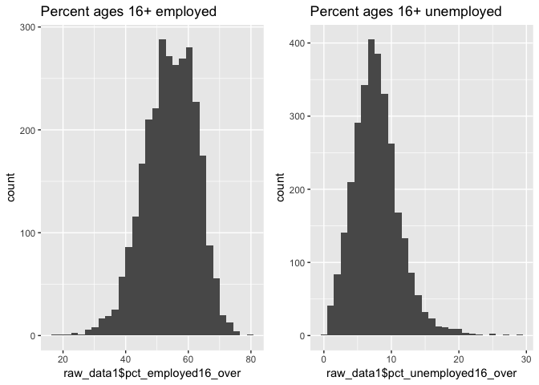

``` r
(histogram3 + histogram4)
```

    ## `stat_bin()` using `bins = 30`. Pick better value with `binwidth`.
    ## `stat_bin()` using `bins = 30`. Pick better value with `binwidth`.

    ## Warning: Removed 609 rows containing non-finite values (stat_bin).

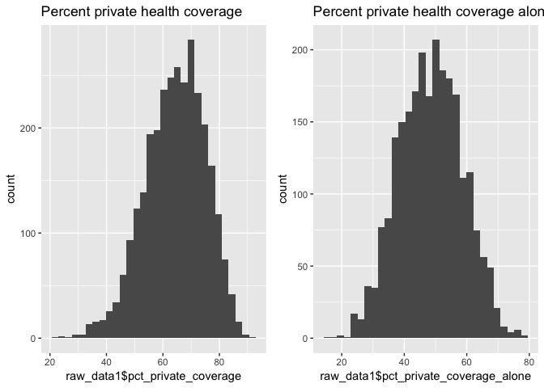

``` r
(histogram5 + histogram6)/(histogram7)
```

    ## `stat_bin()` using `bins = 30`. Pick better value with `binwidth`.
    ## `stat_bin()` using `bins = 30`. Pick better value with `binwidth`.
    ## `stat_bin()` using `bins = 30`. Pick better value with `binwidth`.

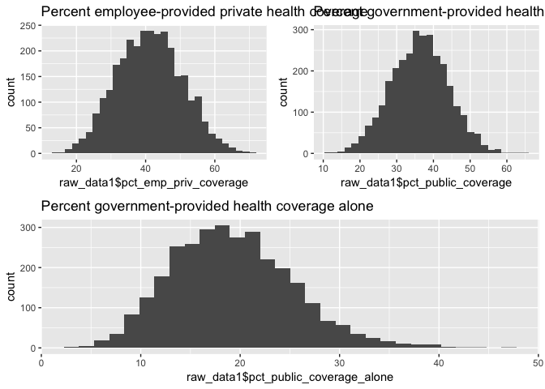

``` r
reg1 = lm(target_death_rate~pct_employed16_over, data = raw_data1)
reg2 = lm(target_death_rate~pct_unemployed16_over, data = raw_data1)
reg3 = lm(target_death_rate~pct_private_coverage, data = raw_data1)
reg4 = lm(target_death_rate~pct_private_coverage_alone, data = raw_data1)
reg5 = lm(target_death_rate~pct_emp_priv_coverage, data = raw_data1)
reg6 = lm(target_death_rate~pct_public_coverage, data = raw_data1)
reg7 = lm(target_death_rate~pct_public_coverage_alone , data = raw_data1)

plot(raw_data1$pct_employed16_over, raw_data1$target_death_rate)
abline(reg1,lwd = 2,col = 2)
```

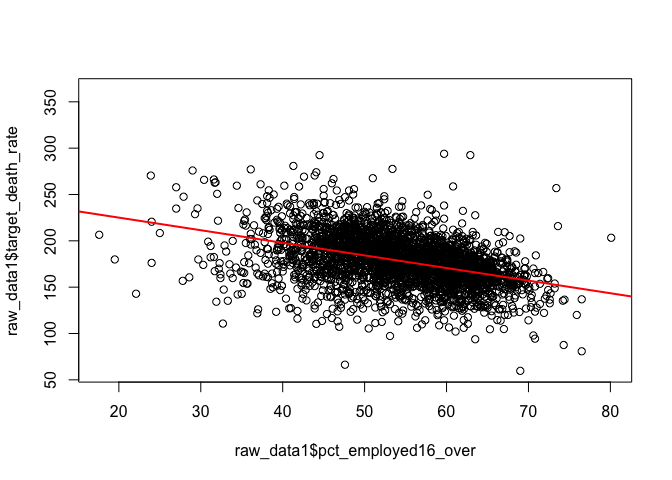

``` r
plot(raw_data1$pct_unemployed16_over, raw_data1$target_death_rate)
abline(reg2,lwd = 2,col = 2)
```

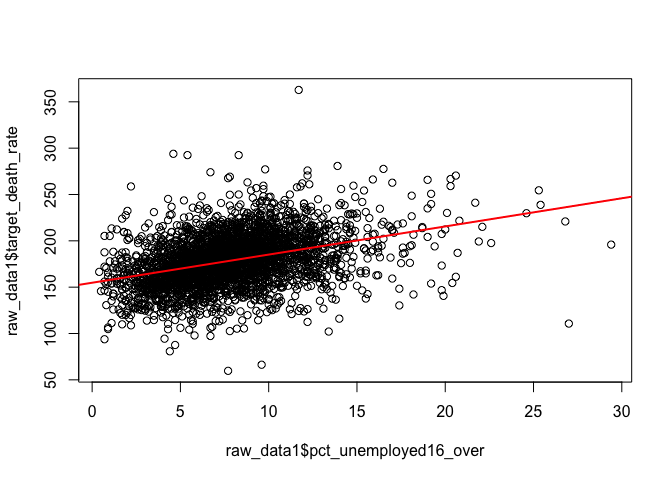

``` r
plot(raw_data1$pct_private_coverage, raw_data1$target_death_rate)
abline(reg3,lwd = 2,col = 2)
```

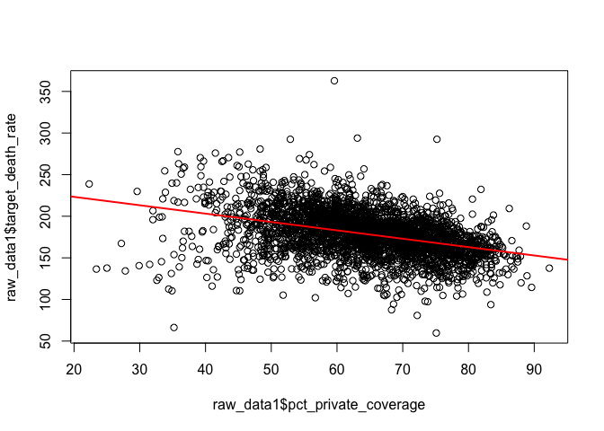

``` r
plot(raw_data1$pct_private_coverage_alone, raw_data1$target_death_rate)
abline(reg4,lwd = 2,col = 2)
```

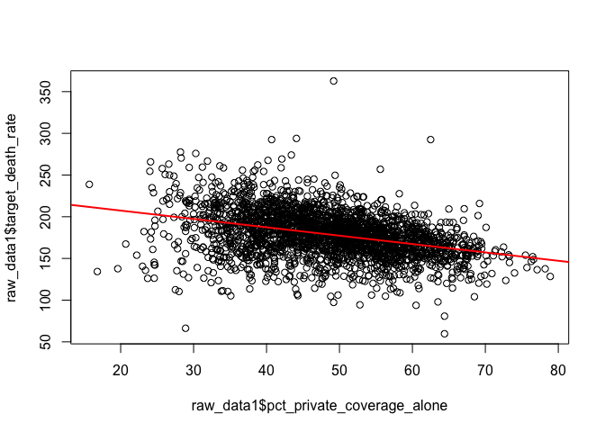

``` r
plot(raw_data1$pct_emp_priv_coverage, raw_data1$target_death_rate)
abline(reg5,lwd = 2,col = 2)
```

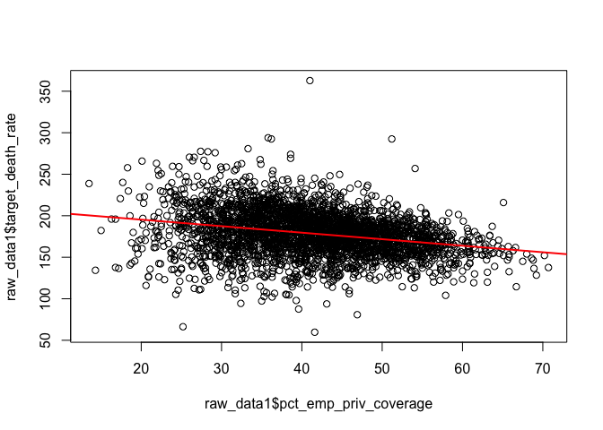

``` r
plot(raw_data1$pct_public_coverage, raw_data1$target_death_rate)
abline(reg6,lwd = 2,col = 2)
```

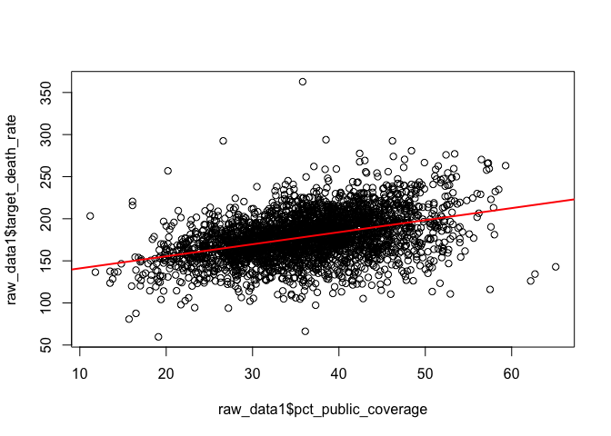

``` r
plot(raw_data1$pct_public_coverage_alone, raw_data1$target_death_rate)
abline(reg7,lwd = 2,col = 2)
```

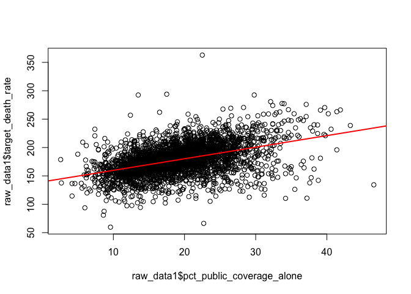

``` r
raw_data2 = raw_data1 %>% 
  #mutate(interaction1 = med_income * poverty_percent) %>% 
  select(target_death_rate, avg_ann_count, incidence_rate, med_income, poverty_percent, median_age_male, median_age_female, pct_bach_deg25_over, pct_unemployed16_over, pct_public_coverage_alone)

#############################################################################
# Backward elimination: take out non-significant variables 'one at a time'  #
# starting with the highest p-value                                         #
#############################################################################

reg = lm(target_death_rate~., data = raw_data2)
summary(reg)
```

    ## 
    ## Call:
    ## lm(formula = target_death_rate ~ ., data = raw_data2)
    ## 
    ## Residuals:
    ##      Min       1Q   Median       3Q      Max 
    ## -116.882  -11.919   -0.022   11.600  138.835 
    ## 
    ## Coefficients:
    ##                             Estimate Std. Error t value Pr(>|t|)    
    ## (Intercept)                8.805e+01  7.210e+00  12.211  < 2e-16 ***
    ## avg_ann_count             -3.660e-05  3.595e-05  -1.018  0.30859    
    ## incidence_rate             2.168e-01  6.780e-03  31.973  < 2e-16 ***
    ## med_income                -2.918e-05  6.467e-05  -0.451  0.65189    
    ## poverty_percent            5.911e-01  1.366e-01   4.327 1.56e-05 ***
    ## median_age_male           -7.286e-02  2.018e-01  -0.361  0.71812    
    ## median_age_female         -2.653e-02  1.973e-01  -0.134  0.89302    
    ## pct_bach_deg25_over       -1.644e+00  1.000e-01 -16.437  < 2e-16 ***
    ## pct_unemployed16_over      5.481e-01  1.522e-01   3.602  0.00032 ***
    ## pct_public_coverage_alone  3.357e-01  1.150e-01   2.919  0.00354 ** 
    ## ---
    ## Signif. codes:  0 '***' 0.001 '**' 0.01 '*' 0.05 '.' 0.1 ' ' 1
    ## 
    ## Residual standard error: 20.22 on 3037 degrees of freedom
    ## Multiple R-squared:  0.4708, Adjusted R-squared:  0.4693 
    ## F-statistic: 300.3 on 9 and 3037 DF,  p-value: < 2.2e-16

``` r
# No Median age of female county residents
step1<-update(reg, . ~ . -median_age_female)
summary(step1)
```

    ## 
    ## Call:
    ## lm(formula = target_death_rate ~ avg_ann_count + incidence_rate + 
    ##     med_income + poverty_percent + median_age_male + pct_bach_deg25_over + 
    ##     pct_unemployed16_over + pct_public_coverage_alone, data = raw_data2)
    ## 
    ## Residuals:
    ##      Min       1Q   Median       3Q      Max 
    ## -116.737  -11.909   -0.042   11.621  138.827 
    ## 
    ## Coefficients:
    ##                             Estimate Std. Error t value Pr(>|t|)    
    ## (Intercept)                8.787e+01  7.091e+00  12.393  < 2e-16 ***
    ## avg_ann_count             -3.673e-05  3.593e-05  -1.022 0.306674    
    ## incidence_rate             2.168e-01  6.778e-03  31.979  < 2e-16 ***
    ## med_income                -2.851e-05  6.447e-05  -0.442 0.658355    
    ## poverty_percent            5.910e-01  1.366e-01   4.327 1.56e-05 ***
    ## median_age_male           -9.768e-02  8.187e-02  -1.193 0.232932    
    ## pct_bach_deg25_over       -1.644e+00  9.991e-02 -16.452  < 2e-16 ***
    ## pct_unemployed16_over      5.487e-01  1.521e-01   3.608 0.000314 ***
    ## pct_public_coverage_alone  3.358e-01  1.150e-01   2.920 0.003521 ** 
    ## ---
    ## Signif. codes:  0 '***' 0.001 '**' 0.01 '*' 0.05 '.' 0.1 ' ' 1
    ## 
    ## Residual standard error: 20.21 on 3038 degrees of freedom
    ## Multiple R-squared:  0.4708, Adjusted R-squared:  0.4694 
    ## F-statistic: 337.9 on 8 and 3038 DF,  p-value: < 2.2e-16

``` r
# No Median income per county
step2<-update(step1, . ~ . -med_income)
summary(step2)
```

    ## 
    ## Call:
    ## lm(formula = target_death_rate ~ avg_ann_count + incidence_rate + 
    ##     poverty_percent + median_age_male + pct_bach_deg25_over + 
    ##     pct_unemployed16_over + pct_public_coverage_alone, data = raw_data2)
    ## 
    ## Residuals:
    ##      Min       1Q   Median       3Q      Max 
    ## -116.348  -11.890    0.011   11.616  138.725 
    ## 
    ## Coefficients:
    ##                             Estimate Std. Error t value Pr(>|t|)    
    ## (Intercept)                8.578e+01  5.276e+00  16.259  < 2e-16 ***
    ## avg_ann_count             -3.557e-05  3.583e-05  -0.993 0.320818    
    ## incidence_rate             2.167e-01  6.777e-03  31.981  < 2e-16 ***
    ## poverty_percent            6.286e-01  1.070e-01   5.877 4.64e-09 ***
    ## median_age_male           -8.616e-02  7.761e-02  -1.110 0.266995    
    ## pct_bach_deg25_over       -1.665e+00  8.799e-02 -18.918  < 2e-16 ***
    ## pct_unemployed16_over      5.356e-01  1.492e-01   3.591 0.000335 ***
    ## pct_public_coverage_alone  3.387e-01  1.148e-01   2.950 0.003198 ** 
    ## ---
    ## Signif. codes:  0 '***' 0.001 '**' 0.01 '*' 0.05 '.' 0.1 ' ' 1
    ## 
    ## Residual standard error: 20.21 on 3039 degrees of freedom
    ## Multiple R-squared:  0.4708, Adjusted R-squared:  0.4696 
    ## F-statistic: 386.2 on 7 and 3039 DF,  p-value: < 2.2e-16

``` r
# No Mean number of reported cases of cancer diagnosed annually
step3<-update(step2, . ~ . -avg_ann_count)
summary(step3)
```

    ## 
    ## Call:
    ## lm(formula = target_death_rate ~ incidence_rate + poverty_percent + 
    ##     median_age_male + pct_bach_deg25_over + pct_unemployed16_over + 
    ##     pct_public_coverage_alone, data = raw_data2)
    ## 
    ## Residuals:
    ##      Min       1Q   Median       3Q      Max 
    ## -116.202  -11.906    0.025   11.620  138.797 
    ## 
    ## Coefficients:
    ##                            Estimate Std. Error t value Pr(>|t|)    
    ## (Intercept)               85.925807   5.273560  16.294  < 2e-16 ***
    ## incidence_rate             0.216469   0.006772  31.967  < 2e-16 ***
    ## poverty_percent            0.624718   0.106888   5.845 5.62e-09 ***
    ## median_age_male           -0.094322   0.077169  -1.222 0.221701    
    ## pct_bach_deg25_over       -1.662566   0.087967 -18.900  < 2e-16 ***
    ## pct_unemployed16_over      0.548692   0.148591   3.693 0.000226 ***
    ## pct_public_coverage_alone  0.346357   0.114521   3.024 0.002512 ** 
    ## ---
    ## Signif. codes:  0 '***' 0.001 '**' 0.01 '*' 0.05 '.' 0.1 ' ' 1
    ## 
    ## Residual standard error: 20.21 on 3040 degrees of freedom
    ## Multiple R-squared:  0.4706, Adjusted R-squared:  0.4696 
    ## F-statistic: 450.4 on 6 and 3040 DF,  p-value: < 2.2e-16

``` r
# No Median age of male county residents
step4<-update(step3, . ~ . -median_age_male)
summary(step4)
```

    ## 
    ## Call:
    ## lm(formula = target_death_rate ~ incidence_rate + poverty_percent + 
    ##     pct_bach_deg25_over + pct_unemployed16_over + pct_public_coverage_alone, 
    ##     data = raw_data2)
    ## 
    ## Residuals:
    ##      Min       1Q   Median       3Q      Max 
    ## -115.808  -11.920    0.036   11.653  138.911 
    ## 
    ## Coefficients:
    ##                           Estimate Std. Error t value Pr(>|t|)    
    ## (Intercept)               81.52141    3.85070  21.171  < 2e-16 ***
    ## incidence_rate             0.21669    0.00677  32.009  < 2e-16 ***
    ## poverty_percent            0.67035    0.10016   6.692  2.6e-11 ***
    ## pct_bach_deg25_over       -1.64000    0.08601 -19.066  < 2e-16 ***
    ## pct_unemployed16_over      0.56332    0.14812   3.803 0.000146 ***
    ## pct_public_coverage_alone  0.31452    0.11153   2.820 0.004832 ** 
    ## ---
    ## Signif. codes:  0 '***' 0.001 '**' 0.01 '*' 0.05 '.' 0.1 ' ' 1
    ## 
    ## Residual standard error: 20.21 on 3041 degrees of freedom
    ## Multiple R-squared:  0.4704, Adjusted R-squared:  0.4695 
    ## F-statistic: 540.1 on 5 and 3041 DF,  p-value: < 2.2e-16

``` r
############################################################################
#  Stepwise regreession                                                    #   
# 'Step' function uses AIC criterion for var selection and the default     #
#  option is 'backward'.                                                   #
#  Step is a simplified version of stepAIC()                               #
############################################################################


mult.fit <- lm(target_death_rate~., data = raw_data2)
step(mult.fit, direction = 'both')
```

    ## Start:  AIC=18331.83
    ## target_death_rate ~ avg_ann_count + incidence_rate + med_income + 
    ##     poverty_percent + median_age_male + median_age_female + pct_bach_deg25_over + 
    ##     pct_unemployed16_over + pct_public_coverage_alone
    ## 
    ##                             Df Sum of Sq     RSS   AIC
    ## - median_age_female          1         7 1241348 18330
    ## - median_age_male            1        53 1241394 18330
    ## - med_income                 1        83 1241424 18330
    ## - avg_ann_count              1       424 1241765 18331
    ## <none>                                   1241341 18332
    ## - pct_public_coverage_alone  1      3483 1244824 18338
    ## - pct_unemployed16_over      1      5304 1246645 18343
    ## - poverty_percent            1      7651 1248993 18349
    ## - pct_bach_deg25_over        1    110437 1351778 18590
    ## - incidence_rate             1    417846 1659187 19214
    ## 
    ## Step:  AIC=18329.85
    ## target_death_rate ~ avg_ann_count + incidence_rate + med_income + 
    ##     poverty_percent + median_age_male + pct_bach_deg25_over + 
    ##     pct_unemployed16_over + pct_public_coverage_alone
    ## 
    ##                             Df Sum of Sq     RSS   AIC
    ## - med_income                 1        80 1241428 18328
    ## - avg_ann_count              1       427 1241776 18329
    ## - median_age_male            1       582 1241930 18329
    ## <none>                                   1241348 18330
    ## + median_age_female          1         7 1241341 18332
    ## - pct_public_coverage_alone  1      3485 1244833 18336
    ## - pct_unemployed16_over      1      5319 1246667 18341
    ## - poverty_percent            1      7649 1248997 18347
    ## - pct_bach_deg25_over        1    110598 1351946 18588
    ## - incidence_rate             1    417875 1659223 19212
    ## 
    ## Step:  AIC=18328.04
    ## target_death_rate ~ avg_ann_count + incidence_rate + poverty_percent + 
    ##     median_age_male + pct_bach_deg25_over + pct_unemployed16_over + 
    ##     pct_public_coverage_alone
    ## 
    ##                             Df Sum of Sq     RSS   AIC
    ## - avg_ann_count              1       403 1241831 18327
    ## - median_age_male            1       504 1241932 18327
    ## <none>                                   1241428 18328
    ## + med_income                 1        80 1241348 18330
    ## + median_age_female          1         4 1241424 18330
    ## - pct_public_coverage_alone  1      3556 1244984 18335
    ## - pct_unemployed16_over      1      5267 1246695 18339
    ## - poverty_percent            1     14108 1255536 18360
    ## - pct_bach_deg25_over        1    146192 1387620 18665
    ## - incidence_rate             1    417799 1659228 19210
    ## 
    ## Step:  AIC=18327.03
    ## target_death_rate ~ incidence_rate + poverty_percent + median_age_male + 
    ##     pct_bach_deg25_over + pct_unemployed16_over + pct_public_coverage_alone
    ## 
    ##                             Df Sum of Sq     RSS   AIC
    ## - median_age_male            1       610 1242441 18326
    ## <none>                                   1241831 18327
    ## + avg_ann_count              1       403 1241428 18328
    ## + med_income                 1        56 1241776 18329
    ## + median_age_female          1         7 1241824 18329
    ## - pct_public_coverage_alone  1      3737 1245568 18334
    ## - pct_unemployed16_over      1      5570 1247401 18339
    ## - poverty_percent            1     13954 1255785 18359
    ## - pct_bach_deg25_over        1    145916 1387747 18664
    ## - incidence_rate             1    417432 1659263 19208
    ## 
    ## Step:  AIC=18326.53
    ## target_death_rate ~ incidence_rate + poverty_percent + pct_bach_deg25_over + 
    ##     pct_unemployed16_over + pct_public_coverage_alone
    ## 
    ##                             Df Sum of Sq     RSS   AIC
    ## <none>                                   1242441 18326
    ## + median_age_male            1       610 1241831 18327
    ## + median_age_female          1       568 1241873 18327
    ## + avg_ann_count              1       510 1241932 18327
    ## + med_income                 1         1 1242440 18328
    ## - pct_public_coverage_alone  1      3249 1245691 18332
    ## - pct_unemployed16_over      1      5909 1248351 18339
    ## - poverty_percent            1     18299 1260741 18369
    ## - pct_bach_deg25_over        1    148524 1390965 18669
    ## - incidence_rate             1    418595 1661036 19209

    ## 
    ## Call:
    ## lm(formula = target_death_rate ~ incidence_rate + poverty_percent + 
    ##     pct_bach_deg25_over + pct_unemployed16_over + pct_public_coverage_alone, 
    ##     data = raw_data2)
    ## 
    ## Coefficients:
    ##               (Intercept)             incidence_rate  
    ##                   81.5214                     0.2167  
    ##           poverty_percent        pct_bach_deg25_over  
    ##                    0.6703                    -1.6400  
    ##     pct_unemployed16_over  pct_public_coverage_alone  
    ##                    0.5633                     0.3145

``` r
#########################################################################################
# Forward elimination: Reversed backward elimination starting with the lowest p-value   #                                                            
#########################################################################################


### Step 1:  Fit simple linear regressions for all variables,look for the variable with lowest p-value
fit1 <- lm(target_death_rate ~ avg_ann_count, data=raw_data2)
tidy(fit1)
```

    ## # A tibble: 2 x 5
    ##   term             estimate std.error statistic p.value
    ##   <chr>               <dbl>     <dbl>     <dbl>   <dbl>
    ## 1 (Intercept)    179.       0.514        348.   0      
    ## 2 avg_ann_count   -0.000153 0.0000481     -3.19 0.00142

``` r
fit2 <- lm(target_death_rate ~ incidence_rate, data=raw_data2)
tidy(fit2)
```

    ## # A tibble: 2 x 5
    ##   term           estimate std.error statistic   p.value
    ##   <chr>             <dbl>     <dbl>     <dbl>     <dbl>
    ## 1 (Intercept)      76.2     3.72         20.5 1.61e- 87
    ## 2 incidence_rate    0.229   0.00823      27.8 2.07e-151

``` r
fit3 <- lm(target_death_rate ~ med_income, data=raw_data2)
tidy(fit3)
```

    ## # A tibble: 2 x 5
    ##   term           estimate std.error statistic   p.value
    ##   <chr>             <dbl>     <dbl>     <dbl>     <dbl>
    ## 1 (Intercept)  225.       1.83          123.  0.       
    ## 2 med_income    -0.000988 0.0000377     -26.2 2.04e-136

``` r
fit4 <- lm(target_death_rate ~ poverty_percent, data=raw_data2)
tidy(fit4)
```

    ## # A tibble: 2 x 5
    ##   term            estimate std.error statistic   p.value
    ##   <chr>              <dbl>     <dbl>     <dbl>     <dbl>
    ## 1 (Intercept)       147.      1.28       115.  0.       
    ## 2 poverty_percent     1.86    0.0709      26.2 5.90e-137

``` r
fit5 <- lm(target_death_rate ~ median_age_male, data=raw_data2)
tidy(fit5)
```

    ## # A tibble: 2 x 5
    ##   term            estimate std.error statistic p.value
    ##   <chr>              <dbl>     <dbl>     <dbl>   <dbl>
    ## 1 (Intercept)      183.       3.84       47.7    0    
    ## 2 median_age_male   -0.116    0.0962     -1.21   0.226

``` r
fit6 <- lm(target_death_rate ~ median_age_female, data=raw_data2)
tidy(fit6)
```

    ## # A tibble: 2 x 5
    ##   term              estimate std.error statistic   p.value
    ##   <chr>                <dbl>     <dbl>     <dbl>     <dbl>
    ## 1 (Intercept)       176.        4.04      43.6   3.00e-323
    ## 2 median_age_female   0.0632    0.0950     0.665 5.06e-  1

``` r
fit7 <- lm(target_death_rate ~ pct_bach_deg25_over, data=raw_data2)
tidy(fit7)
```

    ## # A tibble: 2 x 5
    ##   term                estimate std.error statistic   p.value
    ##   <chr>                  <dbl>     <dbl>     <dbl>     <dbl>
    ## 1 (Intercept)           212.      1.17       181.  0.       
    ## 2 pct_bach_deg25_over    -2.50    0.0815     -30.6 5.66e-180

``` r
fit8 <- lm(target_death_rate ~ pct_unemployed16_over, data=raw_data2)
tidy(fit8)
```

    ## # A tibble: 2 x 5
    ##   term                  estimate std.error statistic   p.value
    ##   <chr>                    <dbl>     <dbl>     <dbl>     <dbl>
    ## 1 (Intercept)             155.       1.16      134.  0.       
    ## 2 pct_unemployed16_over     3.04     0.135      22.6 2.47e-104

``` r
fit9 <- lm(target_death_rate ~ pct_public_coverage_alone, data=raw_data2)
tidy(fit9)
```

    ## # A tibble: 2 x 5
    ##   term                      estimate std.error statistic   p.value
    ##   <chr>                        <dbl>     <dbl>     <dbl>     <dbl>
    ## 1 (Intercept)                 139.      1.48        94.0 0.       
    ## 2 pct_public_coverage_alone     2.04    0.0735      27.8 2.35e-151

``` r
# Enter first the one with the lowest p-value: pct_bach_deg25_over
forward1<-lm(target_death_rate~pct_bach_deg25_over , data=raw_data2)
tidy(forward1)
```

    ## # A tibble: 2 x 5
    ##   term                estimate std.error statistic   p.value
    ##   <chr>                  <dbl>     <dbl>     <dbl>     <dbl>
    ## 1 (Intercept)           212.      1.17       181.  0.       
    ## 2 pct_bach_deg25_over    -2.50    0.0815     -30.6 5.66e-180

``` r
### Step 2: Enter the one with the lowest p-value in the rest 
fit1 <- update(forward1, . ~ . +avg_ann_count)
tidy(fit1)
```

    ## # A tibble: 3 x 5
    ##   term                   estimate std.error statistic   p.value
    ##   <chr>                     <dbl>     <dbl>     <dbl>     <dbl>
    ## 1 (Intercept)          212.       1.17         181.   0.       
    ## 2 pct_bach_deg25_over   -2.49     0.0815       -30.5  6.02e-179
    ## 3 avg_ann_count         -0.000101 0.0000421     -2.39 1.68e-  2

``` r
fit2 <- update(forward1, . ~ . +incidence_rate)
tidy(fit2)
```

    ## # A tibble: 3 x 5
    ##   term                estimate std.error statistic   p.value
    ##   <chr>                  <dbl>     <dbl>     <dbl>     <dbl>
    ## 1 (Intercept)          112.      3.34         33.6 3.85e-211
    ## 2 pct_bach_deg25_over   -2.41    0.0710      -34.0 4.54e-215
    ## 3 incidence_rate         0.219   0.00702      31.3 1.60e-186

``` r
fit3 <- update(forward1, . ~ . +med_income)
tidy(fit3)
```

    ## # A tibble: 3 x 5
    ##   term                   estimate std.error statistic  p.value
    ##   <chr>                     <dbl>     <dbl>     <dbl>    <dbl>
    ## 1 (Intercept)          222.       1.77         126.   0.      
    ## 2 pct_bach_deg25_over   -1.87     0.114        -16.5  1.81e-58
    ## 3 med_income            -0.000396 0.0000510     -7.76 1.13e-14

``` r
fit4 <- update(forward1, . ~ . +poverty_percent)
tidy(fit4)
```

    ## # A tibble: 3 x 5
    ##   term                estimate std.error statistic  p.value
    ##   <chr>                  <dbl>     <dbl>     <dbl>    <dbl>
    ## 1 (Intercept)           186.      2.29        81.0 0.      
    ## 2 pct_bach_deg25_over    -1.84    0.0936     -19.7 2.10e-81
    ## 3 poverty_percent         1.03    0.0788      13.1 2.72e-38

``` r
fit5 <- update(forward1, . ~ . +median_age_male)
tidy(fit5)
```

    ## # A tibble: 3 x 5
    ##   term                estimate std.error statistic   p.value
    ##   <chr>                  <dbl>     <dbl>     <dbl>     <dbl>
    ## 1 (Intercept)          231.       3.67       62.9  0.       
    ## 2 pct_bach_deg25_over   -2.56     0.0818    -31.2  4.07e-186
    ## 3 median_age_male       -0.464    0.0845     -5.49 4.34e-  8

``` r
fit6 <- update(forward1, . ~ . +median_age_female)
tidy(fit6)
```

    ## # A tibble: 3 x 5
    ##   term                estimate std.error statistic   p.value
    ##   <chr>                  <dbl>     <dbl>     <dbl>     <dbl>
    ## 1 (Intercept)          230.       3.92       58.7  0.       
    ## 2 pct_bach_deg25_over   -2.57     0.0826    -31.1  5.65e-185
    ## 3 median_age_female     -0.411    0.0841     -4.88 1.12e-  6

``` r
fit7 <- update(forward1, . ~ . +pct_unemployed16_over)
tidy(fit7)
```

    ## # A tibble: 3 x 5
    ##   term                  estimate std.error statistic   p.value
    ##   <chr>                    <dbl>     <dbl>     <dbl>     <dbl>
    ## 1 (Intercept)             192.      1.85       103.  0.       
    ## 2 pct_bach_deg25_over      -2.06    0.0852     -24.1 5.27e-118
    ## 3 pct_unemployed16_over     1.84    0.133       13.8 2.79e- 42

``` r
fit8 <- update(forward1, . ~ . +pct_public_coverage_alone)
tidy(fit8)
```

    ## # A tibble: 3 x 5
    ##   term                      estimate std.error statistic  p.value
    ##   <chr>                        <dbl>     <dbl>     <dbl>    <dbl>
    ## 1 (Intercept)                 180.      2.75        65.6 0.      
    ## 2 pct_bach_deg25_over          -1.73    0.0999     -17.4 2.09e-64
    ## 3 pct_public_coverage_alone     1.11    0.0881      12.6 1.05e-35

``` r
# Enter the one with the lowest p-value: incidence_rate
forward2 <- update(forward1, . ~ . + incidence_rate)
tidy(forward2)
```

    ## # A tibble: 3 x 5
    ##   term                estimate std.error statistic   p.value
    ##   <chr>                  <dbl>     <dbl>     <dbl>     <dbl>
    ## 1 (Intercept)          112.      3.34         33.6 3.85e-211
    ## 2 pct_bach_deg25_over   -2.41    0.0710      -34.0 4.54e-215
    ## 3 incidence_rate         0.219   0.00702      31.3 1.60e-186

``` r
### Step 3: Enter the one with the lowest p-value in the rest 
fit1 <- update(forward2, . ~ . +avg_ann_count)
tidy(fit1)
```

    ## # A tibble: 4 x 5
    ##   term                   estimate std.error statistic   p.value
    ##   <chr>                     <dbl>     <dbl>     <dbl>     <dbl>
    ## 1 (Intercept)          112.       3.33          33.7  1.91e-211
    ## 2 pct_bach_deg25_over   -2.40     0.0709       -33.9  7.70e-214
    ## 3 incidence_rate         0.220    0.00701       31.4  6.87e-188
    ## 4 avg_ann_count         -0.000128 0.0000366     -3.51 4.57e-  4

``` r
fit2 <- update(forward2, . ~ . +med_income)
tidy(fit2)
```

    ## # A tibble: 4 x 5
    ##   term                   estimate std.error statistic   p.value
    ##   <chr>                     <dbl>     <dbl>     <dbl>     <dbl>
    ## 1 (Intercept)          123.       3.45           35.7 4.94e-233
    ## 2 pct_bach_deg25_over   -1.71     0.0985        -17.3 2.64e- 64
    ## 3 incidence_rate         0.222    0.00691        32.2 1.59e-195
    ## 4 med_income            -0.000448 0.0000441     -10.2 7.84e- 24

``` r
fit3 <- update(forward2, . ~ . +poverty_percent)
tidy(fit3)
```

    ## # A tibble: 4 x 5
    ##   term                estimate std.error statistic   p.value
    ##   <chr>                  <dbl>     <dbl>     <dbl>     <dbl>
    ## 1 (Intercept)           84.8     3.66         23.2 1.60e-109
    ## 2 pct_bach_deg25_over   -1.74    0.0806      -21.6 2.47e- 96
    ## 3 incidence_rate         0.221   0.00675      32.7 1.66e-201
    ## 4 poverty_percent        1.06    0.0678       15.7 2.21e- 53

``` r
fit4 <- update(forward2, . ~ . +median_age_male)
tidy(fit4)
```

    ## # A tibble: 4 x 5
    ##   term                estimate std.error statistic   p.value
    ##   <chr>                  <dbl>     <dbl>     <dbl>     <dbl>
    ## 1 (Intercept)          130.      4.54        28.6  1.18e-159
    ## 2 pct_bach_deg25_over   -2.47    0.0712     -34.6  8.52e-222
    ## 3 incidence_rate         0.219   0.00698     31.3  6.17e-187
    ## 4 median_age_male       -0.418   0.0735      -5.69 1.42e-  8

``` r
fit5 <- update(forward2, . ~ . +median_age_female)
tidy(fit5)
```

    ## # A tibble: 4 x 5
    ##   term                estimate std.error statistic   p.value
    ##   <chr>                  <dbl>     <dbl>     <dbl>     <dbl>
    ## 1 (Intercept)          129.      4.69        27.5  3.09e-149
    ## 2 pct_bach_deg25_over   -2.48    0.0719     -34.5  2.07e-220
    ## 3 incidence_rate         0.219   0.00699     31.3  6.16e-187
    ## 4 median_age_female     -0.373   0.0732      -5.10 3.62e-  7

``` r
fit6 <- update(forward2, . ~ . +pct_unemployed16_over)
tidy(fit6)
```

    ## # A tibble: 4 x 5
    ##   term                  estimate std.error statistic   p.value
    ##   <chr>                    <dbl>     <dbl>     <dbl>     <dbl>
    ## 1 (Intercept)             99.4     3.40         29.2 1.33e-165
    ## 2 pct_bach_deg25_over     -2.06    0.0744      -27.6 5.04e-150
    ## 3 incidence_rate           0.211   0.00686      30.8 1.74e-181
    ## 4 pct_unemployed16_over    1.51    0.117        12.9 2.87e- 37

``` r
fit7 <- update(forward2, . ~ . +pct_public_coverage_alone)
tidy(fit7)
```

    ## # A tibble: 4 x 5
    ##   term                      estimate std.error statistic   p.value
    ##   <chr>                        <dbl>     <dbl>     <dbl>     <dbl>
    ## 1 (Intercept)                 83.2     3.86         21.6 3.40e- 96
    ## 2 pct_bach_deg25_over         -1.69    0.0865      -19.5 6.11e- 80
    ## 3 incidence_rate               0.217   0.00681      31.9 2.83e-193
    ## 4 pct_public_coverage_alone    1.06    0.0763       13.9 1.55e- 42

``` r
# Enter the one with the lowest p-value: poverty_percent
forward3 <- update(forward2, . ~ . + poverty_percent)
tidy(forward3)
```

    ## # A tibble: 4 x 5
    ##   term                estimate std.error statistic   p.value
    ##   <chr>                  <dbl>     <dbl>     <dbl>     <dbl>
    ## 1 (Intercept)           84.8     3.66         23.2 1.60e-109
    ## 2 pct_bach_deg25_over   -1.74    0.0806      -21.6 2.47e- 96
    ## 3 incidence_rate         0.221   0.00675      32.7 1.66e-201
    ## 4 poverty_percent        1.06    0.0678       15.7 2.21e- 53

``` r
### Step 4: Enter the one with the lowest p-value in the rest 
fit1 <- update(forward3, . ~ . +avg_ann_count)
tidy(fit1)
```

    ## # A tibble: 5 x 5
    ##   term                   estimate std.error statistic   p.value
    ##   <chr>                     <dbl>     <dbl>     <dbl>     <dbl>
    ## 1 (Intercept)          85.1       3.66          23.2  4.21e-110
    ## 2 pct_bach_deg25_over  -1.74      0.0806       -21.6  9.82e- 97
    ## 3 incidence_rate        0.221     0.00675       32.8  5.91e-202
    ## 4 poverty_percent       1.05      0.0683        15.4  2.24e- 51
    ## 5 avg_ann_count        -0.0000631 0.0000355     -1.78 7.56e-  2

``` r
fit2 <- update(forward3, . ~ . +med_income)
tidy(fit2)
```

    ## # A tibble: 5 x 5
    ##   term                   estimate std.error statistic   p.value
    ##   <chr>                     <dbl>     <dbl>     <dbl>     <dbl>
    ## 1 (Intercept)          83.0       4.78         17.4   2.07e- 64
    ## 2 pct_bach_deg25_over  -1.77      0.0965      -18.4   1.44e- 71
    ## 3 incidence_rate        0.221     0.00676      32.7   5.62e-201
    ## 4 poverty_percent       1.10      0.0936       11.8   2.48e- 31
    ## 5 med_income            0.0000359 0.0000595     0.603 5.46e-  1

``` r
fit3 <- update(forward3, . ~ . +median_age_male)
tidy(fit3)
```

    ## # A tibble: 5 x 5
    ##   term                estimate std.error statistic   p.value
    ##   <chr>                  <dbl>     <dbl>     <dbl>     <dbl>
    ## 1 (Intercept)          87.1      5.29       16.5   1.53e- 58
    ## 2 pct_bach_deg25_over  -1.76     0.0844    -20.8   6.49e- 90
    ## 3 incidence_rate        0.221    0.00675    32.7   3.52e-201
    ## 4 poverty_percent       1.05     0.0721     14.6   1.97e- 46
    ## 5 median_age_male      -0.0458   0.0755     -0.606 5.44e-  1

``` r
fit4 <- update(forward3, . ~ . +median_age_female)
tidy(fit4)
```

    ## # A tibble: 5 x 5
    ##   term                estimate std.error statistic   p.value
    ##   <chr>                  <dbl>     <dbl>     <dbl>     <dbl>
    ## 1 (Intercept)          87.5      5.34       16.4   4.92e- 58
    ## 2 pct_bach_deg25_over  -1.76     0.0848    -20.7   1.66e- 89
    ## 3 incidence_rate        0.221    0.00675    32.7   3.10e-201
    ## 4 poverty_percent       1.05     0.0709     14.8   7.89e- 48
    ## 5 median_age_female    -0.0522   0.0740     -0.705 4.81e-  1

``` r
fit5 <- update(forward3, . ~ . +pct_unemployed16_over)
tidy(fit5)
```

    ## # A tibble: 5 x 5
    ##   term                  estimate std.error statistic   p.value
    ##   <chr>                    <dbl>     <dbl>     <dbl>     <dbl>
    ## 1 (Intercept)             85.0     3.65        23.3  8.95e-111
    ## 2 pct_bach_deg25_over     -1.73    0.0804     -21.5  1.54e- 95
    ## 3 incidence_rate           0.217   0.00678     32.0  6.66e-194
    ## 4 poverty_percent          0.828   0.0833       9.94 6.49e- 23
    ## 5 pct_unemployed16_over    0.686   0.142        4.84 1.37e-  6

``` r
fit6 <- update(forward3, . ~ . +pct_public_coverage_alone)
tidy(fit6)
```

    ## # A tibble: 5 x 5
    ##   term                      estimate std.error statistic   p.value
    ##   <chr>                        <dbl>     <dbl>     <dbl>     <dbl>
    ## 1 (Intercept)                 80.0     3.84        20.8  2.98e- 90
    ## 2 pct_bach_deg25_over         -1.62    0.0860     -18.8  1.26e- 74
    ## 3 incidence_rate               0.220   0.00674     32.6  4.09e-200
    ## 4 poverty_percent              0.785   0.0957       8.20 3.45e- 16
    ## 5 pct_public_coverage_alone    0.439   0.107        4.11 4.09e-  5

``` r
# Enter the one with the lowest p-value: pct_unemployed16_over 
forward4 <- update(forward3, . ~ . + pct_unemployed16_over )
tidy(forward4)
```

    ## # A tibble: 5 x 5
    ##   term                  estimate std.error statistic   p.value
    ##   <chr>                    <dbl>     <dbl>     <dbl>     <dbl>
    ## 1 (Intercept)             85.0     3.65        23.3  8.95e-111
    ## 2 pct_bach_deg25_over     -1.73    0.0804     -21.5  1.54e- 95
    ## 3 incidence_rate           0.217   0.00678     32.0  6.66e-194
    ## 4 poverty_percent          0.828   0.0833       9.94 6.49e- 23
    ## 5 pct_unemployed16_over    0.686   0.142        4.84 1.37e-  6

``` r
### Step 5: Enter the one with the lowest p-value in the rest 
fit1 <- update(forward4, . ~ . +avg_ann_count)
tidy(fit1)
```

    ## # A tibble: 6 x 5
    ##   term                     estimate std.error statistic   p.value
    ##   <chr>                       <dbl>     <dbl>     <dbl>     <dbl>
    ## 1 (Intercept)            85.3       3.65          23.4  4.52e-111
    ## 2 pct_bach_deg25_over    -1.73      0.0804       -21.5  8.72e- 96
    ## 3 incidence_rate          0.217     0.00678       32.0  3.57e-194
    ## 4 poverty_percent         0.824     0.0833         9.89 9.80e- 23
    ## 5 pct_unemployed16_over   0.666     0.143          4.67 3.20e-  6
    ## 6 avg_ann_count          -0.0000442 0.0000356     -1.24 2.15e-  1

``` r
fit2 <- update(forward4, . ~ . +med_income)
tidy(fit2)
```

    ## # A tibble: 6 x 5
    ##   term                     estimate std.error statistic   p.value
    ##   <chr>                       <dbl>     <dbl>     <dbl>     <dbl>
    ## 1 (Intercept)            86.0       4.80         17.9   3.38e- 68
    ## 2 pct_bach_deg25_over    -1.71      0.0970      -17.6   2.18e- 66
    ## 3 incidence_rate          0.217     0.00678      32.0   7.43e-194
    ## 4 poverty_percent         0.805     0.112         7.19  7.99e- 13
    ## 5 pct_unemployed16_over   0.694     0.144         4.81  1.59e-  6
    ## 6 med_income             -0.0000183 0.0000604    -0.303 7.62e-  1

``` r
fit3 <- update(forward4, . ~ . +median_age_male)
tidy(fit3)
```

    ## # A tibble: 6 x 5
    ##   term                  estimate std.error statistic   p.value
    ##   <chr>                    <dbl>     <dbl>     <dbl>     <dbl>
    ## 1 (Intercept)            87.1      5.27       16.5   6.11e- 59
    ## 2 pct_bach_deg25_over    -1.74     0.0842    -20.7   5.02e- 89
    ## 3 incidence_rate          0.217    0.00678    32.0   1.28e-193
    ## 4 poverty_percent         0.815    0.0866      9.41  9.89e- 21
    ## 5 pct_unemployed16_over   0.685    0.142       4.83  1.43e-  6
    ## 6 median_age_male        -0.0412   0.0752     -0.548 5.84e-  1

``` r
fit4 <- update(forward4, . ~ . +median_age_female)
tidy(fit4)
```

    ## # A tibble: 6 x 5
    ##   term                  estimate std.error statistic   p.value
    ##   <chr>                    <dbl>     <dbl>     <dbl>     <dbl>
    ## 1 (Intercept)            87.2      5.32       16.4   5.24e- 58
    ## 2 pct_bach_deg25_over    -1.74     0.0846    -20.6   2.24e- 88
    ## 3 incidence_rate          0.217    0.00678    32.0   1.05e-193
    ## 4 poverty_percent         0.817    0.0855      9.55  2.54e- 21
    ## 5 pct_unemployed16_over   0.684    0.142       4.82  1.51e-  6
    ## 6 median_age_female      -0.0415   0.0737     -0.563 5.74e-  1

``` r
fit5 <- update(forward4, . ~ . +pct_public_coverage_alone)
tidy(fit5)
```

    ## # A tibble: 6 x 5
    ##   term                      estimate std.error statistic   p.value
    ##   <chr>                        <dbl>     <dbl>     <dbl>     <dbl>
    ## 1 (Intercept)                 81.5     3.85        21.2  6.58e- 93
    ## 2 pct_bach_deg25_over         -1.64    0.0860     -19.1  1.20e- 76
    ## 3 incidence_rate               0.217   0.00677     32.0  5.24e-194
    ## 4 poverty_percent              0.670   0.100        6.69 2.60e- 11
    ## 5 pct_unemployed16_over        0.563   0.148        3.80 1.46e-  4
    ## 6 pct_public_coverage_alone    0.315   0.112        2.82 4.83e-  3

``` r
# Enter the one with the lowest p-value: pct_public_coverage_alone
forward5 <- update(forward4, . ~ . + pct_public_coverage_alone )
tidy(forward5)
```

    ## # A tibble: 6 x 5
    ##   term                      estimate std.error statistic   p.value
    ##   <chr>                        <dbl>     <dbl>     <dbl>     <dbl>
    ## 1 (Intercept)                 81.5     3.85        21.2  6.58e- 93
    ## 2 pct_bach_deg25_over         -1.64    0.0860     -19.1  1.20e- 76
    ## 3 incidence_rate               0.217   0.00677     32.0  5.24e-194
    ## 4 poverty_percent              0.670   0.100        6.69 2.60e- 11
    ## 5 pct_unemployed16_over        0.563   0.148        3.80 1.46e-  4
    ## 6 pct_public_coverage_alone    0.315   0.112        2.82 4.83e-  3

``` r
### Step 6: Enter the one with the lowest p-value in the rest 
fit1 <- update(forward5, . ~ . +avg_ann_count)
tidy(fit1)
```

    ## # A tibble: 7 x 5
    ##   term                         estimate std.error statistic   p.value
    ##   <chr>                           <dbl>     <dbl>     <dbl>     <dbl>
    ## 1 (Intercept)                81.8       3.86          21.2  3.82e- 93
    ## 2 pct_bach_deg25_over        -1.64      0.0861       -19.1  6.97e- 77
    ## 3 incidence_rate              0.217     0.00677       32.0  3.25e-194
    ## 4 poverty_percent             0.670     0.100          6.69 2.62e- 11
    ## 5 pct_unemployed16_over       0.547     0.149          3.68 2.39e-  4
    ## 6 pct_public_coverage_alone   0.309     0.112          2.77 5.68e-  3
    ## 7 avg_ann_count              -0.0000398 0.0000356     -1.12 2.64e-  1

``` r
fit2 <- update(forward5, . ~ . +med_income)
tidy(fit2)
```

    ## # A tibble: 7 x 5
    ##   term                          estimate std.error statistic   p.value
    ##   <chr>                            <dbl>     <dbl>     <dbl>     <dbl>
    ## 1 (Intercept)                81.4        5.07        16.0    1.36e- 55
    ## 2 pct_bach_deg25_over        -1.64       0.0999     -16.4    2.84e- 58
    ## 3 incidence_rate              0.217      0.00677     32.0    6.81e-194
    ## 4 poverty_percent             0.674      0.121        5.56   2.96e-  8
    ## 5 pct_unemployed16_over       0.562      0.152        3.70   2.17e-  4
    ## 6 pct_public_coverage_alone   0.315      0.112        2.80   5.08e-  3
    ## 7 med_income                  0.00000299 0.0000608    0.0492 9.61e-  1

``` r
fit3 <- update(forward5, . ~ . +median_age_male)
tidy(fit3)
```

    ## # A tibble: 7 x 5
    ##   term                      estimate std.error statistic   p.value
    ##   <chr>                        <dbl>     <dbl>     <dbl>     <dbl>
    ## 1 (Intercept)                85.9      5.27        16.3  2.73e- 57
    ## 2 pct_bach_deg25_over        -1.66     0.0880     -18.9  2.05e- 75
    ## 3 incidence_rate              0.216    0.00677     32.0  1.46e-193
    ## 4 poverty_percent             0.625    0.107        5.84 5.62e-  9
    ## 5 pct_unemployed16_over       0.549    0.149        3.69 2.26e-  4
    ## 6 pct_public_coverage_alone   0.346    0.115        3.02 2.51e-  3
    ## 7 median_age_male            -0.0943   0.0772      -1.22 2.22e-  1

``` r
fit4 <- update(forward5, . ~ . +median_age_female)
tidy(fit4)
```

    ## # A tibble: 7 x 5
    ##   term                      estimate std.error statistic   p.value
    ##   <chr>                        <dbl>     <dbl>     <dbl>     <dbl>
    ## 1 (Intercept)                85.9      5.33        16.1  4.09e- 56
    ## 2 pct_bach_deg25_over        -1.66     0.0884     -18.8  6.72e- 75
    ## 3 incidence_rate              0.217    0.00677     32.0  1.02e-193
    ## 4 poverty_percent             0.633    0.105        6.03 1.87e-  9
    ## 5 pct_unemployed16_over       0.547    0.149        3.68 2.38e-  4
    ## 6 pct_public_coverage_alone   0.343    0.114        3.00 2.68e-  3
    ## 7 median_age_female          -0.0888   0.0753      -1.18 2.38e-  1

``` r
# P-value of all new added variables are larger than 0.15, which means that they 
# are not significant predictor, and we stop here.

# The model we obtained is target_death_rate~population + murder + hs_grad + frost
mult.fit <- lm(target_death_rate~pct_bach_deg25_over + incidence_rate + poverty_percent + pct_public_coverage_alone + pct_unemployed16_over , data = raw_data2)
summary(mult.fit)
```

    ## 
    ## Call:
    ## lm(formula = target_death_rate ~ pct_bach_deg25_over + incidence_rate + 
    ##     poverty_percent + pct_public_coverage_alone + pct_unemployed16_over, 
    ##     data = raw_data2)
    ## 
    ## Residuals:
    ##      Min       1Q   Median       3Q      Max 
    ## -115.808  -11.920    0.036   11.653  138.911 
    ## 
    ## Coefficients:
    ##                           Estimate Std. Error t value Pr(>|t|)    
    ## (Intercept)               81.52141    3.85070  21.171  < 2e-16 ***
    ## pct_bach_deg25_over       -1.64000    0.08601 -19.066  < 2e-16 ***
    ## incidence_rate             0.21669    0.00677  32.009  < 2e-16 ***
    ## poverty_percent            0.67035    0.10016   6.692  2.6e-11 ***
    ## pct_public_coverage_alone  0.31452    0.11153   2.820 0.004832 ** 
    ## pct_unemployed16_over      0.56332    0.14812   3.803 0.000146 ***
    ## ---
    ## Signif. codes:  0 '***' 0.001 '**' 0.01 '*' 0.05 '.' 0.1 ' ' 1
    ## 
    ## Residual standard error: 20.21 on 3041 degrees of freedom
    ## Multiple R-squared:  0.4704, Adjusted R-squared:  0.4695 
    ## F-statistic: 540.1 on 5 and 3041 DF,  p-value: < 2.2e-16

Predictive capability of the model
----------------------------------

### K-fold Cross Validation (CV)

##### Use 5-fold validation and create the training sets

``` r
set.seed(2)
# Use 5-fold validation and create the training sets

data_train <- trainControl(method = "cv", number = 5)

# Fit the 4-variables model
model_caret <- train(target_death_rate~pct_bach_deg25_over + incidence_rate + poverty_percent + pct_public_coverage_alone + pct_unemployed16_over, data = raw_data2,
                   trControl = data_train,
                   method = 'lm',
                   na.action = na.pass)
  
# Model predictions using 9 parts of the data fro training 
model_caret
```

    ## Linear Regression 
    ## 
    ## 3047 samples
    ##    5 predictor
    ## 
    ## No pre-processing
    ## Resampling: Cross-Validated (5 fold) 
    ## Summary of sample sizes: 2437, 2436, 2438, 2438, 2439 
    ## Resampling results:
    ## 
    ##   RMSE      Rsquared   MAE     
    ##   20.24465  0.4677846  15.24931
    ## 
    ## Tuning parameter 'intercept' was held constant at a value of TRUE

``` r
#Rsquared - good % variantion acconted for

# Model coefficients
model_caret$finalModel
```

    ## 
    ## Call:
    ## lm(formula = .outcome ~ ., data = dat)
    ## 
    ## Coefficients:
    ##               (Intercept)        pct_bach_deg25_over  
    ##                   81.5214                    -1.6400  
    ##            incidence_rate            poverty_percent  
    ##                    0.2167                     0.6703  
    ## pct_public_coverage_alone      pct_unemployed16_over  
    ##                    0.3145                     0.5633

``` r
# Examine model prediction for each fold
model_caret$resample
```

    ##       RMSE  Rsquared      MAE Resample
    ## 1 21.58995 0.4214613 16.27078    Fold1
    ## 2 20.04934 0.4532497 15.09847    Fold2
    ## 3 19.43824 0.4890545 14.87760    Fold3
    ## 4 19.76809 0.4924930 15.05873    Fold4
    ## 5 20.37763 0.4826646 14.94098    Fold5

``` r
# Look at standard deviation around the Mean Square Error value by examining the Root Mean Square Error from each fold.
sd(model_caret$resample$RMSE^2)
```

    ## [1] 34.0761

##### Use 10-fold validation and create the training sets

``` r
set.seed(2)
# Use 10-fold validation and create the training sets

data_train1 <- trainControl(method = "cv", number = 10)

# Fit the 4-variables model
model_caret1 <- train(target_death_rate~pct_bach_deg25_over + incidence_rate + poverty_percent + pct_public_coverage_alone + pct_unemployed16_over, data = raw_data2,
                   trControl = data_train1,
                   method = 'lm',
                   na.action = na.pass)
  
# Model predictions using 9 parts of the data fro training 
model_caret1
```

    ## Linear Regression 
    ## 
    ## 3047 samples
    ##    5 predictor
    ## 
    ## No pre-processing
    ## Resampling: Cross-Validated (10 fold) 
    ## Summary of sample sizes: 2743, 2742, 2741, 2741, 2743, 2743, ... 
    ## Resampling results:
    ## 
    ##   RMSE      Rsquared   MAE     
    ##   20.21528  0.4688376  15.23858
    ## 
    ## Tuning parameter 'intercept' was held constant at a value of TRUE

``` r
#Rsquared - good % variantion acconted for

# Model coefficients
model_caret1$finalModel
```

    ## 
    ## Call:
    ## lm(formula = .outcome ~ ., data = dat)
    ## 
    ## Coefficients:
    ##               (Intercept)        pct_bach_deg25_over  
    ##                   81.5214                    -1.6400  
    ##            incidence_rate            poverty_percent  
    ##                    0.2167                     0.6703  
    ## pct_public_coverage_alone      pct_unemployed16_over  
    ##                    0.3145                     0.5633

``` r
# Examine model prediction for each fold
model_caret1$resample
```

    ##        RMSE  Rsquared      MAE Resample
    ## 1  19.67900 0.5418003 15.29448   Fold01
    ## 2  19.55820 0.4529708 14.87300   Fold02
    ## 3  20.19774 0.5137569 15.59214   Fold03
    ## 4  18.86526 0.5361717 14.33337   Fold04
    ## 5  20.92994 0.4374168 14.94004   Fold05
    ## 6  23.28893 0.3084409 17.22143   Fold06
    ## 7  20.24153 0.4530160 15.07039   Fold07
    ## 8  18.98655 0.4661237 14.35315   Fold08
    ## 9  20.64214 0.4495268 15.78602   Fold09
    ## 10 19.76346 0.5291524 14.92182   Fold10

``` r
# Look at standard deviation around the Mean Square Error value by examining the Root Mean Square Error from each fold.
sd(model_caret1$resample$RMSE^2)
```

    ## [1] 53.33405

``` r
# Let's look at the model using all data, no CV
full_model <- lm(target_death_rate~pct_bach_deg25_over + incidence_rate + poverty_percent + pct_public_coverage_alone + pct_unemployed16_over , data = raw_data2)
summary(full_model)
```

    ## 
    ## Call:
    ## lm(formula = target_death_rate ~ pct_bach_deg25_over + incidence_rate + 
    ##     poverty_percent + pct_public_coverage_alone + pct_unemployed16_over, 
    ##     data = raw_data2)
    ## 
    ## Residuals:
    ##      Min       1Q   Median       3Q      Max 
    ## -115.808  -11.920    0.036   11.653  138.911 
    ## 
    ## Coefficients:
    ##                           Estimate Std. Error t value Pr(>|t|)    
    ## (Intercept)               81.52141    3.85070  21.171  < 2e-16 ***
    ## pct_bach_deg25_over       -1.64000    0.08601 -19.066  < 2e-16 ***
    ## incidence_rate             0.21669    0.00677  32.009  < 2e-16 ***
    ## poverty_percent            0.67035    0.10016   6.692  2.6e-11 ***
    ## pct_public_coverage_alone  0.31452    0.11153   2.820 0.004832 ** 
    ## pct_unemployed16_over      0.56332    0.14812   3.803 0.000146 ***
    ## ---
    ## Signif. codes:  0 '***' 0.001 '**' 0.01 '*' 0.05 '.' 0.1 ' ' 1
    ## 
    ## Residual standard error: 20.21 on 3041 degrees of freedom
    ## Multiple R-squared:  0.4704, Adjusted R-squared:  0.4695 
    ## F-statistic: 540.1 on 5 and 3041 DF,  p-value: < 2.2e-16

``` r
# Full data had an Rsquared=0.4704
```

``` r
summary(model_caret$resample$RMSE^2)
```

    ##    Min. 1st Qu.  Median    Mean 3rd Qu.    Max. 
    ##   377.8   390.8   402.0   410.4   415.2   466.1

``` r
summary(model_caret1$resample$RMSE^2)
```

    ##    Min. 1st Qu.  Median    Mean 3rd Qu.    Max. 
    ##   355.9   383.7   399.3   410.1   422.0   542.4

``` r
par(mfrow = c(1,2))
boxplot(model_caret$resample$RMSE^2, main = "MSE of 5 fold CV", ylim = c(330, 500))
boxplot(model_caret1$resample$RMSE^2, main = "MSE of 10 fold CV", ylim = c(330, 500))
```

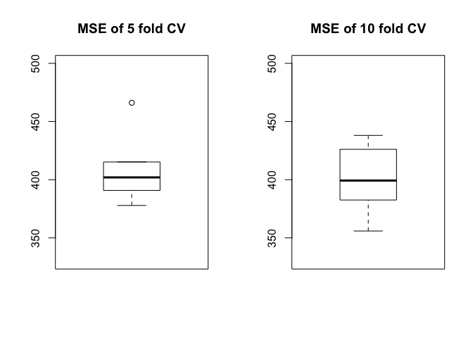

### Bootstrap to assess the variability of model estimates: b0 and b1

``` r
boot.fn<-function(data, index){
    return(coef(lm(target_death_rate~pct_bach_deg25_over + incidence_rate + poverty_percent + pct_public_coverage_alone + pct_unemployed16_over , data = raw_data2, subset=index)))}

# Our usual regression, no bootstrap yet
boot.fn(raw_data2,1:3047)
```

    ##               (Intercept)       pct_bach_deg25_over 
    ##                81.5214119                -1.6400011 
    ##            incidence_rate           poverty_percent 
    ##                 0.2166919                 0.6703476 
    ## pct_public_coverage_alone     pct_unemployed16_over 
    ##                 0.3145169                 0.5633237

``` r
# Compute the estimates by sampling with replacement
# Sample chooses 3047 observations from 3047, with replacement
# Might have duplicates
set.seed(1)

# One draw
boot.fn(raw_data2,sample(3047,3047,replace=T))
```

    ##               (Intercept)       pct_bach_deg25_over 
    ##                78.6902105                -1.6185472 
    ##            incidence_rate           poverty_percent 
    ##                 0.2268301                 0.6923212 
    ## pct_public_coverage_alone     pct_unemployed16_over 
    ##                 0.1767648                 0.5688248

``` r
# Use function boot() to repeat the sampling 10000 times.
# Repeat 10000 times to get the estimates, SEs ad bias

boot(raw_data2, boot.fn, 10000)
```

    ## 
    ## ORDINARY NONPARAMETRIC BOOTSTRAP
    ## 
    ## 
    ## Call:
    ## boot(data = raw_data2, statistic = boot.fn, R = 10000)
    ## 
    ## 
    ## Bootstrap Statistics :
    ##       original        bias    std. error
    ## t1* 81.5214119 -1.979971e-01  5.70959892
    ## t2* -1.6400011  4.540618e-05  0.08890913
    ## t3*  0.2166919  4.460595e-04  0.01093201
    ## t4*  0.6703476  3.669714e-03  0.11485604
    ## t5*  0.3145169 -3.404846e-03  0.12938016
    ## t6*  0.5633237  8.594528e-04  0.18087151

### Model validation: criteria

``` r
newsummary <- function(model)
{
    list('coefs'    = round(t(summary(model)$coef[, 1:2]), 4),
         'criteria' = cbind('SSE'   = anova(model)["Residuals", "Sum Sq"],
                            'PRESS' = PRESS(model),
                            'MSE'   = anova(model)["Residuals", "Mean Sq"],
                            'Rsq'   = summary(model)$adj.r.squared))
}

newsummary(lm(target_death_rate~pct_bach_deg25_over + incidence_rate + poverty_percent + pct_public_coverage_alone + pct_unemployed16_over , data = raw_data2))
```

    ## $coefs
    ##            (Intercept) pct_bach_deg25_over incidence_rate poverty_percent
    ## Estimate       81.5214              -1.640         0.2167          0.6703
    ## Std. Error      3.8507               0.086         0.0068          0.1002
    ##            pct_public_coverage_alone pct_unemployed16_over
    ## Estimate                      0.3145                0.5633
    ## Std. Error                    0.1115                0.1481
    ## 
    ## $criteria
    ##          SSE   PRESS      MSE      Rsq
    ## [1,] 1242441 1249944 408.5634 0.469499
