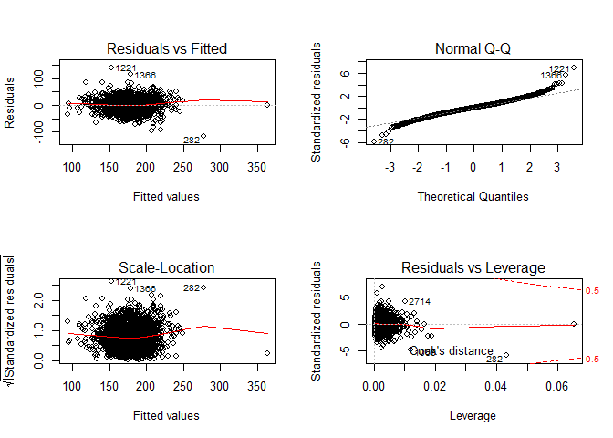

yy2926
================
Yuxin
2018.12.9

``` r
library(broom)
library(dplyr)
```

    ## 
    ## Attaching package: 'dplyr'

    ## The following objects are masked from 'package:stats':
    ## 
    ##     filter, lag

    ## The following objects are masked from 'package:base':
    ## 
    ##     intersect, setdiff, setequal, union

``` r
library(tidyverse)
```

    ## -- Attaching packages --------------------------------------------------------- tidyverse 1.2.1 --

    ## √ ggplot2 3.0.0     √ readr   1.1.1
    ## √ tibble  1.4.2     √ purrr   0.2.5
    ## √ tidyr   0.8.1     √ stringr 1.3.1
    ## √ ggplot2 3.0.0     √ forcats 0.3.0

    ## -- Conflicts ------------------------------------------------------------ tidyverse_conflicts() --
    ## x dplyr::filter() masks stats::filter()
    ## x dplyr::lag()    masks stats::lag()

``` r
library(patchwork)
library("leaps")
library(faraway)
library(boot)
```

    ## 
    ## Attaching package: 'boot'

    ## The following objects are masked from 'package:faraway':
    ## 
    ##     logit, melanoma

``` r
library(ggplot2)
library("gridExtra")
```

    ## 
    ## Attaching package: 'gridExtra'

    ## The following object is masked from 'package:dplyr':
    ## 
    ##     combine

``` r
library(mgcv)
```

    ## Loading required package: nlme

    ## 
    ## Attaching package: 'nlme'

    ## The following object is masked from 'package:dplyr':
    ## 
    ##     collapse

    ## This is mgcv 1.8-24. For overview type 'help("mgcv-package")'.

``` r
raw_data <- read_csv("./Data/Cancer_Registry.csv")
```

    ## Parsed with column specification:
    ## cols(
    ##   .default = col_double(),
    ##   avgDeathsPerYear = col_integer(),
    ##   medIncome = col_integer(),
    ##   popEst2015 = col_integer(),
    ##   binnedInc = col_character(),
    ##   Geography = col_character()
    ## )

    ## See spec(...) for full column specifications.

``` r
raw_data = janitor::clean_names(raw_data)
raw_data1 = raw_data %>% 
  select(-binned_inc) %>% 
  separate(geography, c("county", "state"), sep = ",") %>% 
  mutate(county = as.factor(county), 
         state = as.factor(state),
         avg_ann_count = avg_ann_count / pop_est2015*100000) %>% 
  select(target_death_rate, avg_ann_count, everything())
```

``` r
sapply(raw_data1, function(x) sum(is.na(x)))
```

    ##          target_death_rate              avg_ann_count 
    ##                          0                          0 
    ##        avg_deaths_per_year             incidence_rate 
    ##                          0                          0 
    ##                 med_income                pop_est2015 
    ##                          0                          0 
    ##            poverty_percent              study_per_cap 
    ##                          0                          0 
    ##                 median_age            median_age_male 
    ##                          0                          0 
    ##          median_age_female                     county 
    ##                          0                          0 
    ##                      state         avg_household_size 
    ##                          0                          0 
    ##            percent_married             pct_no_hs18_24 
    ##                          0                          0 
    ##                pct_hs18_24          pct_some_col18_24 
    ##                          0                       2285 
    ##          pct_bach_deg18_24              pct_hs25_over 
    ##                          0                          0 
    ##        pct_bach_deg25_over        pct_employed16_over 
    ##                          0                        152 
    ##      pct_unemployed16_over       pct_private_coverage 
    ##                          0                          0 
    ## pct_private_coverage_alone      pct_emp_priv_coverage 
    ##                        609                          0 
    ##        pct_public_coverage  pct_public_coverage_alone 
    ##                          0                          0 
    ##                  pct_white                  pct_black 
    ##                          0                          0 
    ##                  pct_asian             pct_other_race 
    ##                          0                          0 
    ##     pct_married_households                 birth_rate 
    ##                          0                          0

``` r
## Choose possible variables for our model
raw_data2 = raw_data1 %>% 
  select(target_death_rate, incidence_rate, poverty_percent,  pct_bach_deg25_over, pct_unemployed16_over, pct_public_coverage_alone)
sapply(raw_data2, function(x) sum(is.na(x)))
```

    ##         target_death_rate            incidence_rate 
    ##                         0                         0 
    ##           poverty_percent       pct_bach_deg25_over 
    ##                         0                         0 
    ##     pct_unemployed16_over pct_public_coverage_alone 
    ##                         0                         0

``` r
## No missing values
```

``` r
## Visualization of predictors to find outliers
histogram1 = ggplot(raw_data2, aes(x  = raw_data2$target_death_rate)) + geom_histogram() + labs(title = "pct_target_death_rate")
histogram2 = ggplot(raw_data2, aes(x  = raw_data2$incidence_rate)) + geom_histogram() + labs(title = "pct_incidence_rate")
histogram3 = ggplot(raw_data2, aes(x  = raw_data2$poverty_percent)) + geom_histogram() + labs(title = "pct_poverty_percent")
histogram4 = ggplot(raw_data2, aes(x  = raw_data2$pct_bach_deg25_over)) + geom_histogram() + labs(title = "pct_pct_bach_deg25_over")
histogram5 = ggplot(raw_data2, aes(x  = raw_data2$pct_unemployed16_over)) + geom_histogram() + labs(title = "pct_unemployed16_over")
histogram6 = ggplot(raw_data2, aes(x  = raw_data2$pct_public_coverage_alone)) + geom_histogram() + labs(title = "pct_public_coverage_alone")
grid.arrange(histogram1, histogram2, histogram3, histogram4, histogram5,histogram6, ncol=2)
```

    ## `stat_bin()` using `bins = 30`. Pick better value with `binwidth`.
    ## `stat_bin()` using `bins = 30`. Pick better value with `binwidth`.
    ## `stat_bin()` using `bins = 30`. Pick better value with `binwidth`.
    ## `stat_bin()` using `bins = 30`. Pick better value with `binwidth`.
    ## `stat_bin()` using `bins = 30`. Pick better value with `binwidth`.
    ## `stat_bin()` using `bins = 30`. Pick better value with `binwidth`.


``` r
histogram1 = ggplot(raw_data2, aes(x  = raw_data2$target_death_rate)) + geom_point() + labs(title = "pct_target_death_rate")
```

``` r
## dotplot to make outliers more distinct
dot1 = ggplot(raw_data2, aes(x  = raw_data2$target_death_rate, y =raw_data2$target_death_rate)) + geom_point() + labs(title = "pct_target_death_rate")
dot2 = ggplot(raw_data2, aes(x  = raw_data2$incidence_rate, y =raw_data2$target_death_rate)) + geom_point() + labs(title = "pct_incidence_rate")
dot3 = ggplot(raw_data2, aes(x  = raw_data2$poverty_percent, y =raw_data2$target_death_rate)) + geom_point() + labs(title = "pct_poverty_percent")
dot4 = ggplot(raw_data2, aes(x  = raw_data2$pct_bach_deg25_over, y =raw_data2$target_death_rate)) + geom_point() + labs(title = "pct_pct_bach_deg25_over")
dot5 = ggplot(raw_data2, aes(x  = raw_data2$pct_unemployed16_over, y =raw_data2$target_death_rate)) + geom_point() + labs(title = "pct_unemployed16_over")
dot6 = ggplot(raw_data2, aes(x  = raw_data2$pct_public_coverage_alone, y =raw_data2$target_death_rate)) + geom_point() + labs(title = "pct_public_coverage_alone")
grid.arrange(dot1, dot2, dot3, dot4, dot5, dot6, ncol=2)
```


``` r
## take out outliers 
raw_data3 = raw_data2[-c(1490),]
raw_data3 = raw_data3[-c(282),]
## Two rows are outliers
```

``` r
## Plot new datasets with no outliers
dot1 = ggplot(raw_data3, aes(x  = raw_data3$target_death_rate, y =raw_data3$target_death_rate)) + geom_point() + labs(title = "pct_target_death_rate")
dot2 = ggplot(raw_data3, aes(x  = raw_data3$incidence_rate, y =raw_data3$target_death_rate)) + geom_point() + labs(title = "pct_incidence_rate")
dot3 = ggplot(raw_data3, aes(x  = raw_data3$poverty_percent, y =raw_data3$target_death_rate)) + geom_point() + labs(title = "pct_poverty_percent")
dot4 = ggplot(raw_data3, aes(x  = raw_data3$pct_bach_deg25_over, y =raw_data3$target_death_rate)) + geom_point() + labs(title = "pct_pct_bach_deg25_over")
dot5 = ggplot(raw_data3, aes(x  = raw_data3$pct_unemployed16_over, y =raw_data3$target_death_rate)) + geom_point() + labs(title = "pct_unemployed16_over")
dot6 = ggplot(raw_data3, aes(x  = raw_data3$pct_public_coverage_alone, y =raw_data3$target_death_rate)) + geom_point() + labs(title = "pct_public_coverage_alone")
grid.arrange(dot1, dot2, dot3, dot4, dot5, dot6, ncol=2)
```


``` r
## Descriptive statistics
summary(raw_data3)
```

    ##  target_death_rate incidence_rate  poverty_percent pct_bach_deg25_over
    ##  Min.   : 59.7     Min.   :201.3   Min.   : 3.20   Min.   : 2.50      
    ##  1st Qu.:161.2     1st Qu.:420.3   1st Qu.:12.10   1st Qu.: 9.40      
    ##  Median :178.1     Median :453.5   Median :15.90   Median :12.30      
    ##  Mean   :178.6     Mean   :447.8   Mean   :16.87   Mean   :13.28      
    ##  3rd Qu.:195.2     3rd Qu.:480.8   3rd Qu.:20.40   3rd Qu.:16.10      
    ##  Max.   :293.9     Max.   :718.9   Max.   :47.40   Max.   :42.20      
    ##  pct_unemployed16_over pct_public_coverage_alone
    ##  Min.   : 0.400        Min.   : 2.60            
    ##  1st Qu.: 5.500        1st Qu.:14.90            
    ##  Median : 7.600        Median :18.80            
    ##  Mean   : 7.851        Mean   :19.24            
    ##  3rd Qu.: 9.700        3rd Qu.:23.10            
    ##  Max.   :29.400        Max.   :46.60

``` r
mult.fit1 <- lm(target_death_rate~pct_bach_deg25_over + incidence_rate + poverty_percent + pct_public_coverage_alone + pct_unemployed16_over , data = raw_data2)
summary(mult.fit1)
```

    ## 
    ## Call:
    ## lm(formula = target_death_rate ~ pct_bach_deg25_over + incidence_rate + 
    ##     poverty_percent + pct_public_coverage_alone + pct_unemployed16_over, 
    ##     data = raw_data2)
    ## 
    ## Residuals:
    ##      Min       1Q   Median       3Q      Max 
    ## -115.808  -11.920    0.036   11.653  138.911 
    ## 
    ## Coefficients:
    ##                           Estimate Std. Error t value Pr(>|t|)    
    ## (Intercept)               81.52141    3.85070  21.171  < 2e-16 ***
    ## pct_bach_deg25_over       -1.64000    0.08601 -19.066  < 2e-16 ***
    ## incidence_rate             0.21669    0.00677  32.009  < 2e-16 ***
    ## poverty_percent            0.67035    0.10016   6.692  2.6e-11 ***
    ## pct_public_coverage_alone  0.31452    0.11153   2.820 0.004832 ** 
    ## pct_unemployed16_over      0.56332    0.14812   3.803 0.000146 ***
    ## ---
    ## Signif. codes:  0 '***' 0.001 '**' 0.01 '*' 0.05 '.' 0.1 ' ' 1
    ## 
    ## Residual standard error: 20.21 on 3041 degrees of freedom
    ## Multiple R-squared:  0.4704, Adjusted R-squared:  0.4695 
    ## F-statistic: 540.1 on 5 and 3041 DF,  p-value: < 2.2e-16

``` r
## Cook distance
stu_res<-rstandard(mult.fit1)
outliers_y<-stu_res[abs(stu_res)>2.5]

# Measures of influence:
# Gives DFFITS, Cook's Distance, Hat diagonal elements, and others.

influence.measures(mult.fit1)
```

    ## Influence measures of
    ##   lm(formula = target_death_rate ~ pct_bach_deg25_over + incidence_rate +      poverty_percent + pct_public_coverage_alone + pct_unemployed16_over,      data = raw_data2) :
    ## 
    ##         dfb.1_  dfb.p__2  dfb.inc_  dfb.pvr_  dfb.p___  dfb.p_16     dffit
    ## 1     3.78e-03 -4.70e-03 -4.44e-03  2.84e-03  1.40e-03 -5.02e-03 -1.22e-02
    ## 2    -1.44e-03  1.00e-02 -3.12e-03  7.49e-03 -3.61e-03  5.56e-04  1.44e-02
    ## 3     2.18e-02  1.55e-02 -3.79e-02 -1.87e-02  2.63e-02 -3.38e-03  5.17e-02
    ## 4     3.91e-03 -3.57e-03 -4.64e-03 -1.28e-02  7.23e-03  1.06e-02  1.88e-02
    ## 5    -5.88e-03 -4.04e-03  1.04e-02  8.90e-03 -1.33e-02  5.97e-03 -1.87e-02
    ## 6     6.89e-03  6.75e-03 -1.38e-02  1.92e-02  4.19e-03 -3.46e-02 -4.41e-02
    ## 7     1.47e-02 -1.26e-02 -4.16e-03  3.19e-04 -2.37e-02  1.34e-02 -3.22e-02
    ## 8     4.06e-03  3.11e-04 -6.71e-03 -6.24e-03  8.08e-03  3.27e-04  1.34e-02
    ## 9     4.35e-06 -3.72e-06 -1.05e-06  5.08e-07 -6.16e-06  7.02e-07 -1.03e-05
    ## 10    4.61e-03 -1.61e-03 -6.59e-03  3.57e-03  1.15e-03 -5.77e-03 -1.20e-02
    ## 11    1.98e-02 -6.20e-02  1.20e-02  9.49e-03 -3.67e-02  1.13e-02 -7.04e-02
    ## 12    1.14e-02 -7.80e-03 -1.03e-02  4.30e-03 -7.18e-03  3.40e-05 -1.80e-02
    ## 13    1.61e-02  3.77e-03 -2.20e-02 -3.20e-02  2.31e-02  1.10e-02  4.43e-02
    ## 14    3.00e-03 -3.86e-03 -2.90e-03  2.69e-03 -6.54e-04 -2.47e-03 -7.92e-03
    ## 15   -6.70e-04  1.52e-03 -1.71e-04 -5.36e-04  1.25e-03  8.08e-06  2.09e-03
    ## 16   -1.90e-03  3.74e-04  3.37e-03  3.03e-03 -4.75e-03 -5.97e-04 -9.58e-03
    ## 17    1.93e-03 -2.28e-03 -2.09e-03  6.20e-04  1.08e-03 -2.42e-03 -5.42e-03
    ## 18   -1.19e-02  2.36e-02 -1.88e-03  4.22e-02 -6.25e-03 -3.81e-02 -6.16e-02
    ## 19    1.39e-03 -4.78e-03  2.78e-04 -5.67e-05 -3.35e-03  3.43e-03 -9.15e-03
    ## 20    1.22e-02 -1.53e-02 -7.46e-03 -2.11e-03 -2.29e-03 -1.57e-03 -1.97e-02
    ## 21    3.09e-03 -2.40e-02  7.67e-03 -4.50e-02  3.01e-02  6.40e-05 -5.42e-02
    ## 22   -6.85e-03  4.03e-03  6.90e-03 -1.65e-03  1.33e-04 -2.38e-04 -1.38e-02
    ## 23   -3.41e-05  1.03e-03  2.05e-04  6.82e-04 -2.48e-03  1.27e-03 -4.75e-03
    ## 24    8.10e-03 -1.17e-02  2.62e-03 -2.04e-02 -6.85e-03  2.73e-02  3.99e-02
    ## 25   -9.94e-03 -2.50e-02  2.36e-02  1.80e-03  6.04e-03 -1.01e-02  5.01e-02
    ## 26    1.01e-02 -5.34e-03 -1.27e-02 -6.25e-03 -1.14e-03  1.96e-02  2.71e-02
    ## 27    1.47e-04  6.77e-04 -8.33e-04  4.67e-04 -3.87e-04  6.40e-04 -1.93e-03
    ## 28   -6.47e-03  5.02e-03  4.81e-03  7.03e-03  1.39e-03 -6.94e-03  1.21e-02
    ## 29    7.61e-03 -1.87e-02 -4.92e-03 -2.38e-02 -1.43e-02  7.40e-02  8.16e-02
    ## 30    4.63e-02  1.84e-03 -4.78e-02  1.06e-02 -3.05e-02  4.48e-03 -6.76e-02
    ## 31    1.25e-01 -1.75e-02 -1.58e-01 -4.63e-02  6.48e-02 -2.43e-02  1.81e-01
    ## 32   -6.91e-03 -1.95e-03  2.62e-03 -9.90e-03  2.65e-02 -1.03e-02  3.81e-02
    ## 33    9.69e-05 -6.28e-03  5.12e-03  3.77e-02 -2.97e-02 -3.59e-03  4.19e-02
    ## 34   -7.39e-02  4.70e-02  6.25e-02  1.69e-02 -7.36e-03  1.27e-02 -9.06e-02
    ## 35    3.11e-04 -2.42e-06 -3.82e-04 -3.02e-04 -4.88e-05  3.71e-04 -6.97e-04
    ## 36   -7.35e-03 -4.96e-04  4.63e-03 -9.34e-03  2.22e-02 -1.18e-02  2.74e-02
    ## 37    3.27e-04  9.01e-04 -1.54e-03  1.13e-03  6.34e-05 -3.16e-04 -2.93e-03
    ## 38   -2.39e-02  1.42e-02  1.94e-02  8.53e-03  1.81e-03 -5.31e-03 -2.79e-02
    ## 39   -1.40e-02  3.52e-03  1.61e-02 -1.59e-02  1.78e-02 -3.89e-03  3.01e-02
    ## 40   -2.18e-03 -6.61e-04  3.40e-03 -1.74e-03  4.05e-03 -3.95e-03  8.92e-03
    ## 41    8.98e-03  6.67e-03 -9.45e-03 -1.67e-02 -6.95e-04  1.92e-02  3.27e-02
    ## 42   -1.62e-02  7.47e-03  1.68e-02  1.08e-04  8.34e-03 -8.62e-03  2.46e-02
    ## 43   -1.04e-02  4.67e-04  1.14e-02 -1.91e-03  9.06e-03 -7.78e-03  1.67e-02
    ## 44   -1.31e-02 -2.25e-03  1.20e-02 -4.50e-03  1.76e-02 -8.50e-03  2.85e-02
    ## 45   -1.51e-02 -2.49e-02  2.95e-02 -1.62e-02  1.09e-02  8.24e-03  5.48e-02
    ## 46   -1.45e-02  1.15e-03  2.31e-03  1.31e-02  2.07e-02 -1.16e-02  5.03e-02
    ## 47    1.55e-04 -5.02e-05 -1.96e-04 -1.35e-04 -2.03e-07  1.99e-04 -3.13e-04
    ## 48    1.43e-03 -2.18e-03  4.52e-04 -5.12e-05 -1.49e-03  3.03e-05  3.96e-03
    ## 49   -1.91e-03 -4.75e-03  2.03e-03 -7.33e-03  1.02e-02  1.00e-03  1.95e-02
    ## 50   -2.26e-02  1.37e-02  1.54e-02  5.07e-04  3.17e-02 -3.33e-02  4.59e-02
    ## 51    2.04e-03 -5.75e-03  3.98e-04 -8.99e-03  6.61e-03  1.19e-03  1.40e-02
    ## 52   -2.07e-02 -6.33e-03  1.82e-02  2.41e-03  1.06e-02  1.05e-02  4.91e-02
    ## 53    3.84e-03 -1.14e-02 -1.95e-03 -2.95e-02  1.95e-02  7.52e-03 -3.36e-02
    ## 54    1.43e-03 -2.14e-03 -9.48e-04 -7.38e-04  2.87e-03 -3.04e-03  6.83e-03
    ## 55    3.67e-02 -2.97e-02 -2.14e-02 -4.07e-02 -2.11e-02  7.08e-02  8.40e-02
    ## 56    1.05e-03 -4.54e-03  8.11e-04 -1.22e-03  2.70e-03 -2.15e-03  1.01e-02
    ## 57   -4.96e-03  4.45e-03  4.46e-03  5.16e-03 -9.49e-04 -4.11e-03  8.91e-03
    ## 58   -3.78e-02  2.52e-02  3.51e-02  2.35e-02 -4.17e-02  4.18e-02 -8.24e-02
    ## 59    1.85e-02 -3.29e-02  2.80e-03 -7.55e-04 -1.99e-02  8.12e-03  4.02e-02
    ## 60    5.19e-03 -1.66e-03 -5.93e-03 -1.93e-03  5.56e-03 -5.83e-03  1.16e-02
    ## 61   -7.24e-03  9.31e-03  2.70e-03  1.85e-03 -2.43e-03  5.73e-03 -1.76e-02
    ## 62    2.66e-03  5.84e-04 -6.37e-03  4.44e-03 -3.99e-03  6.09e-03 -1.31e-02
    ## 63   -6.22e-03  3.05e-03  4.61e-03 -4.49e-03  1.40e-02 -1.05e-02  1.92e-02
    ## 64   -3.54e-03  2.70e-04  5.23e-03 -2.83e-03 -4.43e-03  7.72e-03 -1.35e-02
    ## 65   -1.64e-03 -9.25e-03  6.81e-03 -9.04e-03  4.08e-03  4.99e-03  1.82e-02
    ## 66   -5.34e-03  3.10e-03  1.63e-04 -5.85e-03  1.81e-02 -8.42e-03  2.11e-02
    ## 67   -1.09e-02  5.48e-03  1.28e-02 -9.92e-03  4.17e-03  1.02e-03 -2.24e-02
    ## 68   -8.15e-05  2.64e-05  8.48e-05  4.91e-05 -9.15e-06 -5.95e-05 -1.38e-04
    ## 69    5.52e-03  5.21e-02 -4.93e-02 -8.65e-03  3.20e-02  2.10e-03 -8.15e-02
    ## 70    3.12e-03 -6.59e-03  7.25e-04 -4.01e-03 -2.42e-03  5.94e-03  9.94e-03
    ## 71   -3.81e-06  4.43e-05 -1.24e-05  4.18e-06 -4.99e-05  5.27e-05 -1.52e-04
    ## 72   -1.60e-03  2.85e-03  2.27e-03  5.55e-03 -7.26e-03 -1.64e-05 -1.19e-02
    ## 73   -4.98e-02  5.86e-04  3.28e-02 -4.19e-02  7.01e-02  2.13e-02  1.14e-01
    ## 74    7.02e-04  5.36e-03 -4.55e-03  1.83e-04  1.05e-03  8.79e-04 -8.23e-03
    ## 75   -1.19e-03  4.75e-03 -8.15e-04 -2.69e-05 -1.62e-03  2.36e-03 -9.72e-03
    ## 76    3.31e-03 -6.57e-04 -3.44e-03  2.76e-03 -4.00e-03  4.91e-04 -7.37e-03
    ## 77    5.75e-03 -2.78e-02 -2.46e-03 -1.55e-02  2.98e-02 -8.24e-03  6.59e-02
    ## 78    1.75e-03 -8.64e-03  2.59e-03 -7.70e-03  2.31e-03  6.35e-03  1.75e-02
    ## 79   -1.83e-02  2.73e-02  5.21e-04 -4.67e-02  6.58e-02 -9.53e-03  7.66e-02
    ## 80   -3.29e-03  2.32e-03  2.13e-03  2.33e-03 -1.32e-03  1.10e-03 -5.33e-03
    ## 81    8.19e-03  2.64e-02 -2.77e-02 -2.03e-02  3.05e-02 -1.59e-03  4.96e-02
    ## 82    8.96e-03 -1.23e-02 -5.88e-03  5.31e-03 -8.67e-03  3.00e-03 -1.88e-02
    ## 83    1.00e-02 -4.54e-03 -7.31e-03 -5.36e-03  2.77e-03 -4.81e-03  1.44e-02
    ## 84    9.27e-03  2.30e-03 -1.56e-02 -1.56e-02  2.28e-02 -6.45e-03  3.29e-02
    ## 85    2.69e-04 -8.30e-04 -7.95e-04  1.04e-03 -3.15e-04  6.19e-04 -3.11e-03
    ## 86   -3.43e-04  7.32e-03 -1.09e-02  1.18e-02 -3.41e-03  6.14e-03 -2.80e-02
    ## 87   -1.71e-02  3.13e-02 -5.56e-03 -7.06e-03  1.04e-02  2.35e-02 -4.84e-02
    ## 88    7.84e-04 -1.18e-03  1.99e-03 -3.20e-03 -1.03e-03  1.23e-03  7.18e-03
    ## 89   -1.33e-03  5.56e-03 -2.81e-03  5.76e-03 -4.64e-03  3.80e-03 -1.33e-02
    ## 90   -6.53e-03  2.35e-02 -1.21e-03  1.25e-02 -5.63e-03 -3.07e-03  3.06e-02
    ## 91    7.52e-03 -7.50e-03 -1.62e-03 -5.36e-03 -3.13e-03  2.28e-03  1.22e-02
    ## 92    7.79e-04 -3.11e-03 -1.04e-04  1.92e-03 -1.60e-03 -1.12e-04 -5.44e-03
    ## 93    4.03e-02  1.88e-02 -6.24e-02 -3.62e-02  4.17e-02 -2.12e-03  8.49e-02
    ## 94   -2.17e-03 -1.00e-03  2.65e-03  5.12e-04 -5.01e-04  5.37e-04 -4.35e-03
    ## 95   -2.54e-04  1.34e-03 -4.26e-05  6.99e-04 -3.04e-04 -4.10e-04  2.20e-03
    ## 96    5.83e-02 -1.51e-02 -5.97e-02 -2.22e-02  2.56e-03  1.22e-02  6.75e-02
    ## 97   -1.34e-03  4.22e-03 -7.34e-03  9.59e-03 -2.10e-04  1.55e-03 -2.22e-02
    ## 98   -9.33e-04  2.65e-02 -1.77e-02  1.38e-02  8.69e-03 -2.15e-02 -4.83e-02
    ## 99   -2.28e-03  1.59e-03  6.45e-04 -2.00e-03  2.55e-03  1.68e-03 -4.68e-03
    ## 100  -1.71e-03  6.96e-04  8.26e-04  1.40e-03 -4.28e-04  1.02e-03 -3.34e-03
    ## 101  -3.93e-03  1.01e-03 -4.22e-04 -1.41e-04  5.46e-03  1.31e-03 -1.22e-02
    ## 102   1.66e-02  1.77e-02 -2.79e-02  1.55e-02  1.62e-02 -4.58e-02  6.21e-02
    ## 103   3.05e-02 -2.43e-02 -1.44e-02 -2.47e-03 -6.21e-03 -1.83e-02  4.27e-02
    ## 104   7.39e-02 -1.38e-02 -7.52e-02 -1.08e-02 -3.25e-03 -7.63e-03  8.33e-02
    ## 105  -1.29e-02 -2.70e-03  4.46e-03  2.01e-02 -4.20e-02  6.97e-02 -9.30e-02
    ## 106  -6.47e-03  3.78e-03  8.04e-04  2.09e-02 -8.83e-03  4.50e-03  2.92e-02
    ## 107   1.11e-02  1.84e-04 -1.19e-02 -1.27e-03  6.52e-03 -1.38e-02  2.16e-02
    ## 108   3.23e-03  1.01e-02 -1.26e-03  3.30e-03 -3.85e-03 -1.14e-02  2.81e-02
    ## 109   8.03e-04  7.08e-03 -2.95e-03  6.48e-03 -3.64e-03 -3.42e-03  1.24e-02
    ## 110   7.41e-03  5.31e-03 -1.83e-02  8.67e-03 -9.80e-03  1.73e-02 -3.52e-02
    ## 111   1.54e-02  7.31e-03 -1.44e-02  6.02e-03 -2.98e-03 -1.86e-02  3.66e-02
    ## 112   2.08e-02 -2.55e-02 -4.45e-03 -3.10e-02 -1.80e-02  5.41e-02  6.54e-02
    ## 113  -2.21e-03  4.48e-04  3.54e-04  8.13e-04  7.91e-03 -1.23e-02 -1.56e-02
    ## 114  -1.06e-02  4.04e-03  5.60e-04  1.49e-02  1.57e-02 -2.75e-02 -4.16e-02
    ## 115  -3.15e-02  3.67e-02 -2.76e-03 -4.59e-03  4.55e-02 -1.02e-02 -6.27e-02
    ## 116   4.81e-02 -4.96e-02 -1.08e-02 -6.09e-02 -6.88e-02  1.56e-01  1.80e-01
    ## 117   1.82e-02 -1.90e-02  1.67e-03  1.43e-02 -3.87e-02  8.41e-03  4.25e-02
    ## 118   1.54e-02 -2.05e-02 -3.43e-04 -4.96e-03 -1.73e-02  1.21e-02  2.79e-02
    ## 119  -1.37e-01  1.91e-01  1.50e-02  5.95e-02  1.63e-01 -1.80e-01 -2.71e-01
    ## 120  -1.22e-02 -1.31e-03  4.06e-03  1.09e-02  4.81e-02 -8.71e-02 -1.02e-01
    ## 121   6.83e-03 -8.12e-03 -2.52e-03 -1.62e-02 -4.31e-03  2.66e-02  3.02e-02
    ## 122   4.51e-02 -7.36e-02 -1.36e-02 -4.72e-02 -5.42e-02  1.43e-01  1.66e-01
    ## 123   4.35e-03 -9.86e-03 -4.09e-03 -3.54e-02  1.51e-02  3.57e-02  5.20e-02
    ## 124  -4.94e-02  8.54e-02 -8.70e-04 -7.06e-03  6.08e-02 -3.97e-02 -1.15e-01
    ## 125  -3.27e-02  2.91e-02  5.90e-03  5.57e-02  2.75e-02 -7.86e-02 -1.01e-01
    ## 126   5.83e-04 -2.60e-03 -2.06e-04 -7.92e-04  2.39e-03 -3.30e-03 -6.49e-03
    ## 127   4.41e-03 -5.91e-03 -3.55e-04 -1.22e-03 -6.12e-03  6.21e-03  9.42e-03
    ## 128   1.67e-03 -1.67e-03 -1.38e-04  2.79e-03 -8.39e-03  1.06e-02  1.51e-02
    ## 129  -7.52e-03  6.40e-03  7.40e-03 -5.92e-03  7.06e-03 -3.10e-03  1.45e-02
    ## 130  -5.07e-04  7.51e-04  5.99e-04 -1.99e-04 -2.93e-05  9.91e-06  1.62e-03
    ## 131   4.04e-03 -4.70e-03 -5.95e-03 -1.19e-03  3.72e-03 -7.33e-04 -1.34e-02
    ## 132   1.63e-04  4.66e-05 -2.00e-04  1.07e-03 -1.36e-03  5.43e-04 -1.87e-03
    ## 133   7.11e-05 -2.38e-03  3.65e-04  8.09e-05 -3.29e-04  8.55e-04 -4.16e-03
    ## 134  -1.26e-03  2.18e-03  1.01e-03 -9.06e-04  4.75e-04  3.55e-04  3.55e-03
    ## 135  -3.31e-03  3.48e-03  3.52e-03 -1.06e-03  7.79e-04 -5.77e-04  6.79e-03
    ## 136  -8.40e-03  9.92e-03  9.94e-03 -4.04e-03 -2.03e-03  4.15e-03  2.17e-02
    ## 137  -5.14e-03  5.62e-03  5.87e-03  1.28e-03 -2.81e-03  1.29e-03  1.19e-02
    ## 138   1.75e-04 -1.72e-04 -4.30e-04  6.66e-04 -3.25e-04  7.21e-05 -1.33e-03
    ## 139   4.63e-03 -3.09e-03 -4.81e-03  3.51e-03  2.56e-03 -1.14e-02 -1.48e-02
    ## 140  -2.97e-04  6.36e-04  8.68e-05 -1.47e-04  1.56e-04  1.28e-04  7.82e-04
    ## 141  -1.13e-04  1.06e-04  1.34e-04 -8.22e-05 -3.80e-05  1.40e-04  2.93e-04
    ## 142   3.24e-03 -2.46e-03 -2.81e-03  1.94e-03 -1.26e-03 -2.11e-03 -5.27e-03
    ## 143  -4.62e-03  2.65e-03  4.79e-03 -1.46e-03  2.49e-04  2.64e-03  7.03e-03
    ## 144   9.87e-03  1.24e-03 -1.15e-02  5.30e-03 -4.66e-03 -6.51e-03 -2.02e-02
    ## 145   6.63e-03 -1.42e-02  1.45e-03  7.28e-03 -4.81e-03 -1.63e-02 -2.47e-02
    ## 146  -1.24e-02  6.24e-03  1.72e-02 -1.22e-02 -2.76e-03  1.63e-02  3.19e-02
    ## 147   1.69e-04 -6.22e-04  2.08e-04  1.76e-05 -2.88e-04 -5.91e-05 -7.14e-04
    ## 148   4.67e-03 -8.83e-03 -3.64e-03  2.18e-03  1.10e-03 -3.80e-03 -1.43e-02
    ## 149   1.25e-02 -1.35e-02 -1.21e-02  6.35e-03  3.06e-03 -1.57e-02 -3.05e-02
    ## 150  -3.56e-04  9.09e-04  1.60e-04 -4.30e-04  6.74e-05  5.50e-04  1.47e-03
    ## 151  -2.59e-03  2.99e-03  2.34e-03 -7.56e-04 -3.50e-04  1.79e-03  5.24e-03
    ## 152  -2.53e-03  5.20e-03  1.65e-03 -1.27e-03 -4.42e-04  2.33e-03  7.98e-03
    ## 153   1.30e-02 -8.76e-03 -1.23e-02  1.13e-02 -9.00e-03 -5.33e-03 -2.23e-02
    ## 154   1.45e-02 -2.29e-02 -7.86e-05  8.86e-03 -2.64e-02  5.75e-03 -3.36e-02
    ## 155  -2.71e-03  4.19e-05  3.98e-03 -4.31e-03  5.95e-04  4.87e-03  8.31e-03
    ## 156  -6.58e-03  1.66e-02  2.98e-03 -5.48e-03  9.50e-04  6.25e-03  2.43e-02
    ## 157  -6.52e-03  1.23e-02  8.83e-03 -1.31e-02 -5.87e-03  2.04e-02  3.69e-02
    ## 158   4.92e-03 -1.14e-02 -1.27e-03  1.39e-02 -5.92e-03 -1.44e-02 -2.53e-02
    ## 159  -1.37e-03  2.54e-03  2.90e-03 -5.97e-03 -2.05e-03  8.65e-03  1.35e-02
    ## 160   5.92e-03 -2.57e-02  1.23e-02  5.09e-03 -2.41e-02  5.50e-03 -3.66e-02
    ## 161   4.99e-03 -3.41e-04 -4.28e-03  1.15e-02 -8.70e-03 -4.35e-03  1.40e-02
    ## 162  -6.17e-04 -7.09e-03  9.04e-03  3.31e-04 -1.48e-02  1.00e-02 -2.16e-02
    ## 163  -2.19e-03 -2.92e-02  5.75e-02  2.53e-02 -7.19e-02 -3.01e-02 -1.30e-01
    ## 164  -4.37e-03 -2.74e-02  3.12e-02  1.00e-02 -3.52e-02  2.90e-03 -5.67e-02
    ## 165  -1.82e-02 -4.87e-03  2.93e-02  7.15e-03 -1.31e-02 -1.80e-03 -3.53e-02
    ## 166  -2.85e-02 -3.65e-03  1.94e-02 -2.90e-02  1.07e-01 -9.48e-02  1.42e-01
    ## 167   1.13e-02 -3.95e-02  2.30e-02 -1.44e-02 -2.67e-02  5.63e-03 -6.14e-02
    ## 168   2.51e-03 -1.03e-03 -2.43e-03 -2.37e-03  2.55e-03 -1.45e-03  4.88e-03
    ## 169  -1.95e-03 -8.03e-03  1.19e-02  1.21e-02 -2.09e-02  1.81e-03 -2.54e-02
    ## 170  -3.53e-02  1.90e-02  2.99e-02 -7.25e-02  1.87e-02  8.31e-02 -1.13e-01
    ## 171  -3.15e-03 -8.96e-03  1.89e-02  1.42e-02 -2.93e-02  1.41e-04 -3.90e-02
    ## 172  -1.28e-03  6.65e-04  1.21e-03  4.35e-04 -5.32e-04  5.43e-04 -1.82e-03
    ## 173   1.30e-02 -6.98e-02  4.09e-02  1.26e-02 -7.68e-02  3.34e-02 -1.05e-01
    ## 174  -1.75e-02 -1.43e-02  1.30e-02  2.22e-03  2.09e-02 -9.36e-03 -5.31e-02
    ## 175   1.34e-02 -1.41e-02  1.08e-02  6.23e-03 -4.18e-02  3.93e-03 -6.06e-02
    ## 176  -2.10e-02 -3.49e-02  9.84e-02 -3.53e-02 -5.65e-02 -1.14e-02 -1.81e-01
    ## 177   3.64e-02 -7.59e-02  6.58e-02  1.15e-01 -3.05e-01  1.63e-01 -3.31e-01
    ## 178  -1.32e-02  3.10e-03  2.23e-02  2.31e-02 -1.96e-02 -2.07e-02 -4.52e-02
    ## 179   8.33e-04  2.86e-04 -2.93e-03  6.64e-03  6.48e-03 -1.49e-02  1.87e-02
    ## 180  -1.45e-02 -3.54e-03  2.61e-02 -1.27e-03 -7.24e-03 -6.17e-03 -3.50e-02
    ## 181  -2.82e-03 -2.79e-03  6.63e-03 -2.43e-03 -2.03e-03  7.43e-04 -9.70e-03
    ## 182  -1.03e-02 -1.71e-02  2.44e-02  3.59e-02 -2.97e-02 -1.73e-02 -5.30e-02
    ## 183  -4.22e-02  1.14e-02  5.27e-02  4.68e-03 -1.36e-02 -4.39e-04 -6.72e-02
    ## 184  -4.25e-03 -9.85e-03  1.83e-02 -5.69e-03 -2.38e-02  2.44e-02 -4.16e-02
    ## 185  -6.44e-03 -3.33e-02  2.87e-02  1.50e-02 -2.41e-02 -4.81e-03 -5.21e-02
    ## 186  -4.31e-03  7.25e-03 -2.18e-03  3.89e-03  1.22e-02 -1.29e-02  1.99e-02
    ## 187   6.65e-03 -1.44e-02  8.82e-03 -3.46e-02 -1.08e-02  3.43e-02 -5.51e-02
    ## 188  -4.91e-03 -3.42e-02  3.83e-02  2.66e-02 -4.90e-02 -4.18e-03 -6.91e-02
    ## 189   1.62e-01 -8.06e-02 -1.06e-01  1.99e-02 -1.59e-01  6.67e-02 -2.18e-01
    ## 190  -6.61e-04 -3.12e-04  1.23e-03  1.90e-04 -1.44e-03  1.52e-03 -2.36e-03
    ## 191   4.10e-04 -1.20e-02  1.77e-02  6.94e-03 -2.38e-02 -7.75e-03 -4.35e-02
    ## 192  -7.66e-04  7.26e-04  8.05e-04  2.69e-04 -2.01e-04 -7.28e-05  1.43e-03
    ## 193   2.67e-03  1.13e-02 -1.19e-02 -3.77e-04  6.35e-03 -5.17e-03 -2.44e-02
    ## 194   7.07e-02 -7.51e-02 -2.84e-03 -6.21e-04 -9.62e-02  1.44e-02 -1.38e-01
    ## 195   2.08e-02 -1.35e-02 -1.80e-02  2.63e-03 -1.43e-02  7.27e-03 -3.21e-02
    ## 196   1.20e-02  2.05e-02 -3.36e-02  3.39e-03  9.94e-03 -4.06e-03 -4.88e-02
    ## 197  -2.55e-03  8.89e-03 -7.25e-03  1.71e-02 -4.56e-03 -4.20e-03 -2.91e-02
    ## 198   4.60e-02 -4.77e-04 -5.73e-02 -6.49e-03 -1.25e-02  2.05e-02 -6.80e-02
    ## 199   8.58e-03 -2.17e-03 -9.82e-03 -2.87e-03 -5.52e-03  1.12e-02 -1.65e-02
    ## 200   8.80e-03  1.10e-02 -1.96e-02  3.96e-03 -4.32e-03  8.24e-03 -2.99e-02
    ## 201   2.25e-03 -3.32e-03 -9.07e-04  1.46e-04 -1.31e-03  1.40e-03  5.14e-03
    ## 202  -6.68e-02  1.84e-02  5.34e-02 -4.65e-02  4.48e-02  4.01e-02 -9.85e-02
    ## 203   9.15e-03 -1.97e-04  3.20e-03 -1.82e-02 -2.09e-02  3.56e-02  5.68e-02
    ## 204  -1.37e-03  1.36e-02 -2.82e-03 -2.36e-03  1.49e-03  1.46e-03  1.88e-02
    ## 205   2.20e-02 -7.93e-03 -1.82e-02  6.26e-04 -3.76e-03 -6.45e-03  2.78e-02
    ## 206   3.94e-03 -4.03e-03  1.71e-02 -9.01e-03 -3.65e-02  3.44e-02  6.54e-02
    ## 207  -3.73e-05 -1.42e-03  1.75e-03 -1.28e-03 -4.47e-04  8.66e-05  3.30e-03
    ## 208   5.76e-03 -6.89e-04 -1.17e-03 -3.16e-03 -8.28e-03  9.85e-03  2.21e-02
    ## 209   7.67e-02 -1.99e-02 -1.02e-01  2.91e-02 -1.29e-02  2.72e-02  1.33e-01
    ## 210   6.67e-03  7.46e-02 -3.45e-02 -2.73e-03 -4.66e-03  1.48e-02  1.05e-01
    ## 211   9.38e-03 -1.06e-02  6.86e-04 -8.89e-03 -9.98e-03  1.31e-02  2.43e-02
    ## 212   5.96e-03 -4.72e-03 -5.04e-03  5.60e-03 -1.27e-03 -5.52e-03  1.33e-02
    ## 213  -4.22e-04  5.49e-04 -1.33e-03  3.27e-03 -1.00e-03 -1.91e-04 -6.67e-03
    ## 214  -3.81e-03  1.93e-03 -3.91e-04 -2.23e-03  5.22e-03  3.51e-03 -1.11e-02
    ## 215   7.47e-03 -1.35e-02  1.09e-03  2.48e-02 -1.31e-02 -1.85e-02  4.07e-02
    ## 216  -1.03e-02 -4.85e-03  2.60e-02  1.49e-02 -2.44e-02 -6.51e-05  4.06e-02
    ## 217   3.08e-04  1.94e-03 -7.93e-04  5.84e-03 -4.35e-03 -9.04e-04  6.70e-03
    ## 218  -3.62e-03 -8.75e-04  7.11e-03  6.35e-04 -1.72e-03 -1.94e-03  9.25e-03
    ## 219   3.16e-02 -2.22e-02  1.03e-03 -2.82e-02 -3.76e-02  3.60e-02  8.21e-02
    ## 220  -3.47e-02  1.16e-02  3.72e-02  2.42e-02 -1.10e-02 -4.21e-04  5.19e-02
    ## 221   6.76e-03 -1.28e-03 -2.96e-04  4.21e-03 -2.08e-02  1.73e-02  3.08e-02
    ## 222   2.85e-03 -2.81e-04 -2.88e-03 -2.08e-03  3.26e-04 -8.63e-05 -5.01e-03
    ## 223   1.72e-03  4.83e-04 -4.08e-03  4.30e-03 -4.54e-05 -3.08e-03 -8.35e-03
    ## 224   1.67e-02 -1.94e-02 -6.06e-03 -2.03e-03 -1.33e-02  1.13e-02  2.66e-02
    ## 225   1.72e-02 -7.36e-03 -1.79e-02  4.56e-03 -2.84e-03 -1.63e-03  2.28e-02
    ## 226   5.55e-03 -4.12e-03 -3.73e-03 -2.56e-03 -5.73e-04  1.36e-03  6.94e-03
    ## 227   8.02e-03 -1.79e-03  3.18e-03 -1.29e-03 -1.88e-02  7.93e-03  3.27e-02
    ## 228   8.35e-03 -3.15e-03 -5.49e-03  3.33e-02 -2.57e-02 -7.59e-03  3.73e-02
    ## 229   4.12e-03 -3.38e-03 -1.17e-03 -9.14e-04 -6.52e-03  6.93e-03  9.30e-03
    ## 230   1.62e-02  1.20e-02 -1.85e-02 -5.01e-03 -8.47e-03  1.00e-02  3.64e-02
    ## 231   2.55e-02 -1.38e-02 -1.87e-02 -4.12e-03 -9.20e-03  6.49e-03  2.97e-02
    ## 232   9.63e-04  1.24e-03 -1.19e-03 -5.01e-04  7.13e-04 -1.38e-03  3.39e-03
    ## 233  -7.74e-03  1.29e-02 -7.53e-04 -8.82e-03  1.50e-02 -3.41e-03 -2.11e-02
    ## 234   4.51e-03  1.43e-02 -9.45e-03 -8.36e-03  5.47e-03  1.26e-03  2.56e-02
    ## 235   1.97e-02 -3.48e-03 -1.93e-02 -1.22e-03 -1.10e-04 -6.47e-03  2.45e-02
    ## 236  -4.23e-03  1.70e-03  2.68e-03  2.94e-04  2.26e-03 -2.36e-04 -5.47e-03
    ## 237   5.59e-02 -2.88e-02 -5.70e-02 -2.62e-02  2.52e-02 -4.93e-03  8.19e-02
    ## 238   6.18e-02 -2.85e-02 -6.03e-02  9.10e-03 -2.07e-02  1.41e-02  7.44e-02
    ## 239   5.77e-03 -3.43e-03 -3.51e-03 -2.89e-03 -6.42e-04  2.62e-04  7.57e-03
    ## 240   2.01e-02 -7.36e-03 -2.47e-02 -2.52e-03  2.32e-02 -2.62e-02  5.13e-02
    ## 241   1.18e-02 -9.07e-03 -6.75e-03 -5.70e-04 -6.03e-03  2.02e-03  1.45e-02
    ## 242   6.09e-03 -1.77e-03  1.25e-05 -9.31e-04 -1.15e-02  7.05e-03  1.90e-02
    ## 243   8.71e-03  1.00e-02  5.08e-04 -8.27e-03 -2.17e-02  1.88e-02  5.25e-02
    ## 244   7.44e-03  4.33e-04 -7.19e-03 -1.26e-02 -2.44e-03  2.03e-02  2.55e-02
    ## 245  -5.36e-04 -2.89e-03  2.27e-03  3.04e-03 -7.11e-04 -3.56e-03  6.57e-03
    ## 246   3.85e-02 -1.88e-02 -4.09e-02 -1.08e-02  1.73e-02 -8.70e-03  6.11e-02
    ## 247   3.92e-02 -2.73e-02 -1.37e-02 -5.70e-03 -4.21e-02  2.89e-02  6.47e-02
    ## 248   4.14e-03  2.34e-04 -3.78e-03 -2.11e-03  7.95e-04 -9.74e-05  8.95e-03
    ## 249  -7.69e-04  9.14e-04  9.25e-05  4.23e-04  9.43e-04 -1.31e-03 -1.97e-03
    ## 250   6.27e-02 -2.56e-02 -6.96e-02  6.17e-03 -1.64e-02  3.43e-02  9.56e-02
    ## 251  -4.44e-03  4.67e-03  1.85e-03  2.47e-03  2.58e-03 -4.52e-03 -7.93e-03
    ## 252   1.79e-02  6.29e-03 -1.50e-02 -6.25e-03 -1.58e-02  1.65e-02  3.88e-02
    ## 253   2.08e-02  5.03e-02 -4.54e-02  1.01e-02 -6.37e-03  3.63e-03  8.02e-02
    ## 254   1.42e-01  9.28e-02 -2.63e-01 -3.54e-03  5.81e-02  4.82e-02  3.01e-01
    ## 255  -4.63e-02 -5.97e-03  6.44e-02 -1.70e-03  1.07e-02 -1.77e-02  7.21e-02
    ## 256   1.99e-01 -8.50e-02 -2.21e-01 -1.94e-01  9.67e-02  9.24e-02 -2.97e-01
    ## 257   2.35e-03  5.25e-03  1.82e-03 -8.89e-03 -7.84e-03  1.47e-02  2.92e-02
    ## 258  -5.30e-03  1.66e-02 -1.51e-02  6.40e-03  2.60e-02 -2.32e-02 -4.52e-02
    ## 259   4.92e-03 -1.03e-03 -4.72e-03 -7.73e-04 -3.80e-04 -2.09e-03 -7.13e-03
    ## 260  -6.01e-03  2.57e-02  6.76e-04  8.62e-04 -6.72e-03  6.90e-03  3.78e-02
    ## 261  -2.56e-02  3.21e-02  6.89e-03  1.31e-02 -1.22e-02  4.88e-02  7.56e-02
    ## 262   1.79e-02 -1.11e-02 -1.92e-02 -1.04e-02  1.03e-02 -4.75e-03 -2.82e-02
    ## 263  -1.68e-03 -1.08e-04  3.62e-03 -5.70e-04 -3.67e-03  5.47e-03  9.03e-03
    ## 264   1.18e-01 -5.77e-02 -1.40e-01 -2.41e-01  1.71e-01  5.27e-02 -2.86e-01
    ## 265  -2.29e-02 -2.60e-02  4.48e-02 -9.58e-03 -1.75e-02  3.96e-02  7.44e-02
    ## 266  -1.54e-02  1.63e-02  1.16e-02  3.17e-02 -1.72e-02 -6.06e-03  3.76e-02
    ## 267   1.56e-02 -1.48e-03 -1.38e-02 -3.88e-03 -9.11e-03  1.10e-02  2.22e-02
    ## 268   9.51e-04  8.33e-04  1.58e-03  4.18e-03 -1.05e-02  9.23e-03  1.86e-02
    ## 269  -3.79e-03  3.25e-03  3.16e-03  8.45e-03 -6.96e-03  3.32e-03  1.24e-02
    ## 270  -7.30e-03  8.31e-03  1.71e-03  9.90e-04  4.83e-03  4.30e-03  1.62e-02
    ## 271   4.54e-02 -8.25e-04 -5.28e-02 -1.13e-02  2.85e-03 -5.15e-03 -5.94e-02
    ## 272   4.84e-03  4.50e-03 -8.92e-04 -1.75e-03 -9.57e-03  4.98e-03  2.24e-02
    ## 273  -1.17e-02  6.81e-03  8.32e-03 -1.36e-02  4.78e-03  2.97e-02  4.49e-02
    ## 274  -1.30e-02  2.03e-02  7.93e-03  7.00e-02 -4.80e-02 -6.74e-03  7.51e-02
    ## 275  -3.56e-02  4.87e-02  1.27e-02  4.10e-02 -7.23e-03 -2.70e-03  6.57e-02
    ## 276  -9.72e-03  5.45e-03  8.50e-03  3.91e-03  2.53e-03 -3.56e-03  1.29e-02
    ## 277  -4.82e-03  1.21e-03  9.36e-03 -1.96e-03 -9.01e-04 -2.73e-03  1.47e-02
    ## 278   1.59e-02 -9.90e-03 -1.69e-02 -9.17e-03  1.68e-03  8.31e-03 -2.34e-02
    ## 279  -2.62e-03  3.91e-03  8.58e-03 -2.02e-03 -1.12e-02  1.28e-02  3.11e-02
    ## 280   5.04e-03  1.15e-02 -3.42e-03 -1.74e-03 -1.23e-02  1.10e-02  3.30e-02
    ## 281   8.26e-05  7.45e-06 -1.17e-04  1.04e-05 -3.31e-05  5.66e-05 -1.36e-04
    ## 282   9.83e-01 -2.73e-01 -1.16e+00 -4.05e-01  2.88e-01  5.77e-02 -1.25e+00
    ## 283   2.87e-02 -2.66e-03 -2.42e-02 -2.82e-03 -1.28e-02  7.49e-03  4.26e-02
    ## 284  -3.20e-02 -6.06e-03  6.10e-02  5.26e-02 -7.47e-02  4.97e-03 -1.03e-01
    ## 285   2.57e-02  2.46e-04 -3.35e-02 -1.80e-02  1.01e-02  1.65e-02  4.45e-02
    ## 286   2.67e-03 -5.35e-03 -5.25e-04  1.61e-03 -4.01e-03  1.35e-03 -7.72e-03
    ## 287  -2.15e-03 -1.71e-03 -6.34e-04  4.56e-03  1.69e-03 -4.54e-03 -1.90e-02
    ## 288   1.72e-03 -1.32e-03 -1.33e-03  1.77e-03 -1.42e-03 -1.73e-03 -4.22e-03
    ## 289   4.25e-03  8.63e-03 -7.69e-03 -2.31e-02  1.13e-02  1.49e-02  3.17e-02
    ## 290  -1.32e-02  1.46e-02  3.99e-03 -1.87e-02  2.44e-02  4.39e-03  3.05e-02
    ## 291   2.73e-04  1.73e-03 -2.62e-04  1.49e-03 -1.66e-03 -3.11e-03 -9.16e-03
    ## 292   1.11e-02 -1.28e-02 -9.07e-04  2.81e-02 -4.90e-02  2.12e-02 -5.40e-02
    ## 293  -6.52e-03 -5.23e-03  1.61e-02  6.69e-03 -1.17e-02 -6.36e-03 -2.46e-02
    ## 294  -1.90e-03 -1.66e-03  7.19e-03  1.54e-02 -2.67e-02  1.15e-02 -3.24e-02
    ## 295  -2.30e-02 -2.64e-02  4.75e-02  1.85e-02 -2.89e-02 -7.39e-04 -6.13e-02
    ## 296  -1.52e-04 -2.26e-03  4.54e-03  1.47e-02 -1.68e-02 -1.35e-03 -1.99e-02
    ## 297   8.50e-03  3.41e-03 -1.08e-02  9.35e-03 -3.58e-04 -1.97e-02 -2.77e-02
    ## 298   4.80e-03 -1.71e-02 -2.46e-03  1.58e-02  1.56e-03 -2.44e-02 -4.11e-02
    ## 299   2.15e-02 -2.98e-02 -7.94e-03  1.42e-02 -2.06e-02 -8.34e-03 -3.95e-02
    ## 300  -5.29e-03  1.08e-02  1.39e-03  8.94e-04  1.51e-03  3.40e-04  1.21e-02
    ## 301  -5.05e-03  1.91e-03  5.13e-03 -7.35e-04  5.07e-03 -8.99e-03 -1.27e-02
    ## 302  -2.24e-04 -1.04e-03  3.02e-04  3.91e-04 -5.66e-04  2.11e-03  4.03e-03
    ## 303   1.66e-02  2.37e-03 -1.75e-02 -3.18e-03 -6.41e-03  7.72e-03  2.40e-02
    ## 304   3.64e-04 -1.85e-04 -3.69e-04 -5.03e-04  4.73e-05  7.24e-04  9.66e-04
    ## 305   1.22e-02 -1.31e-03 -1.32e-02 -8.50e-03  6.83e-04  1.02e-02  2.04e-02
    ## 306   2.34e-02  1.64e-03 -2.72e-02 -5.56e-03  1.29e-03  3.04e-03  3.26e-02
    ## 307   1.75e-02 -3.38e-03 -1.25e-02 -1.58e-02 -6.52e-03  1.82e-02  3.27e-02
    ## 308   3.15e-03 -4.02e-03 -2.43e-03  2.67e-03 -1.40e-03 -2.57e-03 -7.34e-03
    ## 309   1.21e-02 -3.97e-03 -1.01e-02  3.48e-03 -3.85e-03 -1.09e-02 -2.14e-02
    ## 310  -2.52e-04  1.02e-03 -3.21e-04  4.25e-04  3.57e-04 -8.96e-04 -1.70e-03
    ## 311   5.68e-02  2.10e-03 -7.66e-02  9.04e-03 -3.06e-03  1.29e-02  8.65e-02
    ## 312   2.59e-02 -1.70e-02 -3.14e-02  2.04e-02 -1.06e-02 -4.79e-03 -5.20e-02
    ## 313  -1.15e-02  1.80e-02  9.04e-04 -3.27e-03  1.11e-02 -3.30e-03 -2.59e-02
    ## 314   1.75e-02 -1.20e-02 -1.28e-02 -4.07e-03 -6.15e-03  8.52e-03  2.21e-02
    ## 315   1.30e-03  2.61e-03 -2.86e-03  2.43e-03 -1.05e-03 -3.01e-04  5.20e-03
    ## 316  -7.14e-04  9.89e-04  6.23e-05  5.35e-04  2.87e-04 -3.51e-04 -1.41e-03
    ## 317   2.60e-02 -2.42e-02 -2.09e-02 -2.35e-02  1.31e-02 -2.55e-03 -4.29e-02
    ## 318  -3.56e-03  2.59e-03  2.54e-03  3.21e-03  6.54e-04 -4.35e-03 -6.55e-03
    ## 319   9.94e-03 -4.78e-03 -1.16e-02 -9.47e-03  2.03e-03  1.58e-02  2.42e-02
    ## 320   1.53e-02  4.63e-04 -1.93e-02 -2.30e-03 -1.65e-04  5.92e-03  2.20e-02
    ## 321  -1.62e-04 -5.46e-04 -1.62e-04 -8.48e-03  8.20e-03 -2.04e-03 -1.02e-02
    ## 322  -2.04e-03  5.41e-04  2.83e-03 -6.73e-03  1.46e-03  8.68e-03  1.38e-02
    ## 323  -4.47e-04  8.18e-04  1.92e-04  7.07e-04 -5.16e-04  2.78e-04  1.34e-03
    ## 324   1.43e-03 -5.33e-03  1.40e-03 -4.39e-03  3.23e-04  4.45e-03  9.84e-03
    ## 325   7.35e-03 -1.17e-02 -3.57e-03 -2.40e-03 -7.71e-04 -8.38e-04 -1.47e-02
    ## 326  -5.67e-02 -1.05e-03  7.14e-02  4.83e-02 -4.05e-02 -3.75e-03 -9.25e-02
    ## 327   8.41e-03 -5.47e-03 -1.76e-02  7.82e-03  6.10e-03  6.00e-03  4.16e-02
    ## 328   4.70e-04 -9.17e-04  3.02e-04 -7.16e-04 -8.48e-04  1.38e-03  1.93e-03
    ## 329  -5.53e-03 -8.57e-03  9.84e-03  7.07e-03 -3.08e-03 -5.67e-03 -1.80e-02
    ## 330   3.23e-03 -1.80e-03 -2.04e-03 -2.02e-03 -1.24e-03  2.92e-03  5.74e-03
    ## 331   5.41e-03  8.36e-03 -3.72e-03 -9.34e-03 -5.14e-03  1.04e-02  2.80e-02
    ## 332  -1.19e-05  3.60e-06  1.60e-05  8.25e-06 -6.96e-06 -8.10e-06 -2.33e-05
    ## 333  -1.36e-02  7.96e-03  1.10e-02  1.55e-02  6.75e-03 -3.12e-02 -3.62e-02
    ## 334   2.19e-03  9.76e-04 -5.64e-03  3.19e-03  3.41e-03 -6.27e-03 -1.16e-02
    ## 335   4.59e-03  2.24e-03 -7.66e-03  7.71e-03  1.45e-03 -1.49e-02 -2.14e-02
    ## 336   1.05e-03  3.84e-03 -1.70e-03  3.26e-03 -5.02e-03  3.40e-03  9.93e-03
    ## 337   4.26e-02 -3.39e-03 -5.28e-02 -2.57e-02  6.56e-03  3.39e-02  6.75e-02
    ## 338  -6.07e-04 -3.91e-04  4.65e-04 -8.40e-03  1.08e-02 -8.63e-03 -1.59e-02
    ## 339   7.32e-02 -1.66e-02 -8.09e-02 -3.42e-02  1.23e-02  2.17e-02  9.19e-02
    ## 340  -1.50e-03 -4.03e-03  1.64e-03  1.93e-03  3.82e-03 -7.29e-03 -1.26e-02
    ## 341   6.28e-03 -5.19e-03 -5.75e-03 -1.12e-02  5.40e-03  8.02e-03  1.63e-02
    ## 342   4.76e-02 -2.44e-02 -3.51e-02 -2.40e-02 -1.65e-02  3.05e-02  5.84e-02
    ## 343  -2.04e-03  9.96e-03 -4.15e-03 -2.74e-03  1.03e-02 -1.06e-02 -2.01e-02
    ## 344   3.45e-03 -8.80e-03  1.19e-03 -9.62e-03 -4.44e-03  1.80e-02  2.10e-02
    ## 345   6.63e-03 -2.62e-03 -5.35e-03  2.90e-03 -3.29e-03 -5.66e-03 -1.25e-02
    ## 346   1.48e-02 -6.38e-03 -1.77e-02 -2.00e-03  3.23e-03  5.57e-03  2.79e-02
    ## 347   2.23e-03 -3.48e-03 -1.67e-03  1.76e-04  6.08e-04 -1.59e-03 -5.38e-03
    ## 348  -1.66e-02  2.24e-03  2.18e-02  1.37e-03 -6.48e-03  1.08e-03 -2.86e-02
    ## 349  -7.97e-03  6.32e-03  7.70e-03  2.89e-03  1.51e-03 -9.29e-03 -1.60e-02
    ## 350  -5.28e-03  2.98e-03  4.50e-03  1.85e-03  4.37e-03 -9.07e-03 -1.07e-02
    ## 351   1.56e-02  9.98e-03 -2.55e-02 -2.00e-03  4.16e-03 -4.68e-03 -3.37e-02
    ## 352   1.91e-02 -1.81e-02 -1.28e-02 -1.65e-03 -1.63e-02  2.40e-02  3.41e-02
    ## 353   1.66e-03 -1.51e-03  1.11e-03 -1.50e-02  6.99e-03  6.69e-03  2.15e-02
    ## 354  -3.61e-03 -4.03e-03  4.33e-03  2.74e-03  1.02e-03 -2.89e-03 -1.08e-02
    ## 355  -7.29e-03  5.69e-03  4.43e-03  2.44e-03  7.91e-03 -1.27e-02 -1.51e-02
    ## 356   3.93e-04  8.66e-04 -8.75e-04  5.20e-04  8.35e-04 -2.60e-03 -3.35e-03
    ## 357   4.16e-03 -2.18e-03 -3.69e-03  5.38e-03 -1.28e-03 -1.07e-02 -1.65e-02
    ## 358  -4.13e-05  1.54e-04 -8.94e-05  1.29e-04  1.18e-04 -2.37e-04 -3.50e-04
    ## 359   9.11e-04 -6.96e-04 -6.66e-04 -4.65e-06 -2.89e-04  1.91e-04  1.25e-03
    ## 360  -4.01e-04  2.67e-04  3.27e-04  2.64e-04  3.18e-05 -2.92e-04 -5.40e-04
    ## 361   1.08e-02 -1.17e-02 -1.20e-02 -3.90e-02  7.07e-03  5.73e-02  6.85e-02
    ## 362  -9.69e-04  1.04e-02 -8.27e-03  2.20e-03  1.12e-02 -1.22e-02 -2.12e-02
    ## 363  -2.80e-03  4.92e-03 -3.77e-04  2.58e-03  2.09e-03 -3.67e-03 -7.73e-03
    ## 364   1.82e-03  1.14e-03 -3.54e-03 -6.93e-03  8.05e-03  4.46e-04  1.36e-02
    ## 365   2.31e-04 -5.67e-04 -1.16e-04 -3.92e-04  4.06e-04 -1.86e-04 -9.35e-04
    ## 366   1.38e-02 -6.67e-03 -1.03e-02 -6.67e-04 -9.58e-04 -1.19e-02 -2.21e-02
    ## 367   2.94e-03  3.01e-04 -3.89e-03 -5.23e-05 -1.60e-04 -3.66e-04 -4.96e-03
    ## 368  -1.43e-03  5.01e-03 -9.99e-04  1.81e-02 -1.87e-02  5.16e-03 -2.88e-02
    ## 369   2.76e-04  4.71e-03  3.78e-04 -7.91e-03  1.81e-03  3.95e-03  1.46e-02
    ## 370  -7.07e-03  1.05e-02  4.11e-03 -2.29e-03  1.97e-02 -2.59e-02  3.34e-02
    ## 371   1.55e-02 -2.31e-02 -1.72e-04  1.28e-02 -2.55e-02 -3.84e-03 -3.47e-02
    ## 372   6.44e-04 -4.01e-03 -1.66e-03  7.89e-03 -6.82e-03  2.12e-03 -1.96e-02
    ## 373   1.28e-02  5.38e-03 -2.30e-02 -4.22e-03  4.21e-03  6.13e-03 -2.83e-02
    ## 374   4.54e-04  2.63e-04 -2.09e-03  4.90e-03 -2.60e-03 -2.78e-04 -7.76e-03
    ## 375   4.60e-03  3.15e-03 -1.10e-02 -9.96e-04  3.90e-03  2.14e-03 -1.49e-02
    ## 376  -3.25e-03  8.01e-03 -1.94e-03  2.43e-02 -9.94e-03 -1.56e-02 -3.43e-02
    ## 377   2.31e-03 -2.77e-03 -4.35e-03  6.19e-03  2.17e-03 -8.92e-03 -1.53e-02
    ## 378   1.34e-02 -7.38e-03 -1.31e-02  1.39e-03 -5.95e-03  3.79e-03 -1.71e-02
    ## 379  -2.58e-03  3.93e-03 -2.31e-03  1.21e-02 -2.23e-03 -6.66e-03 -1.83e-02
    ## 380  -1.32e-03  7.09e-03 -2.86e-03  1.65e-03  5.35e-05 -7.53e-04 -1.32e-02
    ## 381   7.24e-03  1.03e-02 -1.48e-02  9.35e-03 -6.37e-03 -2.26e-03 -2.75e-02
    ## 382   3.69e-03  6.09e-03 -1.16e-02  6.18e-03  4.00e-04 -3.67e-04 -1.77e-02
    ## 383   3.76e-04  1.06e-03 -1.58e-03  2.60e-03 -3.99e-04 -1.78e-03 -3.92e-03
    ## 384  -9.67e-04 -2.31e-03  4.30e-03 -2.18e-03 -3.61e-03  5.14e-03  8.74e-03
    ## 385   2.04e-02 -9.58e-03 -1.77e-02  2.35e-02 -3.03e-02 -5.47e-04 -4.96e-02
    ## 386   5.07e-03  5.74e-03 -1.14e-02  1.27e-02  2.66e-04 -1.61e-02 -2.72e-02
    ## 387   4.83e-02 -6.78e-02 -2.60e-03  8.96e-03 -6.84e-02  2.00e-02 -8.83e-02
    ## 388  -6.61e-03  1.63e-02 -4.26e-03  1.26e-02  3.39e-05 -5.89e-03 -2.49e-02
    ## 389  -1.34e-03  2.41e-03 -1.87e-03 -1.66e-03  2.52e-03  2.96e-03 -7.76e-03
    ## 390   5.27e-03 -6.57e-04 -8.63e-03  4.62e-03 -4.70e-03  5.19e-03 -1.44e-02
    ## 391   8.11e-03 -8.84e-03 -5.49e-03  1.90e-03 -4.59e-03  3.88e-05 -1.23e-02
    ## 392   3.18e-02 -2.34e-03 -3.14e-02  2.14e-02 -3.99e-02  1.25e-02 -6.07e-02
    ## 393   2.02e-02 -2.38e-02 -2.11e-02  1.58e-02 -3.11e-03 -1.14e-02 -4.86e-02
    ## 394   1.71e-02 -2.90e-02 -2.95e-03 -4.75e-03 -1.06e-02  4.01e-03 -2.99e-02
    ## 395   3.45e-03  3.27e-03 -9.65e-03  2.61e-03  3.79e-03 -3.18e-03 -1.53e-02
    ## 396   1.91e-02 -1.07e-02 -1.55e-02  5.89e-03 -2.03e-02  1.18e-02 -3.03e-02
    ## 397   6.32e-03 -4.71e-03 -5.81e-03 -1.53e-03 -7.68e-04  1.28e-03 -8.42e-03
    ## 398   4.60e-03 -4.17e-03 -6.96e-03  5.22e-03 -1.85e-03 -4.52e-04 -1.59e-02
    ## 399   6.66e-03 -4.79e-03 -6.82e-03  3.20e-03 -3.45e-03  2.64e-05 -1.16e-02
    ## 400   1.47e-03  7.66e-03 -7.56e-03  7.54e-03 -1.36e-03 -4.21e-03 -1.67e-02
    ## 401   4.17e-03 -8.64e-03  4.42e-04  4.23e-03 -1.24e-02  1.29e-02  1.97e-02
    ## 402  -1.90e-03  2.78e-03  2.15e-03 -3.71e-03 -9.87e-04  6.88e-03  1.04e-02
    ## 403  -3.84e-04  5.89e-04  2.76e-04  1.69e-03 -8.78e-04 -6.59e-04  1.88e-03
    ## 404  -5.86e-04  1.23e-03  9.01e-04 -2.34e-03  1.05e-04  3.53e-03  7.61e-03
    ## 405   1.15e-03 -5.45e-03  1.32e-03  2.14e-03 -4.68e-03  5.81e-03  1.21e-02
    ## 406   5.19e-05 -6.33e-05 -2.48e-05  5.74e-06 -3.25e-06 -8.87e-05 -1.81e-04
    ## 407   1.40e-02  6.05e-03 -1.83e-02  2.37e-03  2.19e-03 -1.68e-02 -3.37e-02
    ## 408   2.44e-04 -9.84e-04 -1.40e-03  4.84e-03  3.32e-03 -1.34e-02 -1.91e-02
    ## 409   2.29e-03  7.19e-03 -6.22e-03  1.16e-02 -4.08e-03 -1.18e-02 -2.31e-02
    ## 410   3.84e-03 -8.87e-03  1.24e-03 -2.29e-04 -9.70e-03  7.02e-03 -1.78e-02
    ## 411  -6.10e-03 -8.36e-03  1.44e-02 -1.09e-02 -1.09e-02  1.78e-02 -4.01e-02
    ## 412   5.17e-03  1.07e-02 -1.06e-02  1.44e-02  1.01e-02 -4.62e-02 -5.51e-02
    ## 413  -7.47e-03  1.61e-02  4.37e-04  2.58e-03  1.26e-03  3.34e-03  1.80e-02
    ## 414  -1.12e-03  1.73e-03 -1.19e-04 -1.76e-03  2.36e-03 -5.55e-04 -4.49e-03
    ## 415   5.58e-03 -2.52e-03  2.73e-03  8.16e-03 -2.03e-02 -7.68e-03 -4.61e-02
    ## 416   1.61e-02 -1.99e-02 -8.76e-03  2.81e-03 -1.07e-02  5.11e-04 -2.59e-02
    ## 417  -4.58e-04  1.22e-03 -4.78e-04 -2.56e-03 -1.55e-04  7.31e-03  9.52e-03
    ## 418  -3.95e-03  1.06e-02 -1.93e-04  6.68e-03 -4.30e-03  2.94e-03  1.47e-02
    ## 419  -6.67e-04  5.83e-03  2.02e-03  6.05e-04  4.62e-03 -2.18e-02 -2.98e-02
    ## 420  -1.49e-03  2.33e-03 -9.17e-04  1.94e-05  5.60e-03 -6.19e-03 -8.08e-03
    ## 421  -2.14e-03  1.06e-02 -5.56e-04  7.61e-03 -6.87e-03  1.59e-03  1.69e-02
    ## 422   2.29e-02  1.41e-03 -3.24e-02  1.41e-03  6.33e-03 -1.81e-02 -5.43e-02
    ## 423  -1.98e-03 -2.71e-03  5.45e-03  2.99e-03 -7.91e-03  9.64e-03  1.93e-02
    ## 424  -4.73e-04  7.37e-04 -1.62e-03  3.58e-03  3.41e-03 -9.42e-03 -1.39e-02
    ## 425  -1.08e-02  1.20e-03  1.42e-02  1.38e-02 -1.97e-03 -2.29e-02 -3.00e-02
    ## 426  -1.30e-03 -8.52e-04  1.78e-03 -2.52e-03  8.59e-06  5.66e-03  8.22e-03
    ## 427   3.35e-03 -6.31e-03 -7.53e-04 -8.68e-03  7.69e-03 -6.07e-03 -1.48e-02
    ## 428  -5.90e-04 -5.63e-03  3.10e-03  1.46e-03 -1.29e-04 -4.45e-03 -1.04e-02
    ## 429   7.83e-03  7.21e-03 -1.51e-02  8.33e-03 -3.66e-03 -4.04e-03 -2.58e-02
    ## 430   1.14e-03 -1.51e-04 -7.39e-04  3.50e-04 -8.12e-04 -1.08e-03 -2.67e-03
    ## 431   6.34e-04 -1.09e-03  9.27e-04 -2.26e-03 -7.93e-04  8.58e-04 -4.25e-03
    ## 432   7.47e-03  3.47e-03 -1.10e-02  2.11e-03 -7.18e-04 -4.06e-03 -1.64e-02
    ## 433   6.12e-03 -1.00e-03 -6.30e-03  4.94e-03 -3.21e-03 -6.21e-03 -1.29e-02
    ## 434   2.41e-03 -2.00e-03  3.20e-03  8.34e-03 -1.08e-02 -1.09e-02 -2.52e-02
    ## 435   5.26e-03 -1.20e-04 -2.56e-03 -2.44e-02  7.71e-03  6.36e-03 -3.13e-02
    ## 436   2.51e-02 -1.47e-02 -9.71e-03 -2.15e-03 -1.62e-02 -1.59e-02 -4.81e-02
    ## 437   2.43e-03  6.30e-03 -8.03e-03  8.63e-03  5.99e-03 -2.07e-02 -2.69e-02
    ## 438  -2.47e-04  4.23e-04 -3.84e-05  4.44e-04  7.29e-05 -4.20e-04 -7.98e-04
    ## 439  -1.44e-03 -1.99e-03  3.22e-03  1.16e-03  1.02e-03 -3.72e-03  7.34e-03
    ## 440  -1.34e-02 -1.59e-03  1.74e-02  1.78e-03  5.97e-03 -8.90e-03  2.44e-02
    ## 441  -1.01e-02 -1.41e-02  1.76e-02 -6.70e-03  1.57e-03  2.01e-03 -3.17e-02
    ## 442   1.85e-02 -2.86e-02 -8.04e-03  2.54e-02 -3.75e-02  2.56e-02  5.71e-02
    ## 443  -9.71e-04  1.14e-02 -2.64e-03 -1.39e-03 -1.83e-03  6.56e-03  1.76e-02
    ## 444   8.58e-03 -5.36e-04 -6.36e-03 -4.86e-03 -3.42e-03 -6.98e-04 -1.82e-02
    ## 445  -1.49e-02  3.54e-02  1.79e-03  6.12e-03  9.54e-04  2.67e-03  4.03e-02
    ## 446   9.86e-04  5.26e-04  4.63e-04  1.24e-05 -3.41e-03 -8.12e-04 -1.00e-02
    ## 447  -6.10e-03  2.59e-02  4.24e-03 -1.08e-02  2.51e-02 -5.73e-02 -8.67e-02
    ## 448  -3.47e-03 -2.83e-02  1.08e-02 -9.56e-02  8.49e-02 -1.42e-02 -1.16e-01
    ## 449  -7.28e-04  7.29e-04  1.54e-04  8.36e-04 -4.93e-04  1.49e-03  2.89e-03
    ## 450  -2.21e-03  3.54e-03  1.60e-03 -4.06e-03  4.84e-03 -5.69e-03 -1.26e-02
    ## 451  -4.24e-03  4.37e-03  9.83e-04  9.67e-03 -1.89e-03 -2.03e-04  1.60e-02
    ## 452  -3.54e-03  6.57e-03  2.99e-04  4.04e-03 -2.00e-03 -7.71e-05 -1.11e-02
    ## 453   2.03e-02 -6.26e-03 -1.98e-02 -2.24e-03 -1.27e-03 -9.45e-03 -3.19e-02
    ## 454  -8.05e-03 -2.16e-03  5.44e-03 -3.90e-03  1.90e-03  1.37e-02 -2.21e-02
    ## 455  -9.52e-04  2.10e-03  5.82e-03  6.35e-03 -7.56e-03 -6.98e-03  1.79e-02
    ## 456   3.65e-02 -2.88e-02 -1.40e-02 -4.36e-02 -3.78e-02  6.91e-02 -9.28e-02
    ## 457   1.39e-02 -6.69e-03 -2.51e-03  6.82e-03 -1.62e-02 -8.68e-03  3.02e-02
    ## 458   2.86e-02 -3.19e-02  2.45e-02  2.30e-02 -6.77e-02 -2.30e-02  1.10e-01
    ## 459   2.96e-03 -2.96e-03  2.79e-04  1.24e-03 -4.26e-03 -8.54e-04  6.22e-03
    ## 460  -3.34e-04 -5.74e-03 -5.51e-05 -2.27e-03  2.57e-03  3.77e-03 -1.27e-02
    ## 461   5.14e-03 -1.30e-02 -3.54e-03 -8.66e-03  5.31e-03  5.44e-03 -2.10e-02
    ## 462   2.26e-02 -1.51e-02 -7.48e-03  7.37e-03 -1.72e-02 -1.50e-02  3.69e-02
    ## 463  -4.60e-03 -9.42e-04  4.70e-03 -2.89e-03  2.80e-03  2.22e-03 -7.66e-03
    ## 464  -8.03e-02  1.07e-02  6.42e-02 -2.50e-02  4.65e-02  2.79e-02 -1.10e-01
    ## 465  -3.09e-02  3.75e-03  2.93e-02  1.46e-02 -4.65e-03  4.15e-03 -4.07e-02
    ## 466  -5.53e-02  2.60e-02  7.51e-02  5.93e-03  2.17e-02 -7.35e-02  1.18e-01
    ## 467   3.49e-02 -1.47e-02 -2.48e-02  1.36e-02 -2.44e-02 -6.52e-03  4.31e-02
    ## 468  -1.15e-05  1.24e-03 -2.21e-03 -8.24e-04  1.99e-03  1.61e-03 -4.49e-03
    ## 469   6.30e-02 -1.37e-02 -2.88e-02  5.83e-02 -7.03e-02 -5.96e-02  1.36e-01
    ## 470   1.97e-04 -4.73e-04 -2.48e-04 -1.05e-03  7.38e-04  4.86e-04 -1.41e-03
    ## 471  -1.62e-02  6.92e-03  9.89e-03 -1.62e-02  1.71e-02  9.68e-03 -2.80e-02
    ## 472  -1.94e-02 -2.59e-02  8.37e-02  4.26e-02 -7.16e-02 -4.41e-02  1.43e-01
    ## 473  -8.81e-03  1.86e-02 -1.25e-02 -1.26e-02  1.89e-02  2.21e-02 -4.28e-02
    ## 474  -5.63e-02 -5.76e-03  5.99e-02 -2.93e-02  1.03e-03  6.57e-02 -1.05e-01
    ## 475  -1.38e-02  1.46e-03  1.06e-02 -2.97e-03  5.86e-03  7.50e-03 -2.08e-02
    ## 476  -9.81e-02  5.95e-02  5.99e-02 -1.87e-02  4.60e-02  3.94e-02 -1.19e-01
    ## 477  -1.05e-02  4.51e-03  2.81e-03 -5.74e-03  7.10e-03  1.39e-02 -2.57e-02
    ## 478  -3.47e-02  2.26e-02  5.53e-03 -4.33e-02  4.40e-02  4.99e-02 -8.91e-02
    ## 479   1.98e-02 -1.79e-03 -2.00e-02 -6.57e-04 -4.76e-03 -2.73e-04  2.30e-02
    ## 480   8.01e-03  1.15e-02 -3.44e-02 -1.03e-02  1.37e-02  3.40e-02 -6.25e-02
    ## 481  -1.11e-02  1.58e-02 -1.08e-02 -3.88e-03  2.68e-02  7.51e-04 -4.13e-02
    ## 482   8.06e-05 -1.09e-04 -2.91e-04 -1.47e-04  2.86e-04  1.79e-04 -7.41e-04
    ## 483   6.32e-03 -8.87e-03  1.83e-02  1.00e-02 -3.89e-02  5.17e-03  5.80e-02
    ## 484   1.93e-02 -4.37e-03  6.85e-04  1.30e-02  1.95e-03 -7.18e-02  9.23e-02
    ## 485  -1.62e-02  7.43e-03  1.11e-02 -3.48e-03  1.14e-02 -2.65e-04 -1.87e-02
    ## 486   4.19e-02 -1.54e-02 -2.75e-02 -5.74e-03 -1.65e-02 -5.49e-03  5.25e-02
    ## 487  -8.55e-02  4.02e-02  5.35e-02 -3.81e-02  5.43e-02  4.74e-02 -1.18e-01
    ## 488   1.73e-03  1.63e-03  2.79e-04  5.67e-03 -3.02e-03 -9.03e-03  1.32e-02
    ## 489   1.60e-02 -1.46e-02  1.81e-03  3.12e-03 -1.69e-02 -1.18e-02  3.66e-02
    ## 490  -6.06e-03  4.50e-03  1.97e-03 -1.31e-03  5.48e-03  1.40e-03 -8.80e-03
    ## 491  -1.09e-02  5.84e-03 -6.93e-03 -6.47e-03  1.89e-02  1.54e-02 -4.63e-02
    ## 492  -5.37e-02  5.48e-02  2.13e-02  6.62e-02  3.26e-02 -8.08e-02  1.12e-01
    ## 493  -9.47e-04 -9.34e-04  3.07e-03  1.04e-03 -2.15e-03 -1.14e-03  4.55e-03
    ## 494  -2.39e-02 -8.66e-03  3.78e-02  1.09e-02 -6.59e-02  8.39e-02 -1.11e-01
    ## 495  -7.96e-02  7.47e-02  1.54e-02  4.55e-02 -8.64e-03  1.14e-01  1.94e-01
    ## 496  -2.57e-02  1.23e-02  5.95e-03 -8.35e-03  3.31e-02  2.22e-03 -5.00e-02
    ## 497  -4.78e-02  1.48e-02  3.61e-02  6.41e-03  2.31e-02 -8.11e-03 -5.52e-02
    ## 498  -2.04e-03  3.98e-03  4.36e-03  5.01e-03 -2.88e-03 -8.32e-03  1.49e-02
    ## 499   1.06e-02  4.53e-03 -2.38e-02  1.41e-03 -1.78e-03  1.90e-02 -3.59e-02
    ## 500   7.92e-04 -1.93e-03 -3.07e-03 -7.32e-04  1.64e-03  3.82e-03 -9.71e-03
    ## 501  -4.07e-04  8.31e-04 -6.26e-04  1.73e-04  1.25e-03 -8.31e-04 -2.27e-03
    ## 502  -3.21e-03  7.46e-03  6.82e-04 -3.67e-03  4.09e-03  1.43e-03  1.12e-02
    ## 503   4.72e-03 -7.02e-03 -1.00e-03 -1.11e-03 -2.74e-03  3.13e-03  1.12e-02
    ## 504  -2.91e-03  4.06e-04  1.47e-03 -4.13e-03  9.17e-03 -4.19e-03  1.10e-02
    ## 505  -5.46e-03  6.30e-03 -8.32e-03 -1.89e-02  3.45e-02  3.30e-03  4.58e-02
    ## 506  -5.17e-03  2.38e-03  4.42e-03 -7.08e-03  9.69e-03 -2.46e-03  1.25e-02
    ## 507   2.96e-03  1.58e-02 -1.00e-02 -4.44e-03  1.23e-02 -1.12e-02  2.81e-02
    ## 508   6.45e-03 -5.82e-03 -6.71e-03 -1.51e-02  1.62e-02 -1.64e-03  2.58e-02
    ## 509  -1.45e-02  1.02e-02  3.00e-03  5.22e-03  2.43e-02 -1.80e-02  3.73e-02
    ## 510   4.75e-02 -2.92e-02 -4.26e-02 -1.14e-02  9.57e-03 -9.54e-03  6.27e-02
    ## 511  -1.70e-03  1.07e-04  2.42e-03  1.11e-03 -2.76e-03  2.06e-03 -4.61e-03
    ## 512  -2.43e-02  3.50e-02 -2.30e-02  9.87e-03  7.53e-02 -3.78e-02  1.12e-01
    ## 513  -1.15e-04 -6.06e-05  1.67e-04 -2.52e-04  1.57e-04  1.33e-05 -3.83e-04
    ## 514  -4.73e-02  3.51e-02  4.86e-02 -2.02e-02  4.05e-02 -6.41e-02 -1.11e-01
    ## 515   1.42e-02 -2.21e-02 -1.23e-02 -2.15e-02  2.67e-02 -2.74e-04  5.95e-02
    ## 516   2.99e-04 -7.84e-04  1.02e-04 -1.92e-03  7.47e-04  1.44e-03  2.80e-03
    ## 517   5.33e-03  9.53e-04 -3.05e-03  2.86e-02 -2.85e-02 -6.63e-03 -4.19e-02
    ## 518   2.45e-03  1.47e-02 -1.65e-02  3.07e-02 -9.49e-03  2.38e-03  5.08e-02
    ## 519   1.49e-03 -1.17e-03  1.39e-03  8.52e-03 -1.67e-02  6.34e-03 -2.34e-02
    ## 520  -5.77e-04  2.97e-02 -2.27e-02  1.74e-02  1.87e-02 -2.07e-02  5.28e-02
    ## 521   1.84e-03 -2.58e-03 -2.13e-03 -1.06e-02  1.30e-02 -3.30e-03  1.87e-02
    ## 522  -8.81e-03  5.69e-02 -5.68e-02  4.08e-02  6.79e-02 -4.55e-02  1.48e-01
    ## 523  -4.71e-03  2.53e-03 -9.47e-03 -5.47e-03  4.71e-02 -2.93e-02  7.24e-02
    ## 524  -2.20e-02 -7.83e-03  2.33e-02  1.90e-03  3.50e-02 -3.19e-02  7.81e-02
    ## 525  -2.36e-03  4.51e-03  2.13e-03  1.32e-03  9.69e-03 -2.40e-02 -2.65e-02
    ## 526   9.54e-03 -2.78e-03  3.33e-03  1.38e-02 -1.50e-02 -3.54e-02 -5.58e-02
    ## 527  -1.84e-04  2.25e-04 -8.82e-06  9.26e-06  6.17e-05  3.67e-04  6.03e-04
    ## 528  -1.18e-03  4.10e-03  3.65e-04  9.13e-04  7.43e-05 -8.47e-04  7.22e-03
    ## 529   1.79e-02 -1.06e-02 -2.18e-02 -3.12e-02  2.41e-02  1.49e-02  4.76e-02
    ## 530  -5.43e-03  3.63e-03  6.22e-03 -1.85e-03 -3.99e-03  6.14e-03 -1.40e-02
    ## 531  -5.47e-03  4.68e-03  2.51e-03 -3.72e-03  8.50e-03 -2.67e-04  1.37e-02
    ## 532   4.28e-04  8.06e-04 -1.26e-03  1.75e-03 -4.02e-04 -1.20e-03 -2.87e-03
    ## 533   9.38e-03 -4.73e-03 -1.08e-02 -1.74e-02  1.52e-02  3.70e-03  2.72e-02
    ## 534   1.32e-03  3.12e-04 -3.47e-03 -2.10e-04  5.20e-03 -3.99e-03  8.42e-03
    ## 535   9.14e-03 -9.24e-03 -7.33e-03 -5.53e-03  9.94e-03 -7.53e-03  2.48e-02
    ## 536  -3.31e-03  1.27e-02 -4.06e-03  3.52e-04  4.41e-03 -2.37e-03 -1.66e-02
    ## 537   1.81e-04 -1.13e-03 -9.04e-03 -2.93e-02  4.94e-02 -1.46e-02  6.30e-02
    ## 538  -5.43e-04  1.04e-03  1.57e-03  3.53e-03 -1.22e-02  1.04e-02 -1.97e-02
    ## 539  -1.26e-03  1.14e-03  2.01e-03  1.02e-03 -2.70e-03  2.08e-04 -6.02e-03
    ## 540  -2.12e-02 -3.55e-03  2.30e-02  5.87e-03  1.75e-02 -2.29e-02  4.16e-02
    ## 541   2.08e-04 -9.94e-05 -1.45e-04 -1.43e-04 -4.69e-05  3.59e-05 -3.17e-04
    ## 542   1.88e-03  7.64e-04 -3.43e-03  3.09e-04  4.00e-03 -4.59e-03  7.91e-03
    ## 543   1.30e-02  1.22e-03 -2.35e-02  1.19e-02 -2.20e-03  8.29e-03  3.73e-02
    ## 544  -5.31e-03 -3.82e-04  7.98e-05  4.08e-03  2.60e-02 -3.01e-02  4.53e-02
    ## 545   1.93e-03  3.68e-03 -1.79e-02  2.82e-02 -6.51e-03  1.19e-02  5.45e-02
    ## 546  -2.07e-04  1.16e-04  4.94e-04 -2.28e-04 -7.22e-05 -4.13e-04 -1.27e-03
    ## 547   1.28e-03 -3.20e-03  4.27e-04 -1.73e-03  6.08e-04  2.83e-05  4.63e-03
    ## 548   3.23e-02 -2.60e-02 -2.60e-02 -1.35e-02  4.63e-03  4.77e-03  4.60e-02
    ## 549   6.93e-03 -3.06e-03 -1.34e-02  3.01e-03  2.28e-02 -2.07e-02  5.20e-02
    ## 550  -7.86e-03 -2.02e-03  1.61e-02 -1.44e-02  1.14e-02 -7.93e-03  3.22e-02
    ## 551   1.91e-02 -1.55e-02 -1.54e-02 -7.43e-03  7.48e-03 -6.28e-03  3.02e-02
    ## 552   5.73e-03 -9.62e-03 -4.97e-03 -7.92e-03  4.62e-03  1.32e-02  3.19e-02
    ## 553   9.15e-03 -5.13e-03 -1.27e-02 -1.42e-03  8.74e-03  2.00e-03  3.50e-02
    ## 554   6.65e-03  6.90e-03 -3.69e-02  1.10e-02  3.37e-02  2.47e-03  9.37e-02
    ## 555  -2.02e-02  5.73e-03  1.33e-02 -1.76e-04  1.79e-02 -2.78e-03  3.25e-02
    ## 556  -1.06e-02  3.27e-03  2.18e-02  1.23e-02 -6.65e-02  6.99e-02 -9.92e-02
    ## 557  -3.62e-03  1.33e-02 -1.63e-02  2.56e-03  3.45e-02 -1.87e-02  5.45e-02
    ## 558   4.54e-04  7.35e-04 -6.33e-04  6.99e-04 -2.52e-04 -4.13e-04  2.61e-03
    ## 559   4.66e-03  6.79e-03 -1.86e-02 -7.78e-03  5.46e-02 -5.51e-02  7.80e-02
    ## 560  -5.91e-04  2.08e-03 -3.88e-03  4.38e-03  9.15e-03 -9.53e-03  2.04e-02
    ## 561  -2.92e-03 -7.55e-03  6.74e-03 -9.54e-03  1.44e-02 -9.93e-03  2.39e-02
    ## 562  -2.96e-02  2.40e-02 -1.30e-02  2.67e-02  1.99e-02  4.39e-02  1.21e-01
    ## 563   4.63e-04  3.83e-04 -2.11e-03 -2.68e-03  6.70e-03 -4.05e-03  8.23e-03
    ## 564  -3.94e-02  5.57e-03  1.83e-02 -6.20e-02  1.15e-01 -3.24e-02  1.31e-01
    ## 565   7.52e-04  2.51e-04 -2.67e-03 -2.56e-03  5.95e-03 -2.16e-03  7.66e-03
    ## 566  -1.17e-02  6.72e-03  1.03e-02  1.14e-03  1.02e-02 -9.30e-03  2.50e-02
    ## 567  -8.46e-04 -1.15e-03  2.82e-04 -4.36e-03  9.30e-03 -6.35e-03  1.19e-02
    ## 568  -1.29e-02  1.86e-02  5.14e-03 -9.37e-05  9.59e-03 -3.13e-03  2.21e-02
    ## 569   4.84e-03 -5.17e-03 -1.35e-03 -7.70e-04 -4.75e-03  5.15e-03  1.12e-02
    ## 570   4.11e-04 -7.91e-04 -8.61e-03 -2.40e-02  5.99e-02 -4.54e-02  7.61e-02
    ## 571   2.51e-03  4.10e-03 -1.41e-02  1.73e-02  5.85e-03 -8.00e-03  3.55e-02
    ## 572  -3.21e-05 -1.06e-04 -2.75e-04  1.90e-03 -1.37e-03  2.96e-04 -2.54e-03
    ## 573   1.38e-02 -1.32e-02 -1.28e-02  5.65e-03 -4.51e-03  6.27e-03  3.06e-02
    ## 574  -1.52e-02  8.33e-03  2.88e-03  3.13e-03  4.94e-02 -5.32e-02  7.34e-02
    ## 575  -1.70e-03  4.44e-03 -1.40e-03  8.30e-03  3.68e-03 -1.14e-02  1.61e-02
    ## 576  -7.02e-03  6.53e-03  6.01e-03  3.30e-03 -2.88e-03  5.15e-05 -1.19e-02
    ## 577   1.51e-02  3.86e-03 -1.28e-02  1.67e-02 -3.61e-02  1.70e-02 -4.72e-02
    ## 578  -4.74e-05 -3.27e-03  6.31e-03 -5.66e-03 -1.36e-02  1.68e-02 -2.64e-02
    ## 579  -2.06e-02  8.94e-03  1.77e-02  1.71e-02 -5.21e-04 -4.14e-03  3.45e-02
    ## 580  -3.51e-03  3.44e-03  5.03e-03  2.95e-03 -4.22e-03 -4.24e-03 -1.53e-02
    ## 581  -8.87e-04  4.85e-03 -8.70e-04  6.81e-03 -2.26e-03 -3.69e-03  9.88e-03
    ## 582  -4.09e-03 -8.31e-04  6.18e-03  5.68e-03  8.48e-04 -7.95e-03  1.58e-02
    ## 583  -7.21e-03  2.50e-03  3.54e-03 -4.86e-03  1.18e-02 -9.16e-04  1.53e-02
    ## 584   4.27e-03 -8.91e-03 -1.77e-03 -1.43e-02  1.58e-02 -3.19e-03  2.94e-02
    ## 585   2.87e-04 -1.39e-03  4.05e-04  3.20e-04 -4.90e-04 -3.93e-04 -1.70e-03
    ## 586   1.35e-04 -6.37e-04 -5.61e-04  2.46e-02 -5.63e-04 -3.74e-02 -4.29e-02
    ## 587   1.25e-02 -1.29e-02 -5.57e-03 -1.83e-03 -4.37e-03 -5.91e-03 -1.91e-02
    ## 588  -8.28e-03 -8.13e-05  9.77e-03  1.53e-02 -7.42e-04 -2.24e-02 -2.75e-02
    ## 589  -1.76e-03 -1.25e-02  2.13e-02  6.00e-02 -6.73e-02 -6.49e-03 -7.87e-02
    ## 590   1.87e-03 -6.12e-03  7.11e-04 -6.25e-03 -2.19e-03  1.23e-02  1.46e-02
    ## 591   3.30e-03 -8.00e-03 -2.67e-04  2.99e-03 -2.07e-03 -4.08e-03 -1.08e-02
    ## 592   2.26e-03 -2.69e-03  2.20e-03  6.14e-03 -1.14e-02 -9.42e-06 -1.40e-02
    ## 593   2.11e-03 -1.12e-02  5.77e-05  9.55e-03  6.27e-03 -2.54e-02 -3.31e-02
    ## 594   1.86e-02 -3.96e-02  2.12e-02 -6.90e-03 -3.64e-02 -9.76e-03 -7.81e-02
    ## 595  -8.69e-08 -5.23e-04  6.69e-03  3.49e-02 -2.60e-02 -2.58e-02 -4.90e-02
    ## 596   1.08e-03 -1.57e-03 -1.63e-04 -1.06e-04 -8.64e-04 -1.47e-04 -1.94e-03
    ## 597  -2.60e-02 -1.30e-02  7.20e-02  6.37e-02 -3.96e-02 -1.24e-01 -1.72e-01
    ## 598  -1.50e-02 -4.07e-03  1.77e-02  1.32e-02 -1.12e-02  1.51e-03 -3.36e-02
    ## 599   4.28e-03 -1.23e-02  1.59e-02  8.94e-03 -2.78e-02 -1.29e-02 -5.34e-02
    ## 600   1.11e-02 -2.32e-02  5.41e-03 -9.65e-03 -1.21e-02  2.23e-03 -3.53e-02
    ## 601  -3.72e-03  1.64e-02 -1.79e-03  2.93e-03  1.66e-03 -3.61e-03  2.08e-02
    ## 602  -1.95e-02 -1.54e-02  2.50e-02 -4.54e-02  2.93e-02  1.95e-02 -6.32e-02
    ## 603   1.95e-04  3.25e-04 -2.88e-04  2.34e-03  6.92e-03 -1.98e-02 -2.33e-02
    ## 604  -2.76e-02  8.20e-03  1.89e-02 -3.07e-02  2.99e-02  1.93e-02 -4.98e-02
    ## 605  -1.62e-02 -1.02e-02  1.98e-02 -3.36e-03  3.29e-03  5.65e-03 -3.28e-02
    ## 606  -7.48e-03  4.37e-03  7.04e-03  2.75e-03  2.60e-03 -5.81e-03  9.86e-03
    ## 607   2.53e-02  2.58e-04 -2.63e-02  3.03e-02 -2.81e-02 -1.32e-02 -5.17e-02
    ## 608  -3.85e-03  1.67e-02 -3.44e-03  5.95e-03 -2.63e-03  3.85e-03  2.11e-02
    ## 609   2.69e-02  4.65e-03 -3.98e-02 -1.54e-02  1.21e-03  2.58e-02 -4.86e-02
    ## 610   1.54e-02 -3.13e-02 -6.15e-03 -1.47e-02  1.17e-03  9.73e-03 -4.05e-02
    ## 611  -4.89e-03  2.63e-03 -4.76e-03 -1.80e-02  2.40e-02  1.63e-03 -3.37e-02
    ## 612  -5.65e-04  3.53e-03 -9.02e-04  5.45e-03 -1.42e-03 -3.39e-03  7.58e-03
    ## 613   5.26e-03  7.50e-04 -1.11e-02 -3.20e-02  1.37e-03  4.88e-02 -5.61e-02
    ## 614  -2.62e-03 -9.72e-03  9.20e-03  7.77e-04 -5.25e-03 -8.28e-04 -1.79e-02
    ## 615   5.13e-03 -5.38e-03 -4.43e-04  1.95e-04 -4.66e-03 -1.25e-03  8.43e-03
    ## 616   3.42e-02 -1.36e-02 -2.52e-02 -4.10e-03 -4.04e-02  4.02e-02 -6.21e-02
    ## 617   4.86e-03  2.89e-03 -1.57e-02 -3.35e-02  4.77e-02 -2.39e-02 -5.86e-02
    ## 618   2.60e-03 -8.44e-03  4.40e-03 -9.40e-03 -3.18e-03 -8.53e-04 -3.32e-02
    ## 619   9.42e-03  3.28e-03 -7.89e-03 -6.91e-04  1.00e-03 -1.10e-02  2.26e-02
    ## 620   4.05e-04 -1.09e-03 -1.02e-04 -1.76e-03  7.73e-04  6.73e-04 -2.49e-03
    ## 621   1.12e-02  2.75e-02 -6.53e-02  1.04e-02  2.96e-02  2.14e-02 -1.11e-01
    ## 622  -8.78e-04  1.24e-03  8.14e-04  5.69e-04  7.87e-04 -2.37e-03  3.00e-03
    ## 623   8.57e-04 -2.48e-03 -3.41e-04  7.92e-04 -2.83e-03  3.30e-03 -6.09e-03
    ## 624  -9.96e-04  8.25e-03 -7.65e-03 -1.11e-02  5.07e-03  1.85e-02 -2.54e-02
    ## 625  -7.01e-03 -8.80e-03  9.60e-03  2.34e-02 -5.22e-02  5.88e-02 -8.20e-02
    ## 626  -1.02e-02 -8.17e-04  1.04e-02 -1.77e-02  6.27e-03  1.82e-02 -2.85e-02
    ## 627   7.29e-02  7.61e-03 -7.17e-02 -1.61e-04  7.90e-03 -5.77e-02  1.24e-01
    ## 628  -1.37e-03  2.04e-03  1.26e-03  4.89e-04  4.65e-04 -1.72e-03  3.72e-03
    ## 629  -1.89e-03  8.12e-03 -1.32e-02 -7.10e-03  1.97e-02  1.08e-03 -3.27e-02
    ## 630  -1.12e-02  2.65e-02 -2.40e-02 -4.07e-02  3.45e-02  5.84e-02 -9.02e-02
    ## 631  -7.32e-04  1.81e-02 -2.09e-02 -6.76e-03  1.29e-02  2.09e-02 -4.17e-02
    ## 632  -1.06e-02  1.04e-02  2.18e-03  6.10e-03 -1.41e-03  9.12e-03 -2.14e-02
    ## 633  -1.86e-02 -3.16e-04  1.69e-02 -9.19e-03 -7.75e-03  3.94e-02 -4.97e-02
    ## 634  -1.23e-03  6.15e-04  9.43e-04  4.77e-05 -3.58e-04  1.39e-03 -2.07e-03
    ## 635  -1.03e-03  6.66e-03  6.48e-04  6.49e-03 -4.75e-03 -3.79e-03  1.33e-02
    ## 636   2.30e-03 -1.39e-02  1.47e-02 -8.34e-03  2.79e-03 -1.93e-02  3.87e-02
    ## 637   1.10e-02 -8.72e-03 -4.62e-03 -1.21e-03 -7.11e-03  5.95e-04  1.36e-02
    ## 638   8.34e-03 -9.87e-03  1.38e-02 -9.55e-03 -1.70e-02 -1.30e-03  4.88e-02
    ## 639  -5.90e-02  2.70e-02  4.11e-02 -1.08e-02  3.15e-02  1.24e-02 -6.78e-02
    ## 640   1.95e-03 -2.40e-03  1.89e-03  1.14e-03 -1.77e-03 -6.17e-03  9.65e-03
    ## 641  -1.01e-02  3.21e-03  6.41e-03 -5.70e-03  5.31e-03  9.56e-03 -1.77e-02
    ## 642  -8.72e-03 -9.72e-03 -5.35e-04  9.18e-03 -1.65e-02  4.65e-02 -7.05e-02
    ## 643   1.66e-02  4.66e-03 -3.64e-02  6.62e-03 -1.40e-02  4.23e-02 -6.69e-02
    ## 644  -6.23e-03  5.01e-03  3.27e-03  2.89e-03  2.05e-03 -1.79e-03 -7.43e-03
    ## 645  -3.15e-02  6.29e-03  2.81e-02  2.17e-02 -1.54e-02  1.53e-02 -4.92e-02
    ## 646  -2.94e-03  9.62e-04  6.78e-04 -2.98e-03  1.05e-03  7.80e-03 -1.05e-02
    ## 647   6.03e-03 -5.38e-03 -3.26e-03 -1.05e-03 -2.70e-03  1.34e-03  7.12e-03
    ## 648   7.19e-03  5.29e-03 -8.12e-03  1.97e-02 -1.26e-02 -1.09e-02  2.62e-02
    ## 649  -3.92e-02  3.33e-02  1.89e-02  5.27e-03  8.07e-03  1.65e-02 -5.37e-02
    ## 650  -7.52e-02  4.88e-02  4.29e-02  2.45e-02  3.08e-03  3.06e-02 -1.02e-01
    ## 651  -2.56e-03  2.70e-03 -6.88e-05  1.13e-03  1.27e-03  1.05e-03 -5.31e-03
    ## 652  -2.16e-04  1.68e-03 -2.20e-03 -6.79e-04  2.10e-03  1.05e-03 -4.82e-03
    ## 653  -1.99e-02  3.22e-02  1.02e-02  8.88e-03  4.04e-03 -7.63e-03  3.90e-02
    ## 654  -8.93e-03  1.71e-03  7.12e-03  8.24e-04 -3.76e-03  1.16e-02 -1.91e-02
    ## 655  -1.37e-02  9.30e-03  4.42e-03  2.80e-03  4.99e-03  7.44e-03 -2.27e-02
    ## 656  -4.10e-02 -2.77e-03  4.78e-02  5.56e-03 -1.73e-02  2.94e-02 -6.63e-02
    ## 657  -4.31e-02  4.91e-02 -4.69e-03 -4.77e-02  6.33e-02  4.67e-02 -1.07e-01
    ## 658   8.44e-03  3.04e-03 -2.31e-02  2.57e-03 -1.24e-02  3.91e-02 -5.67e-02
    ## 659  -2.75e-03  3.54e-03 -2.32e-03  9.61e-04  2.68e-03  3.23e-03 -1.09e-02
    ## 660  -1.19e-02 -1.02e-02  9.50e-03 -3.06e-02  8.42e-03  4.41e-02 -6.29e-02
    ## 661  -5.67e-04  2.31e-02 -2.71e-02  1.62e-02 -1.53e-02  4.31e-02 -7.41e-02
    ## 662   1.84e-02 -1.53e-02 -9.75e-04 -5.87e-03 -1.84e-02  5.15e-03  3.59e-02
    ## 663  -1.85e-02  1.29e-02  9.94e-03  2.94e-03 -7.57e-03  2.73e-02 -3.89e-02
    ## 664  -2.75e-03  9.01e-03 -8.01e-03 -1.20e-03  5.54e-03  6.87e-03 -2.44e-02
    ## 665   2.01e-03  2.06e-03 -2.22e-03 -4.88e-03  4.97e-03 -3.75e-03  9.36e-03
    ## 666   4.31e-02 -4.79e-02  6.77e-03  2.18e-02 -3.45e-02 -6.62e-02  1.13e-01
    ## 667   6.55e-04  7.51e-03 -7.96e-03  9.64e-05 -1.36e-03  1.13e-02 -1.76e-02
    ## 668  -2.53e-03  9.61e-04  1.12e-03 -2.18e-03  1.65e-03  3.89e-03 -5.86e-03
    ## 669  -7.54e-03  6.17e-03 -1.77e-03 -4.24e-03  1.11e-02  5.39e-03 -2.12e-02
    ## 670   6.46e-02 -4.19e-02 -4.24e-02 -2.34e-02  2.94e-03 -2.23e-02  8.10e-02
    ## 671   1.38e-02 -1.31e-02 -3.49e-03  4.78e-03 -8.08e-03 -1.18e-02  2.45e-02
    ## 672  -1.54e-02  5.30e-03  1.05e-03 -1.25e-03  1.67e-02  7.04e-03 -4.00e-02
    ## 673  -3.72e-04  1.11e-04  2.23e-04  1.75e-05 -7.01e-05  5.13e-04 -8.07e-04
    ## 674   2.53e-02 -5.93e-03 -2.83e-02 -5.57e-02  6.19e-02 -2.70e-02  8.59e-02
    ## 675  -1.56e-03  3.86e-03 -5.57e-03 -8.15e-03  2.74e-03  1.85e-02 -2.50e-02
    ## 676  -5.85e-04  4.36e-03 -6.61e-04  2.89e-03 -1.67e-03 -9.06e-04  6.58e-03
    ## 677  -1.83e-03  1.98e-03 -1.80e-03 -4.41e-03  4.52e-03  5.02e-03 -1.03e-02
    ## 678  -9.15e-04  5.62e-03 -9.19e-03 -8.04e-03  5.38e-03  1.87e-02 -2.82e-02
    ## 679  -8.61e-03  9.63e-03 -1.11e-04  2.19e-03  7.89e-03 -9.64e-04 -1.58e-02
    ## 680  -1.40e-02  1.02e-02 -2.37e-03 -9.81e-03  4.54e-03  3.68e-02 -5.72e-02
    ## 681  -3.80e-02  2.99e-02  1.56e-02 -1.09e-02  3.10e-02  8.53e-03 -5.04e-02
    ## 682   6.42e-03  1.02e-02 -1.02e-02  1.91e-03 -6.94e-03  9.01e-03  2.31e-02
    ## 683  -1.64e-02  1.63e-02  2.42e-03 -7.63e-03  1.10e-02  1.79e-02 -3.31e-02
    ## 684  -1.09e-02  4.86e-03  5.56e-03  1.32e-03  6.70e-03 -9.58e-06 -1.56e-02
    ## 685   1.60e-03 -1.57e-03 -3.60e-04  4.72e-04 -1.71e-03 -6.32e-05  2.43e-03
    ## 686   1.46e-02 -5.53e-03 -1.12e-02  1.82e-03 -5.26e-03 -4.90e-03  1.71e-02
    ## 687   1.71e-02 -1.08e-03 -9.70e-03  1.34e-03 -2.90e-03 -2.12e-02  3.82e-02
    ## 688  -1.09e-03  4.40e-04  3.99e-04  1.21e-04  8.64e-04 -1.88e-06 -1.93e-03
    ## 689  -9.51e-03  7.19e-03  2.76e-03  2.25e-03  7.23e-03 -1.43e-03 -1.41e-02
    ## 690   3.99e-02 -2.56e-02 -1.18e-02  1.78e-03 -2.74e-02 -1.93e-02  6.52e-02
    ## 691   5.54e-03 -4.42e-03 -1.38e-03  7.97e-04 -4.30e-03 -2.11e-03  9.07e-03
    ## 692  -3.81e-03  9.63e-03  1.76e-03 -2.28e-03  2.15e-02 -3.16e-02  4.00e-02
    ## 693  -1.09e-03 -2.53e-03  6.28e-03  8.22e-03 -6.48e-03 -8.72e-03  1.47e-02
    ## 694  -4.66e-03  2.50e-02 -1.85e-02  6.00e-04  1.46e-02  7.65e-03 -3.77e-02
    ## 695  -3.27e-03  1.88e-02  5.35e-03 -9.67e-03 -4.07e-03  5.29e-03  4.20e-02
    ## 696   1.39e-02 -5.30e-03 -4.54e-03 -7.36e-03 -4.27e-03 -5.55e-03  2.79e-02
    ## 697  -1.87e-03 -2.59e-03  3.23e-03  1.08e-03 -5.33e-03  6.27e-03 -1.12e-02
    ## 698  -3.33e-02  4.99e-02  1.22e-02  2.73e-02  5.24e-03 -1.37e-02  5.88e-02
    ## 699   1.27e-02 -1.71e-02 -8.39e-03 -8.70e-03  4.27e-03  7.88e-03  3.29e-02
    ## 700   7.99e-03 -6.80e-03 -7.81e-03  1.08e-03  8.45e-03 -1.09e-02  2.69e-02
    ## 701  -5.70e-04 -3.75e-03  3.65e-03 -3.72e-03  1.64e-03 -2.19e-04  7.82e-03
    ## 702   4.77e-03  5.50e-06 -6.38e-03  3.38e-03  4.01e-03 -8.38e-03  1.55e-02
    ## 703   2.53e-04 -3.04e-04 -8.35e-04 -1.02e-04  1.39e-03 -1.47e-03 -3.18e-03
    ## 704  -2.37e-02  5.61e-03  1.50e-02  5.18e-03  2.68e-02 -1.82e-02  4.62e-02
    ## 705   8.83e-05  1.39e-03 -1.13e-03  3.19e-03 -1.16e-03 -2.84e-03 -6.84e-03
    ## 706  -4.83e-04 -7.23e-03  3.83e-03 -1.54e-03  1.86e-03  4.54e-03  2.67e-02
    ## 707   2.11e-03 -6.68e-03  2.25e-03 -3.86e-03 -2.43e-03  6.43e-03  1.28e-02
    ## 708  -2.66e-03 -4.34e-03  5.33e-03  1.91e-03 -3.69e-04 -9.73e-04  1.06e-02
    ## 709  -1.13e-04 -1.71e-03  1.16e-03 -1.41e-03  1.08e-03  1.50e-04  4.47e-03
    ## 710  -1.12e-02  2.91e-03  2.90e-03 -3.99e-03  2.70e-02 -1.30e-02  3.70e-02
    ## 711   1.60e-03  4.01e-05 -1.60e-03 -1.21e-03 -1.89e-04  2.93e-04 -3.46e-03
    ## 712   8.74e-04 -1.25e-03 -5.72e-04 -2.35e-04 -1.77e-05 -2.14e-04 -1.98e-03
    ## 713  -1.97e-02  3.49e-03  1.15e-02  1.46e-02  1.22e-02 -6.38e-03  4.35e-02
    ## 714  -1.40e-04 -5.95e-04  1.39e-04 -6.42e-04 -2.13e-04  2.26e-03  2.75e-03
    ## 715  -1.65e-03  7.25e-03  9.48e-04  7.67e-03 -7.29e-04 -1.75e-02 -2.50e-02
    ## 716  -4.88e-03 -4.49e-03  7.87e-03 -3.08e-03  2.97e-03  1.83e-03  1.49e-02
    ## 717   1.79e-03  6.66e-03 -2.02e-03 -6.37e-03 -2.28e-03  1.79e-03 -2.41e-02
    ## 718  -1.52e-03 -3.60e-03  2.28e-03 -6.36e-03  8.19e-03 -5.95e-04  1.45e-02
    ## 719  -4.88e-03 -9.82e-03  9.65e-03 -2.48e-03  5.06e-03  7.85e-04  2.77e-02
    ## 720  -3.51e-03 -3.94e-03  5.85e-03 -2.02e-03  4.23e-03 -2.98e-03  1.12e-02
    ## 721  -9.55e-04 -1.08e-02  3.53e-03 -1.27e-02  2.36e-02 -1.28e-02  4.10e-02
    ## 722  -5.65e-03 -1.97e-02  2.39e-02  5.11e-03 -1.80e-02  6.86e-03  3.79e-02
    ## 723   6.15e-04  3.53e-03  1.82e-03  1.04e-02 -1.05e-02 -8.12e-03 -2.05e-02
    ## 724   9.23e-04  5.27e-03 -4.79e-03  2.18e-03  3.15e-04 -2.04e-03 -1.14e-02
    ## 725   9.25e-03 -1.16e-02 -9.36e-03  1.80e-02 -1.67e-03 -1.25e-02  3.68e-02
    ## 726  -9.84e-03  1.27e-02  6.44e-03  9.03e-03 -1.46e-03 -4.57e-03  1.81e-02
    ## 727  -3.57e-02  3.32e-02 -1.24e-02  1.24e-01  2.29e-02 -9.25e-02  1.79e-01
    ## 728  -3.75e-03 -3.63e-03  3.45e-03 -2.99e-03  4.59e-03  5.07e-03  1.57e-02
    ## 729  -2.50e-03  3.55e-03  8.52e-04 -1.92e-03  3.73e-03 -2.58e-03 -6.35e-03
    ## 730  -7.51e-03 -3.29e-03  1.11e-02  1.32e-03  2.59e-03 -5.47e-03  1.48e-02
    ## 731   8.76e-03 -4.70e-03 -7.51e-03 -6.41e-03  5.98e-03 -1.79e-03  1.92e-02
    ## 732   3.59e-03 -4.44e-03 -1.64e-03  8.52e-03 -8.10e-03 -2.74e-03 -1.25e-02
    ## 733   3.32e-03 -5.26e-03 -8.91e-04 -4.53e-03  1.26e-03  3.55e-03  1.16e-02
    ## 734   3.80e-03 -5.50e-03 -7.16e-03 -8.25e-03  2.45e-03  2.33e-02  3.31e-02
    ## 735   3.36e-04  9.11e-04 -1.02e-03 -6.12e-05  4.12e-05  4.58e-04 -1.63e-03
    ## 736  -1.56e-03  3.34e-03 -4.75e-04  1.36e-03  1.64e-03 -1.10e-03  4.58e-03
    ## 737  -1.18e-02 -8.71e-03  2.16e-02  1.29e-02 -4.21e-03 -1.50e-02  3.25e-02
    ## 738   3.74e-04 -1.85e-02  1.61e-02 -6.96e-03 -8.88e-03  8.62e-03  3.53e-02
    ## 739  -1.32e-04  7.11e-04  1.14e-04 -4.60e-03  4.96e-03 -5.69e-04  9.54e-03
    ## 740   1.74e-02 -3.79e-02 -1.93e-03 -1.80e-02 -1.91e-02  5.32e-02  6.95e-02
    ## 741  -5.13e-04 -3.83e-03  2.28e-03 -2.05e-03 -1.08e-03  6.06e-03  9.85e-03
    ## 742   6.82e-03  3.36e-03 -3.18e-03 -4.77e-03 -1.80e-02  2.96e-02  4.08e-02
    ## 743  -4.06e-02  2.88e-02  1.92e-02 -6.85e-04  3.39e-02 -1.34e-02 -5.30e-02
    ## 744   2.80e-05  2.27e-02 -1.24e-02 -1.03e-02  5.13e-03  1.04e-02 -3.64e-02
    ## 745   3.26e-03 -9.33e-03  7.16e-04  4.33e-03 -1.20e-02  1.94e-02  3.41e-02
    ## 746  -2.89e-03 -1.33e-02  9.26e-03 -8.35e-03  1.74e-02 -1.42e-02  3.85e-02
    ## 747   2.40e-03  2.61e-03 -3.99e-03 -3.68e-03  1.22e-03  1.47e-03 -8.62e-03
    ## 748  -7.86e-03  5.61e-02 -2.82e-02 -1.37e-02 -2.00e-03  5.66e-02 -9.48e-02
    ## 749   3.53e-03 -4.17e-02  1.68e-02 -1.47e-02 -1.66e-03  2.16e-02  6.87e-02
    ## 750  -4.14e-03  8.52e-03 -4.78e-04  7.82e-03  8.86e-04 -3.09e-03  1.56e-02
    ## 751   1.94e-02  8.45e-03 -2.57e-02  1.96e-03 -5.20e-03 -4.25e-03 -3.79e-02
    ## 752  -2.07e-03 -6.94e-04  2.94e-03 -1.51e-03  9.36e-04  1.60e-03  5.77e-03
    ## 753   7.32e-05  1.02e-03 -1.17e-03  9.03e-04  5.16e-04 -9.29e-04 -2.51e-03
    ## 754  -5.66e-03  1.77e-02  1.61e-03  9.79e-03 -7.62e-03  1.41e-03  2.75e-02
    ## 755  -3.31e-02 -2.08e-02  3.98e-02 -1.94e-02  2.07e-02  2.53e-02  8.11e-02
    ## 756   8.29e-03 -2.92e-02  7.48e-03 -7.72e-03 -7.51e-04  3.62e-03  4.49e-02
    ## 757   3.56e-03  3.20e-03 -6.90e-03  5.68e-04 -2.21e-03  3.81e-03 -1.20e-02
    ## 758  -2.46e-02  3.63e-02  6.27e-03  2.66e-02 -3.35e-03  3.99e-03  5.07e-02
    ## 759   2.34e-03 -3.25e-02  1.87e-02 -2.21e-02  2.44e-02 -2.94e-02  6.36e-02
    ## 760  -2.35e-03 -3.07e-02  2.67e-02 -2.42e-03 -2.21e-02  2.03e-02  5.27e-02
    ## 761  -8.61e-04  4.69e-04  8.94e-04  5.03e-04  1.10e-04 -2.78e-04  2.21e-03
    ## 762   3.31e-03 -4.23e-03 -3.86e-03  8.25e-03 -7.53e-03  2.22e-03 -1.51e-02
    ## 763   3.38e-03 -1.40e-02  6.75e-03 -1.01e-02 -7.20e-03  1.73e-02  2.74e-02
    ## 764   7.73e-03 -2.16e-02  1.82e-03 -1.99e-02  6.63e-03  1.35e-02  3.71e-02
    ## 765   7.60e-04 -1.27e-03 -4.76e-04 -1.27e-03 -1.48e-04  2.56e-03  3.40e-03
    ## 766  -6.19e-03 -3.32e-03  7.98e-03 -1.14e-03  5.35e-03 -3.50e-03  1.36e-02
    ## 767  -1.73e-03  1.74e-02 -5.20e-03  7.58e-03 -5.29e-04 -1.47e-02 -3.63e-02
    ## 768  -2.04e-03 -5.01e-03  1.11e-03 -1.38e-02  2.44e-02 -1.12e-02  3.31e-02
    ## 769  -2.48e-03  5.64e-03  1.02e-03  4.14e-03 -3.77e-04 -3.37e-03  9.58e-03
    ## 770   1.65e-03 -3.07e-03 -1.37e-03 -1.11e-03  7.71e-04  2.43e-03  6.83e-03
    ## 771   5.37e-03 -8.16e-04 -3.26e-03  2.36e-02 -3.24e-02  2.37e-02  4.58e-02
    ## 772   9.45e-04 -4.66e-03  8.51e-04  8.03e-04 -1.09e-03  1.98e-03  9.28e-03
    ## 773  -1.39e-02  3.93e-02  4.22e-04 -1.36e-04  4.71e-03  1.29e-03  4.58e-02
    ## 774  -4.37e-03  1.16e-02  3.52e-03 -9.12e-03  4.10e-03  3.83e-03  2.35e-02
    ## 775   8.46e-02 -7.34e-02 -4.93e-02  7.41e-02 -4.11e-02 -9.17e-02  1.60e-01
    ## 776   2.38e-02 -2.12e-02 -1.05e-02 -7.77e-03 -4.77e-03 -6.32e-03  3.08e-02
    ## 777   1.33e-02  1.04e-02 -2.27e-02  1.02e-02 -8.33e-03 -2.69e-03 -3.98e-02
    ## 778  -2.40e-04  3.96e-03 -3.46e-03 -5.52e-03  1.64e-02 -1.15e-02  2.39e-02
    ## 779   2.42e-02 -1.25e-03 -2.52e-02 -3.88e-03 -2.85e-04 -4.14e-03  2.97e-02
    ## 780   2.71e-02 -7.30e-03  1.58e-04  2.60e-02 -1.69e-02 -7.49e-02  1.07e-01
    ## 781  -3.05e-03  1.84e-03  2.54e-03  5.50e-04 -4.99e-04  1.08e-03 -4.23e-03
    ## 782   5.19e-04 -1.78e-04 -3.73e-04 -2.11e-04 -1.47e-04  1.33e-04  6.77e-04
    ## 783  -1.26e-01  8.64e-02  1.03e-01 -2.44e-02  1.84e-03  7.92e-02 -1.75e-01
    ## 784  -1.64e-02 -2.64e-04  1.53e-02 -1.44e-03  2.07e-03  7.90e-03 -2.57e-02
    ## 785   1.02e-02 -6.62e-03 -6.26e-03 -3.37e-03 -7.86e-03  1.13e-02  1.66e-02
    ## 786  -2.54e-02  4.52e-02  2.39e-02  9.90e-02 -3.04e-02 -9.73e-02  1.39e-01
    ## 787  -3.57e-02  1.90e-02  3.54e-02 -2.51e-02  9.95e-03  1.92e-02 -5.72e-02
    ## 788  -2.18e-04  3.61e-04 -5.12e-04 -1.25e-04  1.71e-03 -1.67e-03 -2.62e-03
    ## 789  -1.52e-03 -3.69e-03  3.70e-03 -2.87e-03  5.29e-04  7.99e-04 -7.48e-03
    ## 790   8.44e-03  4.78e-03 -1.02e-02  2.05e-04 -3.92e-03  3.35e-03  1.61e-02
    ## 791   2.95e-02 -1.58e-02 -2.20e-02 -5.10e-03 -1.19e-02  1.10e-02  3.55e-02
    ## 792   2.32e-03 -1.08e-03 -1.83e-03  3.46e-03 -2.93e-03  1.68e-04  6.77e-03
    ## 793   5.23e-03  3.36e-03 -3.33e-03 -3.58e-03 -2.63e-03  1.38e-03  1.65e-02
    ## 794   1.59e-03 -1.38e-02  1.16e-03 -4.86e-02  3.47e-02  8.28e-03 -5.33e-02
    ## 795   5.06e-03  2.19e-02 -1.40e-02  1.10e-02 -3.88e-03 -6.12e-03  3.50e-02
    ## 796  -7.39e-03  6.31e-04  2.50e-02 -1.83e-02  2.37e-02 -6.59e-02 -9.26e-02
    ## 797   3.29e-03  1.12e-03 -2.82e-03  7.76e-03  4.62e-03 -2.01e-02  2.50e-02
    ## 798  -8.40e-03 -6.58e-03  1.28e-02  1.84e-02 -9.53e-03 -4.75e-03  2.76e-02
    ## 799   3.91e-03 -2.34e-03 -5.35e-03 -8.74e-04 -4.66e-04  3.49e-03 -9.32e-03
    ## 800  -1.11e-02  8.73e-03  7.28e-03  9.97e-03  4.26e-03 -1.08e-02  1.83e-02
    ## 801  -3.20e-03  1.57e-03  3.46e-03  1.69e-03 -3.81e-04 -3.74e-04  5.92e-03
    ## 802  -1.49e-04  8.48e-04 -2.61e-04 -5.19e-04  5.20e-04 -1.20e-04 -1.48e-03
    ## 803  -4.99e-03  5.60e-02 -5.56e-02  4.18e-03  5.07e-02 -8.61e-03 -1.06e-01
    ## 804  -1.24e-02 -1.01e-02  2.38e-02  3.27e-02 -2.26e-02 -1.03e-02  4.70e-02
    ## 805   1.51e-02  4.80e-04 -9.25e-03 -2.36e-02  9.06e-03 -1.64e-02 -5.37e-02
    ## 806   2.39e-04 -8.87e-03  6.21e-03  3.15e-02 -3.01e-02  4.45e-03  3.83e-02
    ## 807   3.74e-03  3.56e-03 -6.62e-03 -6.45e-03  3.78e-03  1.80e-03 -1.23e-02
    ## 808  -6.50e-03  8.21e-03  3.35e-03  3.16e-03  1.73e-03 -1.78e-03  9.90e-03
    ## 809  -3.40e-02  1.34e-02  1.77e-02  4.46e-02 -1.13e-02  1.44e-02  7.42e-02
    ## 810   4.89e-03  9.62e-04 -6.65e-03 -1.27e-03 -1.50e-03  3.96e-03 -8.27e-03
    ## 811  -1.09e-02  6.65e-03  2.10e-03 -5.69e-03  2.36e-02 -7.27e-03  3.02e-02
    ## 812   2.70e-02  3.43e-02 -3.62e-02 -9.52e-02  4.60e-02  5.60e-03 -1.47e-01
    ## 813  -2.14e-03 -1.60e-02  1.03e-02  6.97e-03 -1.82e-03 -5.72e-03  3.02e-02
    ## 814  -7.54e-04 -6.25e-04  1.26e-03 -3.47e-04  6.97e-05  5.59e-04  2.05e-03
    ## 815  -9.95e-03 -3.78e-03  1.54e-02  3.22e-03 -1.38e-03 -3.77e-03  1.74e-02
    ## 816  -1.05e-02 -6.32e-04  1.17e-02  8.28e-03  4.87e-03 -1.37e-02  2.14e-02
    ## 817  -8.98e-03  9.85e-03  4.73e-03 -4.68e-03  1.31e-02 -6.77e-03  1.78e-02
    ## 818  -5.22e-03 -2.00e-04  5.45e-03  5.63e-04  3.70e-03 -2.54e-03  1.00e-02
    ## 819  -1.11e-02  1.40e-02  8.33e-03  5.91e-03 -2.51e-04 -3.78e-03  2.03e-02
    ## 820   1.29e-03 -6.24e-03  3.74e-03  2.07e-03 -2.16e-03 -3.91e-03  1.29e-02
    ## 821   8.38e-03 -2.05e-02  6.71e-03  1.05e-02 -1.32e-02 -1.03e-02  3.21e-02
    ## 822  -2.42e-02  5.41e-02 -2.73e-03  9.76e-02 -6.26e-02  1.69e-02  1.22e-01
    ## 823  -1.53e-03  2.66e-04  2.30e-03 -2.78e-03  2.10e-03 -1.27e-04  4.79e-03
    ## 824  -1.07e-02  3.57e-03  1.57e-02 -5.68e-02  4.76e-02 -1.82e-02 -7.21e-02
    ## 825   1.21e-02 -7.79e-03 -4.06e-03 -1.64e-02 -1.26e-02  2.18e-02 -3.42e-02
    ## 826   8.27e-03 -8.30e-03 -4.21e-04 -2.70e-02  9.34e-03 -9.11e-05 -3.45e-02
    ## 827  -2.00e-02  2.63e-02  4.72e-03  1.84e-02  6.02e-03 -6.71e-03  3.40e-02
    ## 828  -1.45e-02  1.37e-02  8.41e-03  1.57e-02  1.90e-03 -1.02e-02  2.50e-02
    ## 829  -7.58e-04  1.77e-03 -7.20e-04 -5.11e-04  2.36e-05  2.60e-03 -4.08e-03
    ## 830   5.79e-03  5.07e-03 -1.07e-02  1.02e-03 -1.67e-03  2.18e-03 -1.62e-02
    ## 831   2.13e-03 -2.20e-04 -2.32e-03 -4.82e-04 -1.16e-03  9.77e-04 -4.58e-03
    ## 832  -3.06e-04  1.92e-03  4.23e-03 -1.43e-02 -3.94e-03  1.08e-02 -3.07e-02
    ## 833  -2.18e-04  1.11e-03 -4.25e-04 -3.42e-03  2.67e-03  1.09e-04 -4.45e-03
    ## 834  -2.67e-04 -7.26e-04  8.53e-04  5.98e-04 -9.71e-04  5.95e-04  1.84e-03
    ## 835  -1.08e-02 -2.13e-02  2.92e-02 -1.05e-02 -2.03e-02  4.18e-02  6.37e-02
    ## 836  -2.49e-03  1.99e-03  3.94e-03 -1.28e-02  7.91e-03  3.62e-03  1.83e-02
    ## 837   1.19e-03 -6.34e-03  6.62e-05 -2.21e-03 -1.42e-03  1.01e-02  1.59e-02
    ## 838  -5.16e-05 -4.26e-03  3.46e-03 -2.78e-03 -2.93e-03  6.28e-03  9.79e-03
    ## 839  -4.63e-03  2.53e-03  2.24e-03 -1.60e-04  6.99e-03 -2.46e-03  1.39e-02
    ## 840  -6.97e-03  5.03e-04  7.75e-03  1.23e-02 -2.20e-03 -1.01e-02  1.64e-02
    ## 841  -3.41e-04 -4.82e-04  7.78e-04 -7.00e-07  1.58e-04 -4.65e-04  1.33e-03
    ## 842   1.86e-05  6.06e-05 -3.45e-05  3.53e-05 -1.31e-05 -9.22e-05 -1.92e-04
    ## 843  -5.12e-03  5.96e-03  3.49e-03 -4.65e-03  4.92e-03  1.06e-03  9.89e-03
    ## 844  -1.20e-02  7.19e-03  8.53e-03  5.90e-03  1.58e-03  2.40e-03  1.93e-02
    ## 845  -5.19e-02  3.58e-02  5.34e-02 -1.01e-01  1.13e-01 -7.88e-02 -1.75e-01
    ## 846  -6.90e-03 -7.80e-03  1.56e-02  1.89e-02 -5.84e-03 -2.19e-02  3.43e-02
    ## 847  -4.14e-03 -9.77e-03  7.79e-03  9.07e-03  9.09e-03 -2.00e-02  3.79e-02
    ## 848   1.91e-02  1.11e-02 -3.15e-02  2.51e-03 -3.50e-03  4.12e-03 -4.13e-02
    ## 849   1.03e-03 -7.72e-03  1.08e-02 -2.89e-03 -1.10e-02  7.09e-03  2.85e-02
    ## 850  -5.22e-03  3.97e-04  4.72e-03  2.54e-03 -5.48e-04  2.90e-03  9.03e-03
    ## 851  -7.77e-03  2.55e-03  6.44e-03  4.00e-03  6.72e-03 -9.20e-03  1.59e-02
    ## 852   1.27e-02 -1.78e-03 -1.79e-02 -1.85e-02  1.11e-02  9.39e-03 -2.77e-02
    ## 853   2.66e-03 -3.74e-03 -4.28e-04  2.85e-03 -5.84e-03  3.27e-03  6.91e-03
    ## 854  -1.94e-03 -1.08e-02  5.88e-03 -5.37e-02  3.61e-02  5.12e-03 -6.17e-02
    ## 855  -1.57e-02 -8.01e-03  2.47e-02  3.56e-02 -1.35e-02 -2.69e-02  4.94e-02
    ## 856  -2.34e-03  1.29e-03  2.35e-03 -2.25e-03  3.50e-03 -1.51e-03  6.08e-03
    ## 857   8.12e-04 -4.38e-04 -5.71e-04 -9.30e-05 -1.07e-03  9.81e-04 -1.85e-03
    ## 858  -2.56e-02  4.28e-02  1.09e-02 -2.31e-03  1.57e-02 -6.24e-03  4.91e-02
    ## 859   7.20e-04 -2.41e-03  6.44e-04  1.40e-03 -2.72e-03  4.47e-04 -4.21e-03
    ## 860   8.87e-03 -1.04e-02 -5.93e-03  4.74e-03 -6.39e-03 -1.17e-03 -1.55e-02
    ## 861  -5.70e-03  4.36e-03  6.29e-03 -8.14e-03  6.68e-03  1.49e-03  1.70e-02
    ## 862   2.10e-03 -2.63e-03 -1.24e-03  3.06e-04 -1.81e-03  1.25e-03 -3.57e-03
    ## 863  -2.51e-03  9.05e-03 -9.05e-04 -5.45e-03  1.13e-02 -8.50e-03  1.74e-02
    ## 864  -1.95e-05  4.68e-06  1.66e-05 -4.32e-05  4.61e-05  6.15e-06  6.76e-05
    ## 865   1.50e-03 -9.28e-04 -1.35e-03 -2.52e-04 -5.59e-04  4.92e-04 -2.05e-03
    ## 866  -5.55e-04  2.99e-04  3.19e-04 -3.37e-04  7.07e-04  1.11e-04  1.16e-03
    ## 867  -8.32e-03  1.74e-02  9.54e-04 -1.33e-02  1.94e-02 -5.03e-03  2.71e-02
    ## 868  -2.90e-03  4.00e-04  8.92e-04 -1.28e-02  1.50e-02  1.13e-03  2.02e-02
    ## 869  -4.82e-03  5.66e-03  2.41e-03 -2.30e-03  5.37e-03 -1.32e-03  8.01e-03
    ## 870  -3.31e-02  2.35e-02  1.75e-02 -2.79e-02  5.13e-02 -7.26e-03  5.90e-02
    ## 871  -1.95e-03  2.15e-03  1.72e-03 -8.14e-04  1.11e-03 -4.28e-04  3.66e-03
    ## 872   2.13e-02  1.53e-02 -3.47e-02  1.31e-02 -7.37e-03 -9.44e-03 -5.35e-02
    ## 873  -4.72e-03  1.67e-02  5.68e-03 -1.43e-02  2.90e-04  9.89e-03  3.80e-02
    ## 874  -3.44e-03  6.40e-03  2.28e-03 -4.86e-03  3.17e-03  2.13e-03  1.12e-02
    ## 875   9.18e-03 -2.91e-03 -2.42e-03 -1.33e-02 -7.86e-03  1.64e-02  2.74e-02
    ## 876   7.18e-04  1.01e-03 -8.16e-04  5.49e-03 -5.73e-03  1.24e-04 -7.97e-03
    ## 877   2.63e-03  6.55e-03  2.10e-03 -1.07e-02 -2.50e-03  3.86e-03  2.86e-02
    ## 878  -1.74e-03 -2.94e-03  7.60e-03 -1.77e-02  6.92e-03  5.96e-03  2.43e-02
    ## 879   2.88e-02 -6.28e-03 -1.60e-02 -2.83e-02 -1.16e-02  2.37e-02  5.66e-02
    ## 880   5.53e-03 -3.21e-03 -2.90e-03  8.71e-03 -1.12e-02 -1.42e-03 -1.42e-02
    ## 881   9.16e-04  6.58e-03 -1.52e-03 -5.05e-03 -1.72e-04  4.05e-03  1.42e-02
    ## 882  -1.22e-02  7.63e-03  1.18e-02  3.44e-02 -3.10e-02  3.74e-03 -4.46e-02
    ## 883  -1.17e-03  1.93e-03  2.08e-03 -2.46e-03 -4.27e-04  1.93e-03  6.62e-03
    ## 884  -2.30e-04  1.64e-03 -3.07e-04 -1.72e-04  6.66e-05  2.75e-04  2.17e-03
    ## 885  -3.18e-03  4.41e-03  1.06e-03 -5.15e-03  7.55e-03 -1.56e-03  9.37e-03
    ## 886  -2.91e-03 -2.65e-02  1.36e-02  1.10e-02 -6.11e-03 -8.83e-03 -3.98e-02
    ## 887   1.08e-02  8.25e-03 -1.49e-02 -2.02e-02  6.35e-03  1.76e-02  3.34e-02
    ## 888   1.72e-03  2.19e-02 -6.87e-03 -2.16e-02  1.38e-02  2.93e-03  4.33e-02
    ## 889   1.68e-02  1.46e-03 -9.78e-03 -1.40e-02 -2.71e-03  9.99e-04  3.79e-02
    ## 890  -1.18e-02  4.00e-03  8.68e-03  2.22e-03  1.23e-02 -1.13e-02  2.02e-02
    ## 891   8.80e-04 -3.10e-03 -4.86e-04  2.76e-03 -1.85e-03 -5.91e-04 -6.70e-03
    ## 892   1.32e-05 -2.52e-05  7.20e-06 -1.40e-04  8.42e-05  4.89e-05  1.88e-04
    ## 893  -1.69e-02  9.59e-03  1.53e-02 -2.63e-03  7.59e-03 -3.47e-04  2.13e-02
    ## 894  -8.80e-03  8.93e-03  5.41e-03 -1.17e-02  1.05e-02  5.92e-03  1.86e-02
    ## 895  -5.06e-02  4.47e-02  2.06e-02 -1.37e-02  4.56e-02  1.40e-02  7.57e-02
    ## 896   9.33e-03 -1.12e-02 -5.45e-03  9.16e-03 -1.11e-02 -2.76e-04 -1.74e-02
    ## 897   1.31e-02 -1.93e-02 -2.89e-03  2.43e-02 -2.82e-02 -4.96e-03 -3.74e-02
    ## 898   1.14e-02 -1.41e-02 -2.42e-03 -1.67e-03 -2.41e-03 -7.87e-03  1.99e-02
    ## 899  -2.96e-03 -1.48e-03  2.42e-03 -2.49e-03  5.24e-04  5.22e-03 -1.04e-02
    ## 900  -1.07e-02 -3.11e-02  4.65e-02 -6.94e-02 -1.63e-02  6.74e-02 -1.15e-01
    ## 901  -3.70e-03  3.45e-03  2.50e-03  2.75e-03 -3.93e-03  3.73e-03 -9.58e-03
    ## 902   2.05e-02 -1.61e-02 -3.30e-03  4.37e-03 -1.55e-02 -1.41e-02  3.99e-02
    ## 903   1.00e-02  2.49e-03 -1.08e-02  1.86e-02 -1.03e-02 -1.04e-02  2.85e-02
    ## 904   7.27e-04  3.78e-04 -1.70e-03  2.55e-04  1.15e-04  1.51e-04 -3.42e-03
    ## 905  -7.64e-03 -1.09e-02  3.37e-02 -5.32e-02 -3.73e-03  2.60e-02 -8.46e-02
    ## 906  -1.49e-03  6.59e-04  1.07e-03  1.68e-04  7.47e-04 -3.38e-04 -1.68e-03
    ## 907   3.36e-02 -2.56e-02 -1.76e-02  7.64e-03 -1.41e-02 -2.02e-02  4.54e-02
    ## 908   2.69e-02 -1.34e-02 -2.01e-02 -2.31e-02  6.23e-04  1.42e-02  3.69e-02
    ## 909  -4.44e-03  2.55e-03  2.99e-03  1.25e-03  2.61e-03 -3.65e-03 -6.90e-03
    ## 910  -1.56e-02  1.22e-02  8.68e-03  1.30e-02  2.38e-03 -9.87e-03 -2.25e-02
    ## 911   1.06e-02 -8.17e-03 -4.21e-03  6.17e-03 -6.08e-03 -9.13e-03  2.13e-02
    ## 912  -8.74e-02  3.10e-02  1.27e-01 -1.12e-01  3.67e-02  3.16e-03 -2.20e-01
    ## 913  -3.95e-02 -2.64e-02  1.11e-01 -1.07e-02 -8.34e-02  2.24e-02 -1.79e-01
    ## 914   1.06e-02 -7.86e-03 -2.82e-03  2.80e-03 -1.18e-02 -1.66e-04  1.67e-02
    ## 915  -2.68e-02  9.89e-03  1.86e-02 -2.60e-03  2.16e-02 -1.01e-02 -3.42e-02
    ## 916  -1.94e-02 -4.87e-02  3.80e-02 -3.80e-02  3.13e-02  3.34e-04 -9.09e-02
    ## 917  -2.18e-02  2.22e-02  5.47e-03 -8.75e-03  2.76e-02 -8.06e-03 -3.66e-02
    ## 918  -4.19e-03 -2.78e-02  6.51e-03  4.41e-03  6.77e-03 -1.97e-03 -5.38e-02
    ## 919  -2.42e-02  2.87e-02 -4.13e-04 -8.16e-03  3.49e-02 -4.75e-03 -4.49e-02
    ## 920  -1.07e-01  6.38e-02  7.52e-02 -2.58e-03  5.53e-02 -1.33e-02 -1.13e-01
    ## 921  -9.21e-02  5.48e-02  5.28e-02  7.49e-03  8.82e-02 -7.65e-02 -1.32e-01
    ## 922   1.34e-02  6.96e-03 -1.44e-02  8.40e-03 -1.38e-02  5.64e-03  3.09e-02
    ## 923  -4.02e-03 -3.06e-02  1.72e-02 -5.92e-02  5.68e-02 -3.02e-02 -9.18e-02
    ## 924  -3.93e-02  2.62e-02  2.11e-02  1.60e-03  1.61e-02  1.06e-02 -4.82e-02
    ## 925  -3.30e-02  7.26e-03  2.51e-02  8.44e-03  1.80e-02 -1.74e-02 -4.70e-02
    ## 926  -2.50e-02  2.18e-04  2.53e-02  4.97e-04  1.69e-04  1.02e-02 -3.51e-02
    ## 927   5.72e-03  6.48e-03 -7.35e-03 -6.10e-03 -1.11e-03  6.55e-03  1.70e-02
    ## 928   2.80e-02  5.27e-04 -3.20e-02 -2.30e-02  1.37e-02  3.69e-03  4.26e-02
    ## 929  -9.31e-03 -1.45e-02  9.77e-03 -8.79e-03  1.69e-02 -4.85e-03 -3.87e-02
    ## 930  -5.31e-02 -1.09e-02  8.26e-02 -5.05e-02  7.65e-03  2.23e-02 -1.08e-01
    ## 931  -1.15e-02  5.77e-03  7.90e-03 -6.46e-03  1.36e-02 -5.79e-03 -1.71e-02
    ## 932  -2.26e-02  2.03e-02  9.00e-03  6.82e-03  9.96e-03 -1.86e-03 -2.94e-02
    ## 933   4.73e-03 -2.26e-02  1.09e-03 -3.42e-03  2.12e-03  1.91e-03 -3.05e-02
    ## 934  -9.67e-03  1.47e-02 -1.55e-02  5.68e-03  3.89e-02 -2.90e-02 -6.05e-02
    ## 935  -4.70e-02  2.85e-02  2.85e-02  5.14e-03  2.66e-02 -9.24e-03 -5.20e-02
    ## 936  -5.08e-03 -2.95e-02  1.44e-02 -1.85e-02  1.79e-02 -3.23e-03 -5.00e-02
    ## 937  -1.01e-02 -2.60e-02  7.71e-03  1.14e-02  1.17e-02 -8.89e-03 -6.64e-02
    ## 938  -1.77e-02 -1.54e-02  2.49e-02  2.05e-02 -8.39e-03 -1.55e-02 -5.04e-02
    ## 939  -2.47e-02  1.67e-03  1.94e-02 -2.43e-02  2.29e-02  1.78e-02 -4.55e-02
    ## 940  -2.51e-02  7.52e-03  1.33e-02 -5.22e-03  2.77e-02 -1.04e-02 -4.32e-02
    ## 941  -1.06e-02  2.38e-02 -2.79e-03 -2.74e-02  3.84e-02 -8.06e-03  4.44e-02
    ## 942  -5.28e-03  6.33e-03  1.79e-03 -3.54e-03  8.72e-03 -3.67e-03  9.87e-03
    ## 943  -4.65e-03  4.95e-03  1.44e-03 -6.84e-03  1.12e-02 -3.00e-03  1.18e-02
    ## 944  -1.68e-02  3.14e-02  3.97e-03 -1.58e-03  1.41e-02 -6.25e-03  3.43e-02
    ## 945   3.00e-02 -1.34e-02 -1.85e-02  2.78e-02 -5.37e-02  1.31e-02 -6.34e-02
    ## 946  -7.19e-03  1.23e-02  3.92e-04 -3.80e-02  4.67e-02 -1.52e-02  5.33e-02
    ## 947  -4.67e-02  3.70e-02  3.44e-02 -4.61e-02  5.75e-02 -4.08e-03  7.76e-02
    ## 948  -2.43e-02  3.77e-02  4.80e-03 -1.46e-02  4.17e-02 -2.11e-02  5.16e-02
    ## 949  -1.58e-03  1.79e-03  7.75e-04 -1.39e-03  3.04e-03 -1.76e-03  3.60e-03
    ## 950   6.10e-03 -8.29e-03  5.24e-04  1.01e-02 -2.13e-02  9.62e-03 -2.21e-02
    ## 951  -4.18e-03  5.00e-03  1.62e-03 -4.45e-03  7.96e-03 -2.52e-03  9.13e-03
    ## 952  -6.16e-03  9.74e-03  1.81e-03 -4.65e-03  1.01e-02 -4.40e-03  1.34e-02
    ## 953  -2.09e-02  2.98e-02  3.48e-03 -2.54e-02  4.53e-02 -1.16e-02  5.00e-02
    ## 954   7.33e-03 -1.10e-02 -1.95e-03  7.96e-03 -1.56e-02  6.97e-03 -1.86e-02
    ## 955  -2.77e-03 -1.17e-02  1.56e-02  2.21e-02 -1.68e-02 -1.37e-02  3.88e-02
    ## 956   8.20e-03  1.68e-02 -1.36e-02  3.84e-03 -4.86e-03 -1.39e-03  3.07e-02
    ## 957   1.85e-02 -1.29e-02 -1.23e-02 -9.40e-04  1.74e-03 -1.33e-02  2.87e-02
    ## 958  -7.12e-03 -1.93e-02  3.09e-02 -1.48e-04 -9.93e-03 -1.28e-02  4.66e-02
    ## 959   7.25e-03 -4.68e-03 -3.98e-03 -5.68e-03  1.68e-03 -7.07e-04  1.32e-02
    ## 960   3.43e-04 -3.59e-04 -1.24e-04 -1.52e-04 -4.86e-06 -9.57e-05  6.08e-04
    ## 961   2.17e-03  6.35e-02 -2.50e-02  2.51e-02 -2.03e-02  2.97e-03  9.02e-02
    ## 962   8.40e-03 -3.43e-03 -4.84e-03 -3.65e-03 -2.03e-03 -5.85e-04  1.21e-02
    ## 963   1.05e-02 -8.48e-03 -3.43e-03  1.90e-03 -1.21e-02  3.90e-03  1.57e-02
    ## 964   1.54e-02 -3.20e-02  1.04e-02 -1.36e-02 -2.30e-02  2.52e-02  5.39e-02
    ## 965  -2.26e-03  1.60e-04  1.58e-03  1.19e-03  6.78e-04 -3.58e-04 -3.69e-03
    ## 966  -6.71e-03  2.62e-02 -6.00e-03 -1.03e-02  1.66e-02 -1.25e-02 -4.70e-02
    ## 967   3.15e-03  3.86e-05 -5.84e-03 -3.21e-03  5.89e-03 -6.53e-04  9.21e-03
    ## 968   1.40e-02 -1.08e-02 -1.06e-02  7.48e-03 -1.36e-02  9.26e-03  2.27e-02
    ## 969  -3.53e-03  1.61e-03  2.63e-03 -2.22e-04  1.46e-03  1.54e-04 -4.15e-03
    ## 970  -1.91e-03 -7.80e-03  1.17e-02 -1.54e-02 -1.33e-03  1.24e-02  2.73e-02
    ## 971   2.51e-03 -1.29e-03 -2.11e-03 -1.88e-05 -1.21e-04 -6.53e-04  3.34e-03
    ## 972   7.77e-03 -2.71e-02  1.15e-02 -1.74e-02 -4.04e-03  9.00e-03  3.76e-02
    ## 973  -4.20e-04  7.18e-04  1.52e-04 -1.32e-03 -9.21e-04  3.30e-03 -4.14e-03
    ## 974  -4.91e-04  7.38e-04  6.23e-04 -2.28e-04 -4.15e-04  5.98e-04  1.78e-03
    ## 975   4.13e-02 -5.11e-03 -2.29e-02 -1.82e-02 -3.44e-02  3.01e-02  7.97e-02
    ## 976   5.78e-03 -1.86e-03 -5.38e-03 -5.24e-03  6.30e-03 -5.58e-03  1.22e-02
    ## 977   2.19e-02 -9.70e-03 -1.15e-02 -1.05e-02 -1.52e-02  1.71e-02  3.63e-02
    ## 978  -2.49e-03  2.69e-03  1.58e-03  9.37e-04  9.01e-04 -3.13e-03 -6.84e-03
    ## 979   5.37e-02 -2.46e-02 -6.62e-02 -2.09e-02  4.50e-02 -2.13e-02  1.03e-01
    ## 980   1.77e-02 -1.58e-02 -8.56e-03 -1.04e-02 -1.06e-02  1.71e-02  2.67e-02
    ## 981   2.94e-03 -3.33e-03 -9.37e-04 -1.31e-03 -1.74e-03  1.87e-03  4.61e-03
    ## 982   9.90e-04  8.91e-03 -4.10e-03  4.25e-04 -1.62e-03  2.17e-03  1.31e-02
    ## 983   3.29e-02  7.49e-03 -3.14e-02 -1.02e-02 -1.36e-02  1.21e-02  5.39e-02
    ## 984  -3.27e-02  1.30e-02  2.71e-02  3.03e-03  5.46e-03  4.09e-03 -3.79e-02
    ## 985   1.10e-02  3.27e-03 -4.26e-03 -9.56e-03 -8.43e-03  6.65e-03  3.36e-02
    ## 986  -5.45e-03  2.11e-03  3.41e-03 -2.97e-03  2.96e-03  3.24e-03 -1.08e-02
    ## 987   6.51e-03  2.53e-03  3.13e-03 -1.44e-02 -5.76e-03  5.98e-03  3.78e-02
    ## 988   3.25e-02 -2.84e-02 -1.36e-02  5.21e-03 -2.24e-02 -4.74e-03  4.15e-02
    ## 989   8.68e-03 -2.01e-02  1.75e-02  2.51e-03 -2.87e-02  1.29e-03  4.74e-02
    ## 990   4.02e-03 -6.89e-03 -3.47e-03  2.20e-03 -9.74e-04 -3.20e-04 -1.13e-02
    ## 991   2.92e-02 -1.25e-02 -3.56e-02 -1.76e-02  2.34e-02 -2.90e-03  5.24e-02
    ## 992  -1.91e-03  4.33e-04  1.44e-03  1.59e-03  4.48e-04 -1.51e-03 -3.12e-03
    ## 993  -3.61e-03  4.71e-02 -2.89e-02 -6.13e-02  4.50e-02  3.80e-02 -9.33e-02
    ## 994   4.93e-04 -3.02e-04 -4.45e-04 -1.52e-04  2.66e-04 -2.28e-04  9.80e-04
    ## 995  -2.36e-03  3.74e-03  3.37e-03 -1.33e-03 -1.17e-03  5.66e-04  9.01e-03
    ## 996  -8.17e-03  2.93e-02 -4.60e-04  1.37e-03 -2.62e-03  7.32e-03  3.94e-02
    ## 997  -1.47e-02  1.81e-03  2.92e-02 -1.11e-02  5.62e-03 -3.44e-02 -7.03e-02
    ## 998   3.62e-03 -2.63e-03 -7.03e-05  2.27e-03 -3.69e-03 -7.52e-03 -1.32e-02
    ## 999  -5.32e-03  3.23e-03  4.63e-03  3.29e-04  2.37e-03 -3.35e-03 -6.88e-03
    ## 1000  5.82e-03 -2.39e-02  1.02e-02  3.47e-03 -1.46e-02 -4.48e-03 -3.08e-02
    ## 1001  2.02e-02 -2.75e-02  1.61e-02  3.43e-02 -1.10e-01  6.01e-02 -1.25e-01
    ## 1002  1.72e-02 -3.24e-02 -5.59e-03  2.57e-03 -9.32e-03 -1.98e-04 -3.65e-02
    ## 1003 -1.89e-02  2.07e-03  2.09e-02  1.09e-02  8.92e-03 -3.19e-02 -4.07e-02
    ## 1004  1.92e-02 -2.60e-02  1.51e-03  2.83e-02 -4.41e-02 -6.38e-03 -5.17e-02
    ## 1005  1.44e-03 -9.26e-03  2.44e-02  3.38e-02 -3.82e-02 -4.66e-02 -8.56e-02
    ## 1006  4.10e-03 -1.40e-02  9.74e-03  1.06e-02 -2.94e-02  9.44e-03 -3.47e-02
    ## 1007 -3.76e-02 -4.78e-02  7.57e-02  5.06e-02 -1.28e-02 -8.49e-02 -1.28e-01
    ## 1008  2.55e-03  7.80e-03 -2.73e-03  2.87e-03  1.01e-02 -3.61e-02 -4.37e-02
    ## 1009  1.74e-02 -7.48e-03 -1.83e-02  6.06e-03 -6.25e-03  5.82e-03  2.88e-02
    ## 1010 -3.31e-03 -1.66e-02  1.82e-02  1.94e-02 -3.21e-02  2.08e-03 -4.65e-02
    ## 1011 -2.51e-03  3.64e-03  2.06e-03 -3.04e-03  1.40e-03  2.14e-03  6.93e-03
    ## 1012  1.58e-03 -1.56e-02  6.17e-03  1.27e-02 -7.53e-03 -1.38e-02 -2.69e-02
    ## 1013  4.35e-03 -1.51e-02  3.43e-03  4.01e-03 -8.25e-03 -1.13e-03 -1.78e-02
    ## 1014  5.76e-04 -2.02e-03 -1.79e-04  9.92e-04  3.00e-04 -1.88e-03 -3.72e-03
    ## 1015 -5.63e-03  1.21e-03  6.67e-03  1.42e-02 -1.21e-04 -2.27e-02 -2.54e-02
    ## 1016 -5.56e-03 -7.70e-03  1.64e-02  2.73e-02 -1.69e-02 -3.13e-02 -4.71e-02
    ## 1017  3.53e-03 -6.69e-03  2.44e-04  1.64e-03 -2.40e-03 -5.08e-03 -9.91e-03
    ## 1018 -1.08e-02  1.50e-03  1.26e-02  3.52e-02 -7.01e-03 -4.41e-02 -5.56e-02
    ## 1019  1.09e-04 -5.99e-03  8.06e-03  1.06e-02 -1.15e-02 -1.37e-02 -2.63e-02
    ## 1020  6.19e-03 -6.51e-03 -2.64e-03  3.27e-04 -2.66e-03 -7.07e-04  9.72e-03
    ## 1021  1.09e-03 -3.75e-03  5.80e-04  1.29e-04 -5.18e-04 -1.35e-03 -4.76e-03
    ## 1022 -1.05e-02  2.64e-02 -1.75e-03  3.41e-04  8.03e-03  3.15e-04  2.79e-02
    ## 1023  1.38e-03 -6.55e-03  7.18e-03  1.14e-02 -9.14e-03 -2.10e-02 -3.13e-02
    ## 1024  2.69e-03 -1.22e-02  8.45e-05 -6.55e-03  5.15e-03 -4.68e-04 -1.97e-02
    ## 1025  4.88e-03 -1.43e-02  2.91e-04  6.31e-03 -5.53e-03 -3.75e-03 -1.88e-02
    ## 1026  9.69e-03 -2.96e-02  5.07e-03 -5.87e-03 -8.39e-03  1.10e-03 -3.71e-02
    ## 1027  2.95e-03 -1.81e-02  4.83e-03  9.13e-03 -7.02e-03 -7.57e-03 -2.49e-02
    ## 1028  1.55e-02 -3.16e-02 -1.58e-03 -5.00e-03 -8.03e-03  1.31e-03 -3.51e-02
    ## 1029 -2.62e-03  1.61e-03  1.40e-03 -7.00e-03  6.90e-03  2.01e-03  9.25e-03
    ## 1030  1.39e-02  8.71e-03 -2.60e-02 -2.08e-02  2.53e-02  1.56e-04  3.81e-02
    ## 1031 -3.08e-04  6.29e-04 -1.65e-04 -1.30e-03  1.80e-03 -9.12e-04 -2.28e-03
    ## 1032 -9.34e-03  1.78e-02 -5.58e-03 -1.16e-02  2.15e-02  8.89e-03  3.21e-02
    ## 1033 -4.61e-04  7.77e-04  2.64e-04 -1.61e-03  3.48e-04  2.15e-03  2.92e-03
    ## 1034  7.23e-04 -1.47e-03 -2.22e-04  8.92e-04 -7.41e-04 -6.20e-04 -2.19e-03
    ## 1035 -8.99e-04 -3.91e-03  1.24e-02  4.10e-02 -2.62e-02 -4.31e-02 -6.32e-02
    ## 1036 -9.10e-03 -5.24e-03  2.12e-02  4.17e-02 -3.09e-02 -2.90e-02 -5.61e-02
    ## 1037  9.70e-03  2.40e-04 -3.88e-03  3.77e-02 -3.10e-02 -2.62e-02 -5.51e-02
    ## 1038 -7.24e-03  8.81e-03  6.53e-04 -5.88e-03  1.52e-02 -4.27e-03  1.67e-02
    ## 1039  1.06e-02 -3.02e-02  3.14e-02  8.41e-03 -6.62e-02  1.35e-02 -9.39e-02
    ## 1040  1.23e-02 -2.87e-03 -1.30e-02  4.18e-02 -1.17e-02 -5.15e-02 -6.83e-02
    ## 1041  1.40e-03 -1.46e-02  4.87e-03  1.33e-02 -8.33e-03 -1.09e-02 -2.65e-02
    ## 1042  4.50e-03 -1.75e-03 -2.47e-03 -4.29e-03  3.03e-04 -1.89e-03 -8.94e-03
    ## 1043  1.05e-03 -6.90e-03  1.82e-03 -7.08e-03  5.21e-03 -2.56e-03 -1.26e-02
    ## 1044  3.22e-03 -2.99e-03  3.44e-03  1.43e-02 -1.37e-02 -1.53e-02 -2.75e-02
    ## 1045 -1.33e-03 -1.72e-03  2.49e-03  5.27e-03 -4.43e-03 -1.27e-03 -7.55e-03
    ## 1046  6.71e-03 -1.53e-02  6.86e-03  4.24e-03 -2.02e-02  2.50e-03 -2.77e-02
    ## 1047  5.24e-03 -1.76e-02  2.46e-03  3.53e-03 -6.06e-03 -2.75e-03 -2.08e-02
    ## 1048  2.78e-02 -1.10e-01  4.32e-02  4.66e-02 -9.88e-02  4.95e-03 -1.42e-01
    ## 1049 -5.77e-03  3.66e-02 -2.82e-02 -1.63e-02  7.74e-02 -5.54e-02  9.46e-02
    ## 1050 -4.11e-03  1.70e-04  7.84e-03 -5.11e-03 -4.24e-03  7.06e-03 -1.49e-02
    ## 1051  8.68e-03 -3.16e-02  5.05e-03 -8.77e-03 -5.26e-04 -5.04e-05 -3.58e-02
    ## 1052 -1.85e-02  8.95e-02 -1.59e-02 -3.08e-02  2.63e-02  1.99e-02  1.14e-01
    ## 1053 -1.66e-02  1.62e-02  1.01e-02 -1.86e-02  1.56e-02  6.84e-03 -3.15e-02
    ## 1054  1.10e-03 -1.47e-02  7.74e-03  7.90e-03 -1.49e-02  4.16e-03 -2.19e-02
    ## 1055 -2.86e-02 -1.25e-02  3.88e-02  1.84e-02  8.86e-04 -3.08e-02 -5.78e-02
    ## 1056  3.23e-04 -4.23e-03  1.15e-03  9.26e-04 -8.14e-04 -4.53e-04 -5.77e-03
    ## 1057 -9.43e-03 -2.88e-02  4.16e-02  1.03e-02 -4.27e-02  8.98e-03 -6.66e-02
    ## 1058 -7.30e-02 -1.26e-02  1.36e-01 -3.56e-03 -3.71e-02 -4.23e-02 -1.79e-01
    ## 1059  1.09e-02 -7.28e-02  1.40e-01 -7.46e-02  7.50e-02 -3.88e-01 -5.32e-01
    ## 1060  5.27e-03 -1.16e-02  2.20e-03  9.58e-03 -9.12e-03 -1.04e-02 -1.93e-02
    ## 1061 -4.81e-03 -1.04e-03  7.99e-03  1.11e-02 -6.92e-03 -9.40e-03 -1.68e-02
    ## 1062 -1.77e-02  3.45e-02 -2.27e-04 -1.62e-04  2.05e-02 -9.28e-03  3.73e-02
    ## 1063 -5.51e-03 -3.27e-03  9.59e-03  2.52e-03 -6.01e-03  3.07e-03 -1.20e-02
    ## 1064  1.63e-03 -5.63e-03  5.59e-03  1.35e-03 -1.12e-02  7.24e-03  1.71e-02
    ## 1065 -9.99e-03  3.71e-02 -3.14e-03 -1.75e-03  3.52e-03  3.82e-03  4.46e-02
    ## 1066 -5.28e-04 -9.63e-02  4.53e-02 -5.34e-03 -1.02e-02 -3.64e-03 -1.20e-01
    ## 1067  1.69e-03  1.91e-03 -1.90e-03 -3.02e-03 -4.71e-05  2.73e-03  6.17e-03
    ## 1068  5.75e-03 -1.66e-02 -2.67e-07  5.52e-03 -3.02e-03 -8.79e-03 -2.40e-02
    ## 1069  6.44e-03  3.74e-04 -1.02e-03  2.21e-02 -3.50e-02  6.35e-03 -4.47e-02
    ## 1070 -1.82e-02 -1.25e-02  2.38e-02  1.35e-02 -1.44e-03 -1.22e-02 -3.94e-02
    ## 1071 -1.41e-02 -7.20e-03  1.32e-02  8.76e-03  3.17e-03 -4.03e-03 -3.10e-02
    ## 1072  3.24e-03  8.35e-03 -8.38e-03 -1.75e-03  3.30e-03  4.74e-04  1.29e-02
    ## 1073 -2.36e-03  3.70e-02 -1.91e-02  6.54e-03  5.62e-03  3.56e-03  4.37e-02
    ## 1074  1.09e-02 -1.95e-02  3.30e-03 -3.56e-03  2.01e-02 -6.71e-02 -8.22e-02
    ## 1075  1.78e-03 -7.27e-03  6.49e-04  1.97e-03 -1.76e-03 -1.18e-03 -9.51e-03
    ## 1076  4.28e-02 -1.90e-04 -4.64e-02 -1.01e-02  4.43e-02 -7.53e-02  1.07e-01
    ## 1077 -9.69e-03  4.99e-03  9.36e-03  9.15e-03 -1.07e-02  6.39e-03 -1.97e-02
    ## 1078  2.21e-03  9.03e-03 -8.43e-03 -3.29e-04  6.71e-03 -4.35e-03  1.46e-02
    ## 1079  5.04e-03 -2.54e-02  5.12e-03 -9.09e-04 -4.72e-03  1.64e-03 -3.03e-02
    ## 1080  1.16e-03 -1.01e-02  3.49e-03 -1.40e-03 -6.53e-04 -1.02e-03 -1.22e-02
    ## 1081 -7.02e-03  7.96e-04  9.84e-03  7.42e-03 -7.90e-03 -1.48e-03 -1.49e-02
    ## 1082 -1.14e-02 -6.90e-03  2.36e-02  1.25e-02 -3.33e-02  2.05e-02 -4.70e-02
    ## 1083 -2.19e-02  1.18e-02  2.18e-02  1.36e-02 -8.78e-03 -6.54e-03 -3.70e-02
    ## 1084 -7.35e-05 -9.48e-03  5.95e-03  5.35e-03 -7.17e-03 -3.36e-03 -1.59e-02
    ## 1085  4.67e-04 -5.35e-03  3.59e-03  2.33e-03 -4.53e-03  2.00e-03  1.15e-02
    ## 1086 -3.60e-03  2.37e-03  2.28e-03  2.92e-03 -7.97e-04  1.73e-05 -5.12e-03
    ## 1087  1.25e-02 -2.67e-02  7.75e-03  3.31e-02 -4.74e-02 -3.71e-03 -5.75e-02
    ## 1088 -4.98e-03 -8.72e-03  1.41e-02  1.56e-02 -1.62e-02 -7.68e-03 -2.66e-02
    ## 1089 -1.18e-02  9.37e-03  8.83e-03  1.57e-02 -1.34e-02  5.20e-03 -2.55e-02
    ## 1090  1.08e-02 -3.02e-02  2.68e-02  6.12e-03 -6.12e-02  1.86e-02 -8.53e-02
    ## 1091 -3.44e-03 -1.77e-02  1.40e-02  3.54e-03 -6.11e-03 -3.28e-03 -2.45e-02
    ## 1092 -4.34e-03 -1.07e-02  8.69e-03  9.84e-03 -8.12e-03 -4.01e-04 -2.17e-02
    ## 1093 -1.29e-02 -4.80e-03  1.50e-02  2.70e-02 -2.78e-02  1.25e-02 -4.59e-02
    ## 1094  1.36e-02 -1.64e-01  7.24e-02  1.29e-02 -3.21e-02 -4.22e-02 -1.96e-01
    ## 1095  7.98e-03 -6.74e-03 -5.58e-03  1.22e-02 -1.20e-02 -3.20e-03 -1.79e-02
    ## 1096  6.14e-03 -8.12e-03 -2.86e-03  4.66e-03 -8.14e-03  2.39e-03 -1.13e-02
    ## 1097  2.01e-02 -2.28e-02 -1.07e-02  1.78e-02 -2.47e-02  3.15e-04 -3.48e-02
    ## 1098 -1.27e-04 -4.33e-03  2.46e-03  4.01e-03 -4.90e-03  2.57e-04 -7.86e-03
    ## 1099 -1.32e-03  2.02e-03 -2.44e-04 -2.11e-03  3.61e-03 -1.50e-04  4.01e-03
    ## 1100 -5.97e-04  1.23e-02 -4.60e-03  3.53e-03 -1.08e-03  1.40e-03  1.70e-02
    ## 1101 -5.12e-03  9.65e-03  2.07e-03 -2.86e-03  3.78e-03  6.19e-04  1.21e-02
    ## 1102  7.57e-02 -6.72e-02 -6.04e-02  2.97e-02 -6.19e-02  3.63e-02 -1.09e-01
    ## 1103 -7.88e-03  1.30e-02  4.43e-03 -5.66e-03  4.11e-03  4.08e-03  1.80e-02
    ## 1104 -4.13e-03  4.29e-03  3.09e-03 -4.32e-03  3.79e-03  1.50e-03  7.82e-03
    ## 1105 -3.90e-03  4.87e-03  1.27e-03  4.41e-04  3.26e-03 -1.39e-03  5.60e-03
    ## 1106 -4.68e-03  7.50e-03  1.54e-03 -5.34e-03  6.67e-03  9.44e-04  1.08e-02
    ## 1107 -3.52e-03  2.91e-03  2.33e-03  1.07e-03  2.74e-03 -4.65e-03 -6.13e-03
    ## 1108 -1.33e-02  4.49e-03  1.19e-02  1.15e-02  5.90e-03 -2.44e-02 -3.15e-02
    ## 1109  8.63e-03 -5.54e-04 -8.73e-03 -7.80e-03  4.54e-03  1.19e-04  1.42e-02
    ## 1110  1.37e-02  1.88e-02 -3.40e-02 -2.46e-04  1.66e-02 -1.20e-02 -4.77e-02
    ## 1111 -4.35e-05 -2.49e-04  2.35e-04  6.21e-04 -5.04e-04 -3.13e-04 -8.40e-04
    ## 1112  1.46e-03 -4.35e-03  6.73e-04 -1.27e-03 -2.21e-03  4.86e-03  7.81e-03
    ## 1113  1.38e-02 -1.10e-02 -8.50e-03 -1.58e-03 -6.77e-03  4.54e-03  1.64e-02
    ## 1114  2.49e-02 -7.38e-03 -2.44e-02 -1.46e-02  1.15e-03  1.03e-02  3.01e-02
    ## 1115  4.63e-04 -4.19e-04 -1.29e-04 -2.46e-04 -6.09e-04  1.13e-03  1.83e-03
    ## 1116 -7.44e-05  1.96e-04 -1.88e-04  5.71e-04 -1.04e-05 -4.45e-04 -9.24e-04
    ## 1117  3.22e-03 -2.88e-03 -2.29e-03  4.54e-04 -1.35e-03 -1.37e-03 -5.99e-03
    ## 1118  3.34e-03 -2.09e-03 -2.62e-03 -1.10e-03 -1.09e-05  4.92e-05  3.94e-03
    ## 1119  4.29e-03  1.19e-03 -6.00e-03 -1.09e-02  4.94e-03  1.08e-02  1.89e-02
    ## 1120  4.53e-02 -1.13e-02 -4.95e-02 -2.53e-02  5.02e-03  2.47e-02  6.04e-02
    ## 1121  3.88e-03 -3.64e-03 -4.79e-03  4.69e-03 -1.48e-03 -3.37e-03 -1.22e-02
    ## 1122 -1.66e-04  1.41e-04  3.33e-04  2.13e-03 -6.49e-04 -2.75e-03 -3.43e-03
    ## 1123 -3.12e-03  3.28e-03  6.78e-04  5.42e-03 -2.87e-03  1.25e-03 -8.39e-03
    ## 1124 -2.78e-03  3.42e-04  1.73e-03  4.37e-03 -2.31e-03  1.01e-03 -7.08e-03
    ## 1125 -4.33e-03  6.86e-03  1.22e-03 -9.67e-03  1.69e-02 -7.50e-03  2.41e-02
    ## 1126 -4.50e-03  6.36e-03  8.57e-04  6.41e-03 -5.66e-03  5.21e-03 -1.38e-02
    ## 1127 -1.30e-03  3.84e-04  8.23e-05  1.58e-03  2.16e-04  8.59e-05 -4.17e-03
    ## 1128 -4.25e-03  5.02e-03  1.92e-03  8.28e-03 -5.52e-03  4.62e-04 -1.16e-02
    ## 1129 -3.68e-03  4.78e-03  2.76e-03 -3.56e-03  5.44e-04  7.22e-03  1.32e-02
    ## 1130 -4.76e-02  3.88e-02  1.77e-02  3.45e-02  5.34e-03  2.14e-03 -7.16e-02
    ## 1131  9.65e-04 -3.14e-03 -9.92e-04 -1.00e-03  8.73e-04  1.08e-03 -6.32e-03
    ## 1132 -1.64e-03  1.24e-03  5.82e-04  3.61e-04  1.84e-04  1.33e-03 -2.88e-03
    ## 1133 -2.03e-03  4.96e-03  9.58e-04  1.80e-02 -1.82e-02  1.50e-03 -2.81e-02
    ## 1134 -4.57e-04  2.84e-03 -2.33e-03  2.06e-03  6.04e-04 -1.39e-04 -5.21e-03
    ## 1135 -1.50e-03  7.11e-04  4.67e-04  2.61e-03 -1.07e-03  3.11e-04 -4.37e-03
    ## 1136  1.89e-03 -5.45e-04 -9.40e-03  1.34e-02 -3.45e-03  2.09e-04 -2.76e-02
    ## 1137 -8.40e-04  2.19e-03 -6.84e-04  2.93e-03 -1.30e-03 -2.86e-04 -4.54e-03
    ## 1138  1.19e-02 -3.01e-02  9.12e-03 -2.92e-02  5.68e-03  6.82e-03  4.93e-02
    ## 1139 -2.77e-02  1.83e-02  8.23e-03  2.21e-03  2.39e-02  1.11e-02  5.40e-02
    ## 1140 -8.08e-03  8.57e-03  3.51e-03  1.22e-03  5.99e-03 -2.43e-03  1.09e-02
    ## 1141  1.21e-04 -1.95e-04  8.64e-05 -5.74e-05 -8.86e-05 -6.04e-05  4.88e-04
    ## 1142 -1.43e-04  5.42e-04 -3.37e-04  6.26e-04 -2.21e-04  1.50e-04 -1.10e-03
    ## 1143 -1.88e-04  5.75e-05  2.57e-04 -1.12e-04  1.01e-04 -6.27e-05  3.74e-04
    ## 1144  2.91e-03 -6.84e-03 -3.59e-03  1.96e-03 -2.68e-03  5.81e-03 -1.57e-02
    ## 1145 -2.03e-02  3.91e-02  1.06e-02 -9.78e-03  9.86e-03  1.71e-03  5.11e-02
    ## 1146  2.63e-03 -1.28e-03 -1.87e-03 -7.42e-04 -8.08e-05 -8.02e-04  3.32e-03
    ## 1147  6.06e-02  9.76e-03 -7.08e-02  3.31e-04 -6.03e-03 -7.39e-03  8.20e-02
    ## 1148  4.15e-02 -5.12e-03 -4.66e-02 -2.94e-02  1.70e-02  6.79e-03  5.71e-02
    ## 1149 -9.61e-04 -1.69e-03  1.28e-03 -2.00e-03  2.48e-03 -8.75e-04 -4.60e-03
    ## 1150  4.11e-04 -8.44e-06 -7.48e-04  7.42e-03 -1.10e-02  7.99e-03 -1.49e-02
    ## 1151  7.33e-03 -4.02e-03 -9.45e-03  9.81e-03 -3.93e-03 -6.80e-03 -2.08e-02
    ## 1152 -3.19e-03  2.53e-03  1.68e-03  2.26e-03 -2.10e-03  3.08e-03 -6.65e-03
    ## 1153  7.38e-04 -5.58e-04  3.96e-04 -4.02e-03  1.14e-03  3.05e-03  8.43e-03
    ## 1154 -1.64e-03 -8.34e-06  1.68e-03 -1.89e-03  4.13e-03 -3.11e-03  5.57e-03
    ## 1155  7.40e-02  3.52e-02 -9.34e-02 -5.05e-02  1.53e-02  2.12e-02  1.30e-01
    ## 1156  5.82e-03  1.66e-03 -5.43e-03 -8.08e-03  6.72e-03 -3.82e-03  1.70e-02
    ## 1157 -2.44e-02  2.16e-02  1.03e-02 -2.77e-02  4.32e-02 -9.34e-04  5.04e-02
    ## 1158 -4.66e-03  8.26e-03 -1.54e-03  1.38e-02 -9.37e-03  5.14e-03 -2.13e-02
    ## 1159  4.60e-04  2.92e-04 -3.42e-03  5.31e-03 -9.06e-04 -7.61e-04 -9.93e-03
    ## 1160 -4.92e-02  4.39e-02  2.45e-02  3.79e-02 -1.08e-02  9.08e-03 -7.41e-02
    ## 1161 -4.82e-03  5.36e-03 -1.91e-03  2.37e-04  1.17e-03  9.93e-03 -1.75e-02
    ## 1162 -5.48e-04  1.03e-04  3.52e-04 -1.09e-03  4.77e-04  1.22e-03 -1.84e-03
    ## 1163  4.92e-02 -2.37e-02 -4.64e-02  1.79e-02 -3.19e-02  7.90e-03 -6.20e-02
    ## 1164 -4.20e-03  3.25e-03  5.62e-03  1.10e-04 -1.68e-03  1.15e-03  1.05e-02
    ## 1165 -1.57e-02  1.24e-02  1.12e-02 -3.33e-02  4.45e-02 -1.48e-02  5.48e-02
    ## 1166  5.31e-04 -3.18e-03 -1.80e-03  4.73e-03 -9.90e-04 -5.41e-04 -1.05e-02
    ## 1167 -5.74e-03  1.24e-02  3.36e-03 -3.32e-03  2.66e-03 -1.69e-04  1.76e-02
    ## 1168  2.16e-03 -5.51e-03  4.01e-03 -1.03e-02  3.94e-03 -1.44e-03  1.67e-02
    ## 1169  1.93e-03 -2.04e-03 -7.92e-04 -1.96e-03  5.85e-04  1.63e-04  3.61e-03
    ## 1170 -1.15e-03  1.33e-03  1.26e-03 -3.14e-05  4.99e-04 -1.13e-03  2.90e-03
    ## 1171 -4.72e-03  4.94e-03 -5.22e-04  2.20e-02 -1.37e-02  3.04e-05 -2.89e-02
    ## 1172  5.83e-03 -3.60e-02  7.27e-03 -6.13e-02  3.59e-02  1.54e-02 -7.41e-02
    ## 1173 -2.05e-03  7.37e-04  1.16e-03  1.08e-03 -1.00e-04  9.41e-04 -3.54e-03
    ## 1174  6.31e-02 -4.94e-02 -9.60e-03 -2.00e-02 -5.41e-02  8.79e-03  1.09e-01
    ## 1175 -1.33e-02  8.78e-03  4.22e-03 -2.89e-03  9.98e-03  6.11e-03 -2.26e-02
    ## 1176  3.00e-02 -2.72e-02 -6.56e-03 -1.73e-02 -1.39e-02  3.29e-03  4.81e-02
    ## 1177  5.78e-02 -1.86e-02 -5.23e-02 -1.66e-02 -5.09e-03  2.37e-03  6.20e-02
    ## 1178  1.97e-03  2.69e-04 -2.19e-03 -1.83e-03  7.91e-04  1.03e-03  4.05e-03
    ## 1179 -2.45e-03  4.91e-04  2.16e-03  2.06e-04  7.58e-04 -3.63e-04 -3.23e-03
    ## 1180  1.73e-03  5.54e-03 -1.12e-02  8.38e-03 -8.71e-03  1.72e-02 -2.98e-02
    ## 1181 -7.33e-03  1.04e-03  4.27e-03  1.60e-03  2.04e-03  3.64e-03 -1.33e-02
    ## 1182 -2.05e-03 -8.06e-04  5.54e-04  4.12e-05  2.29e-03  3.81e-04 -7.12e-03
    ## 1183 -8.74e-03  2.69e-03  6.69e-03  2.37e-03  4.43e-03 -4.11e-03 -1.08e-02
    ## 1184 -7.00e-04  5.70e-04 -8.61e-05  4.87e-04  4.32e-04  1.01e-04 -1.82e-03
    ## 1185  1.83e-03  7.41e-03  1.31e-03  2.08e-02 -6.16e-03 -3.05e-02  4.03e-02
    ## 1186 -2.28e-03 -6.95e-04  1.77e-03  1.88e-04  3.12e-04  1.81e-03 -5.23e-03
    ## 1187 -1.07e-02 -8.74e-04  7.45e-03 -1.58e-03 -9.59e-03  3.07e-02 -3.96e-02
    ## 1188 -7.71e-04  3.85e-03  1.94e-03 -4.82e-04  6.69e-04 -4.84e-03  1.13e-02
    ## 1189 -2.78e-02  7.14e-03  2.17e-02  8.16e-03  1.30e-02 -1.11e-02 -3.42e-02
    ## 1190 -2.66e-02  1.53e-02  1.37e-02  5.57e-03  1.65e-02 -6.39e-03 -3.41e-02
    ## 1191 -1.86e-02  8.04e-02 -1.13e-02  2.12e-02 -1.67e-03 -9.36e-03  9.57e-02
    ## 1192 -3.10e-02  1.08e-02  2.45e-02  7.75e-03  5.77e-03  1.43e-03 -3.54e-02
    ## 1193  5.35e-03 -3.01e-03 -1.67e-04 -9.31e-04 -7.36e-03  3.91e-03  1.47e-02
    ## 1194  2.91e-02 -1.67e-02 -1.62e-02  7.30e-03 -2.27e-02 -7.86e-04  3.74e-02
    ## 1195  3.49e-03  1.01e-02 -1.08e-02 -1.41e-02  8.76e-03  1.55e-03 -3.86e-02
    ## 1196  2.57e-02 -2.56e-02 -1.75e-02 -2.15e-02  9.07e-03  8.30e-03  4.52e-02
    ## 1197 -1.51e-02  1.01e-02  1.41e-02 -1.75e-03  7.43e-03 -1.01e-02 -2.19e-02
    ## 1198 -1.77e-02 -2.83e-04  2.08e-02  1.43e-02 -3.19e-03 -6.83e-03  2.87e-02
    ## 1199 -1.29e-04 -4.00e-05  1.26e-04 -4.36e-04  5.86e-04 -5.90e-04 -1.25e-03
    ## 1200 -9.12e-03  1.56e-03  1.13e-02  2.65e-03 -3.08e-03  5.25e-03  1.91e-02
    ## 1201  2.59e-02 -2.10e-02 -1.62e-02 -1.45e-02 -4.79e-03  2.15e-03 -3.49e-02
    ## 1202  1.27e-03 -6.26e-04 -7.40e-04 -1.08e-03 -1.10e-05 -1.86e-04 -1.98e-03
    ## 1203  6.29e-02 -2.63e-02 -3.44e-02 -1.33e-02  7.78e-04 -8.17e-02 -1.29e-01
    ## 1204 -2.86e-02  2.41e-04  7.22e-03  1.24e-01 -2.10e-02 -5.41e-02  1.57e-01
    ## 1205  3.27e-04  2.16e-03 -1.75e-03  1.77e-03 -6.63e-04 -8.72e-04 -4.53e-03
    ## 1206 -5.27e-04 -2.11e-03  2.92e-03 -1.43e-03 -1.76e-03  3.01e-03  6.83e-03
    ## 1207  2.00e-03 -6.05e-04 -1.08e-03  3.20e-04 -4.19e-03  3.24e-03 -5.94e-03
    ## 1208  3.17e-02 -9.71e-03 -1.65e-02 -5.08e-02  1.07e-02 -4.92e-03 -7.81e-02
    ## 1209 -1.02e-02  5.34e-03  3.38e-03  1.58e-02 -1.01e-03  2.29e-03  2.86e-02
    ## 1210  6.65e-03 -5.27e-03 -1.08e-03 -6.53e-03 -1.29e-02  1.59e-02 -2.45e-02
    ## 1211  1.02e-03  2.72e-03  5.13e-03 -2.91e-02  1.74e-03  1.28e-02 -4.69e-02
    ## 1212 -1.75e-04  4.47e-04  2.90e-05  9.82e-04 -6.70e-04 -4.18e-05  1.14e-03
    ## 1213 -3.37e-03  8.48e-03 -3.44e-04 -5.68e-04  2.01e-03  2.17e-03  1.00e-02
    ## 1214  2.02e-03 -5.03e-03  3.53e-03 -7.71e-03 -3.29e-03  6.65e-05 -2.56e-02
    ## 1215 -1.45e-03 -1.22e-03  2.53e-03  1.08e-03 -1.25e-03  7.20e-04  3.86e-03
    ## 1216 -1.59e-02 -6.15e-03  1.60e-02  3.95e-02 -1.22e-02 -8.74e-03  6.05e-02
    ## 1217 -6.72e-02  2.93e-02  6.54e-02  1.87e-02  2.27e-02 -3.06e-02  9.15e-02
    ## 1218 -3.34e-02  2.37e-02  1.48e-02  3.23e-02  3.53e-03 -7.74e-04  5.47e-02
    ## 1219 -4.88e-03 -6.20e-03  9.50e-03  1.10e-02 -8.49e-04 -1.22e-02  2.50e-02
    ## 1220 -1.10e-04  2.33e-04 -5.66e-05  3.61e-04 -3.18e-04  4.75e-04  8.69e-04
    ## 1221 -1.53e-01  3.12e-01  4.68e-02  7.90e-02  3.14e-02 -5.42e-02  3.61e-01
    ## 1222 -1.95e-03  4.42e-04  1.06e-03  5.64e-03 -1.03e-03 -2.13e-03  7.39e-03
    ## 1223 -2.26e-03  7.49e-05 -3.49e-03 -1.46e-03  2.24e-02 -1.55e-02  3.83e-02
    ## 1224  1.38e-02  8.36e-03 -2.05e-02  3.15e-03  7.56e-04 -1.39e-02 -3.88e-02
    ## 1225  2.47e-03 -1.40e-03 -1.28e-03 -1.11e-03 -2.89e-03  2.75e-03 -5.16e-03
    ## 1226 -1.76e-03  1.52e-03  1.50e-03 -2.06e-04  3.78e-04 -7.96e-04 -3.71e-03
    ## 1227  3.90e-05  1.42e-03 -6.96e-04 -3.56e-03  3.42e-03 -2.49e-03 -7.81e-03
    ## 1228  1.20e-04 -8.33e-05 -1.09e-03  6.89e-04 -8.54e-04  3.57e-03  5.09e-03
    ## 1229  8.10e-03 -3.39e-02  6.93e-03 -7.96e-02  6.91e-02 -2.97e-02 -1.05e-01
    ## 1230 -2.38e-02  1.24e-02  1.31e-02  1.57e-02  1.54e-02 -1.18e-02  4.45e-02
    ## 1231 -1.82e-03 -5.36e-03  5.60e-03 -1.96e-03 -4.56e-03  1.05e-02  1.59e-02
    ## 1232  4.45e-04  5.54e-03 -3.19e-03  6.87e-05  3.04e-03 -5.89e-03 -1.11e-02
    ## 1233 -9.56e-03  3.75e-03  7.21e-03  1.20e-02  7.07e-04 -7.71e-03  1.76e-02
    ## 1234 -2.77e-04  4.88e-03 -3.25e-03 -7.66e-06 -1.87e-03  5.57e-03 -1.17e-02
    ## 1235  3.26e-03 -5.31e-03 -4.14e-03 -3.31e-03  7.34e-03 -4.43e-04  1.75e-02
    ## 1236 -3.58e-02  4.66e-02 -3.19e-02  1.62e-04  4.39e-03  1.60e-01  2.17e-01
    ## 1237  4.70e-03 -5.76e-03 -8.21e-03  2.87e-04  3.22e-03  1.50e-03 -1.94e-02
    ## 1238  7.53e-03  3.12e-03 -9.94e-03 -7.22e-03  5.94e-03 -4.59e-03 -1.73e-02
    ## 1239  1.63e-02 -1.26e-02 -7.89e-03 -9.48e-03  2.65e-03 -1.38e-02 -2.80e-02
    ## 1240  7.37e-03 -3.23e-04 -3.37e-03 -8.12e-03 -5.91e-03  2.92e-03 -2.58e-02
    ## 1241  2.41e-02 -1.04e-02 -2.77e-02  7.48e-03  2.27e-02 -4.26e-02  6.37e-02
    ## 1242 -9.80e-03 -2.60e-03  1.29e-02 -1.85e-03  3.47e-03  1.54e-03  2.02e-02
    ## 1243 -1.76e-02  1.27e-02  2.23e-04  1.92e-02 -9.51e-03  4.01e-02  6.67e-02
    ## 1244  1.36e-03 -1.22e-02 -3.72e-03  4.86e-02 -4.81e-02  4.12e-02  8.38e-02
    ## 1245 -3.00e-03 -7.11e-03  9.07e-03 -1.53e-03 -5.85e-03  1.34e-02  2.96e-02
    ## 1246 -1.04e-02  1.01e-02  7.70e-03  6.73e-03  2.74e-03 -1.35e-02 -2.05e-02
    ## 1247 -4.28e-03  7.13e-03  1.34e-03  5.53e-03 -6.51e-04 -5.21e-03 -1.18e-02
    ## 1248 -5.11e-02  2.84e-02  3.33e-02  1.90e-02  2.05e-02 -3.35e-03  6.63e-02
    ## 1249 -1.49e-02  3.63e-02 -1.67e-03  5.08e-02 -1.63e-02 -3.78e-02 -7.76e-02
    ## 1250  1.04e-02 -9.15e-03 -1.02e-02  1.20e-02 -8.48e-03  2.99e-03  2.55e-02
    ## 1251 -3.66e-03  3.03e-03  2.48e-03  4.87e-03  2.42e-04 -3.21e-03  8.27e-03
    ## 1252 -4.34e-02  3.34e-02  1.34e-02  2.62e-02 -1.19e-02  6.74e-02  1.08e-01
    ## 1253 -5.20e-03  4.57e-03 -4.41e-03  4.75e-04  2.26e-02 -1.32e-02  3.49e-02
    ## 1254 -7.85e-03  1.44e-03  8.36e-03  1.86e-03 -5.29e-05  1.61e-03  1.07e-02
    ## 1255 -2.15e-02  2.16e-02 -4.74e-04  3.59e-02  2.04e-02 -3.23e-02  6.54e-02
    ## 1256  1.17e-02 -7.79e-03 -5.92e-03 -1.42e-02  3.95e-03 -6.27e-03 -2.72e-02
    ## 1257 -1.99e-02 -1.02e-02  2.96e-02  1.16e-02  7.26e-03 -2.74e-02  4.48e-02
    ## 1258  1.54e-02 -7.92e-03 -5.64e-03 -9.17e-03  1.43e-03 -2.08e-02 -3.82e-02
    ## 1259 -5.23e-03 -1.01e-03  3.07e-03 -3.97e-02  3.37e-02  2.53e-03 -4.39e-02
    ## 1260  1.99e-02 -6.10e-03 -1.64e-02 -1.96e-03 -7.10e-03  1.78e-03  2.20e-02
    ## 1261  9.14e-02 -6.37e-03 -8.24e-02  3.84e-03 -2.10e-02 -2.81e-02  1.25e-01
    ## 1262 -3.15e-05  9.70e-05 -3.63e-05 -2.09e-06  6.36e-05 -3.12e-05 -1.28e-04
    ## 1263 -8.77e-03  7.44e-03  6.12e-03 -1.58e-03  8.84e-03 -1.12e-02 -1.78e-02
    ## 1264  3.47e-03  3.37e-04 -4.77e-03  9.10e-04  2.16e-03 -3.36e-03  7.70e-03
    ## 1265  1.65e-02 -2.91e-02  3.43e-03  1.57e-02 -2.42e-02 -7.11e-03  4.11e-02
    ## 1266 -2.67e-03 -2.89e-03  4.17e-03 -3.39e-03  3.49e-03  8.28e-04  9.25e-03
    ## 1267  4.09e-04  2.28e-03 -1.85e-03 -1.70e-03 -2.28e-03  6.88e-03 -8.46e-03
    ## 1268 -1.00e-02  2.10e-02  4.65e-03  2.74e-02 -1.59e-02 -7.20e-03  3.68e-02
    ## 1269 -5.29e-04 -8.87e-04  2.38e-03  3.00e-03 -2.95e-03 -7.68e-04  6.88e-03
    ## 1270 -1.14e-03 -1.04e-02  4.75e-03  4.37e-03  2.62e-03 -1.90e-03  3.26e-02
    ## 1271 -5.95e-03 -1.62e-03  1.17e-02  6.39e-03 -3.67e-03 -8.68e-03  1.79e-02
    ## 1272  3.91e-04 -1.02e-03  1.31e-03  1.71e-03 -2.60e-03 -7.42e-04  3.93e-03
    ## 1273 -1.09e-02 -1.17e-03  1.37e-02  1.70e-03  9.83e-04 -7.38e-03 -2.09e-02
    ## 1274  2.12e-03  3.90e-03 -2.38e-03  8.46e-03 -7.35e-03 -1.24e-03  1.32e-02
    ## 1275  6.31e-03 -1.07e-02  1.50e-03  9.83e-04 -1.06e-02  6.76e-03  1.67e-02
    ## 1276 -2.98e-02 -1.88e-02  3.63e-02  1.63e-02  1.85e-02 -2.15e-02  8.37e-02
    ## 1277  1.34e-02 -3.49e-03 -6.42e-03 -9.04e-03 -8.53e-03  1.01e-02  2.74e-02
    ## 1278 -6.34e-03  3.61e-03  6.38e-03 -1.50e-03  2.64e-03 -4.01e-03 -1.14e-02
    ## 1279 -8.22e-03  1.11e-02  4.29e-05  5.72e-03 -2.56e-03  9.51e-03 -2.00e-02
    ## 1280 -4.33e-03 -6.50e-03  6.29e-03  8.06e-03 -5.09e-03 -1.51e-03 -1.77e-02
    ## 1281 -1.95e-04 -3.75e-02  3.62e-02  1.77e-02 -2.26e-02 -3.13e-02  7.09e-02
    ## 1282 -4.05e-03  5.87e-03  7.22e-03 -1.11e-03 -6.11e-03  4.47e-03  1.92e-02
    ## 1283  1.23e-02 -1.62e-02  4.08e-03  5.24e-04 -1.72e-02  1.06e-03  3.05e-02
    ## 1284 -2.54e-03  6.38e-03  1.86e-03  3.71e-03 -1.85e-03 -2.90e-03  1.09e-02
    ## 1285 -4.62e-06  1.02e-04 -1.74e-04 -9.23e-05  1.89e-04  7.28e-05 -3.99e-04
    ## 1286 -7.70e-04 -2.19e-03  1.69e-03 -1.80e-03  1.14e-04  3.70e-03  6.36e-03
    ## 1287  1.68e-02 -6.26e-03 -2.10e-02 -1.30e-02  2.01e-02 -7.27e-03  3.69e-02
    ## 1288 -3.66e-03  3.65e-03  3.79e-03  9.06e-04  4.33e-03 -1.35e-02 -1.78e-02
    ## 1289  2.19e-02 -2.09e-02 -4.70e-03  2.08e-02 -2.61e-02 -1.31e-02  4.55e-02
    ## 1290 -8.04e-02  3.67e-02  7.18e-02 -1.90e-02  3.21e-02  1.63e-03 -9.07e-02
    ## 1291  4.18e-03 -4.40e-03 -5.26e-03 -7.83e-04  6.39e-03 -2.85e-03  1.79e-02
    ## 1292 -5.61e-03  2.56e-03  6.15e-03 -3.11e-04 -4.24e-04  4.39e-04 -7.66e-03
    ## 1293 -2.05e-03 -4.03e-03 -7.75e-03  5.53e-02  5.12e-03 -4.92e-02  8.69e-02
    ## 1294 -7.29e-04  1.77e-03 -9.32e-04  1.88e-03  2.69e-04 -8.17e-04 -3.62e-03
    ## 1295 -2.83e-03 -5.21e-03 -7.06e-03 -4.88e-03 -4.35e-04  3.32e-02 -4.94e-02
    ## 1296  6.51e-03 -2.10e-02 -7.52e-03 -1.46e-02  1.08e-04  3.22e-02 -5.09e-02
    ## 1297  5.31e-03 -3.26e-03  2.48e-04 -2.82e-02  1.35e-02  7.83e-03  3.58e-02
    ## 1298 -1.11e-02  1.10e-02 -2.71e-03  5.57e-03  6.02e-03  9.21e-03 -2.93e-02
    ## 1299  7.28e-05 -7.31e-04 -3.32e-04 -7.63e-04  4.76e-04  1.24e-03 -2.34e-03
    ## 1300 -9.20e-03  1.53e-02 -6.42e-03 -2.32e-02  1.52e-02  3.10e-02 -4.66e-02
    ## 1301 -4.23e-03  7.50e-03 -3.03e-03  2.46e-03 -6.85e-03  2.00e-02 -2.62e-02
    ## 1302  1.01e-02 -1.21e-02  4.22e-03  5.78e-03 -9.87e-03 -1.68e-02  3.31e-02
    ## 1303  1.13e-04 -1.68e-03 -9.38e-04 -1.06e-03  4.52e-04  3.07e-03 -6.50e-03
    ## 1304 -2.32e-02  3.50e-02 -7.10e-03  4.91e-02 -3.84e-02  4.52e-02 -9.94e-02
    ## 1305 -1.09e-02 -1.15e-03 -7.13e-03 -7.07e-03  1.94e-02  2.12e-02 -5.88e-02
    ## 1306  4.36e-03 -5.17e-03  7.29e-04 -1.78e-03 -2.95e-03 -1.56e-03  9.60e-03
    ## 1307  8.92e-05 -9.83e-05  5.90e-07 -5.93e-05 -8.83e-05  7.57e-05  1.82e-04
    ## 1308 -4.92e-03  7.69e-03 -2.68e-03 -2.58e-03  6.47e-04  1.52e-02 -2.09e-02
    ## 1309 -1.45e-02  3.77e-02  2.47e-03  8.53e-04  2.91e-03  1.43e-03  4.49e-02
    ## 1310  3.35e-02 -4.66e-02  8.88e-03  2.37e-02 -3.96e-02 -4.00e-02  8.39e-02
    ## 1311 -1.77e-02  1.35e-02 -4.02e-03  1.12e-02  1.62e-02 -2.01e-03 -5.28e-02
    ## 1312  2.67e-04 -9.11e-03 -5.24e-03 -1.07e-02  7.37e-03  1.69e-02 -3.59e-02
    ## 1313 -8.12e-03  6.20e-03 -4.32e-03 -7.44e-03  1.14e-02  1.68e-02 -3.26e-02
    ## 1314 -1.99e-04  1.15e-04 -3.74e-05 -5.37e-05  4.07e-04 -1.36e-04 -6.12e-04
    ## 1315 -2.44e-03  1.44e-03 -5.79e-04 -1.15e-03  5.41e-03 -1.78e-03 -8.32e-03
    ## 1316  3.46e-02 -4.56e-02  1.04e-03  8.39e-03 -5.65e-02  3.01e-02  7.38e-02
    ## 1317 -4.51e-02  5.54e-02 -5.83e-03  2.76e-03  4.59e-02  8.89e-03 -8.84e-02
    ## 1318 -1.68e-03  4.35e-03  1.46e-03  7.68e-03 -5.24e-03 -1.47e-03  1.23e-02
    ## 1319  2.63e-04  6.85e-04  3.90e-04 -7.42e-05 -4.22e-04 -1.11e-03  3.30e-03
    ## 1320 -6.88e-03  4.19e-03 -3.71e-03  7.38e-03 -3.87e-04  1.05e-02 -3.35e-02
    ## 1321 -1.83e-02  2.35e-02 -4.38e-03 -3.46e-03  1.65e-02  1.71e-02 -4.33e-02
    ## 1322  3.49e-03 -1.48e-03  2.52e-03  6.10e-03 -7.41e-03 -8.96e-03  1.84e-02
    ## 1323 -9.87e-03  6.46e-03 -1.38e-03 -6.14e-05  1.76e-02 -6.75e-03 -2.72e-02
    ## 1324 -1.74e-03 -2.25e-03 -2.91e-03 -5.90e-03  5.50e-03  1.08e-02 -2.03e-02
    ## 1325  6.17e-03 -1.03e-02  1.43e-03  3.43e-03 -9.89e-03  6.01e-03  2.53e-02
    ## 1326  1.67e-02 -2.33e-02  3.25e-03  8.43e-03 -2.01e-02 -1.15e-02  3.64e-02
    ## 1327 -9.89e-03  1.34e-02 -7.75e-04  8.00e-03  3.75e-03 -4.85e-04 -2.03e-02
    ## 1328 -4.28e-03  6.56e-04 -4.09e-03 -3.42e-03  3.37e-03  1.85e-02 -2.95e-02
    ## 1329  1.94e-04 -6.34e-04  7.26e-04  1.97e-03 -1.33e-04 -3.64e-03  4.84e-03
    ## 1330 -9.04e-03  3.61e-03 -7.85e-03  1.08e-02 -9.64e-03  3.81e-02 -6.37e-02
    ## 1331  9.95e-03 -1.73e-02 -1.82e-02 -1.17e-02 -4.43e-02  1.13e-01 -1.29e-01
    ## 1332  3.07e-03 -3.35e-03  4.71e-05 -1.27e-03 -4.16e-03  3.85e-03  7.37e-03
    ## 1333 -1.14e-03  7.18e-04 -8.09e-04 -1.42e-03  1.81e-03  2.77e-03 -5.77e-03
    ## 1334 -1.04e-02  8.45e-03 -1.86e-03  8.34e-04  1.49e-02 -2.56e-03 -2.68e-02
    ## 1335  2.56e-03 -3.69e-03  2.41e-03  4.40e-03 -9.02e-04 -1.35e-02  1.70e-02
    ## 1336  2.29e-04  7.18e-05  2.84e-04 -5.78e-04  4.84e-04 -1.12e-03  2.39e-03
    ## 1337  2.79e-04 -2.45e-03 -6.78e-04 -8.85e-04  1.16e-03  1.48e-03 -5.80e-03
    ## 1338 -1.17e-03  6.55e-03  1.27e-03 -8.90e-03  6.66e-03 -1.67e-03  1.81e-02
    ## 1339 -7.13e-04  7.01e-03  4.27e-03  8.32e-03 -2.80e-03 -1.83e-02  2.84e-02
    ## 1340 -8.73e-04  8.57e-04 -5.29e-04 -1.96e-03  2.30e-03  1.17e-03 -4.12e-03
    ## 1341 -6.14e-03  6.93e-03 -3.68e-03 -2.17e-04  7.42e-04  1.66e-02 -2.80e-02
    ## 1342 -2.62e-04  2.39e-04 -1.47e-04 -3.57e-04  5.08e-04  3.41e-04 -1.13e-03
    ## 1343  1.43e-03 -5.75e-03 -1.61e-03 -1.58e-02  1.41e-02  7.30e-04 -1.97e-02
    ## 1344 -1.67e-03  1.41e-03 -1.24e-03  1.85e-03 -1.57e-03  5.54e-03 -1.02e-02
    ## 1345 -3.83e-02  4.39e-02 -6.36e-03  4.44e-03  4.12e-02  8.60e-04 -8.59e-02
    ## 1346 -9.75e-03  1.05e-02 -1.68e-03  6.77e-03  7.50e-03 -4.16e-03 -2.75e-02
    ## 1347  1.05e-03 -4.34e-04  7.41e-04  6.28e-04 -1.47e-03 -1.89e-03  5.65e-03
    ## 1348 -4.71e-03  4.17e-03 -2.81e-04 -6.76e-04  8.58e-03 -3.84e-03 -1.10e-02
    ## 1349 -1.88e-03  5.07e-03  7.48e-04  1.83e-03 -1.05e-03  1.06e-04  7.89e-03
    ## 1350 -1.87e-02  2.86e-02  1.45e-04  4.88e-03  1.98e-02 -1.65e-02 -3.86e-02
    ## 1351 -6.92e-04  2.62e-03  5.73e-04  2.08e-03 -2.08e-03  1.65e-04  5.65e-03
    ## 1352  1.78e-03 -6.01e-03 -6.67e-03  4.51e-03 -2.05e-02  4.20e-02 -5.18e-02
    ## 1353 -5.20e-03  1.27e-02 -4.58e-03 -1.92e-03 -8.40e-03  2.89e-02 -3.83e-02
    ## 1354 -5.25e-03  6.72e-03 -3.79e-03 -4.36e-03  1.90e-03  1.88e-02 -2.71e-02
    ## 1355  2.50e-02 -3.90e-02 -1.20e-02  4.04e-03 -5.92e-02  7.83e-02 -9.90e-02
    ## 1356 -1.20e-02  4.82e-03 -9.66e-03 -2.14e-02  2.33e-02  3.78e-02 -6.86e-02
    ## 1357 -1.78e-02  2.10e-02 -3.97e-03  2.43e-03  1.32e-02  1.44e-02 -4.20e-02
    ## 1358 -1.69e-03  1.48e-03 -2.99e-04  1.48e-04  2.61e-03 -1.25e-03 -4.94e-03
    ## 1359 -6.16e-04 -2.40e-03 -1.89e-03 -4.03e-03  3.40e-03  6.82e-03 -1.32e-02
    ## 1360  1.03e-02 -3.96e-03  6.03e-03  2.27e-02 -2.93e-02 -1.95e-02  4.95e-02
    ## 1361 -1.18e-02  8.72e-03 -1.06e-03  2.64e-04  2.13e-02 -1.09e-02 -3.08e-02
    ## 1362  7.66e-04  6.21e-03  2.12e-03  6.06e-03 -1.05e-02  6.84e-05  2.15e-02
    ## 1363  5.01e-04 -5.76e-04  1.80e-04 -1.19e-04 -1.75e-04 -7.99e-04  1.58e-03
    ## 1364  3.14e-03 -3.88e-03  9.54e-04  7.24e-04 -2.64e-03 -3.91e-03  8.45e-03
    ## 1365 -2.51e-03  6.67e-03 -1.61e-03  4.02e-03 -6.65e-03  8.40e-03 -1.84e-02
    ## 1366  7.21e-03 -1.82e-02  2.90e-02  1.13e-01 -4.40e-02 -1.33e-01  1.91e-01
    ## 1367 -5.38e-03  4.10e-04  1.68e-03  2.24e-02 -1.15e-02  1.00e-02  4.32e-02
    ## 1368 -1.20e-03 -2.78e-04  1.34e-03  4.22e-03 -8.91e-04 -2.96e-03  5.62e-03
    ## 1369  8.94e-03 -1.03e-02 -4.13e-03  5.87e-04 -5.71e-03  3.74e-03  1.46e-02
    ## 1370  1.92e-03 -1.42e-02  1.29e-02 -3.37e-03 -1.29e-02  6.05e-03  2.62e-02
    ## 1371  8.17e-05 -6.07e-04  2.15e-04 -6.14e-04  9.72e-04 -8.63e-04  1.76e-03
    ## 1372  4.24e-03  3.66e-03 -7.41e-03 -8.37e-04 -2.28e-03  4.83e-03 -1.26e-02
    ## 1373 -3.14e-02  3.52e-03  2.97e-02 -1.37e-02  1.85e-02  1.39e-02  4.77e-02
    ## 1374 -2.26e-03  8.55e-04  1.03e-03  5.47e-04  2.94e-03 -1.89e-03  4.61e-03
    ## 1375 -1.97e-03  4.11e-03  6.16e-03 -3.96e-03 -4.76e-03  3.93e-03  1.92e-02
    ## 1376  1.91e-03  9.95e-03 -1.15e-02 -8.52e-03  1.73e-02 -1.07e-02 -2.81e-02
    ## 1377  8.87e-03  9.99e-04 -1.10e-02 -6.04e-03  3.02e-03 -8.83e-04 -1.59e-02
    ## 1378  7.39e-03  1.27e-04 -9.54e-03  1.51e-03 -6.82e-03  7.18e-03 -1.71e-02
    ## 1379 -1.72e-02 -3.26e-03  2.40e-02  3.04e-04  1.65e-03 -3.89e-03  2.56e-02
    ## 1380 -8.99e-03  3.13e-03  5.08e-03  3.97e-04  1.05e-02 -5.25e-03  1.55e-02
    ## 1381 -2.26e-03  9.05e-03 -3.07e-03  1.54e-03  4.80e-03 -6.13e-03 -1.26e-02
    ## 1382 -6.51e-04  3.77e-02 -3.51e-02  6.71e-03  2.95e-02 -1.48e-02 -6.27e-02
    ## 1383  5.75e-05 -2.70e-03  8.22e-04 -1.16e-03  4.03e-03 -4.56e-03  7.64e-03
    ## 1384 -1.25e-02 -1.10e-02  2.11e-02 -9.86e-03  1.13e-02 -4.27e-03  3.34e-02
    ## 1385 -5.65e-03  2.99e-03  7.11e-03  9.95e-03 -9.45e-03  2.38e-03  1.56e-02
    ## 1386 -1.62e-02  9.72e-03  2.04e-02  1.40e-03 -3.58e-03  4.38e-04  2.94e-02
    ## 1387 -6.02e-03 -1.74e-03  7.63e-03 -5.43e-03  9.14e-03 -5.70e-03  1.42e-02
    ## 1388 -2.10e-03 -7.18e-03  5.57e-03 -5.83e-03  3.23e-04  9.60e-03  1.70e-02
    ## 1389 -1.91e-02 -4.89e-03  2.35e-02  5.04e-03  1.90e-03  3.94e-04  3.26e-02
    ## 1390 -3.48e-02 -1.44e-02  3.84e-02  6.18e-02  5.52e-04 -5.09e-02  1.03e-01
    ## 1391 -1.80e-03  6.01e-03 -2.17e-03 -5.88e-03  1.40e-02 -1.45e-02 -2.14e-02
    ## 1392 -1.78e-02  4.71e-03  2.03e-02 -6.18e-03  9.98e-03 -3.36e-03  2.74e-02
    ## 1393 -6.52e-02  2.19e-02  4.36e-02  1.87e-02  3.92e-02 -1.27e-02  9.02e-02
    ## 1394  1.00e-02 -2.67e-03 -1.60e-02 -6.31e-03  1.42e-02  4.14e-04  3.21e-02
    ## 1395  9.58e-04 -7.16e-03  3.47e-03  2.79e-03 -5.50e-03  3.49e-03  1.31e-02
    ## 1396  9.45e-03 -1.75e-02  6.36e-03  2.09e-02 -3.29e-02 -6.25e-03 -4.24e-02
    ## 1397 -8.76e-03  2.14e-03  6.39e-03  6.03e-03 -3.88e-03  5.72e-03 -1.61e-02
    ## 1398 -6.35e-03 -2.59e-02  3.36e-02  2.55e-02 -5.48e-02  1.43e-02 -7.00e-02
    ## 1399 -3.32e-03  2.63e-02 -8.59e-03  1.27e-03  5.27e-03 -1.79e-03  3.08e-02
    ## 1400  7.88e-03 -3.96e-02  2.63e-02 -1.51e-02 -3.10e-02  1.88e-02 -6.20e-02
    ## 1401  1.08e-02 -4.80e-02  1.37e-02 -7.24e-04 -1.40e-02 -5.71e-04 -5.23e-02
    ## 1402 -1.71e-02 -1.24e-02  3.14e-02  2.63e-02 -3.67e-02  1.01e-02 -5.31e-02
    ## 1403 -1.27e-02 -2.49e-02  2.70e-02 -3.88e-03  8.55e-04 -2.63e-03 -4.08e-02
    ## 1404  6.96e-04 -1.45e-02  6.98e-03  2.84e-02 -2.29e-02 -9.84e-03 -3.70e-02
    ## 1405 -4.56e-02  1.02e-02  4.57e-02  4.88e-02 -4.36e-02  1.96e-02 -8.50e-02
    ## 1406  7.42e-03 -8.48e-03 -4.34e-03  7.31e-03 -7.95e-03  1.86e-03  1.62e-02
    ## 1407 -1.43e-03 -9.26e-04  1.92e-03  1.80e-03 -1.06e-03 -5.62e-04 -3.39e-03
    ## 1408 -1.69e-03  9.32e-03 -2.93e-03 -7.16e-03  2.76e-02 -3.16e-02  4.09e-02
    ## 1409  2.48e-02 -3.94e-02 -1.11e-02  2.25e-02 -1.79e-02 -1.96e-02 -5.59e-02
    ## 1410  1.66e-02 -2.15e-02 -8.32e-03  1.73e-02 -1.70e-02 -1.02e-02 -3.45e-02
    ## 1411  7.72e-03 -1.18e-02 -7.54e-03  2.33e-02 -1.29e-02 -9.04e-03 -3.40e-02
    ## 1412  6.01e-03 -9.22e-03 -5.80e-03  6.46e-03 -2.70e-03 -2.62e-03 -1.78e-02
    ## 1413  1.26e-02 -1.22e-02 -8.44e-03  1.29e-02 -1.25e-02 -6.71e-03 -2.38e-02
    ## 1414  8.56e-03 -8.28e-03 -8.37e-03  1.43e-02 -8.20e-03 -7.97e-03 -2.42e-02
    ## 1415  2.13e-03 -6.63e-03 -2.91e-03  7.31e-03  2.45e-04 -6.52e-03 -1.75e-02
    ## 1416  4.32e-04  8.03e-05 -5.73e-04 -2.55e-03  1.59e-03  1.11e-03  2.88e-03
    ## 1417 -1.74e-04 -1.10e-02  7.02e-03 -3.88e-03  1.75e-03 -1.76e-03  1.71e-02
    ## 1418  9.05e-04  3.44e-04 -1.05e-03 -8.97e-04  3.67e-04 -4.63e-04 -2.61e-03
    ## 1419  2.68e-03 -6.14e-04 -3.18e-03  2.10e-03 -1.84e-03 -3.58e-04 -4.67e-03
    ## 1420 -5.94e-03  7.82e-03  3.92e-03 -3.24e-03  3.92e-03  1.06e-03  1.15e-02
    ## 1421  1.44e-02 -6.66e-03 -1.27e-02  2.38e-02 -2.72e-02  2.34e-03 -3.63e-02
    ## 1422 -1.67e-02  2.28e-02  5.76e-03  9.75e-04  9.94e-03  9.42e-04  2.54e-02
    ## 1423 -7.63e-03  2.05e-02  2.26e-03  3.66e-02 -2.69e-02  3.72e-04  4.66e-02
    ## 1424  3.27e-03 -1.10e-02  4.02e-03  4.02e-03 -8.49e-03  1.99e-03  1.58e-02
    ## 1425 -2.47e-03  8.47e-04  2.93e-03 -1.27e-03  9.58e-04  7.73e-04  4.73e-03
    ## 1426  1.43e-02 -1.82e-02 -6.53e-03  1.01e-02 -2.41e-02  2.27e-02  3.84e-02
    ## 1427 -1.38e-03  2.66e-03  6.50e-04 -3.36e-03  7.75e-05  6.42e-03  8.80e-03
    ## 1428  2.86e-03 -9.56e-03  2.00e-03  5.04e-03 -4.31e-03 -6.87e-03 -1.47e-02
    ## 1429  7.17e-02 -1.80e-02 -3.25e-02 -3.84e-02  2.95e-02 -1.52e-01 -2.29e-01
    ## 1430 -4.19e-03  1.70e-03  5.54e-03  6.08e-04 -2.31e-03 -2.52e-04 -8.65e-03
    ## 1431 -1.55e-02  3.94e-03  1.62e-02  3.46e-02 -1.19e-02 -2.89e-02 -4.52e-02
    ## 1432  4.16e-04  2.31e-06  6.54e-04  3.46e-03 -1.37e-03 -7.16e-03 -9.84e-03
    ## 1433  6.21e-04  4.47e-04  1.55e-03 -8.37e-03 -3.47e-03  1.44e-02  1.80e-02
    ## 1434 -1.55e-02 -2.63e-02  3.55e-02  1.25e-02 -1.85e-02 -5.41e-03 -5.04e-02
    ## 1435  5.16e-04 -2.45e-03 -1.13e-03 -4.61e-03 -9.97e-05  1.26e-02  1.58e-02
    ## 1436 -5.32e-03 -2.49e-03  2.47e-02 -2.93e-02 -2.36e-02  3.35e-02 -7.60e-02
    ## 1437  1.79e-04  4.06e-04  7.19e-05 -1.40e-03 -1.06e-03  2.38e-03 -3.57e-03
    ## 1438 -6.39e-03  5.94e-03  4.62e-03  1.46e-03  4.92e-05  2.49e-03  9.53e-03
    ## 1439 -2.87e-04  6.76e-03 -2.02e-03 -4.73e-03  5.11e-05  1.05e-02  1.87e-02
    ## 1440  1.50e-02 -3.08e-03 -1.25e-02 -1.30e-02  4.06e-03 -6.17e-03 -2.80e-02
    ## 1441  7.44e-04  1.60e-04 -5.60e-04 -3.40e-03  9.54e-04  2.82e-03  4.71e-03
    ## 1442  1.89e-02 -1.07e-02 -1.78e-02  5.05e-02 -3.64e-02 -2.47e-03  6.59e-02
    ## 1443  5.65e-04  1.23e-04 -1.18e-03  1.24e-03 -3.74e-04  3.96e-04  2.68e-03
    ## 1444  4.00e-02 -2.70e-02 -3.61e-02 -8.52e-03 -5.99e-03  2.04e-02  5.64e-02
    ## 1445 -7.71e-02  4.95e-02  7.44e-02  2.37e-02  1.45e-02 -6.09e-02 -1.12e-01
    ## 1446  1.98e-03 -1.52e-03 -1.12e-03  6.39e-03 -6.72e-03  2.40e-03  9.37e-03
    ## 1447  8.44e-03 -1.48e-03 -1.31e-02  7.22e-03 -5.40e-03  9.06e-03  2.16e-02
    ## 1448  2.09e-02 -2.10e-02  1.45e-02 -1.06e-02 -6.25e-02  3.39e-02 -9.94e-02
    ## 1449 -2.19e-02  1.18e-02  2.74e-02 -2.86e-03 -1.50e-03 -9.32e-03 -4.28e-02
    ## 1450 -9.35e-04  1.15e-03  2.90e-03  1.91e-02 -1.08e-02 -1.60e-02 -2.50e-02
    ## 1451 -6.60e-06 -1.91e-05  2.04e-05 -1.44e-05  1.35e-05 -6.17e-06  4.87e-05
    ## 1452 -8.79e-03  7.83e-04  1.61e-02  2.02e-02 -1.08e-02 -2.89e-02 -4.26e-02
    ## 1453  5.82e-03 -7.99e-03 -2.53e-03  1.65e-04 -2.88e-03 -1.42e-03 -1.02e-02
    ## 1454  8.11e-02 -1.83e-02 -1.03e-01  4.56e-03 -2.08e-02  5.93e-02  1.25e-01
    ## 1455 -2.90e-04 -2.28e-03  1.90e-03  4.41e-03 -1.69e-03 -6.13e-03 -8.22e-03
    ## 1456  1.03e-02 -2.24e-03 -1.13e-02 -1.03e-03 -1.88e-03  4.90e-03  1.41e-02
    ## 1457  3.19e-02 -1.94e-02 -3.19e-02  1.65e-02 -3.43e-02  4.30e-02  6.78e-02
    ## 1458  3.22e-03 -2.05e-03 -3.30e-03  1.14e-02 -6.28e-03 -8.00e-03 -1.68e-02
    ## 1459 -7.81e-03 -1.51e-02  2.02e-02  1.58e-02 -1.27e-02 -1.79e-02 -3.89e-02
    ## 1460 -4.43e-04  1.10e-02 -4.83e-03  1.38e-02 -1.12e-02  5.33e-03  2.16e-02
    ## 1461 -9.23e-04  4.38e-04  9.33e-04  1.00e-03 -1.65e-04 -4.48e-04  2.15e-03
    ## 1462 -1.18e-02 -1.46e-02  1.77e-02 -1.19e-02  1.30e-02  7.66e-03  4.40e-02
    ## 1463  4.85e-02 -4.12e-02 -3.44e-02  4.65e-02 -5.53e-02  1.46e-02  8.63e-02
    ## 1464  3.12e-04 -9.83e-05 -3.70e-04  1.52e-04 -1.28e-04  8.58e-05  4.69e-04
    ## 1465 -6.14e-03 -8.78e-03  1.24e-02  1.05e-02 -8.33e-03 -7.20e-03 -2.29e-02
    ## 1466  7.94e-03 -2.19e-03 -6.03e-03  1.32e-02 -1.10e-02 -1.06e-02 -2.27e-02
    ## 1467 -1.97e-03 -1.08e-02  7.98e-03  1.10e-02 -5.92e-03 -1.17e-02 -2.22e-02
    ## 1468  2.65e-03 -3.32e-02  2.08e-02 -8.80e-03 -8.76e-03 -1.02e-02 -5.17e-02
    ## 1469  7.41e-03  1.22e-02 -1.26e-02  2.97e-03 -8.80e-04 -1.95e-03  2.45e-02
    ## 1470  7.29e-04  5.99e-04 -2.72e-03  4.52e-03  1.28e-03 -6.27e-03 -9.28e-03
    ## 1471  7.63e-03  6.69e-03 -6.20e-03 -2.21e-03 -7.71e-03  7.61e-03  2.71e-02
    ## 1472  1.09e-02 -2.14e-02  3.61e-03  2.05e-02 -3.31e-02  1.13e-02  3.95e-02
    ## 1473 -4.94e-04 -8.80e-04 -8.46e-04  4.60e-04  2.69e-03  3.65e-04  7.89e-03
    ## 1474  2.18e-03 -5.79e-03  4.20e-04 -2.51e-03  7.76e-04 -1.55e-03 -7.65e-03
    ## 1475 -6.55e-03 -4.85e-03  1.39e-02  5.16e-03 -9.14e-03 -5.84e-03 -2.58e-02
    ## 1476  5.86e-03 -2.43e-02  7.61e-03  8.46e-03 -1.19e-02 -1.01e-02 -3.23e-02
    ## 1477  1.90e-03 -1.52e-03 -1.50e-03  5.14e-03 -3.80e-03 -2.93e-03 -8.04e-03
    ## 1478  7.98e-05 -2.93e-04  7.82e-05  1.19e-04 -2.01e-04 -5.23e-05 -4.10e-04
    ## 1479  1.88e-02 -8.69e-03 -1.43e-02  1.71e-02 -2.01e-02 -1.08e-02 -3.85e-02
    ## 1480 -1.39e-03 -6.74e-05  1.07e-03  1.44e-03  1.35e-05  2.30e-04  3.41e-03
    ## 1481 -2.96e-03  1.02e-02 -5.37e-04 -2.64e-03  1.91e-03  2.93e-03  1.31e-02
    ## 1482 -3.98e-03 -4.09e-03  1.08e-02  1.78e-02 -1.23e-02 -1.81e-02 -2.99e-02
    ## 1483 -7.96e-03  1.18e-02  3.49e-03  7.82e-03 -2.51e-03  1.93e-03  1.75e-02
    ## 1484  1.27e-02  1.01e-02 -1.26e-02 -1.79e-02 -4.26e-03  2.30e-02  4.51e-02
    ## 1485 -2.62e-03 -8.43e-03  6.87e-03  1.09e-02 -6.81e-03 -6.98e-03 -1.88e-02
    ## 1486 -1.79e-03  1.15e-02 -3.11e-03 -3.96e-03  1.14e-03  8.49e-03  1.72e-02
    ## 1487  5.63e-03 -1.87e-02  5.66e-03  5.25e-02 -4.46e-02 -1.68e-02 -6.41e-02
    ## 1488  1.34e-03 -4.42e-04 -4.82e-03 -6.38e-04  5.87e-03  1.36e-03  1.51e-02
    ## 1489  6.47e-03 -8.84e-03 -2.30e-03  6.68e-03 -7.91e-03 -4.03e-05  1.35e-02
    ## 1490  1.18e-02  1.06e-03 -1.58e-02 -2.07e-03  1.56e-03  9.36e-04 -1.60e-02
    ## 1491  1.34e-03  1.23e-03 -2.33e-03 -4.62e-04  4.16e-04  1.77e-03  5.52e-03
    ## 1492  1.13e-02 -1.60e-02  1.09e-03 -1.05e-02 -1.24e-02  2.13e-02  3.61e-02
    ## 1493  3.15e-04 -1.90e-04 -7.62e-04  4.57e-04  7.00e-05  9.35e-05 -1.57e-03
    ## 1494 -6.97e-03  5.91e-04  9.84e-03 -2.48e-03  1.25e-02 -1.65e-02  2.84e-02
    ## 1495 -9.96e-03  2.15e-02 -3.01e-03  1.55e-02  1.10e-02 -1.46e-02  4.04e-02
    ## 1496 -1.07e-02  4.54e-03  1.37e-03  3.58e-02  6.19e-03 -2.72e-02  5.92e-02
    ## 1497 -5.27e-02  6.21e-02  3.43e-02  6.39e-02  7.92e-02 -1.92e-01  2.12e-01
    ## 1498 -3.56e-04  2.17e-03  1.17e-03  2.06e-03 -2.37e-03 -1.39e-03  6.67e-03
    ## 1499  2.71e-02 -1.08e-02 -2.93e-02  4.48e-03 -2.97e-03  2.69e-03  3.94e-02
    ## 1500  5.69e-03 -9.75e-04 -3.71e-03  9.67e-03 -1.28e-02  4.93e-03  1.83e-02
    ## 1501  2.62e-02 -3.59e-03 -3.13e-02 -7.78e-03  3.14e-03  1.10e-02  4.01e-02
    ## 1502  1.34e-03 -9.91e-03  7.17e-03  1.15e-02 -8.43e-03 -1.02e-02  2.34e-02
    ## 1503 -7.97e-03 -6.01e-03  1.50e-02 -6.39e-03  1.30e-02 -1.65e-02  3.05e-02
    ## 1504  1.82e-03  2.37e-02  3.80e-04  5.11e-02 -2.69e-02 -4.31e-02  8.07e-02
    ## 1505  2.59e-03  3.97e-04 -4.38e-03 -2.58e-03  3.96e-03  6.74e-04  8.46e-03
    ## 1506 -1.79e-02  3.25e-02  7.71e-03 -1.44e-02  5.19e-02 -5.74e-02  8.03e-02
    ## 1507  9.25e-03  8.04e-03 -1.21e-02 -1.65e-02  2.02e-02 -1.35e-02  3.74e-02
    ## 1508 -3.61e-04  2.11e-03  8.44e-04 -2.39e-03  5.46e-03 -6.64e-03  1.28e-02
    ## 1509 -9.37e-03 -2.12e-02  3.35e-02  3.88e-02 -1.94e-02 -4.67e-02  7.33e-02
    ## 1510  2.09e-02 -1.07e-02 -1.23e-02 -1.33e-02  1.02e-02 -1.84e-02  4.10e-02
    ## 1511  5.98e-04  4.53e-03  1.08e-03  3.27e-03 -9.38e-04 -9.14e-03  1.66e-02
    ## 1512 -4.24e-03  6.96e-03 -2.06e-03 -3.02e-02  1.96e-02  1.72e-02 -3.49e-02
    ## 1513 -2.01e-02  5.31e-02 -1.76e-02  5.65e-02  1.18e-02 -2.99e-02  9.47e-02
    ## 1514  7.18e-04  2.54e-03 -6.73e-03  8.95e-03 -1.62e-02  2.55e-02 -3.42e-02
    ## 1515 -8.88e-04 -1.10e-03  7.17e-04  4.36e-03  5.19e-04 -3.60e-03  8.59e-03
    ## 1516 -1.54e-02 -9.40e-03  2.39e-02  2.20e-02 -2.07e-03 -2.42e-02  4.44e-02
    ## 1517  5.89e-03 -5.30e-03  7.29e-04  7.11e-03 -9.27e-03 -9.96e-04  2.87e-02
    ## 1518 -1.72e-02 -4.08e-03  1.69e-02  1.83e-02  2.73e-02 -5.02e-02  6.97e-02
    ## 1519  2.62e-03  6.33e-03 -1.66e-02 -1.11e-02  5.08e-02 -3.93e-02  7.03e-02
    ## 1520 -5.52e-03  3.92e-03  4.42e-03  1.88e-04  7.74e-03 -6.10e-03  2.05e-02
    ## 1521  2.96e-04 -4.94e-04  4.09e-04 -6.39e-04  2.97e-04 -8.52e-04  1.89e-03
    ## 1522 -3.45e-02  1.73e-02  3.11e-02  1.20e-02  3.23e-02 -5.05e-02  6.96e-02
    ## 1523  2.59e-02 -1.60e-02 -2.15e-02  1.12e-02 -1.22e-02 -2.63e-03  3.45e-02
    ## 1524  4.75e-02 -1.77e-02 -5.54e-02  2.67e-02 -1.06e-02 -3.26e-03  7.96e-02
    ## 1525  3.25e-02 -2.25e-02 -2.46e-02 -1.84e-02  7.22e-03 -6.49e-04  4.40e-02
    ## 1526  5.87e-04 -3.83e-03  5.87e-04  9.46e-04 -2.44e-03  1.89e-03 -6.89e-03
    ## 1527  4.88e-03 -1.14e-02  3.86e-03 -1.66e-02  1.97e-02 -2.17e-02  3.87e-02
    ## 1528  2.82e-03 -4.14e-04 -5.42e-03  8.21e-04 -1.52e-04  3.01e-03 -8.33e-03
    ## 1529 -4.91e-03  2.08e-03  1.06e-03 -6.32e-03  1.72e-02 -8.40e-03  2.08e-02
    ## 1530 -8.83e-04 -1.81e-03  5.42e-04  6.53e-04  1.38e-03  2.12e-03  1.05e-02
    ## 1531  1.48e-04 -8.58e-04  9.32e-04 -9.13e-04  1.85e-04 -5.89e-04  2.52e-03
    ## 1532  6.70e-04 -3.54e-03  1.07e-03 -2.23e-03  3.10e-03 -2.42e-03  8.01e-03
    ## 1533  4.38e-03 -2.47e-03 -4.46e-03 -4.89e-03  1.36e-02 -1.19e-02  2.75e-02
    ## 1534 -5.23e-03  3.54e-04  1.12e-02  3.64e-03  1.27e-02 -3.41e-02  4.19e-02
    ## 1535 -1.77e-02  1.08e-02  1.33e-02  1.43e-02  6.22e-03 -1.32e-02  3.11e-02
    ## 1536 -2.73e-03  4.59e-03  3.30e-03 -6.04e-04  1.37e-03 -2.96e-03  1.18e-02
    ## 1537  1.85e-02 -9.49e-03 -1.74e-02 -1.27e-02  6.93e-03  4.23e-03  2.78e-02
    ## 1538 -1.47e-02 -6.23e-03  1.03e-02  1.57e-02  1.98e-02 -2.10e-02  6.14e-02
    ## 1539 -1.40e-02  2.43e-02  4.17e-03  1.22e-02  6.98e-03 -1.42e-02  3.20e-02
    ## 1540 -9.90e-03 -4.68e-04  1.06e-02  2.30e-03  2.04e-03  2.66e-03  2.08e-02
    ## 1541  1.50e-03 -8.17e-04 -1.14e-03 -1.36e-05 -2.96e-04 -1.53e-04  2.05e-03
    ## 1542  1.91e-02 -1.11e-02 -2.68e-02  3.93e-03  1.71e-02 -6.89e-03  6.40e-02
    ## 1543  1.43e-02 -7.52e-03 -1.03e-02 -1.57e-02  2.12e-02 -1.85e-02  4.72e-02
    ## 1544 -6.09e-03  1.27e-02  2.52e-03  2.59e-02 -1.45e-02 -7.18e-03  2.97e-02
    ## 1545  8.18e-03 -4.74e-03 -6.13e-03  1.96e-02 -7.82e-03 -1.57e-02  2.93e-02
    ## 1546 -1.42e-02  1.52e-02  9.32e-03  4.39e-03  1.09e-02 -1.39e-02  2.64e-02
    ## 1547 -1.33e-03  4.07e-04  1.87e-03  5.76e-04  2.46e-03 -4.11e-03  8.22e-03
    ## 1548  5.84e-02 -1.23e-02 -8.34e-02 -7.51e-03  2.81e-02  1.01e-02  1.12e-01
    ## 1549  6.83e-03 -1.12e-03 -5.67e-03  2.39e-03 -6.61e-04 -7.62e-03  1.18e-02
    ## 1550  4.00e-03 -8.78e-05 -3.55e-04 -4.01e-03 -2.50e-03  1.06e-03  1.36e-02
    ## 1551 -4.78e-03 -1.18e-03  5.37e-03  7.57e-03  4.38e-04 -6.58e-03  1.40e-02
    ## 1552  1.70e-02  7.11e-03 -3.90e-02  3.74e-02  7.10e-03 -1.92e-02  7.72e-02
    ## 1553  2.62e-03 -1.20e-03 -1.05e-03 -3.10e-03  4.16e-03 -4.36e-03  1.31e-02
    ## 1554 -4.53e-03  1.26e-03  3.06e-03 -2.58e-03  3.09e-03  2.76e-03 -7.23e-03
    ## 1555 -2.14e-03 -3.72e-03  6.75e-03 -9.18e-03 -3.54e-03  1.03e-02 -1.86e-02
    ## 1556 -1.35e-02  1.99e-02  7.24e-03  2.18e-03  6.66e-03 -5.08e-03  2.53e-02
    ## 1557  8.04e-03  3.20e-03 -7.97e-03 -1.80e-02  1.13e-02  1.01e-03  2.60e-02
    ## 1558 -6.06e-03  1.22e-02  5.17e-03  4.45e-03  8.55e-04 -8.69e-03  2.33e-02
    ## 1559 -2.83e-04  4.95e-03  7.24e-04 -1.05e-03  1.23e-02 -2.21e-02  2.86e-02
    ## 1560 -5.35e-03 -5.24e-03 -1.15e-02 -4.58e-02  3.27e-02  4.73e-02 -8.15e-02
    ## 1561 -6.51e-03  3.21e-03  4.77e-03  1.51e-03  9.51e-04  8.30e-04 -7.52e-03
    ## 1562  7.98e-04 -3.66e-03  2.41e-03 -2.23e-03 -9.12e-04 -3.81e-03 -1.38e-02
    ## 1563 -9.04e-03  2.79e-02 -4.25e-03  1.39e-02 -3.59e-03  2.82e-03  3.32e-02
    ## 1564 -1.57e-04  1.62e-03 -1.78e-04 -1.35e-03  2.58e-05  1.79e-03  3.45e-03
    ## 1565 -2.77e-04  2.72e-04  2.86e-04 -3.13e-04  3.79e-04 -5.03e-05  1.07e-03
    ## 1566  4.78e-03 -4.69e-03 -1.30e-03 -9.33e-03 -1.13e-03  1.02e-02  1.47e-02
    ## 1567 -1.40e-03  5.18e-04 -6.03e-04 -5.40e-03  3.82e-03  9.85e-03  1.69e-02
    ## 1568  5.33e-03  1.47e-03  5.72e-03  6.36e-02 -3.93e-02 -6.71e-02 -1.03e-01
    ## 1569  1.92e-02  3.08e-03 -2.45e-02 -6.39e-03 -1.01e-02  3.20e-02  4.42e-02
    ## 1570  1.98e-02 -2.64e-02 -9.80e-03  1.52e-02 -1.59e-02 -1.22e-02 -3.91e-02
    ## 1571  1.20e-03  3.66e-05 -3.08e-03 -4.63e-03  4.30e-03  4.16e-03  9.04e-03
    ## 1572  8.78e-04  3.06e-02 -3.09e-02  1.45e-02  2.58e-02 -2.79e-02 -6.02e-02
    ## 1573 -3.34e-02  1.23e-02  3.69e-02  3.04e-02 -2.19e-02 -1.34e-02 -6.31e-02
    ## 1574 -1.97e-02  8.90e-03  2.03e-02  3.19e-03  1.62e-02 -3.45e-02 -4.14e-02
    ## 1575 -4.41e-03  1.20e-02 -1.20e-03 -1.48e-04  8.13e-03 -6.72e-03  1.55e-02
    ## 1576  2.39e-03 -4.70e-03  9.59e-04  3.49e-03 -5.25e-03 -2.50e-03 -8.48e-03
    ## 1577 -7.17e-03 -1.48e-03  1.28e-02  6.84e-03 -4.16e-03 -1.25e-02 -2.02e-02
    ## 1578  2.41e-04 -2.19e-05 -1.94e-04  2.27e-04 -2.38e-04 -2.59e-04 -6.08e-04
    ## 1579  1.03e-03 -2.74e-03  2.06e-03  5.72e-04 -1.36e-03 -6.46e-03 -1.13e-02
    ## 1580 -1.27e-02 -1.23e-02  3.34e-02  2.72e-02 -3.67e-02 -1.51e-02 -6.43e-02
    ## 1581 -2.57e-07  7.85e-04 -4.83e-04  1.16e-04  2.59e-05  5.33e-04  1.38e-03
    ## 1582 -9.32e-03  1.26e-02  1.03e-03 -4.00e-03  1.99e-02 -9.75e-03  2.79e-02
    ## 1583  1.97e-03 -3.46e-04 -1.84e-03  1.31e-03 -1.17e-03 -2.45e-03 -5.90e-03
    ## 1584  7.66e-03 -3.58e-03  2.37e-03 -4.28e-02  1.13e-02  4.47e-03 -6.11e-02
    ## 1585  9.42e-03 -9.15e-03 -4.28e-03  9.71e-03 -1.07e-02 -9.84e-03 -2.39e-02
    ## 1586 -1.12e-04  7.14e-03 -5.07e-03  3.14e-03  8.63e-04 -1.51e-03 -1.12e-02
    ## 1587 -1.90e-02  3.39e-02  3.57e-03  1.13e-02  3.47e-03  1.40e-03  3.76e-02
    ## 1588  4.32e-03 -7.17e-03 -2.03e-03  6.58e-03 -1.35e-03 -1.17e-02 -1.74e-02
    ## 1589  4.18e-02  5.40e-03 -6.19e-02  1.12e-02 -3.34e-03 -2.75e-04 -6.88e-02
    ## 1590 -2.73e-04 -3.31e-03  2.87e-03  2.92e-03 -7.32e-03  2.77e-03 -1.28e-02
    ## 1591 -5.68e-04  4.44e-04  6.66e-04  1.19e-03 -1.17e-03 -3.65e-04 -2.39e-03
    ## 1592  3.23e-03 -4.91e-03 -1.18e-03 -9.59e-04 -4.22e-03  4.06e-03 -9.84e-03
    ## 1593 -2.60e-02  1.57e-02  1.29e-02  1.07e-03  9.63e-03  1.21e-02 -3.62e-02
    ## 1594 -1.15e-04  1.12e-05 -6.81e-04 -5.41e-04  1.16e-03  5.02e-04 -2.23e-03
    ## 1595  2.39e-02 -7.68e-03 -1.17e-02  1.16e-02 -1.26e-02 -2.80e-02  4.80e-02
    ## 1596  2.92e-02 -1.67e-02 -1.16e-02  6.06e-04 -2.00e-02 -8.81e-03  4.28e-02
    ## 1597 -4.24e-03 -1.05e-03  3.16e-03 -3.07e-03  5.47e-03  2.75e-03  1.17e-02
    ## 1598 -7.70e-04  1.47e-03 -1.86e-04 -4.39e-05  1.07e-03 -9.57e-04 -2.72e-03
    ## 1599  1.46e-02 -8.85e-03 -7.21e-03 -1.56e-05 -1.34e-02  9.06e-03  2.38e-02
    ## 1600 -8.24e-04 -8.16e-04  1.47e-03  8.11e-04 -2.90e-04 -4.53e-04  2.61e-03
    ## 1601  3.68e-03 -1.82e-03 -3.81e-03 -1.44e-02  1.07e-02 -5.05e-04 -1.62e-02
    ## 1602  3.84e-03 -9.34e-03  5.32e-03 -9.53e-03 -3.17e-04 -3.71e-04  1.80e-02
    ## 1603  4.34e-03 -4.45e-03 -1.96e-03 -1.54e-03 -1.82e-03  2.09e-03  6.71e-03
    ## 1604 -6.13e-04 -1.38e-02  9.94e-03 -1.55e-02  3.51e-03  9.68e-03  2.70e-02
    ## 1605 -5.95e-03  1.38e-02  3.86e-03  1.88e-03 -1.77e-03  2.04e-03  2.47e-02
    ## 1606 -1.12e-02  2.74e-02 -6.40e-03  1.81e-02 -2.66e-03 -1.14e-04 -3.72e-02
    ## 1607  4.30e-03 -6.73e-03  4.92e-04 -1.03e-02  2.93e-04  7.66e-03  1.45e-02
    ## 1608 -3.40e-03  4.82e-05  3.13e-03 -5.68e-03  5.73e-03  3.74e-03  1.35e-02
    ## 1609 -3.43e-03  4.36e-03  4.44e-03 -2.50e-03  1.73e-03 -1.80e-03  1.14e-02
    ## 1610 -1.18e-03 -2.10e-02  1.76e-02 -3.68e-02  1.15e-02  2.02e-02  5.56e-02
    ## 1611 -2.67e-03  4.02e-03  9.58e-04  6.04e-03 -3.28e-03 -2.28e-03 -9.66e-03
    ## 1612  5.30e-03 -1.20e-02  2.41e-03  1.70e-03 -5.22e-03 -1.21e-03  1.73e-02
    ## 1613 -2.22e-03  7.63e-03 -2.99e-03  4.09e-03  5.45e-04 -1.39e-03 -1.12e-02
    ## 1614 -4.62e-03  5.10e-03  2.16e-03  1.30e-04  2.21e-03  1.49e-03  7.04e-03
    ## 1615 -2.93e-03  3.85e-03  7.24e-04  3.36e-03 -2.74e-04 -1.14e-03 -5.48e-03
    ## 1616  1.06e-02 -1.21e-02 -1.60e-03 -7.83e-03 -8.51e-03  1.11e-02  2.05e-02
    ## 1617 -2.07e-02  5.15e-02  5.99e-03 -2.81e-03  8.20e-03 -3.52e-03  6.33e-02
    ## 1618 -3.14e-04 -3.28e-03  5.45e-03 -3.22e-03 -3.00e-03  3.45e-03  1.34e-02
    ## 1619 -5.63e-04  2.38e-03  7.05e-04 -6.25e-03  3.53e-03  1.83e-03  8.95e-03
    ## 1620  1.35e-03 -1.83e-03 -2.12e-03 -1.32e-02  1.36e-02  4.05e-05  1.90e-02
    ## 1621  5.19e-02 -2.68e-02 -3.89e-02 -2.13e-02 -1.21e-02  1.64e-02  5.75e-02
    ## 1622 -1.21e-03 -1.04e-03  1.32e-03  6.68e-03 -5.00e-04 -5.82e-03  9.99e-03
    ## 1623  4.65e-04 -7.25e-03  2.56e-04  1.00e-03  5.49e-04  6.49e-04 -1.28e-02
    ## 1624  4.29e-05 -2.50e-03  6.04e-04  3.85e-04  3.47e-04 -1.36e-03 -4.54e-03
    ## 1625 -2.39e-03 -8.87e-03  4.22e-03 -2.75e-02  1.84e-02  1.72e-02  3.96e-02
    ## 1626 -1.74e-02  2.68e-02  4.83e-03  1.81e-03  1.07e-02  4.52e-04  3.03e-02
    ## 1627  4.67e-03  6.63e-04 -2.82e-03 -1.80e-03 -3.49e-03  3.16e-03  1.21e-02
    ## 1628 -2.67e-03  3.45e-03  8.54e-04 -4.85e-04  2.61e-03 -1.64e-03 -4.68e-03
    ## 1629  1.10e-02 -1.86e-02 -4.58e-06  4.96e-04 -4.00e-03 -8.08e-03  2.33e-02
    ## 1630 -1.76e-03  1.24e-03  1.07e-03  9.59e-04  3.90e-04 -5.80e-04 -2.09e-03
    ## 1631  4.47e-03 -5.38e-03 -5.28e-03 -1.14e-02  9.05e-03  6.95e-03  1.96e-02
    ## 1632  2.20e-03 -7.93e-03  2.10e-03 -7.78e-03  2.44e-03  6.72e-03  2.04e-02
    ## 1633 -2.85e-02  2.12e-02  1.77e-02 -1.35e-03  1.47e-02 -2.36e-04 -3.03e-02
    ## 1634  9.96e-03 -2.06e-02  3.70e-03 -1.69e-02  3.41e-03  1.32e-03  3.14e-02
    ## 1635 -3.26e-03  3.01e-03 -3.87e-03 -1.57e-02  1.81e-02  1.38e-02  3.55e-02
    ## 1636  1.87e-04 -1.67e-03  7.95e-04  8.11e-04 -5.80e-04 -1.59e-04  4.01e-03
    ## 1637  6.63e-03 -8.17e-04 -1.01e-02 -1.11e-03  8.04e-04  2.72e-03 -1.32e-02
    ## 1638 -1.76e-03  1.40e-03  6.11e-03 -8.21e-03  4.97e-04  2.60e-03  1.72e-02
    ## 1639  2.97e-03 -6.28e-03 -1.09e-03 -9.01e-03  1.11e-02 -3.88e-03  2.07e-02
    ## 1640 -2.45e-03  9.83e-04  4.54e-03 -3.91e-03  1.64e-03  6.51e-04  1.08e-02
    ## 1641  9.10e-03 -1.68e-02  4.05e-03  6.41e-03 -1.61e-02  1.92e-03  2.73e-02
    ## 1642 -1.81e-04  9.16e-05  5.03e-04 -1.10e-03  1.40e-04  1.18e-03  2.60e-03
    ## 1643  2.07e-02  1.86e-02 -4.23e-02  1.34e-03  3.57e-03  2.41e-02  6.08e-02
    ## 1644  1.15e-02 -1.29e-02  4.03e-04 -8.21e-03 -3.15e-03 -2.66e-03  2.67e-02
    ## 1645 -4.28e-03  4.59e-03  1.34e-03 -2.66e-03  6.44e-03 -1.46e-06  9.50e-03
    ## 1646  1.20e-03  2.16e-03 -2.62e-03 -5.61e-04  3.06e-04  1.15e-04 -4.84e-03
    ## 1647 -4.05e-04  5.67e-03  2.00e-03 -6.33e-03  2.97e-04  1.80e-03  1.66e-02
    ## 1648  1.30e-03 -2.88e-03 -4.81e-03 -6.23e-03  8.74e-03  8.01e-03  2.33e-02
    ## 1649  1.04e-02 -1.23e-02 -1.05e-03 -5.45e-03 -6.70e-03  2.88e-03  1.68e-02
    ## 1650  2.17e-03 -1.92e-03 -3.14e-04 -4.44e-03  3.44e-04  2.53e-03  6.35e-03
    ## 1651  5.82e-03 -6.98e-03 -2.52e-03 -3.58e-03  6.16e-04 -2.29e-04  9.47e-03
    ## 1652 -3.54e-03  5.44e-03  3.60e-04  6.81e-04  3.26e-03  4.25e-04  8.97e-03
    ## 1653 -8.91e-04  1.42e-03  4.35e-04  1.29e-03 -9.00e-04 -2.92e-04 -2.71e-03
    ## 1654  1.45e-03 -2.26e-03  1.20e-04 -1.43e-03 -4.55e-04  5.19e-04  3.08e-03
    ## 1655 -6.25e-03 -1.91e-03  5.54e-03 -9.06e-03  1.93e-02 -8.87e-03  2.92e-02
    ## 1656 -9.70e-02  7.06e-02  7.57e-02  2.98e-02 -4.31e-03  5.28e-03 -1.15e-01
    ## 1657  4.84e-03 -5.21e-03  1.67e-03 -1.00e-02  1.97e-03 -8.50e-04  1.77e-02
    ## 1658  2.35e-02 -3.69e-02 -3.66e-04 -3.42e-02  1.04e-02 -8.01e-04  5.72e-02
    ## 1659  4.03e-03 -7.62e-03 -1.74e-03 -8.93e-03  6.74e-03  1.89e-03  1.59e-02
    ## 1660  7.14e-03 -1.18e-02  2.75e-03 -8.33e-03 -2.29e-03  1.76e-03  2.11e-02
    ## 1661 -6.97e-03 -1.51e-03  1.73e-03 -1.97e-02  2.29e-02  1.06e-02  3.56e-02
    ## 1662  7.69e-04  1.92e-03  1.47e-03 -1.21e-03 -6.66e-03  9.35e-03  1.67e-02
    ## 1663  1.55e-03 -3.87e-03  1.01e-03 -3.55e-03  9.86e-04  3.25e-04  6.04e-03
    ## 1664 -1.50e-02  1.39e-02  3.26e-03  2.51e-03  1.12e-02  6.39e-04 -2.21e-02
    ## 1665  1.06e-03 -1.39e-03 -3.89e-04 -2.10e-03  1.04e-03  8.57e-04  3.74e-03
    ## 1666  1.34e-03 -4.23e-03 -1.65e-03 -9.96e-03  7.06e-03  9.21e-03  2.02e-02
    ## 1667  1.85e-02 -1.79e-02 -7.60e-03 -5.40e-03 -9.42e-03  6.35e-03  2.56e-02
    ## 1668  7.52e-03 -1.55e-03 -5.99e-03 -4.99e-03 -4.37e-03  5.82e-03 -1.35e-02
    ## 1669 -6.94e-03  8.57e-03  1.60e-03 -1.89e-03  6.83e-03 -2.04e-03 -1.27e-02
    ## 1670 -2.40e-03  2.05e-03  1.13e-03  1.05e-03  1.04e-03 -8.52e-04 -2.98e-03
    ## 1671  4.45e-05  4.98e-05 -1.89e-05 -2.18e-04  5.64e-05  2.10e-04  5.36e-04
    ## 1672 -2.93e-03  1.44e-02 -3.19e-03 -7.52e-03  6.22e-03  7.33e-03  2.27e-02
    ## 1673  5.08e-04 -9.48e-05 -5.51e-04  3.55e-04 -8.03e-04  5.08e-04 -1.41e-03
    ## 1674 -7.95e-03  1.07e-02  7.93e-04  8.54e-03 -6.44e-04 -9.60e-04 -1.72e-02
    ## 1675  3.00e-04  4.28e-04  5.23e-04 -1.78e-03  5.54e-04 -5.38e-04  3.84e-03
    ## 1676 -3.18e-03  3.14e-03  1.42e-03  4.31e-03 -9.21e-04 -1.60e-03 -5.75e-03
    ## 1677 -1.11e-03  1.23e-02 -3.98e-04  3.53e-03 -5.15e-03 -8.05e-03 -3.04e-02
    ## 1678 -1.07e-03  1.65e-02 -1.24e-03 -1.02e-02 -5.97e-04  1.03e-02  3.14e-02
    ## 1679 -3.45e-05 -2.41e-05  6.89e-05 -5.99e-05  8.32e-05 -6.59e-05  1.87e-04
    ## 1680  2.66e-03 -1.34e-03 -1.37e-03  5.88e-04 -1.19e-03 -1.64e-03  4.42e-03
    ## 1681  1.13e-02 -9.75e-03 -6.42e-03 -6.42e-03  1.90e-05  1.01e-03  1.56e-02
    ## 1682  1.69e-02  7.39e-04 -1.27e-02  1.07e-02 -2.53e-02  1.24e-02  3.52e-02
    ## 1683  1.17e-02 -1.69e-02  1.54e-03 -6.20e-03 -1.14e-02  6.73e-03  2.31e-02
    ## 1684 -1.18e-02  1.98e-02 -1.28e-02  2.89e-02  3.75e-02 -4.86e-02  8.13e-02
    ## 1685 -1.06e-03 -1.28e-03 -1.71e-03 -1.01e-02  4.41e-03  1.18e-02 -1.94e-02
    ## 1686  2.87e-03  2.01e-03  3.29e-03 -2.94e-03 -2.40e-02  1.79e-02 -5.13e-02
    ## 1687  5.41e-02 -1.44e-02 -4.39e-02 -4.71e-03 -7.54e-03 -2.07e-02  6.82e-02
    ## 1688  1.18e-02 -8.35e-03 -5.04e-03  6.94e-03 -3.71e-03 -1.72e-02  2.52e-02
    ## 1689  1.62e-03 -1.02e-04 -2.51e-03 -3.23e-03 -1.62e-03  7.84e-03 -8.85e-03
    ## 1690  9.08e-04  1.80e-03 -1.31e-03  6.12e-03 -2.85e-03 -1.22e-03  1.36e-02
    ## 1691  6.11e-03 -1.85e-03 -7.70e-03  2.87e-02 -1.76e-02  7.21e-05  4.12e-02
    ## 1692  5.68e-03 -7.86e-03 -1.82e-03  2.21e-02 -1.75e-02 -1.46e-02 -3.88e-02
    ## 1693  8.76e-04 -8.08e-04 -5.19e-04 -1.73e-03  8.74e-04  1.26e-03  4.17e-03
    ## 1694  1.78e-03 -6.67e-03  9.53e-04 -2.02e-04 -4.57e-04 -1.61e-03 -8.05e-03
    ## 1695 -4.51e-02  2.82e-02  2.80e-02 -6.14e-02  7.81e-02 -1.32e-02 -9.01e-02
    ## 1696  2.22e-03 -2.54e-03 -2.44e-03  5.11e-03 -3.66e-04 -8.48e-03 -1.44e-02
    ## 1697 -7.84e-03  1.18e-02 -4.25e-03  6.17e-04  1.32e-02 -3.07e-03 -2.14e-02
    ## 1698 -1.18e-02  1.41e-02  1.00e-02  2.61e-03 -1.93e-03  2.05e-03  2.20e-02
    ## 1699 -7.20e-03  1.09e-02 -8.97e-04  6.28e-03  5.95e-03 -8.03e-03 -1.78e-02
    ## 1700 -6.24e-04  2.82e-04  1.57e-03 -2.55e-03  1.10e-03  4.06e-04  4.73e-03
    ## 1701 -2.53e-02  5.61e-02 -1.80e-02  8.66e-03  3.60e-02 -1.44e-02 -7.33e-02
    ## 1702  2.54e-03 -1.82e-03 -5.41e-03  6.80e-03  2.33e-03 -1.14e-02 -2.12e-02
    ## 1703  9.08e-04  3.52e-04 -2.02e-03  7.21e-04 -9.44e-04  1.54e-03 -4.44e-03
    ## 1704  9.69e-07  4.26e-04 -4.77e-04  3.44e-04 -1.20e-04  3.25e-04 -1.11e-03
    ## 1705 -2.53e-03  3.76e-03  3.86e-03 -2.97e-03 -2.45e-03  4.81e-03  1.15e-02
    ## 1706  3.01e-04 -2.93e-04 -4.21e-04  1.04e-04  1.30e-04 -1.18e-04 -8.24e-04
    ## 1707  1.37e-03  9.38e-03 -1.19e-02  3.78e-03  7.98e-03 -8.42e-03 -2.56e-02
    ## 1708  4.84e-02  1.54e-02 -8.17e-02  1.47e-03 -1.27e-02  4.73e-02 -1.02e-01
    ## 1709 -1.03e-04  5.44e-04 -3.44e-04  4.01e-04  1.73e-04 -3.43e-04 -9.22e-04
    ## 1710 -8.25e-05 -1.38e-02 -2.00e-03 -4.09e-02  3.69e-02  5.57e-03 -5.27e-02
    ## 1711 -1.06e-02  2.01e-02  6.05e-03 -1.64e-03  8.33e-05  4.31e-03  2.70e-02
    ## 1712  1.25e-03  4.47e-03 -6.85e-03  5.48e-04  4.92e-03 -3.17e-03 -1.27e-02
    ## 1713 -9.28e-05  5.06e-03 -3.19e-03  4.57e-03 -3.70e-03  1.50e-03 -1.14e-02
    ## 1714 -7.80e-04 -3.99e-03  5.41e-03  4.60e-03 -4.19e-03 -4.38e-03  1.14e-02
    ## 1715  3.92e-03  7.32e-03 -1.57e-02 -7.05e-03  1.27e-02  3.66e-03 -2.48e-02
    ## 1716 -1.43e-03 -1.11e-03  3.27e-03 -2.62e-03  2.05e-03 -9.74e-04  7.17e-03
    ## 1717 -3.04e-04 -2.74e-03 -1.29e-03  8.49e-04  3.29e-03 -1.92e-03 -1.00e-02
    ## 1718  1.27e-04 -3.78e-04 -1.06e-04  1.34e-04 -3.58e-05 -1.00e-04 -8.34e-04
    ## 1719 -1.23e-02  1.06e-02  1.23e-02 -4.91e-03  8.05e-04  6.68e-03  2.20e-02
    ## 1720 -1.72e-04 -6.40e-04  9.32e-04 -6.31e-04  1.12e-04 -2.82e-04  1.62e-03
    ## 1721 -2.45e-03  2.62e-03  1.73e-03 -1.03e-04  1.23e-03 -1.33e-04  4.37e-03
    ## 1722 -2.35e-04 -2.07e-04  4.23e-04  1.70e-04 -3.40e-05 -1.57e-04  7.30e-04
    ## 1723  5.80e-03 -1.52e-02  4.37e-03  1.57e-02 -1.12e-02 -1.48e-02  2.78e-02
    ## 1724 -1.06e-02  1.66e-02 -5.02e-03  3.81e-03  1.62e-02 -8.27e-03 -2.88e-02
    ## 1725 -7.09e-03  1.22e-02 -8.83e-04  6.88e-03  2.20e-03 -2.80e-03 -1.58e-02
    ## 1726 -6.12e-04 -1.22e-03  2.18e-03  1.01e-03 -1.27e-03 -9.23e-04  3.55e-03
    ## 1727 -6.49e-03  6.53e-03  2.85e-03  2.37e-03  2.79e-03 -2.66e-03 -9.20e-03
    ## 1728 -1.74e-02  1.06e-02  7.26e-03 -1.79e-02  3.16e-02 -9.58e-03 -3.71e-02
    ## 1729 -4.77e-04  7.34e-03 -6.00e-03  4.33e-03  6.88e-06  1.49e-03 -1.30e-02
    ## 1730 -1.28e-02  1.15e-02  5.84e-03  9.70e-04  7.72e-03 -1.51e-03 -1.52e-02
    ## 1731  3.37e-04 -2.76e-04 -4.06e-04 -1.33e-04  5.65e-05  1.13e-04 -8.03e-04
    ## 1732 -2.10e-03 -1.00e-03 -1.08e-04  6.27e-03 -1.31e-03 -1.19e-03 -1.24e-02
    ## 1733 -4.62e-05  2.32e-06  6.53e-05 -8.34e-05  7.91e-05 -1.89e-05  1.43e-04
    ## 1734 -3.13e-03  5.76e-03 -2.34e-03  5.57e-03  1.88e-03 -2.82e-03 -1.13e-02
    ## 1735  4.94e-03 -5.14e-03 -4.49e-03  6.24e-03 -3.64e-03 -4.42e-03 -1.31e-02
    ## 1736  3.51e-03  8.61e-04 -6.44e-03  1.67e-04  1.26e-03 -4.04e-04 -9.60e-03
    ## 1737  9.79e-03  3.74e-03 -1.85e-02 -2.96e-03  6.91e-03 -5.67e-04 -2.41e-02
    ## 1738 -6.39e-03  1.41e-02 -3.74e-03  2.70e-03  9.69e-03 -9.75e-03 -2.36e-02
    ## 1739  2.43e-04 -4.30e-05 -3.34e-04  1.34e-04 -1.69e-04  1.21e-04 -5.19e-04
    ## 1740 -4.64e-03  2.70e-02 -1.61e-02  3.31e-04  6.34e-03  1.14e-02 -4.09e-02
    ## 1741  7.67e-04 -4.74e-04 -6.02e-05 -1.97e-03 -1.80e-03  4.97e-03  5.63e-03
    ## 1742 -4.93e-03  8.94e-03  3.94e-03 -2.26e-03 -9.26e-04  3.87e-03  1.46e-02
    ## 1743  3.72e-03  2.54e-03 -1.69e-02  7.33e-03  1.02e-02 -7.09e-03 -3.62e-02
    ## 1744  6.47e-03 -1.10e-03 -1.17e-02  5.39e-03  2.73e-03 -5.36e-03 -1.86e-02
    ## 1745 -5.50e-03  1.20e-02 -4.03e-03 -2.70e-03  1.04e-02 -1.19e-03 -1.72e-02
    ## 1746  8.13e-03 -1.37e-02  3.83e-03 -5.58e-03 -1.02e-02  6.02e-03  2.05e-02
    ## 1747 -1.05e-02  6.77e-03  6.84e-03  2.09e-03  2.77e-03  3.52e-03  1.35e-02
    ## 1748 -6.99e-03  5.40e-03  6.43e-04  2.66e-02  5.51e-03 -3.80e-02 -4.56e-02
    ## 1749  4.07e-03 -7.09e-03  7.70e-04 -3.68e-03 -4.29e-04 -3.39e-04  1.03e-02
    ## 1750 -1.25e-03  3.61e-03 -1.65e-03  1.88e-03  2.07e-03 -2.59e-03 -5.80e-03
    ## 1751 -1.60e-02  3.15e-02 -1.16e-02 -5.45e-03  2.52e-02  6.97e-03 -4.66e-02
    ## 1752 -1.59e-02  2.41e-02 -2.08e-03  8.38e-03  1.07e-02 -3.89e-03 -3.36e-02
    ## 1753  1.43e-03  1.95e-02 -2.08e-02 -2.22e-03  2.24e-02 -1.20e-02 -3.71e-02
    ## 1754 -1.27e-02  1.27e-02  3.65e-03  4.79e-03  9.49e-03 -7.85e-03 -1.97e-02
    ## 1755  9.08e-04  6.38e-03 -8.59e-03 -3.67e-03  8.08e-03 -1.57e-04 -1.72e-02
    ## 1756 -2.50e-02  2.17e-02  6.42e-03 -3.31e-03  2.42e-02 -2.77e-03 -4.00e-02
    ## 1757 -1.54e-03 -3.55e-03  4.86e-03 -2.94e-03  1.23e-03  1.63e-04  9.90e-03
    ## 1758 -5.68e-04  6.74e-03 -6.88e-03 -1.28e-03  7.04e-03 -3.35e-04 -1.37e-02
    ## 1759 -3.71e-03  4.55e-03  8.29e-03 -4.51e-03 -4.09e-03  4.47e-03  2.20e-02
    ## 1760  1.39e-03 -1.18e-03 -6.45e-04 -1.96e-03  6.03e-04  7.04e-04  3.26e-03
    ## 1761 -7.81e-04  9.47e-04  1.90e-03 -2.39e-03  8.42e-04 -2.67e-04  5.66e-03
    ## 1762  5.28e-04  8.50e-04 -1.63e-03  1.18e-03  1.05e-04 -5.92e-04 -2.60e-03
    ## 1763  5.32e-04  1.98e-03 -5.01e-03  7.13e-03  5.96e-04 -4.48e-03 -1.33e-02
    ## 1764  7.77e-03 -1.88e-02 -5.87e-03  8.14e-03  1.50e-03 -1.09e-02 -3.36e-02
    ## 1765 -4.54e-03  5.58e-03  8.13e-03 -8.87e-03 -4.67e-03  1.35e-02  2.56e-02
    ## 1766 -8.10e-03  1.86e-02  3.67e-03 -1.05e-03 -1.58e-03  6.40e-03  2.59e-02
    ## 1767  6.13e-03 -6.80e-03 -3.17e-03  3.40e-04 -3.38e-03 -1.92e-03 -1.11e-02
    ## 1768 -2.39e-03  3.81e-03  1.71e-03  3.50e-04 -4.76e-04  6.96e-04  5.41e-03
    ## 1769 -1.29e-03  1.61e-03  2.08e-03  1.98e-03 -3.06e-03 -1.53e-03 -8.09e-03
    ## 1770  2.17e-03  1.21e-03 -3.30e-03 -6.94e-04 -2.71e-04  2.57e-03  4.98e-03
    ## 1771  1.41e-04 -2.07e-03  3.46e-03 -7.51e-03  6.66e-03 -9.77e-03 -1.63e-02
    ## 1772  1.67e-03  1.08e-03 -3.53e-03  2.39e-03  2.00e-04 -3.82e-03 -1.01e-02
    ## 1773  2.68e-03 -3.46e-03  3.35e-04 -4.61e-03 -1.33e-03  1.86e-03 -7.79e-03
    ## 1774  1.56e-02 -4.39e-03 -2.51e-02  1.51e-02 -1.72e-02  3.50e-02  5.94e-02
    ## 1775  6.87e-03 -1.82e-02  8.45e-04  3.12e-03 -7.28e-03 -1.15e-03 -2.16e-02
    ## 1776 -3.03e-04  2.24e-04 -1.59e-04  7.73e-04  8.05e-04 -1.85e-03 -2.48e-03
    ## 1777 -2.74e-03  1.72e-02 -1.23e-02 -2.00e-02  2.56e-02 -4.45e-03 -4.68e-02
    ## 1778 -1.69e-02  3.20e-02  4.59e-03  1.39e-02 -2.52e-03  9.11e-04  3.78e-02
    ## 1779  8.83e-03  8.39e-05 -8.95e-03 -2.65e-03 -2.15e-03 -1.68e-03 -1.78e-02
    ## 1780 -7.31e-03 -9.43e-04  6.20e-03 -5.09e-03  3.71e-03  1.27e-02  2.19e-02
    ## 1781  1.46e-03 -2.95e-03 -4.00e-03  9.53e-03  1.06e-03 -3.72e-03  2.13e-02
    ## 1782  5.24e-03  1.46e-03 -3.72e-03 -5.80e-03  8.97e-03 -2.05e-02 -2.92e-02
    ## 1783 -5.73e-03  1.00e-03  6.47e-04 -7.88e-03  1.37e-02  6.35e-03  2.48e-02
    ## 1784 -2.48e-03  2.56e-03 -2.02e-03  4.29e-03 -8.64e-03  2.43e-02  3.14e-02
    ## 1785 -5.16e-04 -3.93e-05 -1.64e-03  1.57e-03  2.38e-03  4.06e-04  8.09e-03
    ## 1786  7.81e-04 -4.42e-05 -2.72e-03  1.39e-03  2.24e-03 -3.06e-03 -7.18e-03
    ## 1787 -1.39e-02  6.28e-03  1.22e-02  8.94e-04  4.95e-03 -6.64e-03 -1.95e-02
    ## 1788 -6.16e-04 -9.05e-04  2.29e-04 -7.13e-04  7.33e-04  3.08e-03  6.06e-03
    ## 1789 -2.97e-03  6.78e-03 -2.86e-03 -6.14e-03  5.36e-03  1.34e-02  2.16e-02
    ## 1790 -2.70e-03  2.29e-03  1.79e-03  2.43e-04  5.87e-05  2.54e-03  5.30e-03
    ## 1791 -5.47e-03  1.05e-02  2.08e-03  9.41e-04  1.15e-03  1.23e-03  1.37e-02
    ## 1792  2.11e-02 -1.46e-02 -1.35e-02  3.30e-03 -1.43e-02  4.95e-03  2.52e-02
    ## 1793 -9.44e-04 -2.35e-03  2.05e-03  1.92e-03 -4.35e-03  3.89e-03 -7.63e-03
    ## 1794 -9.81e-03  5.88e-03  6.70e-03 -1.61e-04 -2.29e-03  1.00e-02 -1.86e-02
    ## 1795  1.27e-03 -1.30e-03 -4.23e-04  4.29e-04 -7.96e-04 -3.38e-04  2.52e-03
    ## 1796  4.92e-02 -3.26e-02 -2.99e-02  1.65e-02 -2.17e-02 -2.41e-02  6.99e-02
    ## 1797  1.53e-03 -5.13e-02  5.53e-02 -1.21e-01  4.77e-03  5.47e-02 -1.66e-01
    ## 1798  3.84e-03  1.45e-03 -4.43e-03 -1.19e-02  2.17e-03  7.20e-03 -1.86e-02
    ## 1799  1.27e-02 -3.22e-03 -1.08e-02  7.85e-05 -3.50e-03 -2.87e-03  1.46e-02
    ## 1800  9.37e-03 -4.06e-03 -9.53e-03 -9.41e-04 -6.79e-04  2.56e-03  1.26e-02
    ## 1801 -6.88e-03  2.39e-03  7.66e-03 -1.53e-03 -5.41e-03  1.06e-02 -1.62e-02
    ## 1802  5.38e-03 -4.16e-03 -1.44e-03 -1.12e-02  1.39e-03  6.56e-03  1.55e-02
    ## 1803  3.21e-03 -2.14e-03 -2.18e-03 -4.44e-03 -5.29e-03  1.05e-02 -1.49e-02
    ## 1804  1.66e-03 -2.11e-03  8.88e-04  1.69e-02 -7.61e-03 -1.32e-02  2.17e-02
    ## 1805 -5.66e-03  4.69e-03  2.58e-03  1.96e-03  2.19e-03 -1.05e-03 -7.71e-03
    ## 1806 -1.27e-03  1.93e-03  3.83e-04 -7.32e-04  8.21e-04  2.58e-04 -2.99e-03
    ## 1807 -1.13e-02  1.05e-02 -3.70e-03 -2.56e-02  2.81e-02  1.68e-02 -4.22e-02
    ## 1808  2.83e-03 -1.38e-03 -3.05e-03  2.39e-03 -5.38e-04 -1.51e-03  5.88e-03
    ## 1809  1.21e-02 -2.56e-03 -1.37e-02  6.48e-03  6.97e-03 -1.94e-02  3.00e-02
    ## 1810  1.29e-02 -1.07e-03 -1.15e-02  8.41e-03 -2.70e-03 -1.44e-02  2.52e-02
    ## 1811  2.36e-03  1.50e-02 -6.96e-03 -4.25e-03  3.19e-03 -5.52e-04  2.43e-02
    ## 1812  8.05e-03 -6.85e-03 -1.70e-03  2.40e-02 -1.06e-02 -2.52e-02  3.76e-02
    ## 1813 -1.26e-02  2.13e-03  1.60e-02 -1.87e-02 -2.37e-03  2.64e-02 -3.70e-02
    ## 1814 -1.94e-04 -1.23e-05  1.45e-04 -4.06e-05  1.16e-04 -8.81e-06 -4.72e-04
    ## 1815  6.57e-03 -7.61e-03 -6.86e-04  2.73e-03 -1.22e-02  7.37e-03  1.41e-02
    ## 1816  2.58e-02  1.23e-02 -4.92e-02 -6.82e-03  3.87e-02 -2.24e-02  7.18e-02
    ## 1817 -2.02e-02  1.36e-02  1.31e-02  9.89e-03  1.95e-03 -1.48e-03 -2.29e-02
    ## 1818  1.07e-02 -7.03e-03 -6.99e-03  1.46e-03 -1.74e-03 -7.74e-03  1.46e-02
    ## 1819  4.88e-03  5.60e-04 -8.42e-03 -3.62e-04  4.31e-03 -8.89e-04  1.12e-02
    ## 1820  1.78e-02  1.60e-02 -3.44e-02  2.93e-02 -2.87e-02  1.88e-02 -5.99e-02
    ## 1821 -1.88e-02  2.45e-02  4.81e-03 -1.38e-02  2.75e-02 -1.15e-02 -3.92e-02
    ## 1822  3.13e-03 -2.14e-04 -4.34e-03  8.87e-04  5.48e-03 -8.34e-03  1.23e-02
    ## 1823  1.23e-02  5.03e-03 -2.01e-02 -3.12e-03 -6.86e-03  2.86e-02  3.76e-02
    ## 1824 -6.97e-03  6.23e-03  3.15e-03 -4.30e-03  4.12e-03  4.09e-03 -1.41e-02
    ## 1825 -1.08e-02  2.92e-03  1.15e-02 -3.16e-03  8.68e-03 -9.52e-03 -1.64e-02
    ## 1826 -3.02e-02  1.87e-03  5.03e-02  6.77e-03 -3.09e-02  7.05e-03 -7.03e-02
    ## 1827  2.72e-02 -1.20e-02 -2.64e-02  1.59e-02  1.49e-02 -5.13e-02  6.96e-02
    ## 1828 -1.34e-02  7.38e-03  1.28e-02 -6.97e-03  8.31e-03 -3.46e-03 -1.86e-02
    ## 1829 -5.51e-03  7.11e-03 -2.45e-03 -5.26e-03  3.32e-02 -3.16e-02  4.34e-02
    ## 1830  1.32e-02 -1.42e-02 -2.51e-03 -4.01e-03 -4.50e-03 -4.77e-03  2.23e-02
    ## 1831 -7.01e-03 -5.71e-03  1.17e-02 -9.17e-03  3.52e-03  3.96e-03 -1.69e-02
    ## 1832  5.11e-03 -2.26e-03 -1.88e-03 -4.38e-03 -2.06e-03  2.71e-03  1.07e-02
    ## 1833 -6.34e-03 -2.08e-02  2.54e-02 -2.17e-02 -6.88e-03  1.25e-02 -4.84e-02
    ## 1834 -3.55e-03 -1.18e-02  8.77e-03 -2.75e-02  1.06e-02  1.73e-02 -3.50e-02
    ## 1835 -2.92e-02  1.66e-02  2.47e-02 -3.39e-02  2.53e-02  1.24e-02 -5.24e-02
    ## 1836  3.51e-03 -2.61e-03 -2.27e-03  2.80e-04 -7.19e-04 -1.14e-03  5.09e-03
    ## 1837 -1.85e-03  1.07e-03  1.13e-03  3.39e-04 -1.91e-04  1.61e-03 -2.86e-03
    ## 1838 -9.70e-03  7.51e-03  4.18e-03 -3.55e-03  1.07e-02 -3.14e-03 -1.45e-02
    ## 1839  1.04e-03  2.12e-03 -3.46e-03  2.09e-03  2.11e-03 -2.51e-03  6.51e-03
    ## 1840 -7.52e-06 -1.03e-03  3.79e-04 -3.18e-05  3.10e-05 -1.12e-04 -1.41e-03
    ## 1841 -1.92e-03 -5.49e-03  1.13e-02  2.48e-02 -4.24e-02  1.86e-02 -4.89e-02
    ## 1842  7.19e-03 -6.90e-03 -2.78e-03  3.87e-03 -5.85e-03 -3.11e-03  1.09e-02
    ## 1843 -2.19e-02  8.25e-03  2.58e-02 -2.37e-02 -2.08e-03  3.07e-02 -5.16e-02
    ## 1844  1.74e-02 -8.85e-03 -1.49e-02 -3.60e-03  2.26e-03 -6.67e-03  2.11e-02
    ## 1845  3.20e-04  1.69e-02 -1.52e-03  9.54e-03 -1.67e-02  1.09e-02  3.97e-02
    ## 1846  2.31e-02 -8.32e-03 -2.45e-02  2.16e-02 -4.66e-03 -2.45e-02  4.27e-02
    ## 1847 -1.75e-03  9.83e-03 -3.13e-03 -2.90e-03  5.52e-03 -1.47e-05  1.24e-02
    ## 1848 -4.93e-02  5.60e-02  1.35e-02  3.39e-03  5.40e-02 -4.32e-02 -8.30e-02
    ## 1849  1.21e-02 -3.34e-03 -1.39e-02 -2.10e-03  7.08e-03 -7.38e-03  2.07e-02
    ## 1850  2.93e-03  1.45e-02 -1.76e-02  1.38e-03  3.22e-03  9.45e-03 -2.91e-02
    ## 1851  3.75e-04 -6.38e-04  4.09e-04 -6.27e-05 -8.33e-04  5.14e-04  2.14e-03
    ## 1852 -1.23e-03  4.38e-03 -1.74e-04  6.02e-03  4.05e-03 -1.21e-02  1.80e-02
    ## 1853  6.83e-02 -4.55e-02 -4.87e-02  2.55e-02 -4.08e-02 -7.05e-03  8.10e-02
    ## 1854  2.45e-03 -2.30e-04 -1.28e-03 -6.32e-04 -1.93e-03  8.85e-04  4.88e-03
    ## 1855 -5.36e-03  3.05e-03  5.44e-03 -8.35e-03  3.46e-03  4.13e-03 -1.38e-02
    ## 1856  8.23e-03 -2.26e-03 -2.09e-02  5.48e-03  1.17e-02  9.66e-03  5.56e-02
    ## 1857  2.08e-03  6.37e-03 -4.82e-03  1.78e-03  5.45e-03 -9.04e-03  1.80e-02
    ## 1858 -2.98e-03 -4.15e-03 -6.78e-03 -4.14e-03 -1.75e-02  5.88e-02 -7.25e-02
    ## 1859 -8.01e-03 -8.61e-03  1.41e-02 -1.33e-02 -7.54e-03  2.36e-02 -3.96e-02
    ## 1860  7.99e-03 -1.20e-02  2.33e-03  1.64e-04 -8.91e-03 -1.44e-03  1.81e-02
    ## 1861  2.34e-03 -6.49e-03  9.53e-04 -9.28e-04 -2.90e-03  1.37e-03 -8.14e-03
    ## 1862  1.12e-03  6.76e-05 -9.26e-04  8.63e-04 -1.03e-03  1.91e-04  3.24e-03
    ## 1863 -2.75e-02  2.97e-03  2.76e-02 -8.50e-04  3.81e-03  7.33e-03 -3.32e-02
    ## 1864 -2.27e-03 -2.85e-04  3.75e-03 -5.57e-03 -1.51e-04  5.13e-03 -9.48e-03
    ## 1865  1.90e-04  6.13e-03 -2.39e-03  6.73e-03 -5.23e-03  4.93e-04  1.11e-02
    ## 1866  3.10e-02  1.18e-02 -2.08e-02  4.61e-03 -2.64e-02 -6.62e-03  7.37e-02
    ## 1867 -5.63e-04 -7.17e-05  6.79e-04  1.33e-03  3.84e-04 -1.54e-03  3.75e-03
    ## 1868 -2.01e-02 -4.82e-02  7.98e-02 -1.16e-01  6.51e-03  4.89e-02 -1.72e-01
    ## 1869 -2.05e-04  3.21e-04  1.02e-04 -5.63e-04  2.77e-04  1.33e-04 -1.18e-03
    ## 1870 -1.40e-02  7.27e-03  1.09e-02  4.01e-03  5.62e-04  9.55e-04 -1.72e-02
    ## 1871  2.32e-04  1.09e-03 -2.34e-04 -5.36e-04  8.16e-04 -1.24e-03  3.23e-03
    ## 1872  3.00e-03 -1.77e-03 -2.37e-03  2.97e-03 -1.74e-03 -1.94e-03  6.03e-03
    ## 1873  1.91e-03  1.19e-03 -3.98e-03  5.07e-03  1.12e-03 -5.46e-03  9.32e-03
    ## 1874 -6.69e-04  9.02e-04  5.75e-05 -4.22e-04  6.28e-04  3.60e-04 -1.41e-03
    ## 1875 -8.74e-02 -9.85e-03  1.45e-01  3.43e-03 -9.81e-02  8.49e-02 -2.02e-01
    ## 1876  1.03e-04 -2.68e-03  2.10e-03  2.87e-03 -6.20e-03  5.68e-03  9.73e-03
    ## 1877 -1.09e-02  8.77e-03  5.67e-03  7.04e-03 -5.51e-03  8.58e-03 -2.15e-02
    ## 1878 -4.70e-02  5.11e-02  5.40e-03 -1.68e-03  5.23e-02 -1.01e-02 -7.43e-02
    ## 1879 -1.70e-02  1.88e-02  5.90e-03  3.28e-04  8.07e-03  3.67e-03 -2.35e-02
    ## 1880  1.87e-02 -5.67e-03 -1.33e-02  4.18e-03 -5.18e-03 -1.14e-02  3.07e-02
    ## 1881 -2.42e-03  3.75e-03  5.12e-04  1.41e-03  2.03e-03 -3.60e-03 -5.66e-03
    ## 1882  5.92e-02  2.93e-02 -8.93e-02 -2.38e-02  2.23e-02  1.15e-02  1.02e-01
    ## 1883 -3.23e-04  8.66e-04 -5.62e-05  4.02e-03 -1.96e-03 -3.57e-04  6.40e-03
    ## 1884  3.06e-02 -1.76e-02 -2.90e-02  1.11e-03 -3.49e-02  6.07e-02  7.24e-02
    ## 1885 -9.28e-03  5.68e-03  7.77e-03 -2.90e-03  2.73e-03  2.57e-03 -1.17e-02
    ## 1886  5.26e-03 -5.04e-03 -9.20e-04 -3.94e-03 -2.47e-03  2.81e-03  1.10e-02
    ## 1887 -3.60e-03  4.63e-03  1.31e-03 -8.59e-03  2.66e-03  9.99e-03 -1.43e-02
    ## 1888 -1.01e-03  8.58e-04  6.56e-04 -4.09e-03  3.23e-04  5.19e-03 -6.92e-03
    ## 1889 -1.43e-05 -1.13e-04  5.91e-05  1.40e-05 -1.87e-05  8.55e-07 -1.61e-04
    ## 1890 -1.26e-04  3.76e-03 -2.02e-03  8.75e-04  9.40e-04 -2.43e-05  5.38e-03
    ## 1891  2.36e-02 -6.65e-03 -2.15e-02  1.34e-02 -1.74e-02  2.60e-03  3.32e-02
    ## 1892  6.57e-02 -2.10e-02 -6.59e-02  1.57e-02 -5.15e-02  5.44e-02  9.41e-02
    ## 1893  4.00e-03 -1.08e-02  1.13e-03 -1.68e-02  1.52e-02 -1.33e-02 -3.00e-02
    ## 1894  2.35e-03  2.03e-04 -3.21e-03  1.39e-03  1.55e-04 -1.28e-03  4.34e-03
    ## 1895  3.01e-04  4.51e-04 -6.89e-04 -1.62e-04 -4.19e-04  8.54e-04 -2.09e-03
    ## 1896  4.97e-03  6.93e-03 -1.45e-02  4.79e-03  1.63e-02 -1.89e-02  3.17e-02
    ## 1897  4.82e-02 -1.95e-02 -3.21e-02  3.44e-04 -4.69e-02  4.31e-02  7.84e-02
    ## 1898 -3.41e-02 -1.09e-02  6.12e-02 -3.40e-02 -1.33e-02  3.02e-02 -8.84e-02
    ## 1899 -1.86e-02  1.23e-02  9.25e-03 -1.66e-03  3.10e-03  1.66e-02 -3.16e-02
    ## 1900 -2.30e-02  9.10e-03  1.89e-02  4.25e-03  3.79e-03  5.16e-04 -2.57e-02
    ## 1901  1.89e-02  6.77e-04 -2.75e-02 -5.26e-02  5.35e-02 -3.55e-03  7.30e-02
    ## 1902  3.00e-02 -2.79e-02 -2.01e-02 -1.56e-02 -1.04e-02  2.82e-02  4.61e-02
    ## 1903  5.51e-03 -5.58e-03 -4.69e-03 -6.64e-06  5.07e-03 -4.82e-03  2.07e-02
    ## 1904 -8.81e-02  2.94e-02  7.29e-02  1.31e-04  4.11e-02 -1.31e-02 -9.57e-02
    ## 1905 -1.06e-02  4.94e-03  8.77e-03 -2.10e-03  3.86e-03  2.19e-03 -1.18e-02
    ## 1906 -1.90e-03  1.95e-02 -1.04e-02 -6.64e-03  2.05e-02 -1.02e-02  3.00e-02
    ## 1907  2.76e-05 -2.03e-03  5.69e-04 -2.63e-03  1.04e-03  1.46e-03 -4.46e-03
    ## 1908  2.78e-03  3.77e-04 -4.15e-03 -1.59e-03  1.40e-03  1.44e-03  4.84e-03
    ## 1909  1.07e-03 -7.24e-04 -9.87e-04  2.50e-03  5.60e-03 -1.21e-02  1.46e-02
    ## 1910  8.09e-04  2.11e-03 -1.02e-03  8.67e-03 -3.77e-03 -5.50e-03  1.19e-02
    ## 1911 -1.61e-02  1.48e-02  8.71e-03 -1.80e-02  1.37e-02  1.29e-02 -3.11e-02
    ## 1912  9.42e-03 -9.91e-03 -6.51e-03  1.77e-02 -8.16e-03 -9.83e-03  3.02e-02
    ## 1913  1.54e-02 -5.46e-03 -1.26e-02  1.92e-03 -5.44e-03 -3.38e-03  1.74e-02
    ## 1914  8.33e-02  7.80e-03 -1.04e-01 -1.27e-02  6.67e-03  5.92e-03  1.13e-01
    ## 1915 -1.75e-03 -1.67e-03  3.91e-03 -1.13e-02 -1.65e-03  1.32e-02 -2.04e-02
    ## 1916 -3.92e-02  1.60e-02  4.68e-02 -2.06e-02  2.34e-02 -2.94e-02 -7.26e-02
    ## 1917  4.81e-03 -9.98e-04 -4.81e-03 -6.66e-04 -5.55e-04  3.94e-04  5.60e-03
    ## 1918  5.36e-02 -1.74e-02 -5.59e-02  2.11e-02 -2.27e-02  2.30e-03  6.68e-02
    ## 1919  8.70e-04  5.31e-05 -6.75e-04  1.44e-04 -4.83e-04 -2.69e-04  1.45e-03
    ## 1920  1.53e-02 -8.62e-03 -1.03e-02  6.72e-03 -1.92e-02  1.83e-02  3.61e-02
    ## 1921 -2.56e-02  4.24e-03  2.13e-02 -2.68e-02  2.19e-02  1.80e-02 -4.56e-02
    ## 1922  3.40e-02 -4.24e-02 -2.46e-03  5.86e-02 -6.82e-02 -1.56e-02  8.57e-02
    ## 1923  3.07e-02 -2.94e-02 -7.45e-03  8.39e-03 -3.23e-02  3.82e-03  5.07e-02
    ## 1924 -1.12e-03  9.76e-03 -1.24e-03 -1.85e-03  6.74e-04  1.38e-03  1.52e-02
    ## 1925  8.43e-03 -6.93e-03 -4.52e-03 -9.28e-04  9.22e-04 -7.49e-03  1.40e-02
    ## 1926  9.05e-03 -8.08e-03 -6.88e-03 -6.76e-03 -4.98e-03  1.82e-02  2.29e-02
    ## 1927 -2.12e-04  2.28e-03  7.64e-05  1.26e-02 -9.64e-03 -1.01e-04  1.49e-02
    ## 1928  1.26e-03 -1.38e-03 -2.90e-03 -3.19e-03  2.79e-03  8.50e-03  1.87e-02
    ## 1929  6.32e-02 -5.01e-02 -4.48e-02  4.68e-03 -4.64e-02  4.27e-02  8.18e-02
    ## 1930  3.39e-03 -3.66e-03 -1.84e-03 -8.57e-04  4.30e-04 -9.24e-04  6.53e-03
    ## 1931 -2.65e-03 -8.40e-04  3.97e-03  1.63e-03 -4.03e-03  2.84e-03 -7.69e-03
    ## 1932  2.55e-02 -2.82e-02 -4.17e-03 -1.47e-02 -8.56e-03 -1.73e-03  4.18e-02
    ## 1933 -7.70e-03  1.29e-02  4.56e-03  5.34e-03 -2.29e-03  6.65e-04  1.88e-02
    ## 1934  1.65e-03 -8.04e-03  5.34e-03 -7.94e-05 -6.78e-03  3.88e-03  1.41e-02
    ## 1935  4.48e-04  1.61e-03 -1.60e-03  8.01e-05 -7.01e-04  7.55e-04 -5.75e-03
    ## 1936  1.64e-02 -1.52e-02 -7.38e-03  2.36e-03 -8.91e-03 -3.76e-03  2.18e-02
    ## 1937  5.08e-04  4.48e-03  1.61e-03 -5.87e-03 -7.34e-04  2.98e-03  1.70e-02
    ## 1938 -2.55e-02  1.21e-02  2.10e-02  6.12e-03 -1.48e-02  2.94e-02 -4.79e-02
    ## 1939 -8.92e-02  6.10e-02  5.96e-02 -3.76e-02  6.33e-02  9.33e-03 -1.06e-01
    ## 1940 -6.22e-03 -4.62e-03  9.68e-03 -5.64e-03  4.83e-03  1.58e-03  1.59e-02
    ## 1941  4.67e-04  9.36e-04 -1.39e-03 -3.96e-03  5.71e-04  4.85e-03 -6.65e-03
    ## 1942 -1.78e-01 -3.09e-02  2.57e-01 -1.44e-02 -1.15e-02 -2.85e-02 -2.71e-01
    ## 1943 -7.56e-03  9.20e-03  3.35e-03  7.91e-03 -2.95e-03 -1.13e-03 -1.42e-02
    ## 1944  1.58e-03  4.60e-03 -1.60e-03 -6.05e-04 -4.58e-05 -2.71e-03  1.09e-02
    ## 1945 -6.57e-02  5.13e-02  3.37e-02 -9.48e-03  3.76e-02  1.62e-02 -7.76e-02
    ## 1946  1.68e-02  1.18e-02 -3.16e-02 -9.38e-03  7.75e-03  1.84e-02  4.07e-02
    ## 1947  4.38e-03 -4.69e-03 -2.97e-03  6.55e-03  2.36e-03 -1.10e-02  2.22e-02
    ## 1948 -2.89e-02  8.48e-03  3.41e-02 -2.61e-02  3.73e-03  2.33e-02 -5.55e-02
    ## 1949 -1.55e-03 -1.53e-02  1.34e-02 -6.62e-04 -2.87e-03 -5.45e-03  2.35e-02
    ## 1950 -2.85e-03 -2.77e-04  4.28e-03  9.35e-04 -1.98e-03 -1.55e-03 -9.40e-03
    ## 1951  2.85e-04  5.90e-04 -5.18e-04  1.48e-03  1.40e-03 -4.22e-03  4.88e-03
    ## 1952  2.34e-03 -1.51e-03 -1.70e-03  1.36e-04  4.85e-04 -2.25e-03  4.05e-03
    ## 1953  7.97e-03 -8.34e-03 -7.24e-03 -1.15e-02  4.28e-03  1.29e-02  2.27e-02
    ## 1954 -1.40e-03  7.61e-04  1.62e-03  4.28e-04  5.93e-04 -2.34e-03 -3.09e-03
    ## 1955  7.92e-03 -1.88e-02  1.29e-03 -1.14e-02 -9.90e-03  2.94e-02  3.93e-02
    ## 1956  1.00e-02 -1.37e-02 -1.99e-04 -4.13e-04  3.10e-03 -1.80e-02  3.13e-02
    ## 1957 -8.18e-03  2.39e-03  8.08e-03 -5.35e-03  2.91e-03  4.71e-03 -1.21e-02
    ## 1958  4.32e-02 -2.09e-02 -2.01e-02  2.68e-02 -4.05e-02 -2.22e-02  7.36e-02
    ## 1959  5.78e-03 -1.64e-02  9.01e-03  8.13e-04  2.42e-03 -2.64e-02  3.85e-02
    ## 1960  1.92e-02  2.37e-02 -3.03e-02  2.37e-03  1.41e-02 -2.82e-02  5.97e-02
    ## 1961  9.68e-03 -5.08e-03 -9.95e-03  9.28e-03 -2.05e-03 -6.71e-03  2.18e-02
    ## 1962  1.17e-01  1.30e-03 -1.32e-01  1.10e-02 -1.08e-02 -2.72e-02  1.50e-01
    ## 1963  4.39e-04 -7.55e-03  2.52e-03 -7.33e-03  2.45e-03  2.47e-03 -1.45e-02
    ## 1964  4.47e-03 -7.61e-04 -1.42e-03  3.82e-03 -2.75e-03 -8.76e-03  1.35e-02
    ## 1965 -3.39e-02 -5.17e-03  7.99e-02 -9.51e-02  2.06e-02 -5.91e-03 -1.68e-01
    ## 1966 -1.26e-02  1.23e-02  1.27e-02  4.71e-02 -4.44e-03 -5.50e-02  7.02e-02
    ## 1967  1.34e-02 -9.74e-04 -1.74e-02 -1.09e-02  1.34e-02 -3.81e-03  2.49e-02
    ## 1968 -1.29e-02  3.02e-03  1.01e-02 -6.71e-03  1.13e-02  3.69e-04 -1.76e-02
    ## 1969 -2.11e-02 -1.01e-02  4.12e-02 -2.98e-03 -4.08e-02  4.16e-02 -7.85e-02
    ## 1970 -6.98e-04  2.16e-03 -1.00e-04  5.20e-04  1.93e-04 -1.68e-04  2.78e-03
    ## 1971  3.38e-03  6.93e-03 -5.34e-03  6.02e-03 -1.53e-03 -5.99e-03  1.79e-02
    ## 1972 -1.04e-03  1.13e-03  1.91e-03 -5.16e-04 -6.12e-03  7.59e-03 -1.17e-02
    ## 1973 -1.64e-02  3.35e-02  2.85e-03 -4.28e-03  5.02e-02 -6.29e-02  8.08e-02
    ## 1974 -1.82e-02  8.44e-03  1.76e-02 -9.27e-03  4.36e-03  6.57e-03 -2.86e-02
    ## 1975 -3.10e-03  5.05e-04 -4.74e-04 -7.93e-03  5.51e-03  8.97e-03 -1.67e-02
    ## 1976  4.19e-03  8.05e-03 -9.57e-03  1.45e-03  4.65e-05 -2.43e-03 -1.82e-02
    ## 1977  1.74e-02 -1.32e-02 -1.27e-02 -5.59e-06 -1.23e-02  1.44e-02  2.45e-02
    ## 1978  1.01e-02 -9.05e-03 -4.59e-03 -3.62e-03 -4.76e-03  4.49e-03  1.44e-02
    ## 1979  3.27e-02 -2.02e-02 -2.48e-02 -5.72e-04 -7.85e-03 -5.24e-03  3.50e-02
    ## 1980 -1.28e-02 -1.51e-03  1.92e-02 -4.14e-03 -4.50e-03  4.92e-03 -2.45e-02
    ## 1981 -1.87e-02 -6.89e-03  3.09e-02 -1.27e-02  3.60e-04 -7.72e-04 -4.23e-02
    ## 1982  4.50e-03 -4.03e-03 -2.15e-03 -6.13e-04  2.91e-05 -2.74e-03  7.93e-03
    ## 1983 -3.88e-03  3.37e-03  2.66e-04 -1.74e-03  3.08e-03  2.61e-03 -1.13e-02
    ## 1984  1.77e-03  6.45e-03 -1.62e-02 -8.18e-02  5.97e-02  3.27e-02 -8.92e-02
    ## 1985  1.15e-03  2.65e-05 -1.38e-03 -3.66e-04  1.31e-04  3.89e-04  1.74e-03
    ## 1986 -9.95e-04  4.90e-03 -3.33e-03  2.89e-03 -3.17e-04  1.81e-03 -9.06e-03
    ## 1987 -5.37e-04  1.58e-04  2.47e-04  4.05e-04 -6.83e-04  9.82e-04 -2.48e-03
    ## 1988 -1.69e-03  6.47e-03 -4.64e-04  1.07e-02 -5.62e-03 -2.92e-03  1.37e-02
    ## 1989  1.23e-02 -1.82e-02  2.90e-03  3.16e-02 -1.96e-02 -3.23e-02  5.26e-02
    ## 1990  6.95e-04  2.91e-03 -2.94e-03 -1.89e-03 -1.33e-03  6.11e-03 -9.17e-03
    ## 1991 -3.96e-03 -1.59e-02  1.84e-02  8.46e-03 -7.02e-03 -1.01e-02  3.85e-02
    ## 1992 -4.60e-04  2.80e-04  4.77e-04  1.10e-04  6.26e-05 -3.59e-04 -7.24e-04
    ## 1993 -5.39e-03  1.32e-03  5.05e-03  4.01e-04 -7.60e-05  1.80e-03 -6.93e-03
    ## 1994 -5.92e-03 -4.85e-03  8.78e-03 -3.95e-04 -2.70e-03  3.74e-03 -1.53e-02
    ## 1995  9.47e-03 -9.00e-03 -8.94e-03  6.47e-03  2.98e-03 -8.76e-03  2.74e-02
    ## 1996 -1.92e-03 -1.65e-03  3.04e-03 -6.12e-05 -8.00e-05  9.61e-04  4.78e-03
    ## 1997 -6.67e-03  1.53e-02  2.18e-03  6.83e-03 -1.95e-03  2.33e-04  2.39e-02
    ## 1998 -2.45e-03  2.82e-03  3.11e-03  1.05e-02 -4.88e-03 -6.62e-03  1.40e-02
    ## 1999  2.04e-02 -2.48e-02  6.38e-04 -2.24e-02 -1.75e-02  2.74e-02  4.91e-02
    ## 2000  8.17e-04 -9.52e-04  2.77e-03  3.54e-03 -9.10e-03  4.71e-03  1.23e-02
    ## 2001  1.98e-02 -1.76e-02 -8.46e-03  2.59e-02 -2.42e-02 -8.71e-03  4.87e-02
    ## 2002 -5.11e-04  5.57e-04  4.43e-04  6.81e-04 -7.60e-04  2.69e-05 -1.75e-03
    ## 2003 -3.19e-04  3.20e-04 -3.71e-06  1.81e-05  3.95e-04 -1.57e-04 -7.02e-04
    ## 2004  2.56e-03 -8.41e-04 -2.39e-03  1.46e-03 -3.12e-04 -1.74e-03  5.26e-03
    ## 2005  2.07e-02 -3.68e-02  7.35e-03  3.05e-03 -2.24e-02 -7.07e-03  4.83e-02
    ## 2006  2.64e-03 -4.65e-03  9.17e-04  3.80e-04 -5.43e-03  3.97e-03  7.65e-03
    ## 2007 -3.41e-04 -3.48e-03  4.11e-03  6.85e-03 -5.49e-03 -4.85e-03  1.03e-02
    ## 2008  1.17e-03 -7.52e-03  1.07e-02  1.79e-02 -1.52e-02 -1.60e-02  3.40e-02
    ## 2009  5.79e-02 -2.06e-02 -6.40e-02  1.40e-02 -6.77e-03 -2.58e-03  7.87e-02
    ## 2010 -3.04e-02  3.12e-02  1.11e-02 -3.08e-03  2.91e-02 -1.92e-02 -5.27e-02
    ## 2011 -2.67e-03 -1.91e-02  1.45e-02  1.40e-03 -7.59e-03  8.73e-03  3.62e-02
    ## 2012  8.59e-02 -1.59e-02 -1.04e-01 -4.64e-02  2.50e-02  3.32e-02  1.18e-01
    ## 2013  4.05e-03  7.28e-04 -6.69e-03 -3.33e-03  2.48e-03  1.98e-03 -8.99e-03
    ## 2014  1.10e-02 -9.55e-03 -5.26e-03  1.30e-03 -3.83e-03 -5.66e-03  1.53e-02
    ## 2015  9.35e-03 -3.71e-03 -1.10e-02 -1.19e-02  1.56e-02 -3.14e-03  3.02e-02
    ## 2016 -4.95e-02  7.23e-03  3.17e-02  1.11e-01 -2.99e-02 -1.55e-02  1.52e-01
    ## 2017  1.44e-02 -7.72e-03 -8.58e-03  4.14e-04 -9.67e-03  3.26e-03  1.90e-02
    ## 2018 -3.06e-02  2.90e-02  1.41e-02  3.85e-03  1.20e-03  1.79e-02 -5.12e-02
    ## 2019  2.41e-03  2.70e-02 -2.26e-02  1.45e-02  4.80e-03 -1.25e-02 -4.53e-02
    ## 2020  1.26e-02 -1.24e-02 -8.72e-03  1.22e-03 -1.21e-02  1.86e-02  2.92e-02
    ## 2021  6.38e-03 -1.87e-02 -5.12e-03  8.52e-03  1.54e-02 -2.02e-02  5.68e-02
    ## 2022  1.08e-01 -3.18e-02 -1.04e-01 -5.23e-03 -2.17e-02  6.38e-03  1.17e-01
    ## 2023 -2.55e-03  1.20e-03  1.02e-03 -6.48e-03  7.10e-03 -9.86e-05 -8.51e-03
    ## 2024 -7.02e-03  2.54e-03  8.82e-03 -1.99e-03 -3.57e-03  5.72e-03 -1.37e-02
    ## 2025 -5.77e-03  5.15e-03  8.73e-04  3.54e-04  3.05e-03  4.00e-03 -1.05e-02
    ## 2026  5.15e-03 -2.77e-03 -6.86e-03 -3.55e-03  2.69e-03  5.48e-03  1.24e-02
    ## 2027  3.16e-02 -4.11e-03 -6.00e-02  5.34e-02  8.75e-04 -7.91e-03  1.20e-01
    ## 2028  1.67e-03 -1.81e-03 -1.88e-04 -1.02e-04 -1.10e-03 -6.35e-04  2.81e-03
    ## 2029 -3.56e-03 -6.95e-03  1.18e-02  5.78e-03  4.82e-03 -2.07e-02  3.75e-02
    ## 2030 -3.04e-03 -7.91e-04  1.98e-03 -1.46e-02  1.24e-02  1.93e-03 -1.73e-02
    ## 2031  1.28e-03  3.30e-03 -4.41e-03 -2.75e-03  1.87e-03  3.24e-03 -7.89e-03
    ## 2032  1.34e-03  1.16e-02 -3.47e-03 -3.95e-03 -2.05e-03  5.34e-03  2.12e-02
    ## 2033  3.35e-03 -1.91e-03 -3.23e-03 -1.92e-03  7.17e-04  2.07e-03  6.40e-03
    ## 2034 -2.13e-03 -1.20e-03  5.66e-03  1.91e-03 -1.07e-02  1.19e-02  1.65e-02
    ## 2035  3.56e-03 -7.80e-03  7.65e-03  3.34e-02 -1.06e-02 -4.58e-02  5.76e-02
    ## 2036  8.19e-02 -5.90e-02 -5.48e-02 -3.91e-02 -5.81e-03  8.78e-03  9.36e-02
    ## 2037 -7.58e-05  4.73e-04 -2.14e-04  1.24e-04  3.07e-05 -9.16e-05 -8.62e-04
    ## 2038  1.14e-02 -2.17e-02  5.58e-03  3.56e-03 -2.27e-02  1.02e-02  3.16e-02
    ## 2039 -4.90e-03  4.28e-03  4.68e-03  2.26e-03 -1.28e-03 -2.43e-03 -8.97e-03
    ## 2040 -6.94e-03 -1.29e-02  3.49e-03  6.32e-03  2.31e-02 -1.55e-02  6.08e-02
    ## 2041 -8.97e-04  7.17e-03  2.65e-03 -1.95e-03 -5.18e-03  3.87e-03  1.86e-02
    ## 2042  1.26e-03 -1.02e-03 -8.88e-04  5.30e-04 -9.48e-04  3.00e-04  1.67e-03
    ## 2043  5.64e-02 -3.94e-02 -3.51e-02 -6.39e-04 -2.70e-02  1.57e-03  6.11e-02
    ## 2044 -3.64e-03 -1.27e-02  1.49e-02  1.08e-02 -1.33e-02 -1.50e-03  2.60e-02
    ## 2045 -3.81e-03  6.06e-03  2.40e-03 -2.08e-03  1.27e-03  2.16e-03  8.72e-03
    ## 2046  1.32e-02 -1.61e-02  1.20e-03  1.28e-02 -1.44e-02 -1.54e-02  3.68e-02
    ## 2047  6.62e-02 -4.47e-02 -4.99e-02  8.54e-03 -2.57e-02  7.20e-04  7.65e-02
    ## 2048  7.16e-02 -2.02e-02 -7.38e-02 -7.96e-04  1.81e-02 -4.55e-02  1.01e-01
    ## 2049 -2.10e-03 -3.89e-03  5.26e-03  4.30e-03 -8.71e-04 -5.75e-03  1.11e-02
    ## 2050  2.05e-02 -2.47e-03 -3.05e-02  5.21e-02 -1.97e-02 -1.67e-02  7.21e-02
    ## 2051 -1.07e-02  4.21e-02 -2.26e-02 -9.57e-03  1.48e-02  2.72e-02 -6.84e-02
    ## 2052  9.85e-03 -1.36e-02 -3.80e-03 -1.27e-03 -3.24e-03  4.14e-03  2.37e-02
    ## 2053  5.77e-04 -2.50e-04 -5.49e-04 -2.98e-04 -1.13e-04  5.31e-04  8.49e-04
    ## 2054  1.53e-02 -1.75e-02 -4.85e-03  6.97e-03 -1.02e-02 -7.71e-03  2.58e-02
    ## 2055 -1.51e-03  3.63e-04  1.50e-03 -6.40e-04  7.83e-04 -1.29e-03 -5.36e-03
    ## 2056 -9.43e-03  5.79e-04  1.70e-02  5.09e-03 -2.04e-02  1.18e-02 -3.41e-02
    ## 2057  1.49e-02 -1.23e-02 -7.81e-03  7.39e-03 -4.34e-03 -1.43e-02  2.78e-02
    ## 2058 -2.71e-03  3.50e-03  1.28e-04  1.91e-03  2.60e-03 -3.30e-03 -5.81e-03
    ## 2059  6.87e-03 -1.00e-02 -4.74e-03  3.32e-03 -4.45e-03  5.35e-03  1.78e-02
    ## 2060 -2.54e-02 -1.16e-02  3.53e-02  3.77e-02 -1.49e-02 -1.58e-02  6.21e-02
    ## 2061 -7.49e-03  1.33e-02 -2.90e-03 -9.89e-03  1.10e-02  8.31e-03 -2.49e-02
    ## 2062  2.99e-02 -1.43e-02 -2.30e-02  9.26e-03 -1.40e-02 -8.38e-03  3.53e-02
    ## 2063 -1.62e-04 -1.10e-04  1.70e-04 -3.69e-05  2.78e-04 -1.66e-04  5.73e-04
    ## 2064 -3.82e-02  4.20e-02  1.57e-02  4.52e-02 -1.11e-02  5.87e-03  6.94e-02
    ## 2065 -1.40e-02 -2.11e-02  1.38e-02 -3.68e-02  4.44e-02 -7.65e-03 -7.08e-02
    ## 2066 -7.63e-03 -6.59e-03  4.10e-02 -4.03e-02  6.94e-02 -1.61e-01 -2.06e-01
    ## 2067  2.24e-02 -2.12e-02 -1.16e-02 -2.33e-02  1.47e-02 -2.26e-02 -5.05e-02
    ## 2068  2.17e-02 -7.46e-04 -2.15e-02 -3.77e-03 -1.09e-04 -5.01e-03  2.89e-02
    ## 2069 -3.29e-03 -2.35e-02  1.08e-02 -6.12e-03 -5.66e-03  1.85e-02 -4.16e-02
    ## 2070  1.13e-03 -2.54e-03 -7.39e-04 -4.62e-04 -1.35e-03  2.75e-03 -5.24e-03
    ## 2071  1.81e-02 -4.24e-02  6.80e-03 -1.58e-02 -4.09e-02  5.38e-02 -7.46e-02
    ## 2072  1.09e-02  4.85e-03  3.03e-03  1.20e-02 -1.24e-02 -3.31e-02  6.14e-02
    ## 2073  8.01e-05 -4.88e-04  7.04e-04  6.04e-04 -7.84e-04 -8.42e-04  1.72e-03
    ## 2074  1.29e-02 -1.21e-02 -4.43e-03  1.06e-02 -1.12e-03 -2.68e-02  3.66e-02
    ## 2075 -1.26e-02  3.41e-02 -2.31e-02 -2.27e-03  3.39e-02  3.44e-03 -5.85e-02
    ## 2076  3.38e-02 -3.00e-02 -3.20e-02 -3.26e-03 -1.27e-03  2.97e-04 -5.22e-02
    ## 2077 -1.79e-03  6.69e-03 -8.62e-04  2.93e-03 -1.31e-03  3.95e-04  8.19e-03
    ## 2078  2.29e-03 -2.08e-03 -7.83e-04 -2.88e-03  5.90e-04 -8.91e-04 -4.77e-03
    ## 2079 -5.06e-02  2.10e-02  6.38e-02  8.01e-02 -2.78e-02 -7.28e-02  1.17e-01
    ## 2080 -5.13e-02 -5.87e-03  5.97e-02  2.91e-03  9.98e-03 -1.30e-02 -7.10e-02
    ## 2081  1.74e-03 -1.46e-03 -1.56e-03 -1.46e-03 -9.08e-04  3.00e-03 -3.89e-03
    ## 2082 -6.07e-03  3.66e-02 -1.04e-03 -2.47e-03 -8.36e-03  1.46e-02  5.97e-02
    ## 2083 -2.15e-02  2.62e-02  1.53e-02  1.33e-02  2.40e-03 -1.47e-02  3.59e-02
    ## 2084  9.22e-03  5.35e-04 -1.06e-02  2.84e-03 -5.63e-03  3.30e-04 -1.57e-02
    ## 2085  4.88e-03 -2.40e-03 -6.19e-03 -7.86e-03  3.27e-03  4.74e-03 -1.38e-02
    ## 2086  5.31e-03 -5.43e-03 -1.02e-02  6.27e-03  6.86e-03 -1.02e-02 -2.52e-02
    ## 2087  2.92e-02 -5.54e-02  7.37e-03  4.10e-02 -7.42e-02  7.88e-03 -8.60e-02
    ## 2088  7.58e-04 -1.71e-04 -1.09e-03  1.80e-04  1.12e-04 -1.89e-04 -1.40e-03
    ## 2089  2.99e-02 -2.45e-02 -2.37e-02  8.80e-03 -2.25e-02  9.58e-03 -4.20e-02
    ## 2090  6.03e-02 -6.98e-02 -2.91e-02  2.37e-02 -5.91e-02  1.03e-02 -8.94e-02
    ## 2091  5.09e-03  4.19e-03 -9.65e-03 -9.36e-04  4.29e-03 -5.90e-03 -1.73e-02
    ## 2092 -7.44e-03  8.93e-03  8.31e-03 -5.35e-03  4.27e-04  3.53e-03  1.90e-02
    ## 2093  1.58e-03 -1.45e-03 -1.40e-03  1.83e-03 -1.91e-03 -9.18e-06 -3.72e-03
    ## 2094 -3.65e-03  8.43e-03 -2.72e-03  6.54e-03  6.89e-03 -1.54e-02 -2.19e-02
    ## 2095  7.23e-03  4.76e-03 -1.26e-02  7.25e-03 -9.79e-03  8.40e-03 -2.20e-02
    ## 2096  2.47e-03  1.38e-02 -1.96e-02 -1.67e-03  7.21e-03  1.17e-02 -3.58e-02
    ## 2097  1.25e-04  2.63e-03 -2.23e-03  2.91e-03 -1.87e-03 -2.28e-04 -8.71e-03
    ## 2098  9.91e-03 -3.40e-03 -1.78e-02  1.07e-02  2.39e-03 -6.92e-03 -2.99e-02
    ## 2099  3.84e-03 -1.30e-03 -2.57e-03  1.23e-02 -8.47e-03 -9.93e-03 -1.87e-02
    ## 2100  9.20e-03  2.74e-03 -2.01e-02  1.67e-02 -4.28e-03 -3.56e-03 -3.55e-02
    ## 2101  9.11e-03 -1.34e-02 -6.77e-03 -1.78e-02  1.00e-02  5.29e-03 -2.49e-02
    ## 2102  2.73e-03 -2.99e-03 -2.77e-03  4.30e-03 -9.00e-04 -5.48e-03 -1.03e-02
    ## 2103  5.08e-03 -6.44e-04 -8.12e-03  1.93e-03 -5.93e-04  1.10e-03 -1.14e-02
    ## 2104  7.62e-04  3.59e-04 -1.31e-03  7.46e-04 -1.30e-04 -5.93e-04 -1.89e-03
    ## 2105  4.99e-03  5.63e-03 -1.29e-02  1.02e-02 -2.65e-03 -2.30e-03 -2.20e-02
    ## 2106  1.94e-02 -2.99e-02 -1.14e-02  1.09e-02 -9.05e-03 -9.46e-03 -4.19e-02
    ## 2107  2.13e-02  3.05e-02 -5.60e-02  1.43e-02  1.29e-02 -6.42e-03 -7.20e-02
    ## 2108  1.75e-03  4.24e-03 -7.33e-03  1.31e-03  2.08e-03  7.46e-04 -1.25e-02
    ## 2109  1.65e-03 -1.58e-03 -1.16e-03 -2.74e-04 -1.16e-03  7.55e-04 -3.54e-03
    ## 2110 -4.64e-03  9.75e-03 -8.78e-04  7.93e-03 -1.27e-03 -4.96e-03 -1.76e-02
    ## 2111 -1.29e-03  3.71e-03 -3.23e-04 -8.78e-03  1.23e-02 -1.68e-02 -3.57e-02
    ## 2112 -8.24e-03  1.06e-02  7.67e-03  2.71e-03  1.20e-02 -3.28e-02 -3.87e-02
    ## 2113  3.38e-03 -3.38e-04 -5.35e-03 -1.48e-02  9.66e-03  1.93e-03 -2.20e-02
    ## 2114 -1.62e-02  1.17e-02  8.88e-03 -2.25e-02  1.91e-02  9.52e-03 -3.68e-02
    ## 2115  7.18e-03  1.60e-03 -9.78e-03  2.54e-03  8.11e-04 -7.46e-03 -1.57e-02
    ## 2116 -6.30e-03  9.61e-03  8.42e-03 -1.89e-02  1.58e-02 -1.84e-02 -4.45e-02
    ## 2117 -1.49e-02  2.64e-03  2.25e-02 -1.16e-02  6.28e-03 -1.18e-02 -3.81e-02
    ## 2118  1.63e-04  7.55e-04 -6.92e-04 -8.43e-04  3.46e-04  1.42e-03  2.08e-03
    ## 2119  5.32e-03 -7.94e-03 -2.25e-03  1.15e-03 -4.27e-03  9.80e-04 -9.48e-03
    ## 2120  5.86e-03  9.55e-04 -6.55e-03  2.04e-03 -9.99e-04 -7.33e-03 -1.56e-02
    ## 2121  2.30e-03 -2.18e-03 -2.53e-03  1.66e-03  5.46e-04 -3.24e-03 -6.22e-03
    ## 2122  2.89e-04 -1.28e-03 -4.29e-04 -3.99e-03  2.07e-03  4.66e-03  7.58e-03
    ## 2123 -2.50e-02  1.38e-02  1.36e-02  1.74e-02  1.95e-02 -3.31e-02 -4.58e-02
    ## 2124 -3.24e-03  1.14e-03  4.66e-03 -1.96e-03 -2.35e-03  6.36e-03  1.03e-02
    ## 2125  1.61e-03  1.00e-02 -6.98e-03  4.43e-03  1.29e-04 -7.39e-03 -2.06e-02
    ## 2126  1.07e-04  2.17e-04 -1.03e-04 -7.96e-05 -5.76e-05  2.77e-04  1.19e-03
    ## 2127 -7.42e-04 -1.33e-02  6.32e-03  5.49e-03 -5.42e-04 -1.24e-02 -2.50e-02
    ## 2128  3.30e-03 -2.13e-03 -1.44e-03 -1.11e-03 -5.38e-03  4.16e-03 -1.06e-02
    ## 2129 -3.58e-04  6.27e-04 -3.85e-04 -1.30e-04  6.05e-04  1.02e-03  2.23e-03
    ## 2130  5.12e-03 -2.35e-03 -1.83e-03  1.64e-02 -6.30e-03 -2.91e-02 -4.06e-02
    ## 2131  8.00e-04  1.50e-03 -1.56e-03  2.16e-04  1.58e-03 -4.38e-03 -6.52e-03
    ## 2132  1.63e-03 -1.37e-03 -2.62e-03  2.88e-03  1.68e-03 -2.93e-03  8.93e-03
    ## 2133  4.64e-04 -2.75e-04  3.19e-05  6.04e-05 -2.06e-03  2.89e-03  3.62e-03
    ## 2134 -1.20e-04  2.21e-03 -9.23e-04 -1.99e-03 -3.26e-03  1.15e-02  1.36e-02
    ## 2135  5.68e-02 -2.23e-02 -3.38e-02  3.67e-03 -5.54e-02  3.05e-02  8.29e-02
    ## 2136 -4.97e-04  2.93e-03 -2.78e-04 -1.62e-03  1.27e-03  3.90e-04  4.87e-03
    ## 2137  5.97e-03 -1.82e-03 -6.36e-03  6.56e-03 -1.82e-03 -1.09e-02 -1.80e-02
    ## 2138  6.90e-03 -5.21e-03 -7.41e-03  3.65e-03 -3.80e-03  3.63e-04 -1.40e-02
    ## 2139 -1.40e-02  1.25e-02  1.67e-02 -3.14e-02  1.72e-02 -3.55e-03 -5.38e-02
    ## 2140 -8.47e-04  3.91e-03  2.26e-03  3.65e-04  2.02e-03 -1.38e-02 -2.03e-02
    ## 2141 -2.56e-03  3.10e-03  1.43e-03  1.69e-03 -3.74e-04  4.81e-04  4.21e-03
    ## 2142  1.68e-04 -8.45e-05 -1.66e-04  4.74e-04 -2.71e-04 -3.95e-04 -8.19e-04
    ## 2143 -2.04e-03  5.08e-04  2.37e-03 -3.14e-03  1.34e-04  5.99e-03  8.70e-03
    ## 2144 -1.36e-04  7.62e-05  1.28e-04  1.14e-04 -2.35e-06 -1.43e-04 -2.18e-04
    ## 2145 -1.55e-02  8.71e-03  1.60e-02  1.57e-03  4.58e-03 -1.56e-02 -3.06e-02
    ## 2146  5.41e-03  3.05e-04 -7.57e-03  2.54e-03 -2.10e-03 -1.67e-04 -1.02e-02
    ## 2147 -1.80e-03  7.31e-03  2.29e-03 -1.91e-02  1.05e-02 -3.31e-03 -3.18e-02
    ## 2148  1.86e-02 -2.20e-02 -1.06e-02 -4.77e-03 -3.81e-03 -1.50e-03 -2.69e-02
    ## 2149  7.38e-04  6.57e-04 -5.42e-04  6.35e-04 -1.20e-04 -3.09e-03 -4.80e-03
    ## 2150  2.82e-04  5.22e-04 -1.18e-03 -3.01e-03  5.10e-03 -4.73e-03 -8.04e-03
    ## 2151  3.37e-03 -6.38e-03 -1.58e-03  7.93e-03 -1.12e-02  3.16e-03 -2.08e-02
    ## 2152  1.20e-02 -1.76e-02 -6.94e-03  9.71e-03 -1.74e-02  8.27e-03 -3.01e-02
    ## 2153 -1.99e-04  4.75e-04  3.65e-03 -2.46e-03  4.41e-04 -9.38e-03 -1.84e-02
    ## 2154  7.32e-04  8.42e-03 -8.42e-03 -6.26e-03  1.38e-03  2.21e-02  2.93e-02
    ## 2155 -2.37e-02 -1.06e-02  2.72e-02  4.74e-03  2.15e-02 -2.23e-02  5.42e-02
    ## 2156  2.17e-02 -3.01e-02 -3.87e-03  2.14e-02 -2.63e-02 -7.85e-03  4.52e-02
    ## 2157  6.43e-02 -7.18e-03 -6.79e-02 -4.95e-02  5.67e-03  2.31e-02 -9.38e-02
    ## 2158 -2.60e-03 -1.05e-03  4.51e-03 -1.06e-03  9.30e-04 -1.32e-03  5.94e-03
    ## 2159 -1.04e-03 -1.88e-03  2.33e-03  1.31e-04  2.33e-04 -4.44e-04  4.68e-03
    ## 2160 -1.18e-02 -1.94e-03  3.14e-02 -2.72e-02 -3.42e-02  5.59e-02 -8.60e-02
    ## 2161 -4.34e-02 -1.18e-02  4.77e-02  2.40e-02  1.03e-02 -1.51e-02  7.84e-02
    ## 2162 -5.75e-03  7.32e-03  3.77e-03  7.18e-03 -3.00e-03 -1.78e-03  1.11e-02
    ## 2163  1.16e-02  1.59e-02 -2.35e-02  5.30e-03 -1.91e-03 -2.08e-03 -3.57e-02
    ## 2164 -4.34e-02  7.80e-03  3.61e-02  1.80e-02  3.00e-02 -3.41e-02  6.83e-02
    ## 2165 -1.96e-02  5.85e-03  3.13e-02 -9.93e-03 -1.24e-02  2.38e-02  5.45e-02
    ## 2166 -2.35e-02 -3.52e-03  2.33e-02  5.46e-02 -2.58e-02 -3.32e-03  7.20e-02
    ## 2167 -1.53e-02 -2.61e-02  3.55e-02 -1.55e-02  2.47e-02 -3.09e-02  6.72e-02
    ## 2168 -1.10e-03 -9.63e-04  1.95e-03 -1.03e-03 -1.41e-04  1.82e-03  3.59e-03
    ## 2169 -3.92e-04 -5.09e-03  4.66e-03  8.02e-04 -2.35e-03 -1.50e-03  8.13e-03
    ## 2170 -3.44e-03 -1.77e-04  4.00e-03 -2.05e-03  4.66e-03 -3.26e-03  7.76e-03
    ## 2171 -7.94e-03 -1.31e-02  1.71e-02  1.36e-03 -6.10e-04 -3.28e-03  2.56e-02
    ## 2172  1.18e-03 -2.07e-03 -5.58e-04  2.45e-06  4.19e-04 -5.19e-04  3.62e-03
    ## 2173 -8.60e-03 -1.93e-03  1.17e-02 -7.77e-03  5.15e-03  4.30e-03  1.77e-02
    ## 2174  5.70e-02 -6.24e-02 -2.36e-02 -2.93e-02  1.10e-03 -1.27e-02  8.47e-02
    ## 2175 -4.34e-03 -4.54e-03  1.17e-02 -1.94e-03 -5.70e-03  4.95e-03  1.81e-02
    ## 2176 -9.70e-02  3.02e-02  6.35e-02  9.85e-02  5.49e-02 -1.02e-01  1.92e-01
    ## 2177  8.92e-04  1.46e-03 -2.12e-03  3.18e-05 -1.11e-04  6.05e-04 -3.55e-03
    ## 2178 -1.87e-02 -2.57e-02  3.54e-02  1.12e-02 -2.23e-03 -8.63e-03  5.90e-02
    ## 2179 -6.18e-04 -5.64e-03  5.08e-03  4.90e-04 -9.86e-04 -1.52e-03  1.26e-02
    ## 2180 -1.66e-02 -1.97e-02  3.58e-02  4.77e-03 -3.46e-03 -1.44e-02  4.62e-02
    ## 2181  4.69e-03 -7.14e-03 -2.63e-03 -5.95e-03  5.16e-03 -6.66e-04  1.28e-02
    ## 2182  7.69e-05 -1.40e-03  1.06e-03  1.87e-04 -5.18e-04 -5.52e-04  2.25e-03
    ## 2183  3.62e-02 -4.68e-02 -2.63e-03  5.88e-03 -5.25e-02  2.95e-02  6.84e-02
    ## 2184  3.07e-02 -1.52e-02 -2.11e-02 -1.66e-02 -4.94e-03  7.96e-03  3.87e-02
    ## 2185  1.17e-02 -2.53e-02  7.47e-03 -1.20e-02 -2.77e-03 -4.58e-03  3.64e-02
    ## 2186 -1.94e-03  1.94e-03  4.62e-04  1.52e-04  1.09e-03  6.10e-04 -2.91e-03
    ## 2187 -8.34e-04 -4.81e-03  5.49e-03  6.59e-03 -8.33e-03  1.31e-03  1.32e-02
    ## 2188  1.05e-02 -1.50e-02 -9.42e-04 -2.80e-03 -4.89e-03 -5.60e-04  1.95e-02
    ## 2189 -1.26e-02  9.21e-02 -2.17e-02 -2.20e-03  4.22e-03  1.14e-02  1.15e-01
    ## 2190  1.25e-02 -3.59e-03  2.62e-03 -1.19e-02 -1.92e-02  1.46e-02  4.55e-02
    ## 2191  1.09e-02 -1.17e-02 -2.51e-03 -7.89e-03 -7.07e-03  8.95e-03  1.83e-02
    ## 2192  1.36e-04  1.36e-02  1.93e-03 -6.03e-03 -7.70e-03  8.61e-03  3.40e-02
    ## 2193  2.04e-03 -3.56e-03  6.06e-04 -6.56e-04 -4.07e-03  4.54e-03  6.70e-03
    ## 2194 -2.29e-03  1.28e-03  1.62e-03  3.32e-04  1.50e-03 -2.11e-03 -4.12e-03
    ## 2195  9.58e-03 -1.52e-02  3.13e-03 -1.39e-02 -5.33e-03  9.38e-03  2.64e-02
    ## 2196  1.32e-02 -3.79e-02  2.01e-02  9.26e-03 -4.00e-02  9.89e-03  5.89e-02
    ## 2197  1.54e-02 -2.87e-02  7.75e-03 -1.70e-02 -1.02e-02  6.45e-03  4.10e-02
    ## 2198  1.07e-03 -4.15e-03  1.81e-03  2.02e-03 -3.37e-03 -5.07e-05  5.88e-03
    ## 2199 -1.00e-02  1.34e-02 -1.34e-04 -3.09e-03  1.80e-02 -1.20e-02 -2.41e-02
    ## 2200  4.56e-03 -1.24e-02  3.57e-03 -7.85e-04 -8.00e-03  6.15e-03  1.64e-02
    ## 2201  2.75e-03  3.71e-03 -2.32e-03 -2.55e-03 -2.10e-03  3.11e-03  1.18e-02
    ## 2202  3.91e-04  6.28e-03 -6.10e-03 -3.11e-03  2.67e-03  5.61e-03 -1.31e-02
    ## 2203  8.86e-03 -7.94e-03 -3.82e-04 -4.27e-03 -7.62e-03  3.84e-03  1.90e-02
    ## 2204 -1.44e-02  1.54e-02  5.13e-03  3.80e-03  7.36e-03 -1.74e-03 -1.82e-02
    ## 2205 -2.77e-03  8.56e-04  3.58e-03 -8.85e-04 -2.39e-03  7.14e-03  1.16e-02
    ## 2206 -6.61e-05 -7.98e-04  7.10e-04 -2.21e-04 -5.54e-04  1.02e-03  2.27e-03
    ## 2207  7.85e-03 -1.49e-02  3.20e-03 -7.55e-03 -2.81e-03 -1.27e-04  2.04e-02
    ## 2208  3.13e-04 -2.92e-03  2.43e-03 -2.01e-03 -2.02e-03  4.71e-03  1.03e-02
    ## 2209 -2.30e-02  3.89e-02  3.41e-04  1.05e-02  1.41e-02  2.86e-03  4.82e-02
    ## 2210 -9.96e-03  1.12e-02  1.63e-03  1.51e-02  1.90e-03 -1.15e-02 -2.32e-02
    ## 2211 -7.09e-04  1.40e-02 -1.09e-02  2.69e-03  4.73e-03  1.92e-03 -2.00e-02
    ## 2212 -3.29e-04  3.67e-04  1.53e-04  1.10e-04  1.52e-04 -2.00e-04 -5.09e-04
    ## 2213 -1.73e-03  9.53e-03 -5.85e-04  2.40e-02 -1.77e-02 -2.30e-03  2.78e-02
    ## 2214 -1.98e-03  1.59e-03  1.11e-03  2.12e-03 -6.83e-04 -3.12e-04 -3.32e-03
    ## 2215  5.15e-03 -1.52e-02  8.06e-03 -9.00e-03 -6.86e-03  6.33e-03  2.41e-02
    ## 2216  1.87e-02 -2.23e-02 -6.40e-03 -1.67e-02 -4.83e-03  1.32e-02  3.01e-02
    ## 2217  2.09e-02 -1.87e-02 -9.44e-03 -1.35e-02 -1.08e-02  1.73e-02  3.07e-02
    ## 2218 -3.64e-04  4.49e-03 -3.82e-03  1.36e-03  3.32e-03 -2.15e-03 -7.36e-03
    ## 2219  1.15e-03 -6.21e-03  2.83e-03 -2.68e-04  2.98e-04 -3.53e-03  9.74e-03
    ## 2220  5.49e-03 -2.36e-02  1.05e-02 -8.36e-03 -4.63e-03  2.61e-03  3.02e-02
    ## 2221 -7.07e-03  7.16e-03  3.78e-03  1.42e-03  7.17e-04  4.46e-04 -1.19e-02
    ## 2222  2.39e-02 -3.81e-02  1.62e-03  6.06e-03 -2.32e-02 -6.19e-03  4.54e-02
    ## 2223  1.07e-03 -1.12e-03 -3.64e-04 -2.66e-04 -5.04e-04  2.47e-06  1.38e-03
    ## 2224  1.42e-03 -1.55e-03  2.62e-03 -2.03e-03 -5.74e-03  5.32e-03  1.13e-02
    ## 2225 -8.84e-04  8.26e-04 -7.33e-05  8.12e-05  1.08e-03 -1.43e-04 -1.93e-03
    ## 2226 -2.68e-03  5.72e-03 -1.07e-03  3.45e-03 -3.94e-04  3.21e-04 -8.09e-03
    ## 2227  2.07e-02 -2.64e-02 -1.95e-03  9.95e-06 -2.31e-02  9.71e-03  3.45e-02
    ## 2228 -7.31e-06  6.01e-04 -4.16e-04  2.89e-04 -5.76e-05  5.11e-05 -9.42e-04
    ## 2229  2.31e-02 -2.76e-02 -3.12e-04 -1.55e-02 -2.10e-02  1.96e-02  4.60e-02
    ## 2230  1.40e-02 -3.87e-02  1.59e-02 -7.60e-03 -1.67e-02  9.25e-04  5.23e-02
    ## 2231 -1.45e-03  2.86e-03  1.01e-03  2.28e-03 -2.21e-03  1.58e-03  6.61e-03
    ## 2232  7.07e-03 -2.21e-02  6.59e-03 -8.43e-03 -1.26e-02  2.27e-02  3.76e-02
    ## 2233 -2.79e-03  6.60e-03 -2.35e-03  4.08e-03  2.99e-03 -3.98e-03 -9.82e-03
    ## 2234 -1.34e-03  1.63e-03  1.51e-04  6.14e-04  9.04e-04 -3.62e-04 -2.12e-03
    ## 2235  5.17e-03 -2.80e-02  1.27e-02 -2.39e-02 -6.90e-03  3.12e-02  5.07e-02
    ## 2236  7.87e-03 -2.84e-03 -5.81e-03 -3.46e-03 -1.74e-03  2.40e-03  1.08e-02
    ## 2237  1.38e-02 -1.91e-02 -1.59e-03  1.92e-03 -6.96e-03 -6.32e-03  2.93e-02
    ## 2238  1.74e-02 -4.79e-02  1.18e-02 -1.16e-02 -1.90e-02  2.05e-02  6.19e-02
    ## 2239  4.57e-05 -1.32e-04 -4.30e-05 -4.26e-04  3.27e-04  6.26e-05 -4.92e-04
    ## 2240 -7.00e-03  4.66e-03  3.05e-03  6.58e-03  9.56e-04 -2.69e-03 -1.15e-02
    ## 2241  2.24e-04 -3.43e-03  3.57e-03 -3.97e-03 -3.36e-04  1.92e-03  9.64e-03
    ## 2242  9.36e-04  5.49e-03 -2.32e-03  8.61e-03 -2.44e-03 -6.85e-03  1.63e-02
    ## 2243 -1.42e-04 -1.60e-02  1.50e-02 -4.50e-03 -5.09e-03 -2.44e-03  2.75e-02
    ## 2244 -6.76e-03  3.01e-03  7.60e-03  9.20e-03 -5.69e-03  4.35e-04  1.71e-02
    ## 2245  2.18e-03 -3.07e-03  2.71e-04 -1.94e-04 -1.88e-03  6.37e-05  5.12e-03
    ## 2246  2.20e-03 -2.69e-03  3.48e-04 -1.95e-03 -1.18e-03  3.28e-04  4.96e-03
    ## 2247  1.38e-03 -5.39e-04  4.36e-05 -1.08e-03 -1.31e-03  5.47e-04  3.94e-03
    ## 2248  1.25e-04 -9.62e-04  5.52e-04 -3.03e-04 -4.51e-04  5.37e-04  1.36e-03
    ## 2249 -3.47e-05 -6.21e-03  4.85e-03 -7.95e-04 -2.81e-03  3.04e-03  1.33e-02
    ## 2250 -1.00e-02  7.10e-03  4.83e-03  5.05e-03 -2.89e-04  4.33e-03 -1.50e-02
    ## 2251  1.72e-02 -2.73e-02  4.49e-03 -1.96e-02 -3.62e-03  7.90e-04  4.22e-02
    ## 2252  2.57e-03 -3.63e-03  6.55e-04 -2.61e-03 -1.14e-03  2.29e-04  6.04e-03
    ## 2253  6.76e-03 -7.03e-03 -3.82e-04 -3.15e-03 -7.12e-04 -6.26e-03  1.44e-02
    ## 2254  9.73e-03  1.86e-02 -3.37e-02 -8.82e-04  3.88e-03  2.54e-02 -5.18e-02
    ## 2255 -2.78e-02  2.39e-02  9.83e-03  1.16e-02  9.96e-03 -6.85e-04 -4.14e-02
    ## 2256  5.91e-03 -9.16e-05 -8.92e-03 -3.65e-03 -6.82e-04  6.99e-03 -1.52e-02
    ## 2257 -1.26e-03  4.56e-03 -3.12e-03  2.60e-03 -2.27e-03  6.77e-03 -1.11e-02
    ## 2258 -2.65e-04  1.15e-04  7.99e-06  2.04e-04  1.71e-04 -3.07e-06 -7.04e-04
    ## 2259  2.80e-03 -2.61e-03 -3.74e-03 -2.20e-03  2.42e-03  2.96e-04 -7.60e-03
    ## 2260  5.62e-03 -5.50e-04 -1.63e-03 -3.61e-04 -5.17e-03 -9.97e-04  1.40e-02
    ## 2261 -1.17e-02 -7.09e-03  4.91e-03  3.60e-03  1.14e-02  4.69e-04 -3.92e-02
    ## 2262  3.63e-03 -8.43e-03  6.64e-03  7.26e-04 -7.86e-03 -4.68e-03  1.87e-02
    ## 2263 -1.45e-02  1.04e-02  5.47e-03  5.33e-03 -4.17e-03  1.80e-02 -3.18e-02
    ## 2264 -1.63e-02  1.88e-02  4.20e-04  6.42e-03  8.11e-03  5.45e-03 -2.94e-02
    ## 2265  8.03e-03  1.75e-03 -1.41e-02 -2.89e-04 -2.85e-03  1.14e-02 -2.01e-02
    ## 2266  6.53e-03 -3.80e-03  7.17e-05 -1.88e-03 -2.65e-03 -7.20e-03  1.79e-02
    ## 2267 -2.71e-02  2.33e-02  2.10e-02 -3.13e-02  7.57e-02 -7.02e-02  1.02e-01
    ## 2268  4.99e-03  7.70e-03 -2.61e-02  1.55e-02 -3.24e-03  1.96e-02 -5.38e-02
    ## 2269  1.18e-02 -5.16e-03 -1.96e-02  4.44e-03 -7.56e-03  1.77e-02 -3.67e-02
    ## 2270 -2.43e-02  1.78e-02  3.02e-03  5.48e-03  1.51e-02  1.10e-02 -4.79e-02
    ## 2271 -7.92e-03  1.47e-02 -5.81e-03  1.17e-02 -2.60e-03  1.02e-02 -2.95e-02
    ## 2272  6.76e-03 -1.31e-02  3.30e-03 -3.34e-03  1.32e-03 -1.13e-02  2.37e-02
    ## 2273  3.99e-04  2.16e-04 -1.94e-03  5.02e-04 -4.72e-04  2.73e-03 -5.06e-03
    ## 2274 -3.07e-03  4.20e-03 -1.20e-03  3.49e-03 -7.91e-04  3.74e-03 -1.01e-02
    ## 2275 -2.25e-03 -1.83e-03  7.63e-03 -1.99e-03  1.92e-03 -7.94e-03  1.65e-02
    ## 2276 -1.15e-02  2.29e-02 -7.37e-03  2.76e-02 -1.85e-02  1.98e-02 -5.43e-02
    ## 2277 -8.68e-04  2.61e-03  1.43e-05  2.30e-05  5.48e-04 -5.13e-04  3.13e-03
    ## 2278 -1.08e-02  9.03e-03  3.02e-03 -8.02e-03  8.48e-03  1.13e-02 -2.22e-02
    ## 2279 -1.09e-02  1.13e-02  6.78e-03  2.34e-02 -1.76e-03 -1.60e-02  3.61e-02
    ## 2280 -2.31e-02  3.08e-02 -1.79e-03  1.25e-02  9.99e-03  8.23e-03 -4.45e-02
    ## 2281  1.66e-02 -4.47e-03 -2.01e-02  3.17e-03 -1.14e-02  1.29e-02 -3.01e-02
    ## 2282  2.23e-02 -1.32e-02 -2.82e-02  1.99e-02 -1.92e-02  1.35e-02 -4.81e-02
    ## 2283  1.13e-02 -1.62e-02 -1.75e-03  2.80e-02 -3.49e-02  1.23e-02  4.40e-02
    ## 2284  2.59e-03 -2.35e-02  9.00e-03  7.56e-02 -6.39e-02  6.95e-03  9.21e-02
    ## 2285 -1.39e-03 -1.01e-02  8.54e-03  2.87e-02 -1.92e-02 -1.08e-02  3.44e-02
    ## 2286 -4.08e-02  2.71e-02  4.47e-02  1.41e-02  3.86e-02 -1.08e-01 -1.22e-01
    ## 2287 -1.38e-02 -3.72e-03  3.16e-02 -4.01e-02 -2.28e-02  6.17e-02 -8.75e-02
    ## 2288  9.73e-03 -1.16e-03 -7.35e-03 -7.92e-04 -6.11e-03 -1.16e-03 -1.60e-02
    ## 2289 -1.48e-03  3.77e-05  1.11e-03  3.90e-03 -1.45e-03  2.55e-04  6.66e-03
    ## 2290  1.88e-02  1.93e-05 -2.05e-02 -4.50e-02  4.46e-03  4.24e-02 -6.18e-02
    ## 2291 -3.64e-03  1.69e-03  1.94e-03  2.88e-03  2.95e-03 -2.75e-03  8.58e-03
    ## 2292  1.18e-02 -1.81e-03 -1.46e-02 -1.21e-03  2.12e-03 -3.99e-03 -1.78e-02
    ## 2293 -1.36e-03  6.06e-03 -5.75e-03  1.82e-02  8.81e-03 -2.58e-02  3.44e-02
    ## 2294  1.12e-04  4.07e-03 -3.55e-03 -2.01e-03  8.45e-03 -9.99e-03 -1.46e-02
    ## 2295  8.65e-03  2.63e-03 -8.89e-03 -2.80e-02  1.64e-02 -1.35e-03 -3.57e-02
    ## 2296  7.45e-03  1.32e-02 -1.61e-02 -3.79e-02  1.41e-02  2.84e-02 -5.14e-02
    ## 2297  5.55e-03  5.73e-04 -3.66e-03  4.67e-02 -2.02e-02 -4.83e-02 -6.78e-02
    ## 2298  8.99e-03  5.23e-03 -8.52e-03 -7.23e-03 -5.14e-03  2.45e-03 -2.95e-02
    ## 2299  2.09e-02 -1.78e-02 -1.39e-02  1.23e-02 -1.28e-02 -7.52e-04  3.95e-02
    ## 2300  2.18e-03 -5.48e-03  3.87e-03  2.45e-03 -8.87e-03  3.69e-03  1.36e-02
    ## 2301 -3.41e-03  2.77e-03  4.49e-03 -1.61e-02  3.02e-03  1.23e-02 -2.25e-02
    ## 2302  2.59e-03 -1.28e-03 -3.73e-03  2.97e-03 -4.12e-03  6.71e-03  1.03e-02
    ## 2303  3.21e-03  3.06e-03 -4.05e-03 -3.18e-02  2.40e-02 -5.13e-03 -3.89e-02
    ## 2304 -4.94e-05 -1.82e-03  1.21e-03  3.09e-03 -3.36e-03  1.11e-03  4.94e-03
    ## 2305 -5.01e-02  2.37e-02  5.37e-02 -4.99e-03 -1.39e-02  2.89e-02 -7.52e-02
    ## 2306 -8.95e-03  2.16e-03  1.66e-02 -3.09e-02  5.54e-03  1.59e-02 -4.35e-02
    ## 2307  1.16e-03  9.12e-03 -1.50e-02 -1.29e-02  1.21e-02  1.18e-02 -4.24e-02
    ## 2308 -9.72e-04  8.93e-04  6.56e-04 -2.96e-04  7.72e-04 -6.68e-04 -1.70e-03
    ## 2309  2.35e-03  2.91e-03 -2.32e-03 -1.68e-02  8.95e-04  1.59e-02 -2.42e-02
    ## 2310 -4.70e-03 -8.06e-04  4.86e-03  9.91e-03 -1.33e-03 -6.14e-03  1.48e-02
    ## 2311 -8.62e-03  3.30e-02 -8.12e-03 -1.78e-02  7.43e-03  2.25e-02 -5.23e-02
    ## 2312 -1.25e-02  2.33e-02  8.86e-03 -7.66e-04 -8.92e-03  3.40e-03 -5.10e-02
    ## 2313  6.61e-03 -2.60e-02  1.29e-02  1.14e-02 -3.26e-02  8.56e-03 -4.16e-02
    ## 2314 -7.92e-04 -1.84e-02  6.09e-03  8.37e-03 -6.13e-03 -9.40e-04 -3.03e-02
    ## 2315 -1.17e-03 -2.82e-03  2.70e-03  1.66e-03 -2.68e-03  1.24e-03 -5.58e-03
    ## 2316 -2.98e-03 -1.59e-02  1.09e-02  1.36e-02 -1.57e-02  2.22e-04 -3.19e-02
    ## 2317  3.98e-03 -8.91e-03 -2.30e-03 -2.30e-03  2.93e-03 -2.15e-03 -1.32e-02
    ## 2318 -4.18e-02  2.59e-02  2.43e-02  2.47e-02  4.79e-02 -8.99e-02 -1.07e-01
    ## 2319 -3.66e-03 -1.17e-03  4.07e-03 -3.93e-03  4.43e-03 -8.68e-04 -7.67e-03
    ## 2320 -8.63e-03 -9.05e-04  9.21e-03 -1.01e-03 -1.33e-03  7.28e-03 -1.47e-02
    ## 2321  1.19e-02 -3.05e-02  5.60e-03 -2.63e-02 -8.28e-04  2.39e-02  5.04e-02
    ## 2322 -9.96e-03  4.50e-03  7.05e-03  4.93e-03 -9.77e-04  1.22e-04 -1.77e-02
    ## 2323  1.66e-02 -1.00e-01  3.19e-02 -1.55e-03 -3.64e-02  2.02e-02 -1.15e-01
    ## 2324  1.10e-02 -5.57e-03 -1.74e-02 -7.59e-03  2.46e-02 -2.56e-02 -4.34e-02
    ## 2325  2.77e-05 -8.48e-05 -9.73e-05 -1.60e-04  1.97e-05  2.75e-04 -6.21e-04
    ## 2326 -2.41e-03 -1.81e-02  7.68e-03 -1.47e-02  6.32e-03  9.18e-03 -3.44e-02
    ## 2327 -8.18e-03  3.51e-03  8.28e-03  3.26e-03 -9.98e-03  1.28e-02 -2.08e-02
    ## 2328 -8.41e-02  2.64e-02  8.36e-02  2.80e-02 -1.15e-02 -1.78e-07 -1.02e-01
    ## 2329  4.03e-03 -1.56e-03 -3.47e-03  7.27e-03 -7.09e-03 -8.62e-03 -3.06e-02
    ## 2330  1.59e-02 -9.82e-03 -1.66e-03  1.16e-02 -1.21e-02 -2.72e-02  4.30e-02
    ## 2331 -3.57e-02  8.95e-03  3.47e-02 -2.80e-03  5.92e-03  6.13e-03 -4.25e-02
    ## 2332 -4.51e-03  3.51e-03  1.77e-03  3.58e-04  4.02e-04  1.80e-03 -1.29e-02
    ## 2333  7.46e-04 -2.99e-03 -9.28e-04 -5.34e-03  1.92e-03  5.77e-03 -9.14e-03
    ## 2334 -1.36e-03  9.21e-03 -7.75e-03  4.56e-04  1.01e-02 -6.60e-03 -1.80e-02
    ## 2335 -2.45e-02  6.67e-03  2.11e-02  7.56e-03  2.07e-03  4.98e-04 -2.87e-02
    ## 2336 -1.75e-02 -7.02e-04  1.82e-02 -2.59e-03  3.17e-03  4.01e-03 -2.62e-02
    ## 2337  6.39e-03  6.78e-03 -1.38e-02  9.77e-03  1.02e-02 -2.83e-02 -3.53e-02
    ## 2338  4.57e-04  1.76e-02 -1.23e-02  2.78e-03 -3.34e-02  6.09e-02 -7.72e-02
    ## 2339  3.39e-03  5.52e-04 -4.01e-03  8.18e-04 -3.81e-04 -8.12e-04  5.41e-03
    ## 2340 -1.94e-02  9.74e-05  1.79e-02  1.58e-02 -5.88e-03 -1.43e-03 -3.34e-02
    ## 2341 -1.15e-02  1.46e-02  3.55e-03  1.67e-02 -1.86e-02  1.50e-02 -4.35e-02
    ## 2342  1.05e-04  6.45e-05 -1.25e-03  7.13e-04  1.46e-03 -1.78e-03 -4.15e-03
    ## 2343 -7.47e-04  1.44e-02 -4.66e-03  1.78e-02 -1.40e-02  2.54e-03  2.67e-02
    ## 2344  1.18e-03 -1.36e-02  2.90e-03 -2.00e-02  1.57e-03  1.98e-02 -3.83e-02
    ## 2345  7.28e-03  8.93e-03 -1.87e-02  2.58e-03  3.35e-03  2.49e-03 -2.45e-02
    ## 2346 -1.44e-02  3.66e-02 -7.68e-03  3.81e-02 -3.23e-02  2.41e-02 -7.49e-02
    ## 2347 -3.91e-03 -4.88e-02  2.89e-02 -9.19e-02  6.84e-02 -1.50e-02 -1.20e-01
    ## 2348 -1.12e-02  9.05e-03  6.48e-03 -2.57e-03  1.22e-03  9.67e-03 -1.84e-02
    ## 2349 -1.14e-03  1.96e-03  2.56e-03  2.76e-03 -2.97e-03 -1.44e-03  8.55e-03
    ## 2350 -4.07e-02  2.50e-02  2.71e-02 -5.65e-03  2.90e-02 -1.07e-02 -4.55e-02
    ## 2351 -2.87e-02  4.87e-02  4.91e-03 -3.73e-02  6.25e-02 -3.88e-02 -9.15e-02
    ## 2352 -7.83e-03  1.10e-02 -3.50e-05  1.26e-02  6.00e-03 -1.89e-02 -2.71e-02
    ## 2353 -5.80e-02  2.33e-02  6.84e-02  8.31e-02 -6.63e-02 -2.44e-02 -1.26e-01
    ## 2354 -7.30e-04 -2.15e-02  1.77e-02  2.30e-03 -2.82e-02  3.36e-02  5.24e-02
    ## 2355  2.65e-03 -4.32e-02  1.89e-02  5.48e-04 -2.61e-03 -1.60e-02 -5.47e-02
    ## 2356 -2.93e-03  9.15e-03 -7.08e-03 -7.22e-04  5.32e-03  5.66e-03 -2.10e-02
    ## 2357  5.61e-03 -3.34e-02  1.24e-02  1.96e-02 -3.40e-02  9.97e-03 -4.96e-02
    ## 2358  2.23e-03  9.68e-03 -9.08e-03  6.88e-03 -2.78e-04 -8.32e-03 -2.51e-02
    ## 2359  4.06e-03 -3.22e-03 -3.81e-03  8.54e-03 -1.10e-02  4.15e-03 -1.66e-02
    ## 2360  1.16e-02 -1.65e-02  1.74e-02 -1.40e-02 -3.51e-02  1.19e-02 -6.99e-02
    ## 2361  9.81e-03  5.34e-03 -1.57e-02  1.06e-02 -1.85e-02  1.61e-02 -3.47e-02
    ## 2362 -7.59e-03  7.01e-03  2.44e-03  1.84e-02 -1.27e-03 -1.60e-02 -2.46e-02
    ## 2363 -1.61e-03  3.90e-02 -3.69e-02 -1.29e-02  3.45e-02  9.93e-03 -6.70e-02
    ## 2364  1.04e-03  7.72e-03 -8.56e-03  1.37e-02 -5.75e-03 -2.29e-03 -2.26e-02
    ## 2365  1.47e-02  1.35e-02 -2.75e-02  5.48e-02 -6.10e-02  3.21e-02 -8.89e-02
    ## 2366 -3.52e-04 -2.67e-03  3.05e-03 -3.08e-03 -2.11e-04  1.77e-03  6.30e-03
    ## 2367  8.85e-03 -1.19e-02 -1.52e-03 -1.31e-02  6.52e-04  7.88e-03  2.08e-02
    ## 2368  9.33e-03 -2.02e-02 -3.43e-03 -3.48e-02  2.00e-02  7.86e-03 -4.17e-02
    ## 2369  3.05e-03  3.27e-03 -6.76e-03  1.67e-03 -1.74e-03  3.83e-03 -9.70e-03
    ## 2370 -5.19e-03  2.36e-03  3.04e-03 -2.30e-02  2.39e-02  3.52e-04  3.01e-02
    ## 2371  7.23e-03 -4.03e-04 -8.08e-03  1.03e-02 -1.32e-02  5.02e-03 -1.78e-02
    ## 2372 -1.31e-03  2.26e-03 -2.89e-03  1.60e-03  2.75e-03  5.39e-04 -9.06e-03
    ## 2373  3.16e-03 -2.82e-03 -2.90e-03 -1.30e-02  9.67e-03 -1.87e-03 -1.70e-02
    ## 2374 -5.62e-03  8.38e-03  1.31e-03 -1.92e-03  4.49e-03  2.69e-03  1.03e-02
    ## 2375  6.60e-03  1.57e-03 -1.03e-02  2.06e-03 -2.45e-03  3.10e-03 -1.29e-02
    ## 2376 -1.41e-03 -6.45e-03  6.30e-03 -1.63e-02  1.18e-02 -4.13e-04  2.19e-02
    ## 2377  2.96e-03 -3.62e-03 -2.70e-03  7.48e-04  2.43e-03 -6.27e-03 -9.82e-03
    ## 2378 -3.94e-03 -1.63e-03  7.91e-03 -9.12e-03  3.52e-03  3.08e-03  1.47e-02
    ## 2379  9.84e-06 -2.55e-05  2.39e-05 -5.53e-05  1.18e-05  5.55e-06  8.97e-05
    ## 2380 -4.18e-03  1.01e-02  9.67e-04 -2.63e-03  1.81e-03  3.19e-03  1.30e-02
    ## 2381  2.30e-04  4.64e-04 -6.50e-04  5.65e-03 -3.12e-03 -3.74e-03 -8.48e-03
    ## 2382  8.59e-04  1.10e-02 -9.43e-03  1.42e-02 -4.43e-03 -4.17e-03 -2.18e-02
    ## 2383  1.73e-02 -3.65e-02 -8.38e-03  3.57e-03  1.16e-03 -1.11e-02 -4.92e-02
    ## 2384  3.53e-03  2.07e-03 -4.82e-03 -5.18e-03  5.97e-06  4.71e-03 -1.07e-02
    ## 2385 -1.39e-02  2.40e-02  3.93e-03  7.65e-03 -1.22e-03  5.57e-03  2.77e-02
    ## 2386 -2.39e-02  6.60e-03  3.03e-02  7.38e-03 -6.52e-03 -1.70e-02 -5.45e-02
    ## 2387  1.06e-02 -2.48e-02  7.84e-03  1.67e-02 -2.91e-02  1.13e-03  3.61e-02
    ## 2388  2.98e-03 -5.92e-03 -1.06e-04 -2.79e-03 -1.02e-04 -1.65e-03 -9.74e-03
    ## 2389 -2.98e-04  3.08e-03 -1.69e-03  8.82e-04 -7.04e-05  2.00e-04 -5.02e-03
    ## 2390 -3.89e-05 -6.69e-04 -7.96e-04  1.75e-03  1.25e-03 -1.03e-03  5.75e-03
    ## 2391  7.26e-03 -5.45e-03 -4.65e-03 -1.51e-02 -7.10e-04  1.37e-02 -2.17e-02
    ## 2392  3.67e-03 -1.53e-02  1.57e-03 -1.72e-03  3.12e-03 -7.47e-03 -2.18e-02
    ## 2393 -1.74e-03  6.51e-03 -3.56e-03  2.09e-03  2.42e-03 -1.14e-03 -1.07e-02
    ## 2394  8.72e-03 -2.16e-04 -1.78e-02 -1.23e-02  1.42e-02  9.11e-04 -3.58e-02
    ## 2395 -3.84e-02  1.97e-02  4.40e-02 -7.17e-02  6.27e-02 -2.60e-02 -1.06e-01
    ## 2396 -2.43e-03 -8.17e-03  7.49e-03 -6.46e-03 -2.17e-03  1.31e-02  2.10e-02
    ## 2397 -2.09e-02  6.09e-03  1.38e-02  2.07e-02  7.90e-03 -2.35e-02 -3.99e-02
    ## 2398 -9.34e-03  1.12e-02  4.78e-03 -1.37e-02  1.99e-03  1.86e-02 -3.11e-02
    ## 2399  9.10e-04  1.66e-02 -5.85e-03  2.60e-02 -1.55e-02 -1.97e-02 -4.53e-02
    ## 2400 -1.28e-04  1.96e-04  1.62e-04 -1.32e-04 -2.48e-04  5.82e-04  8.21e-04
    ## 2401 -3.29e-04  1.51e-04  1.41e-04 -3.24e-04  8.00e-04 -6.00e-04 -1.05e-03
    ## 2402 -7.12e-04  2.78e-03  4.10e-04 -2.91e-03 -2.63e-03  6.43e-03 -9.83e-03
    ## 2403  8.92e-04 -1.58e-02  1.95e-02 -2.63e-03 -2.27e-02  1.55e-02  4.39e-02
    ## 2404 -5.54e-03  2.82e-02 -7.45e-03  2.89e-02  5.36e-04 -4.14e-02 -6.19e-02
    ## 2405 -6.44e-03  8.78e-03  9.16e-03 -8.92e-03 -1.82e-02  3.00e-02 -4.60e-02
    ## 2406 -5.46e-04 -2.24e-03 -2.63e-04 -4.70e-04 -2.37e-03  1.13e-02  1.47e-02
    ## 2407 -1.27e-03  3.04e-03 -9.20e-03  4.60e-02 -9.03e-03 -1.96e-02  5.79e-02
    ## 2408 -2.16e-02  1.87e-02  2.03e-02 -4.55e-02  2.34e-02  1.72e-02 -6.29e-02
    ## 2409 -2.16e-03  8.90e-03 -6.30e-03  1.50e-02  2.51e-03 -1.80e-02 -3.11e-02
    ## 2410 -8.20e-04 -6.15e-04  1.37e-03  1.08e-04 -2.34e-03  4.44e-03  5.36e-03
    ## 2411  8.41e-03 -9.94e-03 -7.90e-03  3.54e-04 -1.01e-02  2.50e-02  3.36e-02
    ## 2412 -1.23e-03  1.36e-02 -5.51e-03 -3.88e-02  1.21e-02  3.22e-02 -5.49e-02
    ## 2413 -1.44e-03 -2.34e-03  5.25e-03 -1.35e-03 -2.84e-03  1.86e-03  8.29e-03
    ## 2414 -6.21e-03  4.19e-03  3.51e-03 -8.84e-04  1.10e-02 -1.35e-02 -1.65e-02
    ## 2415  3.08e-02 -2.31e-02 -2.38e-02 -7.61e-03 -6.23e-03  1.11e-02  3.85e-02
    ## 2416  9.99e-03 -2.78e-03 -1.19e-02 -1.22e-03 -7.28e-03  1.79e-02  2.23e-02
    ## 2417  6.78e-03 -3.65e-03 -6.59e-03 -1.68e-02  1.85e-02 -1.49e-02 -3.00e-02
    ## 2418  4.21e-02 -2.24e-02 -4.84e-02 -3.83e-02  3.13e-02 -2.06e-03 -7.34e-02
    ## 2419 -3.35e-03 -8.11e-03  8.81e-03  4.37e-02 -2.95e-02 -7.05e-03  5.07e-02
    ## 2420 -4.12e-02  1.73e-02  4.54e-02 -1.65e-02  6.00e-03  5.81e-03 -6.18e-02
    ## 2421  8.37e-04 -2.21e-03  3.08e-07  4.52e-03 -6.19e-03  4.78e-03  8.48e-03
    ## 2422 -1.49e-02 -1.26e-02  2.75e-02  5.47e-03 -5.19e-03 -3.12e-03  3.62e-02
    ## 2423 -4.35e-02  3.31e-02  3.13e-02 -3.51e-02  6.58e-02 -4.68e-02 -8.54e-02
    ## 2424 -7.69e-03  2.53e-02  6.12e-05 -7.94e-04  1.05e-02 -2.57e-02 -5.07e-02
    ## 2425 -1.99e-03 -4.35e-04  1.16e-03  5.34e-03  4.17e-03 -9.78e-03  1.33e-02
    ## 2426  3.80e-02  6.49e-03 -3.99e-02 -8.01e-02  4.80e-02 -1.10e-02 -1.10e-01
    ## 2427 -1.50e-02  2.21e-02 -3.06e-03  2.52e-02  2.20e-02 -5.38e-02 -7.09e-02
    ## 2428 -7.72e-03  1.42e-02  2.01e-03 -2.12e-02  2.49e-03  2.54e-02 -4.33e-02
    ## 2429  5.42e-04  8.44e-04 -3.15e-03 -2.19e-04  1.66e-03  6.41e-04 -8.22e-03
    ## 2430  6.79e-03 -1.22e-02 -6.71e-04 -3.35e-03 -5.72e-03  9.34e-03  1.73e-02
    ## 2431  2.93e-03 -1.48e-03 -2.95e-03 -3.23e-03  2.87e-03 -2.05e-03 -6.30e-03
    ## 2432  2.42e-03 -1.39e-03 -2.04e-03  1.26e-04  1.71e-03 -6.34e-03 -9.23e-03
    ## 2433  1.02e-03 -1.07e-02 -5.22e-03  7.13e-04  1.09e-02 -4.81e-03 -3.17e-02
    ## 2434 -7.76e-03  1.91e-02 -6.36e-03  5.76e-03 -1.25e-02  2.89e-02 -4.87e-02
    ## 2435 -2.66e-04  2.74e-03 -4.55e-03  3.71e-03  5.78e-03 -7.92e-03 -1.34e-02
    ## 2436 -9.09e-03 -3.43e-03  1.83e-02  3.34e-02 -4.50e-02  2.88e-02  6.33e-02
    ## 2437  4.74e-03 -8.00e-04 -7.93e-03  4.05e-03  1.39e-03 -4.91e-03 -1.33e-02
    ## 2438  5.97e-03 -2.29e-02  7.48e-03 -1.50e-03 -5.55e-03  2.62e-03  3.40e-02
    ## 2439  2.64e-02 -4.65e-02  7.91e-03 -2.01e-02 -4.14e-02  5.37e-02  8.00e-02
    ## 2440 -6.94e-02  3.23e-02  7.86e-02 -2.25e-02 -1.55e-02  4.13e-02 -1.18e-01
    ## 2441  1.37e-03 -5.30e-04 -5.26e-04  4.92e-03 -8.74e-04 -5.82e-03  1.02e-02
    ## 2442 -3.50e-02 -9.43e-03  3.97e-02  4.03e-02 -8.42e-03 -1.33e-02  7.30e-02
    ## 2443  1.03e-02 -1.12e-02 -5.23e-03 -8.42e-03 -5.76e-03  9.88e-03 -2.01e-02
    ## 2444 -1.38e-02 -1.88e-02  6.69e-02 -1.60e-01  1.44e-02  7.72e-02 -2.20e-01
    ## 2445 -2.95e-03  3.12e-03  4.58e-04  8.11e-03 -4.23e-03  3.52e-03  1.30e-02
    ## 2446 -1.44e-03 -3.84e-03  2.36e-03 -3.02e-03  8.96e-03 -1.22e-02 -1.72e-02
    ## 2447 -3.17e-02  1.38e-02  3.23e-02  3.83e-03  1.36e-02 -2.92e-02 -4.71e-02
    ## 2448 -7.37e-03 -1.35e-03  7.20e-03  1.63e-02 -3.65e-03 -6.04e-03  2.49e-02
    ## 2449  3.02e-03  4.95e-04 -4.48e-04 -1.55e-02  3.60e-04  8.49e-03 -2.49e-02
    ## 2450  1.17e-02  2.72e-04 -1.27e-02 -1.72e-02  1.14e-02 -5.41e-03 -2.80e-02
    ## 2451  4.63e-04 -1.10e-02  5.96e-03  3.20e-03 -7.87e-03  7.89e-03  2.20e-02
    ## 2452 -1.04e-02  2.77e-03  8.18e-03  2.45e-02 -1.26e-02  1.62e-05  2.89e-02
    ## 2453  2.42e-02 -1.67e-02 -4.37e-03 -3.85e-02  7.81e-04 -4.78e-03 -6.64e-02
    ## 2454  1.72e-03 -1.98e-03  1.09e-03  8.41e-04 -6.85e-04 -5.12e-03  7.96e-03
    ## 2455  6.15e-03 -1.42e-02 -3.36e-03 -1.97e-02  1.02e-02  8.94e-03 -2.74e-02
    ## 2456 -2.61e-03  2.16e-03 -7.55e-04  6.17e-04  2.28e-03  2.13e-03 -7.50e-03
    ## 2457 -4.02e-03  1.01e-02  2.42e-03 -1.14e-02  1.53e-02 -9.29e-03  2.70e-02
    ## 2458 -1.21e-02  3.52e-02  2.53e-03 -3.41e-03  3.66e-03  8.99e-04  4.51e-02
    ## 2459  7.43e-03 -9.33e-03 -8.46e-04  1.38e-02 -2.36e-02  7.16e-03 -2.58e-02
    ## 2460  3.15e-04  1.01e-03 -1.79e-03  1.01e-02 -1.62e-02  1.53e-02 -2.34e-02
    ## 2461 -1.02e-02  7.29e-03 -3.95e-04  2.00e-02  6.40e-04 -7.40e-03 -3.05e-02
    ## 2462 -1.81e-03  4.32e-03  7.34e-04  1.89e-03  5.84e-05 -2.18e-03  6.06e-03
    ## 2463  3.28e-04 -2.07e-04 -8.59e-05  7.04e-04 -1.41e-03  6.70e-04 -1.69e-03
    ## 2464  1.58e-02 -3.87e-02 -5.63e-03  6.56e-03 -2.01e-02  1.99e-02 -5.57e-02
    ## 2465  3.43e-03 -4.89e-03 -2.95e-03  1.77e-02 -2.69e-02  1.91e-02 -3.72e-02
    ## 2466 -1.24e-03  2.60e-03  4.62e-04 -7.33e-03  8.22e-03 -2.57e-03  1.08e-02
    ## 2467 -6.44e-03  1.84e-02  1.32e-03 -3.26e-03  3.22e-03  1.15e-03  2.40e-02
    ## 2468 -1.68e-03 -1.15e-03 -1.10e-03  4.22e-03 -8.63e-04  2.94e-03 -1.20e-02
    ## 2469 -1.61e-04 -1.03e-03 -4.25e-04  1.61e-03 -8.99e-04  1.08e-03 -4.49e-03
    ## 2470 -1.64e-03  2.75e-03 -3.05e-03  5.80e-03 -1.10e-02  1.76e-02 -2.64e-02
    ## 2471 -8.15e-03  8.24e-03 -2.98e-03  2.61e-03  4.06e-03  9.98e-03 -2.65e-02
    ## 2472 -3.07e-03  5.43e-03 -1.70e-03  1.19e-02 -1.24e-02  1.07e-02 -2.35e-02
    ## 2473 -9.61e-04 -3.44e-04 -4.32e-04  2.67e-03 -3.24e-04  1.15e-04 -6.06e-03
    ## 2474  5.31e-04 -1.73e-03 -1.74e-03  1.07e-02 -1.39e-02  1.16e-02 -2.14e-02
    ## 2475 -1.52e-02  3.08e-02  2.07e-03  2.92e-03  8.98e-03 -3.36e-03  3.26e-02
    ## 2476 -9.66e-03  6.37e-03 -2.08e-03  2.84e-02 -1.16e-02  3.74e-03 -4.30e-02
    ## 2477  7.95e-03 -1.29e-02 -1.96e-03  1.59e-02 -2.67e-02  1.35e-02 -3.19e-02
    ## 2478  2.37e-03 -2.50e-03 -1.98e-04 -6.95e-03  1.94e-03  2.78e-03  8.21e-03
    ## 2479 -3.53e-04  8.86e-04  2.63e-04 -9.98e-04  1.21e-03 -3.54e-04  3.02e-03
    ## 2480 -2.03e-02  1.99e-02 -6.75e-03  8.45e-03  8.80e-03  2.59e-02 -6.26e-02
    ## 2481 -8.17e-03  1.89e-02  2.59e-03  5.30e-02 -3.68e-02 -1.50e-02 -6.38e-02
    ## 2482  3.49e-03 -7.66e-03 -3.10e-03  2.27e-02 -2.92e-02  1.81e-02 -4.19e-02
    ## 2483 -2.57e-04  1.04e-03  5.53e-04 -1.65e-03  2.54e-03 -3.12e-03  5.10e-03
    ## 2484  4.69e-03 -5.57e-03 -3.33e-04  1.13e-02 -1.72e-02  3.89e-03 -1.86e-02
    ## 2485 -1.24e-02  1.32e-02 -4.02e-03  8.22e-03  2.06e-03  1.58e-02 -3.89e-02
    ## 2486  1.19e-03 -2.48e-03 -6.58e-04  7.35e-03 -8.88e-03  4.25e-03 -1.17e-02
    ## 2487 -5.06e-04  7.24e-04 -2.68e-04  3.36e-03 -3.14e-03  1.81e-03 -5.13e-03
    ## 2488 -4.00e-04  2.17e-04 -8.22e-05  9.50e-04 -1.88e-04 -1.76e-05 -1.61e-03
    ## 2489 -7.09e-03  4.15e-03 -4.07e-03 -1.04e-03  5.47e-03  1.60e-02 -3.17e-02
    ## 2490  3.19e-04 -1.17e-03 -2.52e-04  5.45e-04 -6.00e-04  5.54e-04 -2.47e-03
    ## 2491  3.09e-03 -3.45e-03  3.42e-04 -4.71e-03  5.53e-04 -6.18e-04  8.04e-03
    ## 2492 -1.46e-02  9.84e-03  7.79e-04 -3.03e-02  5.48e-02 -1.36e-02  6.06e-02
    ## 2493 -1.08e-02  9.48e-03 -2.31e-03  1.06e-02  4.25e-03  3.35e-03 -3.06e-02
    ## 2494  2.61e-04 -1.36e-03 -1.63e-03  2.51e-03 -5.52e-03  8.98e-03 -1.31e-02
    ## 2495 -1.18e-02  1.23e-02 -2.20e-03  8.75e-03  5.90e-03  3.62e-03 -2.95e-02
    ## 2496  4.50e-03 -6.79e-03 -1.18e-04 -1.02e-02  3.45e-03  2.87e-03  1.38e-02
    ## 2497 -2.79e-03  4.07e-03 -6.05e-04  8.29e-03 -5.56e-03  2.66e-03 -1.29e-02
    ## 2498 -6.32e-03  5.67e-03 -1.26e-03  9.41e-03  9.17e-04 -1.91e-03 -2.15e-02
    ## 2499 -1.01e-02  1.13e-02 -1.65e-03  8.37e-03  3.66e-03  3.42e-03 -2.41e-02
    ## 2500  9.71e-03 -2.80e-02 -4.60e-03  1.21e-03 -7.59e-03  1.31e-02 -4.30e-02
    ## 2501 -2.49e-02  3.77e-02 -1.75e-03  3.25e-02 -3.38e-03 -3.17e-03 -6.22e-02
    ## 2502 -1.19e-03  1.85e-03 -9.93e-04  3.68e-03 -4.26e-03  5.15e-03 -1.02e-02
    ## 2503  5.96e-03 -1.66e-02 -2.25e-03  3.72e-04 -3.66e-03  5.41e-03 -2.32e-02
    ## 2504  1.63e-03 -5.05e-03 -1.59e-03  5.22e-03 -7.41e-03  6.97e-03 -1.52e-02
    ## 2505  1.13e-04 -1.62e-04  4.31e-05 -3.23e-04  2.88e-04 -3.07e-04  6.15e-04
    ## 2506 -1.11e-02  2.07e-02 -2.30e-03 -1.63e-03  7.14e-03  4.41e-03 -3.14e-02
    ## 2507  3.54e-05 -6.51e-05 -7.80e-05  3.65e-04 -5.49e-04  4.95e-04 -8.58e-04
    ## 2508 -3.01e-03  6.92e-03  2.48e-03 -5.61e-03  1.14e-02 -1.20e-02  2.16e-02
    ## 2509 -1.09e-03 -1.87e-03 -2.01e-03  6.97e-03 -6.21e-03  8.32e-03 -1.91e-02
    ## 2510 -7.30e-03  1.29e-02  9.29e-04  4.25e-04  6.87e-03 -2.78e-03  1.40e-02
    ## 2511 -5.43e-03  8.04e-03 -2.08e-03  2.26e-02 -2.06e-02  1.60e-02 -3.68e-02
    ## 2512  1.46e-03 -1.83e-03  1.07e-03 -2.21e-03  2.60e-03 -5.65e-03  9.39e-03
    ## 2513  9.02e-04 -1.12e-03  1.71e-04 -7.01e-04 -2.32e-04 -4.44e-04  2.24e-03
    ## 2514  3.10e-04  2.98e-04  2.72e-04  8.42e-04 -1.45e-03 -7.84e-05  2.57e-03
    ## 2515 -2.14e-03 -8.09e-04 -3.22e-03  2.04e-02 -2.04e-02  1.80e-02 -3.90e-02
    ## 2516 -5.50e-03  5.45e-03 -1.85e-03  2.65e-03  1.74e-03  7.81e-03 -1.72e-02
    ## 2517 -5.51e-03  1.19e-02  2.36e-03  8.82e-03 -2.60e-03 -3.63e-03  1.97e-02
    ## 2518 -5.31e-03  2.03e-02  1.56e-03 -4.00e-03 -5.47e-04  3.62e-03  3.05e-02
    ## 2519  2.32e-03  3.13e-03  8.47e-04 -8.29e-03 -3.77e-04  2.82e-03  1.81e-02
    ## 2520  4.60e-03 -5.16e-03  4.54e-04 -9.60e-03  2.79e-03 -1.09e-04  1.41e-02
    ## 2521  4.04e-04 -5.25e-03 -2.44e-03 -4.94e-03  4.23e-03  5.81e-03 -1.77e-02
    ## 2522  6.96e-03 -1.63e-02 -2.65e-03  1.36e-02 -1.95e-02  1.09e-02 -3.24e-02
    ## 2523  1.21e-03 -9.29e-03 -4.57e-03 -2.12e-02  1.60e-02  1.41e-02 -3.38e-02
    ## 2524 -1.10e-03  1.94e-03 -1.72e-03  1.45e-02 -1.69e-02  1.29e-02 -2.58e-02
    ## 2525 -7.68e-03  1.61e-02 -7.28e-03 -2.13e-02  8.30e-03  3.42e-02 -5.22e-02
    ## 2526 -8.40e-03  1.03e-02 -8.82e-03  8.07e-03 -1.82e-02  5.09e-02 -7.03e-02
    ## 2527 -2.84e-03  2.24e-03 -8.06e-04  8.62e-03 -4.90e-03  3.76e-03 -1.36e-02
    ## 2528 -5.78e-05 -3.63e-04  1.53e-04 -1.08e-03  1.89e-03 -1.44e-03  2.58e-03
    ## 2529 -1.12e-03  1.54e-04 -7.12e-04  3.93e-03 -2.37e-03  2.44e-03 -8.20e-03
    ## 2530 -3.53e-03  1.29e-02  9.78e-04 -3.18e-03  5.65e-04  2.15e-03  1.92e-02
    ## 2531 -5.42e-03  7.07e-03 -2.39e-03  7.53e-03 -6.19e-03  1.40e-02 -2.40e-02
    ## 2532 -2.62e-02  2.95e-02 -1.09e-02 -1.53e-03  1.18e-02  5.32e-02 -8.94e-02
    ## 2533 -1.88e-05 -1.76e-04 -8.56e-05 -5.42e-04  6.01e-04  7.37e-06 -8.70e-04
    ## 2534  5.72e-04  4.52e-03  5.11e-04 -8.99e-03  2.89e-03  2.36e-03  1.54e-02
    ## 2535 -1.14e-02  1.51e-02 -3.86e-03  7.37e-03 -1.85e-03  1.94e-02 -3.71e-02
    ## 2536 -1.16e-02  8.60e-03  4.47e-03  1.92e-02 -3.17e-05 -7.06e-03  2.62e-02
    ## 2537 -6.17e-06 -1.20e-05 -2.94e-05  7.31e-05  8.66e-05 -7.77e-05  3.39e-04
    ## 2538 -1.66e-03  2.48e-03  1.18e-02  1.84e-02 -2.63e-02 -1.19e-02 -4.62e-02
    ## 2539  1.74e-03 -3.72e-04 -5.81e-03 -2.13e-03  4.50e-03  7.63e-03  1.82e-02
    ## 2540  6.37e-02 -4.75e-02 -4.92e-02  2.62e-02 -8.12e-02  8.34e-02  1.20e-01
    ## 2541 -6.78e-02  6.55e-02  1.67e-02  5.49e-02  1.91e-02  1.23e-02  1.20e-01
    ## 2542 -1.13e-02 -7.73e-03  1.64e-02  8.46e-03 -1.22e-03 -4.42e-03  2.61e-02
    ## 2543  5.39e-03 -2.99e-03 -8.20e-03 -1.48e-02  1.27e-02  6.97e-03  2.14e-02
    ## 2544  1.14e-02  7.94e-03 -1.65e-02 -7.74e-03  6.50e-03 -7.35e-03 -2.92e-02
    ## 2545 -2.96e-02  2.92e-03  4.70e-02  1.43e-02 -1.35e-02 -3.02e-02 -6.61e-02
    ## 2546  4.11e-02 -4.21e-02  9.60e-03 -8.76e-02  4.67e-03 -1.09e-02 -1.41e-01
    ## 2547  1.69e-03  6.39e-05 -9.55e-04  5.15e-04 -1.59e-03 -2.28e-03 -6.61e-03
    ## 2548  1.01e-03 -2.39e-03  1.94e-03 -2.35e-03  1.25e-03 -6.03e-03 -9.79e-03
    ## 2549 -8.81e-02  9.46e-02 -2.28e-03  4.54e-02  2.08e-02  1.17e-01  2.28e-01
    ## 2550  1.80e-02 -4.31e-03 -1.42e-02 -4.26e-03 -1.23e-03 -1.41e-02 -3.27e-02
    ## 2551 -1.47e-03  1.92e-04  3.06e-04  6.40e-04  8.55e-04  2.30e-03  6.00e-03
    ## 2552  2.62e-02 -1.07e-02 -1.22e-02 -1.74e-02 -2.12e-02  2.87e-02  5.16e-02
    ## 2553 -1.02e-02  5.96e-03  8.25e-03  9.38e-03 -5.62e-03  5.03e-03  1.72e-02
    ## 2554 -5.09e-02 -9.76e-03  5.29e-02 -6.40e-03  3.58e-02 -8.58e-03  8.55e-02
    ## 2555 -6.86e-03  5.01e-03  6.36e-03  1.79e-03 -2.33e-04  5.07e-04  9.58e-03
    ## 2556 -2.17e-03  1.43e-03  2.14e-03 -1.27e-03  9.86e-04  9.81e-04  3.94e-03
    ## 2557 -4.12e-02  1.82e-03  3.11e-02 -1.13e-02  6.55e-02 -4.24e-02  9.22e-02
    ## 2558 -1.49e-02  1.65e-02  1.28e-02  4.72e-03 -1.77e-03  1.77e-03  2.83e-02
    ## 2559 -3.87e-03  1.29e-03  4.49e-04  4.75e-03  2.32e-03  5.65e-04  1.25e-02
    ## 2560  3.43e-02 -8.80e-03 -2.44e-02 -7.56e-03 -1.95e-02  1.88e-03 -4.91e-02
    ## 2561  7.06e-03  8.31e-03 -1.11e-02  1.46e-02 -1.61e-02  2.10e-03 -2.81e-02
    ## 2562  1.23e-03  4.46e-04 -1.45e-03 -8.61e-05 -2.91e-04 -3.84e-04 -2.39e-03
    ## 2563 -5.59e-02 -2.59e-02  7.44e-02  5.59e-02  1.13e-02 -7.05e-02  1.33e-01
    ## 2564 -7.92e-02  5.20e-03  5.99e-02  4.82e-02  5.15e-02 -5.19e-02  1.46e-01
    ## 2565 -4.95e-02 -4.96e-04  4.42e-02  1.97e-02  1.91e-03  2.43e-02  8.49e-02
    ## 2566 -7.69e-03  2.09e-03  5.36e-03  1.39e-03  5.89e-03 -2.26e-03  1.18e-02
    ## 2567 -2.60e-02  4.80e-06  2.14e-02  5.23e-02  2.92e-03 -4.48e-02  7.63e-02
    ## 2568  1.61e-02  8.85e-03 -2.21e-02 -2.26e-02  9.18e-03  6.61e-03 -3.99e-02
    ## 2569  5.09e-03  1.11e-02 -1.46e-02  5.73e-03 -1.71e-03  3.09e-03 -2.08e-02
    ## 2570  2.37e-04  2.21e-04 -4.48e-04  1.31e-04 -1.24e-04  1.16e-04 -6.19e-04
    ## 2571  3.25e-03 -1.17e-02  7.03e-03  4.42e-04 -9.37e-03  2.73e-03  1.91e-02
    ## 2572  1.15e-02 -5.67e-03 -1.15e-02 -1.92e-03 -1.07e-02  1.54e-02 -2.49e-02
    ## 2573 -3.86e-02  7.33e-03  2.66e-02  4.97e-02 -1.08e-02  3.22e-03  7.73e-02
    ## 2574 -2.38e-03 -7.75e-03  7.96e-03 -4.21e-03  1.81e-03 -6.46e-04  1.38e-02
    ## 2575 -1.70e-02  9.45e-03  1.78e-02  1.36e-02 -8.02e-03 -3.82e-04  2.68e-02
    ## 2576  2.40e-02  2.44e-04 -2.12e-02 -1.91e-03 -1.89e-02  9.79e-03 -3.91e-02
    ## 2577  4.45e-03  9.33e-03 -1.20e-02 -8.88e-03  8.99e-03  5.19e-04 -2.13e-02
    ## 2578  8.10e-04  6.37e-03 -5.81e-03  9.61e-03 -5.10e-03 -6.38e-04 -1.50e-02
    ## 2579 -4.90e-02  3.22e-03  3.06e-02  3.10e-02  4.40e-03  3.37e-02  1.06e-01
    ## 2580 -3.76e-02 -2.81e-02  6.91e-02  1.18e-02 -2.79e-03 -3.13e-02  8.47e-02
    ## 2581 -1.61e-03 -2.85e-02  2.52e-02 -2.37e-02 -1.46e-02  3.46e-02  5.74e-02
    ## 2582 -5.52e-03 -2.29e-04  5.17e-03 -5.30e-04  2.42e-03  2.30e-03  9.17e-03
    ## 2583 -1.37e-03 -7.00e-04  2.25e-03 -6.59e-04 -5.35e-04  1.79e-03  3.50e-03
    ## 2584 -6.34e-03 -5.13e-03  8.64e-03  8.46e-03  4.42e-03 -1.41e-02  2.30e-02
    ## 2585 -2.23e-02  4.12e-03  1.79e-02  6.12e-03  1.92e-02 -1.67e-02  3.83e-02
    ## 2586 -1.13e-03 -4.27e-04  1.62e-03  2.81e-04 -2.56e-04  4.23e-04  2.35e-03
    ## 2587 -4.01e-02  1.06e-02  2.59e-02  2.28e-02  3.89e-02 -4.20e-02  8.01e-02
    ## 2588  1.42e-03 -5.24e-03  1.27e-03  6.30e-04 -2.16e-03  1.33e-03  7.12e-03
    ## 2589  1.38e-02  1.65e-02 -3.07e-02  2.57e-02 -4.60e-03 -1.66e-02 -4.90e-02
    ## 2590 -5.47e-02 -4.08e-02  8.79e-02 -1.81e-02  4.01e-02 -4.17e-02  1.27e-01
    ## 2591 -4.23e-03 -7.85e-03  9.49e-03 -2.93e-03  1.91e-03 -2.79e-04  1.54e-02
    ## 2592 -2.10e-04  2.33e-04  2.77e-04 -9.39e-05 -4.36e-05  2.40e-05  5.64e-04
    ## 2593  1.67e-02  3.48e-02 -4.49e-02  1.40e-02 -2.24e-03 -4.89e-04 -7.19e-02
    ## 2594 -1.14e-01  8.11e-02  4.66e-02  1.38e-01  7.06e-02 -1.44e-01  2.32e-01
    ## 2595  3.88e-04  1.07e-02 -8.10e-03  5.49e-03 -3.99e-03  5.90e-03 -1.89e-02
    ## 2596 -1.08e-01  1.04e-02  1.01e-01 -1.35e-05  4.69e-02  1.10e-02  1.47e-01
    ## 2597 -2.76e-02 -6.39e-04  2.49e-02  9.87e-03  1.81e-02 -1.46e-02  4.93e-02
    ## 2598 -1.42e-01 -6.01e-03  1.64e-01  4.21e-02  4.88e-02 -8.67e-02  2.02e-01
    ## 2599 -8.69e-03 -2.35e-03  1.14e-02  1.20e-02 -4.33e-03 -5.69e-03  1.92e-02
    ## 2600 -1.29e-01  5.22e-02  9.47e-02 -2.33e-02  1.68e-01 -1.31e-01  2.23e-01
    ## 2601 -7.89e-03 -6.51e-03  1.07e-02 -1.49e-03  5.87e-03 -1.58e-03  1.99e-02
    ## 2602 -3.61e-02 -1.88e-03  4.90e-02  4.69e-02 -1.69e-02 -3.53e-02  7.34e-02
    ## 2603 -3.41e-03 -3.28e-03  3.01e-03  3.91e-03  1.43e-03  9.28e-04  1.57e-02
    ## 2604 -4.07e-04  1.44e-04  7.52e-04 -3.02e-04 -2.00e-04  2.77e-04  1.30e-03
    ## 2605  2.13e-04  9.10e-03 -1.63e-02 -2.04e-03  1.37e-02  3.74e-03 -3.44e-02
    ## 2606 -2.15e-02 -8.63e-03  3.46e-02 -9.91e-03  9.58e-03 -8.54e-03  4.23e-02
    ## 2607  8.27e-04  7.74e-03 -1.04e-02  5.50e-03  5.60e-03 -3.87e-03 -1.82e-02
    ## 2608  9.46e-03  1.35e-03 -1.09e-02 -9.66e-03  9.26e-04  5.69e-03 -1.81e-02
    ## 2609 -3.53e-03  1.01e-02 -5.15e-04  4.78e-03 -5.35e-03  2.86e-03 -1.76e-02
    ## 2610  1.30e-02 -2.57e-02  4.84e-03 -7.55e-03 -1.20e-02  1.04e-02  3.74e-02
    ## 2611  1.33e-03 -2.78e-02  1.92e-02 -1.14e-02 -2.56e-02  4.11e-02  5.60e-02
    ## 2612  2.90e-04 -7.48e-04  9.46e-05 -1.07e-04  4.93e-05 -2.21e-04  1.05e-03
    ## 2613 -9.17e-03  9.07e-03  7.84e-03  8.61e-03 -3.68e-03 -1.25e-03  1.80e-02
    ## 2614 -8.89e-03  1.84e-02 -4.14e-03 -1.41e-02  1.75e-02  6.91e-03 -2.79e-02
    ## 2615  4.17e-03  6.53e-03 -4.38e-03  1.00e-03 -5.88e-03 -2.35e-03 -2.10e-02
    ## 2616  3.98e-04 -1.25e-02  8.34e-03 -1.61e-03 -1.50e-03 -3.25e-03  1.76e-02
    ## 2617 -4.51e-02  1.76e-02  3.19e-02  1.72e-02  3.19e-02 -2.88e-02  6.57e-02
    ## 2618 -6.46e-02  2.15e-02  4.69e-02  2.79e-02  4.88e-02 -5.44e-02  9.82e-02
    ## 2619 -9.29e-03  1.23e-02  1.03e-02  4.61e-04  7.62e-04 -6.04e-03  2.46e-02
    ## 2620 -6.95e-03 -1.91e-02  1.86e-02  9.08e-03 -8.67e-03  3.58e-03  4.14e-02
    ## 2621  1.63e-03 -4.80e-03  2.27e-04  2.61e-03 -7.41e-04 -1.91e-03  9.21e-03
    ## 2622  2.06e-03 -2.43e-03 -2.04e-03 -4.63e-04  1.25e-04  4.48e-04 -4.57e-03
    ## 2623 -1.41e-03  2.59e-03  2.41e-04  1.70e-03  4.40e-05 -1.79e-03 -4.17e-03
    ## 2624 -8.04e-03 -1.38e-02  1.65e-02  1.94e-02 -1.03e-02 -6.92e-03  3.61e-02
    ## 2625 -1.84e-04 -4.27e-03  4.28e-03  7.05e-03 -1.08e-03 -1.13e-02  1.71e-02
    ## 2626 -1.89e-02  2.89e-02  5.28e-02 -6.84e-02  4.10e-02 -9.61e-02 -2.04e-01
    ## 2627  4.92e-03 -5.45e-03  2.33e-03 -2.38e-03  8.85e-03 -3.70e-02 -4.90e-02
    ## 2628  1.01e-03  1.87e-03  5.63e-04 -1.06e-02  1.67e-03  3.12e-03 -1.71e-02
    ## 2629  8.63e-04 -1.71e-03 -2.72e-04 -3.64e-04  1.57e-04 -4.16e-04 -2.07e-03
    ## 2630 -3.40e-05 -4.44e-06  2.51e-04 -1.05e-03  1.72e-06  7.82e-04 -1.56e-03
    ## 2631  6.42e-03  2.05e-03 -5.45e-03 -1.75e-02 -2.21e-03  1.61e-02 -3.00e-02
    ## 2632  5.92e-03  5.11e-03 -5.74e-03 -8.74e-04 -7.84e-03  8.51e-03  1.85e-02
    ## 2633  1.12e-02  4.64e-03 -1.41e-02 -2.74e-02  2.39e-04  2.93e-02 -4.40e-02
    ## 2634  3.08e-04  7.42e-04  2.28e-04  1.97e-04 -1.62e-03  1.08e-03  3.58e-03
    ## 2635  6.14e-05 -1.00e-03  3.72e-04 -5.48e-04  2.57e-05  1.03e-03  2.33e-03
    ## 2636 -3.77e-04 -8.85e-03  2.26e-02 -3.99e-02  1.60e-02 -2.92e-02 -8.20e-02
    ## 2637  5.04e-02 -4.61e-02 -2.19e-02  9.62e-03 -1.95e-02 -2.50e-02  8.21e-02
    ## 2638 -4.25e-03  7.63e-03  3.28e-03 -5.19e-03  4.84e-04  7.33e-03  1.60e-02
    ## 2639 -3.66e-04  3.54e-03 -5.97e-03  1.86e-02  7.02e-03 -2.31e-02  3.36e-02
    ## 2640  1.24e-02 -2.22e-02 -2.39e-03 -1.06e-02  4.86e-03 -9.51e-03 -2.93e-02
    ## 2641 -3.36e-04  1.36e-03 -1.54e-04 -4.76e-03  3.07e-03  4.86e-04 -6.24e-03
    ## 2642 -8.67e-02  3.76e-02  9.78e-02 -1.02e-01  7.92e-02 -1.83e-02 -1.71e-01
    ## 2643  1.98e-02 -8.20e-03 -1.24e-02 -2.46e-02  2.15e-02 -3.39e-02 -5.83e-02
    ## 2644 -1.36e-05  1.32e-04  5.04e-05 -1.81e-04 -2.55e-04  6.55e-04  8.51e-04
    ## 2645  3.37e-03 -2.80e-04 -2.63e-03 -7.92e-03  9.26e-04  4.50e-03 -1.07e-02
    ## 2646  9.77e-02  5.53e-02 -1.42e-01 -1.25e-01  5.75e-02  4.27e-02 -2.28e-01
    ## 2647  6.83e-03 -1.91e-02  1.23e-02 -4.96e-03 -1.49e-02  3.65e-03  3.26e-02
    ## 2648 -3.22e-03  1.72e-02  2.13e-04  1.42e-02 -1.59e-02 -4.52e-03 -3.99e-02
    ## 2649  1.13e-05  1.55e-05  1.30e-05 -1.17e-04  3.73e-05 -6.69e-06 -1.83e-04
    ## 2650 -5.48e-04  4.64e-04 -3.20e-05  9.14e-04  5.17e-04 -5.12e-04  2.04e-03
    ## 2651  1.13e-03 -3.73e-04  1.16e-03  7.50e-03 -7.45e-03 -5.67e-03 -1.36e-02
    ## 2652  2.80e-03 -8.71e-03 -2.82e-04  2.54e-03 -5.54e-05 -4.77e-03 -1.26e-02
    ## 2653 -3.76e-05  2.82e-03 -1.78e-03 -1.27e-03  2.56e-03 -8.26e-05  4.53e-03
    ## 2654  1.54e-04  1.40e-03 -9.67e-04  5.95e-05  3.05e-04 -4.35e-04 -2.41e-03
    ## 2655  4.65e-02 -2.24e-02 -5.55e-02 -3.60e-02  2.71e-02  2.48e-02  8.23e-02
    ## 2656 -4.37e-03  1.27e-03  6.91e-03 -5.20e-03 -3.69e-03  7.36e-03 -1.56e-02
    ## 2657  1.85e-02 -2.08e-02 -1.44e-02  3.10e-02 -8.05e-03 -2.69e-02  5.56e-02
    ## 2658  7.73e-03 -1.71e-03 -1.19e-02  1.75e-02  8.51e-03 -3.01e-02  3.98e-02
    ## 2659  1.54e-02  8.98e-02 -6.79e-02 -1.44e-01  6.05e-02  1.13e-01 -2.24e-01
    ## 2660 -2.03e-03  4.31e-03 -1.04e-03 -2.23e-02  1.69e-02  4.35e-03 -2.44e-02
    ## 2661 -5.17e-02  6.58e-02  1.47e-02  3.62e-03  3.81e-02 -2.07e-02 -8.13e-02
    ## 2662  4.63e-03 -6.37e-03 -1.64e-04 -1.09e-02 -1.03e-03  1.19e-02  1.75e-02
    ## 2663 -6.05e-03 -3.77e-03  6.11e-03  1.88e-02 -3.29e-03 -9.72e-03  2.80e-02
    ## 2664  3.30e-03 -3.46e-03  1.26e-03  1.23e-02 -1.15e-02 -3.36e-03  1.92e-02
    ## 2665 -1.05e-02  1.27e-02  6.64e-03 -1.64e-02  2.37e-02 -1.91e-02 -3.62e-02
    ## 2666 -4.30e-03  3.73e-03  2.15e-03  6.30e-03 -2.41e-03  1.34e-03  9.23e-03
    ## 2667 -1.12e-02  6.40e-03  8.71e-03 -2.16e-02  9.89e-03  1.78e-02 -3.09e-02
    ## 2668  1.80e-02 -2.14e-02 -1.37e-02 -7.75e-03  3.12e-03  8.19e-03  3.60e-02
    ## 2669  1.30e-02  7.89e-03 -6.24e-03 -4.05e-02  5.51e-02 -9.03e-02 -1.30e-01
    ## 2670 -2.50e-02  3.28e-02  2.28e-02 -1.52e-02 -6.52e-03  3.56e-02  7.11e-02
    ## 2671 -4.60e-04  6.75e-03 -2.11e-03  3.44e-02 -2.40e-02 -2.90e-03  3.67e-02
    ## 2672  2.68e-03  1.89e-03 -2.81e-03 -1.03e-02  1.18e-03  7.95e-03 -1.45e-02
    ## 2673 -2.46e-04 -4.30e-02  3.25e-02  2.72e-02 -4.95e-02  1.97e-02  7.61e-02
    ## 2674  4.51e-02  1.48e-02 -5.37e-02 -2.27e-01  9.67e-02  1.13e-01 -2.48e-01
    ## 2675 -1.27e-03  4.76e-03 -2.01e-03  1.22e-03  2.63e-03 -2.92e-03 -6.85e-03
    ## 2676  8.62e-04 -7.33e-04 -2.15e-04 -3.41e-04 -1.00e-03  1.04e-03  1.71e-03
    ## 2677 -1.37e-03 -8.44e-04  3.08e-03 -5.18e-03  4.38e-04  3.24e-03 -7.57e-03
    ## 2678  2.43e-04  4.76e-04 -6.62e-04 -1.32e-03  1.86e-03 -1.48e-03 -2.86e-03
    ## 2679 -6.14e-03  3.54e-03  4.04e-03  2.21e-03  3.07e-03 -3.79e-03 -7.82e-03
    ## 2680 -1.48e-02  9.76e-03  1.17e-02 -1.48e-02  2.12e-02 -1.04e-02 -2.72e-02
    ## 2681  4.39e-04 -9.69e-04 -9.54e-05 -5.45e-04  4.77e-04 -5.71e-04 -1.57e-03
    ## 2682 -3.93e-03 -1.63e-03  2.81e-02  5.62e-02 -1.44e-01  1.35e-01  1.88e-01
    ## 2683 -4.70e-05 -1.24e-03  4.61e-04 -7.11e-04  9.19e-04 -5.87e-05  2.60e-03
    ## 2684  2.40e-02 -3.45e-02 -1.32e-02 -1.30e-01  8.29e-02  1.79e-02 -1.35e-01
    ## 2685 -6.23e-03  7.19e-03  2.28e-03 -4.81e-04  3.51e-03 -1.97e-04 -1.00e-02
    ## 2686  3.42e-03  2.89e-02 -1.34e-02  8.93e-02 -6.24e-02 -1.12e-02  1.01e-01
    ## 2687 -2.33e-03  3.37e-04 -1.42e-03  3.11e-03  4.89e-03 -6.47e-03 -1.63e-02
    ## 2688 -8.26e-04  1.90e-04  7.16e-04  1.48e-03 -8.10e-04  2.25e-04  2.01e-03
    ## 2689 -3.07e-03  3.74e-03 -3.71e-03  3.05e-02 -2.86e-02  2.92e-02  5.43e-02
    ## 2690 -4.03e-03  1.76e-02 -1.87e-03  6.29e-03 -7.60e-03  8.86e-03  2.62e-02
    ## 2691  9.66e-04  8.82e-04 -8.21e-04 -5.67e-03  3.54e-03 -1.83e-03 -9.40e-03
    ## 2692 -2.49e-03  5.26e-03 -6.02e-04 -1.78e-03  4.55e-03 -2.43e-03 -7.72e-03
    ## 2693  1.79e-03 -1.96e-03 -9.52e-04  6.75e-03 -3.88e-03 -1.96e-03  1.04e-02
    ## 2694 -1.08e-02  8.69e-03  8.28e-03  6.06e-03 -2.16e-03  6.23e-03  2.38e-02
    ## 2695 -4.69e-03  7.19e-03  7.43e-03  8.98e-03  1.30e-02 -5.20e-02 -5.67e-02
    ## 2696  3.08e-02  9.06e-03 -2.23e-02 -7.72e-02  6.31e-02 -6.92e-02 -1.47e-01
    ## 2697 -1.39e-02  2.79e-02 -1.13e-03  2.10e-02  6.22e-04 -5.07e-03  3.73e-02
    ## 2698 -9.74e-05 -2.96e-04  1.07e-03 -1.02e-03 -1.75e-03  3.55e-03  5.14e-03
    ## 2699  1.63e-02 -4.23e-03 -1.43e-02 -3.58e-02  1.31e-02  1.34e-02 -3.97e-02
    ## 2700 -1.16e-02  1.41e-02  9.13e-03 -6.83e-03  1.52e-02 -2.19e-02 -3.59e-02
    ## 2701  8.86e-04 -1.14e-03 -5.45e-04 -6.04e-03  4.33e-03 -3.88e-04 -6.97e-03
    ## 2702  1.77e-04  5.30e-03 -2.73e-03 -3.42e-04  1.72e-03 -4.81e-03 -1.48e-02
    ## 2703 -4.45e-03 -5.85e-03  9.94e-03  6.99e-03 -1.22e-02  1.11e-02  2.40e-02
    ## 2704  2.85e-03 -3.22e-03 -7.77e-04 -1.34e-03 -1.86e-03  2.02e-03  4.78e-03
    ## 2705 -3.69e-03  1.19e-02  1.02e-03  2.01e-03 -2.60e-03  1.62e-03  1.68e-02
    ## 2706 -3.72e-03  4.27e-03 -3.62e-03  4.16e-02 -3.00e-02  1.63e-02  5.48e-02
    ## 2707 -2.04e-04  1.21e-03 -1.98e-04  7.47e-05  1.14e-03 -2.75e-03 -3.75e-03
    ## 2708 -2.95e-03  1.24e-03  1.37e-03  3.32e-03  3.52e-03 -2.86e-03  1.40e-02
    ## 2709 -5.72e-04  6.29e-04  5.74e-04  9.16e-04 -6.70e-04 -4.24e-05  1.56e-03
    ## 2710  3.10e-03 -3.09e-02  1.74e-02  2.54e-02 -4.02e-02  1.89e-02  5.80e-02
    ## 2711  1.26e-02 -1.92e-02 -4.11e-03 -1.49e-02 -2.14e-02  5.23e-02  5.57e-02
    ## 2712  4.42e-04 -1.91e-04 -1.73e-04 -7.71e-05 -7.06e-05 -6.71e-04 -1.11e-03
    ## 2713  3.41e-03 -8.19e-03  3.51e-04 -8.12e-04 -1.23e-03  1.70e-03  1.21e-02
    ## 2714  4.16e-01 -1.79e-01 -3.43e-01  4.53e-02 -1.89e-01 -5.90e-04  4.34e-01
    ## 2715 -9.38e-04  6.12e-03  5.22e-04 -3.01e-03 -6.99e-04  3.51e-03  1.25e-02
    ## 2716  3.35e-02  1.35e-02 -8.62e-02 -8.72e-02  8.72e-02  7.80e-02  1.67e-01
    ## 2717  1.41e-05  1.01e-03 -7.10e-04 -5.02e-04  2.01e-03 -2.79e-03 -3.97e-03
    ## 2718  2.26e-03  1.62e-02 -3.15e-02 -7.69e-02  8.09e-02  3.16e-02  1.08e-01
    ## 2719  1.48e-02  5.63e-03 -1.03e-02 -7.46e-03 -2.03e-02  2.67e-02  4.50e-02
    ## 2720 -3.68e-03 -1.98e-02  6.90e-03 -8.81e-03  6.89e-03  9.04e-03 -3.68e-02
    ## 2721  1.97e-02  3.28e-02 -2.72e-02 -2.98e-03 -1.51e-02  1.42e-02  6.96e-02
    ## 2722 -1.96e-03  1.17e-03  7.33e-04  2.13e-03  1.80e-03 -3.81e-03 -5.17e-03
    ## 2723 -1.89e-05 -2.37e-03  1.21e-02 -7.76e-03 -1.53e-02  1.83e-02  4.02e-02
    ## 2724  1.46e-02  9.41e-03 -1.51e-02 -3.01e-02  1.17e-02  1.12e-02  4.61e-02
    ## 2725  2.00e-03 -2.78e-03  9.82e-04 -6.89e-03 -1.62e-03  8.21e-03  1.15e-02
    ## 2726 -1.00e-01  5.75e-02  4.05e-02 -6.05e-02  1.04e-01  8.44e-02  2.00e-01
    ## 2727  3.78e-02 -9.74e-02  4.82e-02 -2.99e-02 -1.02e-01  9.52e-02  1.71e-01
    ## 2728 -1.15e-03 -1.12e-03  1.95e-03  3.16e-04  3.29e-04 -6.97e-04  3.21e-03
    ## 2729  1.11e-02 -3.93e-03 -1.86e-02 -2.19e-02  5.40e-03  4.06e-02  4.88e-02
    ## 2730  4.98e-02  5.45e-03 -5.57e-02 -1.27e-02  1.01e-03 -1.96e-03  6.61e-02
    ## 2731  2.78e-02 -7.63e-03 -2.90e-02 -2.38e-02  6.95e-03  1.91e-02  4.23e-02
    ## 2732  3.53e-02  2.56e-03 -2.52e-02 -1.36e-02 -5.82e-02  8.39e-02  1.07e-01
    ## 2733  1.49e-05  7.82e-04 -1.46e-04  2.10e-05  1.30e-03 -3.20e-03 -3.78e-03
    ## 2734 -4.12e-02 -2.14e-02  1.00e-01  1.58e-02 -4.94e-02 -4.50e-02 -1.44e-01
    ## 2735 -3.16e-03 -1.05e-03  4.70e-03 -2.12e-04 -3.22e-04 -6.94e-04 -5.55e-03
    ## 2736 -2.09e-02 -3.68e-02  4.74e-02 -3.72e-02  1.85e-02 -6.77e-03 -7.78e-02
    ## 2737 -8.46e-03 -2.37e-03  1.67e-02  4.00e-03 -8.35e-03 -5.96e-03 -2.31e-02
    ## 2738 -7.25e-03  3.06e-03  1.16e-02  1.55e-02 -1.05e-02 -1.53e-02 -2.70e-02
    ## 2739  4.28e-03 -5.53e-03 -1.49e-03  5.74e-04 -1.99e-03 -4.46e-04  7.77e-03
    ## 2740 -7.47e-03  5.47e-03  4.90e-03  4.20e-03  2.86e-03 -5.66e-03 -9.51e-03
    ## 2741 -6.19e-02  1.17e-02  9.85e-02  5.14e-02 -7.88e-02 -6.84e-03 -1.46e-01
    ## 2742  1.00e-03 -1.62e-02  8.72e-03 -1.00e-03 -7.37e-03  1.50e-03 -2.16e-02
    ## 2743 -7.44e-06 -1.45e-04 -1.54e-04 -7.36e-04  6.81e-04  5.44e-04  1.28e-03
    ## 2744 -2.10e-02 -2.87e-02  7.88e-02  5.04e-02 -6.25e-02 -7.52e-02 -1.47e-01
    ## 2745 -8.13e-04 -5.65e-03  5.35e-03  1.44e-03 -3.92e-03 -1.87e-03 -9.45e-03
    ## 2746 -4.02e-02  2.42e-03  5.27e-02  2.16e-02 -1.22e-02 -2.32e-02 -6.29e-02
    ## 2747 -2.15e-02 -2.31e-02  5.11e-02  3.95e-03 -2.40e-02 -6.58e-03 -6.48e-02
    ## 2748 -1.86e-03 -5.49e-03  6.84e-03  7.38e-03 -8.07e-03 -3.89e-03 -1.36e-02
    ## 2749 -5.82e-02  6.80e-03  8.47e-02  2.09e-02 -1.38e-02 -5.25e-02 -1.13e-01
    ## 2750  3.42e-03 -4.00e-03 -9.93e-04 -9.30e-04 -1.65e-05 -4.67e-03 -8.33e-03
    ## 2751  2.21e-03 -3.41e-03 -5.95e-03 -4.61e-03  1.19e-02 -3.65e-04  2.23e-02
    ## 2752  1.56e-03 -1.48e-03 -1.30e-03 -4.52e-04 -3.65e-05 -4.98e-04 -3.52e-03
    ## 2753 -1.21e-03 -9.76e-04  4.01e-03 -1.11e-03 -1.61e-03 -2.47e-03 -9.22e-03
    ## 2754 -3.11e-03 -4.86e-03  1.07e-02 -2.31e-03 -1.65e-02  3.01e-02  4.52e-02
    ## 2755 -1.12e-03 -2.87e-03  3.15e-03 -2.55e-03  1.93e-03 -3.77e-03 -9.82e-03
    ## 2756 -1.08e-03 -2.25e-03  2.56e-03  1.30e-03 -2.09e-03  2.50e-03  7.02e-03
    ## 2757 -2.31e-02 -1.00e-02  2.42e-02  2.79e-02 -2.68e-02  4.23e-02  8.29e-02
    ## 2758  8.53e-04  3.38e-03 -1.77e-03 -4.10e-05 -1.04e-03  1.88e-03  6.94e-03
    ## 2759 -5.80e-03 -3.07e-03  1.59e-02 -9.06e-03  1.35e-02 -3.87e-02 -5.58e-02
    ## 2760  3.81e-03 -3.91e-03  5.01e-04 -3.31e-03 -2.77e-03 -1.46e-03 -1.07e-02
    ## 2761 -8.65e-03 -4.90e-03  7.91e-03  1.27e-02 -7.31e-03  1.13e-02  3.15e-02
    ## 2762  1.56e-03 -1.05e-03 -1.42e-03 -2.36e-04 -5.49e-04  1.84e-03  3.93e-03
    ## 2763  2.68e-03  3.42e-05 -4.88e-03 -1.62e-05  6.14e-03 -1.11e-02 -1.75e-02
    ## 2764  3.20e-03 -2.57e-03 -9.94e-04 -7.72e-03  2.98e-03 -9.50e-04 -1.04e-02
    ## 2765  1.07e-03  3.45e-03 -7.37e-03 -1.63e-02  2.08e-02 -8.23e-03 -3.00e-02
    ## 2766 -1.36e-02  2.97e-02  2.07e-03  5.88e-03 -3.27e-03  1.35e-02  3.96e-02
    ## 2767 -1.79e-02  9.78e-03  1.74e-02 -2.55e-03  2.84e-03 -1.70e-03 -2.56e-02
    ## 2768 -3.76e-04  5.25e-04  2.26e-04  4.92e-05  8.40e-05  3.46e-04  1.55e-03
    ## 2769  4.45e-03 -1.35e-03 -3.36e-03 -4.48e-03  3.96e-03 -8.19e-03 -1.56e-02
    ## 2770  1.44e-03 -6.95e-03  1.06e-03 -6.47e-03  7.14e-04  1.00e-02  1.64e-02
    ## 2771  6.86e-03 -1.02e-02 -1.14e-02  3.35e-02 -1.41e-02  2.59e-03  5.71e-02
    ## 2772 -4.55e-03  1.88e-02 -6.06e-04  2.21e-03 -8.03e-03  1.56e-02  3.39e-02
    ## 2773 -1.20e-02  1.68e-02 -5.22e-03 -6.81e-03  1.49e-02  1.52e-02 -3.35e-02
    ## 2774 -3.19e-04 -1.69e-03  7.52e-04 -1.08e-03 -2.45e-03  5.79e-03 -7.01e-03
    ## 2775  2.15e-02 -3.91e-02  1.42e-02 -1.76e-02 -2.80e-02  2.44e-03 -6.45e-02
    ## 2776 -1.60e-02  6.58e-03  8.91e-03 -1.83e-02  1.23e-02  2.33e-02 -3.54e-02
    ## 2777 -8.06e-03  4.52e-02 -6.25e-03  3.49e-02 -1.41e-02 -2.00e-02  6.65e-02
    ## 2778  1.51e-03  5.72e-03 -3.03e-03  2.21e-03  1.27e-03 -6.59e-03  1.18e-02
    ## 2779  3.24e-04  1.65e-03  1.37e-03  6.10e-03 -1.64e-03 -1.01e-02  1.33e-02
    ## 2780 -2.79e-03  6.52e-03  4.76e-03  1.28e-02  7.10e-03 -3.50e-02  4.09e-02
    ## 2781  2.37e-03 -1.67e-03 -2.11e-03 -7.65e-03  1.30e-03  6.85e-03 -9.85e-03
    ## 2782 -9.90e-03 -1.89e-03  3.37e-03 -1.47e-02  4.59e-03  3.15e-02 -4.41e-02
    ## 2783 -2.07e-03  3.15e-02 -1.15e-02  5.78e-02 -3.44e-02 -9.53e-03  6.94e-02
    ## 2784  4.55e-03 -8.56e-04 -1.90e-03 -3.69e-04 -8.30e-04 -5.30e-03  1.07e-02
    ## 2785  1.91e-03 -5.12e-03  4.24e-03  1.23e-03 -1.88e-03 -1.14e-02 -1.57e-02
    ## 2786  1.60e-02  8.87e-03 -2.04e-02 -5.83e-03  2.36e-03 -2.94e-04  2.95e-02
    ## 2787  5.22e-03 -8.56e-03 -9.50e-03 -1.20e-02  9.23e-03  1.21e-02 -2.86e-02
    ## 2788  1.35e-02 -3.08e-03 -1.84e-02 -4.23e-03 -2.50e-02  4.96e-02 -6.03e-02
    ## 2789 -3.73e-02 -3.28e-04  3.05e-02  1.20e-02 -7.17e-03  2.89e-02 -6.82e-02
    ## 2790 -6.07e-04  1.25e-04  4.25e-04 -4.74e-04  7.24e-05  1.43e-03  1.75e-03
    ## 2791 -2.62e-04  5.92e-03 -9.98e-03 -8.52e-03  6.79e-03  1.80e-02 -2.63e-02
    ## 2792 -1.66e-03  1.52e-03 -1.59e-03 -1.93e-03  2.60e-03  4.92e-03 -8.61e-03
    ## 2793 -2.89e-03  1.63e-03  3.20e-03  2.11e-03  4.20e-04 -3.52e-03  5.30e-03
    ## 2794 -5.36e-03 -1.24e-03 -1.22e-04 -1.62e-02  1.03e-02  2.04e-02 -3.03e-02
    ## 2795 -9.67e-03  4.60e-03  2.99e-03  1.97e-03  5.48e-03  3.33e-03 -1.81e-02
    ## 2796  2.84e-02 -8.54e-03 -3.38e-02 -2.18e-02 -1.45e-02  5.45e-02 -6.47e-02
    ## 2797  1.29e-02 -2.36e-03 -2.09e-02 -4.65e-03 -6.49e-04  1.84e-02 -3.07e-02
    ## 2798 -1.14e-02  3.52e-03  6.66e-03 -1.51e-04  2.56e-03  9.48e-03 -1.96e-02
    ## 2799 -1.66e-02  2.01e-03  1.38e-02 -3.53e-03  6.19e-03  7.90e-03 -2.30e-02
    ## 2800  4.04e-03 -1.42e-03 -1.44e-02 -5.77e-03  8.02e-03  1.54e-02 -3.17e-02
    ## 2801  6.78e-03 -7.43e-03 -6.29e-03 -1.47e-03 -2.21e-03  5.92e-03 -1.27e-02
    ## 2802  3.63e-03 -2.60e-02  3.37e-03 -6.96e-03 -1.64e-02  3.70e-02 -5.37e-02
    ## 2803 -1.29e-02 -2.37e-02  4.26e-02 -2.09e-02  3.59e-03 -2.58e-02 -6.87e-02
    ## 2804 -5.08e-03  8.53e-03 -4.55e-03 -1.12e-02  9.54e-04  3.06e-02 -3.60e-02
    ## 2805  3.32e-02 -2.72e-03 -5.53e-02 -1.07e-02  7.85e-03  3.12e-02 -7.02e-02
    ## 2806 -1.71e-03  7.48e-03 -2.47e-04 -6.95e-04  1.64e-03 -1.60e-03  1.04e-02
    ## 2807  1.09e-02  1.20e-02 -1.40e-02  1.31e-02 -8.57e-03 -9.93e-03  3.23e-02
    ## 2808 -3.82e-03 -1.52e-02  6.16e-03  1.84e-03  1.30e-03  3.50e-03 -2.83e-02
    ## 2809  3.07e-02 -2.19e-02 -2.54e-02 -9.45e-02  3.33e-02  4.74e-02 -1.09e-01
    ## 2810  1.55e-02 -2.79e-03  6.31e-03  1.16e-02 -1.69e-02 -3.95e-02  7.29e-02
    ## 2811 -1.24e-01  3.50e-02  1.15e-01 -4.65e-02  8.23e-02 -2.08e-02 -1.49e-01
    ## 2812  2.13e-02 -2.74e-03 -8.87e-03  2.10e-02 -9.37e-03 -4.94e-02  6.68e-02
    ## 2813 -3.76e-03 -1.39e-03  2.95e-03  4.40e-05 -8.78e-04  6.04e-03 -1.04e-02
    ## 2814 -8.07e-02  7.23e-02  2.37e-02  2.36e-02  8.28e-02 -4.31e-02  1.29e-01
    ## 2815  6.05e-03  1.05e-02 -6.05e-03  1.60e-03  3.15e-03 -1.62e-02  3.30e-02
    ## 2816 -1.18e-02  1.21e-02  1.41e-02  4.86e-03 -2.82e-03 -7.32e-03  2.65e-02
    ## 2817  4.94e-03  5.52e-03 -7.06e-03 -3.56e-03  2.60e-03 -1.87e-04  1.42e-02
    ## 2818  7.33e-04 -3.32e-03 -9.94e-05 -1.36e-03 -6.07e-04  2.97e-03 -6.20e-03
    ## 2819  3.41e-02 -2.27e-02 -9.70e-03  3.60e-02 -4.52e-02 -2.26e-02  7.17e-02
    ## 2820 -6.30e-03 -4.63e-04  3.37e-03 -4.20e-03  4.20e-04  1.52e-02 -2.04e-02
    ## 2821  1.44e-02 -2.29e-03 -1.70e-02  5.70e-03 -8.35e-04 -4.11e-03  2.26e-02
    ## 2822  1.23e-02  3.50e-02 -6.38e-02 -5.17e-02  5.77e-02  4.70e-02 -1.14e-01
    ## 2823  8.02e-04  1.40e-03 -1.51e-03 -7.18e-04  2.87e-03 -3.80e-03  5.17e-03
    ## 2824  2.37e-02  1.02e-03 -4.28e-02  8.54e-03 -1.42e-02  3.90e-02 -6.62e-02
    ## 2825  1.90e-02  1.50e-02 -1.28e-02 -1.23e-02  4.16e-03 -2.49e-02  6.58e-02
    ## 2826 -3.88e-02  5.31e-02 -2.05e-02  4.49e-02  7.84e-03  5.73e-02  1.37e-01
    ## 2827  2.89e-04 -1.00e-03  2.40e-04 -9.61e-04 -7.35e-04  1.93e-03 -2.31e-03
    ## 2828 -3.88e-03  9.43e-04  4.73e-04 -5.42e-04  1.57e-03  6.54e-03 -1.21e-02
    ## 2829  9.44e-04  2.54e-03 -8.17e-03  5.02e-04  6.10e-03  1.83e-03 -1.56e-02
    ## 2830 -4.68e-03 -7.41e-03  8.61e-03 -3.61e-03 -1.14e-03  4.76e-03 -1.61e-02
    ## 2831 -7.15e-03 -1.03e-02  8.81e-03 -1.18e-02  5.77e-03  1.29e-02 -2.88e-02
    ## 2832 -4.67e-03  1.48e-03  4.96e-03 -3.74e-03  5.31e-03 -1.59e-03  9.17e-03
    ## 2833  1.95e-04  2.22e-03 -1.36e-03  2.48e-04 -2.15e-03  2.69e-03 -7.16e-03
    ## 2834 -1.44e-02 -1.78e-02  2.45e-02 -1.39e-02 -1.28e-03  2.98e-02  5.21e-02
    ## 2835  3.30e-03  1.88e-02 -8.27e-03 -4.87e-02  1.79e-02  2.09e-02 -6.96e-02
    ## 2836  5.55e-03 -1.71e-03 -8.32e-03  1.86e-03  5.48e-04 -1.88e-03 -1.39e-02
    ## 2837 -1.34e-05  5.14e-05 -4.33e-05  1.20e-04  1.72e-04 -5.15e-04 -6.70e-04
    ## 2838 -5.89e-03 -6.24e-03  8.20e-03 -4.93e-04  6.24e-03 -3.17e-03  2.02e-02
    ## 2839  2.96e-03 -1.03e-02  1.93e-03 -2.04e-02 -3.11e-04  3.06e-02  3.84e-02
    ## 2840 -2.22e-03 -3.35e-03  2.99e-03 -3.79e-03  3.01e-03  5.42e-03  1.37e-02
    ## 2841  4.27e-03  4.96e-05 -6.77e-03  1.50e-02 -3.70e-03 -8.05e-03  2.18e-02
    ## 2842 -4.01e-02 -1.94e-03  6.00e-02 -3.68e-02  2.01e-02  7.34e-03  8.33e-02
    ## 2843 -2.05e-03  1.61e-03  1.52e-03  9.18e-05  2.12e-03 -3.30e-03 -4.21e-03
    ## 2844 -8.67e-03 -4.18e-03  1.26e-02  1.07e-02 -2.20e-03 -8.52e-03  2.12e-02
    ## 2845 -7.40e-03  8.81e-04 -2.16e-03 -3.51e-03  4.12e-02 -3.53e-02  5.82e-02
    ## 2846 -6.97e-03 -4.10e-03  5.17e-03  1.09e-02  3.76e-03 -4.92e-03  2.83e-02
    ## 2847 -1.18e-03 -9.93e-04  2.22e-03 -2.72e-03  2.04e-03  1.08e-03  7.04e-03
    ## 2848  9.49e-05 -1.11e-04 -6.47e-05 -2.68e-05  1.01e-04 -1.19e-04  3.09e-04
    ## 2849  2.36e-03  1.75e-03 -4.09e-03  4.71e-03 -3.41e-03 -1.81e-03 -1.05e-02
    ## 2850  2.15e-03 -2.32e-04 -3.48e-03  2.08e-03 -1.94e-03  1.76e-03 -5.76e-03
    ## 2851  6.12e-03  1.49e-02 -1.25e-02  3.09e-02 -2.25e-02 -1.44e-02 -5.18e-02
    ## 2852  6.34e-04 -2.12e-03  1.50e-03 -8.47e-03  3.32e-03  4.20e-03  1.09e-02
    ## 2853 -1.42e-02  3.16e-03  1.16e-02 -1.08e-02  1.93e-02 -2.89e-03  2.64e-02
    ## 2854  2.66e-04  2.26e-04 -5.75e-04  1.04e-05  1.11e-04  7.33e-06 -8.30e-04
    ## 2855 -5.41e-03 -6.49e-03  7.98e-03 -1.35e-02  1.93e-02 -9.29e-03  2.77e-02
    ## 2856 -3.61e-04 -3.32e-04  5.07e-04 -1.20e-03  1.14e-03  1.16e-04  1.80e-03
    ## 2857 -1.52e-03 -2.74e-03  5.60e-03 -5.43e-03 -8.21e-04  3.81e-03  1.03e-02
    ## 2858 -1.21e-02 -3.73e-02  4.83e-02 -1.13e-02  1.04e-02 -4.08e-02  8.43e-02
    ## 2859  3.86e-03 -3.86e-03 -2.19e-03  1.24e-02 -1.40e-02  2.40e-03 -1.69e-02
    ## 2860  3.14e-03 -2.30e-03 -4.27e-03 -6.99e-03  5.12e-04  1.35e-02  1.56e-02
    ## 2861  1.41e-02 -1.09e-02 -6.85e-03 -4.76e-03 -7.82e-03  5.96e-03  1.80e-02
    ## 2862 -1.51e-03 -1.95e-03  6.18e-03 -3.30e-03 -7.38e-04 -8.03e-04  1.15e-02
    ## 2863  1.17e-03  2.95e-03 -3.74e-03  3.19e-03 -2.56e-03  1.29e-03 -8.47e-03
    ## 2864  1.67e-02 -2.10e-02 -7.56e-03 -4.31e-02  2.21e-02  3.12e-03 -4.91e-02
    ## 2865  4.42e-04  5.76e-03 -7.50e-03  7.02e-03 -1.68e-03  2.54e-03 -1.60e-02
    ## 2866  7.75e-03  1.58e-03 -1.02e-02  6.04e-04 -2.53e-03  9.29e-04 -1.36e-02
    ## 2867  1.65e-03 -1.67e-03 -3.83e-04 -7.37e-04 -1.49e-03  1.41e-03  2.80e-03
    ## 2868  2.71e-03 -6.57e-04 -1.65e-03 -2.25e-03  1.50e-04  3.59e-05  5.03e-03
    ## 2869  3.56e-03  5.93e-03 -9.14e-03  1.13e-02 -6.85e-04 -1.36e-02 -2.48e-02
    ## 2870  2.36e-03 -6.62e-03  4.77e-04  6.28e-03 -6.19e-03 -1.78e-03 -1.09e-02
    ## 2871 -2.74e-04 -6.96e-04  9.45e-04 -1.38e-03  1.70e-04  1.29e-03  2.57e-03
    ## 2872 -1.44e-03  4.17e-03  1.47e-03 -5.27e-03  1.69e-03  2.64e-03  9.84e-03
    ## 2873  4.85e-03 -1.95e-03 -3.50e-03  1.63e-03 -9.25e-03  7.10e-03 -1.40e-02
    ## 2874 -4.19e-03  8.95e-03  9.10e-04 -3.84e-03  3.52e-03  3.08e-03  1.17e-02
    ## 2875  2.36e-03  3.44e-03 -5.93e-03  5.82e-03 -5.36e-04 -4.81e-03 -1.11e-02
    ## 2876 -4.65e-04  1.16e-02 -4.46e-03  9.10e-03 -2.02e-02  2.05e-02 -3.65e-02
    ## 2877  4.19e-03 -1.00e-02  4.67e-03 -7.52e-03 -4.61e-03  5.86e-03  1.71e-02
    ## 2878  5.09e-03  1.79e-02 -2.19e-02  1.97e-02 -8.72e-03  4.70e-03 -3.99e-02
    ## 2879 -3.80e-05 -5.80e-05  1.14e-04 -1.02e-04  1.49e-05  4.17e-05  2.07e-04
    ## 2880  1.88e-03 -2.89e-03 -1.19e-03 -6.62e-03  4.96e-03 -6.71e-04 -8.22e-03
    ## 2881 -6.06e-03  1.63e-02  6.19e-03 -2.35e-02  2.75e-03  2.25e-02  4.45e-02
    ## 2882 -2.78e-02  5.05e-02  9.90e-03  1.89e-02  1.04e-03 -7.73e-03  5.75e-02
    ## 2883  3.30e-03 -1.33e-03 -3.23e-03  1.43e-03 -1.49e-03 -1.09e-03 -4.53e-03
    ## 2884  6.21e-04  1.58e-03 -2.38e-03  3.95e-03 -4.53e-04 -3.36e-03 -6.46e-03
    ## 2885 -4.83e-03  3.48e-03  5.25e-03 -6.30e-03  2.86e-03  5.11e-03  1.28e-02
    ## 2886 -1.40e-02 -6.76e-04  1.55e-02 -9.33e-03  1.35e-02 -1.72e-03  2.47e-02
    ## 2887 -4.18e-04  1.11e-02 -1.25e-02  1.77e-02 -3.20e-03 -2.28e-03 -3.09e-02
    ## 2888 -1.89e-03 -9.61e-04  2.78e-03 -3.36e-03  2.59e-03  7.20e-04  5.32e-03
    ## 2889  1.76e-02 -6.69e-03 -1.25e-02  4.01e-03 -2.36e-02  1.17e-02 -3.72e-02
    ## 2890 -1.28e-02  1.07e-02  1.56e-02 -2.47e-02  2.20e-02 -6.28e-03  4.23e-02
    ## 2891  1.45e-03 -2.06e-03  2.16e-04 -1.51e-03 -6.96e-04  6.13e-04  3.15e-03
    ## 2892  1.29e-03 -1.95e-03 -7.67e-03  1.53e-02 -1.81e-03 -4.83e-03 -2.60e-02
    ## 2893 -2.56e-03 -9.52e-03  9.75e-03 -2.68e-03  8.15e-03 -1.50e-02  2.50e-02
    ## 2894 -1.28e-03  3.55e-04  1.71e-03 -1.30e-03  8.40e-04  5.74e-04  3.49e-03
    ## 2895 -6.70e-04  1.47e-03 -4.96e-04  2.65e-03 -2.34e-03  1.81e-03 -4.65e-03
    ## 2896 -2.74e-03  2.02e-03  1.14e-03  2.67e-03  1.03e-03 -2.59e-03 -5.06e-03
    ## 2897 -1.38e-02  1.20e-02  9.41e-03 -2.94e-03  9.10e-03 -6.72e-04  1.83e-02
    ## 2898  3.00e-03  1.64e-02 -1.70e-02  3.21e-03  4.15e-03 -8.18e-05 -3.08e-02
    ## 2899  3.14e-03  2.61e-07 -9.49e-03  7.62e-03  3.36e-03 -5.67e-03 -1.97e-02
    ## 2900  1.02e-03  2.39e-04 -1.34e-03  4.42e-03 -7.79e-03  6.02e-03 -1.10e-02
    ## 2901 -2.32e-03  1.98e-05  4.22e-03  3.49e-03 -4.90e-03 -5.65e-04 -8.02e-03
    ## 2902  2.62e-02  7.77e-04 -2.25e-02  2.32e-02 -1.62e-02 -3.91e-02 -6.40e-02
    ## 2903  1.53e-02 -2.31e-02  3.90e-04 -2.12e-02 -9.13e-03  2.25e-02  3.69e-02
    ## 2904 -4.55e-03  1.11e-02 -3.63e-03  5.16e-03  1.44e-03  6.37e-04 -1.56e-02
    ## 2905  5.33e-03 -3.06e-03 -5.39e-03  1.39e-03 -4.84e-03  4.85e-03 -9.41e-03
    ## 2906  3.43e-03 -2.31e-03 -3.34e-03  1.44e-03 -2.71e-03  5.83e-04 -7.66e-03
    ## 2907 -5.54e-03  4.86e-03  3.55e-03  5.14e-04  3.14e-03 -7.46e-04  7.94e-03
    ## 2908  1.41e-02 -4.66e-03 -8.52e-03  1.62e-02 -2.12e-02 -7.93e-03 -3.13e-02
    ## 2909 -9.48e-03  9.26e-03  6.84e-03 -1.42e-04  3.66e-03 -3.84e-04  1.27e-02
    ## 2910  1.20e-02 -2.37e-02  6.69e-03 -1.85e-02  1.12e-02 -1.84e-02  4.89e-02
    ## 2911 -8.08e-03  1.51e-02  6.44e-05  3.05e-02 -1.29e-02 -1.36e-02 -3.68e-02
    ## 2912 -6.02e-03  1.00e-02 -1.66e-03  1.66e-02 -9.03e-03  2.49e-03 -2.47e-02
    ## 2913 -2.77e-03  1.08e-02 -1.05e-02  1.27e-02  7.15e-03 -1.16e-02 -3.10e-02
    ## 2914  3.32e-03  1.11e-03 -7.05e-03 -1.71e-02  1.58e-02  4.31e-03  2.16e-02
    ## 2915 -9.98e-03  4.73e-03  1.53e-02 -1.17e-02  6.03e-03 -1.62e-03  2.67e-02
    ## 2916 -1.66e-02  8.56e-03  1.30e-02 -7.50e-03  2.20e-02 -1.32e-02  2.88e-02
    ## 2917  1.43e-03  4.87e-04 -1.88e-03  9.32e-04 -7.77e-04 -7.11e-04 -3.04e-03
    ## 2918 -1.23e-03 -1.84e-03  3.36e-03 -1.54e-03 -6.50e-04  1.51e-03  5.41e-03
    ## 2919  1.06e-03 -1.75e-03 -3.24e-04  4.52e-03 -3.46e-03 -2.26e-03 -6.39e-03
    ## 2920  1.29e-02  2.31e-03 -2.31e-02  2.53e-02 -1.99e-02  8.96e-03 -4.38e-02
    ## 2921 -1.01e-03  4.42e-03 -2.74e-03  1.20e-03 -1.06e-03  4.59e-03 -9.28e-03
    ## 2922 -1.02e-02 -2.16e-02  2.53e-02 -4.61e-02  3.17e-02  6.75e-03  6.67e-02
    ## 2923 -1.15e-04 -1.90e-03  1.45e-03 -6.94e-03  4.77e-03  1.00e-03  8.50e-03
    ## 2924 -5.42e-03  7.94e-03  5.69e-03 -9.27e-03  1.64e-03  8.38e-03  1.98e-02
    ## 2925 -1.11e-02  1.30e-03  1.36e-02 -8.77e-03  1.44e-02 -8.84e-03  2.65e-02
    ## 2926 -2.87e-03  2.87e-03  1.01e-03 -6.21e-03  4.50e-03  6.70e-03  1.16e-02
    ## 2927 -1.16e-04  5.86e-04  3.64e-04 -1.45e-03  4.04e-04  5.67e-04  2.36e-03
    ## 2928 -2.17e-02  2.37e-02  3.95e-03 -1.22e-02  2.87e-02 -1.93e-03 -3.68e-02
    ## 2929 -1.09e-04  2.16e-03 -6.95e-04 -2.86e-04  2.81e-04  8.61e-04  3.90e-03
    ## 2930  5.28e-03  4.63e-03  1.31e-03  5.62e-03 -1.49e-02 -5.56e-05  3.13e-02
    ## 2931  2.24e-03 -7.93e-04 -2.02e-03 -3.70e-03  4.05e-03 -2.40e-03  6.62e-03
    ## 2932 -3.93e-03  1.26e-02 -4.13e-03  7.70e-03  2.71e-03 -7.31e-03 -1.77e-02
    ## 2933 -7.13e-04  6.20e-02 -9.66e-03 -2.98e-03 -5.92e-03 -5.37e-03  1.02e-01
    ## 2934  1.60e-02 -1.40e-02 -6.38e-03 -8.31e-03 -2.87e-03 -3.23e-04  2.41e-02
    ## 2935 -3.19e-03  2.63e-03  1.35e-03  9.50e-04  2.72e-03 -2.49e-03 -4.59e-03
    ## 2936  1.70e-02 -1.53e-02 -8.42e-03 -6.78e-03 -9.07e-03  1.08e-02  2.29e-02
    ## 2937  5.59e-03 -7.19e-03  3.87e-03 -8.57e-03 -6.38e-03  6.96e-03  2.19e-02
    ## 2938 -1.22e-03  3.87e-03 -1.94e-03  9.26e-04  2.25e-03 -1.24e-03 -5.75e-03
    ## 2939  1.49e-02 -1.70e-02 -2.86e-03 -9.10e-03 -7.89e-03  7.17e-03  2.51e-02
    ## 2940 -3.12e-03  8.28e-03 -6.85e-04  3.87e-03 -5.51e-03  6.30e-03 -1.49e-02
    ## 2941 -1.19e-03  1.28e-03  5.00e-04  7.29e-04 -3.19e-04  5.93e-04 -2.02e-03
    ## 2942  2.18e-02 -1.88e-02 -5.10e-03 -6.35e-03 -2.60e-02  2.30e-02  4.14e-02
    ## 2943  1.01e-02 -1.02e-02 -2.87e-03 -4.43e-03 -3.56e-03  2.31e-04  1.58e-02
    ## 2944  4.07e-03 -6.14e-03  1.05e-03 -6.87e-03 -1.49e-03  4.38e-03  1.14e-02
    ## 2945  1.29e-03  6.81e-04 -3.15e-03 -7.97e-03  8.85e-03 -2.98e-03 -1.16e-02
    ## 2946  1.42e-02 -1.17e-02 -3.41e-03 -8.78e-03 -2.58e-03 -5.30e-03  2.43e-02
    ## 2947 -2.42e-03  1.98e-03  8.87e-04  4.61e-03 -2.29e-03 -6.23e-04 -7.76e-03
    ## 2948  2.75e-02 -3.84e-02 -1.24e-02 -4.01e-02  1.97e-04  4.59e-02  7.08e-02
    ## 2949  7.72e-04 -7.65e-04  2.28e-03 -5.86e-04 -4.84e-03  3.69e-03  9.08e-03
    ## 2950  1.17e-03 -1.21e-03 -2.05e-03 -7.94e-04  9.23e-04  1.36e-03 -4.45e-03
    ## 2951 -7.27e-03  5.40e-03  3.03e-03  6.58e-03 -3.35e-03  4.84e-03 -1.46e-02
    ## 2952  5.80e-03  1.38e-03 -1.16e-02  1.28e-02 -2.42e-02  2.71e-02 -4.52e-02
    ## 2953  1.18e-02 -4.32e-03 -1.46e-02  9.64e-03 -2.13e-02  2.39e-02 -3.59e-02
    ## 2954  1.92e-03  9.40e-03 -1.36e-02  9.28e-03 -8.38e-03  1.66e-02 -3.23e-02
    ## 2955 -2.42e-03  1.52e-03  2.98e-03 -2.28e-03  4.26e-03 -4.65e-03  7.68e-03
    ## 2956 -7.65e-04 -7.62e-06  1.29e-03 -4.09e-04  4.51e-04 -6.96e-04  1.98e-03
    ## 2957  9.96e-04  2.31e-03 -1.39e-02  1.13e-02  3.42e-03  2.81e-03 -3.37e-02
    ## 2958 -9.26e-04  5.75e-04  2.37e-04  4.76e-04  1.50e-04  4.32e-04 -2.03e-03
    ## 2959 -4.04e-03  2.00e-03 -1.16e-03  1.45e-02 -1.20e-02  1.11e-02 -2.67e-02
    ## 2960 -1.19e-04  3.60e-03 -5.16e-03  3.17e-03 -2.20e-03  8.08e-03 -1.36e-02
    ## 2961 -2.56e-03  7.96e-03 -7.35e-03 -1.43e-03  9.07e-03  2.23e-03 -1.80e-02
    ## 2962  5.10e-06  7.65e-06 -2.18e-05  2.68e-05 -3.12e-05  4.00e-05 -7.04e-05
    ## 2963 -1.31e-03  4.83e-04  1.96e-03 -1.00e-03  1.74e-03 -2.18e-03  4.28e-03
    ## 2964 -1.52e-02  2.84e-02 -6.68e-03  3.40e-03  7.15e-03  1.64e-02 -4.01e-02
    ## 2965 -3.19e-02  1.34e-02  2.13e-02  2.91e-02 -1.28e-02  9.06e-03 -5.36e-02
    ## 2966  3.31e-02 -1.35e-03 -5.24e-02  9.13e-03 -1.27e-02  3.01e-02 -6.89e-02
    ## 2967 -4.09e-03  5.58e-03 -2.33e-03  3.37e-03  5.86e-04  6.27e-03 -1.38e-02
    ## 2968  2.29e-03  5.52e-03 -8.68e-03  1.79e-03  1.11e-03  3.51e-03 -1.26e-02
    ## 2969  1.47e-03 -2.08e-03  2.44e-03 -3.07e-03 -6.68e-04 -1.30e-03  9.89e-03
    ## 2970  8.24e-04 -3.07e-03  8.95e-04 -1.90e-05 -2.53e-03  1.87e-03 -4.55e-03
    ## 2971 -1.30e-03  2.32e-03  7.30e-04  2.06e-03 -7.88e-04 -1.12e-03  3.43e-03
    ## 2972 -1.31e-02  1.36e-02  2.49e-04  5.73e-03  5.86e-03  4.81e-03 -2.67e-02
    ## 2973  7.27e-04  4.04e-03 -4.67e-03  1.07e-02 -1.38e-02  1.18e-02 -2.34e-02
    ## 2974 -3.00e-03  1.29e-02 -2.29e-02  3.59e-03  1.73e-03  3.87e-02 -6.62e-02
    ## 2975  7.16e-03  5.67e-03 -1.45e-02 -1.86e-03  5.13e-03 -2.33e-03 -2.11e-02
    ## 2976 -4.42e-03  7.82e-03  3.54e-03 -3.27e-03  3.57e-03 -2.10e-03  1.31e-02
    ## 2977 -1.90e-02  4.23e-02 -1.66e-02  2.10e-02  5.56e-03  1.37e-02 -6.51e-02
    ## 2978  8.04e-03 -5.62e-03 -3.63e-03  3.67e-03 -4.84e-03 -4.81e-03  1.44e-02
    ## 2979 -4.64e-03  8.44e-03 -1.09e-02  4.84e-03  5.28e-03  1.37e-02 -3.48e-02
    ## 2980  7.57e-03 -2.40e-03 -2.67e-03 -6.34e-03 -4.01e-03  3.87e-03  1.62e-02
    ## 2981 -5.03e-03  4.55e-03  6.69e-03 -6.33e-03  1.05e-03  5.70e-03  1.75e-02
    ## 2982 -6.87e-04  1.56e-03  3.82e-03  1.05e-03 -2.17e-03 -4.47e-03  1.20e-02
    ## 2983 -4.19e-04  1.50e-04  8.39e-04 -1.96e-03  1.90e-03 -8.42e-04  3.58e-03
    ## 2984 -1.73e-03 -3.02e-03  1.51e-02 -4.87e-03 -3.18e-03 -1.17e-02  3.49e-02
    ## 2985 -4.10e-02  3.76e-02  1.04e-02  5.40e-03  1.06e-02  3.28e-02 -7.16e-02
    ## 2986  4.05e-04  1.54e-02 -1.43e-02  9.87e-03 -8.73e-03  1.60e-02 -3.67e-02
    ## 2987  8.43e-03 -2.26e-02  1.79e-02  2.23e-03 -3.05e-02  7.86e-03  4.80e-02
    ## 2988  1.20e-02  1.21e-02 -2.31e-02 -3.92e-03  7.49e-03 -1.22e-02 -5.24e-02
    ## 2989 -7.84e-05  2.84e-03 -4.50e-03  3.02e-03 -8.68e-04  4.24e-03 -1.14e-02
    ## 2990  5.85e-04 -9.05e-04  1.11e-03 -2.30e-03  2.62e-03 -4.36e-03  6.98e-03
    ## 2991 -2.62e-03  1.78e-03  6.87e-04  2.56e-03 -1.09e-03  2.43e-03 -6.11e-03
    ## 2992  5.79e-03 -9.44e-04 -8.05e-03  1.05e-03 -4.37e-03  7.14e-03 -1.28e-02
    ## 2993 -4.69e-03  1.21e-03 -4.60e-04  6.94e-04 -2.24e-03  1.47e-02 -2.22e-02
    ## 2994 -1.14e-03  8.56e-04 -4.52e-03  1.11e-02 -6.55e-03  7.25e-03 -2.16e-02
    ## 2995 -1.00e-02  5.10e-03  3.36e-04  3.17e-03  3.29e-04  1.42e-02 -3.36e-02
    ## 2996 -3.84e-02  5.87e-02  1.73e-02  1.31e-03  2.36e-02 -1.33e-02  6.73e-02
    ## 2997 -1.39e-03  2.02e-04  2.46e-03 -1.28e-03  1.47e-03 -1.99e-03  4.68e-03
    ## 2998 -2.36e-03  2.15e-04  2.04e-03  4.18e-04  1.68e-04  7.27e-04 -3.44e-03
    ## 2999  7.73e-04 -2.22e-04 -1.99e-04  1.69e-03 -1.33e-03 -1.31e-03  2.81e-03
    ## 3000  1.64e-03 -1.39e-03  9.28e-04 -5.23e-04 -1.17e-03 -2.30e-03  6.40e-03
    ## 3001 -1.23e-02  1.28e-02  1.19e-02  4.74e-04  2.74e-03 -5.04e-03  2.25e-02
    ## 3002 -6.02e-03 -1.59e-03 -2.08e-03  1.23e-02 -1.22e-02  2.42e-02 -4.33e-02
    ## 3003 -8.22e-03 -8.96e-04  2.95e-03  4.46e-03 -1.12e-03  1.21e-02 -2.54e-02
    ## 3004  5.81e-04 -1.53e-03 -2.48e-04 -2.33e-03  1.69e-03  2.79e-04 -3.08e-03
    ## 3005 -3.37e-03  1.44e-02 -1.14e-02 -8.17e-04  1.16e-02  2.43e-03 -2.55e-02
    ## 3006 -6.75e-04  2.51e-03 -1.61e-03  1.02e-03 -5.59e-04  2.63e-03 -5.25e-03
    ## 3007  2.35e-04 -2.08e-04 -7.79e-05 -1.31e-04  5.86e-06 -1.02e-04  4.18e-04
    ## 3008 -1.32e-03  3.19e-03 -9.40e-04  2.33e-03 -1.01e-03  1.04e-03 -5.63e-03
    ## 3009  7.23e-03  6.63e-03 -1.56e-02 -2.90e-04  3.67e-03  1.94e-05 -2.14e-02
    ## 3010 -2.28e-03  2.68e-03  3.36e-03 -4.21e-03  1.85e-03  8.20e-05  8.65e-03
    ## 3011  4.98e-04  4.32e-03 -9.18e-03  1.07e-02 -6.69e-03  1.02e-02 -2.61e-02
    ## 3012 -2.20e-02  1.52e-02  1.40e-02 -7.48e-03  3.17e-03  2.08e-02 -3.64e-02
    ## 3013  7.64e-03 -1.36e-03 -1.04e-02  3.83e-03 -2.74e-03 -2.24e-03 -1.96e-02
    ## 3014 -2.07e-03  1.26e-03  1.23e-04  3.34e-04  2.95e-03 -1.51e-03 -4.93e-03
    ## 3015 -1.75e-02  7.75e-03  3.53e-03 -4.23e-03  1.72e-02  9.55e-03 -3.72e-02
    ## 3016  9.04e-04 -6.49e-04 -1.08e-03  1.51e-04 -1.42e-03  2.18e-03 -3.37e-03
    ## 3017 -1.41e-02  3.06e-02 -1.64e-02  2.71e-02 -6.75e-03  2.03e-02 -6.77e-02
    ## 3018 -6.95e-03  8.99e-03 -1.40e-03  1.19e-02 -4.76e-03  4.41e-03 -2.33e-02
    ## 3019  4.87e-04 -1.84e-03  1.99e-03  4.89e-03 -1.06e-03 -6.13e-03  1.49e-02
    ## 3020 -3.32e-03  5.01e-03 -6.66e-04  7.58e-04  1.75e-03  1.78e-03 -8.01e-03
    ## 3021  2.00e-04 -2.43e-04  6.80e-05  3.99e-04 -5.71e-04  2.82e-05  7.68e-04
    ## 3022  1.39e-02 -1.90e-02  4.72e-03  3.85e-03 -9.24e-03 -2.19e-02  4.03e-02
    ## 3023 -4.76e-04  7.12e-04 -3.61e-04 -1.42e-03  1.30e-03  7.75e-04 -2.87e-03
    ## 3024  4.34e-03 -4.70e-03 -3.38e-03 -7.75e-03 -7.38e-03  2.08e-02 -2.34e-02
    ## 3025  2.03e-04 -7.81e-04  9.61e-04  2.16e-03  3.73e-04 -5.05e-03  6.47e-03
    ## 3026  7.81e-04  4.17e-03  1.42e-03  1.25e-04 -4.20e-03  2.75e-04  1.51e-02
    ## 3027  3.41e-04  1.98e-03  2.65e-03  5.32e-03 -1.61e-03 -1.19e-02  1.71e-02
    ## 3028 -2.25e-03  2.08e-03  3.04e-03  9.06e-04  9.30e-03 -1.65e-02  2.24e-02
    ## 3029 -5.34e-03  2.31e-03 -3.96e-03 -1.22e-02  1.34e-02  1.48e-02 -2.91e-02
    ## 3030  8.89e-04 -1.92e-03 -4.34e-04 -1.13e-03 -3.72e-04  2.06e-03 -3.13e-03
    ## 3031  9.79e-04 -4.37e-04  8.97e-04  1.13e-03 -9.17e-04 -4.13e-03  6.31e-03
    ## 3032 -1.29e-03  1.76e-03 -1.22e-04 -6.46e-05  1.56e-03 -3.77e-04 -2.60e-03
    ## 3033  1.85e-03 -4.82e-04  9.13e-04 -3.01e-03  1.29e-04 -1.76e-03  9.55e-03
    ## 3034  2.37e-02 -1.11e-02  6.20e-03  2.47e-02 -6.39e-02  1.10e-02  8.42e-02
    ## 3035  1.63e-03 -1.98e-03  5.36e-04 -5.70e-04 -1.19e-03 -1.42e-04  5.97e-03
    ## 3036 -1.81e-02  3.99e-02  1.18e-02  1.59e-02  1.83e-02 -5.32e-02  8.12e-02
    ## 3037  3.35e-03 -3.22e-03  3.19e-04 -5.48e-03 -4.48e-04  2.17e-03  1.00e-02
    ## 3038 -1.22e-02  1.66e-02 -2.61e-03 -8.33e-03  1.83e-02  3.86e-03 -2.91e-02
    ## 3039  1.49e-03 -3.85e-03 -6.64e-04 -5.79e-03  4.29e-03  4.83e-04 -7.75e-03
    ## 3040  5.06e-03 -1.14e-03  9.49e-03 -1.23e-02  2.41e-02 -5.57e-02  7.64e-02
    ## 3041 -7.50e-04 -4.16e-03  6.61e-03  7.41e-03  1.30e-02 -3.57e-02  4.81e-02
    ## 3042  1.47e-03 -9.86e-03 -2.75e-03 -1.31e-02  1.32e-02  3.47e-03 -2.53e-02
    ## 3043 -6.75e-03  4.43e-03 -3.66e-03 -5.29e-03  1.04e-02  1.04e-02 -2.82e-02
    ## 3044 -2.01e-03  5.73e-03 -7.73e-03 -3.15e-02  1.22e-02  3.60e-02 -5.16e-02
    ## 3045 -6.96e-03  8.43e-03 -2.79e-03 -1.51e-03  6.98e-03  4.65e-03 -2.52e-02
    ## 3046  6.89e-04 -5.70e-04  1.32e-04  9.25e-05 -1.22e-03  5.00e-04  2.07e-03
    ## 3047  2.66e-02 -2.59e-02 -1.57e-04  5.63e-03 -5.75e-02  4.64e-02  7.56e-02
    ##      cov.r   cook.d      hat inf
    ## 1    1.003 2.49e-05 0.001230    
    ## 2    1.004 3.46e-05 0.002241    
    ## 3    1.001 4.45e-04 0.002004    
    ## 4    1.003 5.90e-05 0.001730    
    ## 5    1.005 5.80e-05 0.003237    
    ## 6    1.002 3.24e-04 0.002059    
    ## 7    1.002 1.73e-04 0.001697    
    ## 8    1.003 3.01e-05 0.001008    
    ## 9    1.003 1.78e-11 0.000948    
    ## 10   1.003 2.39e-05 0.001190    
    ## 11   1.003 8.27e-04 0.003408    
    ## 12   1.002 5.41e-05 0.000856    
    ## 13   1.001 3.26e-04 0.001378    
    ## 14   1.003 1.05e-05 0.001480    
    ## 15   1.003 7.26e-07 0.001089    
    ## 16   1.002 1.53e-05 0.000681    
    ## 17   1.003 4.91e-06 0.001465    
    ## 18   0.998 6.31e-04 0.001397    
    ## 19   1.002 1.39e-05 0.000568    
    ## 20   1.003 6.48e-05 0.001499    
    ## 21   1.011 4.90e-04 0.009859   *
    ## 22   1.002 3.20e-05 0.000651    
    ## 23   1.003 3.77e-06 0.000946    
    ## 24   1.000 2.65e-04 0.001012    
    ## 25   1.000 4.19e-04 0.001373    
    ## 26   1.003 1.23e-04 0.002154    
    ## 27   1.003 6.19e-07 0.000701    
    ## 28   1.003 2.45e-05 0.001347    
    ## 29   1.003 1.11e-03 0.004298    
    ## 30   1.004 7.61e-04 0.004134    
    ## 31   0.999 5.44e-03 0.006643   *
    ## 32   1.001 2.41e-04 0.001225    
    ## 33   1.005 2.93e-04 0.003895    
    ## 34   0.996 1.37e-03 0.001976    
    ## 35   1.003 8.10e-08 0.000999    
    ## 36   1.004 1.25e-04 0.002828    
    ## 37   1.003 1.43e-06 0.000792    
    ## 38   1.002 1.30e-04 0.001372    
    ## 39   1.002 1.51e-04 0.001223    
    ## 40   1.002 1.33e-05 0.000655    
    ## 41   1.002 1.79e-04 0.001269    
    ## 42   1.002 1.01e-04 0.000945    
    ## 43   1.005 4.67e-05 0.002798    
    ## 44   1.004 1.35e-04 0.002476    
    ## 45   1.000 5.01e-04 0.001773    
    ## 46   1.004 4.22e-04 0.003664    
    ## 47   1.003 1.63e-08 0.001477    
    ## 48   1.002 2.62e-06 0.000549    
    ## 49   1.002 6.33e-05 0.001010    
    ## 50   1.004 3.51e-04 0.003015    
    ## 51   1.003 3.28e-05 0.001037    
    ## 52   1.002 4.01e-04 0.002090    
    ## 53   1.006 1.89e-04 0.004234    
    ## 54   1.003 7.77e-06 0.000837    
    ## 55   0.999 1.18e-03 0.002614    
    ## 56   1.002 1.69e-05 0.000688    
    ## 57   1.004 1.32e-05 0.001756    
    ## 58   0.999 1.13e-03 0.002382    
    ## 59   1.001 2.69e-04 0.001238    
    ## 60   1.003 2.24e-05 0.001494    
    ## 61   1.002 5.16e-05 0.000676    
    ## 62   1.003 2.87e-05 0.001336    
    ## 63   1.002 6.14e-05 0.001142    
    ## 64   1.003 3.04e-05 0.001049    
    ## 65   1.003 5.54e-05 0.001582    
    ## 66   1.005 7.45e-05 0.002954    
    ## 67   1.003 8.37e-05 0.001668    
    ## 68   1.003 3.16e-09 0.000810    
    ## 69   0.997 1.11e-03 0.001906    
    ## 70   1.004 1.65e-05 0.001641    
    ## 71   1.003 3.84e-09 0.000619    
    ## 72   1.003 2.36e-05 0.001250    
    ## 73   0.998 2.16e-03 0.003495    
    ## 74   1.003 1.13e-05 0.001525    
    ## 75   1.002 1.58e-05 0.000719    
    ## 76   1.003 9.05e-06 0.000747    
    ## 77   0.998 7.24e-04 0.001511    
    ## 78   1.002 5.12e-05 0.000829    
    ## 79   0.996 9.78e-04 0.001484    
    ## 80   1.003 4.73e-06 0.000905    
    ## 81   1.002 4.10e-04 0.002219    
    ## 82   1.003 5.88e-05 0.001227    
    ## 83   1.003 3.45e-05 0.001506    
    ## 84   1.001 1.80e-04 0.001238    
    ## 85   1.003 1.62e-06 0.001532    
    ## 86   1.001 1.31e-04 0.000905    
    ## 87   0.999 3.90e-04 0.001240    
    ## 88   1.003 8.59e-06 0.000993    
    ## 89   1.002 2.94e-05 0.000793    
    ## 90   1.005 1.56e-04 0.003498    
    ## 91   1.003 2.49e-05 0.001210    
    ## 92   1.003 4.93e-06 0.000923    
    ## 93   0.996 1.20e-03 0.001836    
    ## 94   1.003 3.16e-06 0.000745    
    ## 95   1.003 8.10e-07 0.000926    
    ## 96   1.002 7.60e-04 0.002938    
    ## 97   1.002 8.22e-05 0.000852    
    ## 98   0.998 3.88e-04 0.001020    
    ## 99   1.003 3.65e-06 0.001030    
    ## 100  1.003 1.86e-06 0.001133    
    ## 101  1.003 2.49e-05 0.001276    
    ## 102  1.003 6.43e-04 0.003149    
    ## 103  1.002 3.04e-04 0.001693    
    ## 104  1.007 1.16e-03 0.006697   *
    ## 105  0.994 1.44e-03 0.001802    
    ## 106  1.005 1.42e-04 0.003182    
    ## 107  1.004 7.76e-05 0.002718    
    ## 108  1.003 1.31e-04 0.001926    
    ## 109  1.005 2.56e-05 0.003401    
    ## 110  1.001 2.06e-04 0.001065    
    ## 111  1.002 2.23e-04 0.001663    
    ## 112  1.000 7.12e-04 0.002205    
    ## 113  1.003 4.08e-05 0.001255    
    ## 114  1.001 2.89e-04 0.001283    
    ## 115  0.999 6.54e-04 0.001786    
    ## 116  0.972 5.38e-03 0.001968   *
    ## 117  1.006 3.01e-04 0.004948   *
    ## 118  1.004 1.30e-04 0.002663    
    ## 119  0.988 1.22e-02 0.006798   *
    ## 120  0.993 1.74e-03 0.001848   *
    ## 121  1.004 1.52e-04 0.002922    
    ## 122  0.989 4.59e-03 0.003385   *
    ## 123  1.002 4.51e-04 0.002252    
    ## 124  0.980 2.19e-03 0.001108   *
    ## 125  0.997 1.70e-03 0.002642    
    ## 126  1.003 7.01e-06 0.000924    
    ## 127  1.005 1.48e-05 0.002834    
    ## 128  1.003 3.79e-05 0.001027    
    ## 129  1.003 3.52e-05 0.001649    
    ## 130  1.003 4.36e-07 0.001021    
    ## 131  1.003 2.97e-05 0.001057    
    ## 132  1.003 5.81e-07 0.001004    
    ## 133  1.003 2.89e-06 0.000928    
    ## 134  1.004 2.10e-06 0.001659    
    ## 135  1.004 7.68e-06 0.001597    
    ## 136  1.004 7.85e-05 0.002632    
    ## 137  1.003 2.38e-05 0.001465    
    ## 138  1.003 2.95e-07 0.000799    
    ## 139  1.004 3.63e-05 0.002158    
    ## 140  1.006 1.02e-07 0.003734    
    ## 141  1.005 1.43e-08 0.003137    
    ## 142  1.004 4.62e-06 0.002213    
    ## 143  1.005 8.24e-06 0.002611    
    ## 144  1.002 6.81e-05 0.001088    
    ## 145  1.004 1.02e-04 0.002466    
    ## 146  1.004 1.69e-04 0.002872    
    ## 147  1.005 8.49e-08 0.003036    
    ## 148  1.006 3.39e-05 0.003865    
    ## 149  1.003 1.55e-04 0.001830    
    ## 150  1.004 3.61e-07 0.002192    
    ## 151  1.005 4.58e-06 0.003406    
    ## 152  1.006 1.06e-05 0.004015   *
    ## 153  1.003 8.32e-05 0.001860    
    ## 154  1.002 1.89e-04 0.001703    
    ## 155  1.004 1.15e-05 0.001632    
    ## 156  1.005 9.88e-05 0.003603    
    ## 157  1.004 2.28e-04 0.002744    
    ## 158  1.003 1.07e-04 0.001726    
    ## 159  1.004 3.05e-05 0.002025    
    ## 160  1.002 2.24e-04 0.001788    
    ## 161  1.006 3.26e-05 0.003929    
    ## 162  1.005 7.76e-05 0.002844    
    ## 163  0.997 2.82e-03 0.003930    
    ## 164  1.001 5.36e-04 0.001898    
    ## 165  1.003 2.08e-04 0.002102    
    ## 166  0.996 3.35e-03 0.003898   *
    ## 167  1.003 6.27e-04 0.003368    
    ## 168  1.003 3.97e-06 0.001417    
    ## 169  1.005 1.08e-04 0.003770    
    ## 170  1.004 2.11e-03 0.006293   *
    ## 171  1.006 2.53e-04 0.004546    
    ## 172  1.004 5.54e-07 0.002010    
    ## 173  1.002 1.83e-03 0.004542    
    ## 174  1.003 4.69e-04 0.002772    
    ## 175  1.004 6.13e-04 0.003822    
    ## 176  0.995 5.46e-03 0.005396   *
    ## 177  1.010 1.82e-02 0.018835   *
    ## 178  1.002 3.41e-04 0.002045    
    ## 179  1.004 5.85e-05 0.002479    
    ## 180  1.003 2.04e-04 0.001992    
    ## 181  1.004 1.57e-05 0.001759    
    ## 182  1.001 4.68e-04 0.001899    
    ## 183  0.998 7.52e-04 0.001590    
    ## 184  1.005 2.88e-04 0.003931    
    ## 185  1.001 4.53e-04 0.002048    
    ## 186  1.004 6.57e-05 0.002219    
    ## 187  1.004 5.06e-04 0.003811    
    ## 188  1.005 7.95e-04 0.004742    
    ## 189  0.992 7.89e-03 0.005769   *
    ## 190  1.009 9.28e-07 0.007035   *
    ## 191  1.002 3.15e-04 0.001808    
    ## 192  1.003 3.39e-07 0.001303    
    ## 193  1.001 9.94e-05 0.000720    
    ## 194  1.000 3.16e-03 0.005039   *
    ## 195  1.000 1.72e-04 0.000792    
    ## 196  0.999 3.97e-04 0.001057    
    ## 197  1.000 1.42e-04 0.000673    
    ## 198  0.998 7.70e-04 0.001690    
    ## 199  1.003 4.53e-05 0.001422    
    ## 200  1.001 1.49e-04 0.001079    
    ## 201  1.003 4.41e-06 0.000843    
    ## 202  1.002 1.62e-03 0.004197    
    ## 203  0.998 5.37e-04 0.001262    
    ## 204  1.004 5.88e-05 0.002391    
    ## 205  1.001 1.29e-04 0.000980    
    ## 206  1.001 7.14e-04 0.002361    
    ## 207  1.004 1.82e-06 0.001652    
    ## 208  1.001 8.16e-05 0.000563    
    ## 209  0.992 2.95e-03 0.002801   *
    ## 210  1.005 1.85e-03 0.006301   *
    ## 211  1.002 9.81e-05 0.001064    
    ## 212  1.003 2.93e-05 0.001188    
    ## 213  1.002 7.41e-06 0.000550    
    ## 214  1.003 2.05e-05 0.001167    
    ## 215  0.999 2.77e-04 0.000900    
    ## 216  1.002 2.74e-04 0.001760    
    ## 217  1.011 7.48e-06 0.008482   *
    ## 218  1.003 1.43e-05 0.001248    
    ## 219  0.997 1.12e-03 0.001848    
    ## 220  1.000 4.50e-04 0.001396    
    ## 221  1.001 1.58e-04 0.001068    
    ## 222  1.003 4.18e-06 0.001168    
    ## 223  1.003 1.16e-05 0.001157    
    ## 224  1.002 1.18e-04 0.001199    
    ## 225  1.004 8.66e-05 0.002094    
    ## 226  1.003 8.03e-06 0.001082    
    ## 227  1.002 1.79e-04 0.001736    
    ## 228  1.005 2.31e-04 0.003541    
    ## 229  1.006 1.44e-05 0.003885    
    ## 230  1.003 2.21e-04 0.002367    
    ## 231  1.001 1.47e-04 0.000990    
    ## 232  1.003 1.91e-06 0.001423    
    ## 233  1.002 7.39e-05 0.001128    
    ## 234  1.003 1.10e-04 0.001733    
    ## 235  1.003 1.00e-04 0.001974    
    ## 236  1.003 5.00e-06 0.000998    
    ## 237  0.996 1.12e-03 0.001663    
    ## 238  1.000 9.22e-04 0.002428    
    ## 239  1.003 9.56e-06 0.000886    
    ## 240  1.000 4.38e-04 0.001447    
    ## 241  1.003 3.48e-05 0.000972    
    ## 242  1.003 6.05e-05 0.001384    
    ## 243  1.001 4.60e-04 0.002013    
    ## 244  1.003 1.08e-04 0.001463    
    ## 245  1.004 7.19e-06 0.001914    
    ## 246  0.998 6.22e-04 0.001303    
    ## 247  0.997 6.98e-04 0.001341    
    ## 248  1.002 1.33e-05 0.000459    
    ## 249  1.003 6.49e-07 0.000982    
    ## 250  0.992 1.52e-03 0.001551   *
    ## 251  1.003 1.05e-05 0.000972    
    ## 252  1.004 2.51e-04 0.002756    
    ## 253  1.005 1.07e-03 0.005248    
    ## 254  0.972 1.50e-02 0.004962   *
    ## 255  1.000 8.67e-04 0.002395    
    ## 256  1.010 1.47e-02 0.017584   *
    ## 257  1.002 1.42e-04 0.001135    
    ## 258  1.001 3.40e-04 0.001567    
    ## 259  1.004 8.47e-06 0.001809    
    ## 260  1.007 2.39e-04 0.005649   *
    ## 261  0.998 9.51e-04 0.001857    
    ## 262  1.005 1.32e-04 0.003414    
    ## 263  1.003 1.36e-05 0.001003    
    ## 264  1.002 1.36e-02 0.012403   *
    ## 265  1.000 9.22e-04 0.002365    
    ## 266  1.005 2.36e-04 0.004016    
    ## 267  1.004 8.19e-05 0.002237    
    ## 268  1.002 5.75e-05 0.000679    
    ## 269  1.004 2.55e-05 0.001829    
    ## 270  1.002 4.35e-05 0.000881    
    ## 271  1.006 5.88e-04 0.005530   *
    ## 272  1.003 8.38e-05 0.001946    
    ## 273  0.998 3.36e-04 0.000906    
    ## 274  1.012 9.39e-04 0.010938   *
    ## 275  1.003 7.18e-04 0.003392    
    ## 276  1.003 2.76e-05 0.001154    
    ## 277  1.003 3.62e-05 0.001209    
    ## 278  1.004 9.11e-05 0.002046    
    ## 279  1.000 1.61e-04 0.000683    
    ## 280  1.002 1.82e-04 0.001630    
    ## 281  1.006 3.08e-09 0.003557    
    ## 282  0.978 2.58e-01 0.043222   *
    ## 283  0.998 3.03e-04 0.000733    
    ## 284  1.001 1.78e-03 0.004134    
    ## 285  1.000 3.30e-04 0.001346    
    ## 286  1.003 9.93e-06 0.000858    
    ## 287  1.001 6.04e-05 0.000427    
    ## 288  1.003 2.96e-06 0.000782    
    ## 289  1.002 1.68e-04 0.001537    
    ## 290  1.004 1.55e-04 0.002648    
    ## 291  1.002 1.40e-05 0.000620    
    ## 292  1.002 4.87e-04 0.002274    
    ## 293  1.004 1.01e-04 0.002455    
    ## 294  1.002 1.75e-04 0.001699    
    ## 295  1.005 6.26e-04 0.004455    
    ## 296  1.005 6.62e-05 0.003391    
    ## 297  1.004 1.28e-04 0.002229    
    ## 298  1.001 2.82e-04 0.001597    
    ## 299  1.003 2.61e-04 0.002231    
    ## 300  1.006 2.46e-05 0.003713    
    ## 301  1.003 2.70e-05 0.001146    
    ## 302  1.003 2.71e-06 0.001227    
    ## 303  1.004 9.57e-05 0.002263    
    ## 304  1.003 1.56e-07 0.001503    
    ## 305  1.002 6.92e-05 0.000989    
    ## 306  1.002 1.77e-04 0.001273    
    ## 307  1.002 1.78e-04 0.001253    
    ## 308  1.003 8.98e-06 0.001385    
    ## 309  1.003 7.65e-05 0.001595    
    ## 310  1.003 4.84e-07 0.001117    
    ## 311  0.997 1.25e-03 0.002196    
    ## 312  1.000 4.50e-04 0.001550    
    ## 313  1.001 1.11e-04 0.000731    
    ## 314  1.002 8.18e-05 0.001065    
    ## 315  1.004 4.50e-06 0.001727    
    ## 316  1.003 3.31e-07 0.000857    
    ## 317  1.003 3.07e-04 0.002328    
    ## 318  1.003 7.16e-06 0.001180    
    ## 319  1.002 9.76e-05 0.001339    
    ## 320  1.003 8.05e-05 0.001652    
    ## 321  1.008 1.74e-05 0.006236   *
    ## 322  1.002 3.17e-05 0.000815    
    ## 323  1.004 3.01e-07 0.001866    
    ## 324  1.003 1.62e-05 0.000967    
    ## 325  1.003 3.59e-05 0.001411    
    ## 326  0.997 1.43e-03 0.002413    
    ## 327  1.002 2.88e-04 0.002073    
    ## 328  1.004 6.20e-07 0.002493    
    ## 329  1.004 5.38e-05 0.002280    
    ## 330  1.003 5.50e-06 0.000644    
    ## 331  1.003 1.31e-04 0.001795    
    ## 332  1.004 9.04e-11 0.001936    
    ## 333  1.003 2.19e-04 0.001925    
    ## 334  1.003 2.25e-05 0.001270    
    ## 335  1.002 7.63e-05 0.001173    
    ## 336  1.003 1.64e-05 0.001124    
    ## 337  1.000 7.60e-04 0.002075    
    ## 338  1.004 4.19e-05 0.001913    
    ## 339  0.999 1.41e-03 0.002966    
    ## 340  1.003 2.64e-05 0.001195    
    ## 341  1.003 4.45e-05 0.001601    
    ## 342  1.001 5.69e-04 0.002251    
    ## 343  1.002 6.71e-05 0.001106    
    ## 344  1.007 7.34e-05 0.004756   *
    ## 345  1.003 2.59e-05 0.001126    
    ## 346  1.001 1.30e-04 0.000957    
    ## 347  1.004 4.82e-06 0.002514    
    ## 348  1.002 1.36e-04 0.001185    
    ## 349  1.003 4.29e-05 0.001462    
    ## 350  1.005 1.91e-05 0.002835    
    ## 351  1.002 1.89e-04 0.001532    
    ## 352  1.004 1.93e-04 0.002513    
    ## 353  1.001 7.73e-05 0.000667    
    ## 354  1.003 1.95e-05 0.001371    
    ## 355  1.005 3.78e-05 0.003015    
    ## 356  1.004 1.87e-06 0.001979    
    ## 357  1.002 4.53e-05 0.000840    
    ## 358  1.003 2.04e-08 0.001487    
    ## 359  1.003 2.61e-07 0.000829    
    ## 360  1.005 4.85e-08 0.002555    
    ## 361  1.003 7.82e-04 0.003335    
    ## 362  1.003 7.48e-05 0.001707    
    ## 363  1.003 9.96e-06 0.000876    
    ## 364  1.002 3.10e-05 0.000616    
    ## 365  1.005 1.46e-07 0.002879    
    ## 366  1.004 8.12e-05 0.002481    
    ## 367  1.003 4.10e-06 0.001086    
    ## 368  1.001 1.38e-04 0.000928    
    ## 369  1.003 3.56e-05 0.001277    
    ## 370  1.002 1.86e-04 0.001567    
    ## 371  1.003 2.01e-04 0.002109    
    ## 372  1.001 6.42e-05 0.000479    
    ## 373  1.002 1.33e-04 0.001261    
    ## 374  1.003 1.00e-05 0.000734    
    ## 375  1.003 3.68e-05 0.001166    
    ## 376  1.000 1.96e-04 0.000878    
    ## 377  1.003 3.93e-05 0.001399    
    ## 378  1.003 4.86e-05 0.001818    
    ## 379  1.002 5.60e-05 0.000752    
    ## 380  1.002 2.91e-05 0.000580    
    ## 381  1.002 1.26e-04 0.001008    
    ## 382  1.003 5.24e-05 0.001265    
    ## 383  1.004 2.56e-06 0.001577    
    ## 384  1.004 1.27e-05 0.002206    
    ## 385  0.996 4.10e-04 0.000760    
    ## 386  1.002 1.23e-04 0.001177    
    ## 387  1.005 1.30e-03 0.005428    
    ## 388  1.002 1.03e-04 0.001001    
    ## 389  1.002 1.00e-05 0.000635    
    ## 390  1.003 3.47e-05 0.001106    
    ## 391  1.003 2.53e-05 0.001456    
    ## 392  0.999 6.14e-04 0.001512    
    ## 393  1.002 3.93e-04 0.002411    
    ## 394  1.009 1.49e-04 0.006738   *
    ## 395  1.002 3.92e-05 0.000901    
    ## 396  1.002 1.53e-04 0.001300    
    ## 397  1.003 1.18e-05 0.001536    
    ## 398  1.002 4.21e-05 0.000764    
    ## 399  1.003 2.23e-05 0.000959    
    ## 400  1.002 4.65e-05 0.000950    
    ## 401  1.003 6.49e-05 0.001781    
    ## 402  1.003 1.81e-05 0.001217    
    ## 403  1.005 5.90e-07 0.002886    
    ## 404  1.002 9.65e-06 0.000493    
    ## 405  1.003 2.45e-05 0.000995    
    ## 406  1.003 5.44e-09 0.000612    
    ## 407  1.002 1.89e-04 0.001660    
    ## 408  1.002 6.08e-05 0.000711    
    ## 409  1.002 8.92e-05 0.001052    
    ## 410  1.002 5.29e-05 0.000652    
    ## 411  0.998 2.68e-04 0.000675    
    ## 412  1.002 5.05e-04 0.002249    
    ## 413  1.006 5.40e-05 0.003802    
    ## 414  1.002 3.36e-06 0.000547    
    ## 415  0.996 3.54e-04 0.000676    
    ## 416  1.002 1.12e-04 0.001262    
    ## 417  1.003 1.51e-05 0.000985    
    ## 418  1.005 3.59e-05 0.002859    
    ## 419  1.003 1.48e-04 0.002236    
    ## 420  1.005 1.09e-05 0.002820    
    ## 421  1.004 4.78e-05 0.002699    
    ## 422  0.994 4.92e-04 0.000702    
    ## 423  1.001 6.23e-05 0.000631    
    ## 424  1.002 3.22e-05 0.000691    
    ## 425  1.003 1.50e-04 0.001856    
    ## 426  1.003 1.13e-05 0.000973    
    ## 427  1.005 3.64e-05 0.002871    
    ## 428  1.003 1.79e-05 0.000902    
    ## 429  1.001 1.11e-04 0.000806    
    ## 430  1.004 1.19e-06 0.001584    
    ## 431  1.005 3.00e-06 0.002905    
    ## 432  1.003 4.49e-05 0.001102    
    ## 433  1.003 2.77e-05 0.001219    
    ## 434  1.002 1.06e-04 0.001077    
    ## 435  1.003 1.63e-04 0.001783    
    ## 436  1.003 3.86e-04 0.002527    
    ## 437  1.003 1.21e-04 0.001561    
    ## 438  1.003 1.06e-07 0.001014    
    ## 439  1.003 8.99e-06 0.000752    
    ## 440  1.002 9.92e-05 0.001079    
    ## 441  1.000 1.68e-04 0.000840    
    ## 442  1.004 5.43e-04 0.003432    
    ## 443  1.004 5.16e-05 0.001948    
    ## 444  1.003 5.55e-05 0.001401    
    ## 445  1.006 2.71e-04 0.004384    
    ## 446  1.002 1.68e-05 0.000750    
    ## 447  0.998 1.25e-03 0.002233    
    ## 448  1.006 2.24e-03 0.007533   *
    ## 449  1.003 1.39e-06 0.001061    
    ## 450  1.003 2.65e-05 0.000963    
    ## 451  1.002 4.28e-05 0.000834    
    ## 452  1.002 2.05e-05 0.000708    
    ## 453  1.001 1.69e-04 0.001036    
    ## 454  1.003 8.13e-05 0.001731    
    ## 455  1.003 5.33e-05 0.001792    
    ## 456  1.003 1.43e-03 0.004644    
    ## 457  1.002 1.52e-04 0.001556    
    ## 458  0.995 2.03e-03 0.002454    
    ## 459  1.005 6.45e-06 0.002620    
    ## 460  1.004 2.71e-05 0.001906    
    ## 461  1.004 7.39e-05 0.002695    
    ## 462  1.003 2.27e-04 0.002526    
    ## 463  1.006 9.77e-06 0.003833    
    ## 464  0.999 2.03e-03 0.003666    
    ## 465  1.002 2.76e-04 0.001766    
    ## 466  0.993 2.30e-03 0.002464   *
    ## 467  1.003 3.10e-04 0.002612    
    ## 468  1.005 3.37e-06 0.002786    
    ## 469  0.990 3.09e-03 0.002487   *
    ## 470  1.005 3.30e-07 0.003052    
    ## 471  1.004 1.30e-04 0.002356    
    ## 472  0.992 3.41e-03 0.003079   *
    ## 473  1.003 3.05e-04 0.002658    
    ## 474  0.998 1.83e-03 0.003165    
    ## 475  1.004 7.22e-05 0.001987    
    ## 476  0.995 2.36e-03 0.002744    
    ## 477  1.002 1.10e-04 0.001072    
    ## 478  0.998 1.32e-03 0.002407    
    ## 479  1.007 8.85e-05 0.005235   *
    ## 480  1.001 6.52e-04 0.002230    
    ## 481  1.003 2.84e-04 0.002352    
    ## 482  1.004 9.15e-08 0.001600    
    ## 483  1.000 5.60e-04 0.001787    
    ## 484  0.995 1.42e-03 0.001841    
    ## 485  1.005 5.83e-05 0.003453    
    ## 486  1.000 4.59e-04 0.001604    
    ## 487  0.997 2.31e-03 0.003281    
    ## 488  1.004 2.89e-05 0.001914    
    ## 489  1.002 2.24e-04 0.001798    
    ## 490  1.005 1.29e-05 0.003070    
    ## 491  1.000 3.58e-04 0.001230    
    ## 492  1.006 2.09e-03 0.007487   *
    ## 493  1.007 3.45e-06 0.004891   *
    ## 494  0.999 2.05e-03 0.003550    
    ## 495  0.995 6.26e-03 0.005722   *
    ## 496  1.002 4.16e-04 0.002140    
    ## 497  1.003 5.08e-04 0.002871    
    ## 498  1.003 3.72e-05 0.001506    
    ## 499  1.003 2.15e-04 0.001902    
    ## 500  1.003 1.57e-05 0.001373    
    ## 501  1.003 8.56e-07 0.000849    
    ## 502  1.003 2.11e-05 0.000922    
    ## 503  1.002 2.11e-05 0.000616    
    ## 504  1.004 2.01e-05 0.002284    
    ## 505  1.002 3.50e-04 0.002016    
    ## 506  1.003 2.59e-05 0.001456    
    ## 507  1.002 1.31e-04 0.001447    
    ## 508  1.002 1.11e-04 0.001083    
    ## 509  1.003 2.32e-04 0.002543    
    ## 510  0.999 6.56e-04 0.001697    
    ## 511  1.004 3.55e-06 0.001688    
    ## 512  1.001 2.09e-03 0.004628    
    ## 513  1.003 2.45e-08 0.001062    
    ## 514  0.992 2.03e-03 0.001974   *
    ## 515  0.996 5.89e-04 0.000952    
    ## 516  1.003 1.31e-06 0.001006    
    ## 517  1.000 2.92e-04 0.001148    
    ## 518  0.998 4.30e-04 0.001064    
    ## 519  1.001 9.13e-05 0.000794    
    ## 520  1.001 4.65e-04 0.001763    
    ## 521  1.002 5.80e-05 0.001000    
    ## 522  0.985 3.66e-03 0.002260   *
    ## 523  0.995 8.73e-04 0.001214    
    ## 524  0.988 1.01e-03 0.000824   *
    ## 525  1.007 1.17e-04 0.005258   *
    ## 526  1.003 5.19e-04 0.003291    
    ## 527  1.004 6.06e-08 0.001723    
    ## 528  1.002 8.68e-06 0.000596    
    ## 529  1.002 3.77e-04 0.002068    
    ## 530  1.003 3.25e-05 0.001440    
    ## 531  1.002 3.15e-05 0.000666    
    ## 532  1.003 1.38e-06 0.001247    
    ## 533  1.002 1.23e-04 0.001100    
    ## 534  1.005 1.18e-05 0.002649    
    ## 535  1.001 1.02e-04 0.000861    
    ## 536  1.003 4.62e-05 0.001171    
    ## 537  0.997 6.61e-04 0.001342    
    ## 538  1.002 6.48e-05 0.000899    
    ## 539  1.003 6.05e-06 0.000975    
    ## 540  1.004 2.88e-04 0.002877    
    ## 541  1.004 1.68e-08 0.001595    
    ## 542  1.003 1.04e-05 0.001318    
    ## 543  1.003 2.32e-04 0.002138    
    ## 544  1.001 3.42e-04 0.001777    
    ## 545  1.006 4.95e-04 0.005181   *
    ## 546  1.004 2.68e-07 0.002051    
    ## 547  1.003 3.57e-06 0.000987    
    ## 548  1.000 3.53e-04 0.001248    
    ## 549  0.996 4.50e-04 0.000786    
    ## 550  1.001 1.73e-04 0.000877    
    ## 551  1.002 1.52e-04 0.001320    
    ## 552  1.000 1.69e-04 0.000718    
    ## 553  0.999 2.04e-04 0.000611    
    ## 554  0.993 1.46e-03 0.001646   *
    ## 555  1.004 1.76e-04 0.002639    
    ## 556  1.000 1.64e-03 0.003481    
    ## 557  1.001 4.95e-04 0.001841    
    ## 558  1.002 1.13e-06 0.000437    
    ## 559  1.002 1.01e-03 0.003338    
    ## 560  1.002 6.96e-05 0.001010    
    ## 561  1.003 9.49e-05 0.001835    
    ## 562  0.999 2.45e-03 0.003961    
    ## 563  1.005 1.13e-05 0.003208    
    ## 564  0.998 2.85e-03 0.004304    
    ## 565  1.005 9.78e-06 0.002586    
    ## 566  1.000 1.04e-04 0.000573    
    ## 567  1.005 2.35e-05 0.002789    
    ## 568  1.003 8.12e-05 0.001482    
    ## 569  1.002 2.08e-05 0.000573    
    ## 570  1.001 9.64e-04 0.002801    
    ## 571  1.005 2.10e-04 0.003327    
    ## 572  1.003 1.07e-06 0.001299    
    ## 573  1.001 1.56e-04 0.001110    
    ## 574  1.001 8.97e-04 0.002892    
    ## 575  1.003 4.35e-05 0.001304    
    ## 576  1.004 2.34e-05 0.001780    
    ## 577  1.003 3.72e-04 0.002892    
    ## 578  1.003 1.16e-04 0.002030    
    ## 579  1.000 1.99e-04 0.000964    
    ## 580  1.002 3.88e-05 0.000928    
    ## 581  1.003 1.63e-05 0.001216    
    ## 582  1.002 4.16e-05 0.000610    
    ## 583  1.005 3.92e-05 0.002978    
    ## 584  1.001 1.44e-04 0.000781    
    ## 585  1.005 4.84e-07 0.002570    
    ## 586  1.004 3.06e-04 0.003208    
    ## 587  1.003 6.07e-05 0.001763    
    ## 588  1.003 1.26e-04 0.002061    
    ## 589  1.005 1.03e-03 0.005457    
    ## 590  1.007 3.56e-05 0.004652   *
    ## 591  1.005 1.93e-05 0.002602    
    ## 592  1.004 3.25e-05 0.002419    
    ## 593  1.004 1.82e-04 0.002412    
    ## 594  0.999 1.02e-03 0.002365    
    ## 595  1.002 4.00e-04 0.002076    
    ## 596  1.004 6.28e-07 0.001682    
    ## 597  0.992 4.93e-03 0.004101   *
    ## 598  0.999 1.88e-04 0.000640    
    ## 599  1.000 4.76e-04 0.001585    
    ## 600  1.001 2.08e-04 0.001141    
    ## 601  1.003 7.24e-05 0.001822    
    ## 602  1.002 6.66e-04 0.002861    
    ## 603  1.003 9.03e-05 0.001461    
    ## 604  1.006 4.13e-04 0.004945   *
    ## 605  1.002 1.79e-04 0.001251    
    ## 606  1.006 1.62e-05 0.004232   *
    ## 607  1.003 4.45e-04 0.002668    
    ## 608  1.004 7.41e-05 0.002625    
    ## 609  1.004 3.93e-04 0.003678    
    ## 610  1.002 2.74e-04 0.001801    
    ## 611  1.000 1.89e-04 0.000911    
    ## 612  1.003 9.59e-06 0.001410    
    ## 613  1.003 5.25e-04 0.002775    
    ## 614  1.002 5.33e-05 0.000801    
    ## 615  1.004 1.18e-05 0.002513    
    ## 616  1.003 6.43e-04 0.003200    
    ## 617  1.002 5.72e-04 0.002602    
    ## 618  0.998 1.84e-04 0.000486    
    ## 619  1.002 8.48e-05 0.001245    
    ## 620  1.003 1.03e-06 0.000958    
    ## 621  0.990 2.03e-03 0.001784   *
    ## 622  1.004 1.50e-06 0.002468    
    ## 623  1.003 6.18e-06 0.000754    
    ## 624  1.003 1.07e-04 0.001861    
    ## 625  0.997 1.12e-03 0.002015    
    ## 626  1.003 1.35e-04 0.002225    
    ## 627  0.983 2.57e-03 0.001491   *
    ## 628  1.003 2.31e-06 0.001212    
    ## 629  1.001 1.78e-04 0.001084    
    ## 630  0.997 1.35e-03 0.002279    
    ## 631  1.004 2.90e-04 0.003018    
    ## 632  1.002 7.62e-05 0.001110    
    ## 633  1.002 4.12e-04 0.002291    
    ## 634  1.005 7.17e-07 0.003240    
    ## 635  1.004 2.96e-05 0.002053    
    ## 636  1.001 2.50e-04 0.001355    
    ## 637  1.004 3.09e-05 0.002189    
    ## 638  1.000 3.97e-04 0.001434    
    ## 639  1.003 7.67e-04 0.003365    
    ## 640  1.004 1.55e-05 0.001978    
    ## 641  1.003 5.24e-05 0.001550    
    ## 642  0.997 8.28e-04 0.001493    
    ## 643  0.998 7.46e-04 0.001649    
    ## 644  1.004 9.19e-06 0.001939    
    ## 645  1.001 4.03e-04 0.001857    
    ## 646  1.003 1.85e-05 0.001351    
    ## 647  1.004 8.46e-06 0.001631    
    ## 648  1.006 1.14e-04 0.004114    
    ## 649  0.998 4.81e-04 0.001177    
    ## 650  0.986 1.74e-03 0.001164   *
    ## 651  1.003 4.70e-06 0.000949    
    ## 652  1.003 3.87e-06 0.000977    
    ## 653  1.003 2.53e-04 0.002057    
    ## 654  1.002 6.09e-05 0.000968    
    ## 655  1.002 8.59e-05 0.001136    
    ## 656  1.000 7.33e-04 0.002190    
    ## 657  0.994 1.90e-03 0.002281    
    ## 658  0.998 5.35e-04 0.001179    
    ## 659  1.003 2.00e-05 0.000856    
    ## 660  0.998 6.59e-04 0.001363    
    ## 661  0.995 9.14e-04 0.001330    
    ## 662  1.001 2.15e-04 0.001213    
    ## 663  1.002 2.52e-04 0.001996    
    ## 664  1.000 9.90e-05 0.000572    
    ## 665  1.004 1.46e-05 0.001943    
    ## 666  0.990 2.14e-03 0.001807   *
    ## 667  1.004 5.17e-05 0.002031    
    ## 668  1.004 5.72e-06 0.002152    
    ## 669  1.002 7.47e-05 0.001057    
    ## 670  0.996 1.09e-03 0.001763    
    ## 671  1.002 1.00e-04 0.001321    
    ## 672  1.000 2.66e-04 0.001041    
    ## 673  1.003 1.09e-07 0.001188    
    ## 674  0.998 1.23e-03 0.002240    
    ## 675  1.002 1.04e-04 0.001168    
    ## 676  1.004 7.22e-06 0.002028    
    ## 677  1.003 1.77e-05 0.000972    
    ## 678  1.002 1.32e-04 0.001251    
    ## 679  1.003 4.16e-05 0.001246    
    ## 680  0.995 5.45e-04 0.000810    
    ## 681  1.002 4.24e-04 0.002495    
    ## 682  1.003 8.89e-05 0.001428    
    ## 683  1.002 1.83e-04 0.001508    
    ## 684  1.003 4.05e-05 0.001119    
    ## 685  1.004 9.85e-07 0.002013    
    ## 686  1.005 4.85e-05 0.003229    
    ## 687  1.002 2.43e-04 0.001475    
    ## 688  1.003 6.20e-07 0.000975    
    ## 689  1.003 3.33e-05 0.001562    
    ## 690  0.999 7.09e-04 0.001850    
    ## 691  1.003 1.37e-05 0.001128    
    ## 692  1.001 2.67e-04 0.001405    
    ## 693  1.005 3.60e-05 0.002897    
    ## 694  1.004 2.37e-04 0.003261    
    ## 695  1.002 2.95e-04 0.001996    
    ## 696  1.002 1.30e-04 0.001086    
    ## 697  1.002 2.08e-05 0.000752    
    ## 698  1.002 5.77e-04 0.002790    
    ## 699  1.000 1.81e-04 0.000834    
    ## 700  1.001 1.21e-04 0.000749    
    ## 701  1.003 1.02e-05 0.001094    
    ## 702  1.002 4.02e-05 0.000822    
    ## 703  1.003 1.68e-06 0.000690    
    ## 704  1.003 3.56e-04 0.002631    
    ## 705  1.002 7.80e-06 0.000562    
    ## 706  0.999 1.18e-04 0.000469    
    ## 707  1.002 2.73e-05 0.000766    
    ## 708  1.003 1.89e-05 0.000958    
    ## 709  1.002 3.33e-06 0.000570    
    ## 710  1.003 2.28e-04 0.002492    
    ## 711  1.003 1.99e-06 0.000858    
    ## 712  1.003 6.55e-07 0.000729    
    ## 713  1.002 3.16e-04 0.001890    
    ## 714  1.006 1.26e-06 0.004092   *
    ## 715  1.003 1.04e-04 0.001593    
    ## 716  1.002 3.69e-05 0.000907    
    ## 717  1.002 9.70e-05 0.000939    
    ## 718  1.003 3.49e-05 0.000961    
    ## 719  1.001 1.27e-04 0.000714    
    ## 720  1.003 2.10e-05 0.001468    
    ## 721  0.999 2.81e-04 0.000942    
    ## 722  1.002 2.39e-04 0.001616    
    ## 723  1.004 7.01e-05 0.002700    
    ## 724  1.002 2.18e-05 0.000653    
    ## 725  1.002 2.26e-04 0.001540    
    ## 726  1.003 5.44e-05 0.001690    
    ## 727  1.002 5.35e-03 0.007765   *
    ## 728  1.003 4.12e-05 0.001637    
    ## 729  1.003 6.72e-06 0.001186    
    ## 730  1.003 3.67e-05 0.001705    
    ## 731  1.001 6.12e-05 0.000537    
    ## 732  1.003 2.60e-05 0.001190    
    ## 733  1.002 2.26e-05 0.000575    
    ## 734  1.003 1.83e-04 0.001926    
    ## 735  1.004 4.40e-07 0.001988    
    ## 736  1.003 3.49e-06 0.001119    
    ## 737  1.002 1.76e-04 0.001546    
    ## 738  1.000 2.07e-04 0.000794    
    ## 739  1.002 1.52e-05 0.000488    
    ## 740  1.002 8.06e-04 0.002952    
    ## 741  1.003 1.62e-05 0.001237    
    ## 742  1.000 2.78e-04 0.001101    
    ## 743  0.999 4.67e-04 0.001378    
    ## 744  1.002 2.21e-04 0.001688    
    ## 745  1.000 1.94e-04 0.000748    
    ## 746  1.000 2.47e-04 0.000923    
    ## 747  1.003 1.24e-05 0.001043    
    ## 748  0.996 1.50e-03 0.002186    
    ## 749  0.995 7.85e-04 0.001135    
    ## 750  1.002 4.05e-05 0.000717    
    ## 751  1.002 2.40e-04 0.001514    
    ## 752  1.003 5.55e-06 0.000679    
    ## 753  1.003 1.05e-06 0.000957    
    ## 754  1.002 1.26e-04 0.001271    
    ## 755  1.000 1.09e-03 0.002606    
    ## 756  0.997 3.35e-04 0.000756    
    ## 757  1.002 2.41e-05 0.000730    
    ## 758  1.001 4.28e-04 0.001771    
    ## 759  1.000 6.73e-04 0.002053    
    ## 760  1.000 4.62e-04 0.001554    
    ## 761  1.002 8.15e-07 0.000442    
    ## 762  1.002 3.79e-05 0.000858    
    ## 763  1.002 1.25e-04 0.001295    
    ## 764  1.001 2.29e-04 0.001273    
    ## 765  1.004 1.93e-06 0.001775    
    ## 766  1.004 3.11e-05 0.001899    
    ## 767  1.000 2.19e-04 0.000907    
    ## 768  1.002 1.82e-04 0.001500    
    ## 769  1.003 1.53e-05 0.000784    
    ## 770  1.003 7.79e-06 0.001277    
    ## 771  1.001 3.49e-04 0.001499    
    ## 772  1.003 1.44e-05 0.000774    
    ## 773  1.008 3.50e-04 0.006236   *
    ## 774  1.002 9.22e-05 0.001012    
    ## 775  0.982 4.26e-03 0.002220   *
    ## 776  1.003 1.58e-04 0.001912    
    ## 777  0.999 2.64e-04 0.000773    
    ## 778  1.001 9.50e-05 0.000814    
    ## 779  1.005 1.47e-04 0.003631    
    ## 780  0.991 1.90e-03 0.001703   *
    ## 781  1.003 2.98e-06 0.001081    
    ## 782  1.003 7.65e-08 0.000961    
    ## 783  0.989 5.07e-03 0.003593   *
    ## 784  1.001 1.10e-04 0.000924    
    ## 785  1.003 4.57e-05 0.001256    
    ## 786  0.995 3.20e-03 0.003619   *
    ## 787  1.003 5.46e-04 0.002911    
    ## 788  1.003 1.14e-06 0.001340    
    ## 789  1.003 9.32e-06 0.000922    
    ## 790  1.003 4.32e-05 0.001511    
    ## 791  1.000 2.10e-04 0.000968    
    ## 792  1.002 7.63e-06 0.000573    
    ## 793  1.002 4.54e-05 0.000843    
    ## 794  1.009 4.74e-04 0.007371   *
    ## 795  1.003 2.04e-04 0.001912    
    ## 796  1.004 1.43e-03 0.005025    
    ## 797  1.002 1.04e-04 0.001068    
    ## 798  1.003 1.27e-04 0.002031    
    ## 799  1.002 1.45e-05 0.000742    
    ## 800  1.004 5.58e-05 0.002105    
    ## 801  1.002 5.85e-06 0.000608    
    ## 802  1.003 3.66e-07 0.001075    
    ## 803  0.988 1.87e-03 0.001474   *
    ## 804  1.001 3.68e-04 0.001601    
    ## 805  1.000 4.81e-04 0.001579    
    ## 806  1.007 2.45e-04 0.005481   *
    ## 807  1.003 2.52e-05 0.001250    
    ## 808  1.004 1.63e-05 0.001917    
    ## 809  1.007 9.19e-04 0.006972   *
    ## 810  1.005 1.14e-05 0.002817    
    ## 811  1.003 1.52e-04 0.001953    
    ## 812  0.981 3.57e-03 0.001850   *
    ## 813  1.001 1.52e-04 0.001114    
    ## 814  1.003 7.02e-07 0.001106    
    ## 815  1.005 5.08e-05 0.002789    
    ## 816  1.004 7.67e-05 0.002314    
    ## 817  1.003 5.26e-05 0.001253    
    ## 818  1.003 1.67e-05 0.000983    
    ## 819  1.003 6.88e-05 0.001314    
    ## 820  1.002 2.76e-05 0.000583    
    ## 821  1.001 1.72e-04 0.001034    
    ## 822  1.003 2.46e-03 0.006006   *
    ## 823  1.003 3.82e-06 0.000940    
    ## 824  1.012 8.65e-04 0.010935   *
    ## 825  1.004 1.94e-04 0.002935    
    ## 826  1.004 1.98e-04 0.002472    
    ## 827  1.005 1.93e-04 0.003689    
    ## 828  1.003 1.04e-04 0.001590    
    ## 829  1.003 2.77e-06 0.000966    
    ## 830  1.002 4.39e-05 0.000867    
    ## 831  1.003 3.50e-06 0.000594    
    ## 832  1.001 1.57e-04 0.001074    
    ## 833  1.003 3.30e-06 0.001428    
    ## 834  1.003 5.63e-07 0.001211    
    ## 835  0.999 6.76e-04 0.001758    
    ## 836  1.002 5.57e-05 0.000820    
    ## 837  1.004 4.21e-05 0.001814    
    ## 838  1.003 1.60e-05 0.001373    
    ## 839  1.002 3.24e-05 0.000625    
    ## 840  1.007 4.51e-05 0.004908   *
    ## 841  1.003 2.94e-07 0.000903    
    ## 842  1.003 6.15e-09 0.001031    
    ## 843  1.004 1.63e-05 0.001705    
    ## 844  1.002 6.20e-05 0.000917    
    ## 845  0.995 5.07e-03 0.005090   *
    ## 846  1.002 1.96e-04 0.001570    
    ## 847  1.000 2.40e-04 0.000954    
    ## 848  1.000 2.84e-04 0.001201    
    ## 849  1.000 1.35e-04 0.000617    
    ## 850  1.005 1.36e-05 0.002650    
    ## 851  1.003 4.19e-05 0.001186    
    ## 852  1.003 1.28e-04 0.001995    
    ## 853  1.006 7.96e-06 0.003625    
    ## 854  1.000 6.35e-04 0.001901    
    ## 855  1.004 4.06e-04 0.003503    
    ## 856  1.003 6.16e-06 0.000673    
    ## 857  1.003 5.71e-07 0.000909    
    ## 858  1.004 4.01e-04 0.003104    
    ## 859  1.003 2.95e-06 0.000806    
    ## 860  1.003 4.02e-05 0.001384    
    ## 861  1.002 4.83e-05 0.000642    
    ## 862  1.004 2.13e-06 0.001624    
    ## 863  1.003 5.05e-05 0.001457    
    ## 864  1.003 7.62e-10 0.001062    
    ## 865  1.003 7.02e-07 0.000963    
    ## 866  1.003 2.23e-07 0.000954    
    ## 867  1.003 1.23e-04 0.002050    
    ## 868  1.002 6.83e-05 0.001164    
    ## 869  1.004 1.07e-05 0.001650    
    ## 870  1.003 5.80e-04 0.003019    
    ## 871  1.003 2.23e-06 0.001338    
    ## 872  0.998 4.76e-04 0.001137    
    ## 873  1.002 2.41e-04 0.001683    
    ## 874  1.003 2.10e-05 0.001334    
    ## 875  1.003 1.25e-04 0.001716    
    ## 876  1.003 1.06e-05 0.001375    
    ## 877  1.002 1.36e-04 0.001439    
    ## 878  1.002 9.85e-05 0.001071    
    ## 879  0.999 5.35e-04 0.001420    
    ## 880  1.004 3.36e-05 0.001820    
    ## 881  1.004 3.37e-05 0.001791    
    ## 882  1.002 3.31e-04 0.002036    
    ## 883  1.003 7.30e-06 0.001383    
    ## 884  1.006 7.83e-07 0.003894    
    ## 885  1.003 1.46e-05 0.001374    
    ## 886  1.004 2.63e-04 0.002925    
    ## 887  1.002 1.86e-04 0.001603    
    ## 888  1.001 3.12e-04 0.001526    
    ## 889  1.000 2.39e-04 0.000951    
    ## 890  1.005 6.81e-05 0.002890    
    ## 891  1.003 7.49e-06 0.000735    
    ## 892  1.003 5.92e-09 0.000786    
    ## 893  1.003 7.60e-05 0.001474    
    ## 894  1.004 5.74e-05 0.002413    
    ## 895  1.000 9.54e-04 0.002668    
    ## 896  1.005 5.06e-05 0.003326    
    ## 897  1.003 2.34e-04 0.002027    
    ## 898  1.003 6.59e-05 0.001460    
    ## 899  1.002 1.80e-05 0.000623    
    ## 900  1.004 2.20e-03 0.006360   *
    ## 901  1.003 1.53e-05 0.000836    
    ## 902  1.000 2.66e-04 0.000993    
    ## 903  1.002 1.35e-04 0.001063    
    ## 904  1.002 1.95e-06 0.000457    
    ## 905  1.006 1.19e-03 0.006060   *
    ## 906  1.004 4.70e-07 0.001776    
    ## 907  1.003 3.44e-04 0.002366    
    ## 908  1.002 2.27e-04 0.001624    
    ## 909  1.003 7.93e-06 0.000760    
    ## 910  1.003 8.43e-05 0.001417    
    ## 911  1.001 7.55e-05 0.000682    
    ## 912  0.981 8.01e-03 0.003752   *
    ## 913  0.994 5.34e-03 0.004777   *
    ## 914  1.004 4.65e-05 0.002001    
    ## 915  1.003 1.94e-04 0.001877    
    ## 916  0.998 1.38e-03 0.002628    
    ## 917  1.001 2.23e-04 0.001218    
    ## 918  1.001 4.83e-04 0.001794    
    ## 919  1.003 3.36e-04 0.002336    
    ## 920  0.997 2.14e-03 0.002997    
    ## 921  0.988 2.92e-03 0.002147   *
    ## 922  1.001 1.59e-04 0.000909    
    ## 923  0.998 1.40e-03 0.002647    
    ## 924  1.001 3.88e-04 0.001561    
    ## 925  0.999 3.68e-04 0.001025    
    ## 926  1.002 2.05e-04 0.001410    
    ## 927  1.005 4.84e-05 0.003008    
    ## 928  1.002 3.03e-04 0.002113    
    ## 929  1.001 2.49e-04 0.001301    
    ## 930  1.004 1.93e-03 0.005938   *
    ## 931  1.004 4.90e-05 0.002210    
    ## 932  1.002 1.44e-04 0.001199    
    ## 933  1.005 1.55e-04 0.003775    
    ## 934  1.001 6.10e-04 0.002313    
    ## 935  1.002 4.50e-04 0.002566    
    ## 936  1.003 4.17e-04 0.002872    
    ## 937  0.998 7.35e-04 0.001538    
    ## 938  0.997 4.24e-04 0.000815    
    ## 939  1.003 3.45e-04 0.002788    
    ## 940  0.999 3.11e-04 0.001019    
    ## 941  1.005 3.28e-04 0.004116    
    ## 942  1.009 1.62e-05 0.006693   *
    ## 943  1.007 2.33e-05 0.005087   *
    ## 944  1.006 1.96e-04 0.004363    
    ## 945  1.001 6.70e-04 0.002234    
    ## 946  1.004 4.73e-04 0.003642    
    ## 947  1.005 1.00e-03 0.005168    
    ## 948  1.007 4.44e-04 0.005773   *
    ## 949  1.005 2.16e-06 0.003246    
    ## 950  1.009 8.14e-05 0.007198   *
    ## 951  1.005 1.39e-05 0.002867    
    ## 952  1.005 3.01e-05 0.003505    
    ## 953  1.006 4.17e-04 0.005129   *
    ## 954  1.005 5.75e-05 0.003056    
    ## 955  1.000 2.51e-04 0.000895    
    ## 956  1.004 1.57e-04 0.002627    
    ## 957  1.002 1.37e-04 0.001065    
    ## 958  1.001 3.62e-04 0.001508    
    ## 959  1.002 2.92e-05 0.000569    
    ## 960  1.003 6.16e-08 0.000654    
    ## 961  1.006 1.35e-03 0.006565   *
    ## 962  1.003 2.42e-05 0.000989    
    ## 963  1.004 4.10e-05 0.001981    
    ## 964  0.997 4.84e-04 0.000995    
    ## 965  1.003 2.28e-06 0.001266    
    ## 966  0.998 3.68e-04 0.000880    
    ## 967  1.006 1.41e-05 0.004491   *
    ## 968  1.003 8.57e-05 0.001985    
    ## 969  1.003 2.87e-06 0.001049    
    ## 970  1.002 1.24e-04 0.001370    
    ## 971  1.003 1.86e-06 0.000871    
    ## 972  1.002 2.36e-04 0.001676    
    ## 973  1.003 2.86e-06 0.001527    
    ## 974  1.004 5.26e-07 0.002009    
    ## 975  0.994 1.06e-03 0.001396    
    ## 976  1.004 2.47e-05 0.001711    
    ## 977  1.000 2.19e-04 0.001013    
    ## 978  1.002 7.80e-06 0.000593    
    ## 979  0.995 1.75e-03 0.002289    
    ## 980  1.003 1.19e-04 0.002153    
    ## 981  1.003 3.55e-06 0.001120    
    ## 982  1.006 2.87e-05 0.004378   *
    ## 983  1.001 4.85e-04 0.002013    
    ## 984  1.001 2.39e-04 0.001188    
    ## 985  1.001 1.88e-04 0.001122    
    ## 986  1.002 1.95e-05 0.000530    
    ## 987  1.000 2.38e-04 0.001067    
    ## 988  1.002 2.87e-04 0.001751    
    ## 989  1.001 3.75e-04 0.001697    
    ## 990  1.004 2.12e-05 0.001984    
    ## 991  1.002 4.57e-04 0.002237    
    ## 992  1.003 1.62e-06 0.001277    
    ## 993  1.000 1.45e-03 0.003300    
    ## 994  1.003 1.60e-07 0.000668    
    ## 995  1.004 1.35e-05 0.002063    
    ## 996  1.003 2.58e-04 0.002031    
    ## 997  0.996 8.23e-04 0.001343    
    ## 998  1.004 2.89e-05 0.001748    
    ## 999  1.004 7.88e-06 0.001988    
    ## 1000 1.003 1.59e-04 0.001999    
    ## 1001 0.999 2.60e-03 0.004094    
    ## 1002 1.006 2.22e-04 0.004621   *
    ## 1003 1.002 2.77e-04 0.001605    
    ## 1004 1.005 4.45e-04 0.004418    
    ## 1005 1.001 1.22e-03 0.003221    
    ## 1006 1.003 2.01e-04 0.002200    
    ## 1007 1.004 2.74e-03 0.006641   *
    ## 1008 1.004 3.19e-04 0.003327    
    ## 1009 1.001 1.38e-04 0.000934    
    ## 1010 0.998 3.61e-04 0.000952    
    ## 1011 1.004 8.02e-06 0.001719    
    ## 1012 1.003 1.21e-04 0.002167    
    ## 1013 1.004 5.28e-05 0.002555    
    ## 1014 1.004 2.31e-06 0.002433    
    ## 1015 1.006 1.08e-04 0.004056    
    ## 1016 1.002 3.70e-04 0.002029    
    ## 1017 1.004 1.64e-05 0.001725    
    ## 1018 1.001 5.14e-04 0.001895    
    ## 1019 1.002 1.15e-04 0.001434    
    ## 1020 1.002 1.57e-05 0.000721    
    ## 1021 1.003 3.77e-06 0.001529    
    ## 1022 1.007 1.30e-04 0.005691   *
    ## 1023 1.002 1.64e-04 0.001674    
    ## 1024 1.002 6.48e-05 0.001107    
    ## 1025 1.005 5.89e-05 0.003020    
    ## 1026 1.000 2.30e-04 0.000995    
    ## 1027 1.005 1.04e-04 0.002962    
    ## 1028 1.003 2.05e-04 0.001878    
    ## 1029 1.004 1.43e-05 0.002130    
    ## 1030 1.006 2.42e-04 0.004689   *
    ## 1031 1.004 8.66e-07 0.001691    
    ## 1032 1.004 1.71e-04 0.002508    
    ## 1033 1.004 1.42e-06 0.001934    
    ## 1034 1.004 8.00e-07 0.001530    
    ## 1035 1.003 6.66e-04 0.003378    
    ## 1036 1.004 5.24e-04 0.003754    
    ## 1037 1.002 5.05e-04 0.002380    
    ## 1038 1.005 4.65e-05 0.003290    
    ## 1039 1.000 1.47e-03 0.003452    
    ## 1040 1.000 7.76e-04 0.002244    
    ## 1041 1.002 1.17e-04 0.001398    
    ## 1042 1.006 1.33e-05 0.003671    
    ## 1043 1.003 2.64e-05 0.001607    
    ## 1044 1.004 1.26e-04 0.002534    
    ## 1045 1.003 9.51e-06 0.001011    
    ## 1046 1.003 1.28e-04 0.001955    
    ## 1047 1.004 7.19e-05 0.002590    
    ## 1048 0.997 3.36e-03 0.004204   *
    ## 1049 1.005 1.49e-03 0.005835    
    ## 1050 1.007 3.71e-05 0.005407   *
    ## 1051 1.007 2.14e-04 0.005032   *
    ## 1052 1.002 2.17e-03 0.005313    
    ## 1053 1.003 1.65e-04 0.002044    
    ## 1054 1.004 8.01e-05 0.002542    
    ## 1055 0.999 5.56e-04 0.001602    
    ## 1056 1.004 5.55e-06 0.002285    
    ## 1057 1.004 7.39e-04 0.004197    
    ## 1058 0.991 5.31e-03 0.004219   *
    ## 1059 0.969 4.68e-02 0.012045   *
    ## 1060 1.007 6.20e-05 0.004814   *
    ## 1061 1.004 4.73e-05 0.002042    
    ## 1062 1.006 2.32e-04 0.004703   *
    ## 1063 1.009 2.38e-05 0.007474   *
    ## 1064 1.002 4.87e-05 0.001009    
    ## 1065 1.009 3.31e-04 0.007333   *
    ## 1066 1.005 2.41e-03 0.006790   *
    ## 1067 1.004 6.34e-06 0.002098    
    ## 1068 1.003 9.56e-05 0.001461    
    ## 1069 1.000 3.33e-04 0.001317    
    ## 1070 1.001 2.58e-04 0.001522    
    ## 1071 1.002 1.61e-04 0.001359    
    ## 1072 1.007 2.79e-05 0.004776   *
    ## 1073 1.016 3.18e-04 0.014197   *
    ## 1074 0.999 1.13e-03 0.002345    
    ## 1075 1.004 1.51e-05 0.002444    
    ## 1076 0.995 1.89e-03 0.002373    
    ## 1077 1.003 6.44e-05 0.001641    
    ## 1078 1.004 3.58e-05 0.002382    
    ## 1079 1.004 1.53e-04 0.002773    
    ## 1080 1.005 2.49e-05 0.003201    
    ## 1081 1.003 3.71e-05 0.001689    
    ## 1082 1.002 3.67e-04 0.002272    
    ## 1083 1.000 2.28e-04 0.000860    
    ## 1084 1.003 4.20e-05 0.001017    
    ## 1085 1.002 2.21e-05 0.000598    
    ## 1086 1.003 4.37e-06 0.001203    
    ## 1087 1.000 5.51e-04 0.001836    
    ## 1088 1.004 1.18e-04 0.002166    
    ## 1089 1.003 1.08e-04 0.001637    
    ## 1090 0.999 1.21e-03 0.002652    
    ## 1091 1.009 1.00e-04 0.006654   *
    ## 1092 1.003 7.83e-05 0.001439    
    ## 1093 0.999 3.51e-04 0.001123    
    ## 1094 1.010 6.40e-03 0.013454   *
    ## 1095 1.004 5.35e-05 0.001949    
    ## 1096 1.007 2.12e-05 0.004626   *
    ## 1097 1.005 2.02e-04 0.003677    
    ## 1098 1.003 1.03e-05 0.001380    
    ## 1099 1.005 2.68e-06 0.003300    
    ## 1100 1.003 4.81e-05 0.001341    
    ## 1101 1.005 2.43e-05 0.002624    
    ## 1102 1.005 1.98e-03 0.006304   *
    ## 1103 1.005 5.43e-05 0.003609    
    ## 1104 1.005 1.02e-05 0.002912    
    ## 1105 1.007 5.23e-06 0.004574   *
    ## 1106 1.004 1.95e-05 0.002073    
    ## 1107 1.004 6.27e-06 0.002100    
    ## 1108 1.001 1.66e-04 0.001119    
    ## 1109 1.003 3.36e-05 0.001135    
    ## 1110 1.001 3.79e-04 0.001565    
    ## 1111 1.004 1.18e-07 0.001706    
    ## 1112 1.003 1.02e-05 0.001279    
    ## 1113 1.003 4.50e-05 0.001320    
    ## 1114 1.005 1.51e-04 0.003474    
    ## 1115 1.003 5.61e-07 0.000571    
    ## 1116 1.003 1.42e-07 0.000886    
    ## 1117 1.003 5.98e-06 0.000652    
    ## 1118 1.003 2.58e-06 0.001353    
    ## 1119 1.002 5.97e-05 0.000828    
    ## 1120 1.001 6.08e-04 0.002441    
    ## 1121 1.002 2.48e-05 0.000757    
    ## 1122 1.004 1.97e-06 0.002401    
    ## 1123 1.003 1.17e-05 0.001006    
    ## 1124 1.003 8.36e-06 0.001043    
    ## 1125 1.001 9.65e-05 0.000695    
    ## 1126 1.003 3.18e-05 0.001151    
    ## 1127 1.003 2.90e-06 0.000650    
    ## 1128 1.003 2.25e-05 0.001352    
    ## 1129 1.002 2.91e-05 0.000750    
    ## 1130 0.996 8.53e-04 0.001320    
    ## 1131 1.003 6.65e-06 0.000837    
    ## 1132 1.003 1.38e-06 0.001075    
    ## 1133 1.001 1.31e-04 0.000930    
    ## 1134 1.003 4.53e-06 0.001293    
    ## 1135 1.003 3.19e-06 0.000726    
    ## 1136 1.001 1.27e-04 0.000834    
    ## 1137 1.003 3.43e-06 0.000936    
    ## 1138 0.999 4.05e-04 0.001118    
    ## 1139 1.002 4.86e-04 0.002497    
    ## 1140 1.005 1.98e-05 0.002618    
    ## 1141 1.002 3.97e-08 0.000484    
    ## 1142 1.003 2.00e-07 0.001358    
    ## 1143 1.003 2.33e-08 0.001051    
    ## 1144 1.003 4.12e-05 0.001071    
    ## 1145 1.005 4.36e-04 0.003990    
    ## 1146 1.003 1.84e-06 0.001176    
    ## 1147 1.003 1.12e-03 0.003962    
    ## 1148 1.003 5.44e-04 0.002871    
    ## 1149 1.003 3.53e-06 0.001346    
    ## 1150 1.003 3.69e-05 0.001671    
    ## 1151 1.002 7.23e-05 0.000825    
    ## 1152 1.003 7.38e-06 0.001034    
    ## 1153 1.002 1.18e-05 0.000464    
    ## 1154 1.004 5.18e-06 0.001931    
    ## 1155 0.997 2.80e-03 0.003838    
    ## 1156 1.002 4.81e-05 0.000732    
    ## 1157 1.002 4.24e-04 0.002447    
    ## 1158 1.003 7.58e-05 0.001307    
    ## 1159 1.003 1.64e-05 0.000964    
    ## 1160 0.995 9.14e-04 0.001366    
    ## 1161 1.002 5.13e-05 0.000932    
    ## 1162 1.003 5.67e-07 0.001353    
    ## 1163 1.002 6.40e-04 0.003011    
    ## 1164 1.002 1.83e-05 0.000768    
    ## 1165 0.999 5.01e-04 0.001453    
    ## 1166 1.003 1.83e-05 0.001480    
    ## 1167 1.005 5.19e-05 0.002836    
    ## 1168 1.002 4.65e-05 0.000977    
    ## 1169 1.003 2.17e-06 0.000829    
    ## 1170 1.003 1.40e-06 0.001004    
    ## 1171 1.001 1.40e-04 0.000939    
    ## 1172 1.010 9.15e-04 0.009222   *
    ## 1173 1.003 2.09e-06 0.000845    
    ## 1174 0.990 1.99e-03 0.001660   *
    ## 1175 1.002 8.52e-05 0.000951    
    ## 1176 0.999 3.86e-04 0.001199    
    ## 1177 1.005 6.42e-04 0.004365    
    ## 1178 1.003 2.73e-06 0.000655    
    ## 1179 1.003 1.74e-06 0.000775    
    ## 1180 1.002 1.48e-04 0.001355    
    ## 1181 1.003 2.96e-05 0.001011    
    ## 1182 1.003 8.45e-06 0.000782    
    ## 1183 1.004 1.93e-05 0.002104    
    ## 1184 1.003 5.52e-07 0.000765    
    ## 1185 1.002 2.70e-04 0.001996    
    ## 1186 1.003 4.56e-06 0.000939    
    ## 1187 1.001 2.62e-04 0.001388    
    ## 1188 1.003 2.14e-05 0.001063    
    ## 1189 1.004 1.95e-04 0.002685    
    ## 1190 1.002 1.93e-04 0.001398    
    ## 1191 1.008 1.53e-03 0.007782   *
    ## 1192 1.002 2.08e-04 0.001750    
    ## 1193 1.002 3.59e-05 0.000648    
    ## 1194 1.001 2.33e-04 0.001355    
    ## 1195 0.997 2.49e-04 0.000525    
    ## 1196 0.999 3.40e-04 0.001076    
    ## 1197 1.004 7.97e-05 0.002755    
    ## 1198 1.003 1.37e-04 0.001957    
    ## 1199 1.003 2.60e-07 0.000649    
    ## 1200 1.002 6.06e-05 0.000694    
    ## 1201 1.002 2.03e-04 0.001604    
    ## 1202 1.010 6.55e-07 0.008411   *
    ## 1203 1.011 2.78e-03 0.011552   *
    ## 1204 0.998 4.13e-03 0.005405   *
    ## 1205 1.003 3.42e-06 0.000844    
    ## 1206 1.003 7.77e-06 0.000695    
    ## 1207 1.004 5.88e-06 0.001807    
    ## 1208 1.004 1.02e-03 0.004499    
    ## 1209 1.003 1.36e-04 0.001780    
    ## 1210 1.003 9.99e-05 0.001733    
    ## 1211 1.001 3.67e-04 0.001523    
    ## 1212 1.008 2.16e-07 0.005651   *
    ## 1213 1.004 1.67e-05 0.001898    
    ## 1214 1.000 1.10e-04 0.000548    
    ## 1215 1.003 2.48e-06 0.001486    
    ## 1216 0.998 6.10e-04 0.001360    
    ## 1217 0.989 1.39e-03 0.001126   *
    ## 1218 1.007 4.99e-04 0.006304   *
    ## 1219 1.001 1.04e-04 0.000896    
    ## 1220 1.003 1.26e-07 0.001421    
    ## 1221 0.914 2.14e-02 0.002707   *
    ## 1222 1.004 9.11e-06 0.002141    
    ## 1223 1.000 2.44e-04 0.000923    
    ## 1224 0.999 2.51e-04 0.000885    
    ## 1225 1.004 4.45e-06 0.001667    
    ## 1226 1.003 2.29e-06 0.000683    
    ## 1227 1.003 1.02e-05 0.000746    
    ## 1228 1.006 4.32e-06 0.004080   *
    ## 1229 1.008 1.83e-03 0.008823   *
    ## 1230 1.000 3.30e-04 0.001308    
    ## 1231 1.003 4.24e-05 0.001279    
    ## 1232 1.003 2.05e-05 0.001589    
    ## 1233 1.005 5.14e-05 0.002903    
    ## 1234 1.002 2.26e-05 0.000718    
    ## 1235 1.002 5.10e-05 0.001059    
    ## 1236 1.002 7.84e-03 0.009462   *
    ## 1237 1.002 6.26e-05 0.000915    
    ## 1238 1.004 5.00e-05 0.002314    
    ## 1239 1.011 1.31e-04 0.009290   *
    ## 1240 1.002 1.11e-04 0.001061    
    ## 1241 1.001 6.76e-04 0.002340    
    ## 1242 1.002 6.82e-05 0.000834    
    ## 1243 1.005 7.42e-04 0.005029    
    ## 1244 1.007 1.17e-03 0.006669   *
    ## 1245 0.999 1.46e-04 0.000564    
    ## 1246 1.003 7.02e-05 0.001571    
    ## 1247 1.003 2.34e-05 0.001105    
    ## 1248 1.001 7.32e-04 0.002420    
    ## 1249 0.995 1.00e-03 0.001348    
    ## 1250 1.003 1.08e-04 0.001575    
    ## 1251 1.003 1.14e-05 0.000817    
    ## 1252 1.005 1.93e-03 0.006749   *
    ## 1253 1.002 2.03e-04 0.001605    
    ## 1254 1.004 1.90e-05 0.001754    
    ## 1255 1.003 7.13e-04 0.003452    
    ## 1256 1.002 1.23e-04 0.001364    
    ## 1257 1.005 3.34e-04 0.003832    
    ## 1258 1.006 2.43e-04 0.004769   *
    ## 1259 1.007 3.21e-04 0.005722   *
    ## 1260 1.004 8.07e-05 0.002093    
    ## 1261 0.979 2.61e-03 0.001263   *
    ## 1262 1.003 2.75e-09 0.001286    
    ## 1263 1.003 5.30e-05 0.001202    
    ## 1264 1.003 9.88e-06 0.001092    
    ## 1265 1.001 2.82e-04 0.001385    
    ## 1266 1.003 1.43e-05 0.001187    
    ## 1267 1.004 1.19e-05 0.002243    
    ## 1268 1.007 2.26e-04 0.005458   *
    ## 1269 1.002 7.89e-06 0.000510    
    ## 1270 0.999 1.77e-04 0.000584    
    ## 1271 1.003 5.32e-05 0.001154    
    ## 1272 1.003 2.57e-06 0.001201    
    ## 1273 1.001 7.28e-05 0.000686    
    ## 1274 1.003 2.90e-05 0.001234    
    ## 1275 1.002 4.66e-05 0.001006    
    ## 1276 0.991 1.17e-03 0.001170   *
    ## 1277 1.001 1.25e-04 0.000841    
    ## 1278 1.003 2.17e-05 0.000942    
    ## 1279 1.003 6.67e-05 0.001374    
    ## 1280 1.002 5.20e-05 0.000838    
    ## 1281 0.998 8.36e-04 0.001772    
    ## 1282 1.003 6.12e-05 0.001518    
    ## 1283 1.001 1.56e-04 0.000923    
    ## 1284 1.003 1.98e-05 0.001205    
    ## 1285 1.003 2.66e-08 0.000788    
    ## 1286 1.003 6.74e-06 0.001326    
    ## 1287 1.002 2.27e-04 0.001468    
    ## 1288 1.003 5.30e-05 0.001311    
    ## 1289 0.999 3.44e-04 0.000931    
    ## 1290 0.999 1.37e-03 0.002834    
    ## 1291 1.002 5.36e-05 0.000804    
    ## 1292 1.005 9.78e-06 0.002952    
    ## 1293 0.999 1.26e-03 0.002602    
    ## 1294 1.003 2.19e-06 0.000885    
    ## 1295 1.000 4.06e-04 0.001355    
    ## 1296 1.000 4.32e-04 0.001512    
    ## 1297 1.000 2.14e-04 0.000914    
    ## 1298 1.002 1.43e-04 0.001298    
    ## 1299 1.004 9.11e-07 0.001622    
    ## 1300 1.001 3.62e-04 0.001516    
    ## 1301 1.003 1.15e-04 0.001707    
    ## 1302 1.001 1.82e-04 0.001004    
    ## 1303 1.003 7.04e-06 0.000742    
    ## 1304 0.989 1.64e-03 0.001388   *
    ## 1305 0.998 5.75e-04 0.001346    
    ## 1306 1.003 1.54e-05 0.001071    
    ## 1307 1.003 5.53e-09 0.001492    
    ## 1308 1.003 7.31e-05 0.001505    
    ## 1309 1.006 3.36e-04 0.005114   *
    ## 1310 0.999 1.17e-03 0.002426    
    ## 1311 0.994 4.64e-04 0.000671    
    ## 1312 1.000 2.15e-04 0.000908    
    ## 1313 1.002 1.78e-04 0.001346    
    ## 1314 1.003 6.25e-08 0.001116    
    ## 1315 1.003 1.15e-05 0.000824    
    ## 1316 0.997 9.07e-04 0.001542    
    ## 1317 0.994 1.30e-03 0.001672    
    ## 1318 1.002 2.52e-05 0.000761    
    ## 1319 1.003 1.82e-06 0.001140    
    ## 1320 0.999 1.87e-04 0.000604    
    ## 1321 1.001 3.13e-04 0.001494    
    ## 1322 1.003 5.62e-05 0.001282    
    ## 1323 1.002 1.23e-04 0.001330    
    ## 1324 1.003 6.90e-05 0.001274    
    ## 1325 1.000 1.07e-04 0.000457    
    ## 1326 1.003 2.21e-04 0.002060    
    ## 1327 1.002 6.84e-05 0.001070    
    ## 1328 1.002 1.45e-04 0.001420    
    ## 1329 1.003 3.90e-06 0.000945    
    ## 1330 0.996 6.76e-04 0.001125    
    ## 1331 0.986 2.79e-03 0.001863   *
    ## 1332 1.003 9.05e-06 0.000991    
    ## 1333 1.003 5.55e-06 0.000843    
    ## 1334 1.002 1.20e-04 0.000994    
    ## 1335 1.003 4.79e-05 0.001676    
    ## 1336 1.003 9.53e-07 0.000737    
    ## 1337 1.003 5.61e-06 0.001269    
    ## 1338 1.002 5.48e-05 0.000842    
    ## 1339 1.002 1.34e-04 0.001384    
    ## 1340 1.003 2.83e-06 0.000726    
    ## 1341 1.001 1.30e-04 0.000862    
    ## 1342 1.003 2.13e-07 0.000626    
    ## 1343 1.009 6.44e-05 0.006679   *
    ## 1344 1.003 1.72e-05 0.000784    
    ## 1345 0.985 1.23e-03 0.000833   *
    ## 1346 1.000 1.26e-04 0.000525    
    ## 1347 1.002 5.31e-06 0.000606    
    ## 1348 1.004 2.00e-05 0.002563    
    ## 1349 1.003 1.04e-05 0.000855    
    ## 1350 1.001 2.48e-04 0.001201    
    ## 1351 1.003 5.32e-06 0.000806    
    ## 1352 1.001 4.48e-04 0.001951    
    ## 1353 1.001 2.45e-04 0.001299    
    ## 1354 1.002 1.22e-04 0.001088    
    ## 1355 0.995 1.63e-03 0.002149    
    ## 1356 0.996 7.84e-04 0.001354    
    ## 1357 1.001 2.93e-04 0.001394    
    ## 1358 1.003 4.07e-06 0.000624    
    ## 1359 1.003 2.91e-05 0.001283    
    ## 1360 1.003 4.08e-04 0.002667    
    ## 1361 1.002 1.58e-04 0.001520    
    ## 1362 1.002 7.67e-05 0.001072    
    ## 1363 1.003 4.14e-07 0.001119    
    ## 1364 1.003 1.19e-05 0.001272    
    ## 1365 1.002 5.66e-05 0.000704    
    ## 1366 0.941 6.03e-03 0.001125   *
    ## 1367 0.999 3.11e-04 0.000877    
    ## 1368 1.004 5.26e-06 0.001765    
    ## 1369 1.002 3.56e-05 0.000932    
    ## 1370 1.003 1.14e-04 0.001765    
    ## 1371 1.003 5.19e-07 0.001352    
    ## 1372 1.003 2.63e-05 0.000988    
    ## 1373 1.004 3.79e-04 0.003125    
    ## 1374 1.007 3.54e-06 0.005119   *
    ## 1375 1.003 6.15e-05 0.001348    
    ## 1376 1.001 1.32e-04 0.001027    
    ## 1377 1.003 4.23e-05 0.001327    
    ## 1378 1.002 4.85e-05 0.000768    
    ## 1379 1.006 1.09e-04 0.004610   *
    ## 1380 1.008 4.02e-05 0.005705   *
    ## 1381 1.004 2.64e-05 0.001905    
    ## 1382 1.001 6.56e-04 0.002463    
    ## 1383 1.004 9.73e-06 0.002452    
    ## 1384 1.002 1.86e-04 0.001517    
    ## 1385 1.003 4.07e-05 0.001639    
    ## 1386 1.002 1.45e-04 0.001200    
    ## 1387 1.005 3.37e-05 0.002895    
    ## 1388 1.004 4.80e-05 0.001855    
    ## 1389 1.003 1.77e-04 0.001732    
    ## 1390 0.998 1.75e-03 0.002994    
    ## 1391 1.003 7.63e-05 0.001777    
    ## 1392 1.002 1.25e-04 0.001093    
    ## 1393 1.007 1.36e-03 0.006989   *
    ## 1394 1.001 1.72e-04 0.000928    
    ## 1395 1.002 2.85e-05 0.000835    
    ## 1396 1.002 3.00e-04 0.001683    
    ## 1397 1.002 4.31e-05 0.000990    
    ## 1398 1.000 8.17e-04 0.002292    
    ## 1399 1.008 1.58e-04 0.006184   *
    ## 1400 1.007 6.41e-04 0.006452   *
    ## 1401 1.012 4.56e-04 0.010790   *
    ## 1402 1.002 4.71e-04 0.002258    
    ## 1403 1.010 2.77e-04 0.008333   *
    ## 1404 1.003 2.29e-04 0.002156    
    ## 1405 0.995 1.20e-03 0.001683    
    ## 1406 1.003 4.37e-05 0.001158    
    ## 1407 1.003 1.92e-06 0.001279    
    ## 1408 1.003 2.79e-04 0.002405    
    ## 1409 1.004 5.20e-04 0.003373    
    ## 1410 1.003 1.98e-04 0.002028    
    ## 1411 1.002 1.93e-04 0.001716    
    ## 1412 1.003 5.28e-05 0.001665    
    ## 1413 1.003 9.47e-05 0.001824    
    ## 1414 1.002 9.74e-05 0.001254    
    ## 1415 1.003 5.09e-05 0.001583    
    ## 1416 1.004 1.38e-06 0.002172    
    ## 1417 1.003 4.90e-05 0.001258    
    ## 1418 1.003 1.13e-06 0.000937    
    ## 1419 1.003 3.63e-06 0.001345    
    ## 1420 1.003 2.22e-05 0.001319    
    ## 1421 1.002 2.20e-04 0.001545    
    ## 1422 1.004 1.07e-04 0.002833    
    ## 1423 1.004 3.62e-04 0.003432    
    ## 1424 1.003 4.17e-05 0.001101    
    ## 1425 1.003 3.73e-06 0.000728    
    ## 1426 1.002 2.46e-04 0.001770    
    ## 1427 1.003 1.29e-05 0.001234    
    ## 1428 1.003 3.62e-05 0.001459    
    ## 1429 0.986 8.75e-03 0.004942   *
    ## 1430 1.003 1.25e-05 0.001294    
    ## 1431 1.002 3.41e-04 0.002068    
    ## 1432 1.003 1.61e-05 0.001260    
    ## 1433 1.004 5.39e-05 0.001902    
    ## 1434 1.002 4.24e-04 0.002359    
    ## 1435 1.004 4.17e-05 0.001901    
    ## 1436 1.000 9.63e-04 0.002605    
    ## 1437 1.004 2.12e-06 0.002380    
    ## 1438 1.003 1.51e-05 0.001398    
    ## 1439 1.002 5.81e-05 0.000672    
    ## 1440 1.003 1.31e-04 0.001908    
    ## 1441 1.003 3.70e-06 0.001144    
    ## 1442 0.998 7.24e-04 0.001610    
    ## 1443 1.003 1.20e-06 0.001216    
    ## 1444 0.999 5.29e-04 0.001352    
    ## 1445 0.996 2.10e-03 0.002820    
    ## 1446 1.003 1.46e-05 0.001394    
    ## 1447 1.006 7.79e-05 0.004317   *
    ## 1448 0.999 1.64e-03 0.003055    
    ## 1449 1.002 3.05e-04 0.001880    
    ## 1450 1.005 1.04e-04 0.003073    
    ## 1451 1.003 3.95e-10 0.000729    
    ## 1452 1.002 3.02e-04 0.001750    
    ## 1453 1.003 1.73e-05 0.001182    
    ## 1454 1.004 2.61e-03 0.006627   *
    ## 1455 1.004 1.13e-05 0.001909    
    ## 1456 1.003 3.32e-05 0.001222    
    ## 1457 1.002 7.67e-04 0.003110    
    ## 1458 1.002 4.69e-05 0.001000    
    ## 1459 1.001 2.53e-04 0.001216    
    ## 1460 1.008 7.78e-05 0.006144   *
    ## 1461 1.003 7.68e-07 0.000578    
    ## 1462 1.000 3.22e-04 0.001207    
    ## 1463 0.998 1.24e-03 0.002272    
    ## 1464 1.006 3.66e-08 0.004379   *
    ## 1465 1.002 8.76e-05 0.001075    
    ## 1466 1.003 8.59e-05 0.001520    
    ## 1467 1.003 8.20e-05 0.001809    
    ## 1468 0.999 4.46e-04 0.001154    
    ## 1469 1.002 1.00e-04 0.001032    
    ## 1470 1.003 1.44e-05 0.001374    
    ## 1471 1.001 1.23e-04 0.000705    
    ## 1472 1.003 2.60e-04 0.002460    
    ## 1473 1.003 1.04e-05 0.001240    
    ## 1474 1.003 9.75e-06 0.001440    
    ## 1475 1.001 1.11e-04 0.000744    
    ## 1476 1.003 1.74e-04 0.001748    
    ## 1477 1.003 1.08e-05 0.000845    
    ## 1478 1.003 2.80e-08 0.001081    
    ## 1479 1.000 2.48e-04 0.001022    
    ## 1480 1.004 1.94e-06 0.001586    
    ## 1481 1.005 2.88e-05 0.002930    
    ## 1482 1.003 1.49e-04 0.001796    
    ## 1483 1.003 5.08e-05 0.001124    
    ## 1484 0.999 3.39e-04 0.000949    
    ## 1485 1.003 5.88e-05 0.001509    
    ## 1486 1.004 4.95e-05 0.002232    
    ## 1487 1.001 6.85e-04 0.002220    
    ## 1488 1.003 3.80e-05 0.001020    
    ## 1489 1.004 3.04e-05 0.001811    
    ## 1490 1.072 4.28e-05 0.065370   *
    ## 1491 1.002 5.08e-06 0.000493    
    ## 1492 0.999 2.17e-04 0.000734    
    ## 1493 1.003 4.11e-07 0.001343    
    ## 1494 1.000 1.34e-04 0.000693    
    ## 1495 0.998 2.72e-04 0.000735    
    ## 1496 0.999 5.83e-04 0.001424    
    ## 1497 0.971 7.46e-03 0.002609   *
    ## 1498 1.003 7.42e-06 0.000937    
    ## 1499 1.001 2.58e-04 0.001200    
    ## 1500 1.002 5.60e-05 0.000836    
    ## 1501 1.000 2.68e-04 0.001028    
    ## 1502 1.002 9.12e-05 0.000924    
    ## 1503 1.002 1.55e-04 0.001168    
    ## 1504 0.995 1.08e-03 0.001496    
    ## 1505 1.003 1.19e-05 0.000752    
    ## 1506 0.998 1.07e-03 0.002049    
    ## 1507 1.000 2.33e-04 0.000957    
    ## 1508 1.002 2.72e-05 0.000578    
    ## 1509 0.998 8.95e-04 0.001859    
    ## 1510 0.999 2.80e-04 0.000950    
    ## 1511 1.002 4.61e-05 0.000928    
    ## 1512 1.006 2.03e-04 0.004175    
    ## 1513 0.992 1.49e-03 0.001591   *
    ## 1514 1.003 1.95e-04 0.002163    
    ## 1515 1.003 1.23e-05 0.000993    
    ## 1516 1.001 3.28e-04 0.001705    
    ## 1517 0.998 1.37e-04 0.000377    
    ## 1518 0.998 8.10e-04 0.001659    
    ## 1519 0.998 8.23e-04 0.001678    
    ## 1520 1.001 7.02e-05 0.000440    
    ## 1521 1.003 5.95e-07 0.001076    
    ## 1522 0.997 8.06e-04 0.001464    
    ## 1523 1.002 1.98e-04 0.001464    
    ## 1524 0.996 1.06e-03 0.001656    
    ## 1525 1.000 3.22e-04 0.001155    
    ## 1526 1.002 7.91e-06 0.000660    
    ## 1527 1.002 2.49e-04 0.001596    
    ## 1528 1.003 1.16e-05 0.001403    
    ## 1529 1.003 7.19e-05 0.001898    
    ## 1530 1.002 1.85e-05 0.000671    
    ## 1531 1.003 1.06e-06 0.000802    
    ## 1532 1.003 1.07e-05 0.000819    
    ## 1533 1.000 1.26e-04 0.000600    
    ## 1534 1.000 2.92e-04 0.001202    
    ## 1535 1.001 1.61e-04 0.000958    
    ## 1536 1.002 2.30e-05 0.000581    
    ## 1537 1.002 1.29e-04 0.001036    
    ## 1538 0.997 6.28e-04 0.001130    
    ## 1539 1.002 1.71e-04 0.001397    
    ## 1540 1.002 7.19e-05 0.000749    
    ## 1541 1.003 7.01e-07 0.000643    
    ## 1542 0.993 6.82e-04 0.000810   *
    ## 1543 0.996 3.72e-04 0.000621    
    ## 1544 1.006 1.47e-04 0.004271    
    ## 1545 1.002 1.43e-04 0.001202    
    ## 1546 1.002 1.16e-04 0.000965    
    ## 1547 1.002 1.13e-05 0.000480    
    ## 1548 0.991 2.08e-03 0.001879   *
    ## 1549 1.004 2.34e-05 0.002518    
    ## 1550 1.002 3.07e-05 0.000735    
    ## 1551 1.003 3.27e-05 0.001256    
    ## 1552 0.998 9.92e-04 0.002028    
    ## 1553 1.002 2.86e-05 0.000440    
    ## 1554 1.003 8.71e-06 0.001427    
    ## 1555 1.003 5.74e-05 0.001489    
    ## 1556 1.002 1.06e-04 0.001223    
    ## 1557 1.002 1.13e-04 0.001042    
    ## 1558 1.001 9.06e-05 0.000772    
    ## 1559 1.002 1.36e-04 0.001136    
    ## 1560 0.995 1.11e-03 0.001567    
    ## 1561 1.003 9.43e-06 0.001294    
    ## 1562 1.002 3.17e-05 0.000537    
    ## 1563 1.006 1.84e-04 0.004851   *
    ## 1564 1.004 1.98e-06 0.001630    
    ## 1565 1.002 1.91e-07 0.000445    
    ## 1566 1.003 3.62e-05 0.001311    
    ## 1567 1.002 4.78e-05 0.000824    
    ## 1568 0.993 1.76e-03 0.001966   *
    ## 1569 1.001 3.26e-04 0.001447    
    ## 1570 1.002 2.54e-04 0.001803    
    ## 1571 1.003 1.36e-05 0.001455    
    ## 1572 1.002 6.04e-04 0.002579    
    ## 1573 0.994 6.64e-04 0.000901    
    ## 1574 1.006 2.86e-04 0.004401    
    ## 1575 1.003 4.03e-05 0.001709    
    ## 1576 1.003 1.20e-05 0.001356    
    ## 1577 1.005 6.83e-05 0.003015    
    ## 1578 1.003 6.17e-08 0.001255    
    ## 1579 1.003 2.12e-05 0.000997    
    ## 1580 0.997 6.89e-04 0.001336    
    ## 1581 1.003 3.17e-07 0.000918    
    ## 1582 1.001 1.30e-04 0.000850    
    ## 1583 1.003 5.81e-06 0.000643    
    ## 1584 0.999 6.23e-04 0.001563    
    ## 1585 1.002 9.50e-05 0.000914    
    ## 1586 1.003 2.10e-05 0.001094    
    ## 1587 1.004 2.36e-04 0.002914    
    ## 1588 1.003 5.04e-05 0.001394    
    ## 1589 1.001 7.88e-04 0.002561    
    ## 1590 1.002 2.72e-05 0.000540    
    ## 1591 1.003 9.54e-07 0.000744    
    ## 1592 1.002 1.61e-05 0.000579    
    ## 1593 1.001 2.18e-04 0.001331    
    ## 1594 1.004 8.33e-07 0.001883    
    ## 1595 1.001 3.84e-04 0.001809    
    ## 1596 1.003 3.05e-04 0.002229    
    ## 1597 1.004 2.28e-05 0.001913    
    ## 1598 1.003 1.24e-06 0.000582    
    ## 1599 1.001 9.43e-05 0.000710    
    ## 1600 1.003 1.14e-06 0.000896    
    ## 1601 1.007 4.39e-05 0.004722   *
    ## 1602 1.003 5.42e-05 0.001529    
    ## 1603 1.003 7.50e-06 0.000772    
    ## 1604 1.003 1.22e-04 0.001495    
    ## 1605 1.001 1.01e-04 0.000654    
    ## 1606 1.002 2.30e-04 0.001505    
    ## 1607 1.003 3.51e-05 0.001450    
    ## 1608 1.002 3.05e-05 0.000649    
    ## 1609 1.003 2.17e-05 0.000832    
    ## 1610 0.998 5.15e-04 0.001152    
    ## 1611 1.003 1.55e-05 0.000812    
    ## 1612 1.002 5.00e-05 0.000717    
    ## 1613 1.003 2.10e-05 0.000916    
    ## 1614 1.003 8.27e-06 0.001388    
    ## 1615 1.003 5.01e-06 0.001533    
    ## 1616 1.003 7.00e-05 0.001353    
    ## 1617 1.005 6.67e-04 0.004982    
    ## 1618 1.002 3.01e-05 0.000583    
    ## 1619 1.003 1.34e-05 0.001069    
    ## 1620 1.003 6.02e-05 0.001202    
    ## 1621 1.001 5.51e-04 0.002101    
    ## 1622 1.004 1.66e-05 0.001685    
    ## 1623 1.003 2.72e-05 0.001654    
    ## 1624 1.003 3.44e-06 0.000834    
    ## 1625 1.002 2.61e-04 0.001690    
    ## 1626 1.003 1.53e-04 0.001786    
    ## 1627 1.002 2.43e-05 0.000580    
    ## 1628 1.003 3.66e-06 0.001246    
    ## 1629 1.003 9.09e-05 0.001637    
    ## 1630 1.004 7.25e-07 0.001890    
    ## 1631 1.003 6.41e-05 0.001495    
    ## 1632 1.001 6.91e-05 0.000568    
    ## 1633 1.007 1.53e-04 0.005507   *
    ## 1634 1.001 1.64e-04 0.001074    
    ## 1635 1.000 2.10e-04 0.000999    
    ## 1636 1.002 2.68e-06 0.000521    
    ## 1637 1.003 2.90e-05 0.000904    
    ## 1638 1.002 4.92e-05 0.001015    
    ## 1639 1.002 7.13e-05 0.000770    
    ## 1640 1.002 1.96e-05 0.000541    
    ## 1641 1.001 1.24e-04 0.000762    
    ## 1642 1.002 1.12e-06 0.000530    
    ## 1643 0.999 6.15e-04 0.001536    
    ## 1644 1.000 1.18e-04 0.000637    
    ## 1645 1.003 1.50e-05 0.000884    
    ## 1646 1.003 3.90e-06 0.001013    
    ## 1647 1.003 4.59e-05 0.001312    
    ## 1648 1.002 9.05e-05 0.001113    
    ## 1649 1.004 4.69e-05 0.001916    
    ## 1650 1.003 6.73e-06 0.000946    
    ## 1651 1.003 1.50e-05 0.001228    
    ## 1652 1.002 1.34e-05 0.000669    
    ## 1653 1.003 1.22e-06 0.000996    
    ## 1654 1.003 1.58e-06 0.001231    
    ## 1655 1.001 1.43e-04 0.000901    
    ## 1656 0.993 2.22e-03 0.002339   *
    ## 1657 1.002 5.23e-05 0.000821    
    ## 1658 0.998 5.44e-04 0.001296    
    ## 1659 1.003 4.24e-05 0.001167    
    ## 1660 1.001 7.40e-05 0.000678    
    ## 1661 1.003 2.11e-04 0.002448    
    ## 1662 1.002 4.66e-05 0.000712    
    ## 1663 1.003 6.07e-06 0.001294    
    ## 1664 1.004 8.14e-05 0.002139    
    ## 1665 1.003 2.34e-06 0.000613    
    ## 1666 1.002 6.80e-05 0.000947    
    ## 1667 1.002 1.10e-04 0.000934    
    ## 1668 1.004 3.04e-05 0.001945    
    ## 1669 1.002 2.67e-05 0.000774    
    ## 1670 1.004 1.48e-06 0.001781    
    ## 1671 1.002 4.79e-08 0.000454    
    ## 1672 1.002 8.56e-05 0.001018    
    ## 1673 1.003 3.31e-07 0.000699    
    ## 1674 1.002 4.91e-05 0.000815    
    ## 1675 1.003 2.46e-06 0.001055    
    ## 1676 1.004 5.51e-06 0.001772    
    ## 1677 1.002 1.54e-04 0.001173    
    ## 1678 1.003 1.64e-04 0.002289    
    ## 1679 1.003 5.85e-09 0.000639    
    ## 1680 1.003 3.26e-06 0.000754    
    ## 1681 1.002 4.05e-05 0.000973    
    ## 1682 1.002 2.07e-04 0.001703    
    ## 1683 1.003 8.90e-05 0.001928    
    ## 1684 0.999 1.10e-03 0.002387    
    ## 1685 1.002 6.26e-05 0.000788    
    ## 1686 0.996 4.38e-04 0.000768    
    ## 1687 0.999 7.76e-04 0.001790    
    ## 1688 1.003 1.06e-04 0.001460    
    ## 1689 1.004 1.30e-05 0.001985    
    ## 1690 1.002 3.09e-05 0.000426    
    ## 1691 0.999 2.83e-04 0.000914    
    ## 1692 0.998 2.51e-04 0.000676    
    ## 1693 1.002 2.89e-06 0.000459    
    ## 1694 1.004 1.08e-05 0.002492    
    ## 1695 1.004 1.35e-03 0.005339    
    ## 1696 1.002 3.46e-05 0.000655    
    ## 1697 1.003 7.61e-05 0.001385    
    ## 1698 1.003 8.05e-05 0.001615    
    ## 1699 1.002 5.28e-05 0.000910    
    ## 1700 1.003 3.73e-06 0.000686    
    ## 1701 0.996 8.95e-04 0.001483    
    ## 1702 1.001 7.49e-05 0.000645    
    ## 1703 1.002 3.28e-06 0.000543    
    ## 1704 1.003 2.05e-07 0.000839    
    ## 1705 1.004 2.21e-05 0.002317    
    ## 1706 1.004 1.13e-07 0.001627    
    ## 1707 1.001 1.10e-04 0.000689    
    ## 1708 0.996 1.72e-03 0.002385    
    ## 1709 1.003 1.42e-07 0.001333    
    ## 1710 1.005 4.62e-04 0.003910    
    ## 1711 1.005 1.21e-04 0.003541    
    ## 1712 1.002 2.71e-05 0.000772    
    ## 1713 1.002 2.15e-05 0.000755    
    ## 1714 1.003 2.16e-05 0.000885    
    ## 1715 1.003 1.03e-04 0.001397    
    ## 1716 1.002 8.57e-06 0.000576    
    ## 1717 1.003 1.68e-05 0.001168    
    ## 1718 1.003 1.16e-07 0.000569    
    ## 1719 1.003 8.10e-05 0.001944    
    ## 1720 1.003 4.39e-07 0.001487    
    ## 1721 1.003 3.19e-06 0.000681    
    ## 1722 1.003 8.89e-08 0.000765    
    ## 1723 1.004 1.28e-04 0.002654    
    ## 1724 1.002 1.38e-04 0.001140    
    ## 1725 1.003 4.18e-05 0.001231    
    ## 1726 1.003 2.11e-06 0.000941    
    ## 1727 1.003 1.41e-05 0.000951    
    ## 1728 1.001 2.29e-04 0.001415    
    ## 1729 1.003 2.80e-05 0.001092    
    ## 1730 1.004 3.83e-05 0.002319    
    ## 1731 1.003 1.07e-07 0.000594    
    ## 1732 1.002 2.57e-05 0.000674    
    ## 1733 1.003 3.43e-09 0.001015    
    ## 1734 1.003 2.12e-05 0.000984    
    ## 1735 1.003 2.86e-05 0.000941    
    ## 1736 1.002 1.54e-05 0.000646    
    ## 1737 1.002 9.71e-05 0.001023    
    ## 1738 1.001 9.32e-05 0.000729    
    ## 1739 1.003 4.50e-08 0.000785    
    ## 1740 1.000 2.78e-04 0.001057    
    ## 1741 1.004 5.29e-06 0.002056    
    ## 1742 1.005 3.57e-05 0.002704    
    ## 1743 1.000 2.18e-04 0.000872    
    ## 1744 1.003 5.75e-05 0.001529    
    ## 1745 1.003 4.95e-05 0.001085    
    ## 1746 1.004 7.02e-05 0.002175    
    ## 1747 1.005 3.02e-05 0.002723    
    ## 1748 1.003 3.46e-04 0.002410    
    ## 1749 1.003 1.76e-05 0.000820    
    ## 1750 1.003 5.60e-06 0.001273    
    ## 1751 1.001 3.62e-04 0.001478    
    ## 1752 1.000 1.89e-04 0.000890    
    ## 1753 1.003 2.30e-04 0.002561    
    ## 1754 1.002 6.47e-05 0.001122    
    ## 1755 1.002 4.92e-05 0.000698    
    ## 1756 0.999 2.67e-04 0.000895    
    ## 1757 1.002 1.63e-05 0.000635    
    ## 1758 1.003 3.14e-05 0.001061    
    ## 1759 1.002 8.09e-05 0.000892    
    ## 1760 1.003 1.77e-06 0.000620    
    ## 1761 1.003 5.34e-06 0.000818    
    ## 1762 1.004 1.13e-06 0.001633    
    ## 1763 1.003 2.95e-05 0.001012    
    ## 1764 1.003 1.89e-04 0.001956    
    ## 1765 1.003 1.09e-04 0.001573    
    ## 1766 1.004 1.12e-04 0.002506    
    ## 1767 1.002 2.06e-05 0.000746    
    ## 1768 1.004 4.88e-06 0.002431    
    ## 1769 1.003 1.09e-05 0.000848    
    ## 1770 1.003 4.13e-06 0.001187    
    ## 1771 1.012 4.40e-05 0.009626   *
    ## 1772 1.002 1.69e-05 0.000492    
    ## 1773 1.004 1.01e-05 0.002186    
    ## 1774 1.001 5.87e-04 0.002273    
    ## 1775 1.003 7.75e-05 0.001709    
    ## 1776 1.003 1.03e-06 0.001004    
    ## 1777 0.996 3.65e-04 0.000629    
    ## 1778 1.004 2.38e-04 0.002874    
    ## 1779 1.002 5.28e-05 0.000821    
    ## 1780 1.003 7.98e-05 0.001530    
    ## 1781 1.002 7.59e-05 0.001167    
    ## 1782 1.004 1.42e-04 0.002536    
    ## 1783 1.002 1.03e-04 0.001355    
    ## 1784 1.004 1.64e-04 0.002426    
    ## 1785 1.004 1.09e-05 0.001966    
    ## 1786 1.003 8.60e-06 0.000779    
    ## 1787 1.002 6.35e-05 0.000745    
    ## 1788 1.003 6.13e-06 0.001066    
    ## 1789 1.002 7.77e-05 0.001063    
    ## 1790 1.003 4.69e-06 0.000965    
    ## 1791 1.003 3.13e-05 0.001072    
    ## 1792 1.002 1.06e-04 0.001389    
    ## 1793 1.003 9.70e-06 0.000915    
    ## 1794 1.002 5.74e-05 0.000838    
    ## 1795 1.002 1.06e-06 0.000522    
    ## 1796 0.993 8.14e-04 0.000983   *
    ## 1797 0.995 4.60e-03 0.004730   *
    ## 1798 1.002 5.79e-05 0.000952    
    ## 1799 1.006 3.55e-05 0.003683    
    ## 1800 1.003 2.64e-05 0.001146    
    ## 1801 1.004 4.37e-05 0.001967    
    ## 1802 1.002 4.00e-05 0.000966    
    ## 1803 1.002 3.73e-05 0.000862    
    ## 1804 1.003 7.85e-05 0.001712    
    ## 1805 1.003 9.92e-06 0.000802    
    ## 1806 1.003 1.49e-06 0.000825    
    ## 1807 1.002 2.96e-04 0.002093    
    ## 1808 1.003 5.76e-06 0.001062    
    ## 1809 1.002 1.50e-04 0.001361    
    ## 1810 1.002 1.06e-04 0.001120    
    ## 1811 1.003 9.84e-05 0.001554    
    ## 1812 1.001 2.35e-04 0.001431    
    ## 1813 1.007 2.28e-04 0.005616   *
    ## 1814 1.002 3.72e-08 0.000426    
    ## 1815 1.005 3.31e-05 0.003319    
    ## 1816 1.000 8.58e-04 0.002485    
    ## 1817 1.004 8.76e-05 0.002377    
    ## 1818 1.005 3.55e-05 0.002880    
    ## 1819 1.004 2.10e-05 0.002590    
    ## 1820 1.002 5.98e-04 0.002619    
    ## 1821 1.001 2.57e-04 0.001278    
    ## 1822 1.003 2.52e-05 0.001371    
    ## 1823 1.003 2.35e-04 0.002324    
    ## 1824 1.002 3.30e-05 0.000596    
    ## 1825 1.008 4.49e-05 0.005700   *
    ## 1826 1.002 8.23e-04 0.003212    
    ## 1827 0.999 8.06e-04 0.002023    
    ## 1828 1.006 5.79e-05 0.003713    
    ## 1829 1.004 3.15e-04 0.003456    
    ## 1830 1.002 8.30e-05 0.000913    
    ## 1831 1.009 4.77e-05 0.006807   *
    ## 1832 1.002 1.91e-05 0.000691    
    ## 1833 1.001 3.91e-04 0.001553    
    ## 1834 1.005 2.04e-04 0.003273    
    ## 1835 1.002 4.57e-04 0.002204    
    ## 1836 1.003 4.31e-06 0.000730    
    ## 1837 1.004 1.36e-06 0.002042    
    ## 1838 1.003 3.48e-05 0.001164    
    ## 1839 1.004 7.07e-06 0.001702    
    ## 1840 1.005 3.29e-07 0.003016    
    ## 1841 1.003 3.99e-04 0.002453    
    ## 1842 1.004 1.96e-05 0.001720    
    ## 1843 1.004 4.43e-04 0.003691    
    ## 1844 1.005 7.44e-05 0.002844    
    ## 1845 0.999 2.63e-04 0.000907    
    ## 1846 1.011 3.05e-04 0.009319   *
    ## 1847 1.004 2.55e-05 0.001864    
    ## 1848 0.995 1.15e-03 0.001636    
    ## 1849 1.003 7.14e-05 0.001419    
    ## 1850 1.002 1.41e-04 0.001371    
    ## 1851 1.002 7.62e-07 0.000461    
    ## 1852 1.002 5.41e-05 0.000680    
    ## 1853 1.000 1.09e-03 0.002597    
    ## 1854 1.003 3.98e-06 0.000873    
    ## 1855 1.003 3.16e-05 0.001287    
    ## 1856 0.997 5.15e-04 0.001040    
    ## 1857 1.002 5.43e-05 0.000619    
    ## 1858 0.996 8.75e-04 0.001364    
    ## 1859 0.999 2.61e-04 0.000841    
    ## 1860 1.002 5.43e-05 0.001071    
    ## 1861 1.003 1.10e-05 0.001008    
    ## 1862 1.002 1.75e-06 0.000419    
    ## 1863 1.006 1.83e-04 0.004288    
    ## 1864 1.004 1.50e-05 0.001884    
    ## 1865 1.006 2.04e-05 0.003693    
    ## 1866 0.995 9.05e-04 0.001342    
    ## 1867 1.002 2.35e-06 0.000513    
    ## 1868 0.995 4.92e-03 0.004814   *
    ## 1869 1.003 2.34e-07 0.000606    
    ## 1870 1.002 4.91e-05 0.000934    
    ## 1871 1.003 1.74e-06 0.000659    
    ## 1872 1.003 6.06e-06 0.000837    
    ## 1873 1.004 1.45e-05 0.002544    
    ## 1874 1.003 3.31e-07 0.000871    
    ## 1875 1.005 6.82e-03 0.010742   *
    ## 1876 1.003 1.58e-05 0.001248    
    ## 1877 1.002 7.67e-05 0.000866    
    ## 1878 1.002 9.21e-04 0.003122    
    ## 1879 1.003 9.23e-05 0.001545    
    ## 1880 1.000 1.57e-04 0.000700    
    ## 1881 1.004 5.34e-06 0.001572    
    ## 1882 1.000 1.75e-03 0.003484    
    ## 1883 1.002 6.83e-06 0.000590    
    ## 1884 1.004 8.74e-04 0.004540    
    ## 1885 1.004 2.29e-05 0.002070    
    ## 1886 1.002 2.03e-05 0.000582    
    ## 1887 1.005 3.40e-05 0.002696    
    ## 1888 1.004 7.98e-06 0.001796    
    ## 1889 1.005 4.31e-09 0.002770    
    ## 1890 1.003 4.83e-06 0.000961    
    ## 1891 1.002 1.84e-04 0.001270    
    ## 1892 1.005 1.48e-03 0.005886    
    ## 1893 1.003 1.50e-04 0.001889    
    ## 1894 1.004 3.14e-06 0.001666    
    ## 1895 1.003 7.27e-07 0.000544    
    ## 1896 1.003 1.68e-04 0.002346    
    ## 1897 0.992 1.02e-03 0.001072   *
    ## 1898 1.002 1.30e-03 0.004078    
    ## 1899 1.001 1.66e-04 0.001007    
    ## 1900 1.002 1.10e-04 0.001375    
    ## 1901 0.998 8.88e-04 0.001751    
    ## 1902 1.002 3.54e-04 0.001979    
    ## 1903 1.001 7.14e-05 0.000542    
    ## 1904 0.999 1.53e-03 0.003141    
    ## 1905 1.005 2.33e-05 0.003176    
    ## 1906 1.003 1.50e-04 0.002088    
    ## 1907 1.003 3.32e-06 0.000877    
    ## 1908 1.006 3.91e-06 0.003545    
    ## 1909 1.003 3.54e-05 0.001533    
    ## 1910 1.003 2.38e-05 0.000920    
    ## 1911 1.003 1.61e-04 0.001933    
    ## 1912 1.001 1.52e-04 0.001022    
    ## 1913 1.004 5.06e-05 0.002571    
    ## 1914 0.995 2.11e-03 0.002569    
    ## 1915 1.002 6.97e-05 0.001123    
    ## 1916 1.001 8.78e-04 0.002632    
    ## 1917 1.004 5.22e-06 0.001651    
    ## 1918 1.004 7.43e-04 0.004385    
    ## 1919 1.003 3.49e-07 0.001434    
    ## 1920 0.999 2.17e-04 0.000666    
    ## 1921 1.002 3.47e-04 0.002293    
    ## 1922 1.001 1.22e-03 0.003511    
    ## 1923 0.997 4.29e-04 0.000867    
    ## 1924 1.003 3.86e-05 0.001154    
    ## 1925 1.003 3.27e-05 0.001326    
    ## 1926 1.003 8.77e-05 0.001561    
    ## 1927 1.003 3.71e-05 0.001655    
    ## 1928 1.001 5.84e-05 0.000625    
    ## 1929 1.003 1.12e-03 0.004398    
    ## 1930 1.002 7.12e-06 0.000650    
    ## 1931 1.003 9.86e-06 0.000872    
    ## 1932 1.000 2.91e-04 0.001197    
    ## 1933 1.002 5.87e-05 0.001053    
    ## 1934 1.002 3.32e-05 0.000847    
    ## 1935 1.002 5.51e-06 0.000454    
    ## 1936 1.002 7.93e-05 0.001241    
    ## 1937 1.002 4.80e-05 0.000823    
    ## 1938 1.001 3.82e-04 0.001646    
    ## 1939 1.002 1.86e-03 0.004900    
    ## 1940 1.003 4.23e-05 0.001407    
    ## 1941 1.003 7.37e-06 0.001439    
    ## 1942 0.988 1.22e-02 0.006935   *
    ## 1943 1.003 3.38e-05 0.001215    
    ## 1944 1.003 1.99e-05 0.001089    
    ## 1945 1.003 1.00e-03 0.003896    
    ## 1946 1.004 2.77e-04 0.003200    
    ## 1947 1.001 8.19e-05 0.000627    
    ## 1948 1.002 5.13e-04 0.002621    
    ## 1949 1.003 9.20e-05 0.001883    
    ## 1950 1.002 1.47e-05 0.000509    
    ## 1951 1.004 3.97e-06 0.001644    
    ## 1952 1.003 2.74e-06 0.001156    
    ## 1953 1.003 8.55e-05 0.001459    
    ## 1954 1.006 1.60e-06 0.003718    
    ## 1955 1.002 2.57e-04 0.001548    
    ## 1956 1.000 1.63e-04 0.000801    
    ## 1957 1.004 2.43e-05 0.002608    
    ## 1958 0.994 9.03e-04 0.001206    
    ## 1959 1.001 2.47e-04 0.001433    
    ## 1960 0.998 5.93e-04 0.001417    
    ## 1961 1.002 7.96e-05 0.000924    
    ## 1962 0.995 3.77e-03 0.003905   *
    ## 1963 1.002 3.50e-05 0.000730    
    ## 1964 1.003 3.05e-05 0.001382    
    ## 1965 0.993 4.71e-03 0.004120   *
    ## 1966 0.999 8.20e-04 0.001983    
    ## 1967 1.003 1.03e-04 0.001992    
    ## 1968 1.005 5.18e-05 0.002795    
    ## 1969 0.997 1.03e-03 0.001871    
    ## 1970 1.003 1.29e-06 0.001037    
    ## 1971 1.002 5.36e-05 0.000664    
    ## 1972 1.003 2.30e-05 0.001428    
    ## 1973 0.998 1.09e-03 0.002244    
    ## 1974 1.001 1.37e-04 0.001055    
    ## 1975 1.002 4.65e-05 0.000786    
    ## 1976 1.002 5.54e-05 0.000926    
    ## 1977 1.004 1.00e-04 0.002206    
    ## 1978 1.002 3.45e-05 0.000810    
    ## 1979 1.005 2.04e-04 0.003837    
    ## 1980 1.003 9.98e-05 0.001911    
    ## 1981 1.001 2.98e-04 0.001329    
    ## 1982 1.002 1.05e-05 0.000676    
    ## 1983 1.002 2.12e-05 0.000436    
    ## 1984 1.006 1.33e-03 0.006627   *
    ## 1985 1.003 5.04e-07 0.000986    
    ## 1986 1.003 1.37e-05 0.000878    
    ## 1987 1.002 1.02e-06 0.000448    
    ## 1988 1.004 3.12e-05 0.001845    
    ## 1989 1.000 4.62e-04 0.001502    
    ## 1990 1.003 1.40e-05 0.001047    
    ## 1991 0.998 2.47e-04 0.000659    
    ## 1992 1.004 8.73e-08 0.002220    
    ## 1993 1.003 8.01e-06 0.001217    
    ## 1994 1.002 3.91e-05 0.000718    
    ## 1995 1.001 1.25e-04 0.000869    
    ## 1996 1.003 3.80e-06 0.001545    
    ## 1997 1.001 9.49e-05 0.000694    
    ## 1998 1.003 3.25e-05 0.001081    
    ## 1999 1.000 4.01e-04 0.001391    
    ## 2000 1.003 2.50e-05 0.001141    
    ## 2001 0.996 3.94e-04 0.000680    
    ## 2002 1.003 5.08e-07 0.000714    
    ## 2003 1.003 8.22e-08 0.000704    
    ## 2004 1.002 4.62e-06 0.000589    
    ## 2005 1.000 3.89e-04 0.001339    
    ## 2006 1.004 9.75e-06 0.001615    
    ## 2007 1.004 1.76e-05 0.002584    
    ## 2008 1.001 1.93e-04 0.000960    
    ## 2009 0.998 1.03e-03 0.002160    
    ## 2010 0.995 4.62e-04 0.000755    
    ## 2011 1.000 2.19e-04 0.000884    
    ## 2012 1.000 2.32e-03 0.004142    
    ## 2013 1.003 1.35e-05 0.001045    
    ## 2014 1.003 3.90e-05 0.001353    
    ## 2015 1.000 1.52e-04 0.000654    
    ## 2016 0.986 3.86e-03 0.002497   *
    ## 2017 1.002 6.00e-05 0.000829    
    ## 2018 0.996 4.36e-04 0.000791    
    ## 2019 1.000 3.42e-04 0.001357    
    ## 2020 1.002 1.43e-04 0.001135    
    ## 2021 0.997 5.37e-04 0.001042    
    ## 2022 0.997 2.27e-03 0.003197    
    ## 2023 1.004 1.21e-05 0.002231    
    ## 2024 1.005 3.14e-05 0.002751    
    ## 2025 1.003 1.83e-05 0.001369    
    ## 2026 1.004 2.57e-05 0.001707    
    ## 2027 0.990 2.38e-03 0.001976   *
    ## 2028 1.003 1.31e-06 0.001280    
    ## 2029 0.998 2.34e-04 0.000580    
    ## 2030 1.004 4.99e-05 0.002261    
    ## 2031 1.003 1.04e-05 0.001150    
    ## 2032 1.004 7.47e-05 0.002127    
    ## 2033 1.003 6.82e-06 0.000670    
    ## 2034 1.006 4.56e-05 0.003672    
    ## 2035 1.001 5.53e-04 0.002013    
    ## 2036 0.996 1.46e-03 0.002179    
    ## 2037 1.003 1.24e-07 0.000602    
    ## 2038 1.002 1.67e-04 0.001620    
    ## 2039 1.003 1.34e-05 0.001530    
    ## 2040 0.997 6.16e-04 0.001250    
    ## 2041 1.003 5.79e-05 0.001836    
    ## 2042 1.004 4.66e-07 0.002340    
    ## 2043 1.001 6.23e-04 0.002294    
    ## 2044 1.003 1.13e-04 0.001516    
    ## 2045 1.004 1.27e-05 0.002190    
    ## 2046 0.999 2.26e-04 0.000743    
    ## 2047 0.997 9.74e-04 0.001647    
    ## 2048 0.997 1.71e-03 0.002587    
    ## 2049 1.003 2.04e-05 0.001182    
    ## 2050 1.000 8.67e-04 0.002293    
    ## 2051 0.994 7.78e-04 0.001025   *
    ## 2052 1.001 9.40e-05 0.000584    
    ## 2053 1.004 1.20e-07 0.001634    
    ## 2054 1.002 1.11e-04 0.001148    
    ## 2055 1.002 4.78e-06 0.000408    
    ## 2056 1.002 1.94e-04 0.001704    
    ## 2057 1.001 1.28e-04 0.000922    
    ## 2058 1.003 5.62e-06 0.001323    
    ## 2059 1.003 5.29e-05 0.001621    
    ## 2060 1.000 6.42e-04 0.001972    
    ## 2061 1.001 1.03e-04 0.000806    
    ## 2062 1.003 2.08e-04 0.002297    
    ## 2063 1.003 5.48e-08 0.001195    
    ## 2064 1.003 8.02e-04 0.003427    
    ## 2065 0.997 8.35e-04 0.001565    
    ## 2066 0.992 7.07e-03 0.005313   *
    ## 2067 1.002 4.25e-04 0.002175    
    ## 2068 1.002 1.39e-04 0.001469    
    ## 2069 1.001 2.88e-04 0.001280    
    ## 2070 1.003 4.58e-06 0.000736    
    ## 2071 1.000 9.28e-04 0.002502    
    ## 2072 0.997 6.29e-04 0.001170    
    ## 2073 1.004 4.96e-07 0.002172    
    ## 2074 1.001 2.23e-04 0.001280    
    ## 2075 1.003 5.70e-04 0.003113    
    ## 2076 1.000 4.54e-04 0.001481    
    ## 2077 1.007 1.12e-05 0.005237   *
    ## 2078 1.005 3.80e-06 0.003130    
    ## 2079 0.997 2.29e-03 0.003219    
    ## 2080 0.997 8.38e-04 0.001576    
    ## 2081 1.004 2.53e-06 0.001650    
    ## 2082 0.999 5.94e-04 0.001515    
    ## 2083 1.004 2.15e-04 0.003208    
    ## 2084 1.003 4.10e-05 0.001156    
    ## 2085 1.002 3.20e-05 0.000685    
    ## 2086 1.004 1.06e-04 0.002385    
    ## 2087 1.002 1.23e-03 0.003593    
    ## 2088 1.003 3.25e-07 0.001371    
    ## 2089 1.001 2.94e-04 0.001619    
    ## 2090 1.000 1.33e-03 0.003103    
    ## 2091 1.002 5.00e-05 0.000771    
    ## 2092 1.004 6.03e-05 0.002066    
    ## 2093 1.003 2.31e-06 0.000857    
    ## 2094 1.002 7.97e-05 0.000962    
    ## 2095 1.003 8.07e-05 0.001339    
    ## 2096 1.000 2.14e-04 0.000897    
    ## 2097 1.002 1.27e-05 0.000473    
    ## 2098 1.003 1.49e-04 0.001854    
    ## 2099 1.003 5.82e-05 0.001371    
    ## 2100 1.000 2.09e-04 0.000962    
    ## 2101 1.004 1.04e-04 0.002764    
    ## 2102 1.003 1.78e-05 0.000857    
    ## 2103 1.003 2.16e-05 0.000883    
    ## 2104 1.003 5.98e-07 0.001453    
    ## 2105 1.002 8.04e-05 0.000974    
    ## 2106 1.002 2.92e-04 0.002033    
    ## 2107 1.001 8.65e-04 0.002867    
    ## 2108 1.002 2.60e-05 0.000711    
    ## 2109 1.002 2.09e-06 0.000512    
    ## 2110 1.002 5.17e-05 0.000685    
    ## 2111 0.998 2.12e-04 0.000595    
    ## 2112 1.005 2.49e-04 0.003759    
    ## 2113 1.001 8.05e-05 0.000677    
    ## 2114 1.000 2.25e-04 0.000899    
    ## 2115 1.003 4.09e-05 0.001316    
    ## 2116 1.001 3.30e-04 0.001720    
    ## 2117 1.002 2.42e-04 0.001607    
    ## 2118 1.003 7.18e-07 0.001467    
    ## 2119 1.004 1.50e-05 0.001774    
    ## 2120 1.002 4.06e-05 0.000900    
    ## 2121 1.003 6.45e-06 0.001398    
    ## 2122 1.003 9.58e-06 0.001196    
    ## 2123 1.002 3.49e-04 0.002130    
    ## 2124 1.003 1.76e-05 0.001180    
    ## 2125 1.002 7.07e-05 0.000981    
    ## 2126 1.002 2.35e-07 0.000370    
    ## 2127 1.002 1.04e-04 0.001037    
    ## 2128 1.002 1.89e-05 0.000695    
    ## 2129 1.003 8.31e-07 0.001142    
    ## 2130 1.000 2.74e-04 0.001103    
    ## 2131 1.003 7.08e-06 0.001144    
    ## 2132 1.003 1.33e-05 0.001055    
    ## 2133 1.003 2.18e-06 0.001518    
    ## 2134 1.003 3.07e-05 0.001511    
    ## 2135 0.995 1.14e-03 0.001601    
    ## 2136 1.003 3.96e-06 0.000989    
    ## 2137 1.002 5.39e-05 0.000934    
    ## 2138 1.002 3.28e-05 0.000726    
    ## 2139 1.000 4.82e-04 0.001618    
    ## 2140 1.004 6.86e-05 0.001997    
    ## 2141 1.004 2.95e-06 0.001901    
    ## 2142 1.003 1.12e-07 0.000783    
    ## 2143 1.003 1.26e-05 0.000964    
    ## 2144 1.005 7.95e-09 0.002749    
    ## 2145 1.001 1.56e-04 0.000955    
    ## 2146 1.003 1.73e-05 0.000951    
    ## 2147 1.002 1.68e-04 0.001572    
    ## 2148 1.003 1.21e-04 0.002115    
    ## 2149 1.003 3.83e-06 0.001475    
    ## 2150 1.003 1.08e-05 0.001202    
    ## 2151 1.001 7.23e-05 0.000509    
    ## 2152 1.001 1.51e-04 0.001026    
    ## 2153 1.003 5.64e-05 0.001371    
    ## 2154 1.002 1.43e-04 0.001556    
    ## 2155 1.002 4.89e-04 0.002452    
    ## 2156 1.001 3.40e-04 0.001461    
    ## 2157 0.999 1.47e-03 0.002982    
    ## 2158 1.003 5.88e-06 0.001139    
    ## 2159 1.003 3.66e-06 0.000754    
    ## 2160 1.007 1.23e-03 0.006754   *
    ## 2161 1.001 1.02e-03 0.003027    
    ## 2162 1.005 2.07e-05 0.003273    
    ## 2163 1.002 2.12e-04 0.001463    
    ## 2164 1.005 7.77e-04 0.004682    
    ## 2165 0.998 4.95e-04 0.001192    
    ## 2166 1.001 8.63e-04 0.002632    
    ## 2167 0.999 7.53e-04 0.001930    
    ## 2168 1.003 2.15e-06 0.001321    
    ## 2169 1.003 1.10e-05 0.001495    
    ## 2170 1.003 1.00e-05 0.001286    
    ## 2171 1.004 1.10e-04 0.002193    
    ## 2172 1.003 2.19e-06 0.000946    
    ## 2173 1.003 5.25e-05 0.001473    
    ## 2174 0.994 1.20e-03 0.001442   *
    ## 2175 1.002 5.48e-05 0.000995    
    ## 2176 0.990 6.11e-03 0.004431   *
    ## 2177 1.003 2.11e-06 0.000848    
    ## 2178 0.999 5.81e-04 0.001530    
    ## 2179 1.002 2.66e-05 0.000557    
    ## 2180 1.003 3.56e-04 0.002618    
    ## 2181 1.003 2.73e-05 0.001492    
    ## 2182 1.003 8.44e-07 0.001048    
    ## 2183 1.000 7.78e-04 0.002234    
    ## 2184 1.000 2.49e-04 0.001089    
    ## 2185 1.001 2.21e-04 0.001068    
    ## 2186 1.003 1.41e-06 0.001327    
    ## 2187 1.003 2.89e-05 0.001006    
    ## 2188 1.002 6.32e-05 0.000870    
    ## 2189 1.004 2.21e-03 0.006224   *
    ## 2190 1.001 3.45e-04 0.001462    
    ## 2191 1.003 5.56e-05 0.001843    
    ## 2192 1.003 1.92e-04 0.001866    
    ## 2193 1.004 7.48e-06 0.001664    
    ## 2194 1.003 2.83e-06 0.000618    
    ## 2195 1.002 1.17e-04 0.001194    
    ## 2196 0.999 5.79e-04 0.001541    
    ## 2197 1.001 2.80e-04 0.001509    
    ## 2198 1.003 5.76e-06 0.001523    
    ## 2199 1.002 9.72e-05 0.001290    
    ## 2200 1.003 4.47e-05 0.001460    
    ## 2201 1.003 2.33e-05 0.000942    
    ## 2202 1.003 2.88e-05 0.000943    
    ## 2203 1.002 6.04e-05 0.000696    
    ## 2204 1.005 5.54e-05 0.002930    
    ## 2205 1.002 2.24e-05 0.000723    
    ## 2206 1.003 8.61e-07 0.000604    
    ## 2207 1.002 6.97e-05 0.001144    
    ## 2208 1.002 1.76e-05 0.000516    
    ## 2209 1.000 3.87e-04 0.001458    
    ## 2210 1.002 8.99e-05 0.001233    
    ## 2211 1.004 6.65e-05 0.002309    
    ## 2212 1.003 4.32e-08 0.001087    
    ## 2213 1.008 1.29e-04 0.005995   *
    ## 2214 1.003 1.83e-06 0.001018    
    ## 2215 1.003 9.65e-05 0.001368    
    ## 2216 1.004 1.51e-04 0.002424    
    ## 2217 1.003 1.57e-04 0.001961    
    ## 2218 1.005 9.02e-06 0.002718    
    ## 2219 1.003 1.58e-05 0.001056    
    ## 2220 1.002 1.52e-04 0.001576    
    ## 2221 1.002 2.35e-05 0.000645    
    ## 2222 1.002 3.43e-04 0.002044    
    ## 2223 1.004 3.16e-07 0.002172    
    ## 2224 1.003 2.13e-05 0.001271    
    ## 2225 1.003 6.21e-07 0.001020    
    ## 2226 1.003 1.09e-05 0.001046    
    ## 2227 1.003 1.99e-04 0.001847    
    ## 2228 1.003 1.48e-07 0.001203    
    ## 2229 1.000 3.52e-04 0.001355    
    ## 2230 0.998 4.56e-04 0.001101    
    ## 2231 1.003 7.29e-06 0.000658    
    ## 2232 1.001 2.35e-04 0.001224    
    ## 2233 1.003 1.61e-05 0.001624    
    ## 2234 1.004 7.48e-07 0.002083    
    ## 2235 1.001 4.28e-04 0.001892    
    ## 2236 1.002 1.95e-05 0.000734    
    ## 2237 1.000 1.43e-04 0.000667    
    ## 2238 0.997 6.38e-04 0.001266    
    ## 2239 1.006 4.04e-08 0.004008   *
    ## 2240 1.003 2.20e-05 0.001052    
    ## 2241 1.002 1.55e-05 0.000622    
    ## 2242 1.002 4.43e-05 0.000664    
    ## 2243 1.002 1.26e-04 0.001174    
    ## 2244 1.002 4.88e-05 0.000691    
    ## 2245 1.002 4.38e-06 0.000580    
    ## 2246 1.003 4.10e-06 0.001033    
    ## 2247 1.003 2.58e-06 0.001049    
    ## 2248 1.004 3.10e-07 0.001990    
    ## 2249 1.002 2.95e-05 0.000577    
    ## 2250 1.003 3.75e-05 0.001173    
    ## 2251 1.000 2.97e-04 0.001086    
    ## 2252 1.003 6.08e-06 0.001247    
    ## 2253 1.003 3.48e-05 0.001257    
    ## 2254 1.002 4.46e-04 0.002198    
    ## 2255 0.999 2.85e-04 0.000801    
    ## 2256 1.002 3.87e-05 0.000666    
    ## 2257 1.004 2.06e-05 0.001824    
    ## 2258 1.003 8.26e-08 0.000914    
    ## 2259 1.003 9.64e-06 0.000875    
    ## 2260 1.002 3.27e-05 0.000835    
    ## 2261 1.001 2.56e-04 0.001295    
    ## 2262 1.003 5.84e-05 0.001332    
    ## 2263 1.001 1.68e-04 0.001012    
    ## 2264 1.002 1.44e-04 0.001374    
    ## 2265 1.003 6.72e-05 0.001691    
    ## 2266 1.002 5.32e-05 0.000978    
    ## 2267 0.996 1.73e-03 0.002422    
    ## 2268 1.000 4.82e-04 0.001535    
    ## 2269 1.000 2.25e-04 0.000991    
    ## 2270 0.999 3.82e-04 0.001063    
    ## 2271 1.002 1.45e-04 0.001361    
    ## 2272 1.002 9.36e-05 0.000954    
    ## 2273 1.003 4.28e-06 0.000939    
    ## 2274 1.003 1.69e-05 0.000981    
    ## 2275 1.002 4.54e-05 0.000792    
    ## 2276 0.998 4.91e-04 0.001195    
    ## 2277 1.007 1.63e-06 0.004729   *
    ## 2278 1.002 8.24e-05 0.001085    
    ## 2279 0.999 2.17e-04 0.000786    
    ## 2280 1.002 3.30e-04 0.001813    
    ## 2281 1.001 1.51e-04 0.000990    
    ## 2282 1.002 3.86e-04 0.002237    
    ## 2283 1.002 3.23e-04 0.001982    
    ## 2284 1.003 1.41e-03 0.004511    
    ## 2285 1.005 1.97e-04 0.003409    
    ## 2286 1.005 2.49e-03 0.007280   *
    ## 2287 1.009 1.28e-03 0.008543   *
    ## 2288 1.005 4.28e-05 0.002924    
    ## 2289 1.003 7.39e-06 0.000864    
    ## 2290 1.004 6.36e-04 0.003701    
    ## 2291 1.003 1.23e-05 0.001013    
    ## 2292 1.003 5.27e-05 0.001617    
    ## 2293 1.005 1.97e-04 0.003269    
    ## 2294 1.003 3.55e-05 0.001420    
    ## 2295 1.004 2.13e-04 0.002908    
    ## 2296 1.004 4.40e-04 0.003267    
    ## 2297 1.000 7.67e-04 0.002200    
    ## 2298 1.002 1.45e-04 0.001203    
    ## 2299 0.998 2.60e-04 0.000649    
    ## 2300 1.002 3.10e-05 0.000761    
    ## 2301 1.004 8.43e-05 0.002781    
    ## 2302 1.005 1.78e-05 0.003363    
    ## 2303 1.004 2.53e-04 0.002974    
    ## 2304 1.004 4.07e-06 0.002019    
    ## 2305 1.004 9.42e-04 0.004642    
    ## 2306 1.008 3.16e-04 0.006844   *
    ## 2307 0.995 3.00e-04 0.000491    
    ## 2308 1.003 4.80e-07 0.001006    
    ## 2309 1.005 9.79e-05 0.003700    
    ## 2310 1.003 3.63e-05 0.001565    
    ## 2311 1.001 4.56e-04 0.001817    
    ## 2312 0.997 4.33e-04 0.000927    
    ## 2313 1.003 2.88e-04 0.002282    
    ## 2314 1.002 1.53e-04 0.001253    
    ## 2315 1.003 5.19e-06 0.001323    
    ## 2316 1.001 1.70e-04 0.000869    
    ## 2317 1.004 2.91e-05 0.002064    
    ## 2318 0.989 1.92e-03 0.001603   *
    ## 2319 1.004 9.82e-06 0.001687    
    ## 2320 1.003 3.58e-05 0.001611    
    ## 2321 0.999 4.23e-04 0.001196    
    ## 2322 1.001 5.23e-05 0.000469    
    ## 2323 1.002 2.21e-03 0.004878    
    ## 2324 1.002 3.14e-04 0.001993    
    ## 2325 1.002 6.44e-08 0.000450    
    ## 2326 1.001 1.97e-04 0.000984    
    ## 2327 1.003 7.19e-05 0.001613    
    ## 2328 0.991 1.73e-03 0.001587   *
    ## 2329 0.998 1.56e-04 0.000432    
    ## 2330 1.001 3.08e-04 0.001684    
    ## 2331 1.001 3.01e-04 0.001647    
    ## 2332 1.001 2.79e-05 0.000374    
    ## 2333 1.003 1.39e-05 0.001527    
    ## 2334 1.003 5.38e-05 0.001252    
    ## 2335 1.002 1.37e-04 0.001560    
    ## 2336 1.001 1.14e-04 0.000866    
    ## 2337 1.005 2.08e-04 0.003311    
    ## 2338 0.998 9.93e-04 0.001883    
    ## 2339 1.003 4.89e-06 0.000970    
    ## 2340 1.000 1.86e-04 0.000824    
    ## 2341 0.997 3.15e-04 0.000693    
    ## 2342 1.003 2.87e-06 0.000718    
    ## 2343 1.008 1.19e-04 0.006368   *
    ## 2344 0.999 2.44e-04 0.000696    
    ## 2345 1.003 9.99e-05 0.001549    
    ## 2346 0.995 9.34e-04 0.001332    
    ## 2347 1.006 2.38e-03 0.007446   *
    ## 2348 1.003 5.62e-05 0.001222    
    ## 2349 1.002 1.22e-05 0.000630    
    ## 2350 1.004 3.46e-04 0.003106    
    ## 2351 0.995 1.40e-03 0.001815    
    ## 2352 1.002 1.23e-04 0.001058    
    ## 2353 0.987 2.62e-03 0.001861   *
    ## 2354 1.000 4.57e-04 0.001603    
    ## 2355 1.006 4.99e-04 0.004910    
    ## 2356 1.001 7.37e-05 0.000638    
    ## 2357 1.002 4.10e-04 0.002166    
    ## 2358 1.001 1.05e-04 0.000653    
    ## 2359 1.002 4.60e-05 0.000768    
    ## 2360 1.005 8.15e-04 0.004600    
    ## 2361 1.001 2.01e-04 0.001125    
    ## 2362 1.003 1.01e-04 0.001740    
    ## 2363 1.000 7.48e-04 0.002061    
    ## 2364 1.002 8.48e-05 0.000890    
    ## 2365 0.997 1.32e-03 0.002272    
    ## 2366 1.003 6.62e-06 0.001125    
    ## 2367 1.002 7.23e-05 0.001018    
    ## 2368 1.005 2.90e-04 0.004138    
    ## 2369 1.004 1.57e-05 0.001826    
    ## 2370 1.003 1.51e-04 0.001767    
    ## 2371 1.004 5.26e-05 0.002690    
    ## 2372 1.003 1.37e-05 0.000932    
    ## 2373 1.003 4.81e-05 0.001255    
    ## 2374 1.004 1.77e-05 0.002319    
    ## 2375 1.003 2.76e-05 0.001370    
    ## 2376 1.003 8.02e-05 0.001675    
    ## 2377 1.003 1.61e-05 0.001418    
    ## 2378 1.003 3.59e-05 0.001339    
    ## 2379 1.003 1.34e-09 0.000936    
    ## 2380 1.005 2.82e-05 0.003273    
    ## 2381 1.003 1.20e-05 0.000766    
    ## 2382 1.004 7.95e-05 0.002194    
    ## 2383 1.005 4.03e-04 0.004313    
    ## 2384 1.003 1.90e-05 0.001334    
    ## 2385 1.007 1.28e-04 0.005204   *
    ## 2386 0.994 4.95e-04 0.000697    
    ## 2387 1.006 2.17e-04 0.004313    
    ## 2388 1.002 1.58e-05 0.000676    
    ## 2389 1.003 4.20e-06 0.000782    
    ## 2390 1.003 5.51e-06 0.001168    
    ## 2391 1.003 7.82e-05 0.001621    
    ## 2392 1.003 7.91e-05 0.001764    
    ## 2393 1.002 1.90e-05 0.000704    
    ## 2394 0.998 2.14e-04 0.000576    
    ## 2395 1.005 1.88e-03 0.006423   *
    ## 2396 1.003 7.35e-05 0.001468    
    ## 2397 1.001 2.65e-04 0.001353    
    ## 2398 1.002 1.61e-04 0.001183    
    ## 2399 1.001 3.42e-04 0.001633    
    ## 2400 1.003 1.12e-07 0.001389    
    ## 2401 1.003 1.85e-07 0.001235    
    ## 2402 1.004 1.61e-05 0.002197    
    ## 2403 0.999 3.21e-04 0.000989    
    ## 2404 0.999 6.38e-04 0.001702    
    ## 2405 1.003 3.52e-04 0.002378    
    ## 2406 1.005 3.61e-05 0.002770    
    ## 2407 1.004 5.59e-04 0.003783    
    ## 2408 1.003 6.60e-04 0.003324    
    ## 2409 1.000 1.61e-04 0.000770    
    ## 2410 1.005 4.80e-06 0.003131    
    ## 2411 1.003 1.88e-04 0.001964    
    ## 2412 1.001 5.02e-04 0.001965    
    ## 2413 1.003 1.14e-05 0.001335    
    ## 2414 1.005 4.52e-05 0.002980    
    ## 2415 1.001 2.47e-04 0.001435    
    ## 2416 1.005 8.26e-05 0.003721    
    ## 2417 1.004 1.50e-04 0.002443    
    ## 2418 0.999 8.97e-04 0.002137    
    ## 2419 1.002 4.28e-04 0.002326    
    ## 2420 1.000 6.37e-04 0.001880    
    ## 2421 1.010 1.20e-05 0.008108   *
    ## 2422 1.002 2.18e-04 0.001388    
    ## 2423 1.005 1.22e-03 0.005834    
    ## 2424 1.000 4.29e-04 0.001345    
    ## 2425 1.004 2.96e-05 0.002004    
    ## 2426 0.998 2.02e-03 0.003419    
    ## 2427 0.994 8.36e-04 0.001069   *
    ## 2428 1.000 3.12e-04 0.001168    
    ## 2429 1.002 1.13e-05 0.000444    
    ## 2430 1.003 4.98e-05 0.001382    
    ## 2431 1.003 6.62e-06 0.001528    
    ## 2432 1.003 1.42e-05 0.000958    
    ## 2433 1.002 1.67e-04 0.001587    
    ## 2434 0.998 3.96e-04 0.000879    
    ## 2435 1.003 2.99e-05 0.001544    
    ## 2436 0.999 6.67e-04 0.001780    
    ## 2437 1.003 2.94e-05 0.001120    
    ## 2438 1.000 1.92e-04 0.000765    
    ## 2439 0.997 1.07e-03 0.001957    
    ## 2440 0.994 2.31e-03 0.002604    
    ## 2441 1.002 1.73e-05 0.000615    
    ## 2442 1.000 8.87e-04 0.002447    
    ## 2443 1.002 6.76e-05 0.000976    
    ## 2444 0.987 8.05e-03 0.004779   *
    ## 2445 1.003 2.84e-05 0.001381    
    ## 2446 1.003 4.91e-05 0.001620    
    ## 2447 1.003 3.69e-04 0.002376    
    ## 2448 1.002 1.03e-04 0.001239    
    ## 2449 1.002 1.03e-04 0.001212    
    ## 2450 1.003 1.31e-04 0.002026    
    ## 2451 1.002 8.10e-05 0.000854    
    ## 2452 1.009 1.39e-04 0.006735   *
    ## 2453 1.002 7.35e-04 0.002883    
    ## 2454 1.003 1.06e-05 0.001013    
    ## 2455 1.004 1.25e-04 0.002382    
    ## 2456 1.003 9.37e-06 0.001163    
    ## 2457 1.001 1.22e-04 0.000844    
    ## 2458 1.005 3.39e-04 0.004336    
    ## 2459 1.004 1.11e-04 0.002140    
    ## 2460 1.004 9.16e-05 0.002667    
    ## 2461 1.002 1.55e-04 0.001425    
    ## 2462 1.004 6.13e-06 0.001657    
    ## 2463 1.003 4.77e-07 0.001399    
    ## 2464 1.000 5.18e-04 0.001574    
    ## 2465 1.001 2.31e-04 0.001268    
    ## 2466 1.003 1.93e-05 0.001484    
    ## 2467 1.004 9.59e-05 0.002794    
    ## 2468 1.003 2.42e-05 0.001093    
    ## 2469 1.003 3.35e-06 0.000846    
    ## 2470 1.002 1.16e-04 0.000965    
    ## 2471 1.001 1.17e-04 0.000777    
    ## 2472 1.002 9.23e-05 0.001128    
    ## 2473 1.003 6.12e-06 0.000759    
    ## 2474 1.003 7.62e-05 0.001566    
    ## 2475 1.006 1.78e-04 0.004481   *
    ## 2476 1.000 3.08e-04 0.001057    
    ## 2477 1.003 1.69e-04 0.002038    
    ## 2478 1.004 1.12e-05 0.001723    
    ## 2479 1.002 1.52e-06 0.000454    
    ## 2480 0.996 6.53e-04 0.001076    
    ## 2481 1.001 6.79e-04 0.002260    
    ## 2482 1.000 2.92e-04 0.001239    
    ## 2483 1.003 4.33e-06 0.001410    
    ## 2484 1.004 5.74e-05 0.002527    
    ## 2485 1.000 2.52e-04 0.000960    
    ## 2486 1.003 2.29e-05 0.001637    
    ## 2487 1.003 4.39e-06 0.001426    
    ## 2488 1.003 4.35e-07 0.000887    
    ## 2489 1.001 1.67e-04 0.001092    
    ## 2490 1.003 1.01e-06 0.000763    
    ## 2491 1.003 1.08e-05 0.001289    
    ## 2492 1.002 6.12e-04 0.002574    
    ## 2493 1.001 1.56e-04 0.000857    
    ## 2494 1.003 2.86e-05 0.001066    
    ## 2495 1.001 1.45e-04 0.000897    
    ## 2496 1.003 3.18e-05 0.001162    
    ## 2497 1.003 2.77e-05 0.000968    
    ## 2498 1.001 7.71e-05 0.000559    
    ## 2499 1.002 9.68e-05 0.001012    
    ## 2500 1.001 3.08e-04 0.001406    
    ## 2501 0.994 6.45e-04 0.000836   *
    ## 2502 1.003 1.72e-05 0.000784    
    ## 2503 1.003 8.98e-05 0.001694    
    ## 2504 1.002 3.83e-05 0.000951    
    ## 2505 1.004 6.30e-08 0.001823    
    ## 2506 1.000 1.65e-04 0.000635    
    ## 2507 1.003 1.23e-07 0.001261    
    ## 2508 1.002 7.81e-05 0.000897    
    ## 2509 1.002 6.06e-05 0.000870    
    ## 2510 1.005 3.27e-05 0.002944    
    ## 2511 1.003 2.26e-04 0.001947    
    ## 2512 1.003 1.47e-05 0.000914    
    ## 2513 1.003 8.38e-07 0.000837    
    ## 2514 1.003 1.10e-06 0.000874    
    ## 2515 1.001 2.53e-04 0.001275    
    ## 2516 1.003 4.95e-05 0.001227    
    ## 2517 1.002 6.47e-05 0.000780    
    ## 2518 1.004 1.55e-04 0.002905    
    ## 2519 1.003 5.47e-05 0.001150    
    ## 2520 1.003 3.33e-05 0.001088    
    ## 2521 1.002 5.23e-05 0.000726    
    ## 2522 1.001 1.74e-04 0.001211    
    ## 2523 1.003 1.90e-04 0.002026    
    ## 2524 1.003 1.11e-04 0.001731    
    ## 2525 0.997 4.55e-04 0.000900    
    ## 2526 0.995 8.23e-04 0.001213    
    ## 2527 1.003 3.10e-05 0.001434    
    ## 2528 1.004 1.11e-06 0.002174    
    ## 2529 1.003 1.12e-05 0.000821    
    ## 2530 1.004 6.13e-05 0.002647    
    ## 2531 1.002 9.64e-05 0.001344    
    ## 2532 0.993 1.33e-03 0.001461   *
    ## 2533 1.003 1.26e-07 0.001474    
    ## 2534 1.003 3.97e-05 0.001481    
    ## 2535 1.001 2.29e-04 0.001128    
    ## 2536 1.005 1.15e-04 0.003073    
    ## 2537 1.003 1.91e-08 0.000592    
    ## 2538 1.001 3.56e-04 0.001807    
    ## 2539 1.003 5.51e-05 0.001163    
    ## 2540 1.007 2.39e-03 0.008013   *
    ## 2541 0.999 2.42e-03 0.004025    
    ## 2542 1.003 1.14e-04 0.001752    
    ## 2543 1.004 7.64e-05 0.002681    
    ## 2544 1.003 1.42e-04 0.001609    
    ## 2545 1.003 7.29e-04 0.003229    
    ## 2546 1.002 3.30e-03 0.006390   *
    ## 2547 1.003 7.29e-06 0.000821    
    ## 2548 1.005 1.60e-05 0.002698    
    ## 2549 0.990 8.62e-03 0.005736   *
    ## 2550 1.003 1.78e-04 0.001878    
    ## 2551 1.003 5.99e-06 0.001391    
    ## 2552 0.999 4.44e-04 0.001190    
    ## 2553 1.005 4.95e-05 0.002804    
    ## 2554 1.001 1.22e-03 0.003377    
    ## 2555 1.003 1.53e-05 0.001327    
    ## 2556 1.003 2.59e-06 0.000899    
    ## 2557 1.001 1.42e-03 0.003591    
    ## 2558 1.001 1.34e-04 0.000882    
    ## 2559 1.005 2.62e-05 0.002722    
    ## 2560 1.006 4.01e-04 0.005135   *
    ## 2561 1.003 1.32e-04 0.001870    
    ## 2562 1.004 9.52e-07 0.001792    
    ## 2563 0.990 2.92e-03 0.002441   *
    ## 2564 0.997 3.54e-03 0.004563   *
    ## 2565 1.003 1.20e-03 0.004101    
    ## 2566 1.005 2.30e-05 0.003210    
    ## 2567 1.004 9.70e-04 0.004694    
    ## 2568 1.003 2.65e-04 0.002133    
    ## 2569 1.005 7.22e-05 0.003688    
    ## 2570 1.004 6.39e-08 0.001657    
    ## 2571 1.002 6.08e-05 0.000887    
    ## 2572 1.001 1.03e-04 0.000873    
    ## 2573 1.010 9.97e-04 0.009015   *
    ## 2574 1.004 3.17e-05 0.001767    
    ## 2575 1.003 1.20e-04 0.001551    
    ## 2576 1.005 2.55e-04 0.004144    
    ## 2577 1.003 7.53e-05 0.001331    
    ## 2578 1.003 3.75e-05 0.001369    
    ## 2579 1.005 1.88e-03 0.006282   *
    ## 2580 1.000 1.20e-03 0.003043    
    ## 2581 1.003 5.50e-04 0.003243    
    ## 2582 1.005 1.40e-05 0.002838    
    ## 2583 1.004 2.04e-06 0.001665    
    ## 2584 1.003 8.83e-05 0.002010    
    ## 2585 1.003 2.45e-04 0.002225    
    ## 2586 1.003 9.23e-07 0.001061    
    ## 2587 1.002 1.07e-03 0.003410    
    ## 2588 1.003 8.46e-06 0.001282    
    ## 2589 1.002 4.00e-04 0.002443    
    ## 2590 0.992 2.67e-03 0.002521   *
    ## 2591 1.004 3.94e-05 0.001894    
    ## 2592 1.005 5.31e-08 0.002514    
    ## 2593 0.994 8.60e-04 0.001142    
    ## 2594 1.007 8.99e-03 0.013202   *
    ## 2595 1.003 5.93e-05 0.001432    
    ## 2596 0.994 3.59e-03 0.003584   *
    ## 2597 1.002 4.05e-04 0.002166    
    ## 2598 0.995 6.80e-03 0.005993   *
    ## 2599 1.004 6.13e-05 0.001992    
    ## 2600 0.987 8.24e-03 0.004846   *
    ## 2601 1.004 6.61e-05 0.001973    
    ## 2602 1.001 8.97e-04 0.002608    
    ## 2603 1.003 4.09e-05 0.001196    
    ## 2604 1.003 2.82e-07 0.001097    
    ## 2605 1.000 1.97e-04 0.000812    
    ## 2606 1.003 2.98e-04 0.002175    
    ## 2607 1.004 5.51e-05 0.002074    
    ## 2608 1.004 5.48e-05 0.001963    
    ## 2609 1.002 5.19e-05 0.001023    
    ## 2610 0.999 2.33e-04 0.000760    
    ## 2611 1.006 5.23e-04 0.004960    
    ## 2612 1.003 1.85e-07 0.001031    
    ## 2613 1.002 5.38e-05 0.000880    
    ## 2614 1.003 1.30e-04 0.002074    
    ## 2615 1.003 7.36e-05 0.001665    
    ## 2616 1.003 5.16e-05 0.001731    
    ## 2617 1.003 7.20e-04 0.003661    
    ## 2618 1.009 1.61e-03 0.008666   *
    ## 2619 1.002 1.01e-04 0.001129    
    ## 2620 0.999 2.86e-04 0.000960    
    ## 2621 1.003 1.42e-05 0.000872    
    ## 2622 1.003 3.48e-06 0.000860    
    ## 2623 1.003 2.89e-06 0.000986    
    ## 2624 1.002 2.17e-04 0.001638    
    ## 2625 1.002 4.90e-05 0.000870    
    ## 2626 0.991 6.94e-03 0.005057   *
    ## 2627 1.000 3.99e-04 0.001549    
    ## 2628 1.003 4.87e-05 0.001509    
    ## 2629 1.006 7.13e-07 0.003861    
    ## 2630 1.004 4.08e-07 0.001981    
    ## 2631 1.002 1.50e-04 0.001566    
    ## 2632 1.003 5.68e-05 0.001867    
    ## 2633 1.003 3.23e-04 0.002251    
    ## 2634 1.003 2.13e-06 0.000794    
    ## 2635 1.003 9.05e-07 0.000812    
    ## 2636 1.000 1.12e-03 0.002958    
    ## 2637 0.985 1.12e-03 0.000727   *
    ## 2638 1.003 4.26e-05 0.001150    
    ## 2639 1.004 1.88e-04 0.002765    
    ## 2640 1.005 1.43e-04 0.003291    
    ## 2641 1.003 6.49e-06 0.001393    
    ## 2642 0.992 4.84e-03 0.004072   *
    ## 2643 1.005 5.66e-04 0.004405    
    ## 2644 1.003 1.21e-07 0.001217    
    ## 2645 1.004 1.91e-05 0.002293    
    ## 2646 0.963 8.58e-03 0.002433   *
    ## 2647 1.002 1.77e-04 0.001399    
    ## 2648 1.001 2.65e-04 0.001247    
    ## 2649 1.004 5.61e-09 0.002446    
    ## 2650 1.003 6.91e-07 0.001237    
    ## 2651 1.003 3.07e-05 0.001330    
    ## 2652 1.006 2.63e-05 0.003643    
    ## 2653 1.003 3.42e-06 0.001099    
    ## 2654 1.003 9.64e-07 0.001027    
    ## 2655 0.999 1.13e-03 0.002531    
    ## 2656 1.003 4.08e-05 0.001679    
    ## 2657 1.002 5.14e-04 0.002281    
    ## 2658 1.005 2.65e-04 0.003645    
    ## 2659 0.972 8.29e-03 0.002965   *
    ## 2660 1.006 9.89e-05 0.004568   *
    ## 2661 0.993 1.10e-03 0.001233   *
    ## 2662 1.003 5.12e-05 0.001253    
    ## 2663 1.003 1.31e-04 0.001781    
    ## 2664 1.002 6.12e-05 0.000707    
    ## 2665 1.004 2.19e-04 0.002678    
    ## 2666 1.004 1.42e-05 0.002272    
    ## 2667 1.004 1.60e-04 0.002465    
    ## 2668 1.002 2.16e-04 0.001455    
    ## 2669 0.995 2.83e-03 0.003259    
    ## 2670 0.997 8.41e-04 0.001508    
    ## 2671 1.009 2.25e-04 0.007508   *
    ## 2672 1.005 3.50e-05 0.003179    
    ## 2673 0.998 9.66e-04 0.001985    
    ## 2674 0.997 1.02e-02 0.008782   *
    ## 2675 1.003 7.83e-06 0.001325    
    ## 2676 1.003 4.90e-07 0.001338    
    ## 2677 1.005 9.54e-06 0.002879    
    ## 2678 1.004 1.36e-06 0.001605    
    ## 2679 1.003 1.02e-05 0.001308    
    ## 2680 1.011 1.23e-04 0.008784   *
    ## 2681 1.003 4.09e-07 0.001490    
    ## 2682 1.007 5.86e-03 0.010945   *
    ## 2683 1.003 1.13e-06 0.001179    
    ## 2684 1.015 3.05e-03 0.015494   *
    ## 2685 1.003 1.67e-05 0.000785    
    ## 2686 1.003 1.70e-03 0.004917    
    ## 2687 1.002 4.41e-05 0.000529    
    ## 2688 1.005 6.71e-07 0.003092    
    ## 2689 1.005 4.92e-04 0.004422    
    ## 2690 1.004 1.14e-04 0.002403    
    ## 2691 1.003 1.47e-05 0.001115    
    ## 2692 1.003 9.92e-06 0.001158    
    ## 2693 1.002 1.79e-05 0.000725    
    ## 2694 1.001 9.43e-05 0.000621    
    ## 2695 1.007 5.35e-04 0.006036   *
    ## 2696 0.998 3.60e-03 0.004650   *
    ## 2697 1.002 2.32e-04 0.001736    
    ## 2698 1.003 4.40e-06 0.000849    
    ## 2699 1.016 2.63e-04 0.014144   *
    ## 2700 1.003 2.15e-04 0.001896    
    ## 2701 1.004 8.10e-06 0.002511    
    ## 2702 1.002 3.66e-05 0.000596    
    ## 2703 1.002 9.59e-05 0.001094    
    ## 2704 1.003 3.81e-06 0.000967    
    ## 2705 1.004 4.68e-05 0.002519    
    ## 2706 1.008 5.00e-04 0.006648   *
    ## 2707 1.004 2.35e-06 0.001572    
    ## 2708 1.002 3.29e-05 0.000531    
    ## 2709 1.003 4.06e-07 0.001050    
    ## 2710 1.001 5.61e-04 0.002237    
    ## 2711 1.010 5.18e-04 0.008525   *
    ## 2712 1.007 2.04e-07 0.005237   *
    ## 2713 1.002 2.44e-05 0.000832    
    ## 2714 0.977 3.12e-02 0.010308   *
    ## 2715 1.003 2.59e-05 0.001127    
    ## 2716 1.002 4.62e-03 0.007253   *
    ## 2717 1.003 2.63e-06 0.001301    
    ## 2718 0.999 1.96e-03 0.003671    
    ## 2719 1.001 3.38e-04 0.001714    
    ## 2720 1.003 2.26e-04 0.001998    
    ## 2721 1.000 8.06e-04 0.002266    
    ## 2722 1.003 4.46e-06 0.001338    
    ## 2723 0.999 2.69e-04 0.000810    
    ## 2724 1.000 3.54e-04 0.001257    
    ## 2725 1.003 2.22e-05 0.001565    
    ## 2726 0.984 6.65e-03 0.003563   *
    ## 2727 0.983 4.86e-03 0.002640   *
    ## 2728 1.003 1.72e-06 0.001159    
    ## 2729 1.010 3.97e-04 0.008903   *
    ## 2730 1.003 7.28e-04 0.003369    
    ## 2731 1.001 2.98e-04 0.001645    
    ## 2732 0.999 1.91e-03 0.003540    
    ## 2733 1.006 2.38e-06 0.003984   *
    ## 2734 1.006 3.48e-03 0.008587   *
    ## 2735 1.003 5.14e-06 0.001505    
    ## 2736 1.000 1.01e-03 0.002720    
    ## 2737 1.005 8.90e-05 0.002915    
    ## 2738 1.004 1.22e-04 0.002812    
    ## 2739 1.003 1.01e-05 0.000789    
    ## 2740 1.006 1.51e-05 0.004020   *
    ## 2741 0.994 3.54e-03 0.003694   *
    ## 2742 1.003 7.74e-05 0.001326    
    ## 2743 1.004 2.72e-07 0.002021    
    ## 2744 1.005 3.62e-03 0.008206   *
    ## 2745 1.004 1.49e-05 0.001785    
    ## 2746 1.001 6.60e-04 0.002479    
    ## 2747 1.004 7.00e-04 0.004285    
    ## 2748 1.004 3.09e-05 0.001892    
    ## 2749 0.995 2.12e-03 0.002623    
    ## 2750 1.003 1.16e-05 0.001436    
    ## 2751 1.003 8.29e-05 0.001427    
    ## 2752 1.002 2.07e-06 0.000516    
    ## 2753 1.003 1.42e-05 0.001133    
    ## 2754 0.997 3.41e-04 0.000767    
    ## 2755 1.002 1.61e-05 0.000639    
    ## 2756 1.003 8.21e-06 0.000775    
    ## 2757 0.998 1.14e-03 0.002186    
    ## 2758 1.003 8.04e-06 0.000760    
    ## 2759 1.000 5.19e-04 0.001771    
    ## 2760 1.004 1.91e-05 0.002151    
    ## 2761 1.004 1.65e-04 0.002647    
    ## 2762 1.003 2.57e-06 0.000601    
    ## 2763 1.002 5.13e-05 0.000754    
    ## 2764 1.004 1.79e-05 0.002441    
    ## 2765 1.001 1.50e-04 0.000884    
    ## 2766 1.002 2.61e-04 0.001672    
    ## 2767 1.002 1.10e-04 0.001072    
    ## 2768 1.002 4.01e-07 0.000419    
    ## 2769 1.003 4.05e-05 0.001059    
    ## 2770 1.003 4.51e-05 0.001263    
    ## 2771 0.999 5.44e-04 0.001544    
    ## 2772 1.001 1.91e-04 0.001133    
    ## 2773 1.003 1.88e-04 0.002060    
    ## 2774 1.003 8.19e-06 0.001476    
    ## 2775 1.006 6.94e-04 0.005542   *
    ## 2776 1.004 2.09e-04 0.002837    
    ## 2777 1.003 7.37e-04 0.003789    
    ## 2778 1.003 2.33e-05 0.001668    
    ## 2779 1.003 2.96e-05 0.001429    
    ## 2780 1.001 2.79e-04 0.001377    
    ## 2781 1.004 1.62e-05 0.002338    
    ## 2782 1.000 3.24e-04 0.001192    
    ## 2783 1.007 8.03e-04 0.006088   *
    ## 2784 1.003 1.93e-05 0.001050    
    ## 2785 1.019 4.13e-05 0.016413   *
    ## 2786 1.002 1.45e-04 0.001539    
    ## 2787 1.002 1.36e-04 0.001523    
    ## 2788 0.998 6.07e-04 0.001402    
    ## 2789 0.996 7.74e-04 0.001223    
    ## 2790 1.012 5.10e-07 0.010111   *
    ## 2791 1.004 1.16e-04 0.002682    
    ## 2792 1.003 1.24e-05 0.001553    
    ## 2793 1.004 4.68e-06 0.001860    
    ## 2794 1.004 1.53e-04 0.002445    
    ## 2795 1.002 5.45e-05 0.000923    
    ## 2796 1.003 6.98e-04 0.003312    
    ## 2797 1.003 1.58e-04 0.002165    
    ## 2798 1.003 6.41e-05 0.001315    
    ## 2799 1.004 8.79e-05 0.002450    
    ## 2800 1.003 1.68e-04 0.002223    
    ## 2801 1.004 2.70e-05 0.002205    
    ## 2802 0.999 4.80e-04 0.001415    
    ## 2803 1.008 7.86e-04 0.007328   *
    ## 2804 1.003 2.16e-04 0.002438    
    ## 2805 1.003 8.22e-04 0.003483    
    ## 2806 1.004 1.81e-05 0.001694    
    ## 2807 1.003 1.73e-04 0.001745    
    ## 2808 1.004 1.33e-04 0.002903    
    ## 2809 0.991 1.99e-03 0.001818   *
    ## 2810 0.995 8.84e-04 0.001323    
    ## 2811 0.998 3.67e-03 0.004742   *
    ## 2812 1.000 7.44e-04 0.002018    
    ## 2813 1.003 1.80e-05 0.001312    
    ## 2814 1.003 2.76e-03 0.006027   *
    ## 2815 1.000 1.82e-04 0.000832    
    ## 2816 1.003 1.17e-04 0.001510    
    ## 2817 1.002 3.36e-05 0.000843    
    ## 2818 1.003 6.41e-06 0.000849    
    ## 2819 0.995 8.55e-04 0.001253    
    ## 2820 1.004 6.91e-05 0.002008    
    ## 2821 1.002 8.53e-05 0.001250    
    ## 2822 0.994 2.18e-03 0.002463   *
    ## 2823 1.005 4.46e-06 0.002848    
    ## 2824 1.002 7.30e-04 0.002843    
    ## 2825 0.998 7.22e-04 0.001659    
    ## 2826 1.011 3.12e-03 0.012255   *
    ## 2827 1.005 8.89e-07 0.003439    
    ## 2828 1.003 2.43e-05 0.001140    
    ## 2829 1.004 4.07e-05 0.002250    
    ## 2830 1.002 4.33e-05 0.001002    
    ## 2831 1.002 1.38e-04 0.001383    
    ## 2832 1.003 1.40e-05 0.000953    
    ## 2833 1.002 8.55e-06 0.000617    
    ## 2834 1.002 4.53e-04 0.002542    
    ## 2835 0.999 8.06e-04 0.001899    
    ## 2836 1.002 3.24e-05 0.000624    
    ## 2837 1.003 7.48e-08 0.000864    
    ## 2838 1.002 6.78e-05 0.001151    
    ## 2839 1.002 2.46e-04 0.001794    
    ## 2840 1.002 3.14e-05 0.000897    
    ## 2841 1.003 7.94e-05 0.001268    
    ## 2842 0.994 1.16e-03 0.001414   *
    ## 2843 1.004 2.95e-06 0.002442    
    ## 2844 1.003 7.46e-05 0.001602    
    ## 2845 1.002 5.65e-04 0.002806    
    ## 2846 1.002 1.33e-04 0.001439    
    ## 2847 1.002 8.26e-06 0.000505    
    ## 2848 1.003 1.59e-08 0.000726    
    ## 2849 1.002 1.83e-05 0.000633    
    ## 2850 1.003 5.54e-06 0.001097    
    ## 2851 0.999 4.47e-04 0.001149    
    ## 2852 1.003 2.00e-05 0.001022    
    ## 2853 1.003 1.16e-04 0.001899    
    ## 2854 1.003 1.15e-07 0.000762    
    ## 2855 1.004 1.28e-04 0.002392    
    ## 2856 1.004 5.40e-07 0.001540    
    ## 2857 1.004 1.77e-05 0.002074    
    ## 2858 0.996 1.18e-03 0.001820    
    ## 2859 1.004 4.77e-05 0.001996    
    ## 2860 1.007 4.04e-05 0.004780   *
    ## 2861 1.003 5.40e-05 0.001333    
    ## 2862 1.003 2.22e-05 0.000850    
    ## 2863 1.003 1.20e-05 0.000740    
    ## 2864 1.006 4.02e-04 0.005314   *
    ## 2865 1.003 4.28e-05 0.001061    
    ## 2866 1.003 3.09e-05 0.001121    
    ## 2867 1.003 1.31e-06 0.001452    
    ## 2868 1.003 4.22e-06 0.000727    
    ## 2869 1.002 1.02e-04 0.000908    
    ## 2870 1.004 1.97e-05 0.001675    
    ## 2871 1.003 1.10e-06 0.000962    
    ## 2872 1.004 1.62e-05 0.002015    
    ## 2873 1.003 3.25e-05 0.000947    
    ## 2874 1.005 2.27e-05 0.002697    
    ## 2875 1.003 2.06e-05 0.001527    
    ## 2876 1.002 2.22e-04 0.001565    
    ## 2877 1.003 4.86e-05 0.001344    
    ## 2878 1.002 2.65e-04 0.001715    
    ## 2879 1.003 7.12e-09 0.001018    
    ## 2880 1.005 1.13e-05 0.002877    
    ## 2881 1.002 3.31e-04 0.002100    
    ## 2882 1.005 5.52e-04 0.004431    
    ## 2883 1.004 3.43e-06 0.002045    
    ## 2884 1.003 6.96e-06 0.001215    
    ## 2885 1.003 2.74e-05 0.000962    
    ## 2886 1.003 1.01e-04 0.001825    
    ## 2887 1.001 1.59e-04 0.001053    
    ## 2888 1.004 4.72e-06 0.001954    
    ## 2889 1.000 2.30e-04 0.000954    
    ## 2890 1.000 2.98e-04 0.001188    
    ## 2891 1.003 1.65e-06 0.001411    
    ## 2892 1.003 1.12e-04 0.001707    
    ## 2893 1.003 1.05e-04 0.001423    
    ## 2894 1.003 2.03e-06 0.000585    
    ## 2895 1.003 3.61e-06 0.001336    
    ## 2896 1.003 4.27e-06 0.000982    
    ## 2897 1.003 5.57e-05 0.001548    
    ## 2898 1.001 1.58e-04 0.000848    
    ## 2899 1.003 6.47e-05 0.001629    
    ## 2900 1.003 2.03e-05 0.001224    
    ## 2901 1.003 1.07e-05 0.001489    
    ## 2902 1.003 6.82e-04 0.003110    
    ## 2903 1.004 2.27e-04 0.003270    
    ## 2904 1.003 4.06e-05 0.001028    
    ## 2905 1.003 1.48e-05 0.001302    
    ## 2906 1.002 9.78e-06 0.000512    
    ## 2907 1.003 1.05e-05 0.000921    
    ## 2908 1.004 1.63e-04 0.002477    
    ## 2909 1.004 2.70e-05 0.001799    
    ## 2910 0.998 3.98e-04 0.000928    
    ## 2911 1.002 2.25e-04 0.001902    
    ## 2912 1.002 1.02e-04 0.001033    
    ## 2913 1.001 1.61e-04 0.000871    
    ## 2914 1.004 7.75e-05 0.002673    
    ## 2915 1.002 1.19e-04 0.001344    
    ## 2916 1.003 1.38e-04 0.001983    
    ## 2917 1.003 1.54e-06 0.001241    
    ## 2918 1.003 4.88e-06 0.000996    
    ## 2919 1.003 6.81e-06 0.001049    
    ## 2920 1.001 3.20e-04 0.001529    
    ## 2921 1.003 1.43e-05 0.000907    
    ## 2922 0.999 7.40e-04 0.001723    
    ## 2923 1.003 1.21e-05 0.001530    
    ## 2924 1.003 6.51e-05 0.001834    
    ## 2925 1.001 1.17e-04 0.000860    
    ## 2926 1.003 2.23e-05 0.001170    
    ## 2927 1.003 9.31e-07 0.001514    
    ## 2928 1.002 2.25e-04 0.001789    
    ## 2929 1.003 2.54e-06 0.000594    
    ## 2930 1.001 1.63e-04 0.000847    
    ## 2931 1.003 7.30e-06 0.001272    
    ## 2932 1.003 5.22e-05 0.001664    
    ## 2933 0.994 1.72e-03 0.002097    
    ## 2934 1.001 9.68e-05 0.000773    
    ## 2935 1.004 3.51e-06 0.002161    
    ## 2936 1.003 8.74e-05 0.001462    
    ## 2937 1.002 8.01e-05 0.000859    
    ## 2938 1.003 5.50e-06 0.001021    
    ## 2939 1.002 1.05e-04 0.000981    
    ## 2940 1.003 3.71e-05 0.001490    
    ## 2941 1.003 6.81e-07 0.001302    
    ## 2942 1.001 2.86e-04 0.001408    
    ## 2943 1.002 4.17e-05 0.000802    
    ## 2944 1.003 2.18e-05 0.001288    
    ## 2945 1.004 2.25e-05 0.001878    
    ## 2946 1.003 9.84e-05 0.001411    
    ## 2947 1.002 1.01e-05 0.000553    
    ## 2948 0.999 8.34e-04 0.001997    
    ## 2949 1.003 1.37e-05 0.000985    
    ## 2950 1.003 3.30e-06 0.001116    
    ## 2951 1.003 3.54e-05 0.000972    
    ## 2952 0.999 3.40e-04 0.000938    
    ## 2953 1.002 2.15e-04 0.001865    
    ## 2954 1.002 1.74e-04 0.001219    
    ## 2955 1.003 9.82e-06 0.001495    
    ## 2956 1.003 6.52e-07 0.000949    
    ## 2957 1.002 1.90e-04 0.001419    
    ## 2958 1.003 6.86e-07 0.000579    
    ## 2959 1.002 1.19e-04 0.001193    
    ## 2960 1.004 3.10e-05 0.002064    
    ## 2961 1.003 5.42e-05 0.001211    
    ## 2962 1.003 8.27e-10 0.001350    
    ## 2963 1.003 3.06e-06 0.000868    
    ## 2964 1.002 2.69e-04 0.001929    
    ## 2965 0.998 4.79e-04 0.001075    
    ## 2966 1.000 7.90e-04 0.002150    
    ## 2967 1.004 3.19e-05 0.001761    
    ## 2968 1.004 2.64e-05 0.002234    
    ## 2969 1.002 1.63e-05 0.000668    
    ## 2970 1.003 3.46e-06 0.001109    
    ## 2971 1.006 1.96e-06 0.004367   *
    ## 2972 1.001 1.19e-04 0.000810    
    ## 2973 1.002 9.14e-05 0.001228    
    ## 2974 0.998 7.30e-04 0.001485    
    ## 2975 1.002 7.44e-05 0.000824    
    ## 2976 1.003 2.87e-05 0.001376    
    ## 2977 0.997 7.07e-04 0.001354    
    ## 2978 1.002 3.47e-05 0.000646    
    ## 2979 1.002 2.02e-04 0.001468    
    ## 2980 1.002 4.39e-05 0.000962    
    ## 2981 1.002 5.09e-05 0.000722    
    ## 2982 1.003 2.40e-05 0.000911    
    ## 2983 1.003 2.13e-06 0.000711    
    ## 2984 1.001 2.04e-04 0.001064    
    ## 2985 0.996 8.53e-04 0.001312    
    ## 2986 1.000 2.25e-04 0.001002    
    ## 2987 1.000 3.84e-04 0.001404    
    ## 2988 0.993 4.58e-04 0.000557   *
    ## 2989 1.003 2.16e-05 0.000880    
    ## 2990 1.003 8.12e-06 0.001380    
    ## 2991 1.003 6.23e-06 0.001192    
    ## 2992 1.003 2.75e-05 0.001145    
    ## 2993 1.002 8.22e-05 0.001031    
    ## 2994 1.003 7.79e-05 0.001297    
    ## 2995 0.999 1.88e-04 0.000585    
    ## 2996 1.001 7.55e-04 0.002553    
    ## 2997 1.003 3.66e-06 0.000926    
    ## 2998 1.003 1.97e-06 0.000932    
    ## 2999 1.003 1.31e-06 0.000986    
    ## 3000 1.003 6.84e-06 0.000832    
    ## 3001 1.003 8.42e-05 0.001315    
    ## 3002 1.000 3.13e-04 0.001124    
    ## 3003 1.002 1.08e-04 0.001417    
    ## 3004 1.008 1.58e-06 0.006390   *
    ## 3005 1.002 1.09e-04 0.001223    
    ## 3006 1.003 4.59e-06 0.001145    
    ## 3007 1.003 2.91e-08 0.000750    
    ## 3008 1.003 5.28e-06 0.000814    
    ## 3009 1.002 7.64e-05 0.000935    
    ## 3010 1.004 1.25e-05 0.001669    
    ## 3011 1.002 1.14e-04 0.001054    
    ## 3012 1.001 2.20e-04 0.001341    
    ## 3013 1.001 6.37e-05 0.000515    
    ## 3014 1.003 4.04e-06 0.001071    
    ## 3015 1.001 2.30e-04 0.001307    
    ## 3016 1.003 1.89e-06 0.000777    
    ## 3017 0.994 7.63e-04 0.001020    
    ## 3018 1.001 9.06e-05 0.000742    
    ## 3019 1.001 3.69e-05 0.000442    
    ## 3020 1.003 1.07e-05 0.000726    
    ## 3021 1.003 9.84e-08 0.000816    
    ## 3022 1.001 2.71e-04 0.001286    
    ## 3023 1.003 1.37e-06 0.000554    
    ## 3024 1.003 9.15e-05 0.001832    
    ## 3025 1.003 6.98e-06 0.000970    
    ## 3026 1.002 3.79e-05 0.000771    
    ## 3027 1.003 4.85e-05 0.001146    
    ## 3028 1.002 8.34e-05 0.000812    
    ## 3029 1.003 1.41e-04 0.001777    
    ## 3030 1.005 1.63e-06 0.002834    
    ## 3031 1.003 6.64e-06 0.001384    
    ## 3032 1.003 1.13e-06 0.001004    
    ## 3033 1.002 1.52e-05 0.000642    
    ## 3034 0.994 1.18e-03 0.001462   *
    ## 3035 1.002 5.94e-06 0.000410    
    ## 3036 0.992 1.10e-03 0.001129   *
    ## 3037 1.002 1.67e-05 0.000712    
    ## 3038 1.001 1.42e-04 0.000975    
    ## 3039 1.008 1.00e-05 0.005547   *
    ## 3040 0.996 9.72e-04 0.001481    
    ## 3041 0.997 3.86e-04 0.000798    
    ## 3042 1.003 1.06e-04 0.001889    
    ## 3043 1.001 1.33e-04 0.000798    
    ## 3044 0.999 4.44e-04 0.001197    
    ## 3045 1.000 1.06e-04 0.000457    
    ## 3046 1.003 7.13e-07 0.000675    
    ## 3047 0.997 9.52e-04 0.001628

``` r
# Look at the Cook's distance lines and notice obs 5 and 28 as potential Y outliesrs / influential points

par(mfrow=c(2,2))
plot(mult.fit1)
```



We have potential outliers, however the outlier is not influential so we decide to keep it.
-------------------------------------------------------------------------------------------

``` r
gam1 <- gam(target_death_rate~pct_bach_deg25_over + incidence_rate + poverty_percent + pct_public_coverage_alone + pct_unemployed16_over , data = raw_data2)
summary(gam1)
```

    ## 
    ## Family: gaussian 
    ## Link function: identity 
    ## 
    ## Formula:
    ## target_death_rate ~ pct_bach_deg25_over + incidence_rate + poverty_percent + 
    ##     pct_public_coverage_alone + pct_unemployed16_over
    ## 
    ## Parametric coefficients:
    ##                           Estimate Std. Error t value Pr(>|t|)    
    ## (Intercept)               81.52141    3.85070  21.171  < 2e-16 ***
    ## pct_bach_deg25_over       -1.64000    0.08601 -19.066  < 2e-16 ***
    ## incidence_rate             0.21669    0.00677  32.009  < 2e-16 ***
    ## poverty_percent            0.67035    0.10016   6.692  2.6e-11 ***
    ## pct_public_coverage_alone  0.31452    0.11153   2.820 0.004832 ** 
    ## pct_unemployed16_over      0.56332    0.14812   3.803 0.000146 ***
    ## ---
    ## Signif. codes:  0 '***' 0.001 '**' 0.01 '*' 0.05 '.' 0.1 ' ' 1
    ## 
    ## 
    ## R-sq.(adj) =  0.469   Deviance explained =   47%
    ## GCV = 409.37  Scale est. = 408.56    n = 3047

``` r
par(mfrow = c(1,5))
```
