zf2211
================
Francis
12/5/2018

``` r
library(tidyverse)
```

    ## ── Attaching packages ─────────────────────────────────────────────────────────────────────── tidyverse 1.2.1 ──

    ## ✔ ggplot2 3.1.0     ✔ purrr   0.2.5
    ## ✔ tibble  1.4.2     ✔ dplyr   0.7.8
    ## ✔ tidyr   0.8.2     ✔ stringr 1.3.1
    ## ✔ readr   1.2.1     ✔ forcats 0.3.0

    ## ── Conflicts ────────────────────────────────────────────────────────────────────────── tidyverse_conflicts() ──
    ## ✖ dplyr::filter() masks stats::filter()
    ## ✖ dplyr::lag()    masks stats::lag()

``` r
library(readr)
```

``` r
cancer_registry <- 
  read.csv("./data/Cancer_Registry.csv") %>% 
  as.tibble()

names(cancer_registry)
```

    ##  [1] "avgAnnCount"             "avgDeathsPerYear"       
    ##  [3] "TARGET_deathRate"        "incidenceRate"          
    ##  [5] "medIncome"               "popEst2015"             
    ##  [7] "povertyPercent"          "studyPerCap"            
    ##  [9] "binnedInc"               "MedianAge"              
    ## [11] "MedianAgeMale"           "MedianAgeFemale"        
    ## [13] "Geography"               "AvgHouseholdSize"       
    ## [15] "PercentMarried"          "PctNoHS18_24"           
    ## [17] "PctHS18_24"              "PctSomeCol18_24"        
    ## [19] "PctBachDeg18_24"         "PctHS25_Over"           
    ## [21] "PctBachDeg25_Over"       "PctEmployed16_Over"     
    ## [23] "PctUnemployed16_Over"    "PctPrivateCoverage"     
    ## [25] "PctPrivateCoverageAlone" "PctEmpPrivCoverage"     
    ## [27] "PctPublicCoverage"       "PctPublicCoverageAlone" 
    ## [29] "PctWhite"                "PctBlack"               
    ## [31] "PctAsian"                "PctOtherRace"           
    ## [33] "PctMarriedHouseholds"    "BirthRate"

Education data

``` r
education_raw <- 
  cancer_registry %>% 
  select(TARGET_deathRate, PctNoHS18_24:PctBachDeg25_Over)
summary(education_raw)
```

    ##  TARGET_deathRate  PctNoHS18_24     PctHS18_24   PctSomeCol18_24
    ##  Min.   : 59.7    Min.   : 0.00   Min.   : 0.0   Min.   : 7.10  
    ##  1st Qu.:161.2    1st Qu.:12.80   1st Qu.:29.2   1st Qu.:34.00  
    ##  Median :178.1    Median :17.10   Median :34.7   Median :40.40  
    ##  Mean   :178.7    Mean   :18.22   Mean   :35.0   Mean   :40.98  
    ##  3rd Qu.:195.2    3rd Qu.:22.70   3rd Qu.:40.7   3rd Qu.:46.40  
    ##  Max.   :362.8    Max.   :64.10   Max.   :72.5   Max.   :79.00  
    ##                                                  NA's   :2285   
    ##  PctBachDeg18_24   PctHS25_Over   PctBachDeg25_Over
    ##  Min.   : 0.000   Min.   : 7.50   Min.   : 2.50    
    ##  1st Qu.: 3.100   1st Qu.:30.40   1st Qu.: 9.40    
    ##  Median : 5.400   Median :35.30   Median :12.30    
    ##  Mean   : 6.158   Mean   :34.80   Mean   :13.28    
    ##  3rd Qu.: 8.200   3rd Qu.:39.65   3rd Qu.:16.10    
    ##  Max.   :51.800   Max.   :54.80   Max.   :42.20    
    ## 

``` r
output = vector("list", length = 7)

for (i in 1:7) {
  output[[i]] = sum(as.numeric(is.na(education_raw[[i]])))
}
```

So we omit the col `PctSomeCol18_24` for too many NAs

First glance

``` r
education <- 
  education_raw %>% 
  select(-PctSomeCol18_24)
plot(education)
```

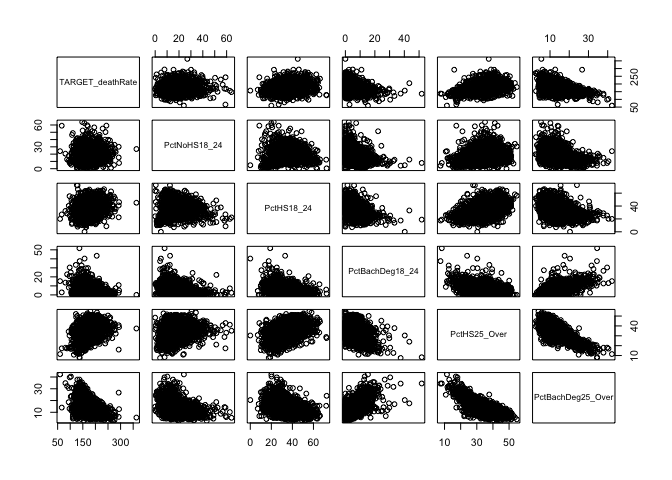

``` r
head(education)
```

    ## # A tibble: 6 x 6
    ##   TARGET_deathRate PctNoHS18_24 PctHS18_24 PctBachDeg18_24 PctHS25_Over
    ##              <dbl>        <dbl>      <dbl>           <dbl>        <dbl>
    ## 1             165.         11.5       39.5             6.9         23.2
    ## 2             161.          6.1       22.4             7.5         26  
    ## 3             175.         24         36.6             9.5         29  
    ## 4             195.         20.2       41.2             2.5         31.6
    ## 5             144.         14.9       43               2           33.4
    ## 6             176          29.9       35.1             4.5         30.4
    ## # ... with 1 more variable: PctBachDeg25_Over <dbl>

Function to plot relation seperately

``` r
#relationship <- function(i){
#  ggplot(education, aes(x = i, y = TARGET_deathRate)) + 
#    geom_point()
#}
```

``` r
#output = list()

#for (i in 2:6) {
#  output[[i]] = 
#  relationship(education[[i]])
#}
```

``` r
#cancer_registry %>% 
#  ggplot(avgDeathsPerYear, incidenceRate) +
#  geom_point()
```

``` r
#cancer_registry_mlr <- cancer_registry %>% 
#  glm(TARGET_deathRate ~ . - binnedInc-Geography, data = . ) 
```

``` r
#cancer_registry_step <- 
#  step(cancer_registry_mlr)
```

``` r
#education %>% 
#  lm(TARGET_)
```

``` r
library(tidyverse)
library(patchwork)
library(faraway)
library(broom)
```

``` r
raw_data <- read_csv("./Data/Cancer_Registry.csv")
```

    ## Parsed with column specification:
    ## cols(
    ##   .default = col_double(),
    ##   binnedInc = col_character(),
    ##   Geography = col_character()
    ## )

    ## See spec(...) for full column specifications.

``` r
raw_data = janitor::clean_names(raw_data)
raw_data1 = raw_data %>% 
  select(-binned_inc, -geography)

res <- cor(raw_data1)
round(res, 3)
```

    ##                            avg_ann_count avg_deaths_per_year
    ## avg_ann_count                      1.000               0.939
    ## avg_deaths_per_year                0.939               1.000
    ## target_death_rate                 -0.144              -0.091
    ## incidence_rate                     0.074               0.063
    ## med_income                         0.269               0.223
    ## pop_est2015                        0.927               0.978
    ## poverty_percent                   -0.136              -0.067
    ## study_per_cap                      0.082               0.063
    ## median_age                        -0.024              -0.025
    ## median_age_male                   -0.125              -0.148
    ## median_age_female                 -0.123              -0.144
    ## avg_household_size                 0.065               0.086
    ## percent_married                   -0.106              -0.181
    ## pct_no_hs18_24                    -0.143              -0.137
    ## pct_hs18_24                       -0.182              -0.151
    ## pct_some_col18_24                     NA                  NA
    ## pct_bach_deg18_24                  0.284               0.260
    ## pct_hs25_over                     -0.311              -0.296
    ## pct_bach_deg25_over                0.321               0.293
    ## pct_employed16_over                   NA                  NA
    ## pct_unemployed16_over             -0.009               0.070
    ## pct_private_coverage               0.132               0.056
    ## pct_private_coverage_alone            NA                  NA
    ## pct_emp_priv_coverage              0.202               0.160
    ## pct_public_coverage               -0.174              -0.132
    ## pct_public_coverage_alone         -0.094              -0.027
    ## pct_white                         -0.137              -0.187
    ## pct_black                          0.031               0.085
    ## pct_asian                          0.435               0.443
    ## pct_other_race                     0.209               0.215
    ## pct_married_households            -0.106              -0.160
    ## birth_rate                        -0.035              -0.074
    ##                            target_death_rate incidence_rate med_income
    ## avg_ann_count                         -0.144          0.074      0.269
    ## avg_deaths_per_year                   -0.091          0.063      0.223
    ## target_death_rate                      1.000          0.449     -0.429
    ## incidence_rate                         0.449          1.000     -0.001
    ## med_income                            -0.429         -0.001      1.000
    ## pop_est2015                           -0.120          0.027      0.236
    ## poverty_percent                        0.429          0.009     -0.789
    ## study_per_cap                         -0.022          0.077      0.044
    ## median_age                             0.004          0.018     -0.013
    ## median_age_male                       -0.022         -0.015     -0.092
    ## median_age_female                      0.012         -0.009     -0.153
    ## avg_household_size                    -0.037         -0.118      0.112
    ## percent_married                       -0.267         -0.120      0.355
    ## pct_no_hs18_24                         0.088         -0.171     -0.289
    ## pct_hs18_24                            0.262          0.023     -0.190
    ## pct_some_col18_24                         NA             NA         NA
    ## pct_bach_deg18_24                     -0.288          0.047      0.493
    ## pct_hs25_over                          0.405          0.122     -0.471
    ## pct_bach_deg25_over                   -0.485         -0.038      0.705
    ## pct_employed16_over                       NA             NA         NA
    ## pct_unemployed16_over                  0.378          0.100     -0.453
    ## pct_private_coverage                  -0.386          0.105      0.724
    ## pct_private_coverage_alone                NA             NA         NA
    ## pct_emp_priv_coverage                 -0.267          0.150      0.747
    ## pct_public_coverage                    0.405          0.046     -0.755
    ## pct_public_coverage_alone              0.449          0.041     -0.720
    ## pct_white                             -0.177         -0.015      0.167
    ## pct_black                              0.257          0.113     -0.270
    ## pct_asian                             -0.186         -0.008      0.426
    ## pct_other_race                        -0.190         -0.209      0.084
    ## pct_married_households                -0.293         -0.152      0.446
    ## birth_rate                            -0.087         -0.118     -0.010
    ##                            pop_est2015 poverty_percent study_per_cap
    ## avg_ann_count                    0.927          -0.136         0.082
    ## avg_deaths_per_year              0.978          -0.067         0.063
    ## target_death_rate               -0.120           0.429        -0.022
    ## incidence_rate                   0.027           0.009         0.077
    ## med_income                       0.236          -0.789         0.044
    ## pop_est2015                      1.000          -0.065         0.056
    ## poverty_percent                 -0.065           1.000        -0.056
    ## study_per_cap                    0.056          -0.056         1.000
    ## median_age                      -0.025          -0.029        -0.026
    ## median_age_male                 -0.177          -0.214        -0.037
    ## median_age_female               -0.178          -0.148        -0.031
    ## avg_household_size               0.110           0.074        -0.004
    ## percent_married                 -0.160          -0.643        -0.038
    ## pct_no_hs18_24                  -0.127           0.288        -0.090
    ## pct_hs18_24                     -0.152           0.094        -0.057
    ## pct_some_col18_24                   NA              NA            NA
    ## pct_bach_deg18_24                0.248          -0.387         0.064
    ## pct_hs25_over                   -0.312           0.194        -0.085
    ## pct_bach_deg25_over              0.297          -0.532         0.109
    ## pct_employed16_over                 NA              NA            NA
    ## pct_unemployed16_over            0.051           0.655        -0.032
    ## pct_private_coverage             0.053          -0.823         0.093
    ## pct_private_coverage_alone          NA              NA            NA
    ## pct_emp_priv_coverage            0.159          -0.683         0.100
    ## pct_public_coverage             -0.160           0.651        -0.051
    ## pct_public_coverage_alone       -0.041           0.799        -0.056
    ## pct_white                       -0.190          -0.509         0.023
    ## pct_black                        0.073           0.512        -0.020
    ## pct_asian                        0.464          -0.157         0.063
    ## pct_other_race                   0.241           0.047        -0.015
    ## pct_married_households          -0.128          -0.605        -0.052
    ## birth_rate                      -0.058          -0.012         0.011
    ##                            median_age median_age_male median_age_female
    ## avg_ann_count                  -0.024          -0.125            -0.123
    ## avg_deaths_per_year            -0.025          -0.148            -0.144
    ## target_death_rate               0.004          -0.022             0.012
    ## incidence_rate                  0.018          -0.015            -0.009
    ## med_income                     -0.013          -0.092            -0.153
    ## pop_est2015                    -0.025          -0.177            -0.178
    ## poverty_percent                -0.029          -0.214            -0.148
    ## study_per_cap                  -0.026          -0.037            -0.031
    ## median_age                      1.000           0.129             0.125
    ## median_age_male                 0.129           1.000             0.934
    ## median_age_female               0.125           0.934             1.000
    ## avg_household_size             -0.032          -0.343            -0.368
    ## percent_married                 0.046           0.450             0.375
    ## pct_no_hs18_24                  0.006           0.100             0.136
    ## pct_hs18_24                     0.051           0.241             0.243
    ## pct_some_col18_24                  NA              NA                NA
    ## pct_bach_deg18_24              -0.017          -0.034            -0.071
    ## pct_hs25_over                   0.037           0.318             0.345
    ## pct_bach_deg25_over            -0.020          -0.132            -0.181
    ## pct_employed16_over                NA              NA                NA
    ## pct_unemployed16_over           0.019          -0.143            -0.111
    ## pct_private_coverage            0.005           0.082             0.047
    ## pct_private_coverage_alone         NA              NA                NA
    ## pct_emp_priv_coverage          -0.037          -0.209            -0.252
    ## pct_public_coverage             0.049           0.399             0.455
    ## pct_public_coverage_alone      -0.003           0.002             0.048
    ## pct_white                       0.035           0.398             0.340
    ## pct_black                      -0.017          -0.243            -0.157
    ## pct_asian                      -0.038          -0.238            -0.259
    ## pct_other_race                 -0.030          -0.267            -0.274
    ## pct_married_households          0.015           0.222             0.162
    ## birth_rate                     -0.008          -0.104            -0.099
    ##                            avg_household_size percent_married
    ## avg_ann_count                           0.065          -0.106
    ## avg_deaths_per_year                     0.086          -0.181
    ## target_death_rate                      -0.037          -0.267
    ## incidence_rate                         -0.118          -0.120
    ## med_income                              0.112           0.355
    ## pop_est2015                             0.110          -0.160
    ## poverty_percent                         0.074          -0.643
    ## study_per_cap                          -0.004          -0.038
    ## median_age                             -0.032           0.046
    ## median_age_male                        -0.343           0.450
    ## median_age_female                      -0.368           0.375
    ## avg_household_size                      1.000          -0.101
    ## percent_married                        -0.101           1.000
    ## pct_no_hs18_24                          0.065          -0.012
    ## pct_hs18_24                             0.027           0.133
    ## pct_some_col18_24                          NA              NA
    ## pct_bach_deg18_24                      -0.061           0.053
    ## pct_hs25_over                          -0.139           0.102
    ## pct_bach_deg25_over                     0.014           0.104
    ## pct_employed16_over                        NA              NA
    ## pct_unemployed16_over                   0.132          -0.551
    ## pct_private_coverage                   -0.144           0.449
    ## pct_private_coverage_alone                 NA              NA
    ## pct_emp_priv_coverage                   0.011           0.233
    ## pct_public_coverage                    -0.135          -0.247
    ## pct_public_coverage_alone               0.061          -0.460
    ## pct_white                              -0.188           0.677
    ## pct_black                               0.030          -0.622
    ## pct_asian                               0.132          -0.149
    ## pct_other_race                          0.229          -0.105
    ## pct_married_households                  0.091           0.870
    ## birth_rate                              0.076           0.141
    ##                            pct_no_hs18_24 pct_hs18_24 pct_some_col18_24
    ## avg_ann_count                      -0.143      -0.182                NA
    ## avg_deaths_per_year                -0.137      -0.151                NA
    ## target_death_rate                   0.088       0.262                NA
    ## incidence_rate                     -0.171       0.023                NA
    ## med_income                         -0.289      -0.190                NA
    ## pop_est2015                        -0.127      -0.152                NA
    ## poverty_percent                     0.288       0.094                NA
    ## study_per_cap                      -0.090      -0.057                NA
    ## median_age                          0.006       0.051                NA
    ## median_age_male                     0.100       0.241                NA
    ## median_age_female                   0.136       0.243                NA
    ## avg_household_size                  0.065       0.027                NA
    ## percent_married                    -0.012       0.133                NA
    ## pct_no_hs18_24                      1.000       0.085                NA
    ## pct_hs18_24                         0.085       1.000                NA
    ## pct_some_col18_24                      NA          NA                 1
    ## pct_bach_deg18_24                  -0.381      -0.389                NA
    ## pct_hs25_over                       0.217       0.439                NA
    ## pct_bach_deg25_over                -0.397      -0.405                NA
    ## pct_employed16_over                    NA          NA                NA
    ## pct_unemployed16_over               0.181       0.131                NA
    ## pct_private_coverage               -0.455      -0.254                NA
    ## pct_private_coverage_alone             NA          NA                NA
    ## pct_emp_priv_coverage              -0.430      -0.244                NA
    ## pct_public_coverage                 0.319       0.278                NA
    ## pct_public_coverage_alone           0.327       0.234                NA
    ## pct_white                          -0.157       0.045                NA
    ## pct_black                           0.117      -0.025                NA
    ## pct_asian                          -0.218      -0.200                NA
    ## pct_other_race                      0.126      -0.060                NA
    ## pct_married_households              0.005       0.120                NA
    ## birth_rate                          0.126       0.058                NA
    ##                            pct_bach_deg18_24 pct_hs25_over
    ## avg_ann_count                          0.284        -0.311
    ## avg_deaths_per_year                    0.260        -0.296
    ## target_death_rate                     -0.288         0.405
    ## incidence_rate                         0.047         0.122
    ## med_income                             0.493        -0.471
    ## pop_est2015                            0.248        -0.312
    ## poverty_percent                       -0.387         0.194
    ## study_per_cap                          0.064        -0.085
    ## median_age                            -0.017         0.037
    ## median_age_male                       -0.034         0.318
    ## median_age_female                     -0.071         0.345
    ## avg_household_size                    -0.061        -0.139
    ## percent_married                        0.053         0.102
    ## pct_no_hs18_24                        -0.381         0.217
    ## pct_hs18_24                           -0.389         0.439
    ## pct_some_col18_24                         NA            NA
    ## pct_bach_deg18_24                      1.000        -0.384
    ## pct_hs25_over                         -0.384         1.000
    ## pct_bach_deg25_over                    0.600        -0.741
    ## pct_employed16_over                       NA            NA
    ## pct_unemployed16_over                 -0.309         0.082
    ## pct_private_coverage                   0.488        -0.222
    ## pct_private_coverage_alone                NA            NA
    ## pct_emp_priv_coverage                  0.451        -0.223
    ## pct_public_coverage                   -0.422         0.428
    ## pct_public_coverage_alone             -0.422         0.297
    ## pct_white                              0.069         0.188
    ## pct_black                             -0.094        -0.024
    ## pct_asian                              0.346        -0.437
    ## pct_other_race                         0.007        -0.286
    ## pct_married_households                 0.000         0.062
    ## birth_rate                            -0.125         0.017
    ##                            pct_bach_deg25_over pct_employed16_over
    ## avg_ann_count                            0.321                  NA
    ## avg_deaths_per_year                      0.293                  NA
    ## target_death_rate                       -0.485                  NA
    ## incidence_rate                          -0.038                  NA
    ## med_income                               0.705                  NA
    ## pop_est2015                              0.297                  NA
    ## poverty_percent                         -0.532                  NA
    ## study_per_cap                            0.109                  NA
    ## median_age                              -0.020                  NA
    ## median_age_male                         -0.132                  NA
    ## median_age_female                       -0.181                  NA
    ## avg_household_size                       0.014                  NA
    ## percent_married                          0.104                  NA
    ## pct_no_hs18_24                          -0.397                  NA
    ## pct_hs18_24                             -0.405                  NA
    ## pct_some_col18_24                           NA                  NA
    ## pct_bach_deg18_24                        0.600                  NA
    ## pct_hs25_over                           -0.741                  NA
    ## pct_bach_deg25_over                      1.000                  NA
    ## pct_employed16_over                         NA                   1
    ## pct_unemployed16_over                   -0.373                  NA
    ## pct_private_coverage                     0.603                  NA
    ## pct_private_coverage_alone                  NA                  NA
    ## pct_emp_priv_coverage                    0.539                  NA
    ## pct_public_coverage                     -0.636                  NA
    ## pct_public_coverage_alone               -0.606                  NA
    ## pct_white                                0.049                  NA
    ## pct_black                               -0.146                  NA
    ## pct_asian                                0.438                  NA
    ## pct_other_race                           0.039                  NA
    ## pct_married_households                   0.098                  NA
    ## birth_rate                              -0.088                  NA
    ##                            pct_unemployed16_over pct_private_coverage
    ## avg_ann_count                             -0.009                0.132
    ## avg_deaths_per_year                        0.070                0.056
    ## target_death_rate                          0.378               -0.386
    ## incidence_rate                             0.100                0.105
    ## med_income                                -0.453                0.724
    ## pop_est2015                                0.051                0.053
    ## poverty_percent                            0.655               -0.823
    ## study_per_cap                             -0.032                0.093
    ## median_age                                 0.019                0.005
    ## median_age_male                           -0.143                0.082
    ## median_age_female                         -0.111                0.047
    ## avg_household_size                         0.132               -0.144
    ## percent_married                           -0.551                0.449
    ## pct_no_hs18_24                             0.181               -0.455
    ## pct_hs18_24                                0.131               -0.254
    ## pct_some_col18_24                             NA                   NA
    ## pct_bach_deg18_24                         -0.309                0.488
    ## pct_hs25_over                              0.082               -0.222
    ## pct_bach_deg25_over                       -0.373                0.603
    ## pct_employed16_over                           NA                   NA
    ## pct_unemployed16_over                      1.000               -0.634
    ## pct_private_coverage                      -0.634                1.000
    ## pct_private_coverage_alone                    NA                   NA
    ## pct_emp_priv_coverage                     -0.475                0.827
    ## pct_public_coverage                        0.530               -0.720
    ## pct_public_coverage_alone                  0.655               -0.886
    ## pct_white                                 -0.502                0.429
    ## pct_black                                  0.469               -0.345
    ## pct_asian                                 -0.022                0.189
    ## pct_other_race                             0.028               -0.176
    ## pct_married_households                    -0.470                0.435
    ## birth_rate                                -0.068               -0.040
    ##                            pct_private_coverage_alone
    ## avg_ann_count                                      NA
    ## avg_deaths_per_year                                NA
    ## target_death_rate                                  NA
    ## incidence_rate                                     NA
    ## med_income                                         NA
    ## pop_est2015                                        NA
    ## poverty_percent                                    NA
    ## study_per_cap                                      NA
    ## median_age                                         NA
    ## median_age_male                                    NA
    ## median_age_female                                  NA
    ## avg_household_size                                 NA
    ## percent_married                                    NA
    ## pct_no_hs18_24                                     NA
    ## pct_hs18_24                                        NA
    ## pct_some_col18_24                                  NA
    ## pct_bach_deg18_24                                  NA
    ## pct_hs25_over                                      NA
    ## pct_bach_deg25_over                                NA
    ## pct_employed16_over                                NA
    ## pct_unemployed16_over                              NA
    ## pct_private_coverage                               NA
    ## pct_private_coverage_alone                          1
    ## pct_emp_priv_coverage                              NA
    ## pct_public_coverage                                NA
    ## pct_public_coverage_alone                          NA
    ## pct_white                                          NA
    ## pct_black                                          NA
    ## pct_asian                                          NA
    ## pct_other_race                                     NA
    ## pct_married_households                             NA
    ## birth_rate                                         NA
    ##                            pct_emp_priv_coverage pct_public_coverage
    ## avg_ann_count                              0.202              -0.174
    ## avg_deaths_per_year                        0.160              -0.132
    ## target_death_rate                         -0.267               0.405
    ## incidence_rate                             0.150               0.046
    ## med_income                                 0.747              -0.755
    ## pop_est2015                                0.159              -0.160
    ## poverty_percent                           -0.683               0.651
    ## study_per_cap                              0.100              -0.051
    ## median_age                                -0.037               0.049
    ## median_age_male                           -0.209               0.399
    ## median_age_female                         -0.252               0.455
    ## avg_household_size                         0.011              -0.135
    ## percent_married                            0.233              -0.247
    ## pct_no_hs18_24                            -0.430               0.319
    ## pct_hs18_24                               -0.244               0.278
    ## pct_some_col18_24                             NA                  NA
    ## pct_bach_deg18_24                          0.451              -0.422
    ## pct_hs25_over                             -0.223               0.428
    ## pct_bach_deg25_over                        0.539              -0.636
    ## pct_employed16_over                           NA                  NA
    ## pct_unemployed16_over                     -0.475               0.530
    ## pct_private_coverage                       0.827              -0.720
    ## pct_private_coverage_alone                    NA                  NA
    ## pct_emp_priv_coverage                      1.000              -0.778
    ## pct_public_coverage                       -0.778               1.000
    ## pct_public_coverage_alone                 -0.729               0.866
    ## pct_white                                  0.270              -0.134
    ## pct_black                                 -0.237               0.196
    ## pct_asian                                  0.282              -0.306
    ## pct_other_race                            -0.064              -0.079
    ## pct_married_households                     0.323              -0.362
    ## birth_rate                                -0.094              -0.031
    ##                            pct_public_coverage_alone pct_white pct_black
    ## avg_ann_count                                 -0.094    -0.137     0.031
    ## avg_deaths_per_year                           -0.027    -0.187     0.085
    ## target_death_rate                              0.449    -0.177     0.257
    ## incidence_rate                                 0.041    -0.015     0.113
    ## med_income                                    -0.720     0.167    -0.270
    ## pop_est2015                                   -0.041    -0.190     0.073
    ## poverty_percent                                0.799    -0.509     0.512
    ## study_per_cap                                 -0.056     0.023    -0.020
    ## median_age                                    -0.003     0.035    -0.017
    ## median_age_male                                0.002     0.398    -0.243
    ## median_age_female                              0.048     0.340    -0.157
    ## avg_household_size                             0.061    -0.188     0.030
    ## percent_married                               -0.460     0.677    -0.622
    ## pct_no_hs18_24                                 0.327    -0.157     0.117
    ## pct_hs18_24                                    0.234     0.045    -0.025
    ## pct_some_col18_24                                 NA        NA        NA
    ## pct_bach_deg18_24                             -0.422     0.069    -0.094
    ## pct_hs25_over                                  0.297     0.188    -0.024
    ## pct_bach_deg25_over                           -0.606     0.049    -0.146
    ## pct_employed16_over                               NA        NA        NA
    ## pct_unemployed16_over                          0.655    -0.502     0.469
    ## pct_private_coverage                          -0.886     0.429    -0.345
    ## pct_private_coverage_alone                        NA        NA        NA
    ## pct_emp_priv_coverage                         -0.729     0.270    -0.237
    ## pct_public_coverage                            0.866    -0.134     0.196
    ## pct_public_coverage_alone                      1.000    -0.361     0.330
    ## pct_white                                     -0.361     1.000    -0.828
    ## pct_black                                      0.330    -0.828     1.000
    ## pct_asian                                     -0.181    -0.266     0.017
    ## pct_other_race                                 0.084    -0.234    -0.023
    ## pct_married_households                        -0.474     0.597    -0.574
    ## birth_rate                                    -0.005    -0.009    -0.068
    ##                            pct_asian pct_other_race pct_married_households
    ## avg_ann_count                  0.435          0.209                 -0.106
    ## avg_deaths_per_year            0.443          0.215                 -0.160
    ## target_death_rate             -0.186         -0.190                 -0.293
    ## incidence_rate                -0.008         -0.209                 -0.152
    ## med_income                     0.426          0.084                  0.446
    ## pop_est2015                    0.464          0.241                 -0.128
    ## poverty_percent               -0.157          0.047                 -0.605
    ## study_per_cap                  0.063         -0.015                 -0.052
    ## median_age                    -0.038         -0.030                  0.015
    ## median_age_male               -0.238         -0.267                  0.222
    ## median_age_female             -0.259         -0.274                  0.162
    ## avg_household_size             0.132          0.229                  0.091
    ## percent_married               -0.149         -0.105                  0.870
    ## pct_no_hs18_24                -0.218          0.126                  0.005
    ## pct_hs18_24                   -0.200         -0.060                  0.120
    ## pct_some_col18_24                 NA             NA                     NA
    ## pct_bach_deg18_24              0.346          0.007                  0.000
    ## pct_hs25_over                 -0.437         -0.286                  0.062
    ## pct_bach_deg25_over            0.438          0.039                  0.098
    ## pct_employed16_over               NA             NA                     NA
    ## pct_unemployed16_over         -0.022          0.028                 -0.470
    ## pct_private_coverage           0.189         -0.176                  0.435
    ## pct_private_coverage_alone        NA             NA                     NA
    ## pct_emp_priv_coverage          0.282         -0.064                  0.323
    ## pct_public_coverage           -0.306         -0.079                 -0.362
    ## pct_public_coverage_alone     -0.181          0.084                 -0.474
    ## pct_white                     -0.266         -0.234                  0.597
    ## pct_black                      0.017         -0.023                 -0.574
    ## pct_asian                      1.000          0.201                 -0.087
    ## pct_other_race                 0.201          1.000                 -0.027
    ## pct_married_households        -0.087         -0.027                  1.000
    ## birth_rate                    -0.062          0.060                  0.102
    ##                            birth_rate
    ## avg_ann_count                  -0.035
    ## avg_deaths_per_year            -0.074
    ## target_death_rate              -0.087
    ## incidence_rate                 -0.118
    ## med_income                     -0.010
    ## pop_est2015                    -0.058
    ## poverty_percent                -0.012
    ## study_per_cap                   0.011
    ## median_age                     -0.008
    ## median_age_male                -0.104
    ## median_age_female              -0.099
    ## avg_household_size              0.076
    ## percent_married                 0.141
    ## pct_no_hs18_24                  0.126
    ## pct_hs18_24                     0.058
    ## pct_some_col18_24                  NA
    ## pct_bach_deg18_24              -0.125
    ## pct_hs25_over                   0.017
    ## pct_bach_deg25_over            -0.088
    ## pct_employed16_over                NA
    ## pct_unemployed16_over          -0.068
    ## pct_private_coverage           -0.040
    ## pct_private_coverage_alone         NA
    ## pct_emp_priv_coverage          -0.094
    ## pct_public_coverage            -0.031
    ## pct_public_coverage_alone      -0.005
    ## pct_white                      -0.009
    ## pct_black                      -0.068
    ## pct_asian                      -0.062
    ## pct_other_race                  0.060
    ## pct_married_households          0.102
    ## birth_rate                      1.000

``` r
summary(raw_data1$pct_employed16_over) # contains 152 NA's
```

    ##    Min. 1st Qu.  Median    Mean 3rd Qu.    Max.    NA's 
    ##   17.60   48.60   54.50   54.15   60.30   80.10     152

``` r
summary(raw_data1$pct_unemployed16_over)
```

    ##    Min. 1st Qu.  Median    Mean 3rd Qu.    Max. 
    ##   0.400   5.500   7.600   7.852   9.700  29.400

``` r
summary(raw_data1$pct_private_coverage)
```

    ##    Min. 1st Qu.  Median    Mean 3rd Qu.    Max. 
    ##   22.30   57.20   65.10   64.35   72.10   92.30

``` r
summary(raw_data1$pct_private_coverage_alone) # get rid of this variable! Contains 609 NA's
```

    ##    Min. 1st Qu.  Median    Mean 3rd Qu.    Max.    NA's 
    ##   15.70   41.00   48.70   48.45   55.60   78.90     609

``` r
summary(raw_data1$pct_emp_priv_coverage)
```

    ##    Min. 1st Qu.  Median    Mean 3rd Qu.    Max. 
    ##    13.5    34.5    41.1    41.2    47.7    70.7

``` r
summary(raw_data1$pct_public_coverage)
```

    ##    Min. 1st Qu.  Median    Mean 3rd Qu.    Max. 
    ##   11.20   30.90   36.30   36.25   41.55   65.10

``` r
summary(raw_data1$pct_public_coverage_alone)
```

    ##    Min. 1st Qu.  Median    Mean 3rd Qu.    Max. 
    ##    2.60   14.85   18.80   19.24   23.10   46.60

``` r
histogram1 = ggplot(raw_data1, aes(x  = raw_data1$pct_employed16_over)) + geom_histogram() + labs(title = "Percent ages 16+ employed")


histogram2 = ggplot(raw_data1, aes(x  = raw_data1$pct_unemployed16_over)) + geom_histogram() + labs(title = "Percent ages 16+ unemployed")


histogram3 = ggplot(raw_data1, aes(x  = raw_data1$pct_private_coverage)) + geom_histogram() + labs(title = "Percent private health coverage")


histogram4 = ggplot(raw_data1, aes(x  = raw_data1$pct_private_coverage_alone)) + geom_histogram() + labs(title = "Percent private health coverage alone")


histogram5 = ggplot(raw_data1, aes(x  = raw_data1$pct_emp_priv_coverage)) + geom_histogram() + labs(title = "Percent employee-provided private health coverage")


histogram6 = ggplot(raw_data1, aes(x  = raw_data1$pct_public_coverage)) + geom_histogram() + labs(title = "Percent government-provided health coverage")


histogram7 = ggplot(raw_data1, aes(x  = raw_data1$pct_public_coverage_alone)) + geom_histogram() + labs(title = "Percent government-provided health coverage alone")


(histogram1 + histogram2)
```

    ## `stat_bin()` using `bins = 30`. Pick better value with `binwidth`.

    ## Warning: Removed 152 rows containing non-finite values (stat_bin).

    ## `stat_bin()` using `bins = 30`. Pick better value with `binwidth`.

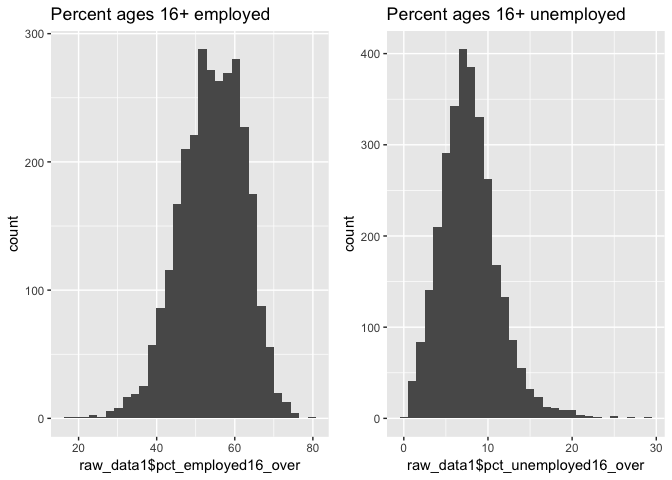

``` r
(histogram3 + histogram4)
```

    ## `stat_bin()` using `bins = 30`. Pick better value with `binwidth`.
    ## `stat_bin()` using `bins = 30`. Pick better value with `binwidth`.

    ## Warning: Removed 609 rows containing non-finite values (stat_bin).

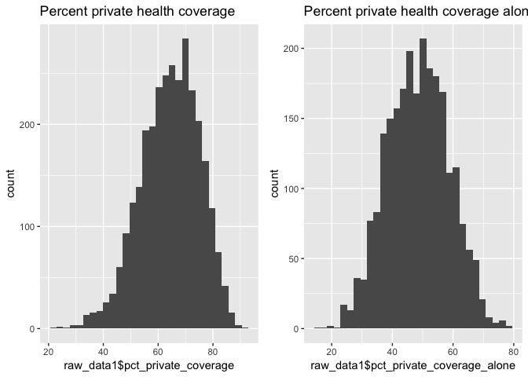

``` r
(histogram5 + histogram6)/(histogram7)
```

    ## `stat_bin()` using `bins = 30`. Pick better value with `binwidth`.
    ## `stat_bin()` using `bins = 30`. Pick better value with `binwidth`.
    ## `stat_bin()` using `bins = 30`. Pick better value with `binwidth`.

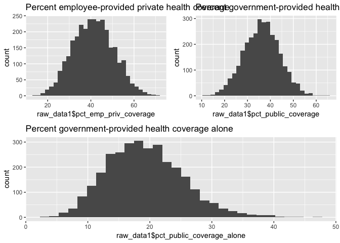

``` r
reg1 = lm(target_death_rate~pct_employed16_over, data = raw_data1)
reg2 = lm(target_death_rate~pct_unemployed16_over, data = raw_data1)
reg3 = lm(target_death_rate~pct_private_coverage, data = raw_data1)
reg4 = lm(target_death_rate~pct_private_coverage_alone, data = raw_data1)
reg5 = lm(target_death_rate~pct_emp_priv_coverage, data = raw_data1)
reg6 = lm(target_death_rate~pct_public_coverage, data = raw_data1)
reg7 = lm(target_death_rate~pct_public_coverage_alone , data = raw_data1)

plot(raw_data1$pct_employed16_over, raw_data1$target_death_rate)
abline(reg1,lwd = 2,col = 2)
```

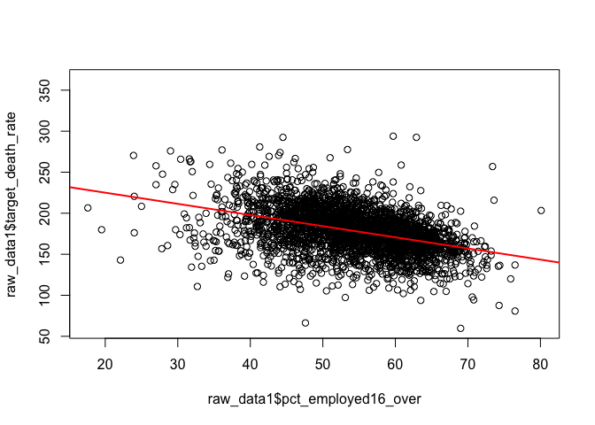

``` r
plot(raw_data1$pct_unemployed16_over, raw_data1$target_death_rate)
abline(reg2,lwd = 2,col = 2)
```

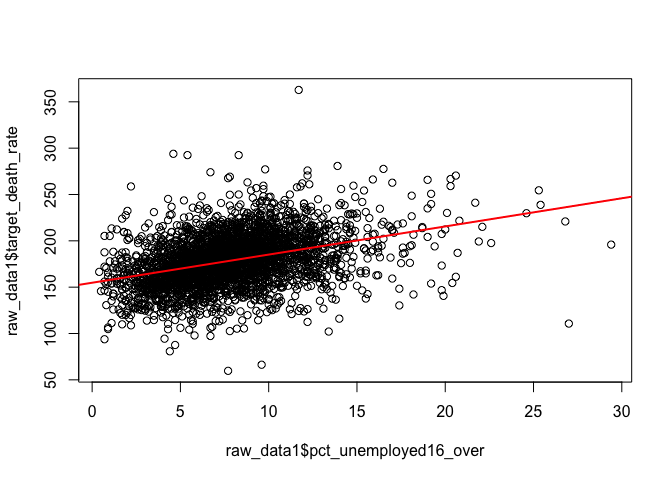

``` r
plot(raw_data1$pct_private_coverage, raw_data1$target_death_rate)
abline(reg3,lwd = 2,col = 2)
```

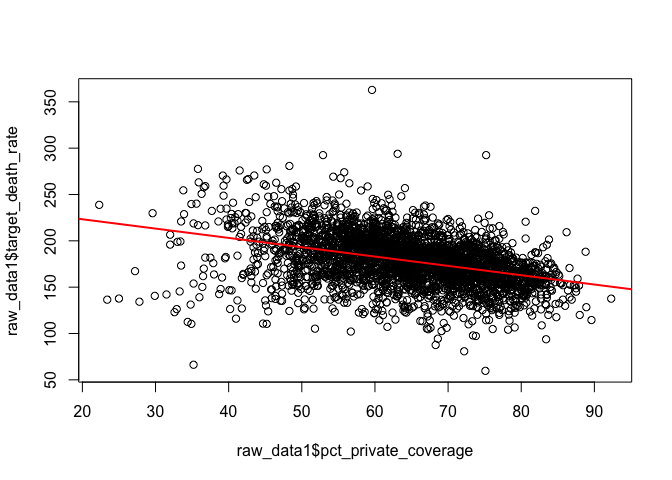

``` r
plot(raw_data1$pct_private_coverage_alone, raw_data1$target_death_rate)
abline(reg4,lwd = 2,col = 2)
```

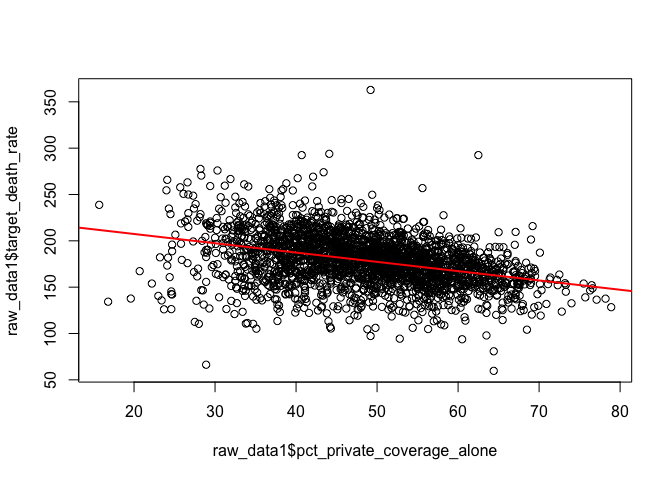

``` r
plot(raw_data1$pct_emp_priv_coverage, raw_data1$target_death_rate)
abline(reg5,lwd = 2,col = 2)
```

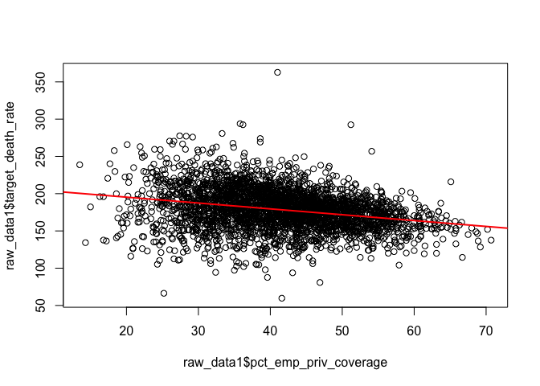

``` r
plot(raw_data1$pct_public_coverage, raw_data1$target_death_rate)
abline(reg6,lwd = 2,col = 2)
```

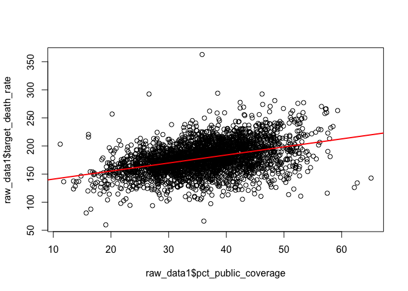

``` r
plot(raw_data1$pct_public_coverage_alone, raw_data1$target_death_rate)
abline(reg7,lwd = 2,col = 2)
```

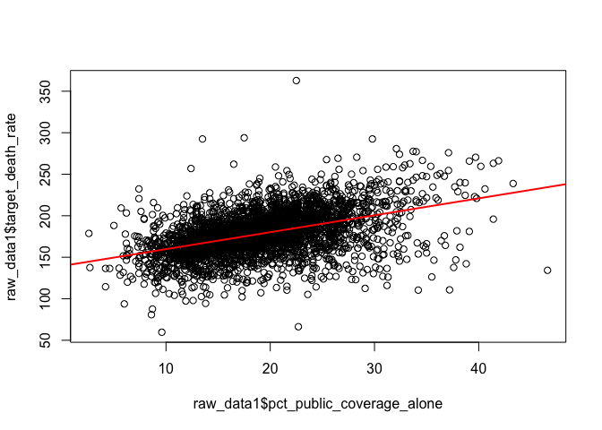

``` r
raw_data2 = raw_data1 %>% 
  select(target_death_rate, avg_ann_count, incidence_rate, med_income, poverty_percent, median_age_male, median_age_female, pct_no_hs18_24, pct_hs18_24, pct_bach_deg18_24, pct_hs25_over, pct_bach_deg25_over, pct_employed16_over, pct_unemployed16_over, pct_public_coverage_alone, pct_white)

#############################################################################
# Backward elimination: take out non-significant variables 'one at a time'  #
# starting with the highest p-value                                         #
#############################################################################

reg = lm(target_death_rate~., data = raw_data2)
summary(reg)
```

    ## 
    ## Call:
    ## lm(formula = target_death_rate ~ ., data = raw_data2)
    ## 
    ## Residuals:
    ##      Min       1Q   Median       3Q      Max 
    ## -111.590  -11.403    0.091   11.291  140.302 
    ## 
    ## Coefficients:
    ##                             Estimate Std. Error t value Pr(>|t|)    
    ## (Intercept)                8.341e+01  1.245e+01   6.697 2.54e-11 ***
    ## avg_ann_count             -8.525e-04  2.843e-04  -2.999  0.00273 ** 
    ## incidence_rate             2.038e-01  7.396e-03  27.551  < 2e-16 ***
    ## med_income                -2.025e-05  6.971e-05  -0.291  0.77143    
    ## poverty_percent            4.894e-01  1.615e-01   3.029  0.00247 ** 
    ## median_age_male           -1.388e-01  2.078e-01  -0.668  0.50420    
    ## median_age_female         -2.191e-01  2.094e-01  -1.046  0.29563    
    ## pct_no_hs18_24            -1.707e-01  5.454e-02  -3.130  0.00177 ** 
    ## pct_hs18_24                2.419e-01  4.962e-02   4.874 1.15e-06 ***
    ## pct_bach_deg18_24          3.671e-02  1.112e-01   0.330  0.74134    
    ## pct_hs25_over              5.858e-01  9.251e-02   6.332 2.79e-10 ***
    ## pct_bach_deg25_over       -8.512e-01  1.543e-01  -5.518 3.74e-08 ***
    ## pct_employed16_over       -1.800e-01  9.071e-02  -1.985  0.04726 *  
    ## pct_unemployed16_over      4.469e-01  1.716e-01   2.604  0.00925 ** 
    ## pct_public_coverage_alone  4.566e-01  1.179e-01   3.872  0.00011 ***
    ## pct_white                 -6.448e-02  3.160e-02  -2.040  0.04139 *  
    ## ---
    ## Signif. codes:  0 '***' 0.001 '**' 0.01 '*' 0.05 '.' 0.1 ' ' 1
    ## 
    ## Residual standard error: 19.89 on 2879 degrees of freedom
    ##   (152 observations deleted due to missingness)
    ## Multiple R-squared:  0.478,  Adjusted R-squared:  0.4753 
    ## F-statistic: 175.8 on 15 and 2879 DF,  p-value: < 2.2e-16

``` r
# No Median income per county
step1<-update(reg, . ~ . -med_income)
summary(step1)
```

    ## 
    ## Call:
    ## lm(formula = target_death_rate ~ avg_ann_count + incidence_rate + 
    ##     poverty_percent + median_age_male + median_age_female + pct_no_hs18_24 + 
    ##     pct_hs18_24 + pct_bach_deg18_24 + pct_hs25_over + pct_bach_deg25_over + 
    ##     pct_employed16_over + pct_unemployed16_over + pct_public_coverage_alone + 
    ##     pct_white, data = raw_data2)
    ## 
    ## Residuals:
    ##      Min       1Q   Median       3Q      Max 
    ## -111.286  -11.427    0.101   11.227  140.273 
    ## 
    ## Coefficients:
    ##                             Estimate Std. Error t value Pr(>|t|)    
    ## (Intercept)               81.6386618 10.8561322   7.520 7.27e-14 ***
    ## avg_ann_count             -0.0008577  0.0002837  -3.024  0.00252 ** 
    ## incidence_rate             0.2036632  0.0073859  27.574  < 2e-16 ***
    ## poverty_percent            0.5177241  0.1286723   4.024 5.88e-05 ***
    ## median_age_male           -0.1373008  0.2077154  -0.661  0.50866    
    ## median_age_female         -0.2123872  0.2081331  -1.020  0.30761    
    ## pct_no_hs18_24            -0.1729422  0.0539902  -3.203  0.00137 ** 
    ## pct_hs18_24                0.2394336  0.0489015   4.896 1.03e-06 ***
    ## pct_bach_deg18_24          0.0316794  0.1098365   0.288  0.77304    
    ## pct_hs25_over              0.5886287  0.0919713   6.400 1.81e-10 ***
    ## pct_bach_deg25_over       -0.8618619  0.1497809  -5.754 9.62e-09 ***
    ## pct_employed16_over       -0.1785974  0.0905586  -1.972  0.04869 *  
    ## pct_unemployed16_over      0.4418090  0.1706763   2.589  0.00969 ** 
    ## pct_public_coverage_alone  0.4597229  0.1174034   3.916 9.22e-05 ***
    ## pct_white                 -0.0626999  0.0309954  -2.023  0.04318 *  
    ## ---
    ## Signif. codes:  0 '***' 0.001 '**' 0.01 '*' 0.05 '.' 0.1 ' ' 1
    ## 
    ## Residual standard error: 19.89 on 2880 degrees of freedom
    ##   (152 observations deleted due to missingness)
    ## Multiple R-squared:  0.478,  Adjusted R-squared:  0.4755 
    ## F-statistic: 188.4 on 14 and 2880 DF,  p-value: < 2.2e-16

``` r
# No Percent of county residents ages 18-24 highest education attained: bachelor's degree
step2<-update(step1, . ~ . -pct_bach_deg18_24)
summary(step2)
```

    ## 
    ## Call:
    ## lm(formula = target_death_rate ~ avg_ann_count + incidence_rate + 
    ##     poverty_percent + median_age_male + median_age_female + pct_no_hs18_24 + 
    ##     pct_hs18_24 + pct_hs25_over + pct_bach_deg25_over + pct_employed16_over + 
    ##     pct_unemployed16_over + pct_public_coverage_alone + pct_white, 
    ##     data = raw_data2)
    ## 
    ## Residuals:
    ##      Min       1Q   Median       3Q      Max 
    ## -111.381  -11.429    0.108   11.244  140.233 
    ## 
    ## Coefficients:
    ##                             Estimate Std. Error t value Pr(>|t|)    
    ## (Intercept)               81.5561485 10.8506351   7.516 7.48e-14 ***
    ## avg_ann_count             -0.0008482  0.0002817  -3.011 0.002626 ** 
    ## incidence_rate             0.2037278  0.0073814  27.600  < 2e-16 ***
    ## poverty_percent            0.5178995  0.1286504   4.026 5.83e-05 ***
    ## median_age_male           -0.1347479  0.2074938  -0.649 0.516127    
    ## median_age_female         -0.2117651  0.2080888  -1.018 0.308922    
    ## pct_no_hs18_24            -0.1761128  0.0528508  -3.332 0.000872 ***
    ## pct_hs18_24                0.2359519  0.0473806   4.980 6.74e-07 ***
    ## pct_hs25_over              0.5910402  0.0915759   6.454 1.27e-10 ***
    ## pct_bach_deg25_over       -0.8499692  0.1439706  -5.904 3.97e-09 ***
    ## pct_employed16_over       -0.1765167  0.0902564  -1.956 0.050594 .  
    ## pct_unemployed16_over      0.4394656  0.1704557   2.578 0.009981 ** 
    ## pct_public_coverage_alone  0.4602170  0.1173722   3.921 9.02e-05 ***
    ## pct_white                 -0.0633268  0.0309142  -2.048 0.040604 *  
    ## ---
    ## Signif. codes:  0 '***' 0.001 '**' 0.01 '*' 0.05 '.' 0.1 ' ' 1
    ## 
    ## Residual standard error: 19.89 on 2881 degrees of freedom
    ##   (152 observations deleted due to missingness)
    ## Multiple R-squared:  0.478,  Adjusted R-squared:  0.4757 
    ## F-statistic: 202.9 on 13 and 2881 DF,  p-value: < 2.2e-16

``` r
# No Median age of male county residents
step3<-update(step2, . ~ . -median_age_male)
summary(step3)
```

    ## 
    ## Call:
    ## lm(formula = target_death_rate ~ avg_ann_count + incidence_rate + 
    ##     poverty_percent + median_age_female + pct_no_hs18_24 + pct_hs18_24 + 
    ##     pct_hs25_over + pct_bach_deg25_over + pct_employed16_over + 
    ##     pct_unemployed16_over + pct_public_coverage_alone + pct_white, 
    ##     data = raw_data2)
    ## 
    ## Residuals:
    ##      Min       1Q   Median       3Q      Max 
    ## -112.037  -11.410    0.074   11.274  140.203 
    ## 
    ## Coefficients:
    ##                             Estimate Std. Error t value Pr(>|t|)    
    ## (Intercept)               82.0952637 10.8177457   7.589 4.33e-14 ***
    ## avg_ann_count             -0.0008389  0.0002813  -2.982 0.002887 ** 
    ## incidence_rate             0.2039544  0.0073724  27.665  < 2e-16 ***
    ## poverty_percent            0.5246256  0.1282200   4.092 4.40e-05 ***
    ## median_age_female         -0.3326980  0.0928501  -3.583 0.000345 ***
    ## pct_no_hs18_24            -0.1764808  0.0528425  -3.340 0.000849 ***
    ## pct_hs18_24                0.2337441  0.0472537   4.947 7.99e-07 ***
    ## pct_hs25_over              0.5890513  0.0915155   6.437 1.43e-10 ***
    ## pct_bach_deg25_over       -0.8567166  0.1435808  -5.967 2.71e-09 ***
    ## pct_employed16_over       -0.1812447  0.0899533  -2.015 0.044010 *  
    ## pct_unemployed16_over      0.4302628  0.1698486   2.533 0.011355 *  
    ## pct_public_coverage_alone  0.4531844  0.1168599   3.878 0.000108 ***
    ## pct_white                 -0.0667707  0.0304528  -2.193 0.028416 *  
    ## ---
    ## Signif. codes:  0 '***' 0.001 '**' 0.01 '*' 0.05 '.' 0.1 ' ' 1
    ## 
    ## Residual standard error: 19.89 on 2882 degrees of freedom
    ##   (152 observations deleted due to missingness)
    ## Multiple R-squared:  0.4779, Adjusted R-squared:  0.4758 
    ## F-statistic: 219.9 on 12 and 2882 DF,  p-value: < 2.2e-16

``` r
############################################################################
#  Stepwise regreession                                                    #   
# 'Step' function uses AIC criterion for var selection and the default     #
#  option is 'backward'.                                                   #
#  Step is a simplified version of stepAIC()                               #
############################################################################


mult.fit <- lm(target_death_rate~., data = raw_data2)
step(mult.fit, direction = 'both')
```

    ## Start:  AIC=17330.54
    ## target_death_rate ~ avg_ann_count + incidence_rate + med_income + 
    ##     poverty_percent + median_age_male + median_age_female + pct_no_hs18_24 + 
    ##     pct_hs18_24 + pct_bach_deg18_24 + pct_hs25_over + pct_bach_deg25_over + 
    ##     pct_employed16_over + pct_unemployed16_over + pct_public_coverage_alone + 
    ##     pct_white
    ## 
    ##                             Df Sum of Sq     RSS   AIC
    ## - med_income                 1        33 1139485 17329
    ## - pct_bach_deg18_24          1        43 1139495 17329
    ## - median_age_male            1       177 1139629 17329
    ## - median_age_female          1       433 1139885 17330
    ## <none>                                   1139452 17330
    ## - pct_employed16_over        1      1559 1141011 17332
    ## - pct_white                  1      1648 1141100 17333
    ## - pct_unemployed16_over      1      2684 1142136 17335
    ## - avg_ann_count              1      3560 1143012 17338
    ## - poverty_percent            1      3632 1143084 17338
    ## - pct_no_hs18_24             1      3877 1143329 17338
    ## - pct_public_coverage_alone  1      5934 1145386 17344
    ## - pct_hs18_24                1      9404 1148856 17352
    ## - pct_bach_deg25_over        1     12049 1151501 17359
    ## - pct_hs25_over              1     15870 1155322 17369
    ## - incidence_rate             1    300428 1439880 18006
    ## 
    ## Step:  AIC=17328.63
    ## target_death_rate ~ avg_ann_count + incidence_rate + poverty_percent + 
    ##     median_age_male + median_age_female + pct_no_hs18_24 + pct_hs18_24 + 
    ##     pct_bach_deg18_24 + pct_hs25_over + pct_bach_deg25_over + 
    ##     pct_employed16_over + pct_unemployed16_over + pct_public_coverage_alone + 
    ##     pct_white
    ## 
    ##                             Df Sum of Sq     RSS   AIC
    ## - pct_bach_deg18_24          1        33 1139518 17327
    ## - median_age_male            1       173 1139658 17327
    ## - median_age_female          1       412 1139897 17328
    ## <none>                                   1139485 17329
    ## - pct_employed16_over        1      1539 1141024 17330
    ## + med_income                 1        33 1139452 17330
    ## - pct_white                  1      1619 1141104 17331
    ## - pct_unemployed16_over      1      2651 1142137 17333
    ## - avg_ann_count              1      3617 1143103 17336
    ## - pct_no_hs18_24             1      4060 1143545 17337
    ## - pct_public_coverage_alone  1      6067 1145552 17342
    ## - poverty_percent            1      6405 1145891 17343
    ## - pct_hs18_24                1      9485 1148970 17351
    ## - pct_bach_deg25_over        1     13100 1152586 17360
    ## - pct_hs25_over              1     16207 1155692 17368
    ## - incidence_rate             1    300837 1440322 18005
    ## 
    ## Step:  AIC=17326.71
    ## target_death_rate ~ avg_ann_count + incidence_rate + poverty_percent + 
    ##     median_age_male + median_age_female + pct_no_hs18_24 + pct_hs18_24 + 
    ##     pct_hs25_over + pct_bach_deg25_over + pct_employed16_over + 
    ##     pct_unemployed16_over + pct_public_coverage_alone + pct_white
    ## 
    ##                             Df Sum of Sq     RSS   AIC
    ## - median_age_male            1       167 1139685 17325
    ## - median_age_female          1       410 1139928 17326
    ## <none>                                   1139518 17327
    ## - pct_employed16_over        1      1513 1141031 17329
    ## + pct_bach_deg18_24          1        33 1139485 17329
    ## + med_income                 1        23 1139495 17329
    ## - pct_white                  1      1660 1141178 17329
    ## - pct_unemployed16_over      1      2629 1142147 17331
    ## - avg_ann_count              1      3586 1143104 17334
    ## - pct_no_hs18_24             1      4392 1143910 17336
    ## - pct_public_coverage_alone  1      6081 1145599 17340
    ## - poverty_percent            1      6410 1145928 17341
    ## - pct_hs18_24                1      9809 1149327 17350
    ## - pct_bach_deg25_over        1     13786 1153304 17360
    ## - pct_hs25_over              1     16476 1155994 17366
    ## - incidence_rate             1    301305 1440823 18004
    ## 
    ## Step:  AIC=17325.14
    ## target_death_rate ~ avg_ann_count + incidence_rate + poverty_percent + 
    ##     median_age_female + pct_no_hs18_24 + pct_hs18_24 + pct_hs25_over + 
    ##     pct_bach_deg25_over + pct_employed16_over + pct_unemployed16_over + 
    ##     pct_public_coverage_alone + pct_white
    ## 
    ##                             Df Sum of Sq     RSS   AIC
    ## <none>                                   1139685 17325
    ## + median_age_male            1       167 1139518 17327
    ## + pct_bach_deg18_24          1        27 1139658 17327
    ## + med_income                 1        21 1139664 17327
    ## - pct_employed16_over        1      1605 1141291 17327
    ## - pct_white                  1      1901 1141586 17328
    ## - pct_unemployed16_over      1      2538 1142223 17330
    ## - avg_ann_count              1      3517 1143202 17332
    ## - pct_no_hs18_24             1      4411 1144096 17334
    ## - median_age_female          1      5077 1144762 17336
    ## - pct_public_coverage_alone  1      5947 1145632 17338
    ## - poverty_percent            1      6620 1146305 17340
    ## - pct_hs18_24                1      9676 1149361 17348
    ## - pct_bach_deg25_over        1     14079 1153764 17359
    ## - pct_hs25_over              1     16384 1156069 17364
    ## - incidence_rate             1    302651 1442337 18005

    ## 
    ## Call:
    ## lm(formula = target_death_rate ~ avg_ann_count + incidence_rate + 
    ##     poverty_percent + median_age_female + pct_no_hs18_24 + pct_hs18_24 + 
    ##     pct_hs25_over + pct_bach_deg25_over + pct_employed16_over + 
    ##     pct_unemployed16_over + pct_public_coverage_alone + pct_white, 
    ##     data = raw_data2)
    ## 
    ## Coefficients:
    ##               (Intercept)              avg_ann_count  
    ##                82.0952637                 -0.0008389  
    ##            incidence_rate            poverty_percent  
    ##                 0.2039544                  0.5246256  
    ##         median_age_female             pct_no_hs18_24  
    ##                -0.3326980                 -0.1764808  
    ##               pct_hs18_24              pct_hs25_over  
    ##                 0.2337441                  0.5890513  
    ##       pct_bach_deg25_over        pct_employed16_over  
    ##                -0.8567166                 -0.1812447  
    ##     pct_unemployed16_over  pct_public_coverage_alone  
    ##                 0.4302628                  0.4531844  
    ##                 pct_white  
    ##                -0.0667707

``` r
#########################################################################################
# Forward elimination: Reversed backward elimination starting with the lowest p-value   #                                                            
#########################################################################################


### Step 1:  Fit simple linear regressions for all variables,look for the variable with lowest p-value
fit1 <- lm(target_death_rate ~ avg_ann_count, data=raw_data2)
tidy(fit1)
```

    ## # A tibble: 2 x 5
    ##   term            estimate std.error statistic  p.value
    ##   <chr>              <dbl>     <dbl>     <dbl>    <dbl>
    ## 1 (Intercept)    180.       0.541       333.   0.      
    ## 2 avg_ann_count   -0.00281  0.000351     -8.00 1.71e-15

``` r
fit2 <- lm(target_death_rate ~ incidence_rate, data=raw_data2)
tidy(fit2)
```

    ## # A tibble: 2 x 5
    ##   term           estimate std.error statistic   p.value
    ##   <chr>             <dbl>     <dbl>     <dbl>     <dbl>
    ## 1 (Intercept)      76.2     3.72         20.5 1.61e- 87
    ## 2 incidence_rate    0.229   0.00823      27.8 2.07e-151

``` r
fit3 <- lm(target_death_rate ~ med_income, data=raw_data2)
tidy(fit3)
```

    ## # A tibble: 2 x 5
    ##   term           estimate std.error statistic   p.value
    ##   <chr>             <dbl>     <dbl>     <dbl>     <dbl>
    ## 1 (Intercept)  225.       1.83          123.  0.       
    ## 2 med_income    -0.000988 0.0000377     -26.2 2.04e-136

``` r
fit4 <- lm(target_death_rate ~ poverty_percent, data=raw_data2)
tidy(fit4)
```

    ## # A tibble: 2 x 5
    ##   term            estimate std.error statistic   p.value
    ##   <chr>              <dbl>     <dbl>     <dbl>     <dbl>
    ## 1 (Intercept)       147.      1.28       115.  0.       
    ## 2 poverty_percent     1.86    0.0709      26.2 5.90e-137

``` r
fit5 <- lm(target_death_rate ~ median_age_male, data=raw_data2)
tidy(fit5)
```

    ## # A tibble: 2 x 5
    ##   term            estimate std.error statistic p.value
    ##   <chr>              <dbl>     <dbl>     <dbl>   <dbl>
    ## 1 (Intercept)      183.       3.84       47.7    0    
    ## 2 median_age_male   -0.116    0.0962     -1.21   0.226

``` r
fit6 <- lm(target_death_rate ~ median_age_female, data=raw_data2)
tidy(fit6)
```

    ## # A tibble: 2 x 5
    ##   term              estimate std.error statistic   p.value
    ##   <chr>                <dbl>     <dbl>     <dbl>     <dbl>
    ## 1 (Intercept)       176.        4.04      43.6   3.00e-323
    ## 2 median_age_female   0.0632    0.0950     0.665 5.06e-  1

``` r
fit7 <- lm(target_death_rate ~ pct_no_hs18_24, data=raw_data2)
tidy(fit7)
```

    ## # A tibble: 2 x 5
    ##   term           estimate std.error statistic    p.value
    ##   <chr>             <dbl>     <dbl>     <dbl>      <dbl>
    ## 1 (Intercept)     173.       1.23      140.   0         
    ## 2 pct_no_hs18_24    0.303    0.0619      4.90 0.00000100

``` r
fit8 <- lm(target_death_rate ~ pct_hs18_24, data=raw_data2)
tidy(fit8)
```

    ## # A tibble: 2 x 5
    ##   term        estimate std.error statistic  p.value
    ##   <chr>          <dbl>     <dbl>     <dbl>    <dbl>
    ## 1 (Intercept)  151.       1.93        77.8 0.      
    ## 2 pct_hs18_24    0.802    0.0535      15.0 5.34e-49

``` r
fit9 <- lm(target_death_rate ~ pct_bach_deg18_24, data=raw_data2)
tidy(fit9)
```

    ## # A tibble: 2 x 5
    ##   term              estimate std.error statistic  p.value
    ##   <chr>                <dbl>     <dbl>     <dbl>    <dbl>
    ## 1 (Intercept)         190.       0.813     233.  0.      
    ## 2 pct_bach_deg18_24    -1.76     0.106     -16.6 3.33e-59

``` r
fit10 <- lm(target_death_rate ~ pct_hs25_over, data=raw_data2)
tidy(fit10)
```

    ## # A tibble: 2 x 5
    ##   term          estimate std.error statistic   p.value
    ##   <chr>            <dbl>     <dbl>     <dbl>     <dbl>
    ## 1 (Intercept)     123.      2.32        53.0 0.       
    ## 2 pct_hs25_over     1.60    0.0654      24.4 2.26e-120

``` r
fit11 <- lm(target_death_rate ~ pct_bach_deg25_over, data=raw_data2)
tidy(fit11)
```

    ## # A tibble: 2 x 5
    ##   term                estimate std.error statistic   p.value
    ##   <chr>                  <dbl>     <dbl>     <dbl>     <dbl>
    ## 1 (Intercept)           212.      1.17       181.  0.       
    ## 2 pct_bach_deg25_over    -2.50    0.0815     -30.6 5.66e-180

``` r
fit12 <- lm(target_death_rate ~ pct_employed16_over, data=raw_data2)
tidy(fit12)
```

    ## # A tibble: 2 x 5
    ##   term                estimate std.error statistic   p.value
    ##   <chr>                  <dbl>     <dbl>     <dbl>     <dbl>
    ## 1 (Intercept)           252.      3.07        82.3 0.       
    ## 2 pct_employed16_over    -1.36    0.0560     -24.3 4.65e-119

``` r
fit13 <- lm(target_death_rate ~ pct_unemployed16_over, data=raw_data2)
tidy(fit13)
```

    ## # A tibble: 2 x 5
    ##   term                  estimate std.error statistic   p.value
    ##   <chr>                    <dbl>     <dbl>     <dbl>     <dbl>
    ## 1 (Intercept)             155.       1.16      134.  0.       
    ## 2 pct_unemployed16_over     3.04     0.135      22.6 2.47e-104

``` r
fit14 <- lm(target_death_rate ~ pct_public_coverage_alone, data=raw_data2)
tidy(fit14)
```

    ## # A tibble: 2 x 5
    ##   term                      estimate std.error statistic   p.value
    ##   <chr>                        <dbl>     <dbl>     <dbl>     <dbl>
    ## 1 (Intercept)                 139.      1.48        94.0 0.       
    ## 2 pct_public_coverage_alone     2.04    0.0735      27.8 2.35e-151

``` r
fit15 <- lm(target_death_rate ~ pct_white, data=raw_data2)
tidy(fit15)
```

    ## # A tibble: 2 x 5
    ##   term        estimate std.error statistic  p.value
    ##   <chr>          <dbl>     <dbl>     <dbl>    <dbl>
    ## 1 (Intercept)  204.       2.58       79.1  0.      
    ## 2 pct_white     -0.301    0.0302     -9.95 5.80e-23

``` r
# Enter first the one with the lowest p-value: pct_bach_deg25_over
forward1<-lm(target_death_rate~pct_bach_deg25_over , data=raw_data2)
tidy(forward1)
```

    ## # A tibble: 2 x 5
    ##   term                estimate std.error statistic   p.value
    ##   <chr>                  <dbl>     <dbl>     <dbl>     <dbl>
    ## 1 (Intercept)           212.      1.17       181.  0.       
    ## 2 pct_bach_deg25_over    -2.50    0.0815     -30.6 5.66e-180

``` r
### Step 2: Enter the one with the lowest p-value in the rest 
fit1 <- update(forward1, . ~ . +avg_ann_count)
tidy(fit1)
```

    ## # A tibble: 3 x 5
    ##   term                   estimate std.error statistic   p.value
    ##   <chr>                     <dbl>     <dbl>     <dbl>     <dbl>
    ## 1 (Intercept)          212.        1.18       180.    0.       
    ## 2 pct_bach_deg25_over   -2.52      0.0861     -29.3   2.75e-166
    ## 3 avg_ann_count          0.000269  0.000328     0.821 4.12e-  1

``` r
fit2 <- update(forward1, . ~ . +incidence_rate)
tidy(fit2)
```

    ## # A tibble: 3 x 5
    ##   term                estimate std.error statistic   p.value
    ##   <chr>                  <dbl>     <dbl>     <dbl>     <dbl>
    ## 1 (Intercept)          112.      3.34         33.6 3.85e-211
    ## 2 pct_bach_deg25_over   -2.41    0.0710      -34.0 4.54e-215
    ## 3 incidence_rate         0.219   0.00702      31.3 1.60e-186

``` r
fit3 <- update(forward1, . ~ . +med_income)
tidy(fit3)
```

    ## # A tibble: 3 x 5
    ##   term                   estimate std.error statistic  p.value
    ##   <chr>                     <dbl>     <dbl>     <dbl>    <dbl>
    ## 1 (Intercept)          222.       1.77         126.   0.      
    ## 2 pct_bach_deg25_over   -1.87     0.114        -16.5  1.81e-58
    ## 3 med_income            -0.000396 0.0000510     -7.76 1.13e-14

``` r
fit4 <- update(forward1, . ~ . +poverty_percent)
tidy(fit4)
```

    ## # A tibble: 3 x 5
    ##   term                estimate std.error statistic  p.value
    ##   <chr>                  <dbl>     <dbl>     <dbl>    <dbl>
    ## 1 (Intercept)           186.      2.29        81.0 0.      
    ## 2 pct_bach_deg25_over    -1.84    0.0936     -19.7 2.10e-81
    ## 3 poverty_percent         1.03    0.0788      13.1 2.72e-38

``` r
fit5 <- update(forward1, . ~ . +median_age_male)
tidy(fit5)
```

    ## # A tibble: 3 x 5
    ##   term                estimate std.error statistic   p.value
    ##   <chr>                  <dbl>     <dbl>     <dbl>     <dbl>
    ## 1 (Intercept)          231.       3.67       62.9  0.       
    ## 2 pct_bach_deg25_over   -2.56     0.0818    -31.2  4.07e-186
    ## 3 median_age_male       -0.464    0.0845     -5.49 4.34e-  8

``` r
fit6 <- update(forward1, . ~ . +median_age_female)
tidy(fit6)
```

    ## # A tibble: 3 x 5
    ##   term                estimate std.error statistic   p.value
    ##   <chr>                  <dbl>     <dbl>     <dbl>     <dbl>
    ## 1 (Intercept)          230.       3.92       58.7  0.       
    ## 2 pct_bach_deg25_over   -2.57     0.0826    -31.1  5.65e-185
    ## 3 median_age_female     -0.411    0.0841     -4.88 1.12e-  6

``` r
fit7 <- update(forward1, . ~ . +pct_no_hs18_24)
tidy(fit7)
```

    ## # A tibble: 3 x 5
    ##   term                estimate std.error statistic   p.value
    ##   <chr>                  <dbl>     <dbl>     <dbl>     <dbl>
    ## 1 (Intercept)          223.       1.92      116.   0.       
    ## 2 pct_bach_deg25_over   -2.75     0.0880    -31.2  6.16e-186
    ## 3 pct_no_hs18_24        -0.423    0.0587     -7.22 6.77e- 13

``` r
fit8 <- update(forward1, . ~ . +pct_hs18_24)
tidy(fit8)
```

    ## # A tibble: 3 x 5
    ##   term                estimate std.error statistic   p.value
    ##   <chr>                  <dbl>     <dbl>     <dbl>     <dbl>
    ## 1 (Intercept)          201.       2.60       77.3  0.       
    ## 2 pct_bach_deg25_over   -2.33     0.0888    -26.3  2.58e-137
    ## 3 pct_hs18_24            0.240    0.0528      4.53 6.01e-  6

``` r
fit9 <- update(forward1, . ~ . +pct_bach_deg18_24)
tidy(fit9)
```

    ## # A tibble: 3 x 5
    ##   term                 estimate std.error statistic   p.value
    ##   <chr>                   <dbl>     <dbl>     <dbl>     <dbl>
    ## 1 (Intercept)          212.         1.17    181.    0.       
    ## 2 pct_bach_deg25_over   -2.51       0.102   -24.7   1.07e-122
    ## 3 pct_bach_deg18_24      0.0323     0.121     0.266 7.90e-  1

``` r
fit10 <- update(forward1, . ~ . +pct_hs25_over)
tidy(fit10)
```

    ## # A tibble: 3 x 5
    ##   term                estimate std.error statistic   p.value
    ##   <chr>                  <dbl>     <dbl>     <dbl>     <dbl>
    ## 1 (Intercept)          193.       4.57       42.3  1.68e-307
    ## 2 pct_bach_deg25_over   -2.12     0.121     -17.5  1.90e- 65
    ## 3 pct_hs25_over          0.394    0.0928      4.24 2.28e-  5

``` r
fit11 <- update(forward1, . ~ . +pct_employed16_over)
tidy(fit11)
```

    ## # A tibble: 3 x 5
    ##   term                estimate std.error statistic  p.value
    ##   <chr>                  <dbl>     <dbl>     <dbl>    <dbl>
    ## 1 (Intercept)          237.       3.03       78.0  0.      
    ## 2 pct_bach_deg25_over   -1.89     0.105     -18.1  3.02e-69
    ## 3 pct_employed16_over   -0.610    0.0674     -9.05 2.59e-19

``` r
fit12 <- update(forward1, . ~ . +pct_unemployed16_over)
tidy(fit12)
```

    ## # A tibble: 3 x 5
    ##   term                  estimate std.error statistic   p.value
    ##   <chr>                    <dbl>     <dbl>     <dbl>     <dbl>
    ## 1 (Intercept)             192.      1.85       103.  0.       
    ## 2 pct_bach_deg25_over      -2.06    0.0852     -24.1 5.27e-118
    ## 3 pct_unemployed16_over     1.84    0.133       13.8 2.79e- 42

``` r
fit13 <- update(forward1, . ~ . +pct_public_coverage_alone)
tidy(fit13)
```

    ## # A tibble: 3 x 5
    ##   term                      estimate std.error statistic  p.value
    ##   <chr>                        <dbl>     <dbl>     <dbl>    <dbl>
    ## 1 (Intercept)                 180.      2.75        65.6 0.      
    ## 2 pct_bach_deg25_over          -1.73    0.0999     -17.4 2.09e-64
    ## 3 pct_public_coverage_alone     1.11    0.0881      12.6 1.05e-35

``` r
fit14 <- update(forward1, . ~ . +pct_white )
tidy(fit14)
```

    ## # A tibble: 3 x 5
    ##   term                estimate std.error statistic   p.value
    ##   <chr>                  <dbl>     <dbl>     <dbl>     <dbl>
    ## 1 (Intercept)          233.       2.45       95.2  0.       
    ## 2 pct_bach_deg25_over   -2.46     0.0803    -30.6  1.33e-179
    ## 3 pct_white             -0.261    0.0265     -9.87 1.22e- 22

``` r
# Enter the one with the lowest p-value: incidence_rate
forward2 <- update(forward1, . ~ . + incidence_rate)
tidy(forward2)
```

    ## # A tibble: 3 x 5
    ##   term                estimate std.error statistic   p.value
    ##   <chr>                  <dbl>     <dbl>     <dbl>     <dbl>
    ## 1 (Intercept)          112.      3.34         33.6 3.85e-211
    ## 2 pct_bach_deg25_over   -2.41    0.0710      -34.0 4.54e-215
    ## 3 incidence_rate         0.219   0.00702      31.3 1.60e-186

``` r
### Step 3: Enter the one with the lowest p-value in the rest 
fit1 <- update(forward2, . ~ . +avg_ann_count)
tidy(fit1)
```

    ## # A tibble: 4 x 5
    ##   term                   estimate std.error statistic   p.value
    ##   <chr>                     <dbl>     <dbl>     <dbl>     <dbl>
    ## 1 (Intercept)          111.        3.37         33.1  1.19e-205
    ## 2 pct_bach_deg25_over   -2.37      0.0750      -31.6  2.83e-189
    ## 3 incidence_rate         0.221     0.00704      31.3  4.22e-187
    ## 4 avg_ann_count         -0.000544  0.000286     -1.90 5.73e-  2

``` r
fit2 <- update(forward2, . ~ . +med_income)
tidy(fit2)
```

    ## # A tibble: 4 x 5
    ##   term                   estimate std.error statistic   p.value
    ##   <chr>                     <dbl>     <dbl>     <dbl>     <dbl>
    ## 1 (Intercept)          123.       3.45           35.7 4.94e-233
    ## 2 pct_bach_deg25_over   -1.71     0.0985        -17.3 2.64e- 64
    ## 3 incidence_rate         0.222    0.00691        32.2 1.59e-195
    ## 4 med_income            -0.000448 0.0000441     -10.2 7.84e- 24

``` r
fit3 <- update(forward2, . ~ . +poverty_percent)
tidy(fit3)
```

    ## # A tibble: 4 x 5
    ##   term                estimate std.error statistic   p.value
    ##   <chr>                  <dbl>     <dbl>     <dbl>     <dbl>
    ## 1 (Intercept)           84.8     3.66         23.2 1.60e-109
    ## 2 pct_bach_deg25_over   -1.74    0.0806      -21.6 2.47e- 96
    ## 3 incidence_rate         0.221   0.00675      32.7 1.66e-201
    ## 4 poverty_percent        1.06    0.0678       15.7 2.21e- 53

``` r
fit4 <- update(forward2, . ~ . +median_age_male)
tidy(fit4)
```

    ## # A tibble: 4 x 5
    ##   term                estimate std.error statistic   p.value
    ##   <chr>                  <dbl>     <dbl>     <dbl>     <dbl>
    ## 1 (Intercept)          130.      4.54        28.6  1.18e-159
    ## 2 pct_bach_deg25_over   -2.47    0.0712     -34.6  8.52e-222
    ## 3 incidence_rate         0.219   0.00698     31.3  6.17e-187
    ## 4 median_age_male       -0.418   0.0735      -5.69 1.42e-  8

``` r
fit5 <- update(forward2, . ~ . +median_age_female)
tidy(fit5)
```

    ## # A tibble: 4 x 5
    ##   term                estimate std.error statistic   p.value
    ##   <chr>                  <dbl>     <dbl>     <dbl>     <dbl>
    ## 1 (Intercept)          129.      4.69        27.5  3.09e-149
    ## 2 pct_bach_deg25_over   -2.48    0.0719     -34.5  2.07e-220
    ## 3 incidence_rate         0.219   0.00699     31.3  6.16e-187
    ## 4 median_age_female     -0.373   0.0732      -5.10 3.62e-  7

``` r
fit6 <- update(forward2, . ~ . +pct_no_hs18_24)
tidy(fit6)
```

    ## # A tibble: 4 x 5
    ##   term                estimate std.error statistic   p.value
    ##   <chr>                  <dbl>     <dbl>     <dbl>     <dbl>
    ## 1 (Intercept)          116.      3.91        29.7  6.82e-171
    ## 2 pct_bach_deg25_over   -2.47    0.0777     -31.8  4.39e-192
    ## 3 incidence_rate         0.217   0.00716     30.3  4.74e-176
    ## 4 pct_no_hs18_24        -0.101   0.0526      -1.93 5.43e-  2

``` r
fit7 <- update(forward2, . ~ . +pct_hs18_24)
tidy(fit7)
```

    ## # A tibble: 4 x 5
    ##   term                estimate std.error statistic   p.value
    ##   <chr>                  <dbl>     <dbl>     <dbl>     <dbl>
    ## 1 (Intercept)          102.      3.88        26.4  2.55e-138
    ## 2 pct_bach_deg25_over   -2.26    0.0773     -29.2  1.48e-165
    ## 3 incidence_rate         0.219   0.00699     31.4  2.36e-187
    ## 4 pct_hs18_24            0.228   0.0459       4.97 7.14e-  7

``` r
fit8 <- update(forward2, . ~ . +pct_bach_deg18_24)
tidy(fit8)
```

    ## # A tibble: 4 x 5
    ##   term                estimate std.error statistic   p.value
    ##   <chr>                  <dbl>     <dbl>     <dbl>     <dbl>
    ## 1 (Intercept)          112.      3.35        33.2  4.66e-207
    ## 2 pct_bach_deg25_over   -2.28    0.0889     -25.7  7.29e-132
    ## 3 incidence_rate         0.221   0.00704     31.4  9.87e-188
    ## 4 pct_bach_deg18_24     -0.258   0.106       -2.43 1.50e-  2

``` r
fit9 <- update(forward2, . ~ . +pct_hs25_over)
tidy(fit9)
```

    ## # A tibble: 4 x 5
    ##   term                 estimate std.error statistic   p.value
    ##   <chr>                   <dbl>     <dbl>     <dbl>     <dbl>
    ## 1 (Intercept)          111.       4.80       23.0   2.26e-108
    ## 2 pct_bach_deg25_over   -2.37     0.106     -22.4   4.54e-103
    ## 3 incidence_rate         0.219    0.00709    30.9   1.28e-182
    ## 4 pct_hs25_over          0.0420   0.0817      0.514 6.07e-  1

``` r
fit10 <- update(forward2, . ~ . +pct_employed16_over)
tidy(fit10)
```

    ## # A tibble: 4 x 5
    ##   term                estimate std.error statistic   p.value
    ##   <chr>                  <dbl>     <dbl>     <dbl>     <dbl>
    ## 1 (Intercept)          139.      4.18         33.3 4.87e-206
    ## 2 pct_bach_deg25_over   -1.81    0.0913      -19.8 5.83e- 82
    ## 3 incidence_rate         0.220   0.00730      30.1 8.58e-174
    ## 4 pct_employed16_over   -0.649   0.0588      -11.0 8.68e- 28

``` r
fit11 <- update(forward2, . ~ . +pct_unemployed16_over)
tidy(fit11)
```

    ## # A tibble: 4 x 5
    ##   term                  estimate std.error statistic   p.value
    ##   <chr>                    <dbl>     <dbl>     <dbl>     <dbl>
    ## 1 (Intercept)             99.4     3.40         29.2 1.33e-165
    ## 2 pct_bach_deg25_over     -2.06    0.0744      -27.6 5.04e-150
    ## 3 incidence_rate           0.211   0.00686      30.8 1.74e-181
    ## 4 pct_unemployed16_over    1.51    0.117        12.9 2.87e- 37

``` r
fit12 <- update(forward2, . ~ . +pct_public_coverage_alone)
tidy(fit12)
```

    ## # A tibble: 4 x 5
    ##   term                      estimate std.error statistic   p.value
    ##   <chr>                        <dbl>     <dbl>     <dbl>     <dbl>
    ## 1 (Intercept)                 83.2     3.86         21.6 3.40e- 96
    ## 2 pct_bach_deg25_over         -1.69    0.0865      -19.5 6.11e- 80
    ## 3 incidence_rate               0.217   0.00681      31.9 2.83e-193
    ## 4 pct_public_coverage_alone    1.06    0.0763       13.9 1.55e- 42

``` r
fit13 <- update(forward2, . ~ . +pct_white )
tidy(fit13)
```

    ## # A tibble: 4 x 5
    ##   term                estimate std.error statistic   p.value
    ##   <chr>                  <dbl>     <dbl>     <dbl>     <dbl>
    ## 1 (Intercept)          133.      3.79         35.1 1.98e-227
    ## 2 pct_bach_deg25_over   -2.38    0.0697      -34.1 4.71e-216
    ## 3 incidence_rate         0.219   0.00688      31.8 2.44e-191
    ## 4 pct_white             -0.252   0.0229      -11.0 1.50e- 27

``` r
# Enter the one with the lowest p-value: poverty_percent
forward3 <- update(forward2, . ~ . + poverty_percent)
tidy(forward3)
```

    ## # A tibble: 4 x 5
    ##   term                estimate std.error statistic   p.value
    ##   <chr>                  <dbl>     <dbl>     <dbl>     <dbl>
    ## 1 (Intercept)           84.8     3.66         23.2 1.60e-109
    ## 2 pct_bach_deg25_over   -1.74    0.0806      -21.6 2.47e- 96
    ## 3 incidence_rate         0.221   0.00675      32.7 1.66e-201
    ## 4 poverty_percent        1.06    0.0678       15.7 2.21e- 53

``` r
### Step 4: Enter the one with the lowest p-value in the rest 
fit1 <- update(forward3, . ~ . +avg_ann_count)
tidy(fit1)
```

    ## # A tibble: 5 x 5
    ##   term                  estimate std.error statistic   p.value
    ##   <chr>                    <dbl>     <dbl>     <dbl>     <dbl>
    ## 1 (Intercept)          83.5       3.69         22.6  7.96e-105
    ## 2 pct_bach_deg25_over  -1.67      0.0844      -19.8  3.14e- 82
    ## 3 incidence_rate        0.223     0.00677      32.9  5.43e-203
    ## 4 poverty_percent       1.07      0.0678       15.8  3.77e- 54
    ## 5 avg_ann_count        -0.000740  0.000275     -2.69 7.25e-  3

``` r
fit2 <- update(forward3, . ~ . +med_income)
tidy(fit2)
```

    ## # A tibble: 5 x 5
    ##   term                   estimate std.error statistic   p.value
    ##   <chr>                     <dbl>     <dbl>     <dbl>     <dbl>
    ## 1 (Intercept)          83.0       4.78         17.4   2.07e- 64
    ## 2 pct_bach_deg25_over  -1.77      0.0965      -18.4   1.44e- 71
    ## 3 incidence_rate        0.221     0.00676      32.7   5.62e-201
    ## 4 poverty_percent       1.10      0.0936       11.8   2.48e- 31
    ## 5 med_income            0.0000359 0.0000595     0.603 5.46e-  1

``` r
fit3 <- update(forward3, . ~ . +median_age_male)
tidy(fit3)
```

    ## # A tibble: 5 x 5
    ##   term                estimate std.error statistic   p.value
    ##   <chr>                  <dbl>     <dbl>     <dbl>     <dbl>
    ## 1 (Intercept)          87.1      5.29       16.5   1.53e- 58
    ## 2 pct_bach_deg25_over  -1.76     0.0844    -20.8   6.49e- 90
    ## 3 incidence_rate        0.221    0.00675    32.7   3.52e-201
    ## 4 poverty_percent       1.05     0.0721     14.6   1.97e- 46
    ## 5 median_age_male      -0.0458   0.0755     -0.606 5.44e-  1

``` r
fit4 <- update(forward3, . ~ . +median_age_female)
tidy(fit4)
```

    ## # A tibble: 5 x 5
    ##   term                estimate std.error statistic   p.value
    ##   <chr>                  <dbl>     <dbl>     <dbl>     <dbl>
    ## 1 (Intercept)          87.5      5.34       16.4   4.92e- 58
    ## 2 pct_bach_deg25_over  -1.76     0.0848    -20.7   1.66e- 89
    ## 3 incidence_rate        0.221    0.00675    32.7   3.10e-201
    ## 4 poverty_percent       1.05     0.0709     14.8   7.89e- 48
    ## 5 median_age_female    -0.0522   0.0740     -0.705 4.81e-  1

``` r
fit5 <- update(forward3, . ~ . +pct_no_hs18_24)
tidy(fit5)
```

    ## # A tibble: 5 x 5
    ##   term                estimate std.error statistic   p.value
    ##   <chr>                  <dbl>     <dbl>     <dbl>     <dbl>
    ## 1 (Intercept)           91.2     4.07        22.4  3.37e-103
    ## 2 pct_bach_deg25_over   -1.84    0.0847     -21.7  6.12e- 97
    ## 3 incidence_rate         0.216   0.00688     31.4  1.47e-187
    ## 4 poverty_percent        1.09    0.0680      16.0  2.45e- 55
    ## 5 pct_no_hs18_24        -0.181   0.0507      -3.57 3.57e-  4

``` r
fit6 <- update(forward3, . ~ . +pct_hs18_24)
tidy(fit6)
```

    ## # A tibble: 5 x 5
    ##   term                estimate std.error statistic   p.value
    ##   <chr>                  <dbl>     <dbl>     <dbl>     <dbl>
    ## 1 (Intercept)           67.7     4.25        15.9  5.57e- 55
    ## 2 pct_bach_deg25_over   -1.45    0.0880     -16.5  8.39e- 59
    ## 3 incidence_rate         0.221   0.00669     33.0  2.36e-204
    ## 4 poverty_percent        1.15    0.0680      16.9  5.21e- 61
    ## 5 pct_hs18_24            0.345   0.0445       7.76 1.14e- 14

``` r
fit7 <- update(forward3, . ~ . +pct_bach_deg18_24)
tidy(fit7)
```

    ## # A tibble: 5 x 5
    ##   term                estimate std.error statistic   p.value
    ##   <chr>                  <dbl>     <dbl>     <dbl>     <dbl>
    ## 1 (Intercept)          84.7      3.66       23.1   5.03e-109
    ## 2 pct_bach_deg25_over  -1.69     0.0936    -18.1   1.04e- 69
    ## 3 incidence_rate        0.221    0.00678    32.7   4.39e-201
    ## 4 poverty_percent       1.06     0.0681     15.5   2.80e- 52
    ## 5 pct_bach_deg18_24    -0.0988   0.102      -0.964 3.35e-  1

``` r
fit8 <- update(forward3, . ~ . +pct_hs25_over)
tidy(fit8)
```

    ## # A tibble: 5 x 5
    ##   term                estimate std.error statistic   p.value
    ##   <chr>                  <dbl>     <dbl>     <dbl>     <dbl>
    ## 1 (Intercept)           57.6     5.53        10.4  5.42e- 25
    ## 2 pct_bach_deg25_over   -1.11    0.125       -8.90 9.07e- 19
    ## 3 incidence_rate         0.215   0.00678     31.7  1.74e-190
    ## 4 poverty_percent        1.23    0.0719      17.1  1.75e- 62
    ## 5 pct_hs25_over          0.543   0.0834       6.51 8.70e- 11

``` r
fit9 <- update(forward3, . ~ . +pct_employed16_over)
tidy(fit9)
```

    ## # A tibble: 5 x 5
    ##   term                estimate std.error statistic   p.value
    ##   <chr>                  <dbl>     <dbl>     <dbl>     <dbl>
    ## 1 (Intercept)           98.0     5.80        16.9  3.49e- 61
    ## 2 pct_bach_deg25_over   -1.67    0.0907     -18.4  7.26e- 72
    ## 3 incidence_rate         0.220   0.00718     30.7  5.64e-179
    ## 4 poverty_percent        0.885   0.0881      10.0  2.30e- 23
    ## 5 pct_employed16_over   -0.199   0.0731      -2.72 6.50e-  3

``` r
fit10 <- update(forward3, . ~ . +pct_unemployed16_over)
tidy(fit10)
```

    ## # A tibble: 5 x 5
    ##   term                  estimate std.error statistic   p.value
    ##   <chr>                    <dbl>     <dbl>     <dbl>     <dbl>
    ## 1 (Intercept)             85.0     3.65        23.3  8.95e-111
    ## 2 pct_bach_deg25_over     -1.73    0.0804     -21.5  1.54e- 95
    ## 3 incidence_rate           0.217   0.00678     32.0  6.66e-194
    ## 4 poverty_percent          0.828   0.0833       9.94 6.49e- 23
    ## 5 pct_unemployed16_over    0.686   0.142        4.84 1.37e-  6

``` r
fit11 <- update(forward3, . ~ . +pct_public_coverage_alone)
tidy(fit11)
```

    ## # A tibble: 5 x 5
    ##   term                      estimate std.error statistic   p.value
    ##   <chr>                        <dbl>     <dbl>     <dbl>     <dbl>
    ## 1 (Intercept)                 80.0     3.84        20.8  2.98e- 90
    ## 2 pct_bach_deg25_over         -1.62    0.0860     -18.8  1.26e- 74
    ## 3 incidence_rate               0.220   0.00674     32.6  4.09e-200
    ## 4 poverty_percent              0.785   0.0957       8.20 3.45e- 16
    ## 5 pct_public_coverage_alone    0.439   0.107        4.11 4.09e-  5

``` r
fit12 <- update(forward3, . ~ . +pct_white )
tidy(fit12)
```

    ## # A tibble: 5 x 5
    ##   term                estimate std.error statistic   p.value
    ##   <chr>                  <dbl>     <dbl>     <dbl>     <dbl>
    ## 1 (Intercept)          94.3      5.07        18.6  2.11e- 73
    ## 2 pct_bach_deg25_over  -1.81     0.0846     -21.4  7.17e- 95
    ## 3 incidence_rate        0.220    0.00675     32.7  4.78e-201
    ## 4 poverty_percent       0.935    0.0826      11.3  3.72e- 29
    ## 5 pct_white            -0.0745   0.0274      -2.72 6.57e-  3

``` r
# Enter the one with the lowest p-value: pct_hs18_24
forward4 <- update(forward3, . ~ . + pct_hs18_24)
tidy(forward4)
```

    ## # A tibble: 5 x 5
    ##   term                estimate std.error statistic   p.value
    ##   <chr>                  <dbl>     <dbl>     <dbl>     <dbl>
    ## 1 (Intercept)           67.7     4.25        15.9  5.57e- 55
    ## 2 pct_bach_deg25_over   -1.45    0.0880     -16.5  8.39e- 59
    ## 3 incidence_rate         0.221   0.00669     33.0  2.36e-204
    ## 4 poverty_percent        1.15    0.0680      16.9  5.21e- 61
    ## 5 pct_hs18_24            0.345   0.0445       7.76 1.14e- 14

``` r
### Step 5: Enter the one with the lowest p-value in the rest 
fit1 <- update(forward4, . ~ . +avg_ann_count)
tidy(fit1)
```

    ## # A tibble: 6 x 5
    ##   term                  estimate std.error statistic   p.value
    ##   <chr>                    <dbl>     <dbl>     <dbl>     <dbl>
    ## 1 (Intercept)          66.8       4.26         15.7  2.22e- 53
    ## 2 pct_bach_deg25_over  -1.40      0.0909      -15.4  1.25e- 51
    ## 3 incidence_rate        0.222     0.00671      33.1  2.47e-205
    ## 4 poverty_percent       1.15      0.0680       16.9  1.44e- 61
    ## 5 pct_hs18_24           0.340     0.0445        7.63 3.14e- 14
    ## 6 avg_ann_count        -0.000626  0.000273     -2.29 2.21e-  2

``` r
fit2 <- update(forward4, . ~ . +med_income)
tidy(fit2)
```

    ## # A tibble: 6 x 5
    ##   term                   estimate std.error statistic   p.value
    ##   <chr>                     <dbl>     <dbl>     <dbl>     <dbl>
    ## 1 (Intercept)          67.1       5.16         13.0   1.03e- 37
    ## 2 pct_bach_deg25_over  -1.46      0.104       -14.1   5.57e- 44
    ## 3 incidence_rate        0.221     0.00669      33.0   5.71e-204
    ## 4 poverty_percent       1.16      0.0930       12.4   1.01e- 34
    ## 5 pct_hs18_24           0.345     0.0446        7.74  1.36e- 14
    ## 6 med_income            0.0000109 0.0000591     0.185 8.53e-  1

``` r
fit3 <- update(forward4, . ~ . +median_age_male)
tidy(fit3)
```

    ## # A tibble: 6 x 5
    ##   term                estimate std.error statistic   p.value
    ##   <chr>                  <dbl>     <dbl>     <dbl>     <dbl>
    ## 1 (Intercept)           74.3     5.47        13.6  7.38e- 41
    ## 2 pct_bach_deg25_over   -1.49    0.0900     -16.6  4.34e- 59
    ## 3 incidence_rate         0.220   0.00669     32.9  8.21e-204
    ## 4 poverty_percent        1.10    0.0716      15.4  1.80e- 51
    ## 5 pct_hs18_24            0.360   0.0451       7.98 2.09e- 15
    ## 6 median_age_male       -0.147   0.0758      -1.93 5.34e-  2

``` r
fit4 <- update(forward4, . ~ . +median_age_female)
tidy(fit4)
```

    ## # A tibble: 6 x 5
    ##   term                estimate std.error statistic   p.value
    ##   <chr>                  <dbl>     <dbl>     <dbl>     <dbl>
    ## 1 (Intercept)           74.4     5.53        13.5  3.96e- 40
    ## 2 pct_bach_deg25_over   -1.49    0.0903     -16.5  7.80e- 59
    ## 3 incidence_rate         0.220   0.00668     33.0  5.84e-204
    ## 4 poverty_percent        1.11    0.0706      15.7  1.67e- 53
    ## 5 pct_hs18_24            0.358   0.0450       7.96 2.33e- 15
    ## 6 median_age_female     -0.141   0.0741      -1.91 5.62e-  2

``` r
fit5 <- update(forward4, . ~ . +pct_no_hs18_24)
tidy(fit5)
```

    ## # A tibble: 6 x 5
    ##   term                estimate std.error statistic   p.value
    ##   <chr>                  <dbl>     <dbl>     <dbl>     <dbl>
    ## 1 (Intercept)           73.5     4.67        15.8  7.14e- 54
    ## 2 pct_bach_deg25_over   -1.54    0.0926     -16.7  1.14e- 59
    ## 3 incidence_rate         0.216   0.00682     31.7  3.05e-191
    ## 4 poverty_percent        1.16    0.0681      17.1  1.71e- 62
    ## 5 pct_hs18_24            0.335   0.0446       7.52 7.32e- 14
    ## 6 pct_no_hs18_24        -0.152   0.0504      -3.02 2.55e-  3

``` r
fit6 <- update(forward4, . ~ . +pct_bach_deg18_24)
tidy(fit6)
```

    ## # A tibble: 6 x 5
    ##   term                estimate std.error statistic   p.value
    ##   <chr>                  <dbl>     <dbl>     <dbl>     <dbl>
    ## 1 (Intercept)          67.4      4.26       15.8   3.18e- 54
    ## 2 pct_bach_deg25_over  -1.48     0.0966    -15.4   2.33e- 51
    ## 3 incidence_rate        0.220    0.00671    32.8   3.42e-202
    ## 4 poverty_percent       1.15     0.0686     16.8   1.20e- 60
    ## 5 pct_hs18_24           0.353    0.0456      7.74  1.38e- 14
    ## 6 pct_bach_deg18_24     0.0793   0.104       0.762 4.46e-  1

``` r
fit7 <- update(forward4, . ~ . +pct_hs25_over)
tidy(fit7)
```

    ## # A tibble: 6 x 5
    ##   term                estimate std.error statistic   p.value
    ##   <chr>                  <dbl>     <dbl>     <dbl>     <dbl>
    ## 1 (Intercept)           47.9     5.68         8.43 5.06e- 17
    ## 2 pct_bach_deg25_over   -0.985   0.126       -7.83 6.45e- 15
    ## 3 incidence_rate         0.216   0.00673     32.0  3.06e-194
    ## 4 poverty_percent        1.27    0.0717      17.7  9.40e- 67
    ## 5 pct_hs18_24            0.302   0.0451       6.69 2.70e- 11
    ## 6 pct_hs25_over          0.438   0.0843       5.19 2.20e-  7

``` r
fit8 <- update(forward4, . ~ . +pct_employed16_over)
tidy(fit8)
```

    ## # A tibble: 6 x 5
    ##   term                estimate std.error statistic   p.value
    ##   <chr>                  <dbl>     <dbl>     <dbl>     <dbl>
    ## 1 (Intercept)           76.8     6.49        11.8  1.38e- 31
    ## 2 pct_bach_deg25_over   -1.44    0.0959     -15.0  8.22e- 49
    ## 3 incidence_rate         0.220   0.00712     30.9  5.32e-181
    ## 4 poverty_percent        1.02    0.0895      11.4  1.07e- 29
    ## 5 pct_hs18_24            0.329   0.0463       7.10 1.56e- 12
    ## 6 pct_employed16_over   -0.117   0.0735      -1.59 1.11e-  1

``` r
fit9 <- update(forward4, . ~ . +pct_unemployed16_over)
tidy(fit9)
```

    ## # A tibble: 6 x 5
    ##   term                  estimate std.error statistic   p.value
    ##   <chr>                    <dbl>     <dbl>     <dbl>     <dbl>
    ## 1 (Intercept)             68.6     4.24        16.2  1.31e- 56
    ## 2 pct_bach_deg25_over     -1.46    0.0877     -16.6  3.19e- 59
    ## 3 incidence_rate           0.217   0.00672     32.3  3.58e-197
    ## 4 poverty_percent          0.936   0.0839      11.2  2.21e- 28
    ## 5 pct_hs18_24              0.330   0.0445       7.40 1.72e- 13
    ## 6 pct_unemployed16_over    0.599   0.141        4.25 2.21e-  5

``` r
fit10 <- update(forward4, . ~ . +pct_public_coverage_alone)
tidy(fit10)
```

    ## # A tibble: 6 x 5
    ##   term                      estimate std.error statistic   p.value
    ##   <chr>                        <dbl>     <dbl>     <dbl>     <dbl>
    ## 1 (Intercept)                 64.9     4.33        15.0  4.30e- 49
    ## 2 pct_bach_deg25_over         -1.37    0.0914     -15.0  2.56e- 49
    ## 3 incidence_rate               0.220   0.00668     32.9  4.87e-203
    ## 4 poverty_percent              0.930   0.0970       9.59 1.76e- 21
    ## 5 pct_hs18_24                  0.326   0.0448       7.28 4.38e- 13
    ## 6 pct_public_coverage_alone    0.333   0.107        3.11 1.87e-  3

``` r
fit11 <- update(forward4, . ~ . +pct_white )
tidy(fit11)
```

    ## # A tibble: 6 x 5
    ##   term                estimate std.error statistic   p.value
    ##   <chr>                  <dbl>     <dbl>     <dbl>     <dbl>
    ## 1 (Intercept)          76.7      5.51        13.9  1.01e- 42
    ## 2 pct_bach_deg25_over  -1.52     0.0918     -16.6  3.57e- 59
    ## 3 incidence_rate        0.220    0.00668     33.0  6.83e-204
    ## 4 poverty_percent       1.02     0.0826      12.4  1.63e- 34
    ## 5 pct_hs18_24           0.343    0.0445       7.71 1.70e- 14
    ## 6 pct_white            -0.0699   0.0271      -2.57 1.01e-  2

``` r
# Enter the one with the lowest p-value: pct_hs25_over
forward5 <- update(forward4, . ~ . + pct_hs25_over )
tidy(forward5)
```

    ## # A tibble: 6 x 5
    ##   term                estimate std.error statistic   p.value
    ##   <chr>                  <dbl>     <dbl>     <dbl>     <dbl>
    ## 1 (Intercept)           47.9     5.68         8.43 5.06e- 17
    ## 2 pct_bach_deg25_over   -0.985   0.126       -7.83 6.45e- 15
    ## 3 incidence_rate         0.216   0.00673     32.0  3.06e-194
    ## 4 poverty_percent        1.27    0.0717      17.7  9.40e- 67
    ## 5 pct_hs18_24            0.302   0.0451       6.69 2.70e- 11
    ## 6 pct_hs25_over          0.438   0.0843       5.19 2.20e-  7

``` r
### Step 6: Enter the one with the lowest p-value in the rest 
fit1 <- update(forward5, . ~ . +avg_ann_count)
tidy(fit1)
```

    ## # A tibble: 7 x 5
    ##   term                  estimate std.error statistic   p.value
    ##   <chr>                    <dbl>     <dbl>     <dbl>     <dbl>
    ## 1 (Intercept)          48.0       5.68          8.46 4.25e- 17
    ## 2 pct_bach_deg25_over  -0.963     0.126        -7.62 3.32e- 14
    ## 3 incidence_rate        0.217     0.00677      32.0  2.55e-194
    ## 4 poverty_percent       1.27      0.0717       17.7  9.52e- 67
    ## 5 pct_hs18_24           0.299     0.0451        6.63 3.98e- 11
    ## 6 pct_hs25_over         0.421     0.0848        4.96 7.25e-  7
    ## 7 avg_ann_count        -0.000470  0.000274     -1.72 8.62e-  2

``` r
fit2 <- update(forward5, . ~ . +med_income)
tidy(fit2)
```

    ## # A tibble: 7 x 5
    ##   term                   estimate std.error statistic   p.value
    ##   <chr>                     <dbl>     <dbl>     <dbl>     <dbl>
    ## 1 (Intercept)          42.7       6.86           6.22 5.80e- 10
    ## 2 pct_bach_deg25_over  -1.03      0.131         -7.91 3.46e- 15
    ## 3 incidence_rate        0.215     0.00674       31.9  1.95e-192
    ## 4 poverty_percent       1.36      0.100         13.6  5.70e- 41
    ## 5 pct_hs18_24           0.296     0.0453         6.52 8.03e- 11
    ## 6 pct_hs25_over         0.464     0.0864         5.37 8.56e-  8
    ## 7 med_income            0.0000825 0.0000603      1.37 1.71e-  1

``` r
fit3 <- update(forward5, . ~ . +median_age_male)
tidy(fit3)
```

    ## # A tibble: 7 x 5
    ##   term                estimate std.error statistic   p.value
    ##   <chr>                  <dbl>     <dbl>     <dbl>     <dbl>
    ## 1 (Intercept)           56.4     6.26         9.00 3.79e- 19
    ## 2 pct_bach_deg25_over   -0.981   0.126       -7.81 7.72e- 15
    ## 3 incidence_rate         0.214   0.00673     31.8  4.31e-192
    ## 4 poverty_percent        1.21    0.0737      16.4  3.48e- 58
    ## 5 pct_hs18_24            0.320   0.0454       7.05 2.27e- 12
    ## 6 pct_hs25_over          0.500   0.0864       5.78 8.08e-  9
    ## 7 median_age_male       -0.247   0.0774      -3.19 1.44e-  3

``` r
fit4 <- update(forward5, . ~ . +median_age_female)
tidy(fit4)
```

    ## # A tibble: 7 x 5
    ##   term                estimate std.error statistic   p.value
    ##   <chr>                  <dbl>     <dbl>     <dbl>     <dbl>
    ## 1 (Intercept)           56.7     6.30         8.99 4.36e- 19
    ## 2 pct_bach_deg25_over   -0.986   0.126       -7.85 5.57e- 15
    ## 3 incidence_rate         0.214   0.00673     31.9  2.37e-192
    ## 4 poverty_percent        1.22    0.0730      16.8  2.11e- 60
    ## 5 pct_hs18_24            0.317   0.0453       7.01 2.99e- 12
    ## 6 pct_hs25_over          0.500   0.0864       5.78 8.07e-  9
    ## 7 median_age_female     -0.240   0.0756      -3.18 1.51e-  3

``` r
fit5 <- update(forward5, . ~ . +pct_no_hs18_24)
tidy(fit5)
```

    ## # A tibble: 7 x 5
    ##   term                estimate std.error statistic   p.value
    ##   <chr>                  <dbl>     <dbl>     <dbl>     <dbl>
    ## 1 (Intercept)           53.8     6.07         8.87 1.24e- 18
    ## 2 pct_bach_deg25_over   -1.08    0.130       -8.29 1.70e- 16
    ## 3 incidence_rate         0.212   0.00685     30.9  6.91e-183
    ## 4 poverty_percent        1.28    0.0717      17.9  7.46e- 68
    ## 5 pct_hs18_24            0.294   0.0451       6.50 9.27e- 11
    ## 6 pct_hs25_over          0.425   0.0844       5.04 5.00e-  7
    ## 7 pct_no_hs18_24        -0.138   0.0503      -2.75 6.07e-  3

``` r
fit6 <- update(forward5, . ~ . +pct_bach_deg18_24)
tidy(fit6)
```

    ## # A tibble: 7 x 5
    ##   term                estimate std.error statistic   p.value
    ##   <chr>                  <dbl>     <dbl>     <dbl>     <dbl>
    ## 1 (Intercept)          48.0      5.68        8.43  5.06e- 17
    ## 2 pct_bach_deg25_over  -0.993    0.136      -7.33  3.03e- 13
    ## 3 incidence_rate        0.215    0.00675    31.9   3.51e-193
    ## 4 poverty_percent       1.27     0.0720     17.6   2.56e- 66
    ## 5 pct_hs18_24           0.303    0.0465      6.53  7.71e- 11
    ## 6 pct_hs25_over         0.436    0.0849      5.14  2.95e-  7
    ## 7 pct_bach_deg18_24     0.0165   0.104       0.158 8.74e-  1

``` r
fit7 <- update(forward5, . ~ . +pct_employed16_over)
tidy(fit7)
```

    ## # A tibble: 7 x 5
    ##   term                estimate std.error statistic   p.value
    ##   <chr>                  <dbl>     <dbl>     <dbl>     <dbl>
    ## 1 (Intercept)           57.9     7.51         7.70 1.84e- 14
    ## 2 pct_bach_deg25_over   -0.968   0.135       -7.18 8.65e- 13
    ## 3 incidence_rate         0.214   0.00718     29.8  7.57e-171
    ## 4 poverty_percent        1.14    0.0922      12.4  2.74e- 34
    ## 5 pct_hs18_24            0.285   0.0469       6.09 1.32e-  9
    ## 6 pct_hs25_over          0.431   0.0875       4.92 8.98e-  7
    ## 7 pct_employed16_over   -0.123   0.0732      -1.68 9.36e-  2

``` r
fit8 <- update(forward5, . ~ . +pct_unemployed16_over)
tidy(fit8)
```

    ## # A tibble: 7 x 5
    ##   term                  estimate std.error statistic   p.value
    ##   <chr>                    <dbl>     <dbl>     <dbl>     <dbl>
    ## 1 (Intercept)             45.5     5.68         8.01 1.59e- 15
    ## 2 pct_bach_deg25_over     -0.899   0.126       -7.13 1.29e- 12
    ## 3 incidence_rate           0.210   0.00678     31.0  9.42e-184
    ## 4 poverty_percent          1.03    0.0847      12.1  4.65e- 33
    ## 5 pct_hs18_24              0.274   0.0452       6.05 1.62e-  9
    ## 6 pct_hs25_over            0.520   0.0853       6.09 1.27e-  9
    ## 7 pct_unemployed16_over    0.756   0.143        5.30 1.21e-  7

``` r
fit9 <- update(forward5, . ~ . +pct_public_coverage_alone)
tidy(fit9)
```

    ## # A tibble: 7 x 5
    ##   term                      estimate std.error statistic   p.value
    ##   <chr>                        <dbl>     <dbl>     <dbl>     <dbl>
    ## 1 (Intercept)                 43.6     5.80         7.51 7.84e- 14
    ## 2 pct_bach_deg25_over         -0.865   0.130       -6.66 3.26e- 11
    ## 3 incidence_rate               0.214   0.00673     31.8  3.27e-192
    ## 4 poverty_percent              1.03    0.0981      10.5  3.41e- 25
    ## 5 pct_hs18_24                  0.277   0.0455       6.08 1.34e-  9
    ## 6 pct_hs25_over                0.465   0.0845       5.50 4.05e-  8
    ## 7 pct_public_coverage_alone    0.385   0.107        3.60 3.18e-  4

``` r
fit10 <- update(forward5, . ~ . +pct_white )
tidy(fit10)
```

    ## # A tibble: 7 x 5
    ##   term                estimate std.error statistic   p.value
    ##   <chr>                  <dbl>     <dbl>     <dbl>     <dbl>
    ## 1 (Intercept)          58.2      6.35         9.18 7.81e- 20
    ## 2 pct_bach_deg25_over  -1.02     0.126       -8.10 7.61e- 16
    ## 3 incidence_rate        0.214    0.00672     31.9  1.81e-192
    ## 4 poverty_percent       1.11     0.0835      13.3  2.44e- 39
    ## 5 pct_hs18_24           0.292    0.0451       6.48 1.07e- 10
    ## 6 pct_hs25_over         0.496    0.0857       5.79 7.80e-  9
    ## 7 pct_white            -0.0996   0.0275      -3.62 2.95e-  4

``` r
# Enter the one with the lowest p-value: pct_unemployed16_over
forward6 <- update(forward5, . ~ . + pct_unemployed16_over )
tidy(forward6)
```

    ## # A tibble: 7 x 5
    ##   term                  estimate std.error statistic   p.value
    ##   <chr>                    <dbl>     <dbl>     <dbl>     <dbl>
    ## 1 (Intercept)             45.5     5.68         8.01 1.59e- 15
    ## 2 pct_bach_deg25_over     -0.899   0.126       -7.13 1.29e- 12
    ## 3 incidence_rate           0.210   0.00678     31.0  9.42e-184
    ## 4 poverty_percent          1.03    0.0847      12.1  4.65e- 33
    ## 5 pct_hs18_24              0.274   0.0452       6.05 1.62e-  9
    ## 6 pct_hs25_over            0.520   0.0853       6.09 1.27e-  9
    ## 7 pct_unemployed16_over    0.756   0.143        5.30 1.21e-  7

``` r
### Step 7: Enter the one with the lowest p-value in the rest 
fit1 <- update(forward6, . ~ . +avg_ann_count)
tidy(fit1)
```

    ## # A tibble: 8 x 5
    ##   term                    estimate std.error statistic   p.value
    ##   <chr>                      <dbl>     <dbl>     <dbl>     <dbl>
    ## 1 (Intercept)            45.5       5.67          8.02 1.45e- 15
    ## 2 pct_bach_deg25_over    -0.867     0.127        -6.82 1.06e- 11
    ## 3 incidence_rate          0.212     0.00680      31.1  9.40e-185
    ## 4 poverty_percent         1.02      0.0848       12.0  2.41e- 32
    ## 5 pct_hs18_24             0.269     0.0452        5.95 3.04e-  9
    ## 6 pct_hs25_over           0.501     0.0857        5.85 5.40e-  9
    ## 7 pct_unemployed16_over   0.789     0.143         5.51 3.88e-  8
    ## 8 avg_ann_count          -0.000623  0.000274     -2.27 2.32e-  2

``` r
fit2 <- update(forward6, . ~ . +med_income)
tidy(fit2)
```

    ## # A tibble: 8 x 5
    ##   term                     estimate std.error statistic   p.value
    ##   <chr>                       <dbl>     <dbl>     <dbl>     <dbl>
    ## 1 (Intercept)            43.2       6.84          6.33  2.90e- 10
    ## 2 pct_bach_deg25_over    -0.922     0.132        -6.99  3.29e- 12
    ## 3 incidence_rate          0.210     0.00678      30.9   4.77e-183
    ## 4 poverty_percent         1.07      0.115         9.34  1.81e- 20
    ## 5 pct_hs18_24             0.271     0.0454        5.98  2.45e-  9
    ## 6 pct_hs25_over           0.530     0.0870        6.09  1.29e-  9
    ## 7 pct_unemployed16_over   0.743     0.144         5.16  2.67e-  7
    ## 8 med_income              0.0000358 0.0000607     0.590 5.55e-  1

``` r
fit3 <- update(forward6, . ~ . +median_age_male)
tidy(fit3)
```

    ## # A tibble: 8 x 5
    ##   term                  estimate std.error statistic   p.value
    ##   <chr>                    <dbl>     <dbl>     <dbl>     <dbl>
    ## 1 (Intercept)             54.1     6.25         8.66 7.53e- 18
    ## 2 pct_bach_deg25_over     -0.894   0.126       -7.10 1.60e- 12
    ## 3 incidence_rate           0.209   0.00678     30.8  1.54e-181
    ## 4 poverty_percent          0.966   0.0865      11.2  2.02e- 28
    ## 5 pct_hs18_24              0.292   0.0455       6.42 1.58e- 10
    ## 6 pct_hs25_over            0.584   0.0874       6.68 2.89e- 11
    ## 7 pct_unemployed16_over    0.763   0.142        5.36 8.96e-  8
    ## 8 median_age_male         -0.253   0.0770      -3.28 1.05e-  3

``` r
fit4 <- update(forward6, . ~ . +median_age_female)
tidy(fit4)
```

    ## # A tibble: 8 x 5
    ##   term                  estimate std.error statistic   p.value
    ##   <chr>                    <dbl>     <dbl>     <dbl>     <dbl>
    ## 1 (Intercept)             54.2     6.29         8.61 1.18e- 17
    ## 2 pct_bach_deg25_over     -0.900   0.126       -7.14 1.12e- 12
    ## 3 incidence_rate           0.209   0.00678     30.8  6.02e-182
    ## 4 poverty_percent          0.982   0.0857      11.5  8.69e- 30
    ## 5 pct_hs18_24              0.289   0.0454       6.37 2.15e- 10
    ## 6 pct_hs25_over            0.581   0.0874       6.65 3.44e- 11
    ## 7 pct_unemployed16_over    0.755   0.142        5.30 1.21e-  7
    ## 8 median_age_female       -0.239   0.0753      -3.18 1.51e-  3

``` r
fit5 <- update(forward6, . ~ . +pct_no_hs18_24)
tidy(fit5)
```

    ## # A tibble: 8 x 5
    ##   term                  estimate std.error statistic   p.value
    ##   <chr>                    <dbl>     <dbl>     <dbl>     <dbl>
    ## 1 (Intercept)             51.4     6.06         8.47 3.62e- 17
    ## 2 pct_bach_deg25_over     -0.993   0.131       -7.60 3.83e- 14
    ## 3 incidence_rate           0.207   0.00689     30.0  5.60e-173
    ## 4 poverty_percent          1.04    0.0847      12.3  8.60e- 34
    ## 5 pct_hs18_24              0.266   0.0453       5.87 4.90e-  9
    ## 6 pct_hs25_over            0.507   0.0854       5.94 3.27e-  9
    ## 7 pct_unemployed16_over    0.755   0.142        5.31 1.20e-  7
    ## 8 pct_no_hs18_24          -0.138   0.0501      -2.75 6.03e-  3

``` r
fit6 <- update(forward6, . ~ . +pct_bach_deg18_24)
tidy(fit6)
```

    ## # A tibble: 8 x 5
    ##   term                  estimate std.error statistic   p.value
    ##   <chr>                    <dbl>     <dbl>     <dbl>     <dbl>
    ## 1 (Intercept)            45.5      5.68        8.02  1.54e- 15
    ## 2 pct_bach_deg25_over    -0.919    0.136      -6.77  1.50e- 11
    ## 3 incidence_rate          0.210    0.00680    30.9   2.08e-182
    ## 4 poverty_percent         1.03     0.0848     12.1   4.54e- 33
    ## 5 pct_hs18_24             0.278    0.0465      5.97  2.57e-  9
    ## 6 pct_hs25_over           0.516    0.0859      6.01  2.06e-  9
    ## 7 pct_unemployed16_over   0.759    0.143       5.32  1.14e-  7
    ## 8 pct_bach_deg18_24       0.0410   0.104       0.394 6.94e-  1

``` r
fit7 <- update(forward6, . ~ . +pct_employed16_over)
tidy(fit7)
```

    ## # A tibble: 8 x 5
    ##   term                   estimate std.error statistic   p.value
    ##   <chr>                     <dbl>     <dbl>     <dbl>     <dbl>
    ## 1 (Intercept)            47.6       7.78       6.11   1.10e-  9
    ## 2 pct_bach_deg25_over    -0.940     0.134     -7.00   3.28e- 12
    ## 3 incidence_rate          0.208     0.00724   28.8    2.90e-160
    ## 4 poverty_percent         0.995     0.0967    10.3    1.93e- 24
    ## 5 pct_hs18_24             0.269     0.0468     5.74   1.07e-  8
    ## 6 pct_hs25_over           0.509     0.0886     5.74   1.05e-  8
    ## 7 pct_unemployed16_over   0.757     0.156      4.87   1.20e-  6
    ## 8 pct_employed16_over     0.00475   0.0774     0.0613 9.51e-  1

``` r
fit8<- update(forward6, . ~ . +pct_public_coverage_alone)
tidy(fit8)
```

    ## # A tibble: 8 x 5
    ##   term                      estimate std.error statistic   p.value
    ##   <chr>                        <dbl>     <dbl>     <dbl>     <dbl>
    ## 1 (Intercept)                 43.0     5.78         7.43 1.44e- 13
    ## 2 pct_bach_deg25_over         -0.832   0.130       -6.42 1.59e- 10
    ## 3 incidence_rate               0.210   0.00677     31.0  1.49e-183
    ## 4 poverty_percent              0.900   0.102        8.84 1.59e- 18
    ## 5 pct_hs18_24                  0.261   0.0455       5.73 1.08e-  8
    ## 6 pct_hs25_over                0.527   0.0854       6.18 7.39e- 10
    ## 7 pct_unemployed16_over        0.665   0.148        4.49 7.52e-  6
    ## 8 pct_public_coverage_alone    0.248   0.111        2.24 2.51e-  2

``` r
fit9 <- update(forward6, . ~ . +pct_white )
tidy(fit9)
```

    ## # A tibble: 8 x 5
    ##   term                  estimate std.error statistic   p.value
    ##   <chr>                    <dbl>     <dbl>     <dbl>     <dbl>
    ## 1 (Intercept)            52.7      6.44         8.17 4.37e- 16
    ## 2 pct_bach_deg25_over    -0.933    0.127       -7.35 2.55e- 13
    ## 3 incidence_rate          0.210    0.00677     31.0  1.27e-183
    ## 4 poverty_percent         0.950    0.0906      10.5  2.56e- 25
    ## 5 pct_hs18_24             0.271    0.0452       5.99 2.40e-  9
    ## 6 pct_hs25_over           0.549    0.0862       6.37 2.19e- 10
    ## 7 pct_unemployed16_over   0.667    0.147        4.53 6.24e-  6
    ## 8 pct_white              -0.0666   0.0283      -2.35 1.89e-  2

``` r
# Enter the one with the lowest p-value: median_age_male 
forward7 <- update(forward6, . ~ . + median_age_male )
tidy(forward7)
```

    ## # A tibble: 8 x 5
    ##   term                  estimate std.error statistic   p.value
    ##   <chr>                    <dbl>     <dbl>     <dbl>     <dbl>
    ## 1 (Intercept)             54.1     6.25         8.66 7.53e- 18
    ## 2 pct_bach_deg25_over     -0.894   0.126       -7.10 1.60e- 12
    ## 3 incidence_rate           0.209   0.00678     30.8  1.54e-181
    ## 4 poverty_percent          0.966   0.0865      11.2  2.02e- 28
    ## 5 pct_hs18_24              0.292   0.0455       6.42 1.58e- 10
    ## 6 pct_hs25_over            0.584   0.0874       6.68 2.89e- 11
    ## 7 pct_unemployed16_over    0.763   0.142        5.36 8.96e-  8
    ## 8 median_age_male         -0.253   0.0770      -3.28 1.05e-  3

``` r
### Step 8: Enter the one with the lowest p-value in the rest 
fit1 <- update(forward7, . ~ . +avg_ann_count)
tidy(fit1)
```

    ## # A tibble: 9 x 5
    ##   term                    estimate std.error statistic   p.value
    ##   <chr>                      <dbl>     <dbl>     <dbl>     <dbl>
    ## 1 (Intercept)            54.5       6.25          8.72 4.61e- 18
    ## 2 pct_bach_deg25_over    -0.859     0.127        -6.78 1.48e- 11
    ## 3 incidence_rate          0.210     0.00680      30.9  9.67e-183
    ## 4 poverty_percent         0.952     0.0866       11.0  1.32e- 27
    ## 5 pct_hs18_24             0.288     0.0455        6.33 2.88e- 10
    ## 6 pct_hs25_over           0.566     0.0876        6.46 1.22e- 10
    ## 7 pct_unemployed16_over   0.798     0.143         5.58 2.58e-  8
    ## 8 median_age_male        -0.261     0.0770       -3.39 7.10e-  4
    ## 9 avg_ann_count          -0.000665  0.000274     -2.43 1.53e-  2

``` r
fit2 <- update(forward7, . ~ . +med_income)
tidy(fit2)
```

    ## # A tibble: 9 x 5
    ##   term                     estimate std.error statistic   p.value
    ##   <chr>                       <dbl>     <dbl>     <dbl>     <dbl>
    ## 1 (Intercept)            56.6       7.96          7.11  1.42e- 12
    ## 2 pct_bach_deg25_over    -0.874     0.132        -6.60  4.92e- 11
    ## 3 incidence_rate          0.209     0.00678      30.8   1.65e-181
    ## 4 poverty_percent         0.922     0.124         7.46  1.10e- 13
    ## 5 pct_hs18_24             0.295     0.0459        6.43  1.46e- 10
    ## 6 pct_hs25_over           0.578     0.0881        6.56  6.36e- 11
    ## 7 pct_unemployed16_over   0.775     0.144         5.37  8.47e-  8
    ## 8 median_age_male        -0.266     0.0815       -3.26  1.11e-  3
    ## 9 med_income             -0.0000324 0.0000641    -0.505 6.13e-  1

``` r
fit3 <- update(forward7, . ~ . +median_age_female)
tidy(fit3)
```

    ## # A tibble: 9 x 5
    ##   term                  estimate std.error statistic   p.value
    ##   <chr>                    <dbl>     <dbl>     <dbl>     <dbl>
    ## 1 (Intercept)            54.4      6.30        8.64  8.93e- 18
    ## 2 pct_bach_deg25_over    -0.896    0.126      -7.10  1.50e- 12
    ## 3 incidence_rate          0.209    0.00678    30.8   1.65e-181
    ## 4 poverty_percent         0.969    0.0868     11.2   2.22e- 28
    ## 5 pct_hs18_24             0.292    0.0455      6.41  1.64e- 10
    ## 6 pct_hs25_over           0.585    0.0875      6.69  2.70e- 11
    ## 7 pct_unemployed16_over   0.760    0.142       5.34  1.01e-  7
    ## 8 median_age_male        -0.180    0.198      -0.909 3.63e-  1
    ## 9 median_age_female      -0.0768   0.194      -0.396 6.92e-  1

``` r
fit4 <- update(forward7, . ~ . +pct_no_hs18_24)
tidy(fit4)
```

    ## # A tibble: 9 x 5
    ##   term                  estimate std.error statistic   p.value
    ##   <chr>                    <dbl>     <dbl>     <dbl>     <dbl>
    ## 1 (Intercept)             58.5     6.51         8.98 4.44e- 19
    ## 2 pct_bach_deg25_over     -0.976   0.131       -7.48 9.94e- 14
    ## 3 incidence_rate           0.206   0.00689     29.9  5.70e-172
    ## 4 poverty_percent          0.983   0.0867      11.3  3.51e- 29
    ## 5 pct_hs18_24              0.283   0.0456       6.22 5.78e- 10
    ## 6 pct_hs25_over            0.567   0.0876       6.47 1.15e- 10
    ## 7 pct_unemployed16_over    0.762   0.142        5.36 9.18e-  8
    ## 8 median_age_male         -0.231   0.0775      -2.97 2.96e-  3
    ## 9 pct_no_hs18_24          -0.120   0.0504      -2.38 1.75e-  2

``` r
fit5 <- update(forward7, . ~ . +pct_bach_deg18_24)
tidy(fit5)
```

    ## # A tibble: 9 x 5
    ##   term                  estimate std.error statistic   p.value
    ##   <chr>                    <dbl>     <dbl>     <dbl>     <dbl>
    ## 1 (Intercept)            54.2      6.25        8.67  6.86e- 18
    ## 2 pct_bach_deg25_over    -0.921    0.135      -6.80  1.29e- 11
    ## 3 incidence_rate          0.208    0.00680    30.7   4.96e-180
    ## 4 poverty_percent         0.968    0.0866     11.2   1.79e- 28
    ## 5 pct_hs18_24             0.298    0.0468      6.36  2.28e- 10
    ## 6 pct_hs25_over           0.579    0.0878      6.59  5.00e- 11
    ## 7 pct_unemployed16_over   0.766    0.142       5.38  8.12e-  8
    ## 8 median_age_male        -0.254    0.0771     -3.30  9.83e-  4
    ## 9 pct_bach_deg18_24       0.0551   0.104       0.531 5.96e-  1

``` r
fit6 <- update(forward7, . ~ . +pct_employed16_over)
tidy(fit6)
```

    ## # A tibble: 9 x 5
    ##   term                  estimate std.error statistic   p.value
    ##   <chr>                    <dbl>     <dbl>     <dbl>     <dbl>
    ## 1 (Intercept)             67.2     9.59         7.01 2.91e- 12
    ## 2 pct_bach_deg25_over     -0.887   0.135       -6.57 5.80e- 11
    ## 3 incidence_rate           0.207   0.00724     28.6  5.03e-159
    ## 4 poverty_percent          0.846   0.106        8.02 1.57e- 15
    ## 5 pct_hs18_24              0.281   0.0469       5.99 2.30e-  9
    ## 6 pct_hs25_over            0.579   0.0907       6.38 2.00e- 10
    ## 7 pct_unemployed16_over    0.677   0.157        4.31 1.65e-  5
    ## 8 median_age_male         -0.310   0.0887      -3.50 4.79e-  4
    ## 9 pct_employed16_over     -0.131   0.0865      -1.51 1.31e-  1

``` r
fit7<- update(forward7, . ~ . +pct_public_coverage_alone)
tidy(fit7)
```

    ## # A tibble: 9 x 5
    ##   term                      estimate std.error statistic   p.value
    ##   <chr>                        <dbl>     <dbl>     <dbl>     <dbl>
    ## 1 (Intercept)                 52.5     6.27         8.37 8.46e- 17
    ## 2 pct_bach_deg25_over         -0.799   0.130       -6.16 8.17e- 10
    ## 3 incidence_rate               0.208   0.00677     30.7  7.38e-181
    ## 4 poverty_percent              0.775   0.106        7.28 4.11e- 13
    ## 5 pct_hs18_24                  0.278   0.0456       6.10 1.19e-  9
    ## 6 pct_hs25_over                0.608   0.0877       6.94 4.84e- 12
    ## 7 pct_unemployed16_over        0.636   0.148        4.30 1.79e-  5
    ## 8 median_age_male             -0.308   0.0790      -3.90 1.00e-  4
    ## 9 pct_public_coverage_alone    0.349   0.114        3.07 2.15e-  3

``` r
fit8 <- update(forward7, . ~ . +pct_white )
tidy(fit8)
```

    ## # A tibble: 9 x 5
    ##   term                  estimate std.error statistic   p.value
    ##   <chr>                    <dbl>     <dbl>     <dbl>     <dbl>
    ## 1 (Intercept)            57.9      6.71         8.63 1.01e- 17
    ## 2 pct_bach_deg25_over    -0.917    0.127       -7.23 6.12e- 13
    ## 3 incidence_rate          0.209    0.00678     30.8  1.19e-181
    ## 4 poverty_percent         0.923    0.0911      10.1  9.20e- 24
    ## 5 pct_hs18_24             0.288    0.0456       6.31 3.17e- 10
    ## 6 pct_hs25_over           0.595    0.0877       6.78 1.40e- 11
    ## 7 pct_unemployed16_over   0.702    0.148        4.75 2.13e-  6
    ## 8 median_age_male        -0.220    0.0799      -2.75 5.97e-  3
    ## 9 pct_white              -0.0450   0.0294      -1.53 1.26e-  1

``` r
# Enter the one with the lowest p-value: pct_public_coverage_alone
forward8 <- update(forward7, . ~ . + pct_public_coverage_alone )
tidy(forward8)
```

    ## # A tibble: 9 x 5
    ##   term                      estimate std.error statistic   p.value
    ##   <chr>                        <dbl>     <dbl>     <dbl>     <dbl>
    ## 1 (Intercept)                 52.5     6.27         8.37 8.46e- 17
    ## 2 pct_bach_deg25_over         -0.799   0.130       -6.16 8.17e- 10
    ## 3 incidence_rate               0.208   0.00677     30.7  7.38e-181
    ## 4 poverty_percent              0.775   0.106        7.28 4.11e- 13
    ## 5 pct_hs18_24                  0.278   0.0456       6.10 1.19e-  9
    ## 6 pct_hs25_over                0.608   0.0877       6.94 4.84e- 12
    ## 7 pct_unemployed16_over        0.636   0.148        4.30 1.79e-  5
    ## 8 median_age_male             -0.308   0.0790      -3.90 1.00e-  4
    ## 9 pct_public_coverage_alone    0.349   0.114        3.07 2.15e-  3

``` r
### Step 9: Enter the one with the lowest p-value in the rest 
fit1 <- update(forward8, . ~ . +avg_ann_count)
tidy(fit1)
```

    ## # A tibble: 10 x 5
    ##    term                        estimate std.error statistic   p.value
    ##    <chr>                          <dbl>     <dbl>     <dbl>     <dbl>
    ##  1 (Intercept)                52.6       6.26          8.41 6.17e- 17
    ##  2 pct_bach_deg25_over        -0.745     0.131        -5.69 1.39e-  8
    ##  3 incidence_rate              0.210     0.00679      30.9  1.40e-182
    ##  4 poverty_percent             0.735     0.107         6.85 8.89e- 12
    ##  5 pct_hs18_24                 0.272     0.0456        5.95 2.97e-  9
    ##  6 pct_hs25_over               0.590     0.0878        6.73 2.08e- 11
    ##  7 pct_unemployed16_over       0.662     0.148         4.47 8.17e-  6
    ##  8 median_age_male            -0.325     0.0791       -4.10 4.16e-  5
    ##  9 pct_public_coverage_alone   0.393     0.114         3.43 6.07e-  4
    ## 10 avg_ann_count              -0.000792  0.000276     -2.87 4.14e-  3

``` r
fit2 <- update(forward8, . ~ . +med_income)
tidy(fit2)
```

    ## # A tibble: 10 x 5
    ##    term                         estimate std.error statistic   p.value
    ##    <chr>                           <dbl>     <dbl>     <dbl>     <dbl>
    ##  1 (Intercept)                53.9       8.00          6.73  1.99e- 11
    ##  2 pct_bach_deg25_over        -0.788     0.135        -5.83  6.26e-  9
    ##  3 incidence_rate              0.208     0.00678      30.7   9.77e-181
    ##  4 poverty_percent             0.752     0.135         5.55  3.10e-  8
    ##  5 pct_hs18_24                 0.280     0.0461        6.08  1.32e-  9
    ##  6 pct_hs25_over               0.605     0.0885        6.84  9.69e- 12
    ##  7 pct_unemployed16_over       0.643     0.150         4.28  1.94e-  5
    ##  8 median_age_male            -0.315     0.0829       -3.80  1.50e-  4
    ##  9 pct_public_coverage_alone   0.346     0.114         3.04  2.37e-  3
    ## 10 med_income                 -0.0000182 0.0000642    -0.283 7.77e-  1

``` r
fit3 <- update(forward8, . ~ . +median_age_female)
tidy(fit3)
```

    ## # A tibble: 10 x 5
    ##    term                      estimate std.error statistic   p.value
    ##    <chr>                        <dbl>     <dbl>     <dbl>     <dbl>
    ##  1 (Intercept)                52.8      6.32        8.36  9.78e- 17
    ##  2 pct_bach_deg25_over        -0.801    0.130      -6.17  7.71e- 10
    ##  3 incidence_rate              0.208    0.00677    30.7   7.93e-181
    ##  4 poverty_percent             0.778    0.107       7.29  3.85e- 13
    ##  5 pct_hs18_24                 0.278    0.0456      6.10  1.23e-  9
    ##  6 pct_hs25_over               0.610    0.0877      6.95  4.54e- 12
    ##  7 pct_unemployed16_over       0.634    0.148       4.28  1.95e-  5
    ##  8 median_age_male            -0.236    0.199      -1.19  2.36e-  1
    ##  9 pct_public_coverage_alone   0.349    0.114       3.07  2.16e-  3
    ## 10 median_age_female          -0.0764   0.194      -0.395 6.93e-  1

``` r
fit4 <- update(forward8, . ~ . +pct_no_hs18_24)
tidy(fit4)
```

    ## # A tibble: 10 x 5
    ##    term                      estimate std.error statistic   p.value
    ##    <chr>                        <dbl>     <dbl>     <dbl>     <dbl>
    ##  1 (Intercept)                 57.1     6.51         8.77 2.91e- 18
    ##  2 pct_bach_deg25_over         -0.883   0.133       -6.61 4.49e- 11
    ##  3 incidence_rate               0.205   0.00689     29.7  8.85e-171
    ##  4 poverty_percent              0.782   0.106        7.35 2.46e- 13
    ##  5 pct_hs18_24                  0.268   0.0458       5.86 5.03e-  9
    ##  6 pct_hs25_over                0.591   0.0878       6.73 2.00e- 11
    ##  7 pct_unemployed16_over        0.627   0.148        4.24 2.28e-  5
    ##  8 median_age_male             -0.287   0.0793      -3.61 3.05e-  4
    ##  9 pct_public_coverage_alone    0.368   0.114        3.24 1.21e-  3
    ## 10 pct_no_hs18_24              -0.131   0.0504      -2.59 9.63e-  3

``` r
fit5 <- update(forward8, . ~ . +pct_bach_deg18_24)
tidy(fit5)
```

    ## # A tibble: 10 x 5
    ##    term                      estimate std.error statistic   p.value
    ##    <chr>                        <dbl>     <dbl>     <dbl>     <dbl>
    ##  1 (Intercept)                52.6      6.27        8.38  7.78e- 17
    ##  2 pct_bach_deg25_over        -0.824    0.139      -5.93  3.41e-  9
    ##  3 incidence_rate              0.208    0.00679    30.6   2.17e-179
    ##  4 poverty_percent             0.778    0.107       7.30  3.72e- 13
    ##  5 pct_hs18_24                 0.284    0.0470      6.04  1.68e-  9
    ##  6 pct_hs25_over               0.604    0.0881      6.86  8.49e- 12
    ##  7 pct_unemployed16_over       0.639    0.148       4.31  1.65e-  5
    ##  8 median_age_male            -0.309    0.0791     -3.91  9.40e-  5
    ##  9 pct_public_coverage_alone   0.348    0.114       3.06  2.20e-  3
    ## 10 pct_bach_deg18_24           0.0516   0.104       0.498 6.19e-  1

``` r
fit6 <- update(forward8, . ~ . +pct_employed16_over)
tidy(fit6)
```

    ## # A tibble: 10 x 5
    ##    term                      estimate std.error statistic   p.value
    ##    <chr>                        <dbl>     <dbl>     <dbl>     <dbl>
    ##  1 (Intercept)                 65.4     9.59         6.82 1.14e- 11
    ##  2 pct_bach_deg25_over         -0.777   0.139       -5.59 2.46e-  8
    ##  3 incidence_rate               0.206   0.00723     28.5  4.64e-158
    ##  4 poverty_percent              0.638   0.123        5.19 2.28e-  7
    ##  5 pct_hs18_24                  0.266   0.0470       5.66 1.64e-  8
    ##  6 pct_hs25_over                0.609   0.0910       6.69 2.72e- 11
    ##  7 pct_unemployed16_over        0.539   0.162        3.32 8.95e-  4
    ##  8 median_age_male             -0.369   0.0903      -4.08 4.59e-  5
    ##  9 pct_public_coverage_alone    0.381   0.116        3.28 1.07e-  3
    ## 10 pct_employed16_over         -0.132   0.0863      -1.54 1.25e-  1

``` r
fit7 <- update(forward8, . ~ . +pct_white )
tidy(fit7)
```

    ## # A tibble: 10 x 5
    ##    term                      estimate std.error statistic   p.value
    ##    <chr>                        <dbl>     <dbl>     <dbl>     <dbl>
    ##  1 (Intercept)                56.3      6.72         8.38 8.08e- 17
    ##  2 pct_bach_deg25_over        -0.822    0.130       -6.30 3.38e- 10
    ##  3 incidence_rate              0.208    0.00677     30.7  5.71e-181
    ##  4 poverty_percent             0.729    0.110        6.61 4.66e- 11
    ##  5 pct_hs18_24                 0.274    0.0457       5.99 2.37e-  9
    ##  6 pct_hs25_over               0.620    0.0880       7.05 2.22e- 12
    ##  7 pct_unemployed16_over       0.572    0.153        3.73 1.95e-  4
    ##  8 median_age_male            -0.274    0.0817      -3.36 7.98e-  4
    ##  9 pct_public_coverage_alone   0.351    0.113        3.09 1.99e-  3
    ## 10 pct_white                  -0.0463   0.0293      -1.58 1.15e-  1

``` r
# Enter the one with the lowest p-value: avg_ann_count
forward9 <- update(forward8, . ~ . + avg_ann_count)
tidy(forward9)
```

    ## # A tibble: 10 x 5
    ##    term                        estimate std.error statistic   p.value
    ##    <chr>                          <dbl>     <dbl>     <dbl>     <dbl>
    ##  1 (Intercept)                52.6       6.26          8.41 6.17e- 17
    ##  2 pct_bach_deg25_over        -0.745     0.131        -5.69 1.39e-  8
    ##  3 incidence_rate              0.210     0.00679      30.9  1.40e-182
    ##  4 poverty_percent             0.735     0.107         6.85 8.89e- 12
    ##  5 pct_hs18_24                 0.272     0.0456        5.95 2.97e-  9
    ##  6 pct_hs25_over               0.590     0.0878        6.73 2.08e- 11
    ##  7 pct_unemployed16_over       0.662     0.148         4.47 8.17e-  6
    ##  8 median_age_male            -0.325     0.0791       -4.10 4.16e-  5
    ##  9 pct_public_coverage_alone   0.393     0.114         3.43 6.07e-  4
    ## 10 avg_ann_count              -0.000792  0.000276     -2.87 4.14e-  3

``` r
### Step 9: Enter the one with the lowest p-value in the rest 
fit1 <- update(forward9, . ~ . +pct_no_hs18_24)
tidy(fit1)
```

    ## # A tibble: 11 x 5
    ##    term                        estimate std.error statistic   p.value
    ##    <chr>                          <dbl>     <dbl>     <dbl>     <dbl>
    ##  1 (Intercept)                57.4       6.51          8.82 1.83e- 18
    ##  2 pct_bach_deg25_over        -0.829     0.135        -6.16 8.13e- 10
    ##  3 incidence_rate              0.206     0.00690      29.9  1.55e-172
    ##  4 poverty_percent             0.741     0.107         6.91 5.68e- 12
    ##  5 pct_hs18_24                 0.261     0.0458        5.71 1.27e-  8
    ##  6 pct_hs25_over               0.573     0.0879        6.51 8.65e- 11
    ##  7 pct_unemployed16_over       0.654     0.148         4.42 1.04e-  5
    ##  8 median_age_male            -0.304     0.0794       -3.82 1.35e-  4
    ##  9 pct_public_coverage_alone   0.413     0.115         3.61 3.13e-  4
    ## 10 avg_ann_count              -0.000806  0.000276     -2.92 3.50e-  3
    ## 11 pct_no_hs18_24             -0.133     0.0504       -2.65 8.12e-  3

``` r
fit2 <- update(forward9, . ~ . +med_income)
tidy(fit2)
```

    ## # A tibble: 11 x 5
    ##    term                           estimate std.error statistic   p.value
    ##    <chr>                             <dbl>     <dbl>     <dbl>     <dbl>
    ##  1 (Intercept)                52.7         8.00        6.58    5.42e- 11
    ##  2 pct_bach_deg25_over        -0.744       0.136      -5.48    4.72e-  8
    ##  3 incidence_rate              0.210       0.00679    30.9     1.96e-182
    ##  4 poverty_percent             0.734       0.135       5.42    6.42e-  8
    ##  5 pct_hs18_24                 0.272       0.0461      5.89    4.18e-  9
    ##  6 pct_hs25_over               0.590       0.0885      6.67    3.04e- 11
    ##  7 pct_unemployed16_over       0.662       0.150       4.40    1.10e-  5
    ##  8 median_age_male            -0.325       0.0829     -3.92    9.10e-  5
    ##  9 pct_public_coverage_alone   0.393       0.115       3.42    6.39e-  4
    ## 10 avg_ann_count              -0.000792    0.000277   -2.86    4.33e-  3
    ## 11 med_income                 -0.000000554 0.0000644  -0.00860 9.93e-  1

``` r
fit3 <- update(forward9, . ~ . +median_age_female)
tidy(fit3)
```

    ## # A tibble: 11 x 5
    ##    term                        estimate std.error statistic   p.value
    ##    <chr>                          <dbl>     <dbl>     <dbl>     <dbl>
    ##  1 (Intercept)                52.8       6.31         8.38  8.14e- 17
    ##  2 pct_bach_deg25_over        -0.746     0.131       -5.70  1.35e-  8
    ##  3 incidence_rate              0.210     0.00679     30.9   1.57e-182
    ##  4 poverty_percent             0.737     0.108        6.85  8.90e- 12
    ##  5 pct_hs18_24                 0.272     0.0457       5.95  3.04e-  9
    ##  6 pct_hs25_over               0.591     0.0879       6.73  2.02e- 11
    ##  7 pct_unemployed16_over       0.660     0.148        4.45  8.79e-  6
    ##  8 median_age_male            -0.275     0.199       -1.38  1.67e-  1
    ##  9 pct_public_coverage_alone   0.392     0.114        3.43  6.13e-  4
    ## 10 avg_ann_count              -0.000789  0.000276    -2.85  4.34e-  3
    ## 11 median_age_female          -0.0522    0.193       -0.270 7.88e-  1

``` r
fit4 <- update(forward9, . ~ . +pct_bach_deg18_24)
tidy(fit4)
```

    ## # A tibble: 11 x 5
    ##    term                        estimate std.error statistic   p.value
    ##    <chr>                          <dbl>     <dbl>     <dbl>     <dbl>
    ##  1 (Intercept)                52.8       6.26         8.43  5.07e- 17
    ##  2 pct_bach_deg25_over        -0.787     0.139       -5.65  1.77e-  8
    ##  3 incidence_rate              0.209     0.00681     30.8   3.61e-181
    ##  4 poverty_percent             0.737     0.107        6.87  7.79e- 12
    ##  5 pct_hs18_24                 0.281     0.0469       5.99  2.29e-  9
    ##  6 pct_hs25_over               0.582     0.0883       6.59  5.05e- 11
    ##  7 pct_unemployed16_over       0.669     0.148        4.51  6.73e-  6
    ##  8 median_age_male            -0.328     0.0792      -4.14  3.53e-  5
    ##  9 pct_public_coverage_alone   0.393     0.114        3.44  5.95e-  4
    ## 10 avg_ann_count              -0.000824  0.000278    -2.96  3.09e-  3
    ## 11 pct_bach_deg18_24           0.0925    0.105        0.885 3.76e-  1

``` r
fit5 <- update(forward9, . ~ . +pct_employed16_over)
tidy(fit5)
```

    ## # A tibble: 11 x 5
    ##    term                        estimate std.error statistic   p.value
    ##    <chr>                          <dbl>     <dbl>     <dbl>     <dbl>
    ##  1 (Intercept)                64.5       9.58          6.73 2.06e- 11
    ##  2 pct_bach_deg25_over        -0.725     0.140        -5.18 2.39e-  7
    ##  3 incidence_rate              0.208     0.00725      28.7  1.12e-159
    ##  4 poverty_percent             0.605     0.123         4.90 1.01e-  6
    ##  5 pct_hs18_24                 0.260     0.0470        5.53 3.44e-  8
    ##  6 pct_hs25_over               0.591     0.0911        6.48 1.06e- 10
    ##  7 pct_unemployed16_over       0.575     0.163         3.53 4.14e-  4
    ##  8 median_age_male            -0.381     0.0903       -4.22 2.53e-  5
    ##  9 pct_public_coverage_alone   0.426     0.117         3.63 2.85e-  4
    ## 10 avg_ann_count              -0.000783  0.000280     -2.80 5.15e-  3
    ## 11 pct_employed16_over        -0.120     0.0863       -1.39 1.64e-  1

``` r
fit6 <- update(forward9, . ~ . +pct_white )
tidy(fit6)
```

    ## # A tibble: 11 x 5
    ##    term                        estimate std.error statistic   p.value
    ##    <chr>                          <dbl>     <dbl>     <dbl>     <dbl>
    ##  1 (Intercept)                57.4       6.72          8.54 2.02e- 17
    ##  2 pct_bach_deg25_over        -0.769     0.131        -5.85 5.38e-  9
    ##  3 incidence_rate              0.210     0.00679      30.9  5.93e-183
    ##  4 poverty_percent             0.674     0.112         6.04 1.78e-  9
    ##  5 pct_hs18_24                 0.265     0.0457        5.80 7.32e-  9
    ##  6 pct_hs25_over               0.604     0.0880        6.86 8.34e- 12
    ##  7 pct_unemployed16_over       0.585     0.153         3.82 1.38e-  4
    ##  8 median_age_male            -0.285     0.0817       -3.49 4.95e-  4
    ##  9 pct_public_coverage_alone   0.400     0.114         3.49 4.86e-  4
    ## 10 avg_ann_count              -0.000858  0.000278     -3.09 2.04e-  3
    ## 11 pct_white                  -0.0574    0.0295       -1.94 5.19e-  2

``` r
# Enter the one with the lowest p-value: pct_no_hs18_24
forward10 <- update(forward9, . ~ . + pct_no_hs18_24 )
tidy(forward10)
```

    ## # A tibble: 11 x 5
    ##    term                        estimate std.error statistic   p.value
    ##    <chr>                          <dbl>     <dbl>     <dbl>     <dbl>
    ##  1 (Intercept)                57.4       6.51          8.82 1.83e- 18
    ##  2 pct_bach_deg25_over        -0.829     0.135        -6.16 8.13e- 10
    ##  3 incidence_rate              0.206     0.00690      29.9  1.55e-172
    ##  4 poverty_percent             0.741     0.107         6.91 5.68e- 12
    ##  5 pct_hs18_24                 0.261     0.0458        5.71 1.27e-  8
    ##  6 pct_hs25_over               0.573     0.0879        6.51 8.65e- 11
    ##  7 pct_unemployed16_over       0.654     0.148         4.42 1.04e-  5
    ##  8 median_age_male            -0.304     0.0794       -3.82 1.35e-  4
    ##  9 pct_public_coverage_alone   0.413     0.115         3.61 3.13e-  4
    ## 10 avg_ann_count              -0.000806  0.000276     -2.92 3.50e-  3
    ## 11 pct_no_hs18_24             -0.133     0.0504       -2.65 8.12e-  3

``` r
### Step 10: Enter the one with the lowest p-value in the rest 
fit1 <- update(forward10, . ~ . +pct_white )
tidy(fit1)
```

    ## # A tibble: 12 x 5
    ##    term                        estimate std.error statistic   p.value
    ##    <chr>                          <dbl>     <dbl>     <dbl>     <dbl>
    ##  1 (Intercept)                64.1       7.07          9.07 2.10e- 19
    ##  2 pct_bach_deg25_over        -0.873     0.136        -6.43 1.45e- 10
    ##  3 incidence_rate              0.206     0.00690      29.9  2.69e-172
    ##  4 poverty_percent             0.666     0.112         5.97 2.69e-  9
    ##  5 pct_hs18_24                 0.252     0.0459        5.48 4.56e-  8
    ##  6 pct_hs25_over               0.587     0.0881        6.66 3.19e- 11
    ##  7 pct_unemployed16_over       0.556     0.153         3.62 2.95e-  4
    ##  8 median_age_male            -0.250     0.0824       -3.04 2.40e-  3
    ##  9 pct_public_coverage_alone   0.425     0.115         3.71 2.10e-  4
    ## 10 avg_ann_count              -0.000891  0.000278     -3.21 1.35e-  3
    ## 11 pct_no_hs18_24             -0.154     0.0510       -3.01 2.62e-  3
    ## 12 pct_white                  -0.0722    0.0299       -2.42 1.58e-  2

``` r
fit2 <- update(forward10, . ~ . +med_income)
tidy(fit2)
```

    ## # A tibble: 12 x 5
    ##    term                         estimate std.error statistic   p.value
    ##    <chr>                           <dbl>     <dbl>     <dbl>     <dbl>
    ##  1 (Intercept)                55.8       8.08          6.90  6.20e- 12
    ##  2 pct_bach_deg25_over        -0.844     0.141        -5.99  2.32e-  9
    ##  3 incidence_rate              0.206     0.00691      29.9   5.75e-172
    ##  4 poverty_percent             0.770     0.136         5.67  1.61e-  8
    ##  5 pct_hs18_24                 0.259     0.0463        5.59  2.49e-  8
    ##  6 pct_hs25_over               0.576     0.0886        6.51  8.94e- 11
    ##  7 pct_unemployed16_over       0.644     0.150         4.29  1.87e-  5
    ##  8 median_age_male            -0.295     0.0836       -3.52  4.33e-  4
    ##  9 pct_public_coverage_alone   0.417     0.115         3.62  2.94e-  4
    ## 10 avg_ann_count              -0.000815  0.000277     -2.94  3.29e-  3
    ## 11 pct_no_hs18_24             -0.136     0.0508       -2.67  7.60e-  3
    ## 12 med_income                  0.0000226 0.0000649     0.348 7.28e-  1

``` r
fit3 <- update(forward10, . ~ . +median_age_female)
tidy(fit3)
```

    ## # A tibble: 12 x 5
    ##    term                        estimate std.error statistic   p.value
    ##    <chr>                          <dbl>     <dbl>     <dbl>     <dbl>
    ##  1 (Intercept)                57.5       6.54         8.79  2.54e- 18
    ##  2 pct_bach_deg25_over        -0.830     0.135       -6.16  8.15e- 10
    ##  3 incidence_rate              0.206     0.00690     29.9   1.82e-172
    ##  4 poverty_percent             0.742     0.107        6.90  6.18e- 12
    ##  5 pct_hs18_24                 0.261     0.0458       5.70  1.28e-  8
    ##  6 pct_hs25_over               0.573     0.0881       6.51  8.86e- 11
    ##  7 pct_unemployed16_over       0.653     0.148        4.41  1.08e-  5
    ##  8 median_age_male            -0.284     0.199       -1.43  1.53e-  1
    ##  9 pct_public_coverage_alone   0.413     0.115        3.61  3.15e-  4
    ## 10 avg_ann_count              -0.000804  0.000276    -2.91  3.60e-  3
    ## 11 pct_no_hs18_24             -0.133     0.0505      -2.64  8.42e-  3
    ## 12 median_age_female          -0.0208    0.194       -0.108 9.14e-  1

``` r
fit4 <- update(forward10, . ~ . +pct_bach_deg18_24)
tidy(fit4)
```

    ## # A tibble: 12 x 5
    ##    term                        estimate std.error statistic   p.value
    ##    <chr>                          <dbl>     <dbl>     <dbl>     <dbl>
    ##  1 (Intercept)                57.4       6.51         8.81  2.06e- 18
    ##  2 pct_bach_deg25_over        -0.845     0.141       -5.99  2.37e-  9
    ##  3 incidence_rate              0.206     0.00691     29.9   3.29e-172
    ##  4 poverty_percent             0.742     0.107        6.92  5.49e- 12
    ##  5 pct_hs18_24                 0.266     0.0473       5.61  2.15e-  8
    ##  6 pct_hs25_over               0.570     0.0883       6.45  1.31e- 10
    ##  7 pct_unemployed16_over       0.657     0.148        4.43  9.76e-  6
    ##  8 median_age_male            -0.306     0.0796      -3.84  1.26e-  4
    ##  9 pct_public_coverage_alone   0.413     0.115        3.61  3.17e-  4
    ## 10 avg_ann_count              -0.000819  0.000278    -2.94  3.26e-  3
    ## 11 pct_no_hs18_24             -0.130     0.0514      -2.52  1.17e-  2
    ## 12 pct_bach_deg18_24           0.0390    0.107        0.366 7.14e-  1

``` r
fit5 <- update(forward10, . ~ . +pct_employed16_over)
tidy(fit5)
```

    ## # A tibble: 12 x 5
    ##    term                        estimate std.error statistic   p.value
    ##    <chr>                          <dbl>     <dbl>     <dbl>     <dbl>
    ##  1 (Intercept)                71.9       9.87          7.29 4.11e- 13
    ##  2 pct_bach_deg25_over        -0.819     0.143        -5.72 1.15e-  8
    ##  3 incidence_rate              0.204     0.00738      27.6  6.01e-149
    ##  4 poverty_percent             0.599     0.123         4.86 1.23e-  6
    ##  5 pct_hs18_24                 0.247     0.0472        5.23 1.84e-  7
    ##  6 pct_hs25_over               0.572     0.0912        6.27 4.04e- 10
    ##  7 pct_unemployed16_over       0.555     0.162         3.41 6.49e-  4
    ##  8 median_age_male            -0.364     0.0903       -4.03 5.65e-  5
    ##  9 pct_public_coverage_alone   0.451     0.117         3.84 1.24e-  4
    ## 10 avg_ann_count              -0.000793  0.000279     -2.84 4.58e-  3
    ## 11 pct_no_hs18_24             -0.160     0.0520       -3.07 2.13e-  3
    ## 12 pct_employed16_over        -0.139     0.0864       -1.61 1.07e-  1

``` r
# Enter the one with the lowest p-value: pct_white
forward11 <- update(forward10, . ~ . + pct_white )
tidy(forward11)
```

    ## # A tibble: 12 x 5
    ##    term                        estimate std.error statistic   p.value
    ##    <chr>                          <dbl>     <dbl>     <dbl>     <dbl>
    ##  1 (Intercept)                64.1       7.07          9.07 2.10e- 19
    ##  2 pct_bach_deg25_over        -0.873     0.136        -6.43 1.45e- 10
    ##  3 incidence_rate              0.206     0.00690      29.9  2.69e-172
    ##  4 poverty_percent             0.666     0.112         5.97 2.69e-  9
    ##  5 pct_hs18_24                 0.252     0.0459        5.48 4.56e-  8
    ##  6 pct_hs25_over               0.587     0.0881        6.66 3.19e- 11
    ##  7 pct_unemployed16_over       0.556     0.153         3.62 2.95e-  4
    ##  8 median_age_male            -0.250     0.0824       -3.04 2.40e-  3
    ##  9 pct_public_coverage_alone   0.425     0.115         3.71 2.10e-  4
    ## 10 avg_ann_count              -0.000891  0.000278     -3.21 1.35e-  3
    ## 11 pct_no_hs18_24             -0.154     0.0510       -3.01 2.62e-  3
    ## 12 pct_white                  -0.0722    0.0299       -2.42 1.58e-  2

``` r
### Step 11: Enter the one with the lowest p-value in the rest 
fit1 <- update(forward11, . ~ . +pct_employed16_over)
tidy(fit1)
```

    ## # A tibble: 13 x 5
    ##    term                        estimate std.error statistic   p.value
    ##    <chr>                          <dbl>     <dbl>     <dbl>     <dbl>
    ##  1 (Intercept)                78.4      10.4           7.54 6.33e- 14
    ##  2 pct_bach_deg25_over        -0.852     0.144        -5.92 3.64e-  9
    ##  3 incidence_rate              0.203     0.00738      27.6  8.20e-149
    ##  4 poverty_percent             0.529     0.128         4.13 3.77e-  5
    ##  5 pct_hs18_24                 0.238     0.0473        5.03 5.28e-  7
    ##  6 pct_hs25_over               0.585     0.0914        6.40 1.82e- 10
    ##  7 pct_unemployed16_over       0.465     0.169         2.76 5.84e-  3
    ##  8 median_age_male            -0.324     0.0926       -3.50 4.79e-  4
    ##  9 pct_public_coverage_alone   0.462     0.117         3.93 8.56e-  5
    ## 10 avg_ann_count              -0.000862  0.000281     -3.06 2.21e-  3
    ## 11 pct_no_hs18_24             -0.178     0.0528       -3.37 7.59e-  4
    ## 12 pct_white                  -0.0608    0.0308       -1.97 4.87e-  2
    ## 13 pct_employed16_over        -0.150     0.0866       -1.74 8.22e-  2

``` r
fit2 <- update(forward11, . ~ . +med_income)
tidy(fit2)
```

    ## # A tibble: 13 x 5
    ##    term                          estimate std.error statistic   p.value
    ##    <chr>                            <dbl>     <dbl>     <dbl>     <dbl>
    ##  1 (Intercept)                64.9        8.92          7.27  4.59e- 13
    ##  2 pct_bach_deg25_over        -0.867      0.141        -6.15  8.74e- 10
    ##  3 incidence_rate              0.206      0.00690      29.9   5.46e-172
    ##  4 poverty_percent             0.653      0.144         4.53  6.25e-  6
    ##  5 pct_hs18_24                 0.252      0.0463        5.45  5.49e-  8
    ##  6 pct_hs25_over               0.585      0.0886        6.61  4.55e- 11
    ##  7 pct_unemployed16_over       0.558      0.154         3.61  3.08e-  4
    ##  8 median_age_male            -0.253      0.0853       -2.97  3.01e-  3
    ##  9 pct_public_coverage_alone   0.424      0.115         3.68  2.33e-  4
    ## 10 avg_ann_count              -0.000888   0.000279     -3.19  1.45e-  3
    ## 11 pct_no_hs18_24             -0.153      0.0513       -2.98  2.88e-  3
    ## 12 pct_white                  -0.0730     0.0305       -2.39  1.67e-  2
    ## 13 med_income                 -0.00000889 0.0000662    -0.134 8.93e-  1

``` r
fit3 <- update(forward11, . ~ . +median_age_female)
tidy(fit3)
```

    ## # A tibble: 13 x 5
    ##    term                        estimate std.error statistic   p.value
    ##    <chr>                          <dbl>     <dbl>     <dbl>     <dbl>
    ##  1 (Intercept)                64.4       7.12         9.03  2.88e- 19
    ##  2 pct_bach_deg25_over        -0.874     0.136       -6.44  1.42e- 10
    ##  3 incidence_rate              0.206     0.00690     29.9   2.98e-172
    ##  4 poverty_percent             0.667     0.112        5.97  2.62e-  9
    ##  5 pct_hs18_24                 0.252     0.0459       5.48  4.65e-  8
    ##  6 pct_hs25_over               0.588     0.0882       6.67  3.12e- 11
    ##  7 pct_unemployed16_over       0.553     0.154        3.60  3.19e-  4
    ##  8 median_age_male            -0.203     0.202       -1.01  3.15e-  1
    ##  9 pct_public_coverage_alone   0.425     0.115        3.71  2.12e-  4
    ## 10 avg_ann_count              -0.000888  0.000278    -3.20  1.41e-  3
    ## 11 pct_no_hs18_24             -0.153     0.0511      -2.99  2.77e-  3
    ## 12 pct_white                  -0.0727    0.0300      -2.43  1.53e-  2
    ## 13 median_age_female          -0.0501    0.194       -0.259 7.96e-  1

``` r
fit4 <- update(forward11, . ~ . +pct_bach_deg18_24)
tidy(fit4)
```

    ## # A tibble: 13 x 5
    ##    term                        estimate std.error statistic   p.value
    ##    <chr>                          <dbl>     <dbl>     <dbl>     <dbl>
    ##  1 (Intercept)                64.1       7.08         9.04  2.62e- 19
    ##  2 pct_bach_deg25_over        -0.880     0.142       -6.21  6.13e- 10
    ##  3 incidence_rate              0.206     0.00690     29.9   4.82e-172
    ##  4 poverty_percent             0.666     0.112        5.97  2.68e-  9
    ##  5 pct_hs18_24                 0.254     0.0475       5.34  1.00e-  7
    ##  6 pct_hs25_over               0.585     0.0885       6.61  4.45e- 11
    ##  7 pct_unemployed16_over       0.558     0.154        3.63  2.94e-  4
    ##  8 median_age_male            -0.252     0.0827      -3.04  2.38e-  3
    ##  9 pct_public_coverage_alone   0.425     0.115        3.71  2.12e-  4
    ## 10 avg_ann_count              -0.000897  0.000280    -3.20  1.37e-  3
    ## 11 pct_no_hs18_24             -0.152     0.0522      -2.91  3.65e-  3
    ## 12 pct_white                  -0.0718    0.0300      -2.39  1.67e-  2
    ## 13 pct_bach_deg18_24           0.0181    0.107        0.170 8.65e-  1

``` r
# Enter the one with the lowest p-value: pct_employed16_over
forward12 <- update(forward11, . ~ . + pct_employed16_over )
tidy(forward12)
```

    ## # A tibble: 13 x 5
    ##    term                        estimate std.error statistic   p.value
    ##    <chr>                          <dbl>     <dbl>     <dbl>     <dbl>
    ##  1 (Intercept)                78.4      10.4           7.54 6.33e- 14
    ##  2 pct_bach_deg25_over        -0.852     0.144        -5.92 3.64e-  9
    ##  3 incidence_rate              0.203     0.00738      27.6  8.20e-149
    ##  4 poverty_percent             0.529     0.128         4.13 3.77e-  5
    ##  5 pct_hs18_24                 0.238     0.0473        5.03 5.28e-  7
    ##  6 pct_hs25_over               0.585     0.0914        6.40 1.82e- 10
    ##  7 pct_unemployed16_over       0.465     0.169         2.76 5.84e-  3
    ##  8 median_age_male            -0.324     0.0926       -3.50 4.79e-  4
    ##  9 pct_public_coverage_alone   0.462     0.117         3.93 8.56e-  5
    ## 10 avg_ann_count              -0.000862  0.000281     -3.06 2.21e-  3
    ## 11 pct_no_hs18_24             -0.178     0.0528       -3.37 7.59e-  4
    ## 12 pct_white                  -0.0608    0.0308       -1.97 4.87e-  2
    ## 13 pct_employed16_over        -0.150     0.0866       -1.74 8.22e-  2

``` r
### Step 12: Enter the one with the lowest p-value in the rest 
fit1 <- update(forward12, . ~ . +pct_bach_deg18_24)
tidy(fit1)
```

    ## # A tibble: 14 x 5
    ##    term                        estimate std.error statistic   p.value
    ##    <chr>                          <dbl>     <dbl>     <dbl>     <dbl>
    ##  1 (Intercept)                78.5      10.4          7.54  6.17e- 14
    ##  2 pct_bach_deg25_over        -0.863     0.150       -5.76  9.04e-  9
    ##  3 incidence_rate              0.203     0.00738     27.6   1.47e-148
    ##  4 poverty_percent             0.529     0.128        4.13  3.80e-  5
    ##  5 pct_hs18_24                 0.241     0.0489       4.94  8.30e-  7
    ##  6 pct_hs25_over               0.582     0.0918       6.35  2.56e- 10
    ##  7 pct_unemployed16_over       0.467     0.169        2.77  5.67e-  3
    ##  8 median_age_male            -0.327     0.0932      -3.50  4.65e-  4
    ##  9 pct_public_coverage_alone   0.461     0.117        3.93  8.74e-  5
    ## 10 avg_ann_count              -0.000871  0.000283    -3.07  2.13e-  3
    ## 11 pct_no_hs18_24             -0.175     0.0540      -3.24  1.19e-  3
    ## 12 pct_white                  -0.0602    0.0309      -1.95  5.16e-  2
    ## 13 pct_employed16_over        -0.152     0.0868      -1.75  7.94e-  2
    ## 14 pct_bach_deg18_24           0.0305    0.110        0.278 7.81e-  1

``` r
fit2 <- update(forward12, . ~ . +med_income)
tidy(fit2)
```

    ## # A tibble: 14 x 5
    ##    term                          estimate  std.error statistic   p.value
    ##    <chr>                            <dbl>      <dbl>     <dbl>     <dbl>
    ##  1 (Intercept)                79.2        11.8           6.70  2.58e- 11
    ##  2 pct_bach_deg25_over        -0.846       0.150        -5.64  1.87e-  8
    ##  3 incidence_rate              0.203       0.00739      27.6   1.63e-148
    ##  4 poverty_percent             0.517       0.159         3.24  1.20e-  3
    ##  5 pct_hs18_24                 0.239       0.0478        5.00  6.16e-  7
    ##  6 pct_hs25_over               0.583       0.0918        6.35  2.43e- 10
    ##  7 pct_unemployed16_over       0.467       0.170         2.76  5.89e-  3
    ##  8 median_age_male            -0.327       0.0956       -3.42  6.36e-  4
    ##  9 pct_public_coverage_alone   0.460       0.118         3.91  9.56e-  5
    ## 10 avg_ann_count              -0.000859    0.000282     -3.04  2.36e-  3
    ## 11 pct_no_hs18_24             -0.177       0.0531       -3.34  8.57e-  4
    ## 12 pct_white                  -0.0616      0.0314       -1.96  5.01e-  2
    ## 13 pct_employed16_over        -0.151       0.0866       -1.74  8.20e-  2
    ## 14 med_income                 -0.00000902  0.0000685    -0.132 8.95e-  1

``` r
fit3 <- update(forward12, . ~ . +median_age_female)
tidy(fit3)
```

    ## # A tibble: 14 x 5
    ##    term                        estimate std.error statistic   p.value
    ##    <chr>                          <dbl>     <dbl>     <dbl>     <dbl>
    ##  1 (Intercept)                81.6      10.9          7.52  7.48e- 14
    ##  2 pct_bach_deg25_over        -0.850     0.144       -5.90  3.97e-  9
    ##  3 incidence_rate              0.204     0.00738     27.6   5.49e-149
    ##  4 poverty_percent             0.518     0.129        4.03  5.83e-  5
    ##  5 pct_hs18_24                 0.236     0.0474       4.98  6.74e-  7
    ##  6 pct_hs25_over               0.591     0.0916       6.45  1.27e- 10
    ##  7 pct_unemployed16_over       0.439     0.170        2.58  9.98e-  3
    ##  8 median_age_male            -0.135     0.207       -0.649 5.16e-  1
    ##  9 pct_public_coverage_alone   0.460     0.117        3.92  9.02e-  5
    ## 10 avg_ann_count              -0.000848  0.000282    -3.01  2.63e-  3
    ## 11 pct_no_hs18_24             -0.176     0.0529      -3.33  8.72e-  4
    ## 12 pct_white                  -0.0633    0.0309      -2.05  4.06e-  2
    ## 13 pct_employed16_over        -0.177     0.0903      -1.96  5.06e-  2
    ## 14 median_age_female          -0.212     0.208       -1.02  3.09e-  1

``` r
# P-value of all new added variables are larger than 0.15, which means that they 
# are not significant predictor, and we stop here.

# The model we obtained is target_death_rate~population + murder + hs_grad + frost
mult.fit <- lm(target_death_rate~pct_bach_deg25_over + incidence_rate + poverty_percent + pct_hs18_24 + pct_hs25_over + pct_unemployed16_over + median_age_male + pct_public_coverage_alone + pct_no_hs18_24 + avg_ann_count + pct_white + pct_employed16_over , data = raw_data2)
summary(mult.fit)
```

    ## 
    ## Call:
    ## lm(formula = target_death_rate ~ pct_bach_deg25_over + incidence_rate + 
    ##     poverty_percent + pct_hs18_24 + pct_hs25_over + pct_unemployed16_over + 
    ##     median_age_male + pct_public_coverage_alone + pct_no_hs18_24 + 
    ##     avg_ann_count + pct_white + pct_employed16_over, data = raw_data2)
    ## 
    ## Residuals:
    ##      Min       1Q   Median       3Q      Max 
    ## -109.778  -11.504    0.087   11.206  140.250 
    ## 
    ## Coefficients:
    ##                             Estimate Std. Error t value Pr(>|t|)    
    ## (Intercept)               78.4116719 10.4014528   7.539 6.33e-14 ***
    ## pct_bach_deg25_over       -0.8519510  0.1439583  -5.918 3.64e-09 ***
    ## incidence_rate             0.2034444  0.0073761  27.581  < 2e-16 ***
    ## poverty_percent            0.5291010  0.1281795   4.128 3.77e-05 ***
    ## pct_hs18_24                0.2379909  0.0473385   5.027 5.28e-07 ***
    ## pct_hs25_over              0.5846287  0.0913595   6.399 1.82e-10 ***
    ## pct_unemployed16_over      0.4650500  0.1685926   2.758 0.005845 ** 
    ## median_age_male           -0.3237165  0.0925944  -3.496 0.000479 ***
    ## pct_public_coverage_alone  0.4616861  0.1173641   3.934 8.56e-05 ***
    ## pct_no_hs18_24            -0.1780442  0.0528170  -3.371 0.000759 ***
    ## avg_ann_count             -0.0008619  0.0002814  -3.063 0.002211 ** 
    ## pct_white                 -0.0607690  0.0308120  -1.972 0.048677 *  
    ## pct_employed16_over       -0.1504748  0.0865533  -1.739 0.082226 .  
    ## ---
    ## Signif. codes:  0 '***' 0.001 '**' 0.01 '*' 0.05 '.' 0.1 ' ' 1
    ## 
    ## Residual standard error: 19.89 on 2882 degrees of freedom
    ##   (152 observations deleted due to missingness)
    ## Multiple R-squared:  0.4778, Adjusted R-squared:  0.4756 
    ## F-statistic: 219.8 on 12 and 2882 DF,  p-value: < 2.2e-16
